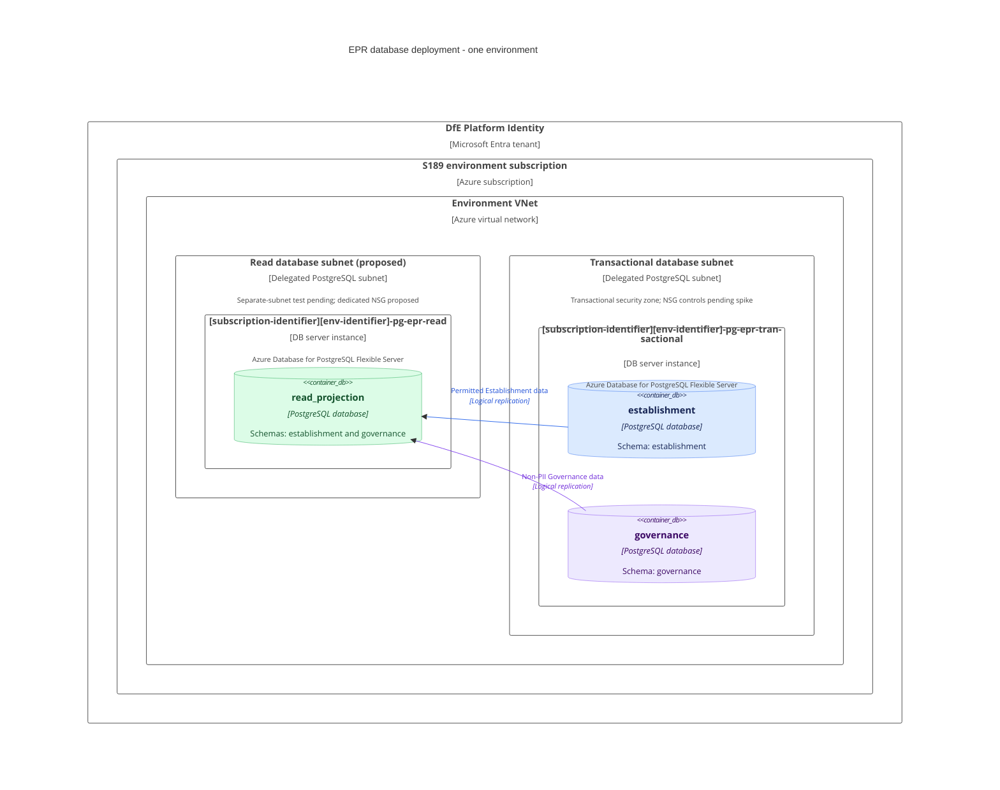

# BAU to EPR data platform design

This document describes the target database infrastructure, repository ownership and data flow for private-beta Find and Share. BAU remains the write authority. Its Establishment and Governance data is synchronised into the new domain models, with permitted data published to a separate Read Projection.

## DB topology

Each environment has two DB server instances in S189, using Azure Database for PostgreSQL Flexible Server. Each environment has its own DB server instances and databases.

| DB server instance name | Database name | Schemas |
| --- | --- | --- |
| `<subscription-identifier><env-identifier>-pg-epr-transactional` | `establishment` | `establishment` |
| `<subscription-identifier><env-identifier>-pg-epr-transactional`| `governance` | `governance` |
| `<subscription-identifier><env-identifier>-pg-epr-read` | `read_projection` | `establishment`, `governance` |

Database and schema names are identical across environments. The Read Projection is an independent DB server instance receiving logical replication, not an Azure physical read replica. The topology contains two DB server instances, without additional replica DB server instances.

### Separate DB server instances for separate security zones

Establishment and Governance share the transactional DB server instance because both transactional databases are in the same security zone. The Read Projection has its own DB server instance so that its network access can be controlled independently of the transactional data.

Network controls apply to the DB server instance endpoint, not to individual databases or schemas inside that DB server instance. Separate databases provide logical separation and database permissions, but cannot provide independent network isolation. Hosting the Read Projection on the transactional DB server instance would therefore expose the same endpoint to both transactional clients and read consumers.

The separate read DB server instance enables the required isolation; subnet and network rules enforce it. Read consumers must reach only the read DB server instance. Transactional access is restricted to approved domain services, ETL, administration and the replication connection. Database roles and grants still restrict access within each DB server instance.

These are target security requirements. The network controls needed to enforce them are not yet implemented.

### Infrastructure requirements and practices

* The current Terraform approach provisions DB server instances and databases; schema creation is expected to remain application-owned, as in the existing services. Existing PostgreSQL applications commonly use the `public` schema. The named `establishment` and `governance` schemas in this design remain the proposed target and must be created and maintained through application database migrations.
* Each AKS cluster currently has a single `postgres-subnet`. A separate subnet for the read DB server instance can be tested, but has not yet been established as a supported deployment pattern.
* AKS network security is not yet configured. A spike is planned, and the eventual security solution will follow its outcome. Implementation is expected to be at least a few months away; this is an indicative dependency, not a committed delivery date.

The two-DB-server-instance topology remains the target. Its network-isolation implementation depends on the separate-subnet test and AKS network-security work. Provisioning the DB server instances alone does not demonstrate that the required isolation has been achieved.

### Recommended network layout

The proposed target is a separate subnet and network security group (NSG) for each DB server instance, subject to the infrastructure team's subnet test and network-security spike. The diagram uses private access through VNet integration, with both database subnets delegated to `Microsoft.DBforPostgreSQL/flexibleServers`. There is no public database endpoint in this proposed layout. Private DNS and explicit NSG rules must allow the approved clients and deny unapproved traffic between security zones, including overriding Azure's default allowance for traffic within the VNet. Separate subnets alone do not isolate the DB server instances. The final controls and AKS-to-database access rules will be agreed from the spike's findings.


Suggested production names:

```text
Subscription:                       s189-teacher-services-cloud-production
Resource group:                     s189p01-epr-pd-rg
Transactional DB server instance:   s189p01-pg-epr-transactional
Read DB server instance:            s189p01-pg-epr-read
```

### C4 deployment diagram

The diagram represents one environment and the proposed VNet-integration layout, not the current deployment. Subnet names are descriptive placeholders. The separate read subnet is subject to testing, and the security controls are subject to the AKS network-security spike.




* DevOps owns the DB server instance and database infrastructure, together with network provisioning and controls agreed through the infrastructure work.
* Development teams create and maintain the [Establishment](../models/schema/establishment) and [Governance](../models/schema/governance) schemas and their contents through application database migrations. They also own logical replication configuration and the required schemas and tables in the Read Projection database.
## Git repo structure

Each component repository contains its database Terraform in a top-level `terraform` folder. 
* The Establishment API repository owns the shared transactional DB server instance and Establishment database.
* The Governance API repository owns the Governance database. 
* The web repository owns the Read Projection DB server instance and database.

```text
education-provider-registry-establishment-api/
|-- Establishment and Groups API
`-- terraform/
    |-- API infrastructure
    |-- Transactional DB server instance
    |-- establishment database and access permissions
    `-- Transactional DB server instance ID and endpoint outputs

education-provider-registry-governance-api/
|-- Governance API
`-- terraform/
    |-- API infrastructure
    `-- governance database and access permissions
        on the Establishment-owned transactional DB server instance

education-provider-registry-web/
|-- Web application
`-- terraform/
    |-- Web infrastructure
    |-- Read Projection DB server instance
    `-- read_projection database and access permissions
```


Read Projection Terraform currently lives in `education-provider-registry-data`. It is suggested that this is moved to `education-provider-registry-web`. 

## ETL process

ADF extracts and transforms BAU SQL Server data and loads both transactional databases daily. Native PostgreSQL logical replication copies the permitted base-table subset into the single Read Projection database using two source publications and two destination subscriptions.


The Read Projection contains no Governance PII, including in the initial copy and subsequent replication. The Establishment publication covers the current agreed data scope; extensions are subject to review. The two domains are eventually consistent.

* ETL and replication move domain data; they do not construct application view models. 
* Application teams own read models, indexes and any materialised views. 
* Development teams implement load validation, replication catch-up checks, refresh coordination, retries and reconciliation.
