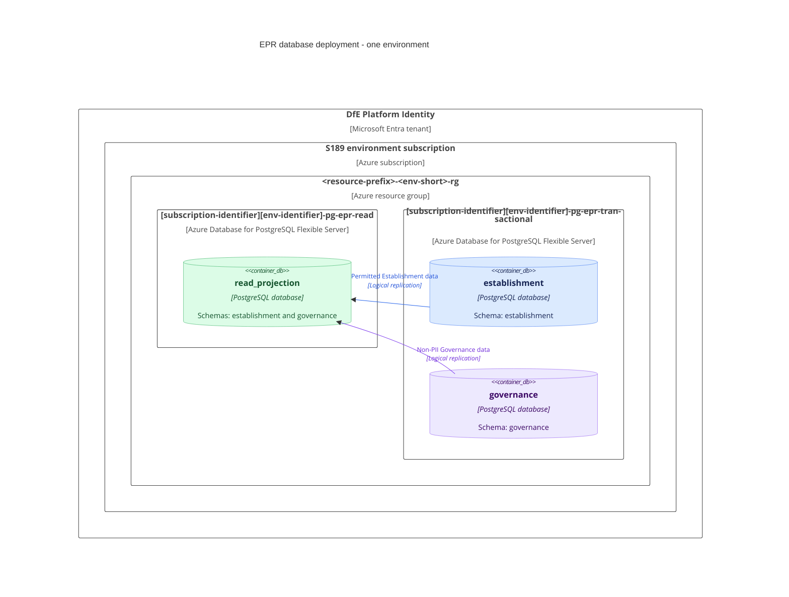
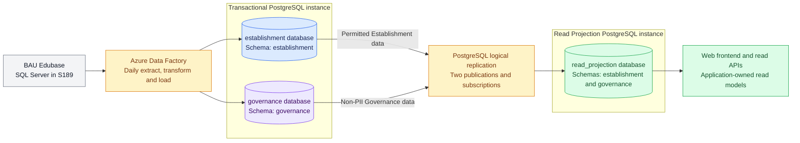

# BAU to EPR data platform design

This document describes the target database infrastructure, repository ownership and data flow for private-beta Find and Share. BAU remains the write authority. Its Establishment and Governance data is synchronised into the new domain models, with permitted data published to a separate Read Projection.

## DB topology

Each environment has two Azure Database for PostgreSQL Flexible Server instances in S189. Each environment has its own instances and databases.

| Instance name | Database name | Schemas |
| --- | --- | --- |
| `<subscription-identifier><env-identifier>-pg-epr-transactional` | `establishment` | `establishment` |
| `<subscription-identifier><env-identifier>-pg-epr-transactional`| `governance` | `governance` |
| `<subscription-identifier><env-identifier>-pg-epr-read` | `read_projection` | `establishment`, `governance` |

Database and schema names are identical across environments. The Read Projection is an independent server receiving logical replication, not an Azure physical read replica. The topology contains two instances, without separate replica instances.

Suggested production names:

```text
Subscription:          s189-teacher-services-cloud-production
Resource group:        s189p01-epr-pd-rg
Transactional server:  s189p01-pg-epr-transactional
Read server:           s189p01-pg-epr-read
```

### C4 deployment diagram

The diagram represents one environment. S158 and S189 share the Microsoft Entra tenant **DfE Platform Identity**, with domain `platform.education.gov.uk` (confirmed by the technical architect on 8 October 2026).




* DevOps owns the server, database and schema infrastructure. 
* Development teams own the [Establishment](../models/schema/establishment) and [Governance](../models/schema/governance) schema contents and logical replication configuration.
## Git repo structure

Each component repository contains its database Terraform in a top-level `terraform` folder. 
* The Establishment API repository owns the shared transactional server and Establishment database. 
* The Governance API repository owns the Governance database. 
* The web repository owns the Read Projection server and database.

```text
education-provider-registry-establishment-api/
|-- Establishment and Groups API
`-- terraform/
    |-- API infrastructure
    |-- Transactional PostgreSQL server
    |-- establishment database and access permissions
    `-- Transactional server ID and endpoint outputs

education-provider-registry-governance-api/
|-- Governance API
`-- terraform/
    |-- API infrastructure
    `-- governance database and access permissions
        on the Establishment-owned transactional server

education-provider-registry-web/
|-- Web application
`-- terraform/
    |-- Web infrastructure
    |-- Read Projection PostgreSQL server
    `-- read_projection database and access permissions
```


Read Projection Terraform currently lives in `education-provider-registry-data`. It is suggested that this is moved to `education-provider-registry-web`. 

## ETL process

ADF extracts and transforms BAU SQL Server data and loads both transactional databases daily. Native PostgreSQL logical replication copies the permitted base-table subset into the single Read Projection database using two source publications and two destination subscriptions.



The Read Projection contains no Governance PII, including in the initial copy and subsequent replication. The Establishment publication covers the current agreed data scope; extensions are subject to review. The two domains are eventually consistent.

* ETL and replication move domain data; they do not construct application view models. 
* Application teams own read models, indexes and any materialised views. 
* Development teams implement load validation, replication catch-up checks, refresh coordination, retries and reconciliation.
