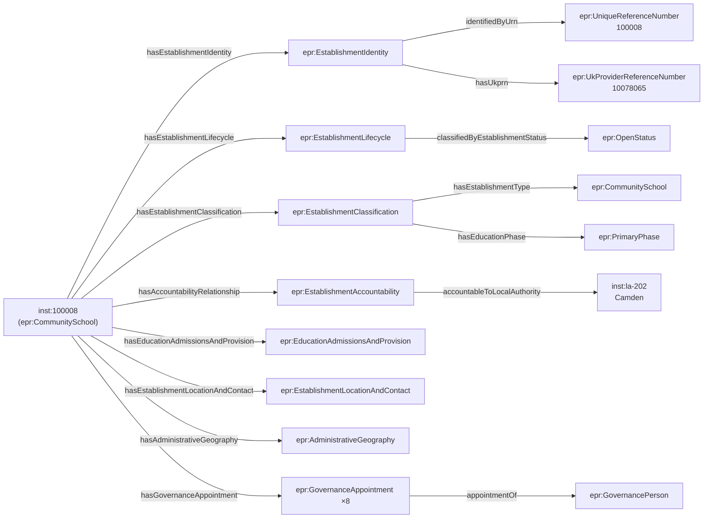

[← Worked examples](../)

# EPR Ontology — community school example

| | |
|---|---|
| **Establishment** | Argyle Primary School, URN 100008, Camden |
| **Type** | Community school (LA-maintained, primary) |
| **Ontology namespace** | `https://dfe-digital.github.io/education-provider-registry-docs/ontology/` |
| **Vocabulary namespace** | `https://dfe-digital.github.io/education-provider-registry-docs/vocabulary/` |
| **Preferred prefixes** | `epro:` (properties) · `epr:` (classes and named individuals) |
| **Version** | 1.4 |
| **OWL documentation** | [Ontology reference (WIDOCO)](/education-provider-registry-docs/ontology/) |
| **Source** | [education-provider-ontology.ttl](https://github.com/DFE-Digital/education-provider-registry-docs/blob/main/models/education-provider-ontology.ttl) |
| **Repository** | [DFE-Digital/education-provider-registry-docs](https://github.com/DFE-Digital/education-provider-registry-docs) |
| **Licence** | [Open Government Licence v3.0](https://www.nationalarchives.gov.uk/doc/open-government-licence/version/3/) |

---

**All personal names in this document are anonymised.** The establishment used in the examples (Argyle Primary School, URN 100008) is a real school drawn from the public GIAS extract. The headteacher name and all governor names have been replaced with fictional placeholders. No real personal data appears anywhere on this page.

---

The **Education Provider Registry Ontology** is an OWL 2 conceptual model for the Education Provider Registry. It declares classes and object properties for the entities and relationships in the GIAS Details view for state-funded education providers in England.

The ontology shares its class IRIs with the [epr: SKOS vocabulary](/education-provider-registry-docs/vocabulary/) through OWL 2 punning — the same URI is simultaneously a vocabulary concept (`skos:Concept`) and an OWL class (`owl:Class`). Closed enumerations (status, phase, gender, boarding, sixth form, special class provision, admissions policy, nursery provision) are declared as sets of `owl:NamedIndividual` within the ontology. Open-ended value sets (religious character, religious ethos, type of SEN provision) remain as `skos:Concept` in the vocabulary only.

The ontology is entirely `owl:ObjectProperty` — no `owl:DatatypeProperty` declarations are used. Literal values (identifiers, labels, dates) are represented as `rdfs:label` on typed blank nodes.

**Coverage:**

- Identity and identifiers — URN, UKPRN, UPRN, DfE number, local-authority-scoped establishment number
- Lifecycle — status, open date, closed date and reason
- Classification — 41 leaf establishment type classes in a subclass hierarchy, education phase, type group
- Accountability — relationships to local authority, academy trust or proprietor
- Education, admissions and provision — statutory age range, gender of entry, admissions policy, boarding, nursery, sixth form
- Location and contact — postal address, website, telephone, headteacher or principal
- Administrative geography — Government Office Region, parliamentary constituency, ward, LSOA, MSOA, OS grid reference
- SEN and resourced provision — type of SEN provision, resourced provision and SEN unit measures
- Governance — appointments, role types (22 named individuals), appointing bodies (18 named individuals), persons
- Establishment groups — multi-academy trusts, federations, sponsors, group membership and relationships

---

## Structure of an establishment record

The diagram below shows the top-level object properties that connect an `epr:Establishment` to its component records. Each component is a typed blank node or named individual.



---

## Namespace prefixes

All examples use the following prefixes.

```
@prefix epr:    <https://dfe-digital.github.io/education-provider-registry-docs/vocabulary/> .
@prefix epro:   <https://dfe-digital.github.io/education-provider-registry-docs/ontology/> .
@prefix rdf:    <http://www.w3.org/1999/02/22-rdf-syntax-ns#> .
@prefix rdfs:   <http://www.w3.org/2000/01/rdf-schema#> .
@prefix owl:    <http://www.w3.org/2002/07/owl#> .
@prefix xsd:    <http://www.w3.org/2001/XMLSchema#> .
@prefix inst:   <https://dfe-digital.github.io/education-provider-registry-docs/establishment/> .
```

---

## Example 1 — Identity and lifecycle

Every establishment has exactly one `epr:EstablishmentIdentity` and one `epr:EstablishmentLifecycle`. The identity groups the primary GIAS identifier (URN), the cross-sector identifier (UKPRN), and the local-authority-scoped establishment number that together form the DfE number. The local-authority-scoped number carries an `epr:IdentifierRole` to distinguish a current from a previous LAESTAB identity.

This example is drawn from **Argyle Primary School**, URN 100008, a community primary school in Camden. All personal names in these examples are anonymised.

```
inst:100008
    a epr:CommunitySchool ;

    epro:hasEstablishmentIdentity [
        a epr:EstablishmentIdentity ;

        epro:identifiedByUrn [
            a epr:UniqueReferenceNumber ;
            rdfs:label "100008"
        ] ;

        epro:hasUkprn [
            a epr:UkProviderReferenceNumber ;
            rdfs:label "10078065"
        ] ;

        epro:hasLocalAuthorityScopedEstablishmentNumber [
            a epr:LocalAuthorityScopedEstablishmentNumber ;
            epro:hasLocalAuthorityContext  inst:la-202 ;
            epro:hasEstablishmentNumberValue [
                a epr:EstablishmentNumber ;
                rdfs:label "2019"
            ] ;
            epro:hasIdentifierRole epr:CurrentIdentifierRole
        ]
    ] ;

    epro:hasEstablishmentLifecycle [
        a epr:EstablishmentLifecycle ;
        epro:classifiedByEstablishmentStatus epr:OpenStatus
    ] .

inst:la-202
    a epr:LocalAuthority ;
    rdfs:label "Camden"@en ;
    rdfs:comment "LA code 202"@en .
```

---

## Example 2 — Classification and accountability

An establishment's type, type group and education phase are grouped under `epr:EstablishmentClassification`. The establishment type IRI (`epr:CommunitySchool`) is both an OWL class (used to type the establishment instance) and an `owl:NamedIndividual` of type `epr:EstablishmentType` — OWL 2 punning, valid because the ontology uses OWL 2 DL.

The accountability relationship records which body is responsible for the establishment. For a community school this is the local authority that maintains it.

```
inst:100008
    a epr:CommunitySchool ;

    epro:hasEstablishmentClassification [
        a epr:EstablishmentClassification ;
        epro:hasEstablishmentType  epr:CommunitySchool ;
        epro:hasEducationPhase     epr:PrimaryPhase
    ] ;

    epro:hasAccountabilityRelationship [
        a epr:EstablishmentAccountability ;
        epro:accountableToLocalAuthority inst:la-202
    ] .
```

---

## Example 3 — Location, contact and administrative geography

Contact details, the postal address and the headteacher or principal are grouped under `epr:EstablishmentLocationAndContact`. Administrative geography — derived from the establishment's postcode via the GeoData lookup table — is a peer group on the establishment itself, not nested under location.

```
inst:100008
    a epr:CommunitySchool ;

    epro:hasEstablishmentLocationAndContact [
        a epr:EstablishmentLocationAndContact ;

        epro:hasMainAddress [
            a epr:MainAddress ;
            rdfs:label "Tonbridge Street, London, WC1H 9EG"
        ] ;

        epro:hasWebsite [
            a epr:Website ;
            rdfs:label "http://www.argyle.camden.sch.uk/"
        ] ;

        epro:hasTelephoneNumber [
            a epr:TelephoneNumber ;
            rdfs:label "02078374590"
        ] ;

        epro:hasHeadteacherOrPrincipal [
            a epr:HeadteacherOrPrincipal ;
            rdfs:label "Ms Jane Smith"@en
        ]
    ] ;

    epro:hasAdministrativeGeography [
        a epr:AdministrativeGeography ;

        epro:classifiedByGovernmentOfficeRegion [
            a epr:GovernmentOfficeRegion ;
            rdfs:label "London"@en
        ] ;

        epro:classifiedByParliamentaryConstituency [
            a epr:ParliamentaryConstituency ;
            rdfs:label "Holborn and St Pancras"@en ;
            rdfs:seeAlso <http://statistics.data.gov.uk/id/statistical-geography/E14001290>
        ]
    ] .
```

---

## Example 4 — Education, admissions and provision

Statutory age range, gender of entry, admissions policy, boarding provision and sixth-form provision are grouped under `epr:EducationAdmissionsAndProvision`. Each classification points to an `owl:NamedIndividual` from the closed enumeration declared in the ontology.

```
inst:100008
    a epr:CommunitySchool ;

    epro:hasEducationAdmissionsAndProvision [
        a epr:EducationAdmissionsAndProvision ;

        epro:hasStatutoryAgeRange [
            a epr:StatutoryAgeRange ;
            rdfs:label "3 to 11"
        ] ;

        epro:classifiedByGenderOfEntry      epr:MixedGenderEntry ;
        epro:classifiedByBoardingProvision  epr:NoBoarders ;
        epro:classifiedBySixthFormProvision epr:NoSixthForm
    ] .
```

---

## Example 5 — Governance appointments

Each governance appointment is a separate `epr:GovernanceAppointment` instance linked to the establishment via `epro:hasGovernanceAppointment`. The appointment records the role type, appointing body, governance identifier (GID), appointment date and term end date. The appointment is linked to a `epr:GovernancePerson` via `epro:appointmentOf`.

`epr:GovernanceAppointment` and `epr:GovernancePerson` are annotated with `dcterms:accessRights` in the ontology as personal-data-carrying classes. In a production deployment these records would not appear in a public serialisation without a separate access decision.

**All governor names below are anonymised.** The eight-person governing body is realistic in composition for a community primary school — one chair, the headteacher ex-officio, two parent governors, one staff governor, one local authority governor, and two co-opted governors — but every name is a fictional placeholder. No real personal data from the GIAS extract has been used.

```
inst:100008
    a epr:CommunitySchool ;

    epro:hasGovernanceAppointment [
        a epr:GovernanceAppointment ;
        epro:hasGovernanceRoleType       epr:ChairOfGovernorsRole ;
        epro:hasGovernanceAppointingBody epr:AppointedByGoverningBoard ;
        epro:hasGovernanceIdentifier     [ a epr:GovernanceIdentifier ; rdfs:label "GID-001" ] ;
        epro:hasGovernanceAppointmentDate [ a epr:GovernanceAppointmentDate ; rdfs:label "2022-09-01"^^xsd:date ] ;
        epro:hasGovernanceTermEndDate    [ a epr:GovernanceTermEndDate    ; rdfs:label "2026-08-31"^^xsd:date ] ;
        epro:appointmentOf [ a epr:GovernancePerson ; rdfs:label "Mr Robert Johnson"@en ]
    ] ;

    epro:hasGovernanceAppointment [
        a epr:GovernanceAppointment ;
        epro:hasGovernanceRoleType       epr:HeadteacherExOfficioGovernorRole ;
        epro:hasGovernanceAppointingBody epr:ExOfficioHeadteacher ;
        epro:hasGovernanceIdentifier     [ a epr:GovernanceIdentifier ; rdfs:label "GID-002" ] ;
        epro:hasGovernanceAppointmentDate [ a epr:GovernanceAppointmentDate ; rdfs:label "2019-04-01"^^xsd:date ] ;
        epro:appointmentOf [ a epr:GovernancePerson ; rdfs:label "Ms Jane Smith"@en ]
    ] ;

    epro:hasGovernanceAppointment [
        a epr:GovernanceAppointment ;
        epro:hasGovernanceRoleType       epr:GovernorRole ;
        epro:hasGovernanceAppointingBody epr:ElectedByParents ;
        epro:hasGovernanceIdentifier     [ a epr:GovernanceIdentifier ; rdfs:label "GID-003" ] ;
        epro:hasGovernanceAppointmentDate [ a epr:GovernanceAppointmentDate ; rdfs:label "2023-01-15"^^xsd:date ] ;
        epro:hasGovernanceTermEndDate    [ a epr:GovernanceTermEndDate    ; rdfs:label "2027-01-14"^^xsd:date ] ;
        epro:appointmentOf [ a epr:GovernancePerson ; rdfs:label "Mrs Mary Brown"@en ]
    ] ;

    epro:hasGovernanceAppointment [
        a epr:GovernanceAppointment ;
        epro:hasGovernanceRoleType       epr:GovernorRole ;
        epro:hasGovernanceAppointingBody epr:ElectedByParents ;
        epro:hasGovernanceIdentifier     [ a epr:GovernanceIdentifier ; rdfs:label "GID-004" ] ;
        epro:hasGovernanceAppointmentDate [ a epr:GovernanceAppointmentDate ; rdfs:label "2021-09-01"^^xsd:date ] ;
        epro:hasGovernanceTermEndDate    [ a epr:GovernanceTermEndDate    ; rdfs:label "2025-08-31"^^xsd:date ] ;
        epro:appointmentOf [ a epr:GovernancePerson ; rdfs:label "Mr David Wilson"@en ]
    ] ;

    epro:hasGovernanceAppointment [
        a epr:GovernanceAppointment ;
        epro:hasGovernanceRoleType       epr:GovernorRole ;
        epro:hasGovernanceAppointingBody epr:ElectedBySchoolStaff ;
        epro:hasGovernanceIdentifier     [ a epr:GovernanceIdentifier ; rdfs:label "GID-005" ] ;
        epro:hasGovernanceAppointmentDate [ a epr:GovernanceAppointmentDate ; rdfs:label "2022-03-01"^^xsd:date ] ;
        epro:hasGovernanceTermEndDate    [ a epr:GovernanceTermEndDate    ; rdfs:label "2026-02-28"^^xsd:date ] ;
        epro:appointmentOf [ a epr:GovernancePerson ; rdfs:label "Ms Sarah Davies"@en ]
    ] ;

    epro:hasGovernanceAppointment [
        a epr:GovernanceAppointment ;
        epro:hasGovernanceRoleType       epr:GovernorRole ;
        epro:hasGovernanceAppointingBody epr:NominatedByLaAppointedByGb ;
        epro:hasGovernanceIdentifier     [ a epr:GovernanceIdentifier ; rdfs:label "GID-006" ] ;
        epro:hasGovernanceAppointmentDate [ a epr:GovernanceAppointmentDate ; rdfs:label "2020-11-01"^^xsd:date ] ;
        epro:hasGovernanceTermEndDate    [ a epr:GovernanceTermEndDate    ; rdfs:label "2024-10-31"^^xsd:date ] ;
        epro:appointmentOf [ a epr:GovernancePerson ; rdfs:label "Mr Thomas Evans"@en ]
    ] ;

    epro:hasGovernanceAppointment [
        a epr:GovernanceAppointment ;
        epro:hasGovernanceRoleType       epr:GovernorRole ;
        epro:hasGovernanceAppointingBody epr:AppointedByGoverningBoard ;
        epro:hasGovernanceIdentifier     [ a epr:GovernanceIdentifier ; rdfs:label "GID-007" ] ;
        epro:hasGovernanceAppointmentDate [ a epr:GovernanceAppointmentDate ; rdfs:label "2021-06-01"^^xsd:date ] ;
        epro:hasGovernanceTermEndDate    [ a epr:GovernanceTermEndDate    ; rdfs:label "2025-05-31"^^xsd:date ] ;
        epro:appointmentOf [ a epr:GovernancePerson ; rdfs:label "Mrs Patricia Moore"@en ]
    ] ;

    epro:hasGovernanceAppointment [
        a epr:GovernanceAppointment ;
        epro:hasGovernanceRoleType       epr:GovernorRole ;
        epro:hasGovernanceAppointingBody epr:AppointedByGoverningBoard ;
        epro:hasGovernanceIdentifier     [ a epr:GovernanceIdentifier ; rdfs:label "GID-008" ] ;
        epro:hasGovernanceAppointmentDate [ a epr:GovernanceAppointmentDate ; rdfs:label "2023-09-01"^^xsd:date ] ;
        epro:hasGovernanceTermEndDate    [ a epr:GovernanceTermEndDate    ; rdfs:label "2027-08-31"^^xsd:date ] ;
        epro:appointmentOf [ a epr:GovernancePerson ; rdfs:label "Mr James Taylor"@en ]
    ] .
```

---

**See also:** [Academy (SAT) example](../academy/) · [Multi-academy trust example](../mat/)
