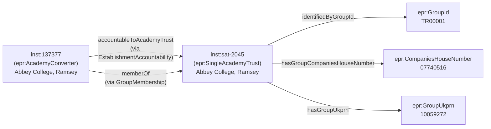

[← Worked examples](../)

# EPR Ontology — single-academy trust (SAT) example

| | |
|---|---|
| **Trust** | Abbey College, Ramsey (SAT) — Group ID TR00001, Companies House 07740516 |
| **Trust type** | Single-academy trust |
| **Member academy** | Abbey College, Ramsey, URN 137377, Cambridgeshire |
| **Ontology namespace** | `https://dfe-digital.github.io/education-provider-registry-docs/ontology/` |
| **Vocabulary namespace** | `https://dfe-digital.github.io/education-provider-registry-docs/vocabulary/` |
| **Preferred prefixes** | `epro:` (properties) · `epr:` (classes and named individuals) |
| **Version** | 1.4 |
| **OWL documentation** | [Ontology reference (WIDOCO)](/education-provider-registry-docs/ontology/) |
| **Source** | [education-provider-ontology.ttl](https://github.com/DFE-Digital/education-provider-registry-docs/blob/main/models/education-provider-ontology.ttl) |
| **Repository** | [DFE-Digital/education-provider-registry-docs](https://github.com/DFE-Digital/education-provider-registry-docs) |
| **Licence** | [Open Government Licence v3.0](https://www.nationalarchives.gov.uk/doc/open-government-licence/version/3/) |

---

**All personal names in this document are anonymised.** Establishment and trust names and identifiers are drawn from the public GIAS extract. No real personal data appears anywhere on this page.

---

This example focuses on the **trust side** of a single-academy trust arrangement — how a SAT is represented as an `epr:EstablishmentGroup` named individual in the EPR ontology. For the establishment (academy) side of the same data, see the [academy example](../academy/).

A **single-academy trust** is a charitable company that runs exactly one academy. Because the trust and the academy are legally separate entities, both appear in the EPR data model:

- The trust (`inst:sat-2045`) is an `epr:SingleAcademyTrust` with its own group-level identifiers — Group ID, UKPRN, Companies House number, and incorporation date.
- The academy (`inst:137377`) is an `epr:AcademyConverter` with its own establishment identifiers (URN, UKPRN, LAESTAB).
- The two are connected by **two complementary relationships**: the accountability relationship (the trust is responsible for the academy) and the group membership record (the academy joined the trust on a given date).

The key difference from a MAT: there is always exactly one member academy in a SAT. Both the accountability and the membership point to the same trust instance.

---

## Structure of a SAT



---

## Namespace prefixes

All examples use the following prefixes.

```turtle
@prefix epr:    <https://dfe-digital.github.io/education-provider-registry-docs/vocabulary/> .
@prefix epro:   <https://dfe-digital.github.io/education-provider-registry-docs/ontology/> .
@prefix rdf:    <http://www.w3.org/1999/02/22-rdf-syntax-ns#> .
@prefix rdfs:   <http://www.w3.org/2000/01/rdf-schema#> .
@prefix owl:    <http://www.w3.org/2002/07/owl#> .
@prefix xsd:    <http://www.w3.org/2001/XMLSchema#> .
@prefix inst:   <https://dfe-digital.github.io/education-provider-registry-docs/establishment/> .
```

---

## Example 1 — Trust identity

The trust is declared as a named individual (`inst:sat-2045`) of type `epr:SingleAcademyTrust`. It carries five group-level identifiers:

- **Group UID** — the GIAS internal numeric identifier for the group record
- **Group ID** — the trust register string identifier (format `TR\d+`)
- **Group UKPRN** — the UK Provider Reference Number assigned to the trust as a legal entity (distinct from the academy's own UKPRN)
- **Companies House number** — the trust's company registration number
- **Incorporation date** — when the trust company was incorporated

```turtle
inst:sat-2045
    a epr:SingleAcademyTrust ;
    rdfs:label "Abbey College, Ramsey"@en ;

    epro:hasGroupUniqueIdentifier [
        a epr:GroupUniqueIdentifier ;
        rdfs:label "2045"
    ] ;

    epro:identifiedByGroupId [
        a epr:GroupId ;
        rdfs:label "TR00001"
    ] ;

    epro:hasGroupUkprn [
        a epr:GroupUkprn ;
        rdfs:label "10059272"
    ] ;

    epro:hasGroupCompaniesHouseNumber [
        a epr:CompaniesHouseNumber ;
        rdfs:label "07740516"
    ] ;

    epro:hasGroupIncorporatedOnDate [
        a epr:GroupIncorporatedOnDate ;
        rdfs:label "2011-08-15"^^xsd:date
    ] .
```

---

## Example 2 — Accountability

The academy's accountability relationship uses `epro:accountableToAcademyTrust`, pointing to the trust named individual. This is the primary governance link — the trust is the body responsible for the academy.

```turtle
inst:137377
    a epr:AcademyConverter ;

    epro:hasAccountabilityRelationship [
        a epr:EstablishmentAccountability ;
        epro:accountableToAcademyTrust inst:sat-2045
    ] .
```

---

## Example 3 — Group membership

Separately from the accountability relationship, the academy also has a group membership record. The `epr:GroupMembership` class is a reified relationship — it separates the fact of membership (the accountability relationship) from the dated record of when the academy joined the trust. This allows the join date to be recorded without complicating the accountability structure.

```turtle
inst:137377
    a epr:AcademyConverter ;

    epro:hasGroupMembership [
        a epr:GroupMembership ;
        epro:memberOf inst:sat-2045 ;
        epro:hasGroupMembershipDate [
            a epr:GroupMembershipDate ;
            rdfs:label "2011-09-01"^^xsd:date    # approximate conversion date
        ]
    ] .
```

---

## Example 4 — Full record: trust and academy together

A complete snapshot showing the trust named individual alongside the academy's accountability and membership, as they would appear together in a single Turtle serialisation.

```turtle
# ── Trust ──────────────────────────────────────────────────────
inst:sat-2045
    a epr:SingleAcademyTrust ;
    rdfs:label "Abbey College, Ramsey"@en ;

    epro:hasGroupUniqueIdentifier [
        a epr:GroupUniqueIdentifier ;
        rdfs:label "2045"
    ] ;

    epro:identifiedByGroupId [
        a epr:GroupId ;
        rdfs:label "TR00001"
    ] ;

    epro:hasGroupUkprn [
        a epr:GroupUkprn ;
        rdfs:label "10059272"
    ] ;

    epro:hasGroupCompaniesHouseNumber [
        a epr:CompaniesHouseNumber ;
        rdfs:label "07740516"
    ] ;

    epro:hasGroupIncorporatedOnDate [
        a epr:GroupIncorporatedOnDate ;
        rdfs:label "2011-08-15"^^xsd:date
    ] .

# ── Academy ────────────────────────────────────────────────────
inst:137377
    a epr:AcademyConverter ;

    epro:hasAccountabilityRelationship [
        a epr:EstablishmentAccountability ;
        epro:accountableToAcademyTrust inst:sat-2045
    ] ;

    epro:hasGroupMembership [
        a epr:GroupMembership ;
        epro:memberOf inst:sat-2045 ;
        epro:hasGroupMembershipDate [
            a epr:GroupMembershipDate ;
            rdfs:label "2011-09-01"^^xsd:date
        ]
    ] .
```

---

## SAT vs MAT

Both SATs and MATs use identical object properties (`epro:accountableToAcademyTrust`, `epro:memberOf`, `epro:hasGroupMembership`). The difference is in the OWL class of the trust (`epr:SingleAcademyTrust` vs `epr:MultiAcademyTrust`) and the cardinality of members. In a SAT there is always exactly one member academy; in a MAT there are two or more.

| | SAT | MAT |
|---|---|---|
| Trust class | `epr:SingleAcademyTrust` | `epr:MultiAcademyTrust` |
| Member academies | Exactly 1 | 2 or more |
| Companies House number | Required | Required |
| Accountability property | `accountableToAcademyTrust` | `accountableToAcademyTrust` |
| Membership property | `hasGroupMembership → memberOf` | `hasGroupMembership → memberOf` |

---

**See also:** [Academy example (establishment view)](../academy/) · [Multi-academy trust example](../mat/)
