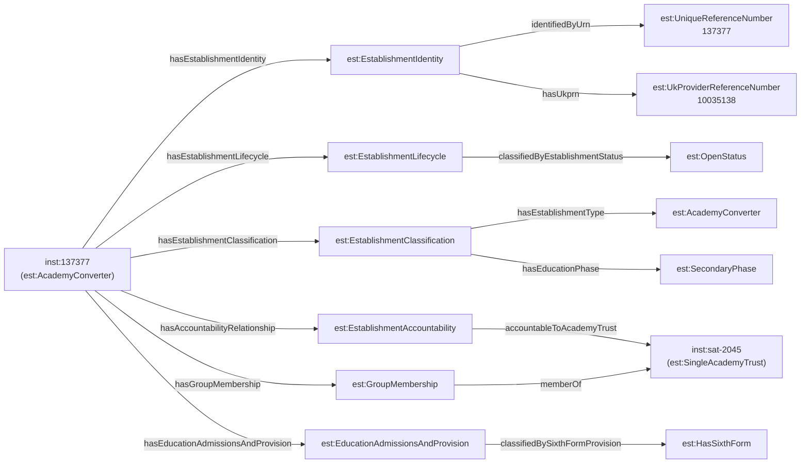

[← Worked examples](../)

# EPR Ontology — academy (SAT) example

| | |
|---|---|
| **Establishment** | Abbey College, Ramsey, URN 137377, Cambridgeshire |
| **Type** | Academy converter (secondary, single-academy trust) |
| **Trust** | Abbey College, Ramsey (SAT) — Group ID TR00001, Companies House 07740516 |
| **Ontology namespace** | `https://dfe-digital.github.io/education-provider-registry-docs/models/establishment/ontology/` |
| **Vocabulary namespace** | `https://dfe-digital.github.io/education-provider-registry-docs/models/establishment/vocabulary/` |
| **Preferred prefixes** | `esto:` (properties) · `est:` (classes and named individuals) |
| **Version** | 1.4 |
| **OWL documentation** | [Ontology reference (WIDOCO)](/education-provider-registry-docs/models/establishment/ontology/) |
| **Source** | [establishment-ontology.ttl](https://github.com/DFE-Digital/education-provider-registry-docs/blob/main/models/establishment/establishment-ontology.ttl) |
| **Repository** | [DFE-Digital/education-provider-registry-docs](https://github.com/DFE-Digital/education-provider-registry-docs) |
| **Licence** | [Open Government Licence v3.0](https://www.nationalarchives.gov.uk/doc/open-government-licence/version/3/) |

---

**All personal names in this document are anonymised.** The establishment used in the examples (Abbey College, Ramsey, URN 137377) is a real school drawn from the public GIAS extract. The headteacher name has been replaced with a fictional placeholder. No real personal data appears anywhere on this page.

---

This example shows how an **academy converter** differs from a community school in the EPR ontology. The two key structural differences are:

1. **Accountability** — the establishment is accountable to an `est:AcademyTrust` via `esto:accountableToAcademyTrust`, not to a local authority. The local authority is still present in the identity block (as the context for the LAESTAB number) but plays no accountability role.
2. **Group membership** — the establishment is also linked to the trust via `esto:hasGroupMembership`, which carries the join date. For a single-academy trust, both the accountability and the membership point to the same trust instance.

Abbey College, Ramsey is a non-selective secondary (11–18, with sixth form). It converted to academy status and formed its own SAT in August 2011.

---

## Structure of an academy record



---

## Namespace prefixes

All examples use the following prefixes.

```
@prefix est:    <https://dfe-digital.github.io/education-provider-registry-docs/models/establishment/vocabulary/> .
@prefix esto:   <https://dfe-digital.github.io/education-provider-registry-docs/models/establishment/ontology/> .
@prefix rdf:    <http://www.w3.org/1999/02/22-rdf-syntax-ns#> .
@prefix rdfs:   <http://www.w3.org/2000/01/rdf-schema#> .
@prefix owl:    <http://www.w3.org/2002/07/owl#> .
@prefix xsd:    <http://www.w3.org/2001/XMLSchema#> .
@prefix inst:   <https://dfe-digital.github.io/education-provider-registry-docs/establishment/> .
```

---

## Example 1 — Identity and lifecycle

The identity block for an academy is identical in structure to a community school. The local authority context (`inst:la-873`) is present in the LAESTAB number because Cambridgeshire is the geographic local authority, but the LA plays no accountability role for this establishment.

```
inst:137377
    a est:AcademyConverter ;

    esto:hasEstablishmentIdentity [
        a est:EstablishmentIdentity ;

        esto:identifiedByUrn [
            a est:UniqueReferenceNumber ;
            rdfs:label "137377"
        ] ;

        esto:hasUkprn [
            a est:UkProviderReferenceNumber ;
            rdfs:label "10035138"
        ] ;

        esto:hasLocalAuthorityScopedEstablishmentNumber [
            a est:LocalAuthorityScopedEstablishmentNumber ;
            esto:hasLocalAuthorityContext  inst:la-873 ;
            esto:hasEstablishmentNumberValue [
                a est:EstablishmentNumber ;
                rdfs:label "4603"
            ] ;
            esto:hasIdentifierRole est:CurrentIdentifierRole
        ]
    ] ;

    esto:hasEstablishmentLifecycle [
        a est:EstablishmentLifecycle ;
        esto:classifiedByEstablishmentStatus est:OpenStatus
    ] .

inst:la-873
    a est:LocalAuthority ;
    rdfs:label "Cambridgeshire"@en ;
    rdfs:comment "LA code 873"@en .
```

---

## Example 2 — Classification and accountability

The establishment type is `est:AcademyConverter`. The accountability relationship uses `esto:accountableToAcademyTrust` pointing to the single-academy trust (`inst:sat-2045`). There is no `accountableToLocalAuthority` property — academies are not LA-maintained.

```
inst:137377
    a est:AcademyConverter ;

    esto:hasEstablishmentClassification [
        a est:EstablishmentClassification ;
        esto:hasEstablishmentType  est:AcademyConverter ;
        esto:hasEducationPhase     est:SecondaryPhase
    ] ;

    esto:hasAccountabilityRelationship [
        a est:EstablishmentAccountability ;
        esto:accountableToAcademyTrust inst:sat-2045
    ] .
```

---

## Example 3 — Location, contact and administrative geography

```
inst:137377
    a est:AcademyConverter ;

    esto:hasEstablishmentLocationAndContact [
        a est:EstablishmentLocationAndContact ;

        esto:hasMainAddress [
            a est:MainAddress ;
            rdfs:label "Abbey Road, Ramsey, PE26 1DG"
        ] ;

        esto:hasWebsite [
            a est:Website ;
            rdfs:label "https://www.abbey.college/"
        ] ;

        esto:hasTelephoneNumber [
            a est:TelephoneNumber ;
            rdfs:label "01487812352"
        ] ;

        esto:hasHeadteacherOrPrincipal [
            a est:HeadteacherOrPrincipal ;
            rdfs:label "Mr Andrew Clarke"@en
        ]
    ] ;

    esto:hasAdministrativeGeography [
        a est:AdministrativeGeography ;

        esto:classifiedByGovernmentOfficeRegion [
            a est:GovernmentOfficeRegion ;
            rdfs:label "East of England"@en
        ] ;

        esto:classifiedByParliamentaryConstituency [
            a est:ParliamentaryConstituency ;
            rdfs:label "North West Cambridgeshire"@en ;
            rdfs:seeAlso <http://statistics.data.gov.uk/id/statistical-geography/E14001401>
        ]
    ] .
```

---

## Example 4 — Education, admissions and provision

Abbey College is non-selective, mixed, no boarding, and has a sixth form. The sixth form is represented by the `est:HasSixthForm` named individual (contrasting with `est:NoSixthForm` in the community school example).

```
inst:137377
    a est:AcademyConverter ;

    esto:hasEducationAdmissionsAndProvision [
        a est:EducationAdmissionsAndProvision ;

        esto:hasStatutoryAgeRange [
            a est:StatutoryAgeRange ;
            rdfs:label "11 to 18"
        ] ;

        esto:classifiedByAdmissionsPolicy   est:NonSelectiveAdmissions ;
        esto:classifiedByGenderOfEntry      est:MixedGenderEntry ;
        esto:classifiedByBoardingProvision  est:NoBoarders ;
        esto:classifiedBySixthFormProvision est:HasSixthForm
    ] .
```

---

## Example 5 — Trust identity (single-academy trust)

The trust is a named individual (`inst:sat-2045`) of type `est:SingleAcademyTrust`. It carries the group-level identifiers: the GIAS internal group UID, the Group ID (used in trust registers), the UKPRN assigned to the trust organisation, the Companies House number, and the incorporation date.

The establishment also has a `est:GroupMembership` linking it to the trust, which records when the academy joined. For a SAT, this is the same trust as in the accountability relationship — both point to `inst:sat-2045`.

Trust (`inst:sat-2045`):

```
inst:sat-2045
    a est:SingleAcademyTrust ;
    rdfs:label "Abbey College, Ramsey"@en ;

    esto:hasGroupUniqueIdentifier [
        a est:GroupUniqueIdentifier ;
        rdfs:label "2045"
    ] ;

    esto:identifiedByGroupId [
        a est:GroupId ;
        rdfs:label "TR00001"
    ] ;

    esto:hasGroupUkprn [
        a est:GroupUkprn ;
        rdfs:label "10059272"
    ] ;

    esto:hasGroupCompaniesHouseNumber [
        a est:CompaniesHouseNumber ;
        rdfs:label "07740516"
    ] ;

    esto:hasGroupIncorporatedOnDate [
        a est:GroupIncorporatedOnDate ;
        rdfs:label "2011-08-15"^^xsd:date
    ] .
```

Group membership linking the academy to its trust:

```
inst:137377
    a est:AcademyConverter ;

    esto:hasGroupMembership [
        a est:GroupMembership ;
        esto:memberOf inst:sat-2045 ;
        esto:hasGroupMembershipDate [
            a est:GroupMembershipDate ;
            rdfs:label "2011-09-01"^^xsd:date
        ]
    ] .
```

---

## Example 6 — Governance

Governance appointments (governors, trustees, members, local governors and governance professionals) are no longer modelled directly on the establishment or trust entity within this ontology. They are modelled by the dedicated governance model (`gov:`/`govo:` namespace, `models/governance/governance-ontology.ttl`), which links to `est:Establishment`, `est:AcademyTrust` and `est:Federation` via `govo:hasGovernanceAppointment` - a property with no fixed domain, so it applies directly to this establishment/trust without needing a separate establishment-side governance property.

See the [governance model](../../governance/) and its [worked examples](../../governance/worked-examples/) for how appointments, role types, appointing bodies and terms of office are represented.

---

**See also:** [Community school example](../community-school/) · [SAT example (trust view)](../sat/) · [Multi-academy trust example](../mat/)
