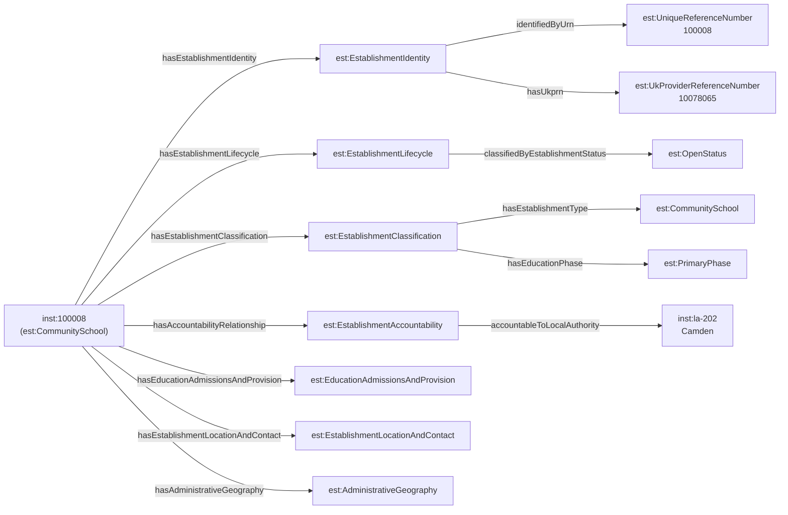

[← Worked examples](../)

# EPR Ontology — community school example

| | |
|---|---|
| **Establishment** | Argyle Primary School, URN 100008, Camden |
| **Type** | Community school (LA-maintained, primary) |
| **Ontology namespace** | `https://dfe-digital.github.io/education-provider-registry-docs/models/establishment/ontology/` |
| **Vocabulary namespace** | `https://dfe-digital.github.io/education-provider-registry-docs/models/establishment/vocabulary/` |
| **Preferred prefixes** | `esto:` (properties) · `est:` (classes and named individuals) |
| **Version** | 1.4 |
| **OWL documentation** | [Ontology reference (WIDOCO)](/education-provider-registry-docs/models/establishment/ontology/) |
| **Source** | [establishment-ontology.ttl](https://github.com/DFE-Digital/education-provider-registry-docs/blob/main/models/establishment/establishment-ontology.ttl) |
| **Repository** | [DFE-Digital/education-provider-registry-docs](https://github.com/DFE-Digital/education-provider-registry-docs) |
| **Licence** | [Open Government Licence v3.0](https://www.nationalarchives.gov.uk/doc/open-government-licence/version/3/) |

---

**All personal names in this document are anonymised.** The establishment used in the examples (Argyle Primary School, URN 100008) is a real school drawn from the public GIAS extract. The headteacher name and all governor names have been replaced with fictional placeholders. No real personal data appears anywhere on this page.

---

The **Education Provider Registry Ontology** is an OWL 2 conceptual model for the Education Provider Registry. It declares classes and object properties for the entities and relationships in the GIAS Details view for state-funded education providers in England.

The ontology shares its class IRIs with the [est: SKOS vocabulary](/education-provider-registry-docs/models/establishment/vocabulary/) through OWL 2 punning — the same URI is simultaneously a vocabulary concept (`skos:Concept`) and an OWL class (`owl:Class`). Closed enumerations (status, phase, gender, boarding, sixth form, special class provision, admissions policy, nursery provision) are declared as sets of `owl:NamedIndividual` within the ontology. Open-ended value sets (religious character, religious ethos, type of SEN provision) remain as `skos:Concept` in the vocabulary only.

The ontology is entirely `owl:ObjectProperty` — no `owl:DatatypeProperty` declarations are used. Literal values (identifiers, labels, dates) are represented as `rdfs:label` on typed blank nodes.

**Coverage:**

- Identity and identifiers — URN, UKPRN, UPRN, DfE number, local-authority-scoped establishment number
- Lifecycle — status, open date, closed date and reason
- Classification — 41 leaf establishment type classes in a subclass hierarchy, education phase, type group
- Accountability — relationships to local authority, academy trust or proprietor
- Education, admissions and provision — statutory age range, gender of entry, admissions policy, boarding, nursery, sixth form
- Location and contact — postal address, website, telephone, headteacher or principal
- Administrative geography — Government Office Region, parliamentary constituency, ward, LSOA, MSOA, OS grid reference
- SEN and resourced provision — type of SEN provision, resourced provision and SEN unit measures
- Establishment groups — multi-academy trusts, federations, sponsors, group membership and relationships

Governance appointments (governors, trustees, members and appointing bodies) are modelled separately by the [governance model](../../governance/), not by this ontology - see the "Governance" example below.

---

## Structure of an establishment record

The diagram below shows the top-level object properties that connect an `est:Establishment` to its component records. Each component is a typed blank node or named individual.



Governance appointments attach to `inst:100008` via `govo:hasGovernanceAppointment` (from the governance model, not shown here) - see the "Governance" example below.

---

## Namespace prefixes

All examples use the following prefixes.

```
@prefix est:    <https://dfe-digital.github.io/education-provider-registry-docs/models/establishment/vocabulary/> .
@prefix esto:   <https://dfe-digital.github.io/education-provider-registry-docs/models/establishment/ontology/> .
@prefix rdf:    <http://www.w3.org/1999/02/22-rdf-syntax-ns#> .
@prefix rdfs:   <http://www.w3.org/2000/01/rdf-schema#> .
@prefix owl:    <http://www.w3.org/2002/07/owl#> .
@prefix xsd:    <http://www.w3.org/2001/XMLSchema#> .
@prefix inst:   <https://dfe-digital.github.io/education-provider-registry-docs/establishment/> .
```

---

## Example 1 — Identity and lifecycle

Every establishment has exactly one `est:EstablishmentIdentity` and one `est:EstablishmentLifecycle`. The identity groups the primary GIAS identifier (URN), the cross-sector identifier (UKPRN), and the local-authority-scoped establishment number that together form the DfE number. The local-authority-scoped number carries an `est:IdentifierRole` to distinguish a current from a previous LAESTAB identity.

This example is drawn from **Argyle Primary School**, URN 100008, a community primary school in Camden. All personal names in these examples are anonymised.

```
inst:100008
    a est:CommunitySchool ;

    esto:hasEstablishmentIdentity [
        a est:EstablishmentIdentity ;

        esto:identifiedByUrn [
            a est:UniqueReferenceNumber ;
            rdfs:label "100008"
        ] ;

        esto:hasUkprn [
            a est:UkProviderReferenceNumber ;
            rdfs:label "10078065"
        ] ;

        esto:hasLocalAuthorityScopedEstablishmentNumber [
            a est:LocalAuthorityScopedEstablishmentNumber ;
            esto:hasLocalAuthorityContext  inst:la-202 ;
            esto:hasEstablishmentNumberValue [
                a est:EstablishmentNumber ;
                rdfs:label "2019"
            ] ;
            esto:hasIdentifierRole est:CurrentIdentifierRole
        ]
    ] ;

    esto:hasEstablishmentLifecycle [
        a est:EstablishmentLifecycle ;
        esto:classifiedByEstablishmentStatus est:OpenStatus
    ] .

inst:la-202
    a est:LocalAuthority ;
    rdfs:label "Camden"@en ;
    rdfs:comment "LA code 202"@en .
```

---

## Example 2 — Classification and accountability

An establishment's type, type group and education phase are grouped under `est:EstablishmentClassification`. The establishment type IRI (`est:CommunitySchool`) is both an OWL class (used to type the establishment instance) and an `owl:NamedIndividual` of type `est:EstablishmentType` — OWL 2 punning, valid because the ontology uses OWL 2 DL.

The accountability relationship records which body is responsible for the establishment. For a community school this is the local authority that maintains it.

```
inst:100008
    a est:CommunitySchool ;

    esto:hasEstablishmentClassification [
        a est:EstablishmentClassification ;
        esto:hasEstablishmentType  est:CommunitySchool ;
        esto:hasEducationPhase     est:PrimaryPhase
    ] ;

    esto:hasAccountabilityRelationship [
        a est:EstablishmentAccountability ;
        esto:accountableToLocalAuthority inst:la-202
    ] .
```

---

## Example 3 — Location, contact and administrative geography

Contact details, the postal address and the headteacher or principal are grouped under `est:EstablishmentLocationAndContact`. Administrative geography — derived from the establishment's postcode via the GeoData lookup table — is a peer group on the establishment itself, not nested under location.

```
inst:100008
    a est:CommunitySchool ;

    esto:hasEstablishmentLocationAndContact [
        a est:EstablishmentLocationAndContact ;

        esto:hasMainAddress [
            a est:MainAddress ;
            rdfs:label "Tonbridge Street, London, WC1H 9EG"
        ] ;

        esto:hasWebsite [
            a est:Website ;
            rdfs:label "http://www.argyle.camden.sch.uk/"
        ] ;

        esto:hasTelephoneNumber [
            a est:TelephoneNumber ;
            rdfs:label "02078374590"
        ] ;

        esto:hasHeadteacherOrPrincipal [
            a est:HeadteacherOrPrincipal ;
            rdfs:label "Ms Jane Smith"@en
        ]
    ] ;

    esto:hasAdministrativeGeography [
        a est:AdministrativeGeography ;

        esto:classifiedByGovernmentOfficeRegion [
            a est:GovernmentOfficeRegion ;
            rdfs:label "London"@en
        ] ;

        esto:classifiedByParliamentaryConstituency [
            a est:ParliamentaryConstituency ;
            rdfs:label "Holborn and St Pancras"@en ;
            rdfs:seeAlso <http://statistics.data.gov.uk/id/statistical-geography/E14001290>
        ]
    ] .
```

---

## Example 4 — Education, admissions and provision

Statutory age range, gender of entry, admissions policy, boarding provision and sixth-form provision are grouped under `est:EducationAdmissionsAndProvision`. Each classification points to an `owl:NamedIndividual` from the closed enumeration declared in the ontology.

```
inst:100008
    a est:CommunitySchool ;

    esto:hasEducationAdmissionsAndProvision [
        a est:EducationAdmissionsAndProvision ;

        esto:hasStatutoryAgeRange [
            a est:StatutoryAgeRange ;
            rdfs:label "3 to 11"
        ] ;

        esto:classifiedByGenderOfEntry      est:MixedGenderEntry ;
        esto:classifiedByBoardingProvision  est:NoBoarders ;
        esto:classifiedBySixthFormProvision est:NoSixthForm
    ] .
```

---

## Example 5 — Governance

Governance appointments (governors, trustees, members, local governors and governance professionals) are no longer modelled directly on the establishment or trust entity within this ontology. They are modelled by the dedicated governance model (`gov:`/`govo:` namespace, `models/governance/governance-ontology.ttl`), which links to `est:Establishment`, `est:AcademyTrust` and `est:Federation` via `govo:hasGovernanceAppointment` - a property with no fixed domain, so it applies directly to this establishment/trust without needing a separate establishment-side governance property.

See the [governance model](../../governance/) and its [worked examples](../../governance/worked-examples/) for how appointments, role types, appointing bodies and terms of office are represented.

---

**See also:** [Academy (SAT) example](../academy/) · [Multi-academy trust example](../mat/)
