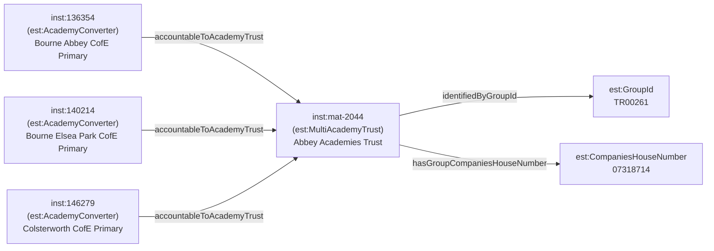

[← Worked examples](../)

# EPR Ontology — multi-academy trust example

| | |
|---|---|
| **Trust** | Abbey Academies Trust — Group ID TR00261, Companies House 07318714 |
| **Trust type** | Multi-academy trust (MAT) |
| **Member used in examples** | Bourne Abbey Church of England Primary Academy, URN 136354, Lincolnshire |
| **Ontology namespace** | `https://dfe-digital.github.io/education-provider-registry-docs/models/establishment/ontology/` |
| **Vocabulary namespace** | `https://dfe-digital.github.io/education-provider-registry-docs/models/establishment/vocabulary/` |
| **Preferred prefixes** | `esto:` (properties) · `est:` (classes and named individuals) |
| **Version** | 1.4 |
| **OWL documentation** | [Ontology reference (WIDOCO)](/education-provider-registry-docs/models/establishment/ontology/) |
| **Source** | [establishment-ontology.ttl](https://github.com/DFE-Digital/education-provider-registry-docs/blob/main/models/establishment/establishment-ontology.ttl) |
| **Repository** | [DFE-Digital/education-provider-registry-docs](https://github.com/DFE-Digital/education-provider-registry-docs) |
| **Licence** | [Open Government Licence v3.0](https://www.nationalarchives.gov.uk/doc/open-government-licence/version/3/) |

---

**All personal names in this document are anonymised.** Establishment names and identifiers are drawn from the public GIAS extract. The headteacher name has been replaced with a fictional placeholder. No real personal data appears anywhere on this page.

---

This example shows how a **multi-academy trust** and its member academies are represented in the EPR ontology. The key structural features are:

1. **The trust is a named individual** — `est:MultiAcademyTrust` carries group-level identifiers: Group ID, UKPRN, Companies House number, and incorporation date.
2. **Each member academy has an accountability relationship** to the MAT via `esto:accountableToAcademyTrust`.
3. **Each member academy has a group membership record** (`est:GroupMembership`) with a join date, linked to the trust via `esto:memberOf`.
4. **Religious character** is an open-ended value set (SKOS concept from the vocabulary) rather than an OWL named individual. The three academies in this trust all have Church of England character.

Abbey Academies Trust was incorporated in July 2010 and has three member academies, all Church of England primary schools in the South Lincolnshire area. Bourne Abbey Church of England Primary Academy (URN 136354) is the founding member, joining at incorporation in December 2010.

---

## Structure of a MAT and its members



---

## Namespace prefixes

All examples use the following prefixes.

```
@prefix est:    <https://dfe-digital.github.io/education-provider-registry-docs/models/establishment/vocabulary/> .
@prefix esto:   <https://dfe-digital.github.io/education-provider-registry-docs/models/establishment/ontology/> .
@prefix rdf:    <http://www.w3.org/1999/02/22-rdf-syntax-ns#> .
@prefix rdfs:   <http://www.w3.org/2000/01/rdf-schema#> .
@prefix owl:    <http://www.w3.org/2002/07/owl#> .
@prefix xsd:    <http://www.w3.org/2001/XMLSchema#> .
@prefix inst:   <https://dfe-digital.github.io/education-provider-registry-docs/establishment/> .
```

---

## Example 1 — Trust identity

The trust is a named individual (`inst:mat-2044`) of type `est:MultiAcademyTrust`. It carries the group UID (the GIAS internal identifier), the Group ID (the trust register identifier), the UKPRN assigned to the trust organisation, the Companies House number, and the date the trust was incorporated.

```
inst:mat-2044
    a est:MultiAcademyTrust ;
    rdfs:label "Abbey Academies Trust"@en ;

    esto:hasGroupUniqueIdentifier [
        a est:GroupUniqueIdentifier ;
        rdfs:label "2044"
    ] ;

    esto:identifiedByGroupId [
        a est:GroupId ;
        rdfs:label "TR00261"
    ] ;

    esto:hasGroupUkprn [
        a est:GroupUkprn ;
        rdfs:label "10058308"
    ] ;

    esto:hasGroupCompaniesHouseNumber [
        a est:CompaniesHouseNumber ;
        rdfs:label "07318714"
    ] ;

    esto:hasGroupIncorporatedOnDate [
        a est:GroupIncorporatedOnDate ;
        rdfs:label "2010-07-19"^^xsd:date
    ] .
```

---

## Example 2 — Member academy identity and lifecycle

Bourne Abbey Church of England Primary Academy was the founding member of the trust. Its identity structure is the same as any academy — URN, UKPRN, and the LAESTAB number scoped to Lincolnshire (LA code 925). The local authority appears here as geographic context only.

```
inst:136354
    a est:AcademyConverter ;

    esto:hasEstablishmentIdentity [
        a est:EstablishmentIdentity ;

        esto:identifiedByUrn [
            a est:UniqueReferenceNumber ;
            rdfs:label "136354"
        ] ;

        esto:hasUkprn [
            a est:UkProviderReferenceNumber ;
            rdfs:label "10032221"
        ] ;

        esto:hasLocalAuthorityScopedEstablishmentNumber [
            a est:LocalAuthorityScopedEstablishmentNumber ;
            esto:hasLocalAuthorityContext  inst:la-925 ;
            esto:hasEstablishmentNumberValue [
                a est:EstablishmentNumber ;
                rdfs:label "3510"
            ] ;
            esto:hasIdentifierRole est:CurrentIdentifierRole
        ]
    ] ;

    esto:hasEstablishmentLifecycle [
        a est:EstablishmentLifecycle ;
        esto:classifiedByEstablishmentStatus est:OpenStatus
    ] .

inst:la-925
    a est:LocalAuthority ;
    rdfs:label "Lincolnshire"@en ;
    rdfs:comment "LA code 925"@en .
```

---

## Example 3 — Classification, accountability and religious character

The accountability relationship points to the MAT (`inst:mat-2044`). Religious character (`est:ChurchOfEnglandCharacter`) is a SKOS concept from the open-ended vocabulary — it uses the same `est:` namespace but is a `skos:Concept`, not an `owl:NamedIndividual`. This means it is represented differently from closed-enumeration values like `est:PrimaryPhase`.

```
inst:136354
    a est:AcademyConverter ;

    esto:hasEstablishmentClassification [
        a est:EstablishmentClassification ;
        esto:hasEstablishmentType          est:AcademyConverter ;
        esto:hasEducationPhase             est:PrimaryPhase ;
        esto:classifiedByReligiousCharacter est:ChurchOfEnglandCharacter
    ] ;

    esto:hasAccountabilityRelationship [
        a est:EstablishmentAccountability ;
        esto:accountableToAcademyTrust inst:mat-2044
    ] .
```

---

## Example 4 — Education, admissions and provision

Primary academy, mixed, non-selective, no boarding, no sixth form. The age range (2–11) reflects the school's early years provision.

```
inst:136354
    a est:AcademyConverter ;

    esto:hasEstablishmentLocationAndContact [
        a est:EstablishmentLocationAndContact ;

        esto:hasMainAddress [
            a est:MainAddress ;
            rdfs:label "Abbey Road, Bourne, PE10 9EP"
        ] ;

        esto:hasWebsite [
            a est:Website ;
            rdfs:label "https://www.bourneabbeyprimary.co.uk/"
        ] ;

        esto:hasTelephoneNumber [
            a est:TelephoneNumber ;
            rdfs:label "01778422163"
        ] ;

        esto:hasHeadteacherOrPrincipal [
            a est:HeadteacherOrPrincipal ;
            rdfs:label "Mrs Catherine Harrison"@en
        ]
    ] ;

    esto:hasEducationAdmissionsAndProvision [
        a est:EducationAdmissionsAndProvision ;

        esto:hasStatutoryAgeRange [
            a est:StatutoryAgeRange ;
            rdfs:label "2 to 11"
        ] ;

        esto:classifiedByAdmissionsPolicy   est:NonSelectiveAdmissions ;
        esto:classifiedByGenderOfEntry      est:MixedGenderEntry ;
        esto:classifiedByBoardingProvision  est:NoBoarders ;
        esto:classifiedBySixthFormProvision est:NoSixthForm
    ] .
```

---

## Example 5 — Group membership

Each member academy has a `est:GroupMembership` record carrying the date it joined the trust. A single establishment can be a member of more than one group simultaneously (for example, a federation and a trust), so membership is a separate class rather than a direct link.

The three members of Abbey Academies Trust joined at different times as the trust grew. The founding member (URN 136354) joined at trust formation in December 2010; the second academy joined in September 2014; the third in September 2018.

Bourne Abbey Church of England Primary Academy (URN 136354) — founding member, joined December 2010:

```
inst:136354
    a est:AcademyConverter ;
    esto:hasGroupMembership [
        a est:GroupMembership ;
        esto:memberOf inst:mat-2044 ;
        esto:hasGroupMembershipDate [
            a est:GroupMembershipDate ;
            rdfs:label "2010-12-01"^^xsd:date
        ]
    ] .
```

Bourne Elsea Park Church of England Primary Academy (URN 140214) — joined September 2014:

```
inst:140214
    a est:AcademyConverter ;
    esto:hasGroupMembership [
        a est:GroupMembership ;
        esto:memberOf inst:mat-2044 ;
        esto:hasGroupMembershipDate [
            a est:GroupMembershipDate ;
            rdfs:label "2014-09-01"^^xsd:date
        ]
    ] .
```

Colsterworth Church of England Primary School (URN 146279) — joined September 2018:

```
inst:146279
    a est:AcademyConverter ;
    esto:hasGroupMembership [
        a est:GroupMembership ;
        esto:memberOf inst:mat-2044 ;
        esto:hasGroupMembershipDate [
            a est:GroupMembershipDate ;
            rdfs:label "2018-09-01"^^xsd:date
        ]
    ] .
```

---

## Example 6 — Governance

Governance appointments (governors, trustees, members, local governors and governance professionals) are no longer modelled directly on the establishment or trust entity within this ontology. They are modelled by the dedicated governance model (`gov:`/`govo:` namespace, `models/governance/governance-ontology.ttl`), which links to `est:Establishment`, `est:AcademyTrust` and `est:Federation` via `govo:hasGovernanceAppointment` - a property with no fixed domain, so it applies directly to this establishment/trust without needing a separate establishment-side governance property.

See the [governance model](../../governance/) and its [worked examples](../../governance/worked-examples/) for how appointments, role types, appointing bodies and terms of office are represented.

---

**See also:** [Community school example](../community-school/) · [Academy example](../academy/) · [Single-academy trust example](../sat/)
