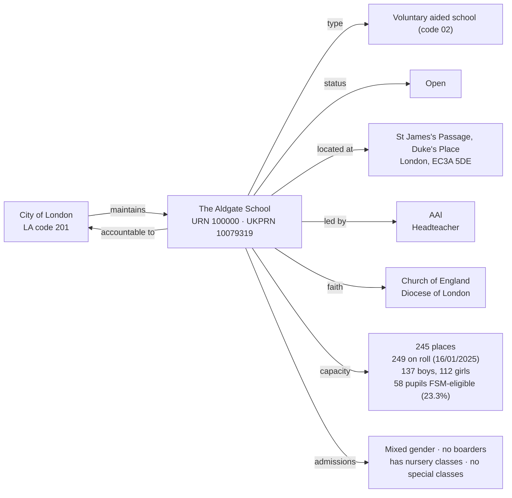

[← Worked examples](../)

# Establishment Ontology — The Aldgate School example

| | |
|---|---|
| **Establishment** | The Aldgate School, URN 100000 |
| **Local authority** | City of London, LA code 201 |
| **Establishment type** | Voluntary aided school (GIAS type code 02) |
| **Establishment ontology namespace** | `https://dfe-digital.github.io/education-provider-registry-docs/models/establishment/ontology/` |
| **Establishment vocabulary namespace** | `https://dfe-digital.github.io/education-provider-registry-docs/models/establishment/vocabulary/` |
| **Preferred prefixes** | `esto:` (properties) · `est:` (classes and named individuals) |
| **OWL documentation** | [Establishment ontology reference (WIDOCO)](../../ontology/) |
| **Source** | [establishment-ontology.ttl](https://github.com/DFE-Digital/education-provider-registry-docs/blob/main/models/establishment/establishment-ontology.ttl) |
| **Repository** | [DFE-Digital/education-provider-registry-docs](https://github.com/DFE-Digital/education-provider-registry-docs) |
| **Licence** | [Open Government Licence v3.0](https://www.nationalarchives.gov.uk/doc/open-government-licence/version/3/) |

`inst:aldgate-school` is the same instance used in the [governance worked example](../../../governance/worked-examples/aldgate-school/). Headteacher shown as `AAl` (initials only).

---

## Section 1 — The real-world establishment record

### Sources

| Source | Publisher | What it evidences | Observed |
|---|---|---|---|
| [GIAS: The Aldgate School, URN 100000](https://www.get-information-schools.service.gov.uk/Establishments/Establishment/Details/100000) | Get Information about Schools (DfE) | Establishment identity, classification, lifecycle, location, leadership, faith context, capacity, pupil measures | GIAS extract 16 June 2026 |

### Structure



No group membership - the Aldgate School has no trust, sponsor or federation link. The first standalone (non-federation-member) `est:VoluntaryAidedSchool` in these worked examples - the type's two prior real uses (St Luke's, Long Ditton St Mary's) were both federation members. Roll (249) exceeds published capacity (245) - a third real over-capacity school this session, after Moreland and Gilded Hollins.

---

## Section 2 — Modelled in the establishment ontology

### Namespace prefixes

```
@prefix est:   <https://dfe-digital.github.io/education-provider-registry-docs/models/establishment/vocabulary/> .
@prefix esto:  <https://dfe-digital.github.io/education-provider-registry-docs/models/establishment/ontology/> .
@prefix rdf:   <http://www.w3.org/1999/02/22-rdf-syntax-ns#> .
@prefix rdfs:  <http://www.w3.org/2000/01/rdf-schema#> .
@prefix owl:   <http://www.w3.org/2002/07/owl#> .
@prefix xsd:   <http://www.w3.org/2001/XMLSchema#> .
@prefix inst:  <https://dfe-digital.github.io/education-provider-registry-docs/establishment/> .
```

### Example 1 — Identity, LA accountability and lifecycle

```
inst:aldgate-school
    a est:VoluntaryAidedSchool ;
    rdfs:label "The Aldgate School"@en ;

    esto:hasEstablishmentIdentity [
        a est:EstablishmentIdentity ;
        esto:identifiedByUrn [
            a est:UniqueReferenceNumber ;
            rdf:value "100000"^^xsd:positiveInteger
        ] ;
        esto:hasUkprn [
            a est:UkProviderReferenceNumber ;
            rdf:value "10079319"^^xsd:positiveInteger
        ]
    ] ;

    esto:hasAccountabilityRelationship [
        a est:EstablishmentAccountability ;
        esto:accountableToLocalAuthority inst:la-201
    ] ;

    esto:hasEstablishmentLifecycle [
        a est:EstablishmentLifecycle ;
        esto:classifiedByEstablishmentStatus est:OpenStatus
    ] .

inst:la-201
    a est:LocalAuthority ;
    rdfs:label "City of London"@en .
```

### Example 2 — Classification, location, leadership and faith context

Church of England character with a diocese, but "Does not apply" for religious ethos - the same real combination as St Luke's, not the "None"/no-diocese pattern seen at Cheltenham College.

```
inst:aldgate-school
    esto:hasEstablishmentClassification [
        a est:EstablishmentClassification ;
        esto:hasEstablishmentType est:VoluntaryAidedSchool ;
        esto:hasEducationPhase est:PrimaryPhase
    ] ;

    esto:hasEstablishmentLocationAndContact [
        a est:EstablishmentLocationAndContact ;
        esto:hasHeadteacherOrPrincipal [
            a est:HeadteacherOrPrincipal ;
            rdfs:label "AAl"@en
        ] ;
        esto:hasMainSite [
            a est:Site ;
            esto:hasAddress [
                a est:Address ;
                rdfs:label "St James's Passage, Duke's Place, London, EC3A 5DE"@en ;
                esto:hasAddressLine1 [ a est:AddressLine1 ; rdfs:label "St James's Passage"@en ] ;
                esto:hasAddressLine2 [ a est:AddressLine2 ; rdfs:label "Duke's Place"@en ] ;
                esto:hasTown [ a est:Town ; rdfs:label "London"@en ] ;
                esto:hasPostcode [ a est:Postcode ; rdfs:label "EC3A 5DE" ]
            ]
        ]
    ] ;

    esto:hasFaithContext [
        a est:FaithContext ;
        esto:classifiedByReligiousCharacter est:ChurchOfEnglandCharacter ;
        esto:associatedWithDiocese [
            a est:Diocese ;
            rdfs:label "Diocese of London"@en
        ]
    ] .
```

No `esto:classifiedByReligiousEthos`, no `esto:classifiedByAdmissionsPolicy` - both "Does not apply"/"Not applicable" in the real extract.

### Example 3 — Admissions, provision, capacity and record currency

```
inst:aldgate-school
    esto:hasEducationAdmissionsAndProvision [
        a est:EducationAdmissionsAndProvision ;
        esto:classifiedByGenderOfEntry est:MixedGenderEntry ;
        esto:classifiedByBoardingProvision est:NoBoarders ;
        esto:classifiedByNurseryProvision est:HasNurseryClasses ;
        esto:classifiedBySpecialClassProvision est:NoSpecialClasses ;
        esto:hasStatutoryAgeRange [
            a est:StatutoryAgeRange ;
            rdfs:label "3 to 11"@en
        ]
    ] ;

    esto:hasCapacityAndPupilMeasures [
        a est:CapacityAndPupilMeasures ;
        esto:hasSchoolCapacity [
            a est:SchoolCapacity ;
            rdf:value "245"^^xsd:nonNegativeInteger
        ] ;
        esto:hasPupilCount [
            a est:PupilCount ;
            rdf:value "249"^^xsd:nonNegativeInteger ;
            rdfs:comment "Census date 2025-01-16: 137 boys, 112 girls."@en
        ] ;
        esto:hasFreeSchoolMealMeasure [
            a est:PupilsEligibleForFreeSchoolMeals ;
            rdfs:label "58"^^xsd:integer ;
            rdfs:comment "23.3% of pupils on roll."@en
        ]
    ] ;

    esto:hasRecordCurrency [
        a est:RecordCurrencyAndStewardship ;
        esto:recordsDateLastChanged [
            a est:DateLastChangedOrConfirmed ;
            rdf:value "2026-04-10"^^xsd:date
        ]
    ] .
```

No `esto:hasSenAndResourcedProvision` - all SEN and resourced-provision fields are "Not applicable" in the real extract.

---

## What this example found

- **First standalone `est:VoluntaryAidedSchool`.** Both prior real uses of this leaf type (St Luke's, Long Ditton St Mary's) were federation members; the Aldgate School has no group membership at all.
- **A third real over-capacity school.** Roll (249) exceeds published capacity (245), the same pattern found at Moreland (federation member) and Gilded Hollins (standalone community school) - now confirmed on a third establishment type and governance shape.
- **Church of England with a diocese but no distinct ethos** - the same real combination as St Luke's, contrasting with Cheltenham College's Church of England-with-no-diocese and Wyvil's "None" religious character.
- **Not exercised by this example:** academy trust, sponsor, generic trust and federation relationships; SEN and resourced provision; Section 41 approval; job title variants (Headteacher is plain here).

---

## Concept coverage

| Real-world concept | Aldgate School evidence | Ontology mapping | Fit |
|---|---|---|---|
| Establishment | The Aldgate School, URN 100000, UKPRN 10079319 | `est:VoluntaryAidedSchool` | Direct |
| Local authority accountability | Maintained by City of London (LA code 201) | `esto:accountableToLocalAuthority` + `est:LocalAuthority` | Direct |
| Establishment type | Voluntary aided school (GIAS type code 02) | `est:VoluntaryAidedSchool` | Direct |
| Status | Open | `est:OpenStatus` | Direct |
| Location | St James's Passage, Duke's Place, London, EC3A 5DE | `est:Site` + `est:Address` | Direct |
| Headteacher | AAl | `est:HeadteacherOrPrincipal` | Direct |
| Faith context (real value) | Church of England, Diocese of London | `est:ChurchOfEnglandCharacter` + `est:Diocese` | Direct |
| Religious ethos, admissions policy | Does not apply / Not applicable | Absence of the respective properties | Direct |
| Capacity and pupil numbers | 245 capacity, 249 on roll (137 boys, 112 girls), 58 FSM-eligible | `est:CapacityAndPupilMeasures` | Direct - roll exceeds capacity, recorded as-is |
| SEN and resourced provision | Not applicable | Absence of `esto:hasSenAndResourcedProvision` | Direct |
| Record currency | Last changed 2026-04-10 | `est:RecordCurrencyAndStewardship` + `esto:recordsDateLastChanged` | Direct |

---

**See also:** [Establishment vocabulary](../../vocabulary/) · [Establishment taxonomy](../../taxonomy/) · [Establishment ontology](../../ontology/) · [Establishment ontology graph viewer](../../ontology/webvowl/) · [Medlock example](../medlock-mat/) · [Manor High example](../manor-high/) · [Frank Barnes example](../frank-barnes/) · [Eileen Wade / Milton Ernest example](../eileen-wade-milton-ernest/) · [Long Ditton example](../long-ditton/) · [St Luke's / Moreland example](../st-lukes-moreland/) · [Vauxhall Primary / Wyvern Federation example](../vauxhall-primary/) · [Gilded Hollins example](../gilded-hollins/) · [Millfield example](../millfield/) · [Brookside / OAK MAT example](../oak-brookside/) · [The Green School Trust example](../green-school-trust/) · [Cheltenham College example](../cheltenham-college/) · [Governance worked example for the same organisation](../../../governance/worked-examples/aldgate-school/)
