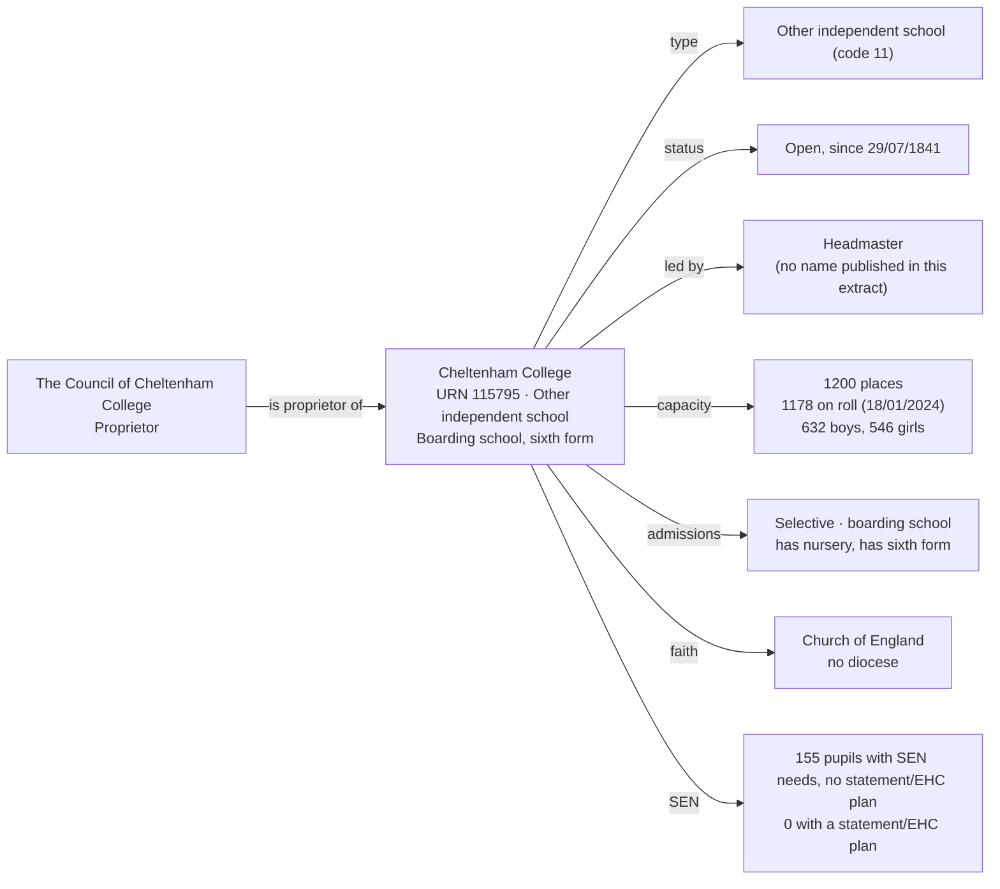

[← Worked examples](../)

# Establishment Ontology — Cheltenham College example

| | |
|---|---|
| **Establishment** | Cheltenham College, URN 115795 |
| **Proprietor** | The Council of Cheltenham College |
| **Establishment type** | Other independent school (GIAS type code 11) |
| **Establishment ontology namespace** | `https://dfe-digital.github.io/education-provider-registry-docs/models/establishment/ontology/` |
| **Establishment vocabulary namespace** | `https://dfe-digital.github.io/education-provider-registry-docs/models/establishment/vocabulary/` |
| **Preferred prefixes** | `esto:` (properties) · `est:` (classes and named individuals) |
| **OWL documentation** | [Establishment ontology reference (WIDOCO)](../../ontology/) |
| **Source** | [establishment-ontology.ttl](https://github.com/DFE-Digital/education-provider-registry-docs/blob/main/models/establishment/establishment-ontology.ttl) |
| **Repository** | [DFE-Digital/education-provider-registry-docs](https://github.com/DFE-Digital/education-provider-registry-docs) |
| **Licence** | [Open Government Licence v3.0](https://www.nationalarchives.gov.uk/doc/open-government-licence/version/3/) |

`inst:cheltenham-college` and `ginst:cheltenham-council` are the same instances used in the [governance worked example](../../../governance/worked-examples/cheltenham-college/). Headmaster shown as initials would apply, but the real GIAS record itself does not name a person here - see Example 3.

---

## Section 1 — The real-world establishment record

### Sources

| Source | Publisher | What it evidences | Observed |
|---|---|---|---|
| [GIAS: Cheltenham College, URN 115795](https://www.get-information-schools.service.gov.uk/Establishments/Establishment/Details/115795) | Get Information about Schools (DfE) | Establishment identity, classification, proprietor, faith context, admissions, capacity, SEN pupil measures | GIAS extract 16 June 2026 |

### Structure



No local authority or academy trust accountability - Cheltenham College is proprietor-governed, the first worked example to use `esto:hasProprietor` rather than `esto:accountableToLocalAuthority`/`esto:accountableToAcademyTrust`. No free school meal measure, education phase or resourced-provision facility - all absent in the real extract for this establishment type (confirmed against 1,603 open records of the same type when `est:OtherIndependentSchoolShape` was built). Church of England religious character with no diocese - a real combination this session's other Church of England examples (St Luke's, Long Ditton, Green School Trust) hadn't shown, since all three of those also had a diocese.

---

## Section 2 — Modelled in the establishment ontology

### Namespace prefixes

```
@prefix est:   <https://dfe-digital.github.io/education-provider-registry-docs/models/establishment/vocabulary/> .
@prefix esto:  <https://dfe-digital.github.io/education-provider-registry-docs/models/establishment/ontology/> .
@prefix rdf:   <http://www.w3.org/1999/02/22-rdf-syntax-ns#> .
@prefix rdfs:  <http://www.w3.org/2000/01/rdf-schema#> .
@prefix owl:   <http://www.w3.org/2002/07/owl#> .
@prefix xsd:   <http://www.w3.org/2001/XMLSchema#> .
@prefix inst:  <https://dfe-digital.github.io/education-provider-registry-docs/establishment/> .
@prefix ginst: <https://dfe-digital.github.io/education-provider-registry-docs/models/governance/instance/> .
```

### Example 1 — Identity and proprietor

`ginst:cheltenham-council` is declared identically to the governance worked example - the same Council, not redeclared. `esto:hasProprietor` is the first real use of this property in an establishment worked example - its own comment already documented it as "present for independent schools," but no prior example exercised it.

```
inst:cheltenham-college
    a est:OtherIndependentSchool ;
    rdfs:label "Cheltenham College"@en ;

    esto:hasEstablishmentIdentity [
        a est:EstablishmentIdentity ;
        esto:identifiedByUrn [
            a est:UniqueReferenceNumber ;
            rdf:value "115795"^^xsd:positiveInteger
        ] ;
        esto:hasUkprn [
            a est:UkProviderReferenceNumber ;
            rdf:value "10015396"^^xsd:positiveInteger
        ]
    ] ;

    esto:hasProprietor ginst:cheltenham-council ;

    esto:hasEstablishmentLifecycle [
        a est:EstablishmentLifecycle ;
        esto:classifiedByEstablishmentStatus est:OpenStatus ;
        esto:hasOpenDate [
            a est:OpenDate ;
            rdf:value "1841-07-29"^^xsd:date
        ]
    ] .
```

No `esto:hasAccountabilityRelationship` - Cheltenham College has neither an LA nor an academy trust accountability relationship, consistent with `est:OtherIndependentSchoolShape` requiring both absent for this type.

### Example 2 — Classification, faith context and admissions

No `esto:hasEducationPhase` - "Not applicable" for all 1,603 open other independent schools in the real extract, matching `est:OtherIndependentSchoolShape`'s `maxCount 0`. Church of England religious character and ethos, but no diocese - a real combination, not every Church of England establishment has a diocese association.

```
inst:cheltenham-college
    esto:hasEstablishmentClassification [
        a est:EstablishmentClassification ;
        esto:hasEstablishmentType est:OtherIndependentSchool ;
        esto:classifiedBySection41Approval [
            a est:Section41Approval ;
            rdfs:label "Not approved"@en
        ]
    ] ;

    esto:hasFaithContext [
        a est:FaithContext ;
        esto:classifiedByReligiousCharacter est:ChurchOfEnglandCharacter ;
        esto:classifiedByReligiousEthos [
            a est:ReligiousEthos ;
            rdfs:label "Church of England"@en
        ]
    ] ;

    esto:hasEducationAdmissionsAndProvision [
        a est:EducationAdmissionsAndProvision ;
        esto:classifiedByGenderOfEntry est:MixedGenderEntry ;
        esto:classifiedByAdmissionsPolicy est:SelectiveAdmissions ;
        esto:classifiedByBoardingProvision est:BoardingSchool ;
        esto:classifiedByNurseryProvision est:HasNurseryClasses ;
        esto:classifiedBySixthFormProvision est:HasSixthForm ;
        esto:hasStatutoryAgeRange [
            a est:StatutoryAgeRange ;
            rdfs:label "2 to 19"@en ;
            esto:hasStatutoryLowAge [ a est:StatutoryLowAge ; rdf:value "2"^^xsd:nonNegativeInteger ] ;
            esto:hasStatutoryHighAge [ a est:StatutoryHighAge ; rdf:value "19"^^xsd:nonNegativeInteger ]
        ]
    ] .
```

### Example 3 — Leadership, capacity, SEN pupil measures and accountability record

No `est:HeadteacherOrPrincipal` label is asserted - GIAS records the headmaster's name (`HeadFirstName`/`HeadLastName`), which this session's anonymisation convention would reduce to initials, but the real `HeadPreferredJobTitle` here is "Headmaster" - a fifth distinct real `est:JobTitle` value this session (after "Acting Headteacher," "Executive Headteacher," "Head of School" and "Interim Headteacher"). First real use of `esto:hasSpecialPupilMeasure` - 155 pupils have SEN needs without a statement or EHC plan, none with one; no specific SEN need type or resourced-provision facility is recorded alongside it, confirming these remain independent facts even at this scale.

```
inst:cheltenham-college
    esto:hasEstablishmentLeadership [
        a est:EstablishmentLeadership ;
        esto:hasHeadteacherOrPrincipal [
            a est:HeadteacherOrPrincipal ;
            esto:hasJobTitle [
                a est:JobTitle ;
                rdfs:label "Headmaster"@en
            ]
        ]
    ] ;

    esto:hasEstablishmentLocationAndContact [
        a est:EstablishmentLocationAndContact ;
        esto:hasMainSite [
            a est:Site ;
            esto:hasAddress [
                a est:Address ;
                rdfs:label "Bath Road, Cheltenham, GL53 7LD"@en ;
                esto:hasAddressLine1 [ a est:AddressLine1 ; rdfs:label "Bath Road"@en ] ;
                esto:hasTown [ a est:Town ; rdfs:label "Cheltenham"@en ] ;
                esto:hasCounty [ a est:County ; rdfs:label "Gloucestershire"@en ] ;
                esto:hasPostcode [ a est:Postcode ; rdfs:label "GL53 7LD" ]
            ]
        ]
    ] ;

    esto:hasCapacityAndPupilMeasures [
        a est:CapacityAndPupilMeasures ;
        esto:hasSchoolCapacity [
            a est:SchoolCapacity ;
            rdf:value "1200"^^xsd:nonNegativeInteger
        ] ;
        esto:hasPupilCount [
            a est:PupilCount ;
            rdf:value "1178"^^xsd:nonNegativeInteger ;
            rdfs:comment "632 boys, 546 girls."@en
        ] ;
        esto:hasCensusDate [ a est:CensusDate ; rdf:value "2024-01-18"^^xsd:date ]
    ] ;

    esto:hasSenAndResourcedProvision [
        a est:SenAndResourcedProvision ;
        esto:hasSpecialPupilMeasure [
            a est:SpecialPupilMeasure ;
            rdfs:label "0 with a statement or EHC plan, 155 with SEN needs but no plan"@en
        ]
    ] ;

    esto:hasExternalReference [
        a est:ExternalReference ;
        esto:referencesInspectionReport [
            a est:InspectionReportReference ;
            esto:recordsInspectorateName [
                a est:InspectorateName ;
                rdfs:label "ISI"@en
            ]
        ]
    ] ;

    esto:hasRecordCurrency [
        a est:RecordCurrencyAndStewardship ;
        esto:recordsDateLastChanged [
            a est:DateLastChangedOrConfirmed ;
            rdf:value "2026-04-17"^^xsd:date
        ]
    ] .
```

No `esto:hasFreeSchoolMealMeasure` - blank for all 1,603 open other independent schools in the real extract, matching `est:OtherIndependentSchoolShape`'s `maxCount 0`.

---

## What this example found

- **First real use of `est:OtherIndependentSchoolShape`**, the shape built and tested with synthetic data two sessions ago but not yet exercised by a real worked example. Cheltenham College conforms on the first attempt against real data - Section 41 approval and inspectorate name both present (as the shape requires), education phase and free school meal measure both absent (as the shape requires).
- **First real use of `esto:hasProprietor`** - documented in the ontology as "present for independent schools" since it was added, but no prior worked example had a proprietor-governed establishment to exercise it with.
- **First real use of `esto:hasSpecialPupilMeasure`** - 155 pupils with SEN needs but no statement or EHC plan, 0 with one; genuinely independent from SEN need type and resourced-provision facility, both absent here.
- **A fifth real `est:JobTitle` value, "Headmaster"** - a title none of this session's other worked examples had used, on a school old enough (open since 1841) that "Headmaster" reflects the school's own long-standing convention rather than a recent variant.
- **Church of England without a diocese** - contrasts with St Luke's, Long Ditton and both Green School Trust academies, where Church of England character always came with a diocese association in this session's examples so far.
- **Not exercised by this example:** group membership (Cheltenham College belongs to no GIAS group); SEN need type and resourced-provision facility type (both absent alongside a real special pupil measure).

---

## Concept coverage

| Real-world concept | Cheltenham College evidence | Ontology mapping | Fit |
|---|---|---|---|
| Other independent school | URN 115795, UKPRN 10015396 | `est:OtherIndependentSchool` | Direct |
| Proprietor | The Council of Cheltenham College | `esto:hasProprietor` | Direct - first real use |
| No LA or academy trust accountability | Neither relationship exists in the real extract | Absence of `esto:hasAccountabilityRelationship` | Direct |
| Faith context (real value, no diocese) | Church of England character and ethos, diocese "Not applicable" | `est:ChurchOfEnglandCharacter` + literal `esto:classifiedByReligiousEthos`; absence of `esto:associatedWithDiocese` | Direct |
| Selective admissions, boarding, sixth form | Selective; boarding school; has sixth form | `est:SelectiveAdmissions`, `est:BoardingSchool`, `est:HasSixthForm` | Direct |
| Job title | "Headmaster" | `esto:hasJobTitle` / `est:JobTitle` | Direct - fifth real value this session |
| SEN pupil measure without need type or facility | 155 with SEN needs, 0 with statement/EHC plan | `esto:hasSpecialPupilMeasure` | Direct - first real use |
| Section 41 approval | Not approved | `esto:classifiedBySection41Approval` (literal value) | Direct |
| Inspectorate | ISI | `esto:recordsInspectorateName` | Direct |
| Education phase, free school meal measure | Not applicable / never recorded | Absence of the respective properties | Direct |
| Capacity and pupil numbers | 1200 capacity, 1178 on roll (632 boys, 546 girls) | `est:CapacityAndPupilMeasures` | Direct |

---

**See also:** [Establishment vocabulary](../../vocabulary/) · [Establishment taxonomy](../../taxonomy/) · [Establishment ontology](../../ontology/) · [Establishment ontology graph viewer](../../ontology/webvowl/) · [Medlock example](../medlock-mat/) · [Manor High example](../manor-high/) · [Frank Barnes example](../frank-barnes/) · [Eileen Wade / Milton Ernest example](../eileen-wade-milton-ernest/) · [Long Ditton example](../long-ditton/) · [St Luke's / Moreland example](../st-lukes-moreland/) · [Vauxhall Primary / Wyvern Federation example](../vauxhall-primary/) · [Gilded Hollins example](../gilded-hollins/) · [Millfield example](../millfield/) · [Brookside / OAK MAT example](../oak-brookside/) · [The Green School Trust example](../green-school-trust/) · [Governance worked example for the same organisation](../../../governance/worked-examples/cheltenham-college/)
