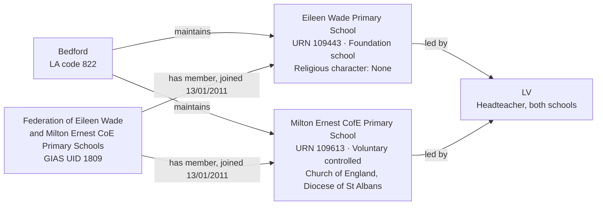

[← Worked examples](../)

# Establishment Ontology — Eileen Wade / Milton Ernest Federation example

| | |
|---|---|
| **Federation** | Federation of Eileen Wade and Milton Ernest CoE Primary Schools, GIAS UID 1809 |
| **Member establishments** | Eileen Wade Primary School (URN 109443, Foundation school) · Milton Ernest CofE Primary School (URN 109613, Voluntary controlled school) |
| **Local authority** | Bedford, LA code 822 |
| **Establishment ontology namespace** | `https://dfe-digital.github.io/education-provider-registry-docs/models/establishment/ontology/` |
| **Establishment vocabulary namespace** | `https://dfe-digital.github.io/education-provider-registry-docs/models/establishment/vocabulary/` |
| **Preferred prefixes** | `esto:` (properties) · `est:` (classes and named individuals) |
| **OWL documentation** | [Establishment ontology reference (WIDOCO)](../../ontology/) |
| **Source** | [establishment-ontology.ttl](https://github.com/DFE-Digital/education-provider-registry-docs/blob/main/models/establishment/establishment-ontology.ttl) |
| **Repository** | [DFE-Digital/education-provider-registry-docs](https://github.com/DFE-Digital/education-provider-registry-docs) |
| **Licence** | [Open Government Licence v3.0](https://www.nationalarchives.gov.uk/doc/open-government-licence/version/3/) |

Same instances as the [governance worked example](../../../governance/worked-examples/eileen-wade-milton-ernest/). Headteacher shown as `LV` (initials only).

---

## Section 1 — The real-world establishment record

### Sources

| Source | Publisher | What it evidences | Observed |
|---|---|---|---|
| [GIAS: Federation of Eileen Wade and Milton Ernest CoE Primary Schools, Group UID 1809](https://www.get-information-schools.service.gov.uk/Groups/Group/Details/1809) | Get Information about Schools (DfE) | Federation identity, open date, two member schools | GIAS extract 22 June 2026 |
| [GIAS: Eileen Wade Primary School, URN 109443](https://www.get-information-schools.service.gov.uk/Establishments/Establishment/Details/109443) | Get Information about Schools (DfE) | Establishment identity, classification, location, capacity, religious character | GIAS extract 16 June 2026 |
| [GIAS: Milton Ernest CofE Primary School, URN 109613](https://www.get-information-schools.service.gov.uk/Establishments/Establishment/Details/109613) | Get Information about Schools (DfE) | Establishment identity, classification, location, capacity, religious character, diocese | GIAS extract 16 June 2026 |

### Structure



Both schools joined the federation on its own open date (13 January 2011). Eileen Wade's extract also references a Trust group (UID 1094, "North Bedfordshire Schools Trust") - closed since 2013, not modelled here as a current relationship.

---

## Section 2 — Modelled in the establishment ontology

### Namespace prefixes

```
@prefix est:   <https://dfe-digital.github.io/education-provider-registry-docs/models/establishment/vocabulary/> .
@prefix esto:  <https://dfe-digital.github.io/education-provider-registry-docs/models/establishment/ontology/> .
@prefix rdf:   <http://www.w3.org/1999/02/22-rdf-syntax-ns#> .
@prefix rdfs:  <http://www.w3.org/2000/01/rdf-schema#> .
@prefix owl:   <http://www.w3.org/2002/07/owl#> .
@prefix xsd:   <http://www.w3.org/2001/XMLSchema#> .
@prefix inst:  <https://dfe-digital.github.io/education-provider-registry-docs/establishment/> .
```

### Example 1 — Federation and member identity

`est:Federation` is a subclass of `est:EstablishmentGroup`, so member schools use the same `esto:hasMembership`/`esto:memberOf` pattern as academy trust membership (Medlock, Manor High) - a federation is structurally just another kind of group.

```
inst:eileen-wade-milton-ernest-federation
    a est:Federation ;
    rdfs:label "Federation of Eileen Wade and Milton Ernest CoE Primary Schools"@en ;

    esto:hasGroupUniqueIdentifier [
        a est:GroupUniqueIdentifier ;
        rdf:value "1809"^^xsd:positiveInteger
    ] .

inst:eileen-wade
    a est:FoundationSchool ;
    rdfs:label "Eileen Wade Primary School"@en ;

    esto:hasEstablishmentIdentity [
        a est:EstablishmentIdentity ;
        esto:identifiedByUrn [
            a est:UniqueReferenceNumber ;
            rdf:value "109443"^^xsd:positiveInteger
        ] ;
        esto:hasUkprn [
            a est:UkProviderReferenceNumber ;
            rdf:value "10077509"^^xsd:positiveInteger
        ]
    ] ;

    esto:hasMembership [
        a est:GroupMembership ;
        esto:memberOf inst:eileen-wade-milton-ernest-federation ;
        esto:hasGroupMembershipDate [
            a est:GroupMembershipDate ;
            rdf:value "2011-01-13"^^xsd:date
        ]
    ] .

inst:milton-ernest
    a est:VoluntaryControlledSchool ;
    rdfs:label "Milton Ernest CofE Primary School"@en ;

    esto:hasEstablishmentIdentity [
        a est:EstablishmentIdentity ;
        esto:identifiedByUrn [
            a est:UniqueReferenceNumber ;
            rdf:value "109613"^^xsd:positiveInteger
        ] ;
        esto:hasUkprn [
            a est:UkProviderReferenceNumber ;
            rdf:value "10075753"^^xsd:positiveInteger
        ]
    ] ;

    esto:hasMembership [
        a est:GroupMembership ;
        esto:memberOf inst:eileen-wade-milton-ernest-federation ;
        esto:hasGroupMembershipDate [
            a est:GroupMembershipDate ;
            rdf:value "2011-01-13"^^xsd:date
        ]
    ] .
```

### Example 2 — Accountability, shared headteacher and faith context

Both schools are accountable to the same local authority, independent of their shared federation membership - accountability and group membership are separate relationships, as established at Manor High and Frank Barnes. `LV` is asserted once and referenced by both establishments, matching the governance worked example's treatment of the same shared headteacher.

Eileen Wade's religious character is `est:NoReligiousCharacter` - a real, populated value meaning "not a faith school" - distinct from `est:NotApplicableReligiousCharacter`, which means the classification doesn't apply to the establishment's type at all (see "What this example found"). Milton Ernest's is `est:ChurchOfEnglandCharacter`, with a real diocese.

```
inst:la-822
    a est:LocalAuthority ;
    rdfs:label "Bedford"@en .

inst:eileen-wade
    esto:hasAccountabilityRelationship [
        a est:EstablishmentAccountability ;
        esto:accountableToLocalAuthority inst:la-822
    ] ;

    esto:hasEstablishmentLeadership [
        a est:EstablishmentLeadership ;
        esto:hasHeadteacherOrPrincipal [
            a est:HeadteacherOrPrincipal ;
            rdfs:label "LV"@en
        ]
    ] ;

    esto:hasEstablishmentLocationAndContact [
        a est:EstablishmentLocationAndContact ;
        esto:hasMainSite [
            a est:Site ;
            esto:hasAddress [
                a est:Address ;
                rdfs:label "High Street, Upper Dean, Huntingdon, PE28 0ND"@en ;
                esto:hasAddressLine1 [ a est:AddressLine1 ; rdfs:label "High Street"@en ] ;
                esto:hasAddressLine2 [ a est:AddressLine2 ; rdfs:label "Upper Dean"@en ] ;
                esto:hasTown [ a est:Town ; rdfs:label "Huntingdon"@en ] ;
                esto:hasCounty [ a est:County ; rdfs:label "Cambridgeshire"@en ] ;
                esto:hasPostcode [ a est:Postcode ; rdfs:label "PE28 0ND" ]
            ]
        ]
    ] ;

    esto:hasFaithContext [
        a est:FaithContext ;
        esto:classifiedByReligiousCharacter est:NoReligiousCharacter
    ] ;

    esto:hasEstablishmentLifecycle [
        a est:EstablishmentLifecycle ;
        esto:classifiedByEstablishmentStatus est:OpenStatus
    ] ;

    esto:hasRecordCurrency [
        a est:RecordCurrencyAndStewardship ;
        esto:recordsDateLastChanged [
            a est:DateLastChangedOrConfirmed ;
            rdf:value "2025-11-27"^^xsd:date
        ]
    ] .

inst:milton-ernest
    esto:hasAccountabilityRelationship [
        a est:EstablishmentAccountability ;
        esto:accountableToLocalAuthority inst:la-822
    ] ;

    esto:hasEstablishmentLeadership [
        a est:EstablishmentLeadership ;
        esto:hasHeadteacherOrPrincipal [
            a est:HeadteacherOrPrincipal ;
            rdfs:label "LV"@en
        ]
    ] ;

    esto:hasEstablishmentLocationAndContact [
        a est:EstablishmentLocationAndContact ;
        esto:hasMainSite [
            a est:Site ;
            esto:hasAddress [
                a est:Address ;
                rdfs:label "Thurleigh Road, Milton Ernest, Bedford, MK44 1RF"@en ;
                esto:hasAddressLine1 [ a est:AddressLine1 ; rdfs:label "Thurleigh Road"@en ] ;
                esto:hasAddressLine2 [ a est:AddressLine2 ; rdfs:label "Milton Ernest"@en ] ;
                esto:hasTown [ a est:Town ; rdfs:label "Bedford"@en ] ;
                esto:hasCounty [ a est:County ; rdfs:label "Bedfordshire"@en ] ;
                esto:hasPostcode [ a est:Postcode ; rdfs:label "MK44 1RF" ]
            ]
        ]
    ] ;

    esto:hasFaithContext [
        a est:FaithContext ;
        esto:classifiedByReligiousCharacter est:ChurchOfEnglandCharacter ;
        esto:associatedWithDiocese [
            a est:Diocese ;
            rdfs:label "Diocese of St Albans"@en
        ]
    ] ;

    esto:hasEstablishmentLifecycle [
        a est:EstablishmentLifecycle ;
        esto:classifiedByEstablishmentStatus est:OpenStatus
    ] ;

    esto:hasRecordCurrency [
        a est:RecordCurrencyAndStewardship ;
        esto:recordsDateLastChanged [
            a est:DateLastChangedOrConfirmed ;
            rdf:value "2026-06-03"^^xsd:date
        ]
    ] .
```

### Example 3 — Classification and capacity

```
inst:eileen-wade
    esto:hasEstablishmentClassification [
        a est:EstablishmentClassification ;
        esto:hasEstablishmentType est:FoundationSchool ;
        esto:hasEducationPhase est:PrimaryPhase
    ] ;

    esto:hasEducationAdmissionsAndProvision [
        a est:EducationAdmissionsAndProvision ;
        esto:classifiedByBoardingProvision est:NoBoarders ;
        esto:hasStatutoryAgeRange [
            a est:StatutoryAgeRange ;
            rdfs:label "4 to 11"@en ;
            esto:hasStatutoryLowAge [ a est:StatutoryLowAge ; rdf:value "4"^^xsd:nonNegativeInteger ] ;
            esto:hasStatutoryHighAge [ a est:StatutoryHighAge ; rdf:value "11"^^xsd:nonNegativeInteger ]
        ]
    ] ;

    esto:hasCapacityAndPupilMeasures [
        a est:CapacityAndPupilMeasures ;
        esto:hasSchoolCapacity [
            a est:SchoolCapacity ;
            rdf:value "70"^^xsd:nonNegativeInteger
        ] ;
        esto:hasPupilCount [
            a est:PupilCount ;
            rdf:value "70"^^xsd:nonNegativeInteger ;
            rdfs:comment "32 boys, 38 girls."@en
        ] ;
        esto:hasCensusDate [ a est:CensusDate ; rdf:value "2025-01-16"^^xsd:date ] ;
        esto:hasFreeSchoolMealMeasure [
            a est:PupilsEligibleForFreeSchoolMeals ;
            rdf:value "7"^^xsd:nonNegativeInteger ;
            esto:hasPercentageEligibleForFreeSchoolMeals [ a est:PercentagePupilsEligibleForFreeSchoolMeals ; rdf:value "10.0"^^xsd:decimal ]
        ]
    ] .

inst:milton-ernest
    esto:hasEstablishmentClassification [
        a est:EstablishmentClassification ;
        esto:hasEstablishmentType est:VoluntaryControlledSchool ;
        esto:hasEducationPhase est:PrimaryPhase
    ] ;

    esto:hasEducationAdmissionsAndProvision [
        a est:EducationAdmissionsAndProvision ;
        esto:classifiedByBoardingProvision est:NoBoarders ;
        esto:hasStatutoryAgeRange [
            a est:StatutoryAgeRange ;
            rdfs:label "4 to 11"@en ;
            esto:hasStatutoryLowAge [ a est:StatutoryLowAge ; rdf:value "4"^^xsd:nonNegativeInteger ] ;
            esto:hasStatutoryHighAge [ a est:StatutoryHighAge ; rdf:value "11"^^xsd:nonNegativeInteger ]
        ]
    ] ;

    esto:hasCapacityAndPupilMeasures [
        a est:CapacityAndPupilMeasures ;
        esto:hasSchoolCapacity [
            a est:SchoolCapacity ;
            rdf:value "84"^^xsd:nonNegativeInteger
        ] ;
        esto:hasPupilCount [
            a est:PupilCount ;
            rdf:value "63"^^xsd:nonNegativeInteger ;
            rdfs:comment "35 boys, 28 girls."@en
        ] ;
        esto:hasCensusDate [ a est:CensusDate ; rdf:value "2025-01-16"^^xsd:date ] ;
        esto:hasFreeSchoolMealMeasure [
            a est:PupilsEligibleForFreeSchoolMeals ;
            rdf:value "6"^^xsd:nonNegativeInteger ;
            esto:hasPercentageEligibleForFreeSchoolMeals [ a est:PercentagePupilsEligibleForFreeSchoolMeals ; rdf:value "9.5"^^xsd:decimal ]
        ]
    ] .
```

---

## What this example found

- **First federation example, and first with two different member types.** `est:Federation` reuses the same `est:EstablishmentGroup`/`GroupMembership` machinery as academy trusts - no separate federation-specific membership pattern was needed. The two members are different leaf types (`est:FoundationSchool`, `est:VoluntaryControlledSchool`), confirming group membership doesn't constrain member establishment type.
- **`est:NoReligiousCharacter` vs `est:NotApplicableReligiousCharacter` is a real, meaningful distinction, not a duplicate.** Eileen Wade's GIAS value is "None" (a real classification: this establishment has been assessed and has no religious character), not "Does not apply" (the classification concept doesn't apply to this establishment type). Both individuals already existed; this is their first real use in a worked example, and confirms they mean different things rather than being interchangeable "not a faith school" synonyms.
- **A shared headteacher across two establishments, modelled the same way the governance side handles a shared ex-officio governor** - one `est:HeadteacherOrPrincipal` value asserted independently on each establishment's own location-and-contact record, since GIAS itself records the headteacher per establishment even when the underlying person is the same.
- **Not exercised by this example:** the closed legacy Trust relationship (GIAS UID 1094) referenced in Eileen Wade's extract - out of scope as historical, not current, data.

---

## Concept coverage

| Real-world concept | Evidence | Ontology mapping | Fit |
|---|---|---|---|
| Federation | GIAS UID 1809, two member schools | `est:Federation` | Direct |
| Group membership | Both schools joined 2011-01-13 | `est:GroupMembership` + `esto:memberOf` + `esto:hasGroupMembershipDate` | Direct |
| Local authority accountability | Both schools maintained by Bedford (LA 822) | `esto:accountableToLocalAuthority` | Direct |
| Establishment types | Foundation school (Eileen Wade), Voluntary controlled school (Milton Ernest) | `est:FoundationSchool`, `est:VoluntaryControlledSchool` | Direct |
| Shared headteacher | LV, headteacher at both schools | `est:HeadteacherOrPrincipal`, asserted independently per establishment | Direct |
| Religious character (real value) | Eileen Wade: None; Milton Ernest: Church of England | `est:NoReligiousCharacter`, `est:ChurchOfEnglandCharacter` | Direct |
| Diocese | Milton Ernest: Diocese of St Albans | `est:Diocese` (open-ended, literal value) | Direct |
| Capacity and pupil numbers | 70/70 (Eileen Wade), 84/63 (Milton Ernest) | `est:CapacityAndPupilMeasures` | Direct |
| Legacy trust relationship | Eileen Wade referenced in a closed Trust group (UID 1094) | Not modelled - historical, not current | Not evidenced |

---

**See also:** [Establishment vocabulary](../../vocabulary/) · [Establishment taxonomy](../../taxonomy/) · [Establishment ontology](../../ontology/) · [Establishment ontology graph viewer](../../ontology/webvowl/) · [Medlock example](../medlock-mat/) · [Manor High example](../manor-high/) · [Frank Barnes example](../frank-barnes/) · [Governance worked example for the same organisation](../../../governance/worked-examples/eileen-wade-milton-ernest/)
