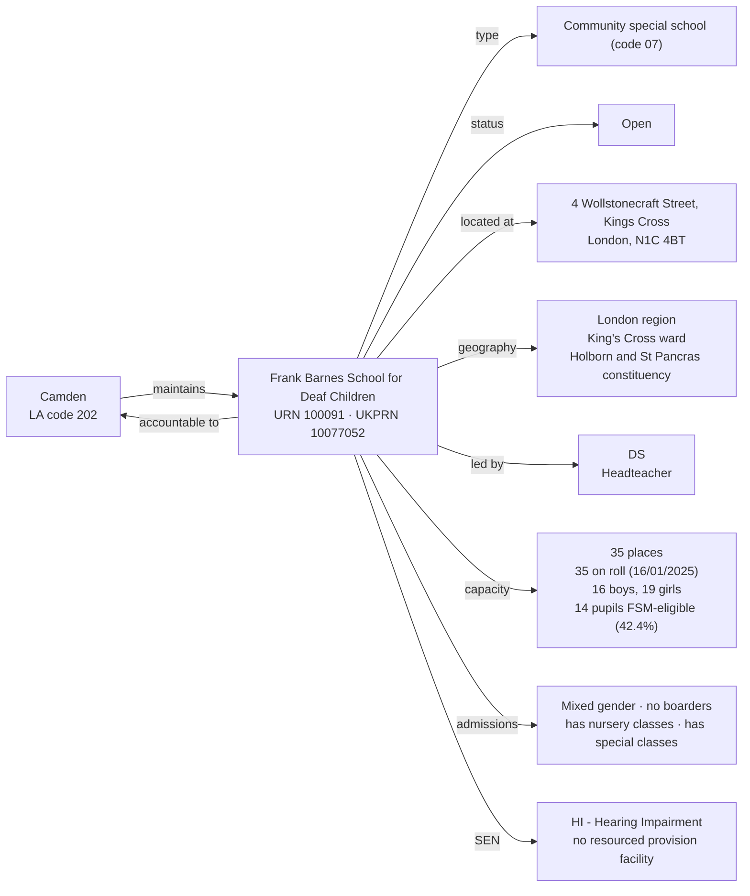

[← Worked examples](../)

# Establishment Ontology — Frank Barnes School for Deaf Children example

| | |
|---|---|
| **Establishment** | Frank Barnes School for Deaf Children, URN 100091 |
| **Local authority** | Camden, LA code 202 |
| **Establishment type** | Community special school (GIAS type code 07) |
| **Establishment ontology namespace** | `https://dfe-digital.github.io/education-provider-registry-docs/models/establishment/ontology/` |
| **Establishment vocabulary namespace** | `https://dfe-digital.github.io/education-provider-registry-docs/models/establishment/vocabulary/` |
| **Preferred prefixes** | `esto:` (properties) · `est:` (classes and named individuals) |
| **OWL documentation** | [Establishment ontology reference (WIDOCO)](../../ontology/) |
| **Source** | [establishment-ontology.ttl](https://github.com/DFE-Digital/education-provider-registry-docs/blob/main/models/establishment/establishment-ontology.ttl) |
| **Repository** | [DFE-Digital/education-provider-registry-docs](https://github.com/DFE-Digital/education-provider-registry-docs) |
| **Licence** | [Open Government Licence v3.0](https://www.nationalarchives.gov.uk/doc/open-government-licence/version/3/) |

`inst:frank-barnes` is the same instance used in the [governance worked example](../../../governance/worked-examples/frank-barnes/). Headteacher shown as `DS` (initials only).

---

## Section 1 — The real-world establishment record

### Sources

| Source | Publisher | What it evidences | Observed |
|---|---|---|---|
| [GIAS: Frank Barnes School for Deaf Children, URN 100091](https://www.get-information-schools.service.gov.uk/Establishments/Establishment/Details/100091) | Get Information about Schools (DfE) | Establishment identity, classification, lifecycle, location, leadership, capacity, pupil measures, SEN provision | GIAS extract 16 June 2026 |

### Structure



No group membership - Frank Barnes has no trust, sponsor or federation link. Education phase, admissions policy, reason opened, Section 41 approval and further education type are all "Not applicable" in the GIAS extract.

---

## Section 2 — Modelled in the establishment ontology

### Namespace prefixes

```
@prefix est:   <https://dfe-digital.github.io/education-provider-registry-docs/models/establishment/vocabulary/> .
@prefix esto:  <https://dfe-digital.github.io/education-provider-registry-docs/models/establishment/ontology/> .
@prefix rdf:   <http://www.w3.org/1999/02/22-rdf-syntax-ns#> .
@prefix rdfs:  <http://www.w3.org/2000/01/rdf-schema#> .
@prefix owl:   <http://www.w3.org/2002/07/owl#> .
@prefix xsd:   <http://www.w3.org/2001/XMLSchema#> .
@prefix inst:  <https://dfe-digital.github.io/education-provider-registry-docs/establishment/> .
```

### Example 1 — Identity and LA accountability

The first worked example with local-authority accountability rather than an academy trust - no `est:GroupMembership` and no `esto:sponsoredBy` at all, since Frank Barnes belongs to no group.

```
inst:frank-barnes
    a est:CommunitySpecialSchool ;
    rdfs:label "Frank Barnes School for Deaf Children"@en ;

    esto:hasEstablishmentIdentity [
        a est:EstablishmentIdentity ;
        esto:identifiedByUrn [
            a est:UniqueReferenceNumber ;
            rdf:value "100091"^^xsd:positiveInteger
        ] ;
        esto:hasUkprn [
            a est:UkProviderReferenceNumber ;
            rdf:value "10077052"^^xsd:positiveInteger
        ]
    ] ;

    esto:hasAccountabilityRelationship [
        a est:EstablishmentAccountability ;
        esto:accountableToLocalAuthority inst:la-202
    ] ;

    esto:hasEstablishmentLifecycle [
        a est:EstablishmentLifecycle ;
        esto:classifiedByEstablishmentStatus est:OpenStatus
    ] .

inst:la-202
    a est:LocalAuthority ;
    rdfs:label "Camden"@en .
```

### Example 2 — Classification

No `esto:hasEducationPhase` or `esto:hasAcademyRoute` - both "Not applicable" in the GIAS extract, and `est:AcademyRoute` doesn't apply to a non-academy establishment at all.

```
inst:frank-barnes
    esto:hasEstablishmentClassification [
        a est:EstablishmentClassification ;
        esto:hasEstablishmentType est:CommunitySpecialSchool
    ] .
```

### Example 3 — Location, contact and administrative geography

```
inst:frank-barnes
    esto:hasEstablishmentLocationAndContact [
        a est:EstablishmentLocationAndContact ;
        esto:hasMainSite [
            a est:Site ;
            esto:hasAddress [
                a est:Address ;
                rdfs:label "4 Wollstonecraft Street, Kings Cross, London, N1C 4BT"@en
            ]
        ] ;
        esto:hasWebsite [
            a est:Website ;
            rdfs:label "www.fbarnes.camden.sch.uk"
        ] ;
        esto:hasTelephoneNumber [
            a est:TelephoneNumber ;
            rdfs:label "02073917040"
        ] ;
        esto:hasHeadteacherOrPrincipal [
            a est:HeadteacherOrPrincipal ;
            rdfs:label "DS"@en
        ]
    ] ;

    esto:hasAdministrativeGeography [
        a est:AdministrativeGeography ;
        esto:classifiedByGovernmentOfficeRegion [
            a est:GovernmentOfficeRegion ;
            rdfs:label "London"@en
        ] ;
        esto:classifiedByAdministrativeWard [
            a est:AdministrativeWard ;
            rdfs:label "King's Cross"@en
        ] ;
        esto:classifiedByParliamentaryConstituency [
            a est:ParliamentaryConstituency ;
            rdfs:label "Holborn and St Pancras"@en
        ]
    ] .
```

### Example 4 — Admissions, provision, capacity and SEN

Special classes and nursery provision both have real values here, unlike Manor High. `est:HearingImpairment` - added as a named individual the same day `est:TypeOfSenProvision` was found to be a genuine closed list - gets its first real use.

```
inst:frank-barnes
    esto:hasEducationAdmissionsAndProvision [
        a est:EducationAdmissionsAndProvision ;
        esto:classifiedByGenderOfEntry est:MixedGenderEntry ;
        esto:classifiedByBoardingProvision est:NoBoarders ;
        esto:classifiedByNurseryProvision est:HasNurseryClasses ;
        esto:classifiedBySpecialClassProvision est:HasSpecialClasses ;
        esto:hasStatutoryAgeRange [
            a est:StatutoryAgeRange ;
            rdfs:label "2 to 11"@en
        ]
    ] ;

    esto:hasCapacityAndPupilMeasures [
        a est:CapacityAndPupilMeasures ;
        esto:hasSchoolCapacity [
            a est:SchoolCapacity ;
            rdf:value "35"^^xsd:nonNegativeInteger
        ] ;
        esto:hasPupilCount [
            a est:PupilCount ;
            rdf:value "35"^^xsd:nonNegativeInteger ;
            rdfs:comment "Census date 2025-01-16: 16 boys, 19 girls."@en
        ] ;
        esto:hasFreeSchoolMealMeasure [
            a est:PupilsEligibleForFreeSchoolMeals ;
            rdfs:label "14"^^xsd:integer ;
            rdfs:comment "42.4% of pupils on roll."@en
        ]
    ] ;

    esto:hasSenAndResourcedProvision [
        a est:SenAndResourcedProvision ;
        esto:classifiedByTypeOfSenProvision est:HearingImpairment
    ] ;

    esto:hasRecordCurrency [
        a est:RecordCurrencyAndStewardship ;
        esto:recordsDateLastChanged [
            a est:DateLastChangedOrConfirmed ;
            rdf:value "2026-06-08"^^xsd:date
        ]
    ] .
```

No `esto:classifiedByTypeOfResourcedProvision` - Frank Barnes has a SEN need type recorded (hearing impairment) but no resourced-provision or SEN-unit facility; the two facts are independent, as established at Medlock.

---

## What this example found

- **First LA-maintained example.** `esto:accountableToLocalAuthority` and `est:LocalAuthority` hadn't been exercised by either prior worked example (both academies). No group membership, no sponsor - both correctly absent rather than asserted as "not applicable", consistent with the same-day fixes.
- **First real use of a SEN need-type individual.** `est:HearingImpairment`, added earlier the same day. Confirms the SEN need type and resourced-provision facility type are genuinely independent facts, not always populated together (Frank Barnes has the former, not the latter; Medlock has both).
- **Checked whether `esto:hasEducationPhase`'s cardinality shape had the same bug as `Section41Approval`** - it doesn't. No shape mandates it for `est:CommunitySpecialSchool` (it's only required for `est:LaMainstreamSchool`, a sibling class Community special schools aren't part of), so omitting it needed no SHACL fix.
- **Not exercised by this example:** academy trust, group, sponsor and federation relationships; faith context; resourced-provision facility type; Section 41 approval.

---

## Concept coverage

| Real-world concept | Frank Barnes evidence | Ontology mapping | Fit |
|---|---|---|---|
| Establishment | Frank Barnes School for Deaf Children, URN 100091, UKPRN 10077052 | `est:CommunitySpecialSchool` | Direct |
| Local authority accountability | Maintained by Camden (LA code 202) | `esto:accountableToLocalAuthority` + `est:LocalAuthority` | Direct |
| Establishment type | Community special school (GIAS type code 07) | `est:CommunitySpecialSchool` | Direct |
| Status | Open | `est:OpenStatus` | Direct |
| Education phase, reason opened | Not applicable | Absence of `esto:hasEducationPhase`/`esto:hasReasonEstablishmentOpened` | Direct |
| Location and site | 4 Wollstonecraft Street, Kings Cross, N1C 4BT | `est:Site` + `est:Address` | Direct |
| Headteacher | DS | `est:HeadteacherOrPrincipal` | Direct |
| Capacity and pupil numbers | 35 capacity, 35 on roll (16 boys, 19 girls), 14 FSM-eligible | `est:CapacityAndPupilMeasures` | Direct |
| Special classes, nursery provision | Has special classes, has nursery classes | `est:HasSpecialClasses`, `est:HasNurseryClasses` | Direct |
| SEN provision | Hearing impairment (SEN1) | `est:HearingImpairment` | Direct |
| Resourced provision facility | Not applicable | Absence of `esto:classifiedByTypeOfResourcedProvision` | Direct |
| Faith context, admissions policy, Section 41 approval | Not applicable | Absence of the respective properties | Direct |
| Record currency | Last changed 2026-06-08 | `est:RecordCurrencyAndStewardship` + `esto:recordsDateLastChanged` | Direct |

---

**See also:** [Establishment vocabulary](../../vocabulary/) · [Establishment taxonomy](../../taxonomy/) · [Establishment ontology](../../ontology/) · [Establishment ontology graph viewer](../../ontology/webvowl/) · [Medlock example](../medlock-mat/) · [Manor High example](../manor-high/) · [Governance worked example for the same organisation](../../../governance/worked-examples/frank-barnes/)
