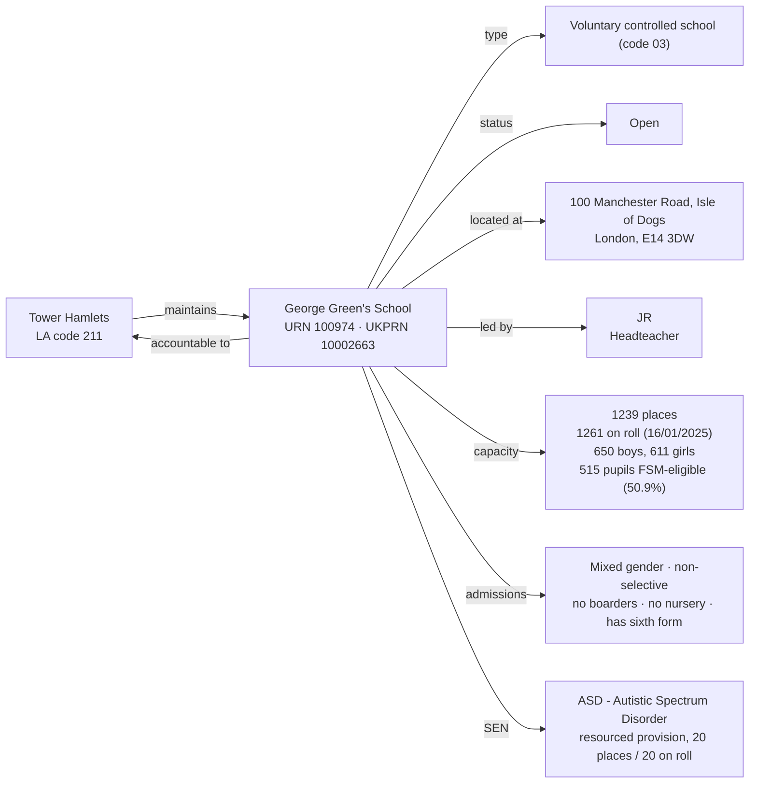

[← Worked examples](../)

# Establishment Ontology — George Green's School example

| | |
|---|---|
| **Establishment** | George Green's School, URN 100974 |
| **Local authority** | Tower Hamlets, LA code 211 |
| **Establishment type** | Voluntary controlled school (GIAS type code 03) |
| **Establishment ontology namespace** | `https://dfe-digital.github.io/education-provider-registry-docs/models/establishment/ontology/` |
| **Establishment vocabulary namespace** | `https://dfe-digital.github.io/education-provider-registry-docs/models/establishment/vocabulary/` |
| **Preferred prefixes** | `esto:` (properties) · `est:` (classes and named individuals) |
| **OWL documentation** | [Establishment ontology reference (WIDOCO)](../../ontology/) |
| **Source** | [establishment-ontology.ttl](https://github.com/DFE-Digital/education-provider-registry-docs/blob/main/models/establishment/establishment-ontology.ttl) |
| **Repository** | [DFE-Digital/education-provider-registry-docs](https://github.com/DFE-Digital/education-provider-registry-docs) |
| **Licence** | [Open Government Licence v3.0](https://www.nationalarchives.gov.uk/doc/open-government-licence/version/3/) |

`inst:george-greens` is the same instance used in the [governance worked example](../../../governance/worked-examples/george-greens/). Headteacher shown as `JR` (initials only).

---

## Section 1 — The real-world establishment record

### Sources

| Source | Publisher | What it evidences | Observed |
|---|---|---|---|
| [GIAS: George Green's School, URN 100974](https://www.get-information-schools.service.gov.uk/Establishments/Establishment/Details/100974) | Get Information about Schools (DfE) | Establishment identity, classification, lifecycle, location, leadership, capacity, pupil measures, SEN and resourced provision | GIAS extract 16 June 2026 |

### Structure



No group membership - George Green's has no trust, sponsor or federation link. The first standalone (non-federation-member) `est:VoluntaryControlledSchool` in these worked examples - the type's one prior real use (Milton Ernest) was a federation member. A real, asserted "None" religious character (`est:NoReligiousCharacter`), the same value seen at Wyvil - not the "Does not apply" absence seen at most other maintained schools. Roll (1261) exceeds published capacity (1239) - a fourth real over-capacity school this session, and the first at secondary phase.

---

## Section 2 — Modelled in the establishment ontology

### Namespace prefixes

```
@prefix est:   <https://dfe-digital.github.io/education-provider-registry-docs/models/establishment/vocabulary/> .
@prefix esto:  <https://dfe-digital.github.io/education-provider-registry-docs/models/establishment/ontology/> .
@prefix rdf:   <http://www.w3.org/1999/02/22-rdf-syntax-ns#> .
@prefix rdfs:  <http://www.w3.org/2000/01/rdf-schema#> .
@prefix owl:   <http://www.w3.org/2002/07/owl#> .
@prefix xsd:   <http://www.w3.org/2001/XMLSchema#> .
@prefix inst:  <https://dfe-digital.github.io/education-provider-registry-docs/establishment/> .
```

### Example 1 — Identity, LA accountability and lifecycle

```
inst:george-greens
    a est:VoluntaryControlledSchool ;
    rdfs:label "George Green's School"@en ;

    esto:hasEstablishmentIdentity [
        a est:EstablishmentIdentity ;
        esto:identifiedByUrn [
            a est:UniqueReferenceNumber ;
            rdf:value "100974"^^xsd:positiveInteger
        ] ;
        esto:hasUkprn [
            a est:UkProviderReferenceNumber ;
            rdf:value "10002663"^^xsd:positiveInteger
        ]
    ] ;

    esto:hasAccountabilityRelationship [
        a est:EstablishmentAccountability ;
        esto:accountableToLocalAuthority inst:la-211
    ] ;

    esto:hasEstablishmentLifecycle [
        a est:EstablishmentLifecycle ;
        esto:classifiedByEstablishmentStatus est:OpenStatus
    ] .

inst:la-211
    a est:LocalAuthority ;
    rdfs:label "Tower Hamlets"@en .
```

### Example 2 — Classification, location, leadership and faith context

Secondary phase with a sixth form - the first standalone maintained secondary school (not an academy, not a federation member) in these worked examples. Religious character "None" is a real, asserted value here, the same as Wyvil - not the absence used for most other maintained schools this session.

```
inst:george-greens
    esto:hasEstablishmentClassification [
        a est:EstablishmentClassification ;
        esto:hasEstablishmentType est:VoluntaryControlledSchool ;
        esto:hasEducationPhase est:SecondaryPhase
    ] ;

    esto:hasEstablishmentLocationAndContact [
        a est:EstablishmentLocationAndContact ;
        esto:hasHeadteacherOrPrincipal [
            a est:HeadteacherOrPrincipal ;
            rdfs:label "JR"@en
        ] ;
        esto:hasMainSite [
            a est:Site ;
            esto:hasAddress [
                a est:Address ;
                rdfs:label "100 Manchester Road, Isle of Dogs, London, E14 3DW"@en ;
                esto:hasAddressLine1 [ a est:AddressLine1 ; rdfs:label "100 Manchester Road"@en ] ;
                esto:hasAddressLine2 [ a est:AddressLine2 ; rdfs:label "Isle of Dogs"@en ] ;
                esto:hasTown [ a est:Town ; rdfs:label "London"@en ] ;
                esto:hasPostcode [ a est:Postcode ; rdfs:label "E14 3DW" ]
            ]
        ]
    ] ;

    esto:hasFaithContext [
        a est:FaithContext ;
        esto:classifiedByReligiousCharacter est:NoReligiousCharacter
    ] .
```

### Example 3 — Admissions, provision, capacity and SEN

```
inst:george-greens
    esto:hasEducationAdmissionsAndProvision [
        a est:EducationAdmissionsAndProvision ;
        esto:classifiedByGenderOfEntry est:MixedGenderEntry ;
        esto:classifiedByAdmissionsPolicy est:NonSelectiveAdmissions ;
        esto:classifiedByBoardingProvision est:NoBoarders ;
        esto:classifiedByNurseryProvision est:NoNurseryClasses ;
        esto:classifiedBySixthFormProvision est:HasSixthForm ;
        esto:hasStatutoryAgeRange [
            a est:StatutoryAgeRange ;
            rdfs:label "11 to 19"@en ;
            esto:hasStatutoryLowAge [ a est:StatutoryLowAge ; rdf:value "11"^^xsd:nonNegativeInteger ] ;
            esto:hasStatutoryHighAge [ a est:StatutoryHighAge ; rdf:value "19"^^xsd:nonNegativeInteger ]
        ]
    ] ;

    esto:hasCapacityAndPupilMeasures [
        a est:CapacityAndPupilMeasures ;
        esto:hasSchoolCapacity [
            a est:SchoolCapacity ;
            rdf:value "1239"^^xsd:nonNegativeInteger
        ] ;
        esto:hasPupilCount [
            a est:PupilCount ;
            rdf:value "1261"^^xsd:nonNegativeInteger ;
            rdfs:comment "650 boys, 611 girls."@en
        ] ;
        esto:hasCensusDate [ a est:CensusDate ; rdf:value "2025-01-16"^^xsd:date ] ;
        esto:hasFreeSchoolMealMeasure [
            a est:PupilsEligibleForFreeSchoolMeals ;
            rdf:value "515"^^xsd:nonNegativeInteger ;
            esto:hasPercentageEligibleForFreeSchoolMeals [ a est:PercentagePupilsEligibleForFreeSchoolMeals ; rdf:value "50.9"^^xsd:decimal ]
        ]
    ] ;

    esto:hasSenAndResourcedProvision [
        a est:SenAndResourcedProvision ;
        esto:classifiedByTypeOfSenProvision est:AutisticSpectrumDisorder ;
        esto:classifiedByTypeOfResourcedProvision est:ResourcedProvisionFacility ;
        esto:hasResourcedProvisionMeasure [
            a est:ResourcedProvisionMeasure ;
            rdfs:label "20 places, 20 on roll"@en ;
            esto:hasResourcedProvisionCapacity [ a est:ResourcedProvisionCapacity ; rdf:value "20"^^xsd:nonNegativeInteger ] ;
            esto:hasResourcedProvisionPupilCount [ a est:ResourcedProvisionPupilCount ; rdf:value "20"^^xsd:nonNegativeInteger ]
        ]
    ] ;

    esto:hasRecordCurrency [
        a est:RecordCurrencyAndStewardship ;
        esto:recordsDateLastChanged [
            a est:DateLastChangedOrConfirmed ;
            rdf:value "2026-04-15"^^xsd:date
        ]
    ] .
```

---

## What this example found

- **First standalone `est:VoluntaryControlledSchool`.** The type's one prior real use (Milton Ernest) was a federation member; George Green's has no group membership at all.
- **First standalone maintained secondary school in these worked examples** - every other non-academy, non-independent school modelled so far has been primary phase (Frank Barnes, Gilded Hollins, Millfield, Aldgate) or a federation member (Long Ditton St Mary's, at junior phase).
- **A fourth real over-capacity school**, and the first at secondary phase: roll (1261) exceeds published capacity (1239), the same pattern already found at Moreland, Gilded Hollins and the Aldgate School.
- **A single, non-combined resourced-provision facility with a real SEN need type** - Autistic Spectrum Disorder paired with `est:ResourcedProvisionFacility` (not the combined resourced-provision-and-SEN-unit value found at Brookside), 20 places and 20 on roll.
- **Not exercised by this example:** academy trust, sponsor, generic trust and federation relationships; Section 41 approval; job title variants (Headteacher is plain here).

---

## Concept coverage

| Real-world concept | George Green's evidence | Ontology mapping | Fit |
|---|---|---|---|
| Establishment | George Green's School, URN 100974, UKPRN 10002663 | `est:VoluntaryControlledSchool` | Direct |
| Local authority accountability | Maintained by Tower Hamlets (LA code 211) | `esto:accountableToLocalAuthority` + `est:LocalAuthority` | Direct |
| Establishment type | Voluntary controlled school (GIAS type code 03) | `est:VoluntaryControlledSchool` | Direct |
| Secondary phase with sixth form | Ages 11-19, has a sixth form | `est:SecondaryPhase`, `est:HasSixthForm` | Direct |
| Faith context (real "None" value) | Religious character: None | `est:NoReligiousCharacter` | Direct |
| Admissions policy | Non-selective | `est:NonSelectiveAdmissions` | Direct |
| Headteacher | JR | `est:HeadteacherOrPrincipal` | Direct |
| SEN need type and resourced provision | ASD, 20 places/20 on roll | `est:AutisticSpectrumDisorder`, `est:ResourcedProvisionFacility` | Direct |
| Capacity and pupil numbers | 1239 capacity, 1261 on roll (650 boys, 611 girls), 515 FSM-eligible | `est:CapacityAndPupilMeasures` | Direct - roll exceeds capacity, recorded as-is |
| Section 41 approval | Not applicable | Absence of `esto:classifiedBySection41Approval` | Direct |

---

**See also:** [Establishment vocabulary](../../vocabulary/) · [Establishment taxonomy](../../taxonomy/) · [Establishment ontology](../../ontology/) · [Establishment ontology graph viewer](../../ontology/webvowl/) · [Medlock example](../medlock-mat/) · [Manor High example](../manor-high/) · [Frank Barnes example](../frank-barnes/) · [Eileen Wade / Milton Ernest example](../eileen-wade-milton-ernest/) · [Long Ditton example](../long-ditton/) · [St Luke's / Moreland example](../st-lukes-moreland/) · [Vauxhall Primary / Wyvern Federation example](../vauxhall-primary/) · [Gilded Hollins example](../gilded-hollins/) · [Millfield example](../millfield/) · [Brookside / OAK MAT example](../oak-brookside/) · [The Green School Trust example](../green-school-trust/) · [Cheltenham College example](../cheltenham-college/) · [The Aldgate School example](../aldgate-school/) · [Governance worked example for the same organisation](../../../governance/worked-examples/george-greens/)
