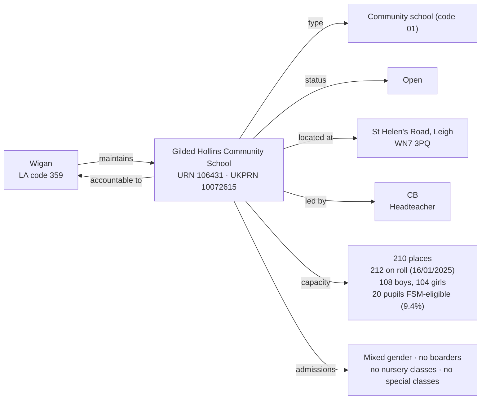

[← Worked examples](../)

# Establishment Ontology — Gilded Hollins Community School example

| | |
|---|---|
| **Establishment** | Gilded Hollins Community School, URN 106431 |
| **Local authority** | Wigan, LA code 359 |
| **Establishment type** | Community school (GIAS type code 01) |
| **Establishment ontology namespace** | `https://dfe-digital.github.io/education-provider-registry-docs/models/establishment/ontology/` |
| **Establishment vocabulary namespace** | `https://dfe-digital.github.io/education-provider-registry-docs/models/establishment/vocabulary/` |
| **Preferred prefixes** | `esto:` (properties) · `est:` (classes and named individuals) |
| **OWL documentation** | [Establishment ontology reference (WIDOCO)](../../ontology/) |
| **Source** | [establishment-ontology.ttl](https://github.com/DFE-Digital/education-provider-registry-docs/blob/main/models/establishment/establishment-ontology.ttl) |
| **Repository** | [DFE-Digital/education-provider-registry-docs](https://github.com/DFE-Digital/education-provider-registry-docs) |
| **Licence** | [Open Government Licence v3.0](https://www.nationalarchives.gov.uk/doc/open-government-licence/version/3/) |

`inst:gilded-hollins` is the same instance used in the [governance worked example](../../../governance/worked-examples/gilded-hollins/). Headteacher shown as `CB` (initials only).

---

## Section 1 — The real-world establishment record

### Sources

| Source | Publisher | What it evidences | Observed |
|---|---|---|---|
| [GIAS: Gilded Hollins Community School, URN 106431](https://www.get-information-schools.service.gov.uk/Establishments/Establishment/Details/106431) | Get Information about Schools (DfE) | Establishment identity, classification, lifecycle, location, leadership, capacity, pupil measures | GIAS extract 16 June 2026 |

### Structure



No group membership - Gilded Hollins has no trust, sponsor or federation link. Faith context, admissions policy, education phase and Section 41 approval are all "Not applicable" in the GIAS extract. The roll (212) exceeds the published capacity (210), the same real over-capacity pattern seen at Moreland Primary School, recorded as-is.

---

## Section 2 — Modelled in the establishment ontology

### Namespace prefixes

```
@prefix est:   <https://dfe-digital.github.io/education-provider-registry-docs/models/establishment/vocabulary/> .
@prefix esto:  <https://dfe-digital.github.io/education-provider-registry-docs/models/establishment/ontology/> .
@prefix rdf:   <http://www.w3.org/1999/02/22-rdf-syntax-ns#> .
@prefix rdfs:  <http://www.w3.org/2000/01/rdf-schema#> .
@prefix owl:   <http://www.w3.org/2002/07/owl#> .
@prefix xsd:   <http://www.w3.org/2001/XMLSchema#> .
@prefix inst:  <https://dfe-digital.github.io/education-provider-registry-docs/establishment/> .
```

### Example 1 — Identity, LA accountability and lifecycle

The first `est:CommunitySchool` modelled as a standalone establishment rather than as one member of a federation (contrast Moreland and Lilian Baylis, both `est:CommunitySchool` but shown only as federation members).

```
inst:gilded-hollins
    a est:CommunitySchool ;
    rdfs:label "Gilded Hollins Community School"@en ;

    esto:hasEstablishmentIdentity [
        a est:EstablishmentIdentity ;
        esto:identifiedByUrn [
            a est:UniqueReferenceNumber ;
            rdf:value "106431"^^xsd:positiveInteger
        ] ;
        esto:hasUkprn [
            a est:UkProviderReferenceNumber ;
            rdf:value "10072615"^^xsd:positiveInteger
        ]
    ] ;

    esto:hasAccountabilityRelationship [
        a est:EstablishmentAccountability ;
        esto:accountableToLocalAuthority inst:la-359
    ] ;

    esto:hasEstablishmentLifecycle [
        a est:EstablishmentLifecycle ;
        esto:classifiedByEstablishmentStatus est:OpenStatus
    ] .

inst:la-359
    a est:LocalAuthority ;
    rdfs:label "Wigan"@en .
```

### Example 2 — Classification, location and leadership

```
inst:gilded-hollins
    esto:hasEstablishmentClassification [
        a est:EstablishmentClassification ;
        esto:hasEstablishmentType est:CommunitySchool ;
        esto:hasEducationPhase est:PrimaryPhase
    ] ;

    esto:hasEstablishmentLeadership [
        a est:EstablishmentLeadership ;
        esto:hasHeadteacherOrPrincipal [
            a est:HeadteacherOrPrincipal ;
            rdfs:label "CB"@en
        ]
    ] ;

    esto:hasEstablishmentLocationAndContact [
        a est:EstablishmentLocationAndContact ;
        esto:hasMainSite [
            a est:Site ;
            esto:hasAddress [
                a est:Address ;
                rdfs:label "St Helen's Road, Leigh, WN7 3PQ"@en ;
                esto:hasAddressLine1 [ a est:AddressLine1 ; rdfs:label "St Helen's Road"@en ] ;
                esto:hasTown [ a est:Town ; rdfs:label "Leigh"@en ] ;
                esto:hasCounty [ a est:County ; rdfs:label "Lancashire"@en ] ;
                esto:hasPostcode [ a est:Postcode ; rdfs:label "WN7 3PQ" ]
            ]
        ]
    ] .
```

No `esto:hasFaithContext`, no `esto:classifiedByAdmissionsPolicy` - both "Not applicable" in the real extract.

### Example 3 — Admissions, provision, capacity and record currency

Pupils on roll (212) exceed the published capacity (210) - the same real over-capacity fact as Moreland, on a standalone school rather than a federation member this time.

```
inst:gilded-hollins
    esto:hasEducationAdmissionsAndProvision [
        a est:EducationAdmissionsAndProvision ;
        esto:classifiedByGenderOfEntry est:MixedGenderEntry ;
        esto:classifiedByBoardingProvision est:NoBoarders ;
        esto:classifiedByNurseryProvision est:NoNurseryClasses ;
        esto:classifiedBySpecialClassProvision est:NoSpecialClasses ;
        esto:hasStatutoryAgeRange [
            a est:StatutoryAgeRange ;
            rdfs:label "4 to 11"@en ;
            esto:hasStatutoryLowAge [ a est:StatutoryLowAge ; rdf:value "4"^^xsd:nonNegativeInteger ] ;
            esto:hasStatutoryHighAge [ a est:StatutoryHighAge ; rdf:value "11"^^xsd:nonNegativeInteger ]
        ]
    ] ;

    esto:hasCapacityAndPupilMeasures [
        a est:CapacityAndPupilMeasures ;
        esto:hasSchoolCapacity [
            a est:SchoolCapacity ;
            rdf:value "210"^^xsd:nonNegativeInteger
        ] ;
        esto:hasPupilCount [
            a est:PupilCount ;
            rdf:value "212"^^xsd:nonNegativeInteger ;
            rdfs:comment "108 boys, 104 girls."@en
        ] ;
        esto:hasCensusDate [ a est:CensusDate ; rdf:value "2025-01-16"^^xsd:date ] ;
        esto:hasFreeSchoolMealMeasure [
            a est:PupilsEligibleForFreeSchoolMeals ;
            rdf:value "20"^^xsd:nonNegativeInteger ;
            esto:hasPercentageEligibleForFreeSchoolMeals [ a est:PercentagePupilsEligibleForFreeSchoolMeals ; rdf:value "9.4"^^xsd:decimal ]
        ]
    ] ;

    esto:hasRecordCurrency [
        a est:RecordCurrencyAndStewardship ;
        esto:recordsDateLastChanged [
            a est:DateLastChangedOrConfirmed ;
            rdf:value "2026-06-03"^^xsd:date
        ]
    ] .
```

No `esto:hasSenAndResourcedProvision` - all 13 SEN fields and both resourced-provision fields are "Not applicable" in the real extract.

---

## What this example found

- **First standalone (non-federation-member) `est:CommunitySchool`.** Both prior real uses of this leaf type (Moreland, Lilian Baylis) were federation members; Gilded Hollins is a plain LA-maintained community school with no group membership at all, closer in shape to Frank Barnes than to either.
- **A second real over-capacity school**, on a different establishment type and governance pattern from Moreland (a standalone community school here, not a federation member) - confirms the earlier finding wasn't a one-off tied to federations.
- **No SEN or resourced provision at all** - every SEN1-13 and resourced-provision field is genuinely "Not applicable" in the real extract, unlike Frank Barnes (SEN need, no facility) or Wyvil (both, doubled). A third distinct real combination of these two independent facts.
- **Not exercised by this example:** academy trust, sponsor, generic trust and federation relationships; faith context; admissions policy; Section 41 approval; job title variants (Headteacher is plain here).

---

## Concept coverage

| Real-world concept | Gilded Hollins evidence | Ontology mapping | Fit |
|---|---|---|---|
| Establishment | Gilded Hollins Community School, URN 106431, UKPRN 10072615 | `est:CommunitySchool` | Direct |
| Local authority accountability | Maintained by Wigan (LA code 359) | `esto:accountableToLocalAuthority` + `est:LocalAuthority` | Direct |
| Establishment type | Community school (GIAS type code 01) | `est:CommunitySchool` | Direct |
| Status | Open | `est:OpenStatus` | Direct |
| Location | St Helen's Road, Leigh, WN7 3PQ | `est:Site` + `est:Address` | Direct |
| Headteacher | CB | `est:HeadteacherOrPrincipal` | Direct |
| Capacity and pupil numbers | 210 capacity, 212 on roll (108 boys, 104 girls), 20 FSM-eligible | `est:CapacityAndPupilMeasures` | Direct - roll exceeds capacity, recorded as-is |
| Admissions and provision | Mixed, no boarders, no nursery, no special classes | `est:EducationAdmissionsAndProvision` | Direct |
| SEN and resourced provision | Not applicable | Absence of `esto:hasSenAndResourcedProvision` | Direct |
| Faith context, admissions policy, Section 41 approval | Not applicable | Absence of the respective properties | Direct |
| Record currency | Last changed 2026-06-03 | `est:RecordCurrencyAndStewardship` + `esto:recordsDateLastChanged` | Direct |

---

**See also:** [Establishment vocabulary](../../vocabulary/) · [Establishment taxonomy](../../taxonomy/) · [Establishment ontology](../../ontology/) · [Establishment ontology graph viewer](../../ontology/webvowl/) · [Medlock example](../medlock-mat/) · [Manor High example](../manor-high/) · [Frank Barnes example](../frank-barnes/) · [Eileen Wade / Milton Ernest example](../eileen-wade-milton-ernest/) · [Long Ditton example](../long-ditton/) · [St Luke's / Moreland example](../st-lukes-moreland/) · [Vauxhall Primary / Wyvern Federation example](../vauxhall-primary/) · [Governance worked example for the same organisation](../../../governance/worked-examples/gilded-hollins/)
