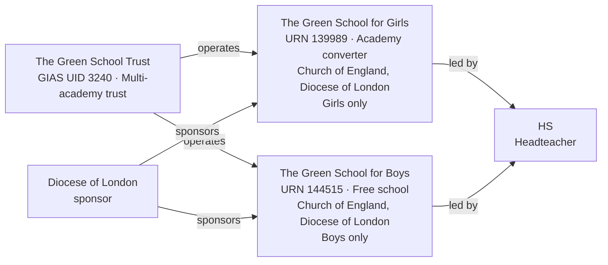

[← Worked examples](../)

# Establishment Ontology — The Green School Trust example

| | |
|---|---|
| **Academy Trust** | The Green School Trust, GIAS UID 3240, Companies House 08608665 |
| **Academies** | The Green School for Girls (URN 139989, Academy converter) · The Green School for Boys (URN 144515, Free school) |
| **Local authority** | Hounslow, LA code 313 (geographic reference only - both academies are trust-accountable) |
| **Establishment ontology namespace** | `https://dfe-digital.github.io/education-provider-registry-docs/models/establishment/ontology/` |
| **Establishment vocabulary namespace** | `https://dfe-digital.github.io/education-provider-registry-docs/models/establishment/vocabulary/` |
| **Preferred prefixes** | `esto:` (properties) · `est:` (classes and named individuals) |
| **OWL documentation** | [Establishment ontology reference (WIDOCO)](../../ontology/) |
| **Source** | [establishment-ontology.ttl](https://github.com/DFE-Digital/education-provider-registry-docs/blob/main/models/establishment/establishment-ontology.ttl) |
| **Repository** | [DFE-Digital/education-provider-registry-docs](https://github.com/DFE-Digital/education-provider-registry-docs) |
| **Licence** | [Open Government Licence v3.0](https://www.nationalarchives.gov.uk/doc/open-government-licence/version/3/) |

`inst:green-school-trust`, `inst:green-school-girls` and `inst:green-school-boys` are the same instances used in the [governance worked example](../../../governance/worked-examples/green-school-trust/). Headteacher shown as `HS` (initials only).

---

## Section 1 — The real-world establishment record

### Sources

| Source | Publisher | What it evidences | Observed |
|---|---|---|---|
| [GIAS: The Green School Trust, UID 3240](https://www.get-information-schools.service.gov.uk/Groups/Group/Details/3240) | Get Information about Schools (DfE) | Trust identity, group type, Companies House number, two member academies | GIAS extract 30 June 2026 |
| [GIAS: The Green School for Girls, URN 139989](https://www.get-information-schools.service.gov.uk/Establishments/Establishment/Details/139989) | Get Information about Schools (DfE) | Establishment identity, classification, faith context, sponsor, admissions, capacity | GIAS extract 16 June 2026 |
| [GIAS: The Green School for Boys, URN 144515](https://www.get-information-schools.service.gov.uk/Establishments/Establishment/Details/144515) | Get Information about Schools (DfE) | Establishment identity, classification, faith context, sponsor, capacity | GIAS extract 16 June 2026 |

### Structure



The GIAS extract's real group type for UID 3240 is "Multi-academy trust" (code 06) - the governance worked example's own source didn't confirm this specific type and modelled the Trust as generic `est:AcademyTrust`; this page uses the confirmed type. Both academies share one real headteacher (`HS`) - the first time a shared headteacher has appeared across two academies of the same trust in these worked examples, rather than across two schools in a federation. Both are sponsored by the Diocese of London and share the same religious character, but differ by gender of entry, establishment type (converter academy vs free school) and, in the real extract, `ReligiousEthos` ("Does not apply" for Girls, "None" for Boys - two different real free-text values for the same underlying fact).

---

## Section 2 — Modelled in the establishment ontology

### Namespace prefixes

```
@prefix est:   <https://dfe-digital.github.io/education-provider-registry-docs/models/establishment/vocabulary/> .
@prefix esto:  <https://dfe-digital.github.io/education-provider-registry-docs/models/establishment/ontology/> .
@prefix rdf:   <http://www.w3.org/1999/02/22-rdf-syntax-ns#> .
@prefix rdfs:  <http://www.w3.org/2000/01/rdf-schema#> .
@prefix owl:   <http://www.w3.org/2002/07/owl#> .
@prefix xsd:   <http://www.w3.org/2001/XMLSchema#> .
@prefix inst:  <https://dfe-digital.github.io/education-provider-registry-docs/establishment/> .
```

### Example 1 — Trust and academy identity

```
inst:green-school-trust
    a est:MultiAcademyTrust ;
    rdfs:label "The Green School Trust"@en ;

    esto:hasGroupUniqueIdentifier [
        a est:GroupUniqueIdentifier ;
        rdf:value "3240"^^xsd:positiveInteger
    ] ;

    esto:identifiedByGroupId [
        a est:GroupId ;
        rdfs:label "TR00905"
    ] ;

    esto:hasGroupCompaniesHouseNumber [
        a est:CompaniesHouseNumber ;
        rdfs:label "08608665"
    ] .

inst:green-school-girls
    a est:MainstreamAcademy ;
    rdfs:label "The Green School for Girls"@en ;

    esto:hasEstablishmentIdentity [
        a est:EstablishmentIdentity ;
        esto:identifiedByUrn [
            a est:UniqueReferenceNumber ;
            rdf:value "139989"^^xsd:positiveInteger
        ] ;
        esto:hasUkprn [
            a est:UkProviderReferenceNumber ;
            rdf:value "10042618"^^xsd:positiveInteger
        ]
    ] ;

    esto:hasMembership [
        a est:GroupMembership ;
        esto:memberOf inst:green-school-trust ;
        esto:hasGroupMembershipDate [
            a est:GroupMembershipDate ;
            rdf:value "2013-08-01"^^xsd:date
        ]
    ] .

inst:green-school-boys
    a est:MainstreamFreeSchool ;
    rdfs:label "The Green School for Boys"@en ;

    esto:hasEstablishmentIdentity [
        a est:EstablishmentIdentity ;
        esto:identifiedByUrn [
            a est:UniqueReferenceNumber ;
            rdf:value "144515"^^xsd:positiveInteger
        ] ;
        esto:hasUkprn [
            a est:UkProviderReferenceNumber ;
            rdf:value "10064758"^^xsd:positiveInteger
        ]
    ] ;

    esto:hasMembership [
        a est:GroupMembership ;
        esto:memberOf inst:green-school-trust ;
        esto:hasGroupMembershipDate [
            a est:GroupMembershipDate ;
            rdf:value "2017-09-03"^^xsd:date
        ]
    ] .
```

### Example 2 — Accountability, sponsorship and shared headteacher

Both academies are sponsored by the same organisation, the Diocese of London - the first worked example where `esto:sponsoredBy` points at a diocese rather than a trust (contrast Medlock's sponsor, a Multi Academy Trust). `HS` is asserted independently on each academy's own location-and-contact record, the same pattern used for shared headteachers across federated schools (Eileen Wade/Milton Ernest, Long Ditton), here applied across two academies of one trust instead.

```
inst:diocese-of-london-sponsor
    a est:Organisation ;
    rdfs:label "Diocese of London"@en .

inst:green-school-girls
    esto:hasAccountabilityRelationship [
        a est:EstablishmentAccountability ;
        esto:accountableToAcademyTrust inst:green-school-trust
    ] ;

    esto:sponsoredBy inst:diocese-of-london-sponsor ;

    esto:hasEstablishmentLocationAndContact [
        a est:EstablishmentLocationAndContact ;
        esto:hasHeadteacherOrPrincipal [
            a est:HeadteacherOrPrincipal ;
            rdfs:label "HS"@en
        ] ;
        esto:hasMainSite [
            a est:Site ;
            esto:hasAddress [
                a est:Address ;
                rdfs:label "Busch Corner, London Road, Isleworth, TW7 5BB"@en ;
                esto:hasAddressLine1 [ a est:AddressLine1 ; rdfs:label "Busch Corner"@en ] ;
                esto:hasAddressLine2 [ a est:AddressLine2 ; rdfs:label "London Road"@en ] ;
                esto:hasTown [ a est:Town ; rdfs:label "Isleworth"@en ] ;
                esto:hasPostcode [ a est:Postcode ; rdfs:label "TW7 5BB" ]
            ]
        ]
    ] ;

    esto:hasEstablishmentLifecycle [
        a est:EstablishmentLifecycle ;
        esto:classifiedByEstablishmentStatus est:OpenStatus ;
        esto:hasOpenDate [
            a est:OpenDate ;
            rdf:value "2013-08-01"^^xsd:date
        ] ;
        esto:hasReasonEstablishmentOpened est:AcademyConverterOpenReason
    ] ;

    esto:hasRecordCurrency [
        a est:RecordCurrencyAndStewardship ;
        esto:recordsDateLastChanged [
            a est:DateLastChangedOrConfirmed ;
            rdf:value "2026-05-19"^^xsd:date
        ]
    ] .

inst:green-school-boys
    esto:hasAccountabilityRelationship [
        a est:EstablishmentAccountability ;
        esto:accountableToAcademyTrust inst:green-school-trust
    ] ;

    esto:sponsoredBy inst:diocese-of-london-sponsor ;

    esto:hasEstablishmentLocationAndContact [
        a est:EstablishmentLocationAndContact ;
        esto:hasHeadteacherOrPrincipal [
            a est:HeadteacherOrPrincipal ;
            rdfs:label "HS"@en
        ] ;
        esto:hasMainSite [
            a est:Site ;
            esto:hasAddress [
                a est:Address ;
                rdfs:label "Twickenham Road, Isleworth, TW7 6AU"@en ;
                esto:hasAddressLine1 [ a est:AddressLine1 ; rdfs:label "Twickenham Road"@en ] ;
                esto:hasTown [ a est:Town ; rdfs:label "Isleworth"@en ] ;
                esto:hasPostcode [ a est:Postcode ; rdfs:label "TW7 6AU" ]
            ]
        ]
    ] ;

    esto:hasEstablishmentLifecycle [
        a est:EstablishmentLifecycle ;
        esto:classifiedByEstablishmentStatus est:OpenStatus ;
        esto:hasOpenDate [
            a est:OpenDate ;
            rdf:value "2017-09-03"^^xsd:date
        ]
    ] ;

    esto:hasRecordCurrency [
        a est:RecordCurrencyAndStewardship ;
        esto:recordsDateLastChanged [
            a est:DateLastChangedOrConfirmed ;
            rdf:value "2026-05-19"^^xsd:date
        ]
    ] .
```

### Example 3 — Classification, faith context and academy route

Girls has `esto:hasAcademyRoute est:ConverterRoute`; Boys has none, since free schools open directly rather than converting from an existing maintained school - the same real distinction the governance worked example's establishment typing already reflects. Both share religious character (`est:ChurchOfEnglandCharacter`, Diocese of London), but the real `ReligiousEthos` values differ by wording ("Does not apply" for Girls, "None" for Boys) - both genuinely mean "no distinct ethos beyond the religious character," recorded as the source states rather than normalised to one label.

```
inst:green-school-girls
    esto:hasEstablishmentClassification [
        a est:EstablishmentClassification ;
        esto:hasEstablishmentType est:MainstreamAcademy ;
        esto:hasEducationPhase est:SecondaryPhase
    ] ;

    esto:hasAcademyRoute est:ConverterRoute ;

    esto:hasFaithContext [
        a est:FaithContext ;
        esto:classifiedByReligiousCharacter est:ChurchOfEnglandCharacter ;
        esto:associatedWithDiocese [
            a est:Diocese ;
            rdfs:label "Diocese of London"@en
        ]
    ] .

inst:green-school-boys
    esto:hasEstablishmentClassification [
        a est:EstablishmentClassification ;
        esto:hasEstablishmentType est:MainstreamFreeSchool ;
        esto:hasEducationPhase est:SecondaryPhase
    ] ;

    esto:hasFaithContext [
        a est:FaithContext ;
        esto:classifiedByReligiousCharacter est:ChurchOfEnglandCharacter ;
        esto:classifiedByReligiousEthos [
            a est:ReligiousEthos ;
            rdfs:label "None"@en
        ] ;
        esto:associatedWithDiocese [
            a est:Diocese ;
            rdfs:label "Diocese of London"@en
        ]
    ] .
```

### Example 4 — Admissions, provision and capacity: two single-sex academies

Girls is `est:GirlsOnlyGenderEntry` and non-selective; Boys is `est:BoysOnlyGenderEntry` - the first pair of single-sex academies in the same trust in these worked examples. Both have a sixth form.

```
inst:green-school-girls
    esto:hasEducationAdmissionsAndProvision [
        a est:EducationAdmissionsAndProvision ;
        esto:classifiedByGenderOfEntry est:GirlsOnlyGenderEntry ;
        esto:classifiedByAdmissionsPolicy est:NonSelectiveAdmissions ;
        esto:classifiedByBoardingProvision est:NoBoarders ;
        esto:classifiedBySixthFormProvision est:HasSixthForm ;
        esto:hasStatutoryAgeRange [ a est:StatutoryAgeRange ; rdfs:label "11 to 18"@en ]
    ] ;

    esto:hasCapacityAndPupilMeasures [
        a est:CapacityAndPupilMeasures ;
        esto:hasSchoolCapacity [ a est:SchoolCapacity ; rdf:value "940"^^xsd:nonNegativeInteger ] ;
        esto:hasPupilCount [
            a est:PupilCount ;
            rdf:value "897"^^xsd:nonNegativeInteger ;
            rdfs:comment "Census date 2025-01-16: 897 girls."@en
        ] ;
        esto:hasFreeSchoolMealMeasure [
            a est:PupilsEligibleForFreeSchoolMeals ;
            rdfs:label "212"^^xsd:integer ;
            rdfs:comment "28.2% of pupils on roll."@en
        ]
    ] .

inst:green-school-boys
    esto:hasEducationAdmissionsAndProvision [
        a est:EducationAdmissionsAndProvision ;
        esto:classifiedByGenderOfEntry est:BoysOnlyGenderEntry ;
        esto:classifiedBySixthFormProvision est:HasSixthForm ;
        esto:hasStatutoryAgeRange [ a est:StatutoryAgeRange ; rdfs:label "11 to 18"@en ]
    ] ;

    esto:hasCapacityAndPupilMeasures [
        a est:CapacityAndPupilMeasures ;
        esto:hasSchoolCapacity [ a est:SchoolCapacity ; rdf:value "1260"^^xsd:nonNegativeInteger ] ;
        esto:hasPupilCount [
            a est:PupilCount ;
            rdf:value "772"^^xsd:nonNegativeInteger ;
            rdfs:comment "Census date 2025-01-16: 772 boys."@en
        ] ;
        esto:hasFreeSchoolMealMeasure [
            a est:PupilsEligibleForFreeSchoolMeals ;
            rdfs:label "222"^^xsd:integer ;
            rdfs:comment "32.1% of pupils on roll."@en
        ]
    ] .
```

No `esto:classifiedByAdmissionsPolicy` and no `esto:classifiedByBoardingProvision` for Boys - the real extract records an admissions-policy code (9) and a boarders code (9) with no corresponding name value at all, a genuine data-quality gap in the source rather than a real "not applicable" or other classifiable value, so nothing is asserted rather than guessed.

---

## What this example found

- **First shared headteacher across two academies of one trust**, rather than across two schools in a federation - the same "assert independently on each establishment" pattern from Eileen Wade/Milton Ernest and Long Ditton, now confirmed to apply beyond federations.
- **First sponsor that is a diocese rather than a trust.** `esto:sponsoredBy` previously only pointed at `est:MultiAcademyTrust` instances (Medlock); here it points at a generic `est:Organisation` instance representing the Diocese of London - a real, common pattern (607 open establishments have a diocese-named sponsor in the live extract), not a one-off.
- **A real GIAS data-quality gap, not modelled around.** The Boys academy's `AdmissionsPolicy` and `Boarders` fields carry a numeric code (9) with no corresponding name value in the extract - genuinely different from the usual "Not applicable" (code 0) absence. Both properties are simply omitted, since neither a real value nor a documented "not applicable" state can be asserted from what the source actually contains.
- **A confirmed group type the governance-side source left unstated.** The governance worked example modelled the Trust as generic `est:AcademyTrust` since its own source didn't specify the type; the establishment extract confirms GIAS group type code 06 (Multi-academy trust), so this page uses `est:MultiAcademyTrust`.
- **Two single-sex academies under one trust**, first real use of both `est:GirlsOnlyGenderEntry` and `est:BoysOnlyGenderEntry` together.
- **Not exercised by this example:** SEN and resourced provision (both "Not applicable" for both academies); Section 41 approval.

---

## Concept coverage

| Real-world concept | Evidence | Ontology mapping | Fit |
|---|---|---|---|
| Multi-academy trust | GIAS UID 3240, group type code 06, two academies | `est:MultiAcademyTrust` | Direct |
| Academy Trust accountability | Both academies accountable to the Trust | `esto:accountableToAcademyTrust` | Direct |
| Sponsor (diocese, not a trust) | Diocese of London sponsors both academies | `esto:sponsoredBy` + `est:Organisation` | Direct - first non-trust sponsor |
| Establishment types | Academy converter (Girls), Free school (Boys) | `est:MainstreamAcademy` + `est:ConverterRoute`, `est:MainstreamFreeSchool` | Direct |
| Faith context (real value) | Both: Church of England, Diocese of London | `est:ChurchOfEnglandCharacter` + `est:Diocese` | Direct |
| Religious ethos (real, differing free text) | Girls: "Does not apply"; Boys: "None" | Absence (Girls) vs `esto:classifiedByReligiousEthos` (Boys) | Direct - two different real values for the same underlying fact |
| Single-sex gender of entry | Girls only (Girls), Boys only (Boys) | `est:GirlsOnlyGenderEntry`, `est:BoysOnlyGenderEntry` | Direct |
| Shared headteacher across a trust | HS, headteacher at both academies | `est:HeadteacherOrPrincipal`, asserted independently per establishment | Direct |
| Admissions policy, boarding (data-quality gap) | Boys: numeric code with no name value | Absence of the respective properties | Direct - a genuine gap in the source, not a modelled "not applicable" |
| Capacity and pupil numbers | 940/897 (Girls), 1260/772 (Boys) | `est:CapacityAndPupilMeasures` | Direct |

---

**See also:** [Establishment vocabulary](../../vocabulary/) · [Establishment taxonomy](../../taxonomy/) · [Establishment ontology](../../ontology/) · [Establishment ontology graph viewer](../../ontology/webvowl/) · [Medlock example](../medlock-mat/) · [Manor High example](../manor-high/) · [Frank Barnes example](../frank-barnes/) · [Eileen Wade / Milton Ernest example](../eileen-wade-milton-ernest/) · [Long Ditton example](../long-ditton/) · [St Luke's / Moreland example](../st-lukes-moreland/) · [Vauxhall Primary / Wyvern Federation example](../vauxhall-primary/) · [Gilded Hollins example](../gilded-hollins/) · [Millfield example](../millfield/) · [Brookside / OAK MAT example](../oak-brookside/) · [Governance worked example for the same organisation](../../../governance/worked-examples/green-school-trust/)
