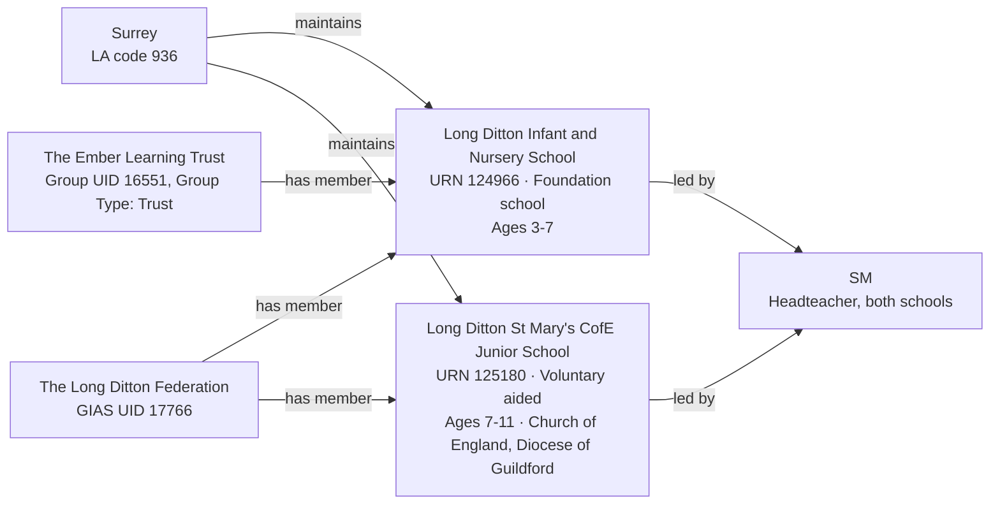

[← Worked examples](../)

# Establishment Ontology — Long Ditton Federation example

| | |
|---|---|
| **Federation** | The Long Ditton Federation, GIAS UID 17766 |
| **Member establishments** | Long Ditton Infant and Nursery School (URN 124966, Foundation school) · Long Ditton St Mary's CofE (Aided) Junior School (URN 125180, Voluntary aided school) |
| **Local authority** | Surrey, LA code 936 |
| **Establishment ontology namespace** | `https://dfe-digital.github.io/education-provider-registry-docs/models/establishment/ontology/` |
| **Establishment vocabulary namespace** | `https://dfe-digital.github.io/education-provider-registry-docs/models/establishment/vocabulary/` |
| **Preferred prefixes** | `esto:` (properties) · `est:` (classes and named individuals) |
| **OWL documentation** | [Establishment ontology reference (WIDOCO)](../../ontology/) |
| **Source** | [establishment-ontology.ttl](https://github.com/DFE-Digital/education-provider-registry-docs/blob/main/models/establishment/establishment-ontology.ttl) |
| **Repository** | [DFE-Digital/education-provider-registry-docs](https://github.com/DFE-Digital/education-provider-registry-docs) |
| **Licence** | [Open Government Licence v3.0](https://www.nationalarchives.gov.uk/doc/open-government-licence/version/3/) |

Same instances as the [governance worked example](../../../governance/worked-examples/long-ditton/). Headteacher shown as `SM` (initials only).

---

## Section 1 — The real-world establishment record

### Sources

| Source | Publisher | What it evidences | Observed |
|---|---|---|---|
| [GIAS: The Long Ditton Federation, Group UID 17766](https://www.get-information-schools.service.gov.uk/Groups/Group/Details/17766) | Get Information about Schools (DfE) | Federation identity, open date, two member schools | GIAS extract 22 June 2026 |
| [GIAS: Long Ditton Infant and Nursery School, URN 124966](https://www.get-information-schools.service.gov.uk/Establishments/Establishment/Details/124966) | Get Information about Schools (DfE) | Establishment identity, classification, location, capacity, trust and federation membership | GIAS extract 16 June 2026 |
| [GIAS: Long Ditton St Mary's CofE (Aided) Junior School, URN 125180](https://www.get-information-schools.service.gov.uk/Establishments/Establishment/Details/125180) | Get Information about Schools (DfE) | Establishment identity, classification, location, capacity, religious character, diocese | GIAS extract 16 June 2026 |

### Structure



Long Ditton Infant belongs to **two** current groups simultaneously: the federation, and a separate GIAS "Trust" group type (code 02 - not a multi-academy trust) linked to The Ember Learning Trust. St Mary's belongs only to the federation.

---

## Section 2 — Modelled in the establishment ontology

### Namespace prefixes

```
@prefix est:   <https://dfe-digital.github.io/education-provider-registry-docs/models/establishment/vocabulary/> .
@prefix esto:  <https://dfe-digital.github.io/education-provider-registry-docs/models/establishment/ontology/> .
@prefix rdf:   <http://www.w3.org/1999/02/22-rdf-syntax-ns#> .
@prefix rdfs:  <http://www.w3.org/2000/01/rdf-schema#> .
@prefix owl:   <http://www.w3.org/2002/07/owl#> .
@prefix xsd:   <http://www.w3.org/2001/XMLSchema#> .
@prefix inst:  <https://dfe-digital.github.io/education-provider-registry-docs/establishment/> .
```

### Example 1 — Federation, generic trust and member identity

`est:GenericTrust` represents GIAS group type 02 ("Trust") - a distinct class from `est:MultiAcademyTrust`, used for legacy charitable/foundation trusts that hold land or appoint governors without being an academy trust. Long Ditton Infant has two independent `est:GroupMembership` records, one per group.

```
inst:long-ditton-federation
    a est:Federation ;
    rdfs:label "The Long Ditton Federation"@en ;

    esto:hasGroupUniqueIdentifier [
        a est:GroupUniqueIdentifier ;
        rdf:value "17766"^^xsd:positiveInteger
    ] .

inst:ember-learning-trust
    a est:GenericTrust ;
    rdfs:label "The Ember Learning Trust"@en ;

    esto:hasGroupUniqueIdentifier [
        a est:GroupUniqueIdentifier ;
        rdf:value "16551"^^xsd:positiveInteger
    ] .

inst:long-ditton-infant
    a est:FoundationSchool ;
    rdfs:label "Long Ditton Infant and Nursery School"@en ;

    esto:hasEstablishmentIdentity [
        a est:EstablishmentIdentity ;
        esto:identifiedByUrn [
            a est:UniqueReferenceNumber ;
            rdf:value "124966"^^xsd:positiveInteger
        ] ;
        esto:hasUkprn [
            a est:UkProviderReferenceNumber ;
            rdf:value "10080381"^^xsd:positiveInteger
        ]
    ] ;

    esto:hasMembership [
        a est:GroupMembership ;
        esto:memberOf inst:long-ditton-federation
    ] ;

    esto:hasMembership [
        a est:GroupMembership ;
        esto:memberOf inst:ember-learning-trust
    ] .

inst:long-ditton-st-marys
    a est:VoluntaryAidedSchool ;
    rdfs:label "Long Ditton St Mary's CofE (Aided) Junior School"@en ;

    esto:hasEstablishmentIdentity [
        a est:EstablishmentIdentity ;
        esto:identifiedByUrn [
            a est:UniqueReferenceNumber ;
            rdf:value "125180"^^xsd:positiveInteger
        ] ;
        esto:hasUkprn [
            a est:UkProviderReferenceNumber ;
            rdf:value "10076292"^^xsd:positiveInteger
        ]
    ] ;

    esto:hasMembership [
        a est:GroupMembership ;
        esto:memberOf inst:long-ditton-federation
    ] .
```

### Example 2 — Accountability, headteacher, lifecycle and record currency

```
inst:la-936
    a est:LocalAuthority ;
    rdfs:label "Surrey"@en .

inst:long-ditton-infant
    esto:hasAccountabilityRelationship [
        a est:EstablishmentAccountability ;
        esto:accountableToLocalAuthority inst:la-936
    ] ;

    esto:hasEstablishmentLeadership [
        a est:EstablishmentLeadership ;
        esto:hasHeadteacherOrPrincipal [
            a est:HeadteacherOrPrincipal ;
            rdfs:label "SM"@en
        ]
    ] ;

    esto:hasEstablishmentLocationAndContact [
        a est:EstablishmentLocationAndContact ;
        esto:hasMainSite [
            a est:Site ;
            esto:hasAddress [
                a est:Address ;
                rdfs:label "Ditton Hill Road, Surbiton, KT6 5JB"@en ;
                esto:hasAddressLine1 [ a est:AddressLine1 ; rdfs:label "Ditton Hill Road"@en ] ;
                esto:hasTown [ a est:Town ; rdfs:label "Surbiton"@en ] ;
                esto:hasCounty [ a est:County ; rdfs:label "Surrey"@en ] ;
                esto:hasPostcode [ a est:Postcode ; rdfs:label "KT6 5JB" ]
            ]
        ]
    ] ;

    esto:hasEstablishmentLifecycle [
        a est:EstablishmentLifecycle ;
        esto:classifiedByEstablishmentStatus est:OpenStatus
    ] ;

    esto:hasRecordCurrency [
        a est:RecordCurrencyAndStewardship ;
        esto:recordsDateLastChanged [
            a est:DateLastChangedOrConfirmed ;
            rdf:value "2026-05-08"^^xsd:date
        ]
    ] .

inst:long-ditton-st-marys
    esto:hasAccountabilityRelationship [
        a est:EstablishmentAccountability ;
        esto:accountableToLocalAuthority inst:la-936
    ] ;

    esto:hasEstablishmentLeadership [
        a est:EstablishmentLeadership ;
        esto:hasHeadteacherOrPrincipal [
            a est:HeadteacherOrPrincipal ;
            rdfs:label "SM"@en
        ]
    ] ;

    esto:hasEstablishmentLocationAndContact [
        a est:EstablishmentLocationAndContact ;
        esto:hasMainSite [
            a est:Site ;
            esto:hasAddress [
                a est:Address ;
                rdfs:label "Sugden Road, Long Ditton, Surbiton, KT7 0AD"@en ;
                esto:hasAddressLine1 [ a est:AddressLine1 ; rdfs:label "Sugden Road"@en ] ;
                esto:hasAddressLine2 [ a est:AddressLine2 ; rdfs:label "Long Ditton"@en ] ;
                esto:hasTown [ a est:Town ; rdfs:label "Surbiton"@en ] ;
                esto:hasCounty [ a est:County ; rdfs:label "Surrey"@en ] ;
                esto:hasPostcode [ a est:Postcode ; rdfs:label "KT7 0AD" ]
            ]
        ]
    ] ;

    esto:hasFaithContext [
        a est:FaithContext ;
        esto:classifiedByReligiousCharacter est:ChurchOfEnglandCharacter ;
        esto:associatedWithDiocese [
            a est:Diocese ;
            rdfs:label "Diocese of Guildford"@en
        ]
    ] ;

    esto:hasEstablishmentLifecycle [
        a est:EstablishmentLifecycle ;
        esto:classifiedByEstablishmentStatus est:OpenStatus
    ] ;

    esto:hasRecordCurrency [
        a est:RecordCurrencyAndStewardship ;
        esto:recordsDateLastChanged [
            a est:DateLastChangedOrConfirmed ;
            rdf:value "2026-05-15"^^xsd:date
        ]
    ] .
```

No `esto:hasFaithContext` for Long Ditton Infant - GIAS records "Does not apply" for religious character and ethos, so the property is omitted rather than populated with a placeholder.

### Example 3 — Classification, provision and capacity

Infant and junior age ranges split at age 7 - the federation covers two different phases of the same population, not two copies of one school.

```
inst:long-ditton-infant
    esto:hasEstablishmentClassification [
        a est:EstablishmentClassification ;
        esto:hasEstablishmentType est:FoundationSchool ;
        esto:hasEducationPhase est:PrimaryPhase
    ] ;

    esto:hasEducationAdmissionsAndProvision [
        a est:EducationAdmissionsAndProvision ;
        esto:classifiedByBoardingProvision est:NoBoarders ;
        esto:classifiedByNurseryProvision est:HasNurseryClasses ;
        esto:hasStatutoryAgeRange [
            a est:StatutoryAgeRange ;
            rdfs:label "3 to 7"@en ;
            esto:hasStatutoryLowAge [ a est:StatutoryLowAge ; rdf:value "3"^^xsd:nonNegativeInteger ] ;
            esto:hasStatutoryHighAge [ a est:StatutoryHighAge ; rdf:value "7"^^xsd:nonNegativeInteger ]
        ]
    ] ;

    esto:hasCapacityAndPupilMeasures [
        a est:CapacityAndPupilMeasures ;
        esto:hasSchoolCapacity [
            a est:SchoolCapacity ;
            rdf:value "232"^^xsd:nonNegativeInteger
        ] ;
        esto:hasPupilCount [
            a est:PupilCount ;
            rdf:value "188"^^xsd:nonNegativeInteger ;
            rdfs:comment "105 boys, 83 girls."@en
        ] ;
        esto:hasCensusDate [ a est:CensusDate ; rdf:value "2025-01-16"^^xsd:date ] ;
        esto:hasFreeSchoolMealMeasure [
            a est:PupilsEligibleForFreeSchoolMeals ;
            rdf:value "10"^^xsd:nonNegativeInteger ;
            esto:hasPercentageEligibleForFreeSchoolMeals [ a est:PercentagePupilsEligibleForFreeSchoolMeals ; rdf:value "5.6"^^xsd:decimal ]
        ]
    ] .

inst:long-ditton-st-marys
    esto:hasEstablishmentClassification [
        a est:EstablishmentClassification ;
        esto:hasEstablishmentType est:VoluntaryAidedSchool ;
        esto:hasEducationPhase est:PrimaryPhase
    ] ;

    esto:hasEducationAdmissionsAndProvision [
        a est:EducationAdmissionsAndProvision ;
        esto:classifiedByBoardingProvision est:NoBoarders ;
        esto:classifiedByNurseryProvision est:NoNurseryClasses ;
        esto:hasStatutoryAgeRange [
            a est:StatutoryAgeRange ;
            rdfs:label "7 to 11"@en ;
            esto:hasStatutoryLowAge [ a est:StatutoryLowAge ; rdf:value "7"^^xsd:nonNegativeInteger ] ;
            esto:hasStatutoryHighAge [ a est:StatutoryHighAge ; rdf:value "11"^^xsd:nonNegativeInteger ]
        ]
    ] ;

    esto:hasCapacityAndPupilMeasures [
        a est:CapacityAndPupilMeasures ;
        esto:hasSchoolCapacity [
            a est:SchoolCapacity ;
            rdf:value "270"^^xsd:nonNegativeInteger
        ] ;
        esto:hasPupilCount [
            a est:PupilCount ;
            rdf:value "233"^^xsd:nonNegativeInteger ;
            rdfs:comment "129 boys, 104 girls."@en
        ] ;
        esto:hasCensusDate [ a est:CensusDate ; rdf:value "2025-01-16"^^xsd:date ] ;
        esto:hasFreeSchoolMealMeasure [
            a est:PupilsEligibleForFreeSchoolMeals ;
            rdf:value "11"^^xsd:nonNegativeInteger ;
            esto:hasPercentageEligibleForFreeSchoolMeals [ a est:PercentagePupilsEligibleForFreeSchoolMeals ; rdf:value "4.7"^^xsd:decimal ]
        ]
    ] .
```

---

## What this example found

- **First real use of `est:GenericTrust`.** Its own ontology comment describes it as "rarely used in current data; retained for completeness" - Long Ditton Infant's live GIAS record is exactly that rare case: a foundation school with a current, open "Trust" group (GIAS type 02) distinct from both its federation and any academy trust. Confirms an establishment can hold independent memberships in more than one group simultaneously, and that `est:GenericTrust` isn't dead weight in the ontology.
- **A federation spanning two different phases within primary, not just two different governance/faith profiles.** Infant (ages 3-7) and Junior (ages 7-11) split the same age range Eileen Wade/Milton Ernest's federation didn't - both member schools there were whole-primary (4-11).
- **Not exercised by this example:** academy trust and sponsor relationships; SEN and resourced provision (both "Not applicable" for both schools); Section 41 approval.

---

## Concept coverage

| Real-world concept | Evidence | Ontology mapping | Fit |
|---|---|---|---|
| Federation | GIAS UID 17766, two member schools | `est:Federation` | Direct |
| Non-academy trust group | Long Ditton Infant, Group UID 16551, "The Ember Learning Trust" | `est:GenericTrust` | Direct - first real use |
| Multiple simultaneous group memberships | Long Ditton Infant belongs to both the federation and the trust | Two independent `est:GroupMembership` records | Direct |
| Local authority accountability | Both schools maintained by Surrey (LA 936) | `esto:accountableToLocalAuthority` | Direct |
| Establishment types | Foundation school (Infant), Voluntary aided school (St Mary's) | `est:FoundationSchool`, `est:VoluntaryAidedSchool` | Direct |
| Shared headteacher | SM, headteacher at both schools | `est:HeadteacherOrPrincipal`, asserted independently per establishment | Direct |
| Split age ranges | Infant 3-7, Junior 7-11 | `est:StatutoryAgeRange` | Direct |
| Faith context (real value) | St Mary's: Church of England, Diocese of Guildford | `est:ChurchOfEnglandCharacter` + `est:Diocese` | Direct |
| Faith context (absent) | Infant: does not apply | Absence of `esto:hasFaithContext` | Direct |
| Capacity and pupil numbers | 232/188 (Infant), 270/233 (St Mary's) | `est:CapacityAndPupilMeasures` | Direct |

---

**See also:** [Establishment vocabulary](../../vocabulary/) · [Establishment taxonomy](../../taxonomy/) · [Establishment ontology](../../ontology/) · [Establishment ontology graph viewer](../../ontology/webvowl/) · [Medlock example](../medlock-mat/) · [Manor High example](../manor-high/) · [Frank Barnes example](../frank-barnes/) · [Eileen Wade / Milton Ernest example](../eileen-wade-milton-ernest/) · [Governance worked example for the same organisation](../../../governance/worked-examples/long-ditton/)
