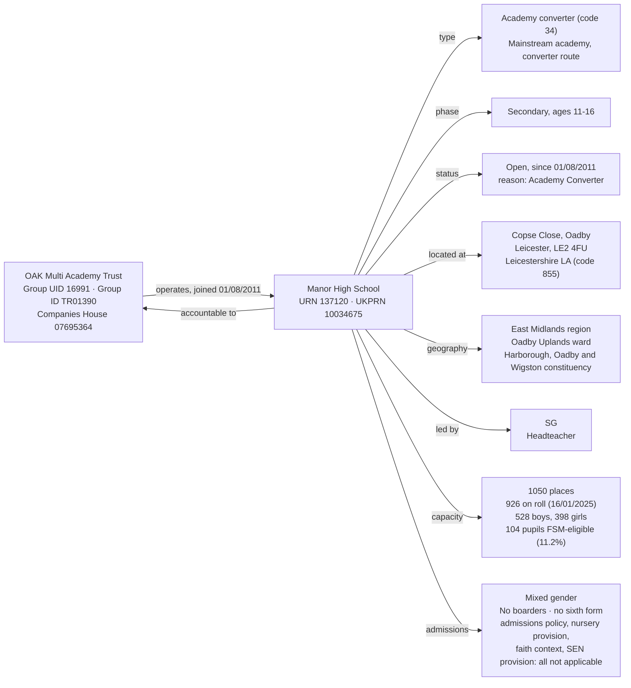
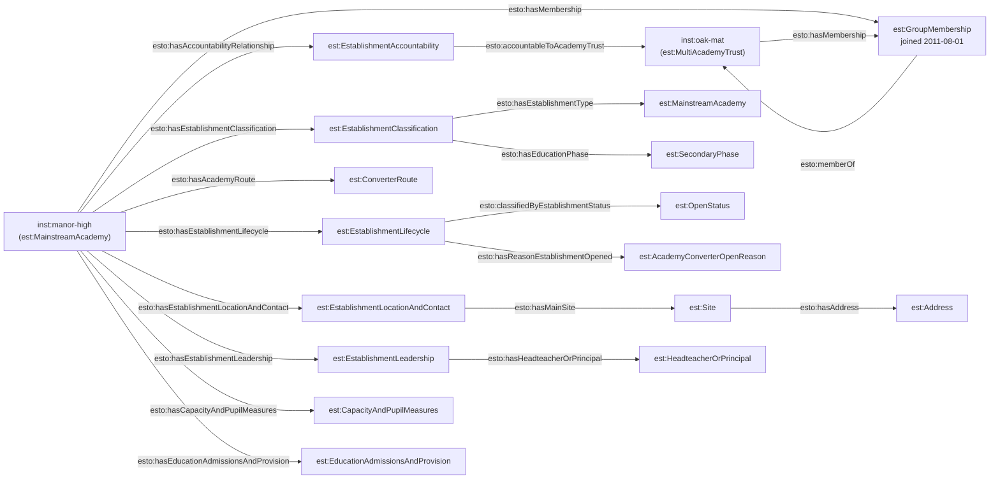

[← Worked examples](../)

# Establishment Ontology — Manor High School / OAK Multi Academy Trust example

| | |
|---|---|
| **Academy** | Manor High School, URN 137120 |
| **Trust** | OAK Multi Academy Trust — GIAS UID 16991, Group ID TR01390, Companies House 07695364 |
| **Establishment type** | Academy converter (GIAS type code 34) |
| **Establishment ontology namespace** | `https://dfe-digital.github.io/education-provider-registry-docs/models/establishment/ontology/` |
| **Establishment vocabulary namespace** | `https://dfe-digital.github.io/education-provider-registry-docs/models/establishment/vocabulary/` |
| **Preferred prefixes** | `esto:` (properties) · `est:` (classes and named individuals) |
| **OWL documentation** | [Establishment ontology reference (WIDOCO)](../../ontology/) |
| **Source** | [establishment-ontology.ttl](https://github.com/DFE-Digital/education-provider-registry-docs/blob/main/models/establishment/establishment-ontology.ttl) |
| **Repository** | [DFE-Digital/education-provider-registry-docs](https://github.com/DFE-Digital/education-provider-registry-docs) |
| **Licence** | [Open Government Licence v3.0](https://www.nationalarchives.gov.uk/doc/open-government-licence/version/3/) |

---

This is the establishment side of the same real-world organisation the [governance Manor High School worked example](../../../governance/worked-examples/manor-high/) covers - the two pages share the same Academy Trust and Academy identifiers (`inst:oak-mat`, `inst:manor-high`) but map different data: this page covers establishment identity, classification, accountability, group membership and location; the governance page covers local governing body people, appointments and roles.

Manor High is a useful contrast to the [Medlock example](../medlock-mat/): where Medlock has real values for boarding, nursery, faith context and SEN provision, Manor High's GIAS extract shows almost all of those as "Not applicable" - a clean demonstration of the RDF-idiomatic absence-of-triple principle across a much larger share of an establishment's record.

---

## Section 1 — The real-world establishment record

This section is the record as evidenced, before any ontology is applied.

### Sources

| Source | Publisher | What it evidences | Observed |
|---|---|---|---|
| [GIAS: Manor High School, URN 137120](https://www.get-information-schools.service.gov.uk/Establishments/Establishment/Details/137120) | Get Information about Schools (DfE) | Establishment identity, classification, lifecycle, location, leadership, capacity and pupil measures | GIAS extract 16 June 2026 |
| [GIAS: OAK Multi Academy Trust, Group UID 16991](https://www.get-information-schools.service.gov.uk/Groups/Group/Details/16991) | Get Information about Schools (DfE) | Group identity (Group ID `TR01390`), Companies House number, incorporation date, group status and registered address | GIAS extract 22 June 2026 |
| [GIAS establishment/group links extract](https://www.get-information-schools.service.gov.uk/) | Get Information about Schools (DfE) | Single group membership record linking URN 137120 to Group UID 16991, joined 1 August 2011 - the same date as the establishment's own `OpenDate` | GIAS extract 30 June 2026 |

### Structure



Unlike Medlock, GIAS records exactly one group link for Manor High - no sponsor-type duplication. The `Joined date` (1 August 2011) matches the establishment's own `OpenDate` exactly, consistent with a converter academy joining its trust the same day it converts.

---

## Section 2 — Modelled in the establishment ontology

The same record from Section 1, expressed in Turtle using `establishment-ontology.ttl` (`est:`/`esto:`).

### Structure



No `esto:hasFaithContext` or `esto:hasSenAndResourcedProvision` triple is asserted for `inst:manor-high` at all - GIAS records "Does not apply"/"Not applicable" for every field in both groups, and per the RDF-idiomatic principle, that absence is expressed by omitting the property, not by populating it with placeholder values.

### Namespace prefixes

All examples in this section use the following prefixes.

```
@prefix est:   <https://dfe-digital.github.io/education-provider-registry-docs/models/establishment/vocabulary/> .
@prefix esto:  <https://dfe-digital.github.io/education-provider-registry-docs/models/establishment/ontology/> .
@prefix rdf:   <http://www.w3.org/1999/02/22-rdf-syntax-ns#> .
@prefix rdfs:  <http://www.w3.org/2000/01/rdf-schema#> .
@prefix owl:   <http://www.w3.org/2002/07/owl#> .
@prefix xsd:   <http://www.w3.org/2001/XMLSchema#> .
@prefix inst:  <https://dfe-digital.github.io/education-provider-registry-docs/establishment/> .
```

### Example 1 — Establishment and Academy Trust identity

`inst:oak-mat` and `inst:manor-high` are the same instances used in the [governance worked example](../../../governance/worked-examples/manor-high/) - there, they appear as type stubs; here, they carry their full establishment-model detail.

```
inst:oak-mat
    a est:MultiAcademyTrust ;
    rdfs:label "OAK Multi Academy Trust"@en ;

    esto:hasGroupUniqueIdentifier [
        a est:GroupUniqueIdentifier ;
        rdf:value "16991"^^xsd:positiveInteger
    ] ;

    esto:identifiedByGroupId [
        a est:GroupId ;
        rdf:value "TR01390"
    ] ;

    esto:hasGroupCompaniesHouseNumber [
        a est:CompaniesHouseNumber ;
        rdf:value "07695364"
    ] .

inst:manor-high
    a est:MainstreamAcademy ;
    rdfs:label "Manor High School"@en ;

    esto:hasEstablishmentIdentity [
        a est:EstablishmentIdentity ;
        esto:identifiedByUrn [
            a est:UniqueReferenceNumber ;
            rdf:value "137120"^^xsd:positiveInteger
        ] ;
        esto:hasUkprn [
            a est:UkProviderReferenceNumber ;
            rdf:value "10034675"^^xsd:positiveInteger
        ]
    ] .
```

### Example 2 — Classification, academy route and reason opened

`est:MainstreamAcademy` is shared with the Medlock example - GIAS type codes 28 ("Academy sponsor led") and 34 ("Academy converter") both resolve to this one leaf class, distinguished by `esto:hasAcademyRoute`. Manor High's `est:ReasonEstablishmentOpened` value, `est:AcademyConverterOpenReason`, is one of the 13 named individuals added when this class's real GIAS values were checked and found to be a genuine closed list rather than open text - the first worked example to use it.

```
inst:manor-high
    esto:hasEstablishmentClassification [
        a est:EstablishmentClassification ;
        esto:hasEstablishmentType est:MainstreamAcademy ;
        esto:hasEstablishmentTypeGroup est:EstablishmentTypeGroupAcademies ;
        esto:hasEducationPhase est:SecondaryPhase
    ] ;

    esto:hasAcademyRoute est:ConverterRoute ;

    esto:hasEstablishmentLifecycle [
        a est:EstablishmentLifecycle ;
        esto:classifiedByEstablishmentStatus est:OpenStatus ;
        esto:hasOpenDate [
            a est:OpenDate ;
            rdf:value "2011-08-01"^^xsd:date
        ] ;
        esto:hasReasonEstablishmentOpened est:AcademyConverterOpenReason
    ] .
```

### Example 3 — Accountability and group membership

Unlike Medlock, there is no sponsor-type duplication to resolve here - Manor High has exactly one group link in the GIAS extract, so `esto:hasMembership` and `esto:accountableToAcademyTrust` both point at the same, single `inst:oak-mat` instance without needing `esto:sponsoredBy` at all.

```
inst:manor-high
    esto:hasAccountabilityRelationship [
        a est:EstablishmentAccountability ;
        esto:accountableToAcademyTrust inst:oak-mat
    ] ;

    esto:hasMembership [
        a est:GroupMembership ;
        esto:memberOf inst:oak-mat ;
        esto:hasGroupMembershipDate [
            a est:GroupMembershipDate ;
            rdf:value "2011-08-01"^^xsd:date
        ]
    ] .
```

### Example 4 — Location, contact and administrative geography

```
inst:manor-high
    esto:hasEstablishmentLocationAndContact [
        a est:EstablishmentLocationAndContact ;
        esto:hasMainSite [
            a est:Site ;
            esto:hasAddress [
                a est:Address ;
                rdfs:label "Copse Close, Oadby, Leicester, LE2 4FU"@en ;
                esto:hasAddressLine1 [ a est:AddressLine1 ; rdf:value "Copse Close"@en ] ;
                esto:hasAddressLine2 [ a est:AddressLine2 ; rdf:value "Oadby"@en ] ;
                esto:hasTown [ a est:Town ; rdf:value "Leicester"@en ] ;
                esto:hasCounty [ a est:County ; rdf:value "Leicestershire"@en ] ;
                esto:hasPostcode [ a est:Postcode ; rdf:value "LE2 4FU" ]
            ] ;
            esto:hasUprn [ a est:UniquePropertyReferenceNumber ; rdf:value "100032054860"^^xsd:positiveInteger ]
        ] ;
        esto:hasWebsite [
            a est:Website ;
            rdf:value "http://www.manorhigh.leics.sch.uk/"
        ] ;
        esto:hasTelephoneNumber [
            a est:TelephoneNumber ;
            rdf:value "01162714941"
        ]
    ] ;

    esto:hasEstablishmentLeadership [
        a est:EstablishmentLeadership ;
        esto:hasHeadteacherOrPrincipal [
            a est:HeadteacherOrPrincipal ;
            rdfs:label "SG"@en
        ]
    ] ;

    esto:hasAdministrativeGeography [
        a est:AdministrativeGeography ;
        esto:classifiedByGovernmentOfficeRegion inst:region-east-midlands ;
        esto:classifiedByDistrictAdministrative [
            a est:DistrictAdministrative ;
            rdfs:label "Oadby and Wigston"@en
        ] ;
        esto:classifiedByAdministrativeWard [
            a est:AdministrativeWard ;
            rdfs:label "Oadby Uplands"@en
        ] ;
        esto:classifiedByParliamentaryConstituency [
            a est:ParliamentaryConstituency ;
            rdfs:label "Harborough, Oadby and Wigston"@en
        ] ;
        esto:classifiedByUrbanRuralClassification [
            a est:UrbanRuralClassification ;
            rdfs:label "Urban: Nearer to a major town or city"@en
        ] ;
        esto:hasGssLocalAuthorityCode [ a est:GssLocalAuthorityCode ; rdf:value "E10000018" ] ;
        esto:hasOsGridReference [
            a est:OsGridReference ;
            esto:hasEasting [ a est:Easting ; rdf:value "463749"^^xsd:nonNegativeInteger ] ;
            esto:hasNorthing [ a est:Northing ; rdf:value "301018"^^xsd:nonNegativeInteger ]
        ] ;
        esto:classifiedByMiddleLayerSuperOutputArea [
            a est:MiddleLayerSuperOutputArea ;
            rdfs:label "Oadby and Wigston 010"@en
        ] ;
        esto:classifiedByLowerLayerSuperOutputArea [
            a est:LowerLayerSuperOutputArea ;
            rdfs:label "Oadby and Wigston 010B"@en
        ]
    ] .

inst:region-east-midlands
    a est:GovernmentOfficeRegion ;
    rdfs:label "East Midlands"@en .
```

`inst:region-east-midlands` is a real-world reference entity, reusable by URI from any future East Midlands establishment, rather than an `owl:NamedIndividual` baked into the ontology - see the same note on Medlock's Example 5.

### Example 5 — Admissions, provision and capacity

Manor High's GIAS extract shows `AdmissionsPolicy`, `NurseryProvision` as "Not applicable" - genuinely common for secondary academies, not the exception (checked against the full extract when the same "not applicable" pattern was fixed for other establishments; the majority of open secondary schools show "Not applicable" for admissions policy). Both are simply omitted below, alongside boarding and sixth-form provision, which do have real values.

```
inst:manor-high
    esto:hasEducationAdmissionsAndProvision [
        a est:EducationAdmissionsAndProvision ;
        esto:classifiedByGenderOfEntry est:MixedGenderEntry ;
        esto:classifiedByBoardingProvision est:NoBoarders ;
        esto:classifiedBySixthFormProvision est:NoSixthForm ;
        esto:classifiedBySpecialClassProvision est:NoSpecialClasses ;
        esto:hasStatutoryAgeRange [
            a est:StatutoryAgeRange ;
            rdfs:label "11 to 16"@en ;
            esto:hasStatutoryLowAge [ a est:StatutoryLowAge ; rdf:value "11"^^xsd:nonNegativeInteger ] ;
            esto:hasStatutoryHighAge [ a est:StatutoryHighAge ; rdf:value "16"^^xsd:nonNegativeInteger ]
        ]
    ] ;

    esto:hasCapacityAndPupilMeasures [
        a est:CapacityAndPupilMeasures ;
        esto:hasSchoolCapacity [
            a est:SchoolCapacity ;
            rdf:value "1050"^^xsd:nonNegativeInteger
        ] ;
        esto:hasPupilCount [
            a est:PupilCount ;
            rdf:value "926"^^xsd:nonNegativeInteger ;
            rdfs:comment "528 boys, 398 girls."@en
        ] ;
        esto:hasCensusDate [ a est:CensusDate ; rdf:value "2025-01-16"^^xsd:date ] ;
        esto:hasFreeSchoolMealMeasure [
            a est:PupilsEligibleForFreeSchoolMeals ;
            rdf:value "104"^^xsd:nonNegativeInteger ;
            esto:hasPercentageEligibleForFreeSchoolMeals [ a est:PercentagePupilsEligibleForFreeSchoolMeals ; rdf:value "11.2"^^xsd:decimal ]
        ]
    ] ;

    esto:hasRecordCurrency [
        a est:RecordCurrencyAndStewardship ;
        esto:recordsDateLastChanged [
            a est:DateLastChangedOrConfirmed ;
            rdf:value "2026-05-22"^^xsd:date
        ]
    ] .
```

---

## What this example found

- **A clean converter-route contrast to Medlock's sponsor-led route.** Both resolve to `est:MainstreamAcademy`, distinguished only by `esto:hasAcademyRoute` (`est:ConverterRoute` here, `est:SponsorLedRoute` at Medlock) - confirms the type/route split works as intended across both academy formation routes, not just one.
- **First real use of `est:AcademyConverterOpenReason`.** Added earlier the same day as a named individual for `est:ReasonEstablishmentOpened`, alongside 12 sibling values, after checking the real GIAS extract showed a genuine closed list rather than open text. This is the first worked example to actually assert one.
- **No sponsor-duplication to resolve.** Medlock's GIAS extract records the same trust twice, once as a "Multi-academy trust" group and once as a "School sponsor" group - Manor High has exactly one group link, so `esto:sponsoredBy` isn't needed here at all.
- **This example found three more mandatory-field SHACL shapes that were the same anti-pattern as the faith-context fix earlier the same day.** `esto:sponsoredBy`, `esto:hasSenAndResourcedProvision` (and its children `hasSenUnitMeasure`, `classifiedByTypeOfResourcedProvision`, `hasResourcedProvisionMeasure`, `hasSpecialPupilMeasure`) all had `sh:minCount 1` for mainstream academies - checked against the real extract and found genuinely per-instance-optional (only 8166 of 10527 open mainstream academies have a sponsor; only 1334 have any SEN provision at all). Relaxed the same way. `est:Section41Approval` was a different shape of the same underlying problem: **100%** of open mainstream academies show "Not applicable" - not per-instance variability, but a field GIAS never populates for this type at all. Changed from `sh:minCount 1` to `sh:maxCount 0`, correcting the shape's direction rather than just relaxing it.
- **Most of the record is legitimately absent, not "not applicable".** Faith context, SEN and resourced provision, admissions policy, nursery provision and Section 41 approval are all omitted entirely for `inst:manor-high` - a much larger share of the record than Medlock, which had real values for several of these. Demonstrates the RDF-idiomatic absence principle across a genuinely typical secondary academy record, not just an edge case.
- **Not exercised by this example:** `est:SingleAcademyTrust`, `est:Federation`, `est:LocalAuthority`-accountable establishment types, and any faith, SEN or resourced-provision content (all absent for this establishment).

---

## Concept coverage

| Real-world concept | Manor High evidence | Ontology mapping | Fit |
|---|---|---|---|
| Academy Trust (legal entity, group) | GIAS UID 16991, Group ID TR01390, Companies House 07695364 | `est:MultiAcademyTrust` (`rdfs:subClassOf est:AcademyTrust`) | Direct |
| Academy | Manor High School, URN 137120, UKPRN 10034675 | `est:MainstreamAcademy` | Direct |
| Establishment type (legacy GIAS code 34) | "Academy converter" | `est:MainstreamAcademy` + `esto:hasAcademyRoute est:ConverterRoute` | Direct |
| Education phase | Secondary, ages 11-16 | `est:SecondaryPhase` | Direct |
| Lifecycle, status and reason opened | Open since 2011-08-01, "Academy Converter" | `est:OpenStatus` + `esto:hasOpenDate` + `est:AcademyConverterOpenReason` | Direct |
| Accountability | Academy accountable to its trust | `esto:accountableToAcademyTrust` | Direct |
| Group membership | Joined Group UID 16991, 2011-08-01 (same date as OpenDate) | `est:GroupMembership` + `esto:memberOf` + `esto:hasGroupMembershipDate` | Direct |
| Sponsorship | Not applicable - single, clean group link | Not asserted (`esto:sponsoredBy` omitted) | Direct - confirms the property is genuinely optional |
| Location and site | Copse Close, Oadby, LE2 4FU | `est:Site` + `est:Address` | Direct |
| Administrative geography | East Midlands region, Oadby Uplands ward, Harborough Oadby and Wigston constituency | `est:AdministrativeGeography` | Direct |
| Headteacher | SG | `est:HeadteacherOrPrincipal` | Direct |
| Capacity and pupil numbers | 1050 capacity, 926 on roll (528 boys, 398 girls), 104 FSM-eligible | `est:CapacityAndPupilMeasures` | Direct |
| Admissions and provision | Mixed, no boarders, no sixth form, no special classes | `est:EducationAdmissionsAndProvision` | Direct |
| Admissions policy, nursery provision | Not applicable | Absence of `esto:classifiedByAdmissionsPolicy`/`esto:classifiedByNurseryProvision` | Direct |
| Faith context | Does not apply (religious character, ethos and diocese) | Absence of `esto:hasFaithContext` | Direct |
| SEN and resourced provision | Not applicable - no values recorded | Absence of `esto:hasSenAndResourcedProvision` | Direct |
| Section 41 approval | Not applicable for all open mainstream academies | Absence of `esto:classifiedBySection41Approval` (shape corrected to `maxCount 0` for this type) | Direct |
| Sponsorship | Not applicable - no sponsor flag recorded | Absence of `esto:sponsoredBy` | Direct |
| Record currency | Last changed 2026-05-22 | `est:RecordCurrencyAndStewardship` + `esto:recordsDateLastChanged` | Direct |

---

**See also:** [Establishment vocabulary](../../vocabulary/) · [Establishment taxonomy](../../taxonomy/) · [Establishment ontology](../../ontology/) · [Establishment ontology graph viewer](../../ontology/webvowl/) · [Medlock / Co-operative Academies Trust example](../medlock-mat/) · [Governance worked example for the same organisation](../../../governance/worked-examples/manor-high/)
