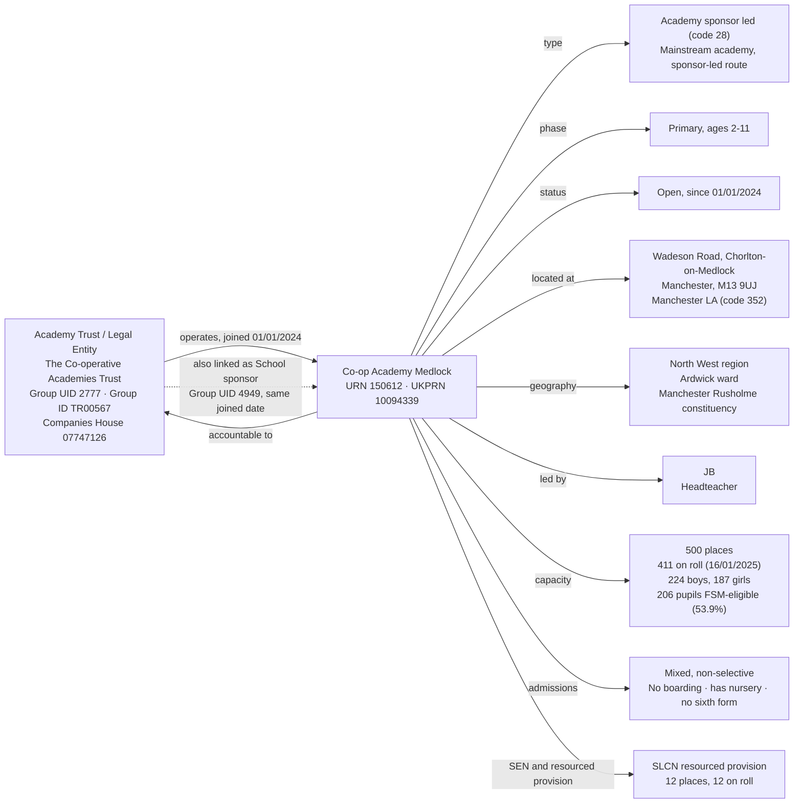
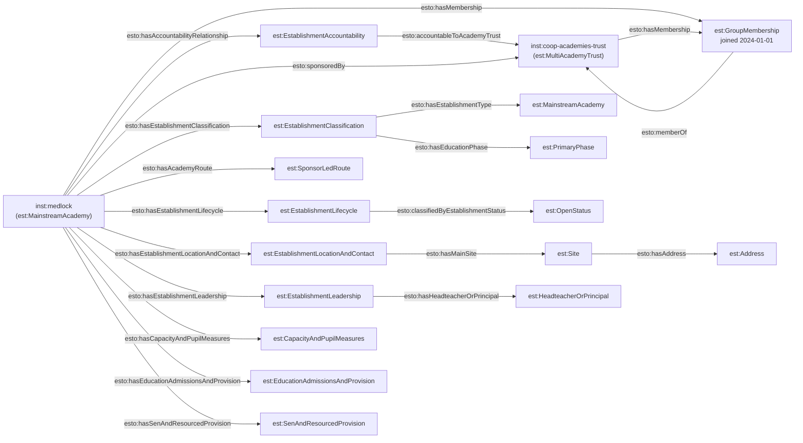

[← Worked examples](../)

# Establishment Ontology — Co-op Academy Medlock / The Co-operative Academies Trust example

| | |
|---|---|
| **Academy** | Co-op Academy Medlock, URN 150612 |
| **Trust** | The Co-operative Academies Trust — GIAS UID 2777, Companies House 07747126 |
| **Establishment type** | Academy sponsor led (GIAS type code 28) |
| **Establishment ontology namespace** | `https://dfe-digital.github.io/education-provider-registry-docs/models/establishment/ontology/` |
| **Establishment vocabulary namespace** | `https://dfe-digital.github.io/education-provider-registry-docs/models/establishment/vocabulary/` |
| **Preferred prefixes** | `esto:` (properties) · `est:` (classes and named individuals) |
| **OWL documentation** | [Establishment ontology reference (WIDOCO)](../../ontology/) |
| **Source** | [establishment-ontology.ttl](https://github.com/DFE-Digital/education-provider-registry-docs/blob/main/models/establishment/establishment-ontology.ttl) |
| **Repository** | [DFE-Digital/education-provider-registry-docs](https://github.com/DFE-Digital/education-provider-registry-docs) |
| **Licence** | [Open Government Licence v3.0](https://www.nationalarchives.gov.uk/doc/open-government-licence/version/3/) |

---

This is the establishment side of the same real-world organisation the [governance Medlock/Co-op Academies Trust worked example](../../../governance/worked-examples/medlock-mat/) covers - the two pages share the same Academy Trust and Academy identifiers (`inst:coop-academies-trust`, `inst:medlock`) but map different data: this page covers establishment identity, classification, accountability, group membership and location; the governance page covers people, appointments and roles. Since v1.17 the two pages also share a real person: Medlock's headteacher (JB) is the same real individual as the governance page's ex-officio Local Governing Body/Community Council Member `ginst:person-jb` - one instance, defined once in the governance worked example and reused here by reference, now typed as both `gov:GovernancePerson` and `est:HeadteacherOrPrincipal` rather than represented twice under two disconnected identities.

---

## Section 1 — The real-world establishment record

This section is the record as evidenced, before any ontology is applied.

### Sources

| Source | Publisher | What it evidences | Observed |
|---|---|---|---|
| [GIAS: Co-op Academy Medlock, URN 150612](https://www.get-information-schools.service.gov.uk/Establishments/Establishment/Details/150612) | Get Information about Schools (DfE) | Establishment identity, classification, lifecycle, location, leadership, capacity and pupil measures | GIAS extract 16 June 2026 |
| [GIAS: The Co-operative Academies Trust, Group UID 2777](https://www.get-information-schools.service.gov.uk/Groups/Group/Details/2777) | Get Information about Schools (DfE) | Group identity (Group ID `TR00567`), Companies House number, incorporation date, group status and registered address | GIAS extract 22 June 2026 |
| [GIAS establishment/group links extract](https://www.get-information-schools.service.gov.uk/) | Get Information about Schools (DfE) | Group membership records linking URN 150612 to Group UID 2777 (type: Multi-academy trust) and separately to Group UID 4949 (type: School sponsor), both joined 1 January 2024 | GIAS extract 30 June 2026 |
| [Companies House: company 07747126](https://find-and-update.company-information.service.gov.uk/company/07747126) | Companies House | Confirms The Co-operative Academies Trust is an active private company limited by guarantee - the same legal entity as GIAS UID 2777 | 24 July 2026 |

### Structure



The GIAS extract records **two separate group links** for URN 150612 against the same real-world organisation: one as a "Multi-academy trust" (Group UID 2777) and one as a "School sponsor" (Group UID 4949), both joined on the same date and both named "The Co-operative Academies Trust". `establishment-ontology.ttl` deliberately does not model this as two group entities - see Example 4 below and "What this example found".

---

## Section 2 — Modelled in the establishment ontology

The same record from Section 1, expressed in Turtle using `establishment-ontology.ttl` (`est:`/`esto:`).

### Structure



### Namespace prefixes

All examples in this section use the following prefixes.

```
@prefix est:   <https://dfe-digital.github.io/education-provider-registry-docs/models/establishment/vocabulary/> .
@prefix esto:  <https://dfe-digital.github.io/education-provider-registry-docs/models/establishment/ontology/> .
@prefix rdf:   <http://www.w3.org/1999/02/22-rdf-syntax-ns#> .
@prefix rdfs:  <http://www.w3.org/2000/01/rdf-schema#> .
@prefix owl:   <http://www.w3.org/2002/07/owl#> .
@prefix xsd:   <http://www.w3.org/2001/XMLSchema#> .
@prefix inst:  <https://dfe-digital.github.io/education-provider-registry-docs/establishment/> .
@prefix ginst: <https://dfe-digital.github.io/education-provider-registry-docs/models/governance/instance/> .
```

### Example 1 — Establishment and Academy Trust identity

`inst:coop-academies-trust` and `inst:medlock` are the same instances used in the [governance worked example](../../../governance/worked-examples/medlock-mat/) - there, they appear as type stubs (`est:AcademyTrust`, `est:Academy`); here, they carry their full establishment-model detail. `est:MainstreamAcademy` is the leaf type class for GIAS type code 28 ("Academy sponsor led") - see the [establishment type field rules](../../../establishment-type-field-rules/) for how this leaf type resolves from the legacy GIAS type code.

```
inst:coop-academies-trust
    a est:MultiAcademyTrust ;
    rdfs:label "The Co-operative Academies Trust"@en ;

    esto:hasGroupUniqueIdentifier [
        a est:GroupUniqueIdentifier ;
        rdf:value "2777"
    ] ;

    esto:identifiedByGroupId [
        a est:GroupId ;
        rdf:value "TR00567"
    ] ;

    esto:hasGroupCompaniesHouseNumber [
        a est:CompaniesHouseNumber ;
        rdf:value "07747126"
    ] .

inst:medlock
    a est:MainstreamAcademy ;
    rdfs:label "Co-op Academy Medlock"@en ;

    esto:hasEstablishmentIdentity [
        a est:EstablishmentIdentity ;
        esto:identifiedByUrn [
            a est:UniqueReferenceNumber ;
            rdf:value "150612"^^xsd:positiveInteger
        ] ;
        esto:hasUkprn [
            a est:UkProviderReferenceNumber ;
            rdf:value "10094339"^^xsd:positiveInteger
        ]
    ] .
```

### Example 2 — Classification and academy route

GIAS's `TypeOfEstablishment` field (code 28, "Academy sponsor led") is not itself an ontology class - it resolves to two separate classifications: the leaf establishment type (`est:MainstreamAcademy`, shared with academy converters) and the academy route (`est:SponsorLedRoute`, distinguishing sponsor-led from converter academies). `esto:hasAcademyRoute` exists specifically so this distinction isn't lost when both routes collapse to the same legacy GIAS type-group label.

```
inst:medlock
    esto:hasEstablishmentClassification [
        a est:EstablishmentClassification ;
        esto:hasEstablishmentType est:MainstreamAcademy ;
        esto:hasEstablishmentTypeGroup est:EstablishmentTypeGroupAcademies ;
        esto:hasEducationPhase est:PrimaryPhase
    ] ;

    esto:hasAcademyRoute est:SponsorLedRoute .
```

### Example 3 — Lifecycle and accountability

Medlock's GIAS `OpenDate` (1 January 2024) is also its group-joined date (Example 4) - a single real-world event GIAS records twice, in two different extracts, for two different purposes. Accountability is expressed independently of group membership: `esto:accountableToAcademyTrust` establishes the funding-agreement relationship that GIAS's own governance model treats as authoritative for academies, distinct from the group-membership structure in Example 4.

```
inst:medlock
    esto:hasEstablishmentLifecycle [
        a est:EstablishmentLifecycle ;
        esto:classifiedByEstablishmentStatus est:OpenStatus ;
        esto:hasOpenDate [
            a est:OpenDate ;
            rdf:value "2024-01-01"^^xsd:date
        ]
    ] ;

    esto:hasAccountabilityRelationship [
        a est:EstablishmentAccountability ;
        esto:accountableToAcademyTrust inst:coop-academies-trust
    ] .
```

### Example 4 — Group membership and sponsorship

The GIAS links extract records **two** group-link rows for URN 150612 against the same real-world Trust: one typed "Multi-academy trust" (Group UID 2777) and one typed "School sponsor" (Group UID 4949) - both named "The Co-operative Academies Trust", both joined 1 January 2024. Modelled literally, this would create two `est:EstablishmentGroup` instances for one organisation. `establishment-ontology.ttl` does not model sponsorship as a group type - sponsor is a role an organisation plays, not a distinct kind of group. The model instead uses: one `est:GroupMembership` record for the real membership (Example 1's Trust, via `esto:hasMembership`/`esto:memberOf`), and a direct `esto:sponsoredBy` property carrying the sponsorship fact without a second group entity.

```
inst:medlock
    esto:hasMembership [
        a est:GroupMembership ;
        esto:memberOf inst:coop-academies-trust ;
        esto:hasGroupMembershipDate [
            a est:GroupMembershipDate ;
            rdf:value "2024-01-01"^^xsd:date
        ]
    ] ;

    esto:sponsoredBy inst:coop-academies-trust .
```

*(The "School sponsor" group link, Group UID 4949, is deliberately not given a second `est:EstablishmentGroup` instance - see "What this example found" below.)*

### Example 5 — Location, contact and administrative geography

`est:Site` and `est:Address` are separated because a site is a physical place and an address is how correspondence reaches it - for Medlock, both resolve to the same location, but the model doesn't assume that in general (a trust's registered address, for instance, is rarely its teaching site). The site's UPRN identifies the specific physical building via Ordnance Survey, independent of any postcode lookup. Administrative geography (region, district, ward, constituency, urban/rural classification, GSS local authority code, OS grid reference, MSOA, LSOA) is derived from the postcode, not asserted independently - this is the first worked example to assert the full set shown on GIAS's Location tab, rather than just region/ward/constituency; all values checked directly against the real extract.

```
inst:medlock
    esto:hasEstablishmentLocationAndContact [
        a est:EstablishmentLocationAndContact ;
        esto:hasMainSite [
            a est:Site ;
            esto:hasAddress [
                a est:Address ;
                rdfs:label "Wadeson Road, Chorlton-on-Medlock, Manchester, M13 9UJ"@en ;
                esto:hasAddressLine1 [ a est:AddressLine1 ; rdf:value "Wadeson Road"@en ] ;
                esto:hasAddressLine2 [ a est:AddressLine2 ; rdf:value "Chorlton-on-Medlock"@en ] ;
                esto:hasTown [ a est:Town ; rdf:value "Manchester"@en ] ;
                esto:hasCounty [ a est:County ; rdf:value "Greater Manchester"@en ] ;
                esto:hasPostcode [ a est:Postcode ; rdf:value "M13 9UJ" ]
            ] ;
            esto:hasUprn [ a est:UniquePropertyReferenceNumber ; rdf:value "10023048531"^^xsd:positiveInteger ]
        ] ;
        esto:hasWebsite [
            a est:Website ;
            rdf:value "https://www.medlock.coopacademies.co.uk/"
        ] ;
        esto:hasTelephoneNumber [
            a est:TelephoneNumber ;
            rdf:value "01612731830"
        ]
    ] ;

    esto:hasEstablishmentLeadership [
        a est:EstablishmentLeadership ;
        esto:hasHeadteacherOrPrincipal ginst:person-jb
    ] ;

    esto:hasAdministrativeGeography [
        a est:AdministrativeGeography ;
        esto:classifiedByGovernmentOfficeRegion inst:region-north-west ;
        esto:classifiedByDistrictAdministrative [
            a est:DistrictAdministrative ;
            rdfs:label "Manchester"@en
        ] ;
        esto:classifiedByAdministrativeWard [
            a est:AdministrativeWard ;
            rdfs:label "Ardwick"@en
        ] ;
        esto:classifiedByParliamentaryConstituency [
            a est:ParliamentaryConstituency ;
            rdfs:label "Manchester Rusholme"@en
        ] ;
        esto:classifiedByUrbanRuralClassification [
            a est:UrbanRuralClassification ;
            rdfs:label "Urban: Nearer to a major town or city"@en
        ] ;
        esto:hasGssLocalAuthorityCode [ a est:GssLocalAuthorityCode ; rdf:value "E08000003" ] ;
        esto:hasOsGridReference [
            a est:OsGridReference ;
            esto:hasEasting [ a est:Easting ; rdf:value "385162"^^xsd:nonNegativeInteger ] ;
            esto:hasNorthing [ a est:Northing ; rdf:value "397114"^^xsd:nonNegativeInteger ]
        ] ;
        esto:classifiedByMiddleLayerSuperOutputArea [
            a est:MiddleLayerSuperOutputArea ;
            rdfs:label "Manchester 018"@en
        ] ;
        esto:classifiedByLowerLayerSuperOutputArea [
            a est:LowerLayerSuperOutputArea ;
            rdfs:label "Manchester 018D"@en
        ]
    ] .

inst:region-north-west
    a est:GovernmentOfficeRegion ;
    rdfs:label "North West"@en .
```

`inst:region-north-west` is a real-world reference entity, not a controlled-vocabulary value defined by the ontology itself - one instance, reusable by URI from any future establishment in the North West, the same way `inst:coop-academies-trust` is defined once and referenced rather than reconstructed per establishment. Region instances live in the `inst:` instance-data namespace, not as `owl:NamedIndividual`s baked into `establishment-ontology.ttl` - the ontology only defines the class (`est:GovernmentOfficeRegion`) that any number of such real-world regions can be instances of.

### Example 6 — Admissions, provision, capacity and SEN

Medlock's GIAS extract shows a mixed, non-selective community-style admissions pattern typical of a sponsor-led primary academy, plus a resourced provision unit for speech, language and communication needs (SLCN) - 12 places, all filled. `est:TypeOfSenProvision` (the need type - SLCN, autism, and so on) and `est:TypeOfResourcedProvision` (which kind of facility the establishment hosts - a resourced provision unit, a SEN unit, or both) are two distinct classifications: Medlock's resourced provision unit happens to be for SLCN, but the facility type and the need it serves aren't the same fact and don't share a value set.

```
inst:medlock
    esto:hasEducationAdmissionsAndProvision [
        a est:EducationAdmissionsAndProvision ;
        esto:classifiedByGenderOfEntry est:MixedGenderEntry ;
        esto:classifiedByAdmissionsPolicy est:NonSelectiveAdmissions ;
        esto:classifiedByBoardingProvision est:NoBoarders ;
        esto:classifiedByNurseryProvision est:HasNurseryClasses ;
        esto:classifiedBySixthFormProvision est:NoSixthForm ;
        esto:classifiedBySpecialClassProvision est:NoSpecialClasses ;
        esto:hasStatutoryAgeRange [
            a est:StatutoryAgeRange ;
            rdfs:label "2 to 11"@en ;
            esto:hasStatutoryLowAge [ a est:StatutoryLowAge ; rdf:value "2"^^xsd:nonNegativeInteger ] ;
            esto:hasStatutoryHighAge [ a est:StatutoryHighAge ; rdf:value "11"^^xsd:nonNegativeInteger ]
        ]
    ] ;

    esto:hasCapacityAndPupilMeasures [
        a est:CapacityAndPupilMeasures ;
        esto:hasSchoolCapacity [
            a est:SchoolCapacity ;
            rdf:value "500"^^xsd:nonNegativeInteger
        ] ;
        esto:hasPupilCount [
            a est:PupilCount ;
            rdf:value "411"^^xsd:nonNegativeInteger ;
            rdfs:comment "224 boys, 187 girls."@en
        ] ;
        esto:hasCensusDate [ a est:CensusDate ; rdf:value "2025-01-16"^^xsd:date ] ;
        esto:hasFreeSchoolMealMeasure [
            a est:PupilsEligibleForFreeSchoolMeals ;
            rdf:value "206"^^xsd:nonNegativeInteger ;
            esto:hasPercentageEligibleForFreeSchoolMeals [ a est:PercentagePupilsEligibleForFreeSchoolMeals ; rdf:value "53.9"^^xsd:decimal ]
        ]
    ] ;

    esto:hasSenAndResourcedProvision [
        a est:SenAndResourcedProvision ;
        esto:classifiedByTypeOfSenProvision est:SpeechLanguageAndCommunicationNeeds ;
        esto:classifiedByTypeOfResourcedProvision est:ResourcedProvisionFacility ;
        esto:hasResourcedProvisionMeasure [
            a est:ResourcedProvisionMeasure ;
            rdfs:label "12 places, 12 on roll"@en ;
            esto:hasResourcedProvisionCapacity [ a est:ResourcedProvisionCapacity ; rdf:value "12"^^xsd:nonNegativeInteger ] ;
            esto:hasResourcedProvisionPupilCount [ a est:ResourcedProvisionPupilCount ; rdf:value "12"^^xsd:nonNegativeInteger ]
        ]
    ] .
```

No `esto:hasSenUnitMeasure` - GIAS's `SenUnitOnRoll`/`SenUnitCapacity` are blank for Medlock, so the property is omitted rather than asserted with placeholder "0 places" values. A SEN unit is a distinct provision type from the resourced provision recorded above; see the Brookside Primary School example for a real establishment with both.

### Example 7 — Record currency

Medlock's GIAS extract records `ReligiousCharacter`, `ReligiousEthos` and `Diocese` as "Does not apply" / "Not applicable" - Medlock has no religious designation at all. The ontology represents that as the *absence* of a faith-context record, not a faith-context record populated with "not applicable" values: RDF's own semantics already say "no assertion" when a triple isn't present, so a real-world non-fact doesn't need a placeholder individual to say so. `esto:hasFaithContext` is therefore simply not asserted for `inst:medlock` at all.

`est:RecordCurrencyAndStewardship` carries GIAS's own `LastChangedDate`, the extract's record of when this establishment's data was last confirmed or edited.

```
inst:medlock
    esto:hasRecordCurrency [
        a est:RecordCurrencyAndStewardship ;
        esto:recordsDateLastChanged [
            a est:DateLastChangedOrConfirmed ;
            rdf:value "2026-06-03"^^xsd:date
        ]
    ] .
```

---

## What this example found

- **The group-membership/sponsorship duplication (Example 4) is real GIAS extract behaviour, not a hypothetical.** The same establishment, the same joined date, the same organisation name, recorded as two separate group-link rows with two different group types. `establishment-ontology.ttl` avoids this duplication by treating sponsorship as a role (`esto:sponsoredBy`), not a group type - this worked example is the first to exercise that against real extract data.
- **One real-world date, two GIAS fields.** Medlock's `OpenDate` and its group `Joined date` are both `2024-01-01` - the establishment opened and joined its trust on the same day, which is unsurprising for a sponsor-led academy but not guaranteed in general (a converter academy's `OpenDate` predates its GIAS record; a school moving between trusts has a `Joined date` unrelated to its own `OpenDate`). The model keeps these as two separate dated facts (`esto:hasOpenDate` on lifecycle, `esto:hasGroupMembershipDate` on group membership) rather than assuming they coincide.
- **Faith context is absent, not "not applicable".** Medlock has no religious character, ethos or diocese - the ontology represents that as no `esto:hasFaithContext` triple at all, rather than a faith-context record populated with placeholder "not applicable" values. This is the RDF-idiomatic way to express a real-world non-fact: absence of a triple already means "no assertion."
- **SEN need types weren't modelled as named concepts at all.** `est:TypeOfSenProvision` had no `owl:NamedIndividual` values - "SLCN" would only ever have been representable as a free-text label, not a thing with its own URI. GIAS's SEN1-SEN13 codes are a real, closed, statutory list (the SEND Code of Practice 0 to 25's four broad areas of need), so this example's SLCN value is now `est:SpeechLanguageAndCommunicationNeeds`, one of 12 named individuals. Checking this also surfaced a second, separate error: `est:TypeOfResourcedProvision`'s own definition wrongly described it as the SEN need type - it's actually a different, much smaller classification (which kind of facility exists: resourced provision unit, SEN unit, or both). Fixed both.
- **Not exercised by this example:** `est:SingleAcademyTrust`, `est:Federation`, `est:LocalAuthority`-accountable establishment types, and the `est:AcademyTrust` legal-form distinction from its Companies House registration (covered instead by the governance worked example's Example 1, which carries the same Companies House number on the same `inst:coop-academies-trust` instance).
- **Retroactive fix:** this page originally asserted `esto:classifiedBySection41Approval` with a "Not applicable" placeholder value for Medlock, following the same anti-pattern the faith-context fix (above) addressed. The [Manor High School worked example](../manor-high/) found this specific case (checking the real GIAS extract showed 100% "Not applicable" across every open mainstream academy) and corrected the underlying SHACL shape from `minCount 1` to `maxCount 0` for this type. This page was updated to match - the property is no longer asserted at all.

---

## Concept coverage

| Real-world concept | Medlock evidence | Ontology mapping | Fit |
|---|---|---|---|
| Academy Trust (legal entity, group) | GIAS UID 2777, Group ID TR00567, Companies House 07747126 | `est:MultiAcademyTrust` (`rdfs:subClassOf est:AcademyTrust`) | Direct |
| Academy | Co-op Academy Medlock, URN 150612, UKPRN 10094339 | `est:MainstreamAcademy` | Direct |
| Establishment type (legacy GIAS code 28) | "Academy sponsor led" | `est:MainstreamAcademy` + `esto:hasAcademyRoute est:SponsorLedRoute` | Direct - resolves one legacy code into two ontology facts |
| Education phase | Primary, ages 2-11 | `est:PrimaryPhase` | Direct |
| Lifecycle and status | Open since 2024-01-01 | `est:OpenStatus` + `esto:hasOpenDate` | Direct |
| Accountability | Academy accountable to its trust | `esto:accountableToAcademyTrust` | Direct |
| Group membership | Joined Group UID 2777, 2024-01-01 | `est:GroupMembership` + `esto:memberOf` + `esto:hasGroupMembershipDate` | Direct |
| Sponsorship | Second group link, Group UID 4949, "School sponsor", same trust | `esto:sponsoredBy` (direct property, no second group entity) | Direct - avoids GIAS's own duplicate-group-row pattern for the same organisation |
| Location and site | Wadeson Road, Chorlton-on-Medlock, M13 9UJ | `est:Site` + `est:Address` | Direct |
| Administrative geography | North West region, Manchester district, Ardwick ward, Manchester Rusholme constituency, urban classification, GSS code E08000003, OS grid ref, MSOA/LSOA | `est:AdministrativeGeography` | Direct |
| Headteacher | JB | `est:HeadteacherOrPrincipal` | Direct - shared instance (`ginst:person-jb`) with the governance worked example's ex-officio Local Governing Body/Community Council Member, not a second, disconnected identity |
| Capacity and pupil numbers | 500 capacity, 411 on roll (224 boys, 187 girls), 206 FSM-eligible | `est:CapacityAndPupilMeasures` | Direct |
| Admissions and provision | Mixed, non-selective, no boarding, has nursery, no sixth form | `est:EducationAdmissionsAndProvision` | Direct |
| SEN and resourced provision | SLCN resourced provision, 12 places, 12 on roll | `est:SenAndResourcedProvision`, `est:SpeechLanguageAndCommunicationNeeds`, `est:ResourcedProvisionFacility` | Direct |
| Faith context | Medlock has no religious character, ethos or diocese | Absence of `esto:hasFaithContext` | Direct - no faith-context triple is asserted, rather than a record populated with "not applicable" values |

---

**See also:** [Establishment vocabulary](../../vocabulary/) · [Establishment taxonomy](../../taxonomy/) · [Establishment ontology](../../ontology/) · [Establishment ontology graph viewer](../../ontology/webvowl/) · [Governance worked example for the same organisation](../../../governance/worked-examples/medlock-mat/)
