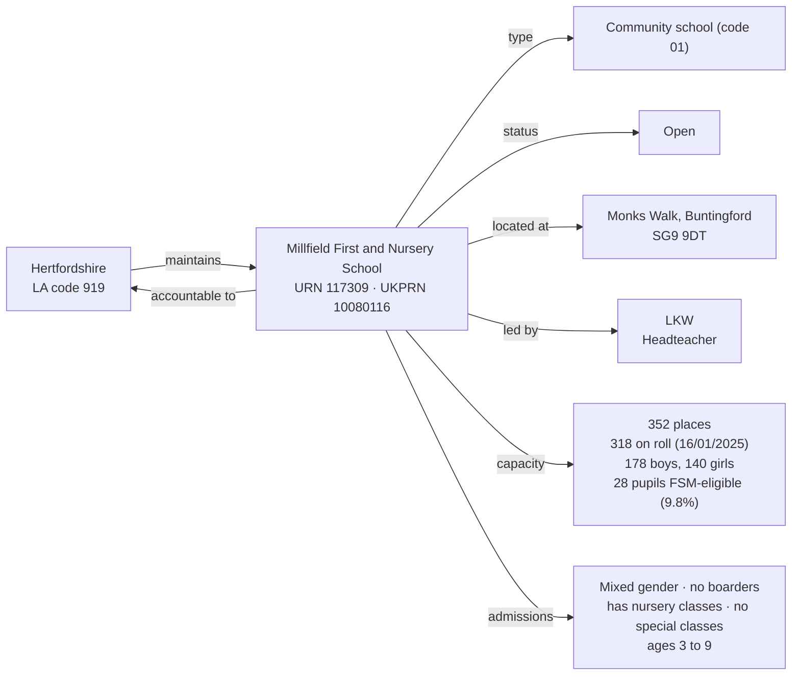

[← Worked examples](../)

# Establishment Ontology — Millfield First and Nursery School example

| | |
|---|---|
| **Establishment** | Millfield First and Nursery School, URN 117309 |
| **Local authority** | Hertfordshire, LA code 919 |
| **Establishment type** | Community school (GIAS type code 01) |
| **Establishment ontology namespace** | `https://dfe-digital.github.io/education-provider-registry-docs/models/establishment/ontology/` |
| **Establishment vocabulary namespace** | `https://dfe-digital.github.io/education-provider-registry-docs/models/establishment/vocabulary/` |
| **Preferred prefixes** | `esto:` (properties) · `est:` (classes and named individuals) |
| **OWL documentation** | [Establishment ontology reference (WIDOCO)](../../ontology/) |
| **Source** | [establishment-ontology.ttl](https://github.com/DFE-Digital/education-provider-registry-docs/blob/main/models/establishment/establishment-ontology.ttl) |
| **Repository** | [DFE-Digital/education-provider-registry-docs](https://github.com/DFE-Digital/education-provider-registry-docs) |
| **Licence** | [Open Government Licence v3.0](https://www.nationalarchives.gov.uk/doc/open-government-licence/version/3/) |

`inst:millfield` is the same instance used in the [governance worked example](../../../governance/worked-examples/millfield/). Headteacher shown as `LKW` (initials only).

---

## Section 1 — The real-world establishment record

### Sources

| Source | Publisher | What it evidences | Observed |
|---|---|---|---|
| [GIAS: Millfield First and Nursery School, URN 117309](https://www.get-information-schools.service.gov.uk/Establishments/Establishment/Details/117309) | Get Information about Schools (DfE) | Establishment identity, classification, lifecycle, location, leadership, capacity, pupil measures | GIAS extract 16 June 2026 |

### Structure



No group membership - Millfield has no trust, sponsor or federation link, the same as Gilded Hollins. Its statutory age range (3 to 9) is narrower than every other primary-phase school modelled so far, all of which ran 3/4 to 11 - a real "first school", not a whole-primary or infant/junior split.

---

## Section 2 — Modelled in the establishment ontology

### Namespace prefixes

```
@prefix est:   <https://dfe-digital.github.io/education-provider-registry-docs/models/establishment/vocabulary/> .
@prefix esto:  <https://dfe-digital.github.io/education-provider-registry-docs/models/establishment/ontology/> .
@prefix rdf:   <http://www.w3.org/1999/02/22-rdf-syntax-ns#> .
@prefix rdfs:  <http://www.w3.org/2000/01/rdf-schema#> .
@prefix owl:   <http://www.w3.org/2002/07/owl#> .
@prefix xsd:   <http://www.w3.org/2001/XMLSchema#> .
@prefix inst:  <https://dfe-digital.github.io/education-provider-registry-docs/establishment/> .
```

### Example 1 — Identity, LA accountability and lifecycle

The same standalone-community-school pattern as Gilded Hollins: `est:CommunitySchool`, LA accountability, no group membership.

```
inst:millfield
    a est:CommunitySchool ;
    rdfs:label "Millfield First and Nursery School"@en ;

    esto:hasEstablishmentIdentity [
        a est:EstablishmentIdentity ;
        esto:identifiedByUrn [
            a est:UniqueReferenceNumber ;
            rdf:value "117309"^^xsd:positiveInteger
        ] ;
        esto:hasUkprn [
            a est:UkProviderReferenceNumber ;
            rdf:value "10080116"^^xsd:positiveInteger
        ]
    ] ;

    esto:hasAccountabilityRelationship [
        a est:EstablishmentAccountability ;
        esto:accountableToLocalAuthority inst:la-919
    ] ;

    esto:hasEstablishmentLifecycle [
        a est:EstablishmentLifecycle ;
        esto:classifiedByEstablishmentStatus est:OpenStatus
    ] .

inst:la-919
    a est:LocalAuthority ;
    rdfs:label "Hertfordshire"@en .
```

### Example 2 — Classification, location and leadership

```
inst:millfield
    esto:hasEstablishmentClassification [
        a est:EstablishmentClassification ;
        esto:hasEstablishmentType est:CommunitySchool ;
        esto:hasEducationPhase est:PrimaryPhase
    ] ;

    esto:hasEstablishmentLocationAndContact [
        a est:EstablishmentLocationAndContact ;
        esto:hasHeadteacherOrPrincipal [
            a est:HeadteacherOrPrincipal ;
            rdfs:label "LKW"@en
        ] ;
        esto:hasMainSite [
            a est:Site ;
            esto:hasAddress [
                a est:Address ;
                rdfs:label "Monks Walk, Buntingford, SG9 9DT"@en
            ]
        ]
    ] .
```

No `esto:hasFaithContext`, no `esto:classifiedByAdmissionsPolicy` - both "Not applicable" in the real extract, the same as Gilded Hollins.

### Example 3 — Admissions, provision, capacity and record currency

`est:PrimaryPhase` still applies - GIAS classifies Millfield's phase as Primary - but the statutory age range (3 to 9) is real evidence that "primary phase" spans more than one school-age structure: this is a first school, ending well before the usual age-11 transfer every other primary-phase example so far has used.

```
inst:millfield
    esto:hasEducationAdmissionsAndProvision [
        a est:EducationAdmissionsAndProvision ;
        esto:classifiedByGenderOfEntry est:MixedGenderEntry ;
        esto:classifiedByBoardingProvision est:NoBoarders ;
        esto:classifiedByNurseryProvision est:HasNurseryClasses ;
        esto:classifiedBySpecialClassProvision est:NoSpecialClasses ;
        esto:hasStatutoryAgeRange [
            a est:StatutoryAgeRange ;
            rdfs:label "3 to 9"@en
        ]
    ] ;

    esto:hasCapacityAndPupilMeasures [
        a est:CapacityAndPupilMeasures ;
        esto:hasSchoolCapacity [
            a est:SchoolCapacity ;
            rdf:value "352"^^xsd:nonNegativeInteger
        ] ;
        esto:hasPupilCount [
            a est:PupilCount ;
            rdf:value "318"^^xsd:nonNegativeInteger ;
            rdfs:comment "Census date 2025-01-16: 178 boys, 140 girls."@en
        ] ;
        esto:hasFreeSchoolMealMeasure [
            a est:PupilsEligibleForFreeSchoolMeals ;
            rdfs:label "28"^^xsd:integer ;
            rdfs:comment "9.8% of pupils on roll."@en
        ]
    ] ;

    esto:hasRecordCurrency [
        a est:RecordCurrencyAndStewardship ;
        esto:recordsDateLastChanged [
            a est:DateLastChangedOrConfirmed ;
            rdf:value "2026-04-20"^^xsd:date
        ]
    ] .
```

No `esto:hasSenAndResourcedProvision` - all 13 SEN fields and both resourced-provision fields are "Not applicable" in the real extract, the same as Gilded Hollins.

---

## What this example found

- **A real "first school" age range.** Every prior primary-phase example ran to age 11 (or split infant/junior around age 7, as at Long Ditton). Millfield's statutory age range is 3 to 9 - genuinely narrower, reflecting the English first/middle/upper school system rather than a whole-primary or infant/junior structure, while still carrying the same `est:PrimaryPhase` value as every other example. Confirms education phase and statutory age range are independent facts, not derivable from one another.
- **A second standalone community school**, alongside Gilded Hollins - no trust, sponsor or federation link on either. Millfield has nursery classes where Gilded Hollins doesn't, the only structural difference between the two beyond age range.
- **A fourth real SEN/resourced-provision combination: neither present.** Same absence pattern as Gilded Hollins, on a different school - reinforces that "no SEN provision at all" is a common, genuine real-world case, not a modelling gap.
- **Not exercised by this example:** academy trust, sponsor, generic trust and federation relationships; faith context; admissions policy; Section 41 approval; job title variants (Headteacher is plain here).

---

## Concept coverage

| Real-world concept | Millfield evidence | Ontology mapping | Fit |
|---|---|---|---|
| Establishment | Millfield First and Nursery School, URN 117309, UKPRN 10080116 | `est:CommunitySchool` | Direct |
| Local authority accountability | Maintained by Hertfordshire (LA code 919) | `esto:accountableToLocalAuthority` + `est:LocalAuthority` | Direct |
| Establishment type | Community school (GIAS type code 01) | `est:CommunitySchool` | Direct |
| Status | Open | `est:OpenStatus` | Direct |
| Location | Monks Walk, Buntingford, SG9 9DT | `est:Site` + `est:Address` | Direct |
| Headteacher | LKW | `est:HeadteacherOrPrincipal` | Direct |
| First-school age range | Ages 3 to 9, within `est:PrimaryPhase` | `est:StatutoryAgeRange` | Direct - narrower than every other primary example so far |
| Capacity and pupil numbers | 352 capacity, 318 on roll (178 boys, 140 girls), 28 FSM-eligible | `est:CapacityAndPupilMeasures` | Direct |
| Nursery provision | Has nursery classes | `est:HasNurseryClasses` | Direct |
| SEN and resourced provision | Not applicable | Absence of `esto:hasSenAndResourcedProvision` | Direct |
| Faith context, admissions policy, Section 41 approval | Not applicable | Absence of the respective properties | Direct |
| Record currency | Last changed 2026-04-20 | `est:RecordCurrencyAndStewardship` + `esto:recordsDateLastChanged` | Direct |

---

**See also:** [Establishment vocabulary](../../vocabulary/) · [Establishment taxonomy](../../taxonomy/) · [Establishment ontology](../../ontology/) · [Establishment ontology graph viewer](../../ontology/webvowl/) · [Medlock example](../medlock-mat/) · [Manor High example](../manor-high/) · [Frank Barnes example](../frank-barnes/) · [Eileen Wade / Milton Ernest example](../eileen-wade-milton-ernest/) · [Long Ditton example](../long-ditton/) · [St Luke's / Moreland example](../st-lukes-moreland/) · [Vauxhall Primary / Wyvern Federation example](../vauxhall-primary/) · [Gilded Hollins example](../gilded-hollins/) · [Governance worked example for the same organisation](../../../governance/worked-examples/millfield/)
