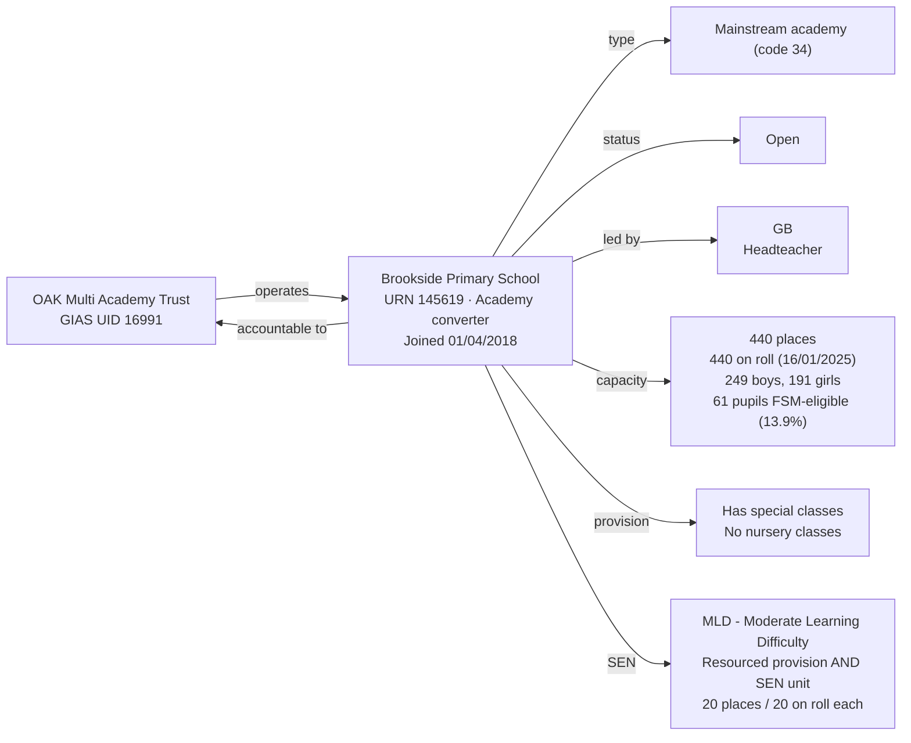

[← Worked examples](../)

# Establishment Ontology — Brookside Primary School / OAK Multi Academy Trust example

| | |
|---|---|
| **Academy Trust** | OAK Multi Academy Trust, GIAS UID 16991 |
| **Establishment** | Brookside Primary School, URN 145619 |
| **Local authority** | Leicestershire, LA code 855 |
| **Establishment type** | Mainstream academy (GIAS type code 34, Academy converter) |
| **Establishment ontology namespace** | `https://dfe-digital.github.io/education-provider-registry-docs/models/establishment/ontology/` |
| **Establishment vocabulary namespace** | `https://dfe-digital.github.io/education-provider-registry-docs/models/establishment/vocabulary/` |
| **Preferred prefixes** | `esto:` (properties) · `est:` (classes and named individuals) |
| **OWL documentation** | [Establishment ontology reference (WIDOCO)](../../ontology/) |
| **Source** | [establishment-ontology.ttl](https://github.com/DFE-Digital/education-provider-registry-docs/blob/main/models/establishment/establishment-ontology.ttl) |
| **Repository** | [DFE-Digital/education-provider-registry-docs](https://github.com/DFE-Digital/education-provider-registry-docs) |
| **Licence** | [Open Government Licence v3.0](https://www.nationalarchives.gov.uk/doc/open-government-licence/version/3/) |

`inst:oak-mat` is the same instance used in the [Manor High School example](../manor-high/) - one coherent OAK Multi Academy Trust, not redeclared. `inst:brookside-primary` is the same instance used in the [governance worked example](../../../governance/worked-examples/oak-brookside/). Headteacher shown as `GB` (initials only).

---

## Section 1 — The real-world establishment record

### Sources

| Source | Publisher | What it evidences | Observed |
|---|---|---|---|
| [GIAS: Brookside Primary School, URN 145619](https://www.get-information-schools.service.gov.uk/Establishments/Establishment/Details/145619) | Get Information about Schools (DfE) | Establishment identity, classification, lifecycle, location, leadership, capacity, pupil measures, SEN and resourced provision | GIAS extract 16 June 2026 |
| [GIAS: OAK Multi Academy Trust, UID 16991](https://www.get-information-schools.service.gov.uk/Groups/Group/Details/16991) | Get Information about Schools (DfE) | Trust identity, group type, member schools | GIAS extract 30 June 2026 |

### Structure



Brookside is Leicestershire's converter academy of the same trust behind Manor High - same trust, different academy, different phase (primary here, secondary at Manor High). It carries both a resourced-provision unit and a SEN unit simultaneously (20 places/20 on roll each) - GIAS's `TypeOfResourcedProvision` records this as one combined value, not two separate facts. Roll (440) exactly matches published capacity (440), unlike Moreland and Gilded Hollins.

---

## Section 2 — Modelled in the establishment ontology

### Namespace prefixes

```
@prefix est:   <https://dfe-digital.github.io/education-provider-registry-docs/models/establishment/vocabulary/> .
@prefix esto:  <https://dfe-digital.github.io/education-provider-registry-docs/models/establishment/ontology/> .
@prefix rdf:   <http://www.w3.org/1999/02/22-rdf-syntax-ns#> .
@prefix rdfs:  <http://www.w3.org/2000/01/rdf-schema#> .
@prefix owl:   <http://www.w3.org/2002/07/owl#> .
@prefix xsd:   <http://www.w3.org/2001/XMLSchema#> .
@prefix inst:  <https://dfe-digital.github.io/education-provider-registry-docs/establishment/> .
```

### Example 1 — Establishment identity and Academy Trust accountability

`inst:oak-mat` is declared identically to the Manor High example - the same Trust, not a new instance.

```
inst:oak-mat
    a est:MultiAcademyTrust ;
    rdfs:label "OAK Multi Academy Trust"@en ;

    esto:hasGroupUniqueIdentifier [
        a est:GroupUniqueIdentifier ;
        rdf:value "16991"^^xsd:positiveInteger
    ] .

inst:brookside-primary
    a est:MainstreamAcademy ;
    rdfs:label "Brookside Primary School"@en ;

    esto:hasEstablishmentIdentity [
        a est:EstablishmentIdentity ;
        esto:identifiedByUrn [
            a est:UniqueReferenceNumber ;
            rdf:value "145619"^^xsd:positiveInteger
        ] ;
        esto:hasUkprn [
            a est:UkProviderReferenceNumber ;
            rdf:value "10067233"^^xsd:positiveInteger
        ]
    ] ;

    esto:hasAccountabilityRelationship [
        a est:EstablishmentAccountability ;
        esto:accountableToAcademyTrust inst:oak-mat
    ] ;

    esto:hasMembership [
        a est:GroupMembership ;
        esto:memberOf inst:oak-mat ;
        esto:hasGroupMembershipDate [
            a est:GroupMembershipDate ;
            rdf:value "2018-04-01"^^xsd:date
        ]
    ] .
```

### Example 2 — Classification, academy route and reason opened

Brookside is `est:MainstreamAcademy` - the same leaf class as Manor High and Medlock - but `est:PrimaryPhase`, contrasting with Manor High's secondary phase on the same trust.

```
inst:brookside-primary
    esto:hasEstablishmentClassification [
        a est:EstablishmentClassification ;
        esto:hasEstablishmentType est:MainstreamAcademy ;
        esto:hasEducationPhase est:PrimaryPhase
    ] ;

    esto:hasAcademyRoute est:ConverterRoute ;

    esto:hasEstablishmentLifecycle [
        a est:EstablishmentLifecycle ;
        esto:classifiedByEstablishmentStatus est:OpenStatus ;
        esto:hasOpenDate [
            a est:OpenDate ;
            rdf:value "2018-04-01"^^xsd:date
        ] ;
        esto:hasReasonEstablishmentOpened est:AcademyConverterOpenReason
    ] .
```

### Example 3 — Location and leadership

```
inst:brookside-primary
    esto:hasEstablishmentLeadership [
        a est:EstablishmentLeadership ;
        esto:hasHeadteacherOrPrincipal [
            a est:HeadteacherOrPrincipal ;
            rdfs:label "GB"@en
        ]
    ] ;

    esto:hasEstablishmentLocationAndContact [
        a est:EstablishmentLocationAndContact ;
        esto:hasMainSite [
            a est:Site ;
            esto:hasAddress [
                a est:Address ;
                rdfs:label "Copse Close, Oadby, Leicester, LE2 4FU"@en ;
                esto:hasAddressLine1 [ a est:AddressLine1 ; rdf:value "Copse Close"@en ] ;
                esto:hasAddressLine2 [ a est:AddressLine2 ; rdf:value "Oadby"@en ] ;
                esto:hasTown [ a est:Town ; rdf:value "Leicester"@en ] ;
                esto:hasCounty [ a est:County ; rdf:value "Leicestershire"@en ] ;
                esto:hasPostcode [ a est:Postcode ; rdf:value "LE2 4FU" ]
            ]
        ]
    ] .
```

No `esto:hasFaithContext`, no `esto:classifiedByAdmissionsPolicy` - both "Not applicable" in the real extract.

### Example 4 — Admissions, provision, capacity and SEN

Brookside carries both a resourced-provision unit and a SEN unit at once - `est:ResourcedProvisionAndSenUnitFacility`, a new named individual added this session after checking the real extract: GIAS's `TypeOfResourcedProvision` is a single closed-list field with four values ("Not applicable", "Resourced provision", "SEN unit", "Resourced provision and SEN unit"), not two independent flags, so the combined case needed its own individual rather than two separately-asserted triples. `est:ModerateLearningDifficulty` gets its first real use here.

```
inst:brookside-primary
    esto:hasEducationAdmissionsAndProvision [
        a est:EducationAdmissionsAndProvision ;
        esto:classifiedByGenderOfEntry est:MixedGenderEntry ;
        esto:classifiedByBoardingProvision est:NoBoarders ;
        esto:classifiedByNurseryProvision est:NoNurseryClasses ;
        esto:classifiedBySpecialClassProvision est:HasSpecialClasses ;
        esto:hasStatutoryAgeRange [
            a est:StatutoryAgeRange ;
            rdfs:label "4 to 11"@en ;
            esto:hasStatutoryLowAge [ a est:StatutoryLowAge ; rdf:value "4"^^xsd:nonNegativeInteger ] ;
            esto:hasStatutoryHighAge [ a est:StatutoryHighAge ; rdf:value "11"^^xsd:nonNegativeInteger ]
        ]
    ] ;

    esto:hasCapacityAndPupilMeasures [
        a est:CapacityAndPupilMeasures ;
        esto:hasSchoolCapacity [
            a est:SchoolCapacity ;
            rdf:value "440"^^xsd:nonNegativeInteger
        ] ;
        esto:hasPupilCount [
            a est:PupilCount ;
            rdf:value "440"^^xsd:nonNegativeInteger ;
            rdfs:comment "249 boys, 191 girls."@en
        ] ;
        esto:hasCensusDate [ a est:CensusDate ; rdf:value "2025-01-16"^^xsd:date ] ;
        esto:hasFreeSchoolMealMeasure [
            a est:PupilsEligibleForFreeSchoolMeals ;
            rdf:value "61"^^xsd:nonNegativeInteger ;
            esto:hasPercentageEligibleForFreeSchoolMeals [ a est:PercentagePupilsEligibleForFreeSchoolMeals ; rdf:value "13.9"^^xsd:decimal ]
        ]
    ] ;

    esto:hasSenAndResourcedProvision [
        a est:SenAndResourcedProvision ;
        esto:classifiedByTypeOfSenProvision est:ModerateLearningDifficulty ;
        esto:classifiedByTypeOfResourcedProvision est:ResourcedProvisionAndSenUnitFacility ;
        esto:hasResourcedProvisionMeasure [
            a est:ResourcedProvisionMeasure ;
            rdfs:label "20 places, 20 on roll"@en ;
            esto:hasResourcedProvisionCapacity [ a est:ResourcedProvisionCapacity ; rdf:value "20"^^xsd:nonNegativeInteger ] ;
            esto:hasResourcedProvisionPupilCount [ a est:ResourcedProvisionPupilCount ; rdf:value "20"^^xsd:nonNegativeInteger ]
        ] ;
        esto:hasSenUnitMeasure [
            a est:SenUnitMeasure ;
            rdfs:label "20 places, 20 on roll"@en ;
            esto:hasSenUnitCapacity [ a est:SenUnitCapacity ; rdf:value "20"^^xsd:nonNegativeInteger ] ;
            esto:hasSenUnitPupilCount [ a est:SenUnitPupilCount ; rdf:value "20"^^xsd:nonNegativeInteger ]
        ]
    ] ;

    esto:hasRecordCurrency [
        a est:RecordCurrencyAndStewardship ;
        esto:recordsDateLastChanged [
            a est:DateLastChangedOrConfirmed ;
            rdf:value "2026-05-15"^^xsd:date
        ]
    ] .
```

---

## What this example found

- **A real ontology gap found and fixed:** `est:TypeOfResourcedProvision` had only two named individuals (resourced provision, SEN unit), but 229 open establishments in the live extract carry a third, combined value - "Resourced provision and SEN unit" - which is one closed-list value in GIAS, not two independent facts. Added `est:ResourcedProvisionAndSenUnitFacility` as a third individual; `classifiedByTypeOfResourcedProvision`'s cardinality (0..1) needed no change, unlike `classifiedByTypeOfSenProvision`'s genuine cardinality bug found at Wyvil.
- **A retroactive fix at Medlock:** while checking this property, found Medlock's page had asserted `esto:hasSenUnitMeasure` with placeholder "0 places, 0 on roll" values for a facility it doesn't have - exactly the forced-not-applicable anti-pattern this session has been eliminating from the ontology and SHACL, just found in worked-example instance data instead. Removed the triple; Medlock's page now simply omits the property.
- **First real use of `est:ModerateLearningDifficulty`**, and the first mainstream (non-special) school in this session's worked examples to carry a SEN need type and both facility types together.
- **Same Academy Trust, different phase.** `inst:oak-mat` is reused unchanged from Manor High; Brookside is primary phase where Manor High is secondary - confirms one Trust can operate academies of different phases without any change to how the Trust itself is modelled.
- **Not exercised by this example:** faith context; admissions policy; Section 41 approval; federation membership.

---

## Concept coverage

| Real-world concept | Brookside evidence | Ontology mapping | Fit |
|---|---|---|---|
| Multi-academy trust | OAK Multi Academy Trust, GIAS UID 16991 | `est:MultiAcademyTrust` | Direct - same instance as Manor High |
| Establishment type | Mainstream academy, converter route (GIAS type code 34) | `est:MainstreamAcademy`, `est:ConverterRoute` | Direct |
| Academy Trust accountability | Accountable to OAK Multi Academy Trust | `esto:accountableToAcademyTrust` | Direct |
| Group membership | Joined 1 April 2018 | `est:GroupMembership` + `esto:hasGroupMembershipDate` | Direct |
| Headteacher | GB | `est:HeadteacherOrPrincipal` | Direct |
| Capacity and pupil numbers | 440 capacity, 440 on roll (249 boys, 191 girls), 61 FSM-eligible | `est:CapacityAndPupilMeasures` | Direct - roll exactly matches capacity |
| Special classes | Has special classes | `est:HasSpecialClasses` | Direct |
| SEN need type | Moderate Learning Difficulty (SEN1) | `est:ModerateLearningDifficulty` | Direct - first real use |
| Combined resourced provision and SEN unit | 20 places/20 on roll each, one GIAS field with a combined value | `est:ResourcedProvisionAndSenUnitFacility` | Direct - new individual added this session |
| Faith context, admissions policy, Section 41 approval | Not applicable | Absence of the respective properties | Direct |

---

**See also:** [Establishment vocabulary](../../vocabulary/) · [Establishment taxonomy](../../taxonomy/) · [Establishment ontology](../../ontology/) · [Establishment ontology graph viewer](../../ontology/webvowl/) · [Medlock example](../medlock-mat/) · [Manor High example](../manor-high/) · [Frank Barnes example](../frank-barnes/) · [Eileen Wade / Milton Ernest example](../eileen-wade-milton-ernest/) · [Long Ditton example](../long-ditton/) · [St Luke's / Moreland example](../st-lukes-moreland/) · [Vauxhall Primary / Wyvern Federation example](../vauxhall-primary/) · [Gilded Hollins example](../gilded-hollins/) · [Millfield example](../millfield/) · [Governance worked example for the same organisation](../../../governance/worked-examples/oak-brookside/)
