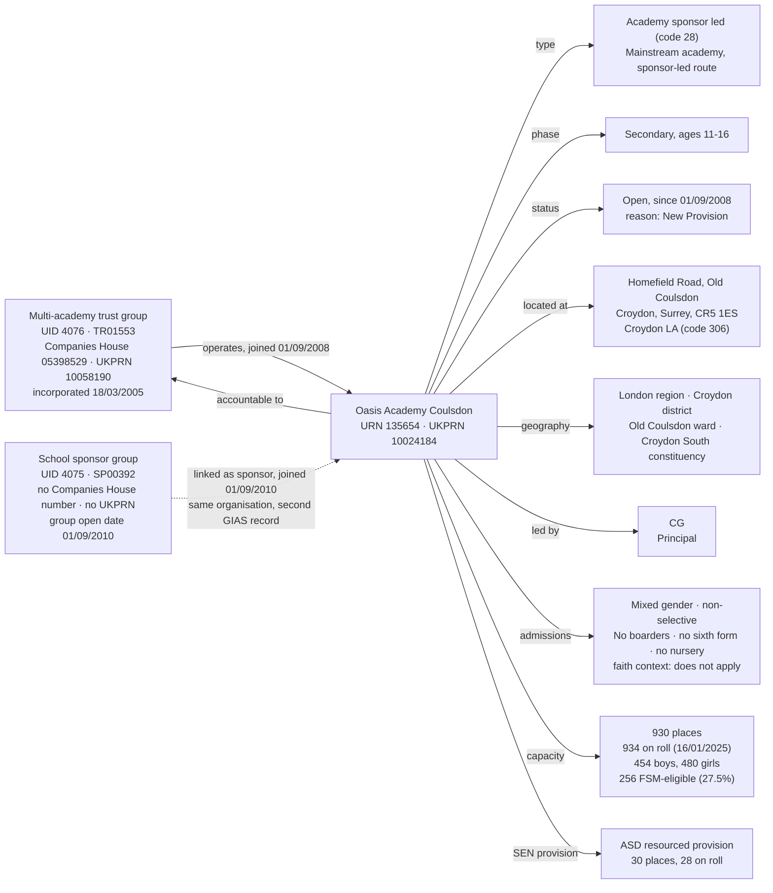
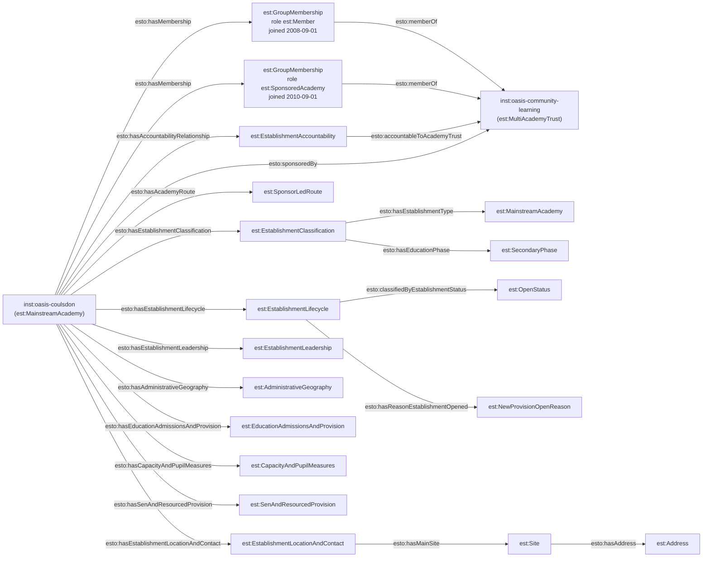

[← Worked examples](../)

# Establishment Ontology — Oasis Academy Coulsdon / Oasis Community Learning example

| | |
|---|---|
| **Academy** | Oasis Academy Coulsdon, URN 135654 |
| **Trust / sponsor** | Oasis Community Learning — GIAS UID 4076, Group ID TR01553, Companies House 05398529; *and* the shadow "School sponsor" record UID 4075 / SP00392 |
| **Establishment type** | Academy sponsor led (GIAS type code 28) |
| **Establishment ontology namespace** | `https://dfe-digital.github.io/education-provider-registry-docs/models/establishment/ontology/` |
| **Establishment vocabulary namespace** | `https://dfe-digital.github.io/education-provider-registry-docs/models/establishment/vocabulary/` |
| **Preferred prefixes** | `esto:` (properties) · `est:` (classes and named individuals) |
| **OWL documentation** | [Establishment ontology reference (WIDOCO)](../../ontology/) |
| **Source** | [establishment-ontology.ttl](https://github.com/DFE-Digital/education-provider-registry-docs/blob/main/models/establishment/establishment-ontology.ttl) |
| **Repository** | [DFE-Digital/education-provider-registry-docs](https://github.com/DFE-Digital/education-provider-registry-docs) |
| **Licence** | [Open Government Licence v3.0](https://www.nationalarchives.gov.uk/doc/open-government-licence/version/3/) |

---

This is the worked example for **group membership role** (`esto:hasGroupMembershipRole`, ontology v1.18). It is the acceptance test for the [group membership and sponsorship modelling note](../../docs/group-membership-and-sponsorship/). Headteacher shown as `CG` (initials only). No governance worked example exists yet for this organisation.

Oasis Academy Coulsdon holds **two** GIAS group links against the same real-world organisation — one to the "Multi-academy trust" group (UID 4076, which carries the Companies House number and UKPRN) and one to a "School sponsor" group (UID 4075, which carries neither). The establishment model represents this as **one** `est:EstablishmentGroup` and **two** role-typed `est:GroupMembership` records, rather than two group entities for one legal entity.

---

## Section 1 — The real-world establishment record

This section is the record as evidenced, before any ontology is applied.

### Sources

| Source | Publisher | What it evidences | Observed |
|---|---|---|---|
| [GIAS: Oasis Academy Coulsdon, URN 135654](https://www.get-information-schools.service.gov.uk/Establishments/Establishment/Details/135654) | Get Information about Schools (DfE) | Establishment identity, classification, lifecycle, location, leadership, capacity and pupil measures, SEN and resourced provision, administrative geography | GIAS extract 16 June 2026 |
| [GIAS: Oasis Community Learning, Group UID 4076](https://www.get-information-schools.service.gov.uk/Groups/Group/Details/4076) | Get Information about Schools (DfE) | "Multi-academy trust" group: Group ID `TR01553`, Companies House 05398529, UKPRN 10058190, incorporation date 18 March 2005, registered address | GIAS extract 30 June 2026 |
| [GIAS: Oasis Community Learning, Group UID 4075](https://www.get-information-schools.service.gov.uk/Groups/Group/Details/4075) | Get Information about Schools (DfE) | "School sponsor" group: Group ID `SP00392`, group open date 1 September 2010, **no** Companies House number, **no** UKPRN, **no** registered address | GIAS extract 30 June 2026 |
| [GIAS establishment/group links extract](https://www.get-information-schools.service.gov.uk/) | Get Information about Schools (DfE) | Two group-link rows for URN 135654: to UID 4076 (Multi-academy trust) joined 1 September 2008, and to UID 4075 (School sponsor) joined 1 September 2010 | GIAS extract 30 June 2026 |
| [Companies House: company 05398529](https://find-and-update.company-information.service.gov.uk/company/05398529) | Companies House | Confirms Oasis Community Learning is one active private company limited by guarantee, incorporated 18 March 2005 — the single legal entity behind both GIAS group records | 10 September 2026 |

### Structure



The two group records are the same real-world organisation. The "School sponsor" record (UID 4075) was created in GIAS on 1 September 2010 — two years after the academy opened and joined the trust — and holds none of the legal-entity identifiers, which all sit on the "Multi-academy trust" record (UID 4076). The same double-link pattern holds for every Oasis academy.

---

## Section 2 — Modelled in the establishment ontology

The same record from Section 1, expressed in Turtle using `establishment-ontology.ttl` (`est:`/`esto:`).

### Structure



The "School sponsor" group (UID 4075 / SP00392) is **not** given a second `est:EstablishmentGroup` instance. Its group-link row becomes the second `est:GroupMembership`, carrying `esto:hasGroupMembershipRole est:SponsoredAcademy` and its own joined date, against the one `inst:oasis-community-learning` instance.

### Namespace prefixes

```
@prefix est:   <https://dfe-digital.github.io/education-provider-registry-docs/models/establishment/vocabulary/> .
@prefix esto:  <https://dfe-digital.github.io/education-provider-registry-docs/models/establishment/ontology/> .
@prefix rdf:   <http://www.w3.org/1999/02/22-rdf-syntax-ns#> .
@prefix rdfs:  <http://www.w3.org/2000/01/rdf-schema#> .
@prefix owl:   <http://www.w3.org/2002/07/owl#> .
@prefix xsd:   <http://www.w3.org/2001/XMLSchema#> .
@prefix inst:  <https://dfe-digital.github.io/education-provider-registry-docs/establishment/> .
```

### Example 1 — One establishment group for one legal entity

Both GIAS group records resolve to a single `est:EstablishmentGroup`. The Companies House number, UKPRN and incorporation date — all held only on the "Multi-academy trust" record in GIAS — sit on that one instance.

```
inst:oasis-community-learning
    a est:MultiAcademyTrust ;
    rdfs:label "Oasis Community Learning"@en ;

    esto:hasGroupUniqueIdentifier [
        a est:GroupUniqueIdentifier ;
        rdf:value "4076"^^xsd:positiveInteger
    ] ;

    esto:identifiedByGroupId [
        a est:GroupId ;
        rdf:value "TR01553"
    ] ;

    esto:hasGroupCompaniesHouseNumber [
        a est:CompaniesHouseNumber ;
        rdf:value "05398529"
    ] ;

    esto:hasGroupUkprn [
        a est:GroupUkprn ;
        rdf:value "10058190"^^xsd:positiveInteger
    ] ;

    esto:hasGroupIncorporatedOnDate [
        a est:GroupIncorporatedOnDate ;
        rdf:value "2005-03-18"^^xsd:date
    ] ;

    esto:hasRegisteredAddress [
        a est:Address ;
        rdfs:label "75 Westminster Bridge Road, London, SE1 7HS"@en ;
        esto:hasAddressLine1 [ a est:AddressLine1 ; rdf:value "75 Westminster Bridge Road"@en ] ;
        esto:hasTown [ a est:Town ; rdf:value "London"@en ] ;
        esto:hasPostcode [ a est:Postcode ; rdf:value "SE1 7HS" ]
    ] .

inst:oasis-coulsdon
    a est:MainstreamAcademy ;
    rdfs:label "Oasis Academy Coulsdon"@en ;

    esto:hasEstablishmentIdentity [
        a est:EstablishmentIdentity ;
        esto:identifiedByUrn [
            a est:UniqueReferenceNumber ;
            rdf:value "135654"^^xsd:positiveInteger
        ] ;
        esto:hasUkprn [
            a est:UkProviderReferenceNumber ;
            rdf:value "10024184"^^xsd:positiveInteger
        ]
    ] .
```

### Example 2 — Two role-typed memberships of one group

This is the change under test. The academy has two `est:GroupMembership` records, both `esto:memberOf inst:oasis-community-learning`, distinguished by `esto:hasGroupMembershipRole` and by joined date. The first is the ordinary trust membership (GIAS UID 4076 link, joined the day the academy opened); the second is the sponsored-academy relationship (GIAS UID 4075 link, joined when the "School sponsor" record was created in 2010).

```
inst:oasis-coulsdon
    esto:hasMembership [
        a est:GroupMembership ;
        esto:memberOf inst:oasis-community-learning ;
        esto:hasGroupMembershipRole est:Member ;
        esto:hasGroupMembershipDate [
            a est:GroupMembershipDate ;
            rdf:value "2008-09-01"^^xsd:date
        ]
    ] ;

    esto:hasMembership [
        a est:GroupMembership ;
        esto:memberOf inst:oasis-community-learning ;
        esto:hasGroupMembershipRole est:SponsoredAcademy ;
        esto:hasGroupMembershipDate [
            a est:GroupMembershipDate ;
            rdf:value "2010-09-01"^^xsd:date
        ]
    ] .
```

`est:GroupMembershipShape` permits more than one membership between the same establishment and the same group; it does not cap them.

### Example 3 — Accountability, sponsorship and classification

`esto:accountableToAcademyTrust` and `esto:sponsoredBy` both point at the same `inst:oasis-community-learning` instance. `esto:sponsoredBy` names the DfE-approved sponsor organisation — a fact distinct from the in-group role in Example 2, and one that also applies where a sponsor is not a group at all (a diocese, for example).

```
inst:oasis-coulsdon
    esto:hasAccountabilityRelationship [
        a est:EstablishmentAccountability ;
        esto:accountableToAcademyTrust inst:oasis-community-learning
    ] ;

    esto:sponsoredBy inst:oasis-community-learning ;

    esto:hasEstablishmentClassification [
        a est:EstablishmentClassification ;
        esto:hasEstablishmentType est:MainstreamAcademy ;
        esto:hasEstablishmentTypeGroup est:EstablishmentTypeGroupAcademies ;
        esto:hasEducationPhase est:SecondaryPhase
    ] ;

    esto:hasAcademyRoute est:SponsorLedRoute ;

    esto:hasEstablishmentLifecycle [
        a est:EstablishmentLifecycle ;
        esto:classifiedByEstablishmentStatus est:OpenStatus ;
        esto:hasOpenDate [
            a est:OpenDate ;
            rdf:value "2008-09-01"^^xsd:date
        ] ;
        esto:hasReasonEstablishmentOpened est:NewProvisionOpenReason
    ] .
```

### Example 4 — Location, leadership, admissions

```
inst:oasis-coulsdon
    esto:hasEstablishmentLocationAndContact [
        a est:EstablishmentLocationAndContact ;
        esto:hasMainSite [
            a est:Site ;
            esto:hasAddress [
                a est:Address ;
                rdfs:label "Homefield Road, Old Coulsdon, Croydon, Surrey, CR5 1ES"@en ;
                esto:hasAddressLine1 [ a est:AddressLine1 ; rdf:value "Homefield Road"@en ] ;
                esto:hasAddressLine2 [ a est:AddressLine2 ; rdf:value "Old Coulsdon"@en ] ;
                esto:hasTown [ a est:Town ; rdf:value "Croydon"@en ] ;
                esto:hasCounty [ a est:County ; rdf:value "Surrey"@en ] ;
                esto:hasPostcode [ a est:Postcode ; rdf:value "CR5 1ES" ]
            ] ;
            esto:hasUprn [ a est:UniquePropertyReferenceNumber ; rdf:value "100022913770"^^xsd:positiveInteger ]
        ] ;
        esto:hasWebsite [
            a est:Website ;
            rdf:value "http://www.oasisacademycoulsdon.org"
        ] ;
        esto:hasTelephoneNumber [
            a est:TelephoneNumber ;
            rdf:value "01737551161"
        ]
    ] ;

    esto:hasEstablishmentLeadership [
        a est:EstablishmentLeadership ;
        esto:hasHeadteacherOrPrincipal [
            a est:HeadteacherOrPrincipal ;
            rdfs:label "CG"@en ;
            esto:hasJobTitle [ a est:JobTitle ; rdf:value "Principal"@en ]
        ]
    ] ;

    esto:hasEducationAdmissionsAndProvision [
        a est:EducationAdmissionsAndProvision ;
        esto:classifiedByGenderOfEntry est:MixedGenderEntry ;
        esto:classifiedByAdmissionsPolicy est:NonSelectiveAdmissions ;
        esto:classifiedByBoardingProvision est:NoBoarders ;
        esto:classifiedBySixthFormProvision est:NoSixthForm ;
        esto:hasStatutoryAgeRange [
            a est:StatutoryAgeRange ;
            rdfs:label "11 to 16"@en ;
            esto:hasStatutoryLowAge [ a est:StatutoryLowAge ; rdf:value "11"^^xsd:nonNegativeInteger ] ;
            esto:hasStatutoryHighAge [ a est:StatutoryHighAge ; rdf:value "16"^^xsd:nonNegativeInteger ]
        ]
    ] ;

    esto:hasAdministrativeGeography [
        a est:AdministrativeGeography ;
        esto:classifiedByGovernmentOfficeRegion inst:region-london ;
        esto:classifiedByDistrictAdministrative [
            a est:DistrictAdministrative ;
            rdfs:label "Croydon"@en
        ] ;
        esto:classifiedByAdministrativeWard [
            a est:AdministrativeWard ;
            rdfs:label "Old Coulsdon"@en
        ] ;
        esto:classifiedByParliamentaryConstituency [
            a est:ParliamentaryConstituency ;
            rdfs:label "Croydon South"@en
        ] ;
        esto:classifiedByUrbanRuralClassification [
            a est:UrbanRuralClassification ;
            rdfs:label "Urban: Nearer to a major town or city"@en
        ] ;
        esto:hasGssLocalAuthorityCode [ a est:GssLocalAuthorityCode ; rdf:value "E09000008" ] ;
        esto:hasOsGridReference [
            a est:OsGridReference ;
            esto:hasEasting [ a est:Easting ; rdf:value "531589"^^xsd:nonNegativeInteger ] ;
            esto:hasNorthing [ a est:Northing ; rdf:value "157353"^^xsd:nonNegativeInteger ]
        ] ;
        esto:classifiedByMiddleLayerSuperOutputArea [
            a est:MiddleLayerSuperOutputArea ;
            rdfs:label "Croydon 044"@en
        ] ;
        esto:classifiedByLowerLayerSuperOutputArea [
            a est:LowerLayerSuperOutputArea ;
            rdfs:label "Croydon 044E"@en
        ]
    ] .

inst:region-london
    a est:GovernmentOfficeRegion ;
    rdfs:label "London"@en .
```

`inst:region-london` is a real-world reference entity, reusable by URI from any future London establishment, not an `owl:NamedIndividual` in the ontology — the same as [Frank Barnes](../frank-barnes/) and [Medlock](../medlock-mat/).

### Example 5 — Capacity, SEN provision and record currency

The GIAS extract shows 934 pupils against a stated capacity of 930 — a real over-capacity record, the same pattern seen at [Moreland](../st-lukes-moreland/), [Gilded Hollins](../gilded-hollins/), [Aldgate](../aldgate-school/) and [George Green's](../george-greens/). SEN provision is a resourced-provision unit for autistic spectrum disorder; `NurseryProvision`, `SenUnitCapacity`, `Section41Approved` and `SENStat`/`SENNoStat` are blank or "Not applicable" and are omitted.

```
inst:oasis-coulsdon
    esto:hasCapacityAndPupilMeasures [
        a est:CapacityAndPupilMeasures ;
        esto:hasSchoolCapacity [
            a est:SchoolCapacity ;
            rdf:value "930"^^xsd:nonNegativeInteger
        ] ;
        esto:hasPupilCount [
            a est:PupilCount ;
            rdf:value "934"^^xsd:nonNegativeInteger ;
            rdfs:comment "454 boys, 480 girls."@en
        ] ;
        esto:hasCensusDate [ a est:CensusDate ; rdf:value "2025-01-16"^^xsd:date ] ;
        esto:hasFreeSchoolMealMeasure [
            a est:PupilsEligibleForFreeSchoolMeals ;
            rdf:value "256"^^xsd:nonNegativeInteger ;
            esto:hasPercentageEligibleForFreeSchoolMeals [ a est:PercentagePupilsEligibleForFreeSchoolMeals ; rdf:value "27.5"^^xsd:decimal ]
        ]
    ] ;

    esto:hasSenAndResourcedProvision [
        a est:SenAndResourcedProvision ;
        esto:classifiedByTypeOfSenProvision est:AutisticSpectrumDisorder ;
        esto:classifiedByTypeOfResourcedProvision est:ResourcedProvisionFacility ;
        esto:hasResourcedProvisionMeasure [
            a est:ResourcedProvisionMeasure ;
            rdfs:label "30 places, 28 on roll"@en ;
            esto:hasResourcedProvisionCapacity [ a est:ResourcedProvisionCapacity ; rdf:value "30"^^xsd:nonNegativeInteger ] ;
            esto:hasResourcedProvisionPupilCount [ a est:ResourcedProvisionPupilCount ; rdf:value "28"^^xsd:nonNegativeInteger ]
        ]
    ] ;

    esto:hasRecordCurrency [
        a est:RecordCurrencyAndStewardship ;
        esto:recordsDateLastChanged [
            a est:DateLastChangedOrConfirmed ;
            rdf:value "2026-05-19"^^xsd:date
        ]
    ] .
```

No `esto:hasFaithContext`, `esto:classifiedByNurseryProvision`, `esto:classifiedBySpecialClassProvision`, `esto:classifiedBySection41Approval` or `esto:hasSpecialPupilMeasure` triple is asserted — each is "Not applicable" / blank in the real extract, and per the RDF-idiomatic principle the absence is left unstated rather than filled with a placeholder.

---

## What this example found

- **The change works against a real double-link record.** Oasis Academy Coulsdon's two GIAS group links — to a "Multi-academy trust" group and a "School sponsor" group that are the same legal entity — collapse to one `est:EstablishmentGroup` and two `est:GroupMembership` records, one per link, distinguished by `esto:hasGroupMembershipRole` (`est:Member` / `est:SponsoredAcademy`). Both joined dates (2008-09-01 into the trust, 2010-09-01 as sponsored academy) are preserved.
- **The shadow "School sponsor" group is an administrative artefact.** GIAS created UID 4075 / SP00392 on 1 September 2010, after the academy opened, and it carries none of the legal-entity identifiers — Companies House number, UKPRN, incorporation date and registered address all sit on the "Multi-academy trust" record. Modelling it as a second `est:EstablishmentGroup` would split one organisation in two; the role-typed membership avoids that.
- **`esto:sponsoredBy` and `esto:hasGroupMembershipRole` are complementary, not redundant.** `esto:sponsoredBy` names the approved sponsor organisation (here the same instance as the trust); `esto:hasGroupMembershipRole est:SponsoredAcademy` records how this establishment sits in this group. The first still carries the sponsorship fact where the sponsor is not a group — see the [Green School Trust example](../green-school-trust/), where the sponsor is a diocese.
- **GIAS's own establishment record points only at the trust.** The URN 135654 extract's `Trusts (code)` is `4076` — the MAT — with no reference to the sponsor group at all. The sponsored-academy relationship exists only in the separate links extract. The model brings both onto one establishment as two memberships.
- **Contrast with the [Manor High example](../manor-high/):** a converter academy with a single, clean group link and no sponsor record — no role type needed there, and `esto:hasGroupMembershipRole` is simply omitted (implied `est:Member`).
- **A fifth over-capacity worked example.** 934 on roll against 930 places — the same real pattern as Moreland, Gilded Hollins, Aldgate and George Green's, here on a sponsor-led secondary academy.
- **Not exercised by this example:** `est:Sponsor` (the third `est:GroupMembershipRoleType` value — it describes an organisation's membership of a group and is not assertable via `esto:hasMembership` while that property's subject is `est:Establishment`); `est:GroupStatus`; SEN unit provision (only resourced provision is recorded).

---

## Concept coverage

| Real-world concept | Oasis Coulsdon evidence | Ontology mapping | Fit |
|---|---|---|---|
| Academy trust (legal entity, group) | GIAS UID 4076, Group ID TR01553, Companies House 05398529, UKPRN 10058190, incorporated 2005-03-18 | `est:MultiAcademyTrust` (`rdfs:subClassOf est:AcademyTrust`) — one instance | Direct |
| "School sponsor" group record | GIAS UID 4075, Group ID SP00392, no legal identifiers | Not a separate instance — folded into the sponsored-academy membership | Direct — avoids splitting one organisation into two group entities |
| Academy | Oasis Academy Coulsdon, URN 135654, UKPRN 10024184 | `est:MainstreamAcademy` | Direct |
| Establishment type (legacy GIAS code 28) | "Academy sponsor led" | `est:MainstreamAcademy` + `esto:hasAcademyRoute est:SponsorLedRoute` | Direct |
| Education phase | Secondary, ages 11-16 | `est:SecondaryPhase` + `est:StatutoryAgeRange` | Direct |
| Lifecycle, status and reason opened | Open since 2008-09-01, "New Provision" | `est:OpenStatus` + `esto:hasOpenDate` + `est:NewProvisionOpenReason` | Direct |
| Group membership — ordinary | UID 4076 link, joined 2008-09-01 | `est:GroupMembership` + `esto:memberOf` + `esto:hasGroupMembershipRole est:Member` + `esto:hasGroupMembershipDate` | Direct |
| Group membership — sponsored academy | UID 4075 link, joined 2010-09-01 | second `est:GroupMembership` + `esto:hasGroupMembershipRole est:SponsoredAcademy` + `esto:hasGroupMembershipDate` | Direct — the v1.18 change |
| Accountability | Academy accountable to its trust | `esto:accountableToAcademyTrust` | Direct |
| Sponsorship (approved sponsor identity) | Sponsor is Oasis Community Learning | `esto:sponsoredBy` (same instance as the trust) | Direct — distinct fact from the in-group role |
| Location and site | Homefield Road, Old Coulsdon, CR5 1ES | `est:Site` + `est:Address` | Direct |
| Group registered address | 75 Westminster Bridge Road, London, SE1 7HS | `esto:hasRegisteredAddress` → `est:Address` on the group | Direct |
| Headteacher | CG, "Principal" | `est:HeadteacherOrPrincipal` + `esto:hasJobTitle` | Direct |
| Admissions and provision | Mixed, non-selective, no boarders, no sixth form | `est:EducationAdmissionsAndProvision` | Direct |
| Administrative geography | London region, Croydon district, Old Coulsdon ward, Croydon South constituency, urban classification, GSS E09000008, OS grid ref, MSOA/LSOA | `est:AdministrativeGeography` | Direct |
| Capacity and pupil numbers | 930 capacity, 934 on roll (454 boys, 480 girls), 256 FSM-eligible (27.5%) | `est:CapacityAndPupilMeasures` | Direct — roll exceeds capacity, as in the real extract |
| SEN and resourced provision | ASD resourced provision, 30 places, 28 on roll | `est:SenAndResourcedProvision` + `est:AutisticSpectrumDisorder` + `est:ResourcedProvisionFacility` | Direct |
| Record currency | Last changed 2026-05-19 | `est:RecordCurrencyAndStewardship` + `esto:recordsDateLastChanged` | Direct |
| Faith context | "Does not apply" | Absence of `esto:hasFaithContext` | Direct |

---

**See also:** [Group membership and sponsorship](../../docs/group-membership-and-sponsorship/) · [Establishment vocabulary](../../vocabulary/) · [Establishment taxonomy](../../taxonomy/) · [Establishment ontology](../../ontology/) · [Establishment ontology graph viewer](../../ontology/webvowl/) · [Manor High School example](../manor-high/) · [Co-op Academy Medlock example](../medlock-mat/)
