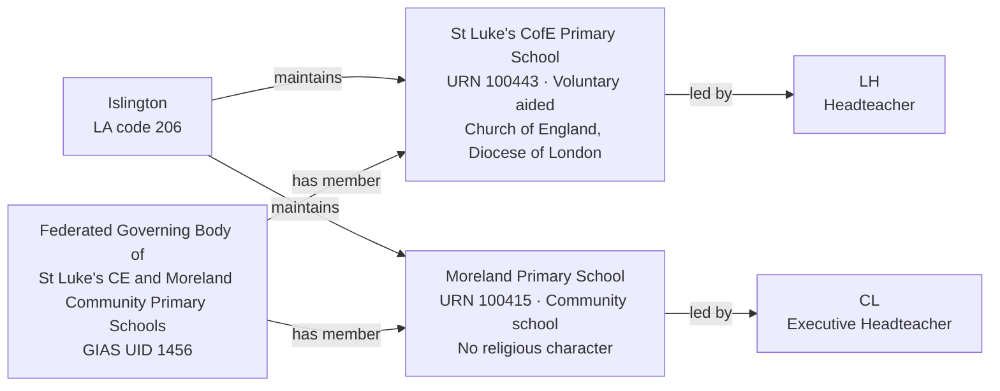

[← Worked examples](../)

# Establishment Ontology — St Luke's / Moreland Federation example

| | |
|---|---|
| **Federation** | The Federated Governing Body of St Luke's CE and Moreland Community Primary Schools, GIAS UID 1456 |
| **Member establishments** | St Luke's CofE Primary School (URN 100443, Voluntary aided school) · Moreland Primary School (URN 100415, Community school) |
| **Local authority** | Islington, LA code 206 |
| **Establishment ontology namespace** | `https://dfe-digital.github.io/education-provider-registry-docs/models/establishment/ontology/` |
| **Establishment vocabulary namespace** | `https://dfe-digital.github.io/education-provider-registry-docs/models/establishment/vocabulary/` |
| **Preferred prefixes** | `esto:` (properties) · `est:` (classes and named individuals) |
| **OWL documentation** | [Establishment ontology reference (WIDOCO)](../../ontology/) |
| **Source** | [establishment-ontology.ttl](https://github.com/DFE-Digital/education-provider-registry-docs/blob/main/models/establishment/establishment-ontology.ttl) |
| **Repository** | [DFE-Digital/education-provider-registry-docs](https://github.com/DFE-Digital/education-provider-registry-docs) |
| **Licence** | [Open Government Licence v3.0](https://www.nationalarchives.gov.uk/doc/open-government-licence/version/3/) |

No governance worked example exists yet for this federation. Headteachers shown as `LH` and `CL` (initials only).

---

## Section 1 — The real-world establishment record

### Sources

| Source | Publisher | What it evidences | Observed |
|---|---|---|---|
| [GIAS: The Federated Governing Body of St Luke's CE and Moreland Community Primary Schools, Group UID 1456](https://www.get-information-schools.service.gov.uk/Groups/Group/Details/1456) | Get Information about Schools (DfE) | Federation identity, open date, two member schools | GIAS extract 22 June 2026 |
| [GIAS: St Luke's CofE Primary School, URN 100443](https://www.get-information-schools.service.gov.uk/Establishments/Establishment/Details/100443) | Get Information about Schools (DfE) | Establishment identity, classification, location, capacity, religious character, diocese | GIAS extract 16 June 2026 |
| [GIAS: Moreland Primary School, URN 100415](https://www.get-information-schools.service.gov.uk/Establishments/Establishment/Details/100415) | Get Information about Schools (DfE) | Establishment identity, classification, location, capacity | GIAS extract 16 June 2026 |

### Structure



Unlike Eileen Wade/Milton Ernest and Long Ditton, this federation's two schools have **different** headteachers - GIAS records Moreland's leader with the job title "Executive Headteacher", distinct from St Luke's plain "Headteacher". GOV.UK federation governance guidance associates that title with a headteacher leading every school in a federation, but St Luke's has its own separate headteacher (`LH`), so that meaning doesn't fit here - the title is GIAS free text, not a claim about cross-school leadership.

---

## Section 2 — Modelled in the establishment ontology

### Namespace prefixes

```
@prefix est:   <https://dfe-digital.github.io/education-provider-registry-docs/models/establishment/vocabulary/> .
@prefix esto:  <https://dfe-digital.github.io/education-provider-registry-docs/models/establishment/ontology/> .
@prefix rdf:   <http://www.w3.org/1999/02/22-rdf-syntax-ns#> .
@prefix rdfs:  <http://www.w3.org/2000/01/rdf-schema#> .
@prefix owl:   <http://www.w3.org/2002/07/owl#> .
@prefix xsd:   <http://www.w3.org/2001/XMLSchema#> .
@prefix inst:  <https://dfe-digital.github.io/education-provider-registry-docs/establishment/> .
```

### Example 1 — Federation and member identity

```
inst:st-lukes-moreland-federation
    a est:Federation ;
    rdfs:label "The Federated Governing Body of St Luke's CE and Moreland Community Primary Schools"@en ;

    esto:hasGroupUniqueIdentifier [
        a est:GroupUniqueIdentifier ;
        rdf:value "1456"^^xsd:positiveInteger
    ] .

inst:st-lukes
    a est:VoluntaryAidedSchool ;
    rdfs:label "St Luke's CofE Primary School"@en ;

    esto:hasEstablishmentIdentity [
        a est:EstablishmentIdentity ;
        esto:identifiedByUrn [
            a est:UniqueReferenceNumber ;
            rdf:value "100443"^^xsd:positiveInteger
        ] ;
        esto:hasUkprn [
            a est:UkProviderReferenceNumber ;
            rdf:value "10079299"^^xsd:positiveInteger
        ]
    ] ;

    esto:hasMembership [
        a est:GroupMembership ;
        esto:memberOf inst:st-lukes-moreland-federation
    ] .

inst:moreland
    a est:CommunitySchool ;
    rdfs:label "Moreland Primary School"@en ;

    esto:hasEstablishmentIdentity [
        a est:EstablishmentIdentity ;
        esto:identifiedByUrn [
            a est:UniqueReferenceNumber ;
            rdf:value "100415"^^xsd:positiveInteger
        ] ;
        esto:hasUkprn [
            a est:UkProviderReferenceNumber ;
            rdf:value "10070046"^^xsd:positiveInteger
        ]
    ] ;

    esto:hasMembership [
        a est:GroupMembership ;
        esto:memberOf inst:st-lukes-moreland-federation
    ] .
```

### Example 2 — Accountability, leadership and faith context

Two distinct headteachers, not a shared one - contrasting with the two prior federation examples. Moreland's `est:HeadteacherOrPrincipal` carries an `esto:hasJobTitle` of "Executive Headteacher" - a real title, but here it does not mean cross-school leadership, since St Luke's has its own separate headteacher.

```
inst:la-206
    a est:LocalAuthority ;
    rdfs:label "Islington"@en .

inst:st-lukes
    esto:hasAccountabilityRelationship [
        a est:EstablishmentAccountability ;
        esto:accountableToLocalAuthority inst:la-206
    ] ;

    esto:hasEstablishmentLocationAndContact [
        a est:EstablishmentLocationAndContact ;
        esto:hasHeadteacherOrPrincipal [
            a est:HeadteacherOrPrincipal ;
            rdfs:label "LH"@en
        ] ;
        esto:hasMainSite [
            a est:Site ;
            esto:hasAddress [
                a est:Address ;
                rdfs:label "Radnor Street, London, EC1V 3SJ"@en ;
                esto:hasAddressLine1 [ a est:AddressLine1 ; rdfs:label "Radnor Street"@en ] ;
                esto:hasTown [ a est:Town ; rdfs:label "London"@en ] ;
                esto:hasPostcode [ a est:Postcode ; rdfs:label "EC1V 3SJ" ]
            ]
        ]
    ] ;

    esto:hasFaithContext [
        a est:FaithContext ;
        esto:classifiedByReligiousCharacter est:ChurchOfEnglandCharacter ;
        esto:associatedWithDiocese [
            a est:Diocese ;
            rdfs:label "Diocese of London"@en
        ]
    ] ;

    esto:hasEstablishmentLifecycle [
        a est:EstablishmentLifecycle ;
        esto:classifiedByEstablishmentStatus est:OpenStatus
    ] ;

    esto:hasRecordCurrency [
        a est:RecordCurrencyAndStewardship ;
        esto:recordsDateLastChanged [
            a est:DateLastChangedOrConfirmed ;
            rdf:value "2026-04-13"^^xsd:date
        ]
    ] .

inst:moreland
    esto:hasAccountabilityRelationship [
        a est:EstablishmentAccountability ;
        esto:accountableToLocalAuthority inst:la-206
    ] ;

    esto:hasEstablishmentLocationAndContact [
        a est:EstablishmentLocationAndContact ;
        esto:hasHeadteacherOrPrincipal [
            a est:HeadteacherOrPrincipal ;
            rdfs:label "CL"@en ;
            esto:hasJobTitle [
                a est:JobTitle ;
                rdfs:label "Executive Headteacher"@en
            ]
        ] ;
        esto:hasMainSite [
            a est:Site ;
            esto:hasAddress [
                a est:Address ;
                rdfs:label "Moreland Street, London, EC1V 8BB"@en ;
                esto:hasAddressLine1 [ a est:AddressLine1 ; rdfs:label "Moreland Street"@en ] ;
                esto:hasTown [ a est:Town ; rdfs:label "London"@en ] ;
                esto:hasPostcode [ a est:Postcode ; rdfs:label "EC1V 8BB" ]
            ]
        ]
    ] ;

    esto:hasEstablishmentLifecycle [
        a est:EstablishmentLifecycle ;
        esto:classifiedByEstablishmentStatus est:OpenStatus
    ] ;

    esto:hasRecordCurrency [
        a est:RecordCurrencyAndStewardship ;
        esto:recordsDateLastChanged [
            a est:DateLastChangedOrConfirmed ;
            rdf:value "2026-05-19"^^xsd:date
        ]
    ] .
```

No `esto:hasFaithContext` for Moreland - GIAS records "Does not apply" for religious character.

### Example 3 — Classification, provision and capacity

Moreland's statutory age range starts at 0 (nursery age), unlike St Luke's, which starts at 3 - a real difference in scope between the two federated schools' offer, not a data anomaly.

```
inst:st-lukes
    esto:hasEstablishmentClassification [
        a est:EstablishmentClassification ;
        esto:hasEstablishmentType est:VoluntaryAidedSchool ;
        esto:hasEducationPhase est:PrimaryPhase
    ] ;

    esto:hasEducationAdmissionsAndProvision [
        a est:EducationAdmissionsAndProvision ;
        esto:classifiedByBoardingProvision est:NoBoarders ;
        esto:classifiedByNurseryProvision est:HasNurseryClasses ;
        esto:hasStatutoryAgeRange [
            a est:StatutoryAgeRange ;
            rdfs:label "3 to 11"@en
        ]
    ] ;

    esto:hasCapacityAndPupilMeasures [
        a est:CapacityAndPupilMeasures ;
        esto:hasSchoolCapacity [
            a est:SchoolCapacity ;
            rdf:value "241"^^xsd:nonNegativeInteger
        ] ;
        esto:hasPupilCount [
            a est:PupilCount ;
            rdf:value "208"^^xsd:nonNegativeInteger ;
            rdfs:comment "Census date 2025-01-16: 109 boys, 99 girls."@en
        ] ;
        esto:hasFreeSchoolMealMeasure [
            a est:PupilsEligibleForFreeSchoolMeals ;
            rdfs:label "111"^^xsd:integer ;
            rdfs:comment "56.9% of pupils on roll."@en
        ]
    ] .

inst:moreland
    esto:hasEstablishmentClassification [
        a est:EstablishmentClassification ;
        esto:hasEstablishmentType est:CommunitySchool ;
        esto:hasEducationPhase est:PrimaryPhase
    ] ;

    esto:hasEducationAdmissionsAndProvision [
        a est:EducationAdmissionsAndProvision ;
        esto:classifiedByBoardingProvision est:NoBoarders ;
        esto:classifiedByNurseryProvision est:HasNurseryClasses ;
        esto:hasStatutoryAgeRange [
            a est:StatutoryAgeRange ;
            rdfs:label "0 to 11"@en
        ]
    ] ;

    esto:hasCapacityAndPupilMeasures [
        a est:CapacityAndPupilMeasures ;
        esto:hasSchoolCapacity [
            a est:SchoolCapacity ;
            rdf:value "442"^^xsd:nonNegativeInteger
        ] ;
        esto:hasPupilCount [
            a est:PupilCount ;
            rdf:value "472"^^xsd:nonNegativeInteger ;
            rdfs:comment "Census date 2025-01-16: 254 boys, 218 girls."@en
        ] ;
        esto:hasFreeSchoolMealMeasure [
            a est:PupilsEligibleForFreeSchoolMeals ;
            rdfs:label "205"^^xsd:integer ;
            rdfs:comment "50% of pupils on roll."@en
        ]
    ] .
```

---

## What this example found

- **First federation with two different headteachers.** Eileen Wade/Milton Ernest and Long Ditton both had one person leading both federated schools; here, St Luke's and Moreland each have their own. Moreland's carries the GIAS job title "Executive Headteacher" - first real use of `esto:hasJobTitle`/`est:JobTitle`, added this session. GOV.UK federation governance guidance ties that title to leading every school in a federation, but the data here contradicts that reading (St Luke's has its own separate headteacher), so the title is modelled as free text, not as evidence of cross-school leadership.
- **First federation combining a voluntary aided school with a community school** (rather than two schools that are both maintained-but-different-type-of-faith, as in the prior two federation examples) - confirms `est:Federation` membership doesn't correlate member establishment type with faith status either.
- **A pupil count exceeding published capacity.** Moreland's `NumberOfPupils` (472) is higher than its `SchoolCapacity` (442) in the real extract - recorded as-is rather than corrected, since the model's job is to represent what GIAS reports, not to second-guess it.
- **Not exercised by this example:** academy trust, sponsor and generic trust relationships; SEN and resourced provision; Section 41 approval.

---

## Concept coverage

| Real-world concept | Evidence | Ontology mapping | Fit |
|---|---|---|---|
| Federation | GIAS UID 1456, two member schools | `est:Federation` | Direct |
| Local authority accountability | Both schools maintained by Islington (LA 206) | `esto:accountableToLocalAuthority` | Direct |
| Establishment types | Voluntary aided (St Luke's), Community (Moreland) | `est:VoluntaryAidedSchool`, `est:CommunitySchool` | Direct |
| Distinct headteachers | LH (St Luke's), CL (Moreland, Executive Headteacher) | `est:HeadteacherOrPrincipal`, independent per establishment | Direct |
| Job title | Moreland: "Executive Headteacher" | `esto:hasJobTitle` / `est:JobTitle` | Direct - free text, not a cross-school leadership claim |
| Faith context (real value) | St Luke's: Church of England, Diocese of London | `est:ChurchOfEnglandCharacter` + `est:Diocese` | Direct |
| Faith context (absent) | Moreland: does not apply | Absence of `esto:hasFaithContext` | Direct |
| Differing age ranges | St Luke's 3-11, Moreland 0-11 | `est:StatutoryAgeRange` | Direct |
| Capacity and pupil numbers | 241/208 (St Luke's), 442/472 (Moreland) | `est:CapacityAndPupilMeasures` | Direct - Moreland's roll exceeds its stated capacity |

---

**See also:** [Establishment vocabulary](../../vocabulary/) · [Establishment taxonomy](../../taxonomy/) · [Establishment ontology](../../ontology/) · [Establishment ontology graph viewer](../../ontology/webvowl/) · [Medlock example](../medlock-mat/) · [Manor High example](../manor-high/) · [Frank Barnes example](../frank-barnes/) · [Eileen Wade / Milton Ernest example](../eileen-wade-milton-ernest/) · [Long Ditton example](../long-ditton/)
