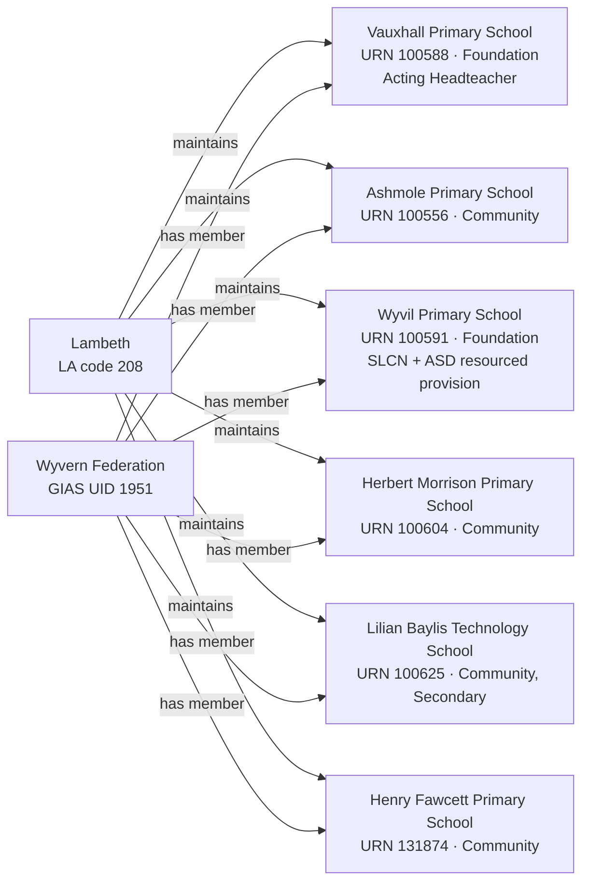

[← Worked examples](../)

# Establishment Ontology — Vauxhall Primary School / Wyvern Federation example

| | |
|---|---|
| **Federation** | Wyvern Federation, GIAS UID 1951 |
| **Member establishments** | Vauxhall Primary School (URN 100588, Foundation school) · Ashmole Primary School (URN 100556, Community school) · Wyvil Primary School (URN 100591, Foundation school) · Herbert Morrison Primary School (URN 100604, Community school) · Lilian Baylis Technology School (URN 100625, Community school) · Henry Fawcett Primary School (URN 131874, Community school) |
| **Local authority** | Lambeth, LA code 208 |
| **Establishment ontology namespace** | `https://dfe-digital.github.io/education-provider-registry-docs/models/establishment/ontology/` |
| **Establishment vocabulary namespace** | `https://dfe-digital.github.io/education-provider-registry-docs/models/establishment/vocabulary/` |
| **Preferred prefixes** | `esto:` (properties) · `est:` (classes and named individuals) |
| **OWL documentation** | [Establishment ontology reference (WIDOCO)](../../ontology/) |
| **Source** | [establishment-ontology.ttl](https://github.com/DFE-Digital/education-provider-registry-docs/blob/main/models/establishment/establishment-ontology.ttl) |
| **Repository** | [DFE-Digital/education-provider-registry-docs](https://github.com/DFE-Digital/education-provider-registry-docs) |
| **Licence** | [Open Government Licence v3.0](https://www.nationalarchives.gov.uk/doc/open-government-licence/version/3/) |

Vauxhall, Ashmole and Wyvil reuse the same instances as the [governance worked example](../../../governance/worked-examples/vauxhall-primary/); Herbert Morrison, Lilian Baylis and Henry Fawcett are new slugs, not shown in that page's Section 2. Headteachers shown as initials only.

---

## Section 1 — The real-world establishment record

### Sources

| Source | Publisher | What it evidences | Observed |
|---|---|---|---|
| [GIAS: Wyvern Federation, Group UID 1951](https://www.get-information-schools.service.gov.uk/Groups/Group/Details/1951) | Get Information about Schools (DfE) | Federation identity, open date, six member schools | GIAS extract 22/30 June 2026 |
| [GIAS: Vauxhall Primary School, URN 100588](https://www.get-information-schools.service.gov.uk/Establishments/Establishment/Details/100588) | Get Information about Schools (DfE) | Establishment identity, classification, location, capacity, headteacher job title | GIAS extract 16 June 2026 |
| [GIAS: Wyvil Primary School, URN 100591](https://www.get-information-schools.service.gov.uk/Establishments/Establishment/Details/100591) | Get Information about Schools (DfE) | Establishment identity, classification, religious character, SEN and resourced provision | GIAS extract 16 June 2026 |
| [GIAS: Lilian Baylis Technology School, URN 100625](https://www.get-information-schools.service.gov.uk/Establishments/Establishment/Details/100625) | Get Information about Schools (DfE) | Establishment identity, classification (secondary phase) | GIAS extract 16 June 2026 |

### Structure



Six member schools, not two - the largest federation modelled so far. Five are primary phase; Lilian Baylis is secondary (ages 11-18), the first federation member outside primary. Two Foundation schools (Vauxhall, Wyvil) and four Community schools. Unlike the governance worked example's own source - which cites no GIAS federation group record for "Wyvern Federation of Schools" - the establishment extract itself does carry a real, current federation group record (UID 1951, open since 3 December 2012): the two sources evidence different things, and both are accurate to what they each looked at.

---

## Section 2 — Modelled in the establishment ontology

### Namespace prefixes

```
@prefix est:   <https://dfe-digital.github.io/education-provider-registry-docs/models/establishment/vocabulary/> .
@prefix esto:  <https://dfe-digital.github.io/education-provider-registry-docs/models/establishment/ontology/> .
@prefix rdf:   <http://www.w3.org/1999/02/22-rdf-syntax-ns#> .
@prefix rdfs:  <http://www.w3.org/2000/01/rdf-schema#> .
@prefix owl:   <http://www.w3.org/2002/07/owl#> .
@prefix xsd:   <http://www.w3.org/2001/XMLSchema#> .
@prefix inst:  <https://dfe-digital.github.io/education-provider-registry-docs/establishment/> .
```

### Example 1 — Federation and member identity

Three of the six members are modelled in full below (Vauxhall, Wyvil, Lilian Baylis), chosen to show the federation's real diversity - two establishment types and two phases. Ashmole, Herbert Morrison and Henry Fawcett are evidenced federation members (Section 1) but not asserted as full instances here, the same "shown subset, not invented gaps" approach the governance worked example takes for the same federation.

```
inst:wyvern-federation
    a est:Federation ;
    rdfs:label "Wyvern Federation"@en ;

    esto:hasGroupUniqueIdentifier [
        a est:GroupUniqueIdentifier ;
        rdf:value "1951"^^xsd:positiveInteger
    ] .

inst:vauxhall-primary
    a est:FoundationSchool ;
    rdfs:label "Vauxhall Primary School"@en ;
    esto:hasEstablishmentIdentity [
        a est:EstablishmentIdentity ;
        esto:identifiedByUrn [ a est:UniqueReferenceNumber ; rdf:value "100588"^^xsd:positiveInteger ] ;
        esto:hasUkprn [ a est:UkProviderReferenceNumber ; rdf:value "10074655"^^xsd:positiveInteger ]
    ] ;
    esto:hasMembership [ a est:GroupMembership ; esto:memberOf inst:wyvern-federation ] .

inst:wyvil-primary
    a est:FoundationSchool ;
    rdfs:label "Wyvil Primary School"@en ;
    esto:hasEstablishmentIdentity [
        a est:EstablishmentIdentity ;
        esto:identifiedByUrn [ a est:UniqueReferenceNumber ; rdf:value "100591"^^xsd:positiveInteger ] ;
        esto:hasUkprn [ a est:UkProviderReferenceNumber ; rdf:value "10073713"^^xsd:positiveInteger ]
    ] ;
    esto:hasMembership [ a est:GroupMembership ; esto:memberOf inst:wyvern-federation ] .

inst:lilian-baylis
    a est:CommunitySchool ;
    rdfs:label "Lilian Baylis Technology School"@en ;
    esto:hasEstablishmentIdentity [
        a est:EstablishmentIdentity ;
        esto:identifiedByUrn [ a est:UniqueReferenceNumber ; rdf:value "100625"^^xsd:positiveInteger ] ;
        esto:hasUkprn [ a est:UkProviderReferenceNumber ; rdf:value "10003923"^^xsd:positiveInteger ]
    ] ;
    esto:hasMembership [ a est:GroupMembership ; esto:memberOf inst:wyvern-federation ] .
```

### Example 2 — Vauxhall: accountability, leadership and job title

Vauxhall's headteacher job title is "Acting Headteacher" - a third real `est:JobTitle` variant this session, alongside Moreland's "Executive Headteacher" and (below) Herbert Morrison's "Head of School" and Henry Fawcett's "Interim Headteacher".

```
inst:la-208
    a est:LocalAuthority ;
    rdfs:label "Lambeth"@en .

inst:vauxhall-primary
    esto:hasAccountabilityRelationship [
        a est:EstablishmentAccountability ;
        esto:accountableToLocalAuthority inst:la-208
    ] ;

    esto:hasEstablishmentLocationAndContact [
        a est:EstablishmentLocationAndContact ;
        esto:hasHeadteacherOrPrincipal [
            a est:HeadteacherOrPrincipal ;
            rdfs:label "VB"@en ;
            esto:hasJobTitle [ a est:JobTitle ; rdfs:label "Acting Headteacher"@en ]
        ] ;
        esto:hasMainSite [
            a est:Site ;
            esto:hasAddress [
                a est:Address ;
                rdfs:label "Vauxhall Street, London, SE11 5LG"@en ;
                esto:hasAddressLine1 [ a est:AddressLine1 ; rdfs:label "Vauxhall Street"@en ] ;
                esto:hasTown [ a est:Town ; rdfs:label "London"@en ] ;
                esto:hasPostcode [ a est:Postcode ; rdfs:label "SE11 5LG" ]
            ]
        ]
    ] ;

    esto:hasEstablishmentClassification [
        a est:EstablishmentClassification ;
        esto:hasEstablishmentType est:FoundationSchool ;
        esto:hasEducationPhase est:PrimaryPhase
    ] ;

    esto:hasEducationAdmissionsAndProvision [
        a est:EducationAdmissionsAndProvision ;
        esto:classifiedByBoardingProvision est:NoBoarders ;
        esto:classifiedByNurseryProvision est:HasNurseryClasses ;
        esto:hasStatutoryAgeRange [ a est:StatutoryAgeRange ; rdfs:label "3 to 11"@en ]
    ] ;

    esto:hasCapacityAndPupilMeasures [
        a est:CapacityAndPupilMeasures ;
        esto:hasSchoolCapacity [ a est:SchoolCapacity ; rdf:value "236"^^xsd:nonNegativeInteger ] ;
        esto:hasPupilCount [
            a est:PupilCount ;
            rdf:value "191"^^xsd:nonNegativeInteger ;
            rdfs:comment "Census date 2025-01-16: 92 boys, 99 girls."@en
        ] ;
        esto:hasFreeSchoolMealMeasure [
            a est:PupilsEligibleForFreeSchoolMeals ;
            rdfs:label "102"^^xsd:integer ;
            rdfs:comment "53.4% of pupils on roll."@en
        ]
    ] ;

    esto:hasEstablishmentLifecycle [
        a est:EstablishmentLifecycle ;
        esto:classifiedByEstablishmentStatus est:OpenStatus
    ] ;

    esto:hasRecordCurrency [
        a est:RecordCurrencyAndStewardship ;
        esto:recordsDateLastChanged [ a est:DateLastChangedOrConfirmed ; rdf:value "2026-04-29"^^xsd:date ]
    ] .
```

No `esto:hasFaithContext` for Vauxhall - GIAS records "Does not apply" for religious character, ethos and diocese.

### Example 3 — Wyvil: real "None" religious character, and two simultaneous SEN needs

Wyvil's religious character is recorded as "None" - a real, asserted value (`est:NoReligiousCharacter`), not the absence used for Vauxhall above. Wyvil also carries two SEN need types on the same resourced provision at once (SLCN and Autistic Spectrum Disorder) - the real evidence behind this session's fix to `esto:classifiedByTypeOfSenProvision`'s cardinality, previously wrongly documented as 0..1.

```
inst:wyvil-primary
    esto:hasAccountabilityRelationship [
        a est:EstablishmentAccountability ;
        esto:accountableToLocalAuthority inst:la-208
    ] ;

    esto:hasEstablishmentLocationAndContact [
        a est:EstablishmentLocationAndContact ;
        esto:hasHeadteacherOrPrincipal [
            a est:HeadteacherOrPrincipal ;
            rdfs:label "LH"@en
        ] ;
        esto:hasMainSite [
            a est:Site ;
            esto:hasAddress [
                a est:Address ;
                rdfs:label "Wyvil Road, London, SW8 2TJ"@en ;
                esto:hasAddressLine1 [ a est:AddressLine1 ; rdfs:label "Wyvil Road"@en ] ;
                esto:hasTown [ a est:Town ; rdfs:label "London"@en ] ;
                esto:hasPostcode [ a est:Postcode ; rdfs:label "SW8 2TJ" ]
            ]
        ]
    ] ;

    esto:hasFaithContext [
        a est:FaithContext ;
        esto:classifiedByReligiousCharacter est:NoReligiousCharacter
    ] ;

    esto:hasEstablishmentClassification [
        a est:EstablishmentClassification ;
        esto:hasEstablishmentType est:FoundationSchool ;
        esto:hasEducationPhase est:PrimaryPhase
    ] ;

    esto:hasEducationAdmissionsAndProvision [
        a est:EducationAdmissionsAndProvision ;
        esto:classifiedByBoardingProvision est:NoBoarders ;
        esto:hasStatutoryAgeRange [ a est:StatutoryAgeRange ; rdfs:label "3 to 11"@en ]
    ] ;

    esto:hasCapacityAndPupilMeasures [
        a est:CapacityAndPupilMeasures ;
        esto:hasSchoolCapacity [ a est:SchoolCapacity ; rdf:value "556"^^xsd:nonNegativeInteger ] ;
        esto:hasPupilCount [
            a est:PupilCount ;
            rdf:value "470"^^xsd:nonNegativeInteger ;
            rdfs:comment "Census date 2025-01-16: 257 boys, 213 girls."@en
        ] ;
        esto:hasFreeSchoolMealMeasure [
            a est:PupilsEligibleForFreeSchoolMeals ;
            rdfs:label "228"^^xsd:integer ;
            rdfs:comment "49.2% of pupils on roll."@en
        ]
    ] ;

    esto:hasSenAndResourcedProvision [
        a est:SenAndResourcedProvision ;
        esto:classifiedByTypeOfSenProvision est:SpeechLanguageAndCommunicationNeeds ;
        esto:classifiedByTypeOfSenProvision est:AutisticSpectrumDisorder ;
        esto:classifiedByTypeOfResourcedProvision est:ResourcedProvisionFacility ;
        esto:hasResourcedProvisionMeasure [
            a est:ResourcedProvisionMeasure ;
            rdfs:label "103 places, 103 on roll"@en
        ]
    ] ;

    esto:hasEstablishmentLifecycle [
        a est:EstablishmentLifecycle ;
        esto:classifiedByEstablishmentStatus est:OpenStatus
    ] ;

    esto:hasRecordCurrency [
        a est:RecordCurrencyAndStewardship ;
        esto:recordsDateLastChanged [ a est:DateLastChangedOrConfirmed ; rdf:value "2026-04-30"^^xsd:date ]
    ] .
```

### Example 4 — Lilian Baylis: the federation's one secondary-phase member, and a real selective/non-selective value

Lilian Baylis has a real, asserted admissions policy (`est:NonSelectiveAdmissions`) - Vauxhall and Wyvil's is genuinely "Not applicable" and so omitted, the same real-vs-absent distinction as the religious character contrast in Example 3.

```
inst:lilian-baylis
    esto:hasAccountabilityRelationship [
        a est:EstablishmentAccountability ;
        esto:accountableToLocalAuthority inst:la-208
    ] ;

    esto:hasEstablishmentLocationAndContact [
        a est:EstablishmentLocationAndContact ;
        esto:hasHeadteacherOrPrincipal [
            a est:HeadteacherOrPrincipal ;
            rdfs:label "KC"@en
        ] ;
        esto:hasMainSite [
            a est:Site ;
            esto:hasAddress [
                a est:Address ;
                rdfs:label "323 Kennington Lane, London, SE11 5QY"@en ;
                esto:hasAddressLine1 [ a est:AddressLine1 ; rdfs:label "323 Kennington Lane"@en ] ;
                esto:hasAddressLine2 [ a est:AddressLine2 ; rdfs:label "Kennington"@en ] ;
                esto:hasTown [ a est:Town ; rdfs:label "London"@en ] ;
                esto:hasPostcode [ a est:Postcode ; rdfs:label "SE11 5QY" ]
            ]
        ]
    ] ;

    esto:hasEstablishmentClassification [
        a est:EstablishmentClassification ;
        esto:hasEstablishmentType est:CommunitySchool ;
        esto:hasEducationPhase est:SecondaryPhase
    ] ;

    esto:hasEducationAdmissionsAndProvision [
        a est:EducationAdmissionsAndProvision ;
        esto:classifiedByBoardingProvision est:NoBoarders ;
        esto:classifiedByAdmissionsPolicy est:NonSelectiveAdmissions ;
        esto:hasStatutoryAgeRange [ a est:StatutoryAgeRange ; rdfs:label "11 to 18"@en ]
    ] ;

    esto:hasCapacityAndPupilMeasures [
        a est:CapacityAndPupilMeasures ;
        esto:hasSchoolCapacity [ a est:SchoolCapacity ; rdf:value "900"^^xsd:nonNegativeInteger ] ;
        esto:hasPupilCount [
            a est:PupilCount ;
            rdf:value "836"^^xsd:nonNegativeInteger ;
            rdfs:comment "Census date 2025-01-16: 419 boys, 417 girls."@en
        ] ;
        esto:hasFreeSchoolMealMeasure [
            a est:PupilsEligibleForFreeSchoolMeals ;
            rdfs:label "327"^^xsd:integer ;
            rdfs:comment "52.5% of pupils on roll."@en
        ]
    ] ;

    esto:hasEstablishmentLifecycle [
        a est:EstablishmentLifecycle ;
        esto:classifiedByEstablishmentStatus est:OpenStatus
    ] ;

    esto:hasRecordCurrency [
        a est:RecordCurrencyAndStewardship ;
        esto:recordsDateLastChanged [ a est:DateLastChangedOrConfirmed ; rdf:value "2026-03-03"^^xsd:date ]
    ] .
```

Ashmole, Herbert Morrison (headteacher job title "Head of School") and Henry Fawcett (headteacher job title "Interim Headteacher") are evidenced group members - shown in Example 1's diagram and Section 1 - but not modelled as full instances here.

---

## What this example found

- **First federation with six member schools**, not two - mixing establishment type (two Foundation, four Community) and phase (five primary, one secondary), the widest structural spread of any federation example so far.
- **A federation with a real GIAS group record on the establishment side, even though the governance-side source citing no such record.** Both are accurate: the school's own governance page names "Wyvern Federation of Schools" without pointing to a GIAS federation group, but the establishment extract does carry a current one (UID 1951, open since 2012) - the two sources simply evidence different things.
- **A fourth and fifth real `est:JobTitle` value** ("Acting Headteacher" at Vauxhall, and - not modelled in full - "Head of School" at Herbert Morrison, "Interim Headteacher" at Henry Fawcett), reinforcing that `HeadPreferredJobTitle` is genuinely free text rather than a small fixed set.
- **A real ontology bug found and fixed:** Wyvil carries two SEN need types (SLCN and Autistic Spectrum Disorder) on one resourced-provision facility at once, but `esto:classifiedByTypeOfSenProvision` was documented as cardinality 0..1. A full-extract check found 1,619 open establishments with more than one SEN type recorded - fixed to 0..* (no SHACL shape needed changing; none previously constrained this property).
- **Not exercised by this example:** academy trust and sponsor relationships; Section 41 approval; the remaining three federation members' full classification and capacity data.

---

## Concept coverage

| Real-world concept | Evidence | Ontology mapping | Fit |
|---|---|---|---|
| Federation | GIAS UID 1951, six member schools | `est:Federation` | Direct |
| Local authority accountability | All six schools maintained by Lambeth (LA 208) | `esto:accountableToLocalAuthority` | Direct |
| Establishment types | Foundation (Vauxhall, Wyvil), Community (four others) | `est:FoundationSchool`, `est:CommunitySchool` | Direct |
| Mixed phase | Five primary, one secondary (Lilian Baylis) | `est:PrimaryPhase`, `est:SecondaryPhase` | Direct |
| Job title variants | "Acting Headteacher" (Vauxhall) | `esto:hasJobTitle` / `est:JobTitle` | Direct |
| Faith context (real value) | Wyvil: religious character "None" | `est:NoReligiousCharacter` | Direct |
| Faith context (absent) | Vauxhall: does not apply | Absence of `esto:hasFaithContext` | Direct |
| Multiple SEN needs on one facility | Wyvil: SLCN and Autistic Spectrum Disorder, 103 places | `esto:classifiedByTypeOfSenProvision` (now 0..*), `est:ResourcedProvisionFacility` | Direct - cardinality fixed this session |
| Admissions policy (real value) | Lilian Baylis: Non-selective | `est:NonSelectiveAdmissions` | Direct |
| Admissions policy (absent) | Vauxhall, Wyvil: does not apply | Absence of `esto:classifiedByAdmissionsPolicy` | Direct |
| Capacity and pupil numbers | 236/191 (Vauxhall), 556/470 (Wyvil), 900/836 (Lilian Baylis) | `est:CapacityAndPupilMeasures` | Direct |

---

**See also:** [Establishment vocabulary](../../vocabulary/) · [Establishment taxonomy](../../taxonomy/) · [Establishment ontology](../../ontology/) · [Establishment ontology graph viewer](../../ontology/webvowl/) · [Medlock example](../medlock-mat/) · [Manor High example](../manor-high/) · [Frank Barnes example](../frank-barnes/) · [Eileen Wade / Milton Ernest example](../eileen-wade-milton-ernest/) · [Long Ditton example](../long-ditton/) · [St Luke's / Moreland example](../st-lukes-moreland/) · [Governance worked example for the same organisation](../../../governance/worked-examples/vauxhall-primary/)
