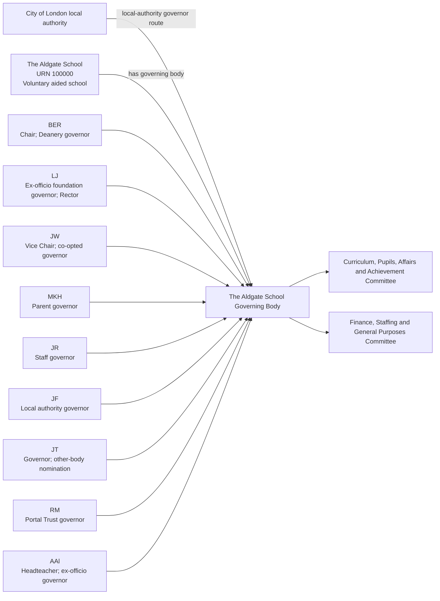
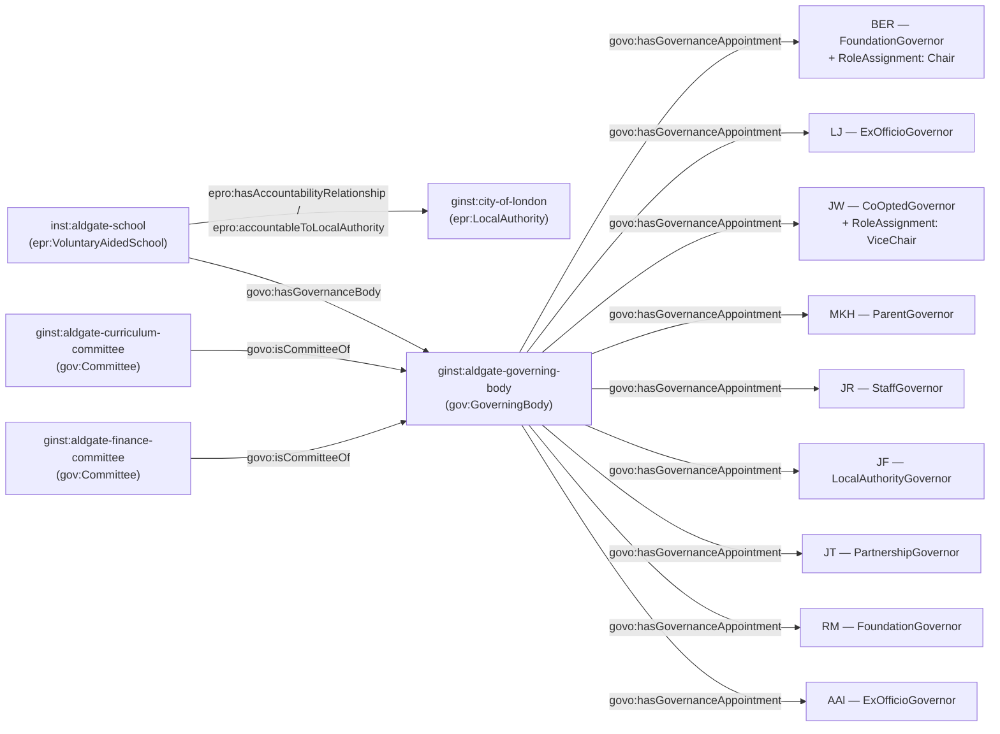

[← Worked examples](../)

# Governance Ontology — The Aldgate School example

| | |
|---|---|
| **School** | The Aldgate School — URN 100000 |
| **Local Authority** | City of London |
| **Establishment type** | Voluntary aided school |
| **Governance ontology namespace** | `https://dfe-digital.github.io/education-provider-registry-docs/models/governance/ontology/` |
| **Governance vocabulary namespace** | `https://dfe-digital.github.io/education-provider-registry-docs/models/governance/vocabulary/` |
| **Preferred prefixes** | `govo:` (properties) · `gov:` (classes and named individuals) · `epr:`/`epro:` (reused from the main EPR ontology) |
| **OWL documentation** | [Governance ontology reference (WIDOCO)](../../ontology/) |
| **Source** | [governance-ontology.ttl](https://github.com/DFE-Digital/education-provider-registry-docs/blob/main/models/governance/governance-ontology.ttl) |
| **Repository** | [DFE-Digital/education-provider-registry-docs](https://github.com/DFE-Digital/education-provider-registry-docs) |
| **Licence** | [Open Government Licence v3.0](https://www.nationalarchives.gov.uk/doc/open-government-licence/version/3/) |

---

**Evidence and anonymisation.** This page is in two parts. **Section 1** is the real-world governance structure as documented in a bounded, sourced internal investigation ("The Aldgate School: governance model worked example") - what the school itself publishes, independent of any ontology. **Section 2** maps that same structure onto `governance-ontology.ttl`. Neither section is itself GIAS data, and the source investigation is not published in this repository.

Person names throughout are shown as initials, exactly as the source investigation anonymised them. Both sections show the same representative **subset** of the published board - 15 named people are evidenced in the source - so that Section 1 and Section 2 stay directly comparable. Left out: `JG`, `AA`, `JS`, `TO`, `MF` and `MR` (6 further governors, all in categories already shown by another person below).

---

## Section 1 — The real-world governance structure

This section is the structure as evidenced, before any ontology is applied.

### Sources

| Source | Publisher | What it evidences | Observed |
|---|---|---|---|
| [The Aldgate School — Governance](https://www.thealdgateschool.org/key-information-1/governance) | The Aldgate School | Governing body purpose, committee structure, published board members and role/appointing-body descriptions | 27 July 2026 |
| [GIAS — The Aldgate School, URN 100000, Governance tab](https://www.get-information-schools.service.gov.uk/Establishments/Establishment/Details/100000#school-governance) | GIAS | Establishment type, current governance rows, GIDs, appointment routes and dates, and historic rows | 27 July 2026 |

GIAS's 12 current governance rows are broadly representative of the school's published board, but its "Chair of governors" field is **not recorded**, despite the school's own page naming `BER` as Chair - a missing role in GIAS, not evidence the role doesn't exist. GIAS also records two historic rows (`RM`, `MR`) ended within the last 12 months; the school's own page still publishes both as current, so both sources are preserved separately rather than one overwriting the other. GIAS captures broad appointment routes (e.g. "Appointed by foundation/Trust") but not the school's more specific Portal Trust/LDBS/Deanery distinctions.

### Structure

Adapted from the source investigation's own instance-level mapping, trimmed to a representative subset for readability - the same subset modelled in Section 2 below.



The diagram represents the real-world governing body, not registry records. URN `100000` is an identifier and evidence, not a model entity in its own right. `JT`'s "other-body nomination" is the school's own paraphrase of exactly what SI 2012/1034 reg 10 calls a partnership governor - see Example 3. `RM` is published as current on the school's own page but recorded as historical (ended 21 April 2026) in GIAS - both are preserved rather than one overwriting the other.

---

## Section 2 — Modelled in the governance ontology

The same governors, bodies and appointments from Section 1, expressed in Turtle using `governance-ontology.ttl` (`gov:`/`govo:`).

### Structure



### Namespace prefixes

All examples in this section use the following prefixes.

```
@prefix gov:   <https://dfe-digital.github.io/education-provider-registry-docs/models/governance/vocabulary/> .
@prefix govo:  <https://dfe-digital.github.io/education-provider-registry-docs/models/governance/ontology/> .
@prefix epr:   <https://dfe-digital.github.io/education-provider-registry-docs/vocabulary/> .
@prefix epro:  <https://dfe-digital.github.io/education-provider-registry-docs/ontology/> .
@prefix rdf:   <http://www.w3.org/1999/02/22-rdf-syntax-ns#> .
@prefix rdfs:  <http://www.w3.org/2000/01/rdf-schema#> .
@prefix owl:   <http://www.w3.org/2002/07/owl#> .
@prefix xsd:   <http://www.w3.org/2001/XMLSchema#> .
@prefix inst:  <https://dfe-digital.github.io/education-provider-registry-docs/establishment/> .
@prefix ginst: <https://dfe-digital.github.io/education-provider-registry-docs/models/governance/instance/> .
```

### Example 1 — Establishment, Local Authority accountability and Governing Body identity

The same pattern as Gilded Hollins and Millfield: `epr:VoluntaryAidedSchool`, `epro:hasAccountabilityRelationship` + `epro:accountableToLocalAuthority`, and a single `gov:GoverningBody` - genuinely statutory, since this is a maintained school.

```
ginst:city-of-london
    a epr:LocalAuthority ;
    rdfs:label "City of London"@en .

inst:aldgate-school
    a epr:VoluntaryAidedSchool ;
    rdfs:label "The Aldgate School"@en ;

    epro:hasEstablishmentIdentity [
        a epr:EstablishmentIdentity ;
        epro:identifiedByUrn [
            a epr:UniqueReferenceNumber ;
            rdfs:label "100000"
        ]
    ] ;

    epro:hasAccountabilityRelationship [
        a epr:EstablishmentAccountability ;
        epro:accountableToLocalAuthority ginst:city-of-london
    ] .

ginst:aldgate-governing-body
    a gov:GoverningBody ;
    rdfs:label "The Aldgate School — Governing Body"@en .

inst:aldgate-school
    govo:hasGovernanceBody ginst:aldgate-governing-body .
```

### Example 2 — Foundation and ex-officio foundation governors, and Chair

`BER` chairs the Governing Body and holds a Foundation governor appointment via the Deanery - one of three distinct named foundation appointing bodies this school publishes (Portal Trust, LDBS, Deanery), all mapping onto the same `gov:AppointedByFoundationOrTrust` value, the specific body preserved in `rdfs:comment`. `LJ` is an ex-officio foundation governor by virtue of being Rector - matching SI 2012/1034 reg 9's own definition precisely, the same pattern seen at Long Ditton's `KS`.

```
ginst:person-ber
    a gov:GovernancePerson ;
    rdfs:label "BER"@en .

ginst:appointment-ber-governor
    a gov:GovernanceAppointment ;
    govo:appointmentOf ginst:person-ber ;
    govo:hasRoleType gov:FoundationGovernor ;
    govo:hasAppointingBody gov:AppointedByFoundationOrTrust ;
    govo:hasAppointmentBasis gov:StatutoryGovernanceAppointment ;
    rdfs:comment "Foundation governor appointed via the Deanery, per the school's own published page."@en .

ginst:aldgate-governing-body
    govo:hasGovernanceAppointment ginst:appointment-ber-governor .

ginst:roleassignment-ber-chair
    a gov:RoleAssignment ;
    govo:layeredOn ginst:appointment-ber-governor ;
    govo:assignsRole gov:Chair ;
    rdfs:comment "GIAS has no 'Chair of governors' record for this school at all, though it does record BER as a current governor - the Chair responsibility is taken from the school's own page, not inferred absent from GIAS."@en .

ginst:person-lj
    a gov:GovernancePerson ;
    rdfs:label "LJ"@en .

ginst:appointment-lj-governor
    a gov:GovernanceAppointment ;
    govo:appointmentOf ginst:person-lj ;
    govo:hasRoleType gov:ExOfficioGovernor ;
    govo:hasAppointingBody gov:ExOfficioAppointment ;
    govo:hasAppointmentBasis gov:StatutoryGovernanceAppointment ;
    rdfs:comment "Ex-officio foundation governor by virtue of holding the office of Rector, matching SI 2012/1034 reg 9's definition of an ex officio foundation governor."@en .

ginst:aldgate-governing-body
    govo:hasGovernanceAppointment ginst:appointment-lj-governor .
```

### Example 3 — Partnership governor

`JT` is published as "Governor; other-body nomination" - the school's own paraphrase of `gov:PartnershipGovernor`, added to the ontology directly from this finding. `gov:Governor`'s own vocabulary definition had named "partnership" as one of the six governor categories SI 2012/1034 regs 6-11 define since this ontology's first version, but no individual had ever been implemented for it until now - the only one of the six missing.

```
ginst:person-jt
    a gov:GovernancePerson ;
    rdfs:label "JT"@en .

ginst:appointment-jt-governor
    a gov:GovernanceAppointment ;
    govo:appointmentOf ginst:person-jt ;
    govo:hasRoleType gov:PartnershipGovernor ;
    govo:hasAppointingBody gov:NominatedByPartner ;
    govo:hasAppointmentBasis gov:StatutoryGovernanceAppointment ;
    rdfs:comment "Published as 'Governor; other-body nomination' - GIAS separately describes the same route as 'Nominated by other body and appointed by GB', matching SI 2012/1034 Sch.3's partnership governor nomination and appointment mechanism precisely."@en .

ginst:aldgate-governing-body
    govo:hasGovernanceAppointment ginst:appointment-jt-governor .
```

### Example 4 — Vice-Chair, Parent, Staff and Local Authority governors

```
ginst:person-jw
    a gov:GovernancePerson ;
    rdfs:label "JW"@en .

ginst:appointment-jw-governor
    a gov:GovernanceAppointment ;
    govo:appointmentOf ginst:person-jw ;
    govo:hasRoleType gov:CoOptedGovernor ;
    govo:hasAppointingBody gov:AppointedByGoverningBody ;
    govo:hasAppointmentBasis gov:StatutoryGovernanceAppointment .

ginst:aldgate-governing-body
    govo:hasGovernanceAppointment ginst:appointment-jw-governor .

ginst:roleassignment-jw-vicechair
    a gov:RoleAssignment ;
    govo:layeredOn ginst:appointment-jw-governor ;
    govo:assignsRole gov:ViceChair .

ginst:person-mkh
    a gov:GovernancePerson ;
    rdfs:label "MKH"@en .

ginst:appointment-mkh-governor
    a gov:GovernanceAppointment ;
    govo:appointmentOf ginst:person-mkh ;
    govo:hasRoleType gov:ParentGovernor ;
    govo:hasAppointingBody gov:ElectedByParents ;
    govo:hasAppointmentBasis gov:StatutoryGovernanceAppointment .

ginst:aldgate-governing-body
    govo:hasGovernanceAppointment ginst:appointment-mkh-governor .

ginst:person-jr
    a gov:GovernancePerson ;
    rdfs:label "JR"@en .

ginst:appointment-jr-governor
    a gov:GovernanceAppointment ;
    govo:appointmentOf ginst:person-jr ;
    govo:hasRoleType gov:StaffGovernor ;
    govo:hasAppointingBody gov:ElectedByStaff ;
    govo:hasAppointmentBasis gov:StatutoryGovernanceAppointment .

ginst:aldgate-governing-body
    govo:hasGovernanceAppointment ginst:appointment-jr-governor .

ginst:person-jf
    a gov:GovernancePerson ;
    rdfs:label "JF"@en .

ginst:appointment-jf-governor
    a gov:GovernanceAppointment ;
    govo:appointmentOf ginst:person-jf ;
    govo:hasRoleType gov:LocalAuthorityGovernor ;
    govo:hasAppointingBody gov:AppointedByLocalAuthority ;
    govo:hasAppointmentBasis gov:StatutoryGovernanceAppointment .

ginst:aldgate-governing-body
    govo:hasGovernanceAppointment ginst:appointment-jf-governor .
```

### Example 5 — Headteacher, and a governor GIAS shows as historic

```
ginst:person-aal
    a gov:GovernancePerson ;
    rdfs:label "AAl"@en .

ginst:appointment-aal-governor
    a gov:GovernanceAppointment ;
    govo:appointmentOf ginst:person-aal ;
    govo:hasRoleType gov:ExOfficioGovernor ;
    govo:hasAppointingBody gov:ExOfficioAppointment ;
    govo:hasAppointmentBasis gov:StatutoryGovernanceAppointment ;
    rdfs:comment "Headteacher - ex-officio governor by virtue of that post."@en .

ginst:aldgate-governing-body
    govo:hasGovernanceAppointment ginst:appointment-aal-governor .

ginst:person-rm
    a gov:GovernancePerson ;
    rdfs:label "RM"@en .

ginst:appointment-rm-governor
    a gov:GovernanceAppointment ;
    govo:appointmentOf ginst:person-rm ;
    govo:hasRoleType gov:FoundationGovernor ;
    govo:hasAppointingBody gov:AppointedByFoundationOrTrust ;
    govo:hasAppointmentBasis gov:StatutoryGovernanceAppointment ;
    rdfs:comment "Foundation governor appointed via Portal Trust, per the school's own published page. GIAS records this appointment as historical, ended 21 April 2026 - both sources are preserved rather than one overwriting the other, per this investigation's own methodology."@en .

ginst:aldgate-governing-body
    govo:hasGovernanceAppointment ginst:appointment-rm-governor .
```

### Example 6 — Committees

Two named committees are published; no source evidence identifies which governors sit on which, so no committee membership is asserted for any of the nine governors modelled above - the same treatment as Millfield's and Vauxhall's unevidenced committee memberships.

```
ginst:aldgate-curriculum-committee
    a gov:Committee ;
    rdfs:label "The Aldgate School — Curriculum, Pupils, Affairs and Achievement Committee"@en ;
    govo:isCommitteeOf ginst:aldgate-governing-body .

ginst:aldgate-finance-committee
    a gov:Committee ;
    rdfs:label "The Aldgate School — Finance, Staffing and General Purposes Committee"@en ;
    govo:isCommitteeOf ginst:aldgate-governing-body .
```

---

## Concept coverage

| Real-world concept | Aldgate evidence | Ontology mapping | Fit |
|---|---|---|---|
| Voluntary aided school | The Aldgate School, URN 100000 | `epr:VoluntaryAidedSchool` | Direct |
| Maintaining Local Authority | City of London | `epr:LocalAuthority` + `epro:hasAccountabilityRelationship` + `epro:accountableToLocalAuthority` | Direct |
| Governing Body | The statutory governing body | `gov:GoverningBody` + `govo:hasGovernanceBody` | Direct |
| Foundation governor, multiple named appointing bodies | Portal Trust, LDBS, Deanery | `govo:hasRoleType gov:FoundationGovernor`, `govo:hasAppointingBody gov:AppointedByFoundationOrTrust` | Direct at the category level; specific body preserved in `rdfs:comment` |
| Ex-officio foundation governor | LJ (Rector) | `govo:hasRoleType gov:ExOfficioGovernor` | Direct |
| Partnership governor | JT ("other-body nomination") | `govo:hasRoleType gov:PartnershipGovernor`, `govo:hasAppointingBody gov:NominatedByPartner` | Direct - both added to the ontology from this finding |
| Other governor categories | Co-opted, Parent, Staff, Local Authority, ex-officio Headteacher | `govo:hasRoleType` (`gov:CoOptedGovernor`, `gov:ParentGovernor`, `gov:StaffGovernor`, `gov:LocalAuthorityGovernor`, `gov:ExOfficioGovernor`) | Direct |
| Chair / Vice-Chair | BER (Chair), JW (Vice-Chair) | `gov:RoleAssignment` + `govo:assignsRole` (`gov:Chair`, `gov:ViceChair`) | Direct |
| Committees | Curriculum/Pupils/Affairs/Achievement, Finance/Staffing/General Purposes | `gov:Committee` + `govo:isCommitteeOf` | Direct as bodies; no governor-to-committee membership evidenced |
| Governor shown as current by the school, historic in GIAS | RM | Modelled as current, per this investigation's own source-authority rule; GIAS's differing status noted in `rdfs:comment` | Direct |
| Governance professional / Clerk | Not clearly identified in this investigation | Not modelled | Not evidenced |

---

**See also:** [Governance vocabulary](../../vocabulary/) · [Governance taxonomy](../../taxonomy/) · [Governance ontology](../../ontology/) · [Governance ontology graph viewer](../../ontology/webvowl/)
