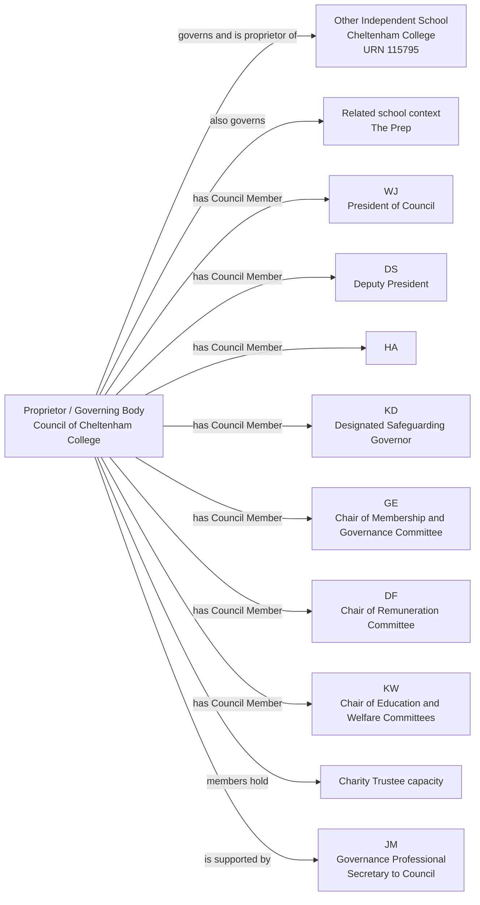
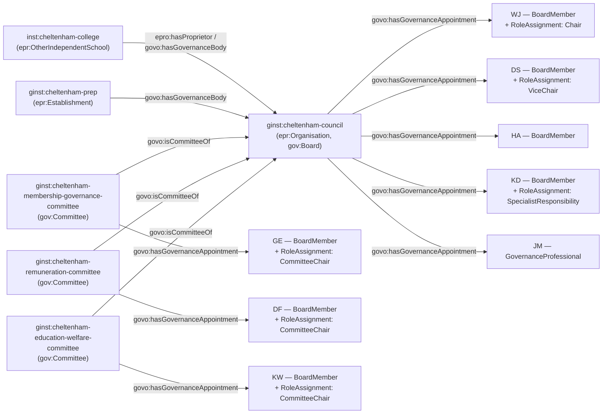

[← Worked examples](../)

# Governance Ontology — Cheltenham College example

| | |
|---|---|
| **School** | Cheltenham College — URN 115795 |
| **Proprietor / governing body** | The Council of Cheltenham College |
| **Establishment type** | Other independent school |
| **Governance ontology namespace** | `https://dfe-digital.github.io/education-provider-registry-docs/models/governance/ontology/` |
| **Governance vocabulary namespace** | `https://dfe-digital.github.io/education-provider-registry-docs/models/governance/vocabulary/` |
| **Preferred prefixes** | `govo:` (properties) · `gov:` (classes and named individuals) · `epr:`/`epro:` (reused from the main EPR ontology) |
| **OWL documentation** | [Governance ontology reference (WIDOCO)](../../ontology/) |
| **Source** | [governance-ontology.ttl](https://github.com/DFE-Digital/education-provider-registry-docs/blob/main/models/governance/governance-ontology.ttl) |
| **Repository** | [DFE-Digital/education-provider-registry-docs](https://github.com/DFE-Digital/education-provider-registry-docs) |
| **Licence** | [Open Government Licence v3.0](https://www.nationalarchives.gov.uk/doc/open-government-licence/version/3/) |

---

**Evidence and anonymisation.** This page is in two parts. **Section 1** is the real-world governance structure as documented in a bounded, sourced internal investigation ("Governance Model With Worked Other Independent School Example: Cheltenham College") - what the College itself publishes, independent of any ontology. **Section 2** maps that same structure onto `governance-ontology.ttl`. Neither section is itself GIAS data, and the source investigation is not published in this repository.

Person names throughout are shown as initials, exactly as the source investigation anonymised them. GIAS has no Governance-tab people at all for this school - every named person on this page comes solely from the College's own published governance page.

---

## Section 1 — The real-world governance structure

This section is the structure as evidenced, before any ontology is applied.

### Sources

| Source | Publisher | What it evidences | Observed |
|---|---|---|---|
| [Cheltenham College Governance](https://www.cheltenhamcollege.org/about-us/governance/) | Cheltenham College | The Council is the governing body of College and The Prep; published Council members, President, Deputy President, committee responsibilities, charity-trustee status, appointment terms and Secretary to Council | 27 July 2026 |
| [GIAS: Cheltenham College, URN 115795](https://www.get-information-schools.service.gov.uk/Establishments/Establishment/Details/115795#school-governance) | GIAS | Open `Other independent school`, Gloucestershire context and `Proprietor's name: The Council of Cheltenham College`. No Governance-tab people or Governance section at all | 27 July 2026 |

GIAS confirms the establishment type and proprietor name but has no Governance tab, no Council members and no governance professional for this school - a GIAS coverage gap, not evidence that Cheltenham College has no governing body or governance people. The College's own governance page is the only source for every named person on this page.

### Structure

Adapted from the source investigation's own instance-level mapping, trimmed to a representative subset of the 16 published Council members for readability - the same subset modelled in Section 2 below.



The diagram represents the real-world Council, not registry records. URN `115795` is an identifier and evidence, not a model entity in its own right. The Council's historic name does not make it a Local Governing Body, Academy Trust Board or Local Authority governing body - it is the College's own proprietor and governing body, both at once. 9 further Council members are evidenced in the source and not shown here.

---

## Section 2 — Modelled in the governance ontology

The same people, bodies and appointments from Section 1, expressed in Turtle using `governance-ontology.ttl` (`gov:`/`govo:`).

### Structure



### Namespace prefixes

All examples in this section use the following prefixes.

```
@prefix gov:   <https://dfe-digital.github.io/education-provider-registry-docs/models/governance/vocabulary/> .
@prefix govo:  <https://dfe-digital.github.io/education-provider-registry-docs/models/governance/ontology/> .
@prefix epr:   <https://dfe-digital.github.io/education-provider-registry-docs/models/establishment/vocabulary/> .
@prefix epro:  <https://dfe-digital.github.io/education-provider-registry-docs/models/establishment/ontology/> .
@prefix rdf:   <http://www.w3.org/1999/02/22-rdf-syntax-ns#> .
@prefix rdfs:  <http://www.w3.org/2000/01/rdf-schema#> .
@prefix owl:   <http://www.w3.org/2002/07/owl#> .
@prefix xsd:   <http://www.w3.org/2001/XMLSchema#> .
@prefix inst:  <https://dfe-digital.github.io/education-provider-registry-docs/establishment/> .
@prefix ginst: <https://dfe-digital.github.io/education-provider-registry-docs/models/governance/instance/> .
```

### Example 1 — Establishment, Council as proprietor and governing body, and The Prep

`epr:OtherIndependentSchool` is the specific leaf type GIAS itself records. The Council is modelled as a **single instance** carrying two types at once: `epr:Organisation` (so it can fill `epro:hasProprietor`'s range, the property already documented as "present for independent schools") and `gov:Board` ("generic term for a governance body, used where source data does not distinguish governing body, trust board or local governing body" - exactly this case, since Cheltenham's Council is neither of the more specific body types). This is different from every academy trust example on this site, where the legal entity (`epr:AcademyTrust`) and its board (`gov:TrustBoard`) are always two distinct instances - here, the College's own evidence says the Council genuinely is both at once, so the model doesn't invent a split the source itself doesn't make.

The Council also governs a second, related school ("The Prep"), evidenced only by name with no URN published in this source - `epr:Establishment`, the generic stub, rather than a more specific leaf type.

```
inst:cheltenham-college
    a epr:OtherIndependentSchool ;
    rdfs:label "Cheltenham College"@en ;
    epro:hasEstablishmentIdentity [
        a epr:EstablishmentIdentity ;
        epro:identifiedByUrn [
            a epr:UniqueReferenceNumber ;
            rdfs:label "115795"
        ]
    ] .

ginst:cheltenham-prep
    a epr:Establishment ;
    rdfs:label "The Prep"@en ;
    rdfs:comment "Named only as related school context in this source, with no URN published - not further typed."@en .

ginst:cheltenham-council
    a epr:Organisation, gov:Board ;
    rdfs:label "The Council of Cheltenham College"@en ;
    rdfs:comment "One real-world body, modelled as one instance carrying both the proprietor/organisation type and the governance-body type, since the College's own evidence does not distinguish them as Medlock's Academy Trust and Trust Board are distinguished."@en .

inst:cheltenham-college
    epro:hasProprietor ginst:cheltenham-council ;
    govo:hasGovernanceBody ginst:cheltenham-council .

ginst:cheltenham-prep
    govo:hasGovernanceBody ginst:cheltenham-council .
```

### Example 2 — Council membership and charity trustee capacity

No `GovernanceRoleType` individual matches "Council Member" specifically - `gov:BoardMember`, the same generic value used for MAT committee members elsewhere, is the closest candidate. Every Council member holds the charity trustee legal capacity - `gov:CharityTrustee`, added directly from this finding, with no `gov:CompanyDirector` capacity, since the Council is not a company limited by guarantee.

```
ginst:person-ha
    a gov:GovernancePerson ;
    rdfs:label "HA"@en .

ginst:appointment-ha-councilmember
    a gov:GovernanceAppointment ;
    govo:appointmentOf ginst:person-ha ;
    govo:hasRoleType gov:BoardMember ;
    govo:hasAppointmentBasis gov:DelegatedGovernanceAppointment ;
    govo:hasLegalCapacity gov:CharityTrustee ;
    rdfs:comment "Council Member. gov:BoardMember is the closest candidate role-type value - no individual matches 'Council Member' specifically."@en .

ginst:cheltenham-council
    govo:hasGovernanceAppointment ginst:appointment-ha-councilmember .
```

*(9 further Council members are evidenced in the source and not shown here.)*

### Example 3 — President and Deputy President

The College's own terms "President" and "Deputy President" are this body's names for the Chair/Vice-Chair responsibilities, layered onto the base Council membership - the same responsibility-not-replacement pattern used throughout these worked examples, just under different published titles.

```
ginst:person-wj
    a gov:GovernancePerson ;
    rdfs:label "WJ"@en .

ginst:appointment-wj-councilmember
    a gov:GovernanceAppointment ;
    govo:appointmentOf ginst:person-wj ;
    govo:hasRoleType gov:BoardMember ;
    govo:hasAppointmentBasis gov:DelegatedGovernanceAppointment ;
    govo:hasLegalCapacity gov:CharityTrustee .

ginst:cheltenham-council
    govo:hasGovernanceAppointment ginst:appointment-wj-councilmember .

ginst:roleassignment-wj-president
    a gov:RoleAssignment ;
    govo:layeredOn ginst:appointment-wj-councilmember ;
    govo:assignsRole gov:Chair ;
    rdfs:comment "Published as 'President of Council' - this body's own term for the Chair responsibility."@en .

ginst:person-ds
    a gov:GovernancePerson ;
    rdfs:label "DS"@en .

ginst:appointment-ds-councilmember
    a gov:GovernanceAppointment ;
    govo:appointmentOf ginst:person-ds ;
    govo:hasRoleType gov:BoardMember ;
    govo:hasAppointmentBasis gov:DelegatedGovernanceAppointment ;
    govo:hasLegalCapacity gov:CharityTrustee .

ginst:cheltenham-council
    govo:hasGovernanceAppointment ginst:appointment-ds-councilmember .

ginst:roleassignment-ds-deputypresident
    a gov:RoleAssignment ;
    govo:layeredOn ginst:appointment-ds-councilmember ;
    govo:assignsRole gov:ViceChair ;
    rdfs:comment "Published as 'Deputy President' - this body's own term for the Vice-Chair responsibility."@en .
```

### Example 4 — Designated Safeguarding Governor

```
ginst:person-kd
    a gov:GovernancePerson ;
    rdfs:label "KD"@en .

ginst:appointment-kd-councilmember
    a gov:GovernanceAppointment ;
    govo:appointmentOf ginst:person-kd ;
    govo:hasRoleType gov:BoardMember ;
    govo:hasAppointmentBasis gov:DelegatedGovernanceAppointment ;
    govo:hasLegalCapacity gov:CharityTrustee .

ginst:cheltenham-council
    govo:hasGovernanceAppointment ginst:appointment-kd-councilmember .

ginst:roleassignment-kd-safeguarding
    a gov:RoleAssignment ;
    govo:layeredOn ginst:appointment-kd-councilmember ;
    govo:assignsRole gov:SpecialistResponsibility ;
    rdfs:comment "Designated Safeguarding Governor - the College's own title, preserved verbatim even though 'Governor' is not otherwise used for Council members here."@en .
```

### Example 5 — Committees and Committee Chairs

Three named committees are published. `KW`'s "Chair of Education and Welfare Committees" is modelled as one combined committee, since the source does not clearly evidence two separate bodies - a conservative reading rather than inventing a second committee.

```
ginst:cheltenham-membership-governance-committee
    a gov:Committee ;
    rdfs:label "Cheltenham College Council — Membership and Governance Committee"@en ;
    govo:isCommitteeOf ginst:cheltenham-council .

ginst:cheltenham-remuneration-committee
    a gov:Committee ;
    rdfs:label "Cheltenham College Council — Remuneration Committee"@en ;
    govo:isCommitteeOf ginst:cheltenham-council .

ginst:cheltenham-education-welfare-committee
    a gov:Committee ;
    rdfs:label "Cheltenham College Council — Education and Welfare Committee"@en ;
    govo:isCommitteeOf ginst:cheltenham-council ;
    rdfs:comment "Published as 'Education and Welfare Committees' (plural) with one Chair - modelled as one combined committee rather than inventing two separate ones the source does not clearly evidence."@en .

ginst:person-ge
    a gov:GovernancePerson ;
    rdfs:label "GE"@en .

ginst:appointment-ge-councilmember
    a gov:GovernanceAppointment ;
    govo:appointmentOf ginst:person-ge ;
    govo:hasRoleType gov:BoardMember ;
    govo:hasAppointmentBasis gov:DelegatedGovernanceAppointment ;
    govo:hasLegalCapacity gov:CharityTrustee .

ginst:cheltenham-council
    govo:hasGovernanceAppointment ginst:appointment-ge-councilmember .

ginst:appointment-ge-committee
    a gov:GovernanceAppointment ;
    govo:appointmentOf ginst:person-ge ;
    govo:hasRoleType gov:BoardMember ;
    govo:hasAppointmentBasis gov:DelegatedGovernanceAppointment ;
    rdfs:comment "GE's committee-level appointment, distinct from GE's Council membership above."@en .

ginst:cheltenham-membership-governance-committee
    govo:hasGovernanceAppointment ginst:appointment-ge-committee .

ginst:roleassignment-ge-committeechair
    a gov:RoleAssignment ;
    govo:layeredOn ginst:appointment-ge-committee ;
    govo:assignsRole gov:CommitteeChair .

ginst:person-df
    a gov:GovernancePerson ;
    rdfs:label "DF"@en .

ginst:appointment-df-councilmember
    a gov:GovernanceAppointment ;
    govo:appointmentOf ginst:person-df ;
    govo:hasRoleType gov:BoardMember ;
    govo:hasAppointmentBasis gov:DelegatedGovernanceAppointment ;
    govo:hasLegalCapacity gov:CharityTrustee .

ginst:cheltenham-council
    govo:hasGovernanceAppointment ginst:appointment-df-councilmember .

ginst:appointment-df-committee
    a gov:GovernanceAppointment ;
    govo:appointmentOf ginst:person-df ;
    govo:hasRoleType gov:BoardMember ;
    govo:hasAppointmentBasis gov:DelegatedGovernanceAppointment ;
    rdfs:comment "DF's committee-level appointment, distinct from DF's Council membership above."@en .

ginst:cheltenham-remuneration-committee
    govo:hasGovernanceAppointment ginst:appointment-df-committee .

ginst:roleassignment-df-committeechair
    a gov:RoleAssignment ;
    govo:layeredOn ginst:appointment-df-committee ;
    govo:assignsRole gov:CommitteeChair .

ginst:person-kw
    a gov:GovernancePerson ;
    rdfs:label "KW"@en .

ginst:appointment-kw-councilmember
    a gov:GovernanceAppointment ;
    govo:appointmentOf ginst:person-kw ;
    govo:hasRoleType gov:BoardMember ;
    govo:hasAppointmentBasis gov:DelegatedGovernanceAppointment ;
    govo:hasLegalCapacity gov:CharityTrustee .

ginst:cheltenham-council
    govo:hasGovernanceAppointment ginst:appointment-kw-councilmember .

ginst:appointment-kw-committee
    a gov:GovernanceAppointment ;
    govo:appointmentOf ginst:person-kw ;
    govo:hasRoleType gov:BoardMember ;
    govo:hasAppointmentBasis gov:DelegatedGovernanceAppointment ;
    rdfs:comment "KW's committee-level appointment, distinct from KW's Council membership above."@en .

ginst:cheltenham-education-welfare-committee
    govo:hasGovernanceAppointment ginst:appointment-kw-committee .

ginst:roleassignment-kw-committeechair
    a gov:RoleAssignment ;
    govo:layeredOn ginst:appointment-kw-committee ;
    govo:assignsRole gov:CommitteeChair .
```

### Example 6 — Secretary to Council

```
ginst:person-jm
    a gov:GovernancePerson ;
    rdfs:label "JM"@en .

ginst:appointment-jm-governanceprofessional
    a gov:GovernanceAppointment ;
    govo:appointmentOf ginst:person-jm ;
    govo:hasRoleType gov:GovernanceProfessional ;
    govo:hasAppointmentBasis gov:ProfessionalSupportRole ;
    rdfs:comment "Secretary to Council, supporting the Council rather than holding a Council membership."@en .

ginst:cheltenham-council
    govo:hasGovernanceAppointment ginst:appointment-jm-governanceprofessional .
```

---

## Concept coverage

| Real-world concept | Cheltenham evidence | Ontology mapping | Fit |
|---|---|---|---|
| Other independent school | Cheltenham College, URN 115795 | `epr:OtherIndependentSchool` | Direct - reused leaf type |
| Proprietor | The Council of Cheltenham College | `epro:hasProprietor`, range typed `epr:Organisation` | Direct |
| Governing body, coextensive with the proprietor | The same Council | `gov:Board` on the same instance as the proprietor | Direct - `gov:Board` exists precisely for a body not fitting the more specific governing-body/trust-board/local-governing-body types |
| Related second school with shared governance | The Prep | `epr:Establishment` (generic, no URN evidenced), `govo:hasGovernanceBody` to the same Council | Direct - a third variant of shared governance across establishments, after the Federation examples and OAK/Manor High |
| Council Membership | 16 published Council members | `govo:hasRoleType gov:BoardMember` | Candidate - no role type matches "Council Member" specifically |
| Charity trustee capacity | Council members are charity trustees | `govo:hasLegalCapacity gov:CharityTrustee` | Direct - added to the ontology from this finding |
| President / Deputy President | WJ, DS | `gov:RoleAssignment` + `govo:assignsRole` (`gov:Chair`, `gov:ViceChair`) | Direct - synonym reuse of the same responsibility values used elsewhere under different titles |
| Designated Safeguarding Governor | KD | `gov:RoleAssignment` + `govo:assignsRole gov:SpecialistResponsibility` | Direct |
| Committees and Committee Chairs | Membership and Governance, Remuneration, Education and Welfare | `gov:Committee` + `govo:isCommitteeOf`; `gov:RoleAssignment` + `govo:assignsRole gov:CommitteeChair` | Direct for the chairing pattern; Candidate for treating "Education and Welfare Committees" as one committee |
| Governance Professional | JM, Secretary to Council | `govo:hasRoleType gov:GovernanceProfessional` | Direct |
| Appointment basis | Council members' appointments derive from the College's historic charitable constitution | `govo:hasAppointmentBasis gov:DelegatedGovernanceAppointment` | Direct, following this ontology's definition being widened from this finding to cover independent schools' own historic constitutions, not only Academy Trusts' |
| Nomination routes, term dates, legal-entity detail beyond the proprietor name | Not published in this investigation | Not modelled | Not evidenced |

---

**See also:** [Governance vocabulary](../../vocabulary/) · [Governance taxonomy](../../taxonomy/) · [Governance ontology](../../ontology/) · [Governance ontology graph viewer](../../ontology/webvowl/)
