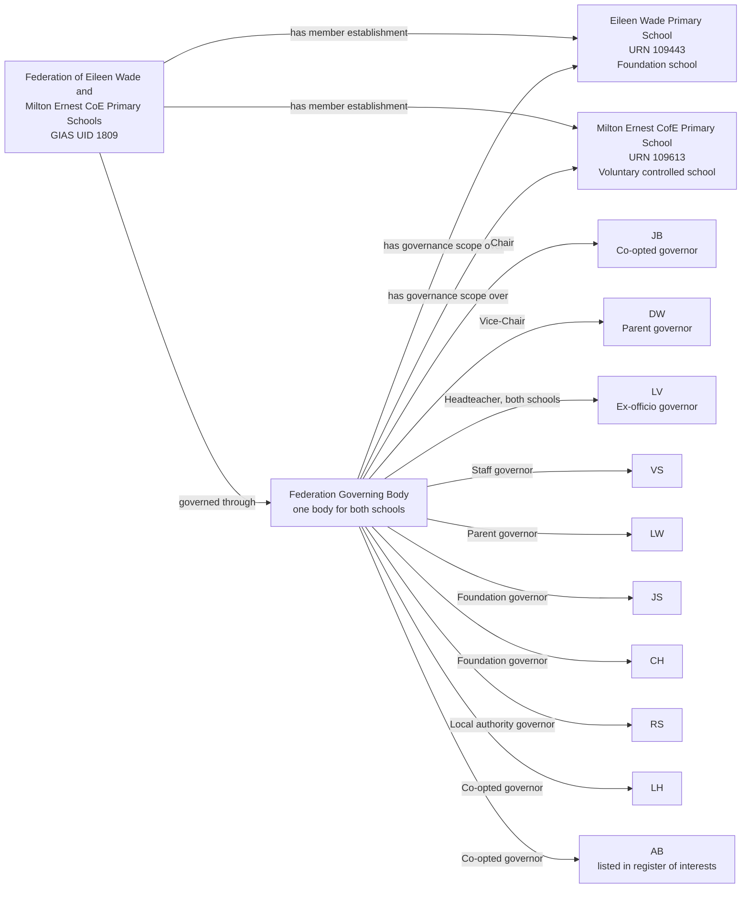
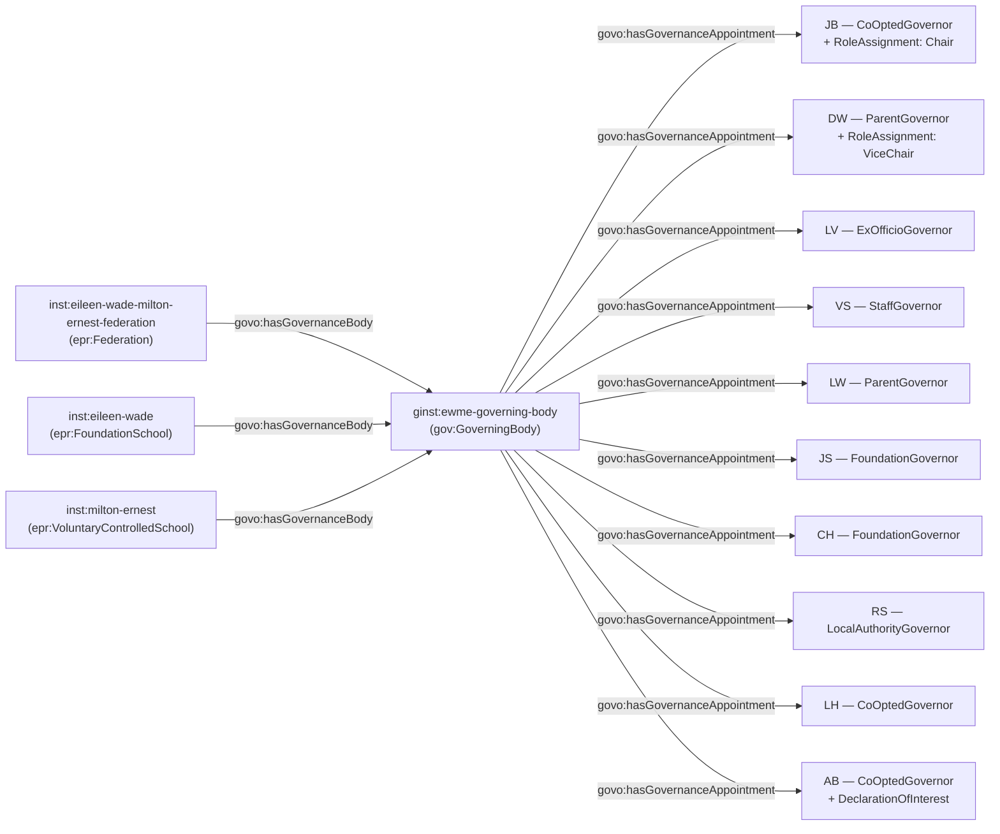

[← Worked examples](../)

# Governance Ontology — Eileen Wade / Milton Ernest Federation example

| | |
|---|---|
| **Federation** | Federation of Eileen Wade and Milton Ernest CoE Primary Schools — GIAS UID 1809 |
| **Member schools** | Eileen Wade Primary School (URN 109443, Foundation school) and Milton Ernest CofE Primary School (URN 109613, Voluntary controlled school) |
| **Establishment type** | Maintained-school federation, two open schools, one shared governing body |
| **Governance ontology namespace** | `https://dfe-digital.github.io/education-provider-registry-docs/models/governance/ontology/` |
| **Governance vocabulary namespace** | `https://dfe-digital.github.io/education-provider-registry-docs/models/governance/vocabulary/` |
| **Preferred prefixes** | `govo:` (properties) · `gov:` (classes and named individuals) · `epr:`/`epro:` (reused from the main EPR ontology) |
| **OWL documentation** | [Governance ontology reference (WIDOCO)](../../ontology/) |
| **Source** | [governance-ontology.ttl](https://github.com/DFE-Digital/education-provider-registry-docs/blob/main/models/governance/governance-ontology.ttl) |
| **Repository** | [DFE-Digital/education-provider-registry-docs](https://github.com/DFE-Digital/education-provider-registry-docs) |
| **Licence** | [Open Government Licence v3.0](https://www.nationalarchives.gov.uk/doc/open-government-licence/version/3/) |

---

**Evidence and anonymisation.** This page is in two parts. **Section 1** is the real-world governance structure as documented in a bounded, sourced internal investigation ("Governance Model With Worked Federation Example") - what the federation itself publishes, independent of any ontology. **Section 2** maps that same structure onto `governance-ontology.ttl`. Neither section is itself GIAS data, and the source investigation is not published in this repository.

Person names throughout are shown as initials, exactly as the source investigation anonymised them (e.g. `JB`, `DW`) - this example does not use, and has not gone back to, the federation's full published names. All 10 people on the federation's published board page are shown in both sections; nothing is trimmed for this example.

---

## Section 1 — The real-world governance structure

This section is the structure as evidenced, before any ontology is applied.

### Sources

| Source | Publisher | What it evidences | Observed |
|---|---|---|---|
| [GIAS federation record, UID 1809](https://get-information-schools.service.gov.uk/Groups/Group/Details/1809) | GIAS | Federation identity, type, open date, two member schools, URNs and joined dates | 27 July 2026 |
| [GIAS Eileen Wade governance tab, URN 109443](https://get-information-schools.service.gov.uk/Establishments/Establishment/Details/109443) | GIAS | States that no governance information is available for this establishment | 27 July 2026 |
| [Federation governing board page](https://www.ewmeschools.org.uk/ew/our-school/school-information/governing-board) | Federation of Eileen Wade and Milton Ernest CoE Primary Schools | One federation governing body, chair and vice-chair, governor categories, appointment dates, terms, appointing parties, interests and attendance | 27 July 2026 |
| [Federation website](https://www.ewmeschools.org.uk/) | Federation of Eileen Wade and Milton Ernest CoE Primary Schools | Federation name, two-school description and executive-headteacher statement | 27 July 2026 |

GIAS holds the federation and its two member-school relationships, but no governance information at all for either school - every named governor, role and appointment in this example comes solely from the federation's own published board page, not from GIAS.

### Structure

Adapted from the source investigation's own instance-level mapping.



The diagram represents the real-world governance structure, not registry records. GIAS UID `1809` and URNs `109443`/`109613` are identifiers and evidence, not model entities in their own right. One Federation Governing Body has scope over both schools - it is not duplicated into two separate governing bodies merely because GIAS lists two establishments. `LV` is headteacher at both schools and holds one ex-officio governance seat on the shared body, not two.

---

## Section 2 — Modelled in the governance ontology

The same people, bodies and appointments from Section 1, expressed in Turtle using `governance-ontology.ttl` (`gov:`/`govo:`).

### Structure



### Namespace prefixes

All examples in this section use the following prefixes.

```
@prefix gov:   <https://dfe-digital.github.io/education-provider-registry-docs/models/governance/vocabulary/> .
@prefix govo:  <https://dfe-digital.github.io/education-provider-registry-docs/models/governance/ontology/> .
@prefix epr:   <https://dfe-digital.github.io/education-provider-registry-docs/models/establishment/vocabulary/> .
@prefix epro:  <https://dfe-digital.github.io/education-provider-registry-docs/models/establishment/ontology/> .
@prefix rdf:   <http://www.w3.org/1999/02/22-rdf-syntax-ns#> .
@prefix rdfs:  <http://www.w3.org/2000/01/rdf-schema#> .
@prefix owl:   <http://www.w3.org/2002/07/owl#> .
@prefix xsd:   <http://www.w3.org/2001/XMLSchema#> .
@prefix inst:  <https://dfe-digital.github.io/education-provider-registry-docs/establishment/> .
@prefix ginst: <https://dfe-digital.github.io/education-provider-registry-docs/models/governance/instance/> .
```

### Example 1 — Federation, member schools and a single shared Governing Body

Both schools are maintained (a Foundation school and a Voluntary controlled school), and the federation's Governing Body is genuinely constituted under statute - unlike Manor High and St Paul's Academy, whose Local Governing Bodies derive only from an Academy Trust's own scheme of delegation. `govo:hasGovernanceBody` is used three times here, from the Federation and from each school, all pointing at the same Governing Body instance - one body with scope over both establishments, exactly as `govo:hasGovernanceBody`'s own definition allows ("Links a governed organisation - `epr:Establishment`, `epr:AcademyTrust` **or `epr:Federation`** - to the governance body or bodies responsible for it").

```
inst:eileen-wade
    a epr:FoundationSchool ;
    rdfs:label "Eileen Wade Primary School"@en ;
    epro:hasEstablishmentIdentity [
        a epr:EstablishmentIdentity ;
        epro:identifiedByUrn [
            a epr:UniqueReferenceNumber ;
            rdfs:label "109443"
        ]
    ] .

inst:milton-ernest
    a epr:VoluntaryControlledSchool ;
    rdfs:label "Milton Ernest CofE Primary School"@en ;
    epro:hasEstablishmentIdentity [
        a epr:EstablishmentIdentity ;
        epro:identifiedByUrn [
            a epr:UniqueReferenceNumber ;
            rdfs:label "109613"
        ]
    ] .

inst:eileen-wade-milton-ernest-federation
    a epr:Federation ;
    rdfs:label "Federation of Eileen Wade and Milton Ernest CoE Primary Schools"@en .

ginst:ewme-governing-body
    a gov:GoverningBody ;
    rdfs:label "Eileen Wade / Milton Ernest Federation — Governing Body"@en .

inst:eileen-wade-milton-ernest-federation
    govo:hasGovernanceBody ginst:ewme-governing-body .

inst:eileen-wade
    govo:hasGovernanceBody ginst:ewme-governing-body .

inst:milton-ernest
    govo:hasGovernanceBody ginst:ewme-governing-body .
```

### Example 2 — Governor categories and appointing body

Unlike Manor High's and St Paul's Academy's Local Governing Bodies, this Governing Body is a true SI 2012/1034 maintained-school body - so its categories map **Direct**ly onto the matching `GovernanceRoleType` and `AppointingBody` individuals, the same fit as Frank Barnes, not the Candidate fit the two academy examples needed.

```
ginst:person-vs
    a gov:GovernancePerson ;
    rdfs:label "VS"@en .

ginst:appointment-vs-governor
    a gov:GovernanceAppointment ;
    govo:appointmentOf ginst:person-vs ;
    govo:hasRoleType gov:StaffGovernor ;
    govo:hasAppointingBody gov:ElectedByStaff ;
    govo:hasAppointmentBasis gov:StatutoryGovernanceAppointment ;
    rdfs:comment "Staff at either federated school may stand and vote for this place - the federation has one shared staff-governor election, not one per school."@en .

ginst:ewme-governing-body
    govo:hasGovernanceAppointment ginst:appointment-vs-governor .

ginst:person-lw
    a gov:GovernancePerson ;
    rdfs:label "LW"@en .

ginst:appointment-lw-governor
    a gov:GovernanceAppointment ;
    govo:appointmentOf ginst:person-lw ;
    govo:hasRoleType gov:ParentGovernor ;
    govo:hasAppointingBody gov:ElectedByParents ;
    govo:hasAppointmentBasis gov:StatutoryGovernanceAppointment ;
    rdfs:comment "A federation has two parent-governor places open across all its schools, not two per school."@en .

ginst:ewme-governing-body
    govo:hasGovernanceAppointment ginst:appointment-lw-governor .

ginst:person-js
    a gov:GovernancePerson ;
    rdfs:label "JS"@en .

ginst:appointment-js-governor
    a gov:GovernanceAppointment ;
    govo:appointmentOf ginst:person-js ;
    govo:hasRoleType gov:FoundationGovernor ;
    govo:hasAppointingBody gov:AppointedByFoundationOrTrust ;
    govo:hasAppointmentBasis gov:StatutoryGovernanceAppointment .

ginst:ewme-governing-body
    govo:hasGovernanceAppointment ginst:appointment-js-governor .

ginst:person-ch
    a gov:GovernancePerson ;
    rdfs:label "CH"@en .

ginst:appointment-ch-governor
    a gov:GovernanceAppointment ;
    govo:appointmentOf ginst:person-ch ;
    govo:hasRoleType gov:FoundationGovernor ;
    govo:hasAppointingBody gov:AppointedByFoundationOrTrust ;
    govo:hasAppointmentBasis gov:StatutoryGovernanceAppointment ;
    rdfs:comment "The published board page identifies the Diocese of St Albans as appointing body for one Foundation governor place - the source does not state whether this is JS or CH specifically, so neither is preferred over the other here."@en .

ginst:ewme-governing-body
    govo:hasGovernanceAppointment ginst:appointment-ch-governor .

ginst:person-rs
    a gov:GovernancePerson ;
    rdfs:label "RS"@en .

ginst:appointment-rs-governor
    a gov:GovernanceAppointment ;
    govo:appointmentOf ginst:person-rs ;
    govo:hasRoleType gov:LocalAuthorityGovernor ;
    govo:hasAppointingBody gov:AppointedByLocalAuthority ;
    govo:hasAppointmentBasis gov:StatutoryGovernanceAppointment .

ginst:ewme-governing-body
    govo:hasGovernanceAppointment ginst:appointment-rs-governor .

ginst:person-lh
    a gov:GovernancePerson ;
    rdfs:label "LH"@en .

ginst:appointment-lh-governor
    a gov:GovernanceAppointment ;
    govo:appointmentOf ginst:person-lh ;
    govo:hasRoleType gov:CoOptedGovernor ;
    govo:hasAppointingBody gov:AppointedByGoverningBody ;
    govo:hasAppointmentBasis gov:StatutoryGovernanceAppointment .

ginst:ewme-governing-body
    govo:hasGovernanceAppointment ginst:appointment-lh-governor .
```

### Example 3 — Ex-officio headteacher across both schools

`LV` is headteacher at both federated schools, and holds one ex-officio governance seat on the single shared Governing Body - not two seats, and not a separate operational appointment at each school.

```
ginst:person-lv
    a gov:GovernancePerson ;
    rdfs:label "LV"@en .

ginst:appointment-lv-governor
    a gov:GovernanceAppointment ;
    govo:appointmentOf ginst:person-lv ;
    govo:hasRoleType gov:ExOfficioGovernor ;
    govo:hasAppointingBody gov:ExOfficioAppointment ;
    govo:hasAppointmentBasis gov:StatutoryGovernanceAppointment ;
    rdfs:comment "LV is headteacher at both Eileen Wade and Milton Ernest, and holds one ex-officio governor seat on the shared Governing Body by virtue of that post - not one seat per school."@en .

ginst:ewme-governing-body
    govo:hasGovernanceAppointment ginst:appointment-lv-governor .
```

### Example 4 — Chair and Vice-Chair

Chair and Vice-Chair are responsibilities layered onto the base Governing Body appointment, the same pattern used at Frank Barnes, Manor High and St Paul's Academy.

```
ginst:person-jb
    a gov:GovernancePerson ;
    rdfs:label "JB"@en .

ginst:appointment-jb-governor
    a gov:GovernanceAppointment ;
    govo:appointmentOf ginst:person-jb ;
    govo:hasRoleType gov:CoOptedGovernor ;
    govo:hasAppointingBody gov:AppointedByGoverningBody ;
    govo:hasAppointmentBasis gov:StatutoryGovernanceAppointment .

ginst:ewme-governing-body
    govo:hasGovernanceAppointment ginst:appointment-jb-governor .

ginst:roleassignment-jb-chair
    a gov:RoleAssignment ;
    govo:layeredOn ginst:appointment-jb-governor ;
    govo:assignsRole gov:Chair .

ginst:person-dw
    a gov:GovernancePerson ;
    rdfs:label "DW"@en .

ginst:appointment-dw-governor
    a gov:GovernanceAppointment ;
    govo:appointmentOf ginst:person-dw ;
    govo:hasRoleType gov:ParentGovernor ;
    govo:hasAppointingBody gov:ElectedByParents ;
    govo:hasAppointmentBasis gov:StatutoryGovernanceAppointment .

ginst:ewme-governing-body
    govo:hasGovernanceAppointment ginst:appointment-dw-governor .

ginst:roleassignment-dw-vicechair
    a gov:RoleAssignment ;
    govo:layeredOn ginst:appointment-dw-governor ;
    govo:assignsRole gov:ViceChair .
```

### Example 5 — Declaration of interest

`AB` is listed in the board page's register of interests - the first worked example so far to exercise `gov:Declaration`/`gov:DeclarationOfInterest` and `govo:hasDeclaration`, which none of the other three examples had evidence for.

```
ginst:person-ab
    a gov:GovernancePerson ;
    rdfs:label "AB"@en .

ginst:appointment-ab-governor
    a gov:GovernanceAppointment ;
    govo:appointmentOf ginst:person-ab ;
    govo:hasRoleType gov:CoOptedGovernor ;
    govo:hasAppointingBody gov:AppointedByGoverningBody ;
    govo:hasAppointmentBasis gov:StatutoryGovernanceAppointment .

ginst:ewme-governing-body
    govo:hasGovernanceAppointment ginst:appointment-ab-governor .

ginst:declaration-ab
    a gov:DeclarationOfInterest ;
    rdfs:comment "AB is listed in the federation's published register of interests. The published page does not give the substance of the interest declared, so none is invented here."@en .

ginst:person-ab
    govo:hasDeclaration ginst:declaration-ab .
```

---

## Concept coverage

| Real-world concept | Federation evidence | Ontology mapping | Fit |
|---|---|---|---|
| Federation | Federation of Eileen Wade and Milton Ernest CoE Primary Schools, GIAS UID 1809 | `epr:Federation` | Direct - reused type stub from the main EPR ontology |
| Member establishments | Eileen Wade Primary School (Foundation school), Milton Ernest CofE Primary School (Voluntary controlled school) | `epr:FoundationSchool`, `epr:VoluntaryControlledSchool` | Direct - reused leaf types |
| Shared Governing Body | One Governing Body with scope over both schools | `gov:GoverningBody`, with `govo:hasGovernanceBody` asserted from the Federation and from each school to the same instance | Direct |
| Governor categories | Staff, Parent, Foundation, Local Authority, Co-opted | `govo:hasRoleType` (`gov:StaffGovernor`, `gov:ParentGovernor`, `gov:FoundationGovernor`, `gov:LocalAuthorityGovernor`, `gov:CoOptedGovernor`) | Direct - a true SI 2012/1034 maintained-school governing body, unlike Manor High's and St Paul's Academy's Academy Trust Local Governing Bodies |
| Appointing body / route | Staff election, parent election, Diocese/foundation appointment, local authority appointment, co-option | `govo:hasAppointingBody` (`gov:ElectedByStaff`, `gov:ElectedByParents`, `gov:AppointedByFoundationOrTrust`, `gov:AppointedByLocalAuthority`, `gov:AppointedByGoverningBody`) | Direct, for the same reason |
| Ex-officio headteacher across both schools | LV | `govo:hasRoleType gov:ExOfficioGovernor`, one appointment on the shared Governing Body | Direct |
| Chair / Vice-Chair | JB, DW | `gov:RoleAssignment` + `govo:layeredOn` + `govo:assignsRole` (`gov:Chair`, `gov:ViceChair`) | Direct |
| Declaration of interest | AB, listed in the register of interests | `gov:DeclarationOfInterest` + `govo:hasDeclaration` | Direct - substance of the interest not published, so not invented |
| Term of office, appointment dates | Published on the board page for each governor | Not modelled with specific values in this example | Not evidenced - no individual date values were carried into this investigation's excerpt |
| Attendance, clerk/governance professional | Attendance evidenced generically; no clerk identified | Not modelled | Not evidenced |

---

**See also:** [Governance vocabulary](../../vocabulary/) · [Governance taxonomy](../../taxonomy/) · [Governance ontology](../../ontology/) · [Governance ontology graph viewer](../../ontology/webvowl/)
