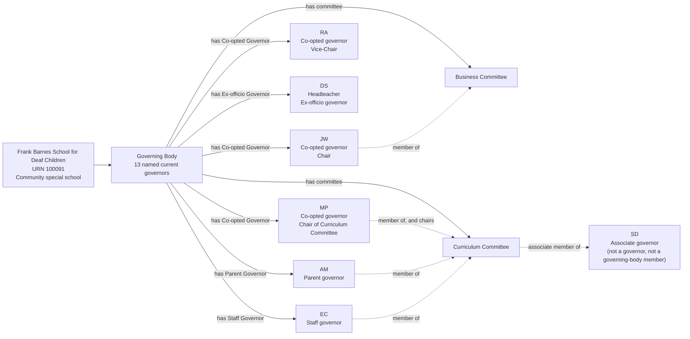
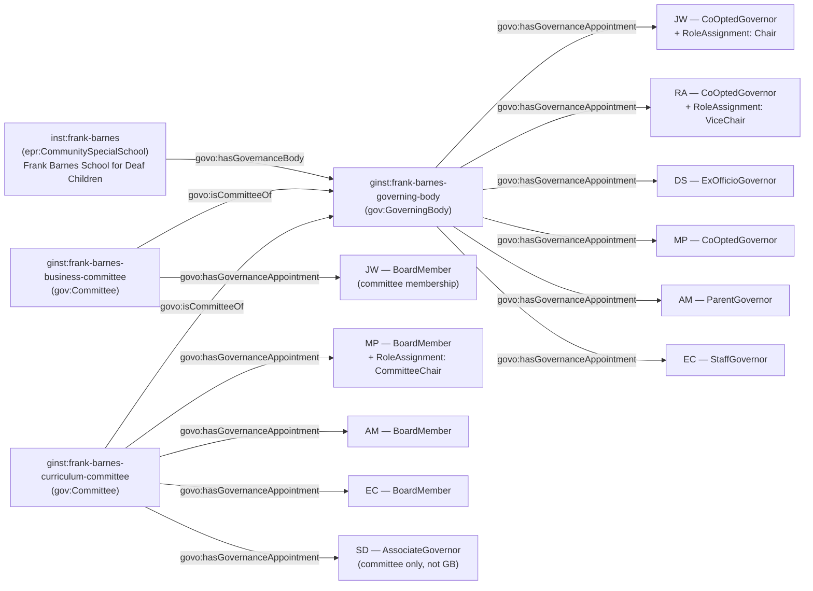

[← Worked examples](../)

# Governance Ontology — Frank Barnes School for Deaf Children example

| | |
|---|---|
| **School** | Frank Barnes School for Deaf Children — URN 100091 |
| **Establishment type** | Community special school (LA maintained) |
| **Governance ontology namespace** | `https://dfe-digital.github.io/education-provider-registry-docs/models/governance/ontology/` |
| **Governance vocabulary namespace** | `https://dfe-digital.github.io/education-provider-registry-docs/models/governance/vocabulary/` |
| **Preferred prefixes** | `govo:` (properties) · `gov:` (classes and named individuals) · `epr:`/`epro:` (reused from the main EPR ontology) |
| **OWL documentation** | [Governance ontology reference (WIDOCO)](../../ontology/) |
| **Source** | [governance-ontology.ttl](https://github.com/DFE-Digital/education-provider-registry-docs/blob/main/models/governance/governance-ontology.ttl) |
| **Repository** | [DFE-Digital/education-provider-registry-docs](https://github.com/DFE-Digital/education-provider-registry-docs) |
| **Licence** | [Open Government Licence v3.0](https://www.nationalarchives.gov.uk/doc/open-government-licence/version/3/) |

---

**Evidence and anonymisation.** This page is in two parts. **Section 1** is the real-world governance structure as documented in a bounded, sourced internal investigation ("Frank Barnes School for Deaf Children: governance model worked example") - what the school itself publishes, independent of any ontology. **Section 2** maps that same structure onto `governance-ontology.ttl`. Neither section is itself GIAS data, and the source investigation is not published in this repository.

Person names throughout are shown as initials, exactly as the source investigation anonymised them (e.g. `JW`, `RA`) - this example does not use, and has not gone back to, the school's full published names. Both sections show the same representative **subset** of governors, not the full roster - 13 named current governors are evidenced in the source, of a published board size of 14 - so that Section 1 and Section 2 stay directly comparable. Left out: 3 further co-opted governors (`MK`, `SG`, `JB`) and 3 further parent governors (`SS`, `JC`, `AHM`).

---

## Section 1 — The real-world governance structure

This section is the structure as evidenced, before any ontology is applied.

### Sources

| Source | Publisher | What it evidences | Observed |
|---|---|---|---|
| [Frank Barnes School — Governors](https://www.fbarnes.camden.sch.uk/governors) | Frank Barnes School for Deaf Children | Board size and composition, governor categories, roles, committees, terms and former governors | 27 July 2026 |
| [GIAS — Frank Barnes School for Deaf Children, URN 100091, Governance tab](https://www.get-information-schools.service.gov.uk/Establishments/Establishment/Details/100091#school-governance) | GIAS | Community special school classification, current GIDs, appointment routes and effective dates | 27 July 2026 |

The page says there are 14 governors, but the named current list contains 13 people in the captured page text. Former governors and their end dates are also published; those are historical and are not shown here as current memberships.

### Structure

Adapted from the source investigation's own instance-level mapping, trimmed to a representative subset of governors for readability - the same subset modelled in Section 2 below.



The diagram represents the real-world governing body, not registry records. URN `100091` is an identifier and evidence, not a model entity in its own right. `SD` is deliberately not connected to the Governing Body node: an Associate Governor is appointed to a committee only, may vote there only if the governing body grants it and only from age 18, and is not a governor or a governing-body member at all - see Example 5 in Section 2.

---

## Section 2 — Modelled in the governance ontology

The same governors, bodies and appointments from Section 1, expressed in Turtle using `governance-ontology.ttl` (`gov:`/`govo:`).

### Structure



### Namespace prefixes

All examples in this section use the following prefixes.

```
@prefix gov:   <https://dfe-digital.github.io/education-provider-registry-docs/models/governance/vocabulary/> .
@prefix govo:  <https://dfe-digital.github.io/education-provider-registry-docs/models/governance/ontology/> .
@prefix epr:   <https://dfe-digital.github.io/education-provider-registry-docs/models/establishment/vocabulary/> .
@prefix epro:  <https://dfe-digital.github.io/education-provider-registry-docs/models/establishment/ontology/> .
@prefix rdf:   <http://www.w3.org/1999/02/22-rdf-syntax-ns#> .
@prefix rdfs:  <http://www.w3.org/2000/01/rdf-schema#> .
@prefix owl:   <http://www.w3.org/2002/07/owl#> .
@prefix xsd:   <http://www.w3.org/2001/XMLSchema#> .
@prefix inst:  <https://dfe-digital.github.io/education-provider-registry-docs/establishment/> .
@prefix ginst: <https://dfe-digital.github.io/education-provider-registry-docs/models/governance/instance/> .
```

### Example 1 — Establishment and governing body identity

Frank Barnes is a single-establishment community special school, maintained by its local authority - there is no separate legal entity above it, unlike a MAT's Academy Trust. `epr:CommunitySpecialSchool` is reused directly from the main EPR ontology (the specific leaf type, not the generic `epr:Establishment` stub); `epro:hasEstablishmentIdentity` and `epro:identifiedByUrn` are reused unmodified from `establishment-ontology.ttl`.

```
inst:frank-barnes
    a epr:CommunitySpecialSchool ;
    rdfs:label "Frank Barnes School for Deaf Children"@en ;

    epro:hasEstablishmentIdentity [
        a epr:EstablishmentIdentity ;
        epro:identifiedByUrn [
            a epr:UniqueReferenceNumber ;
            rdfs:label "100091"
        ]
    ] .

ginst:frank-barnes-governing-body
    a gov:GoverningBody ;
    rdfs:label "Frank Barnes School for Deaf Children — Governing Body"@en .

inst:frank-barnes
    govo:hasGovernanceBody ginst:frank-barnes-governing-body .
```

### Example 2 — Governor appointments and their statutory appointing body

A maintained school's governor categories are set out directly in the School Governance (Constitution) (England) Regulations 2012 (SI 2012/1034) - co-opted, parent, staff and ex-officio (headteacher) governors. Unlike Medlock's Trust-specific Community Council Member categories, which had to be mapped onto the closest candidate `AppointingBody` values, these categories correspond directly to existing `GovernanceRoleType` and `AppointingBody` individuals with no guesswork.

```
ginst:person-jw
    a gov:GovernancePerson ;
    rdfs:label "JW"@en .

ginst:appointment-jw-governor
    a gov:GovernanceAppointment ;
    govo:appointmentOf ginst:person-jw ;
    govo:hasRoleType gov:CoOptedGovernor ;
    govo:hasAppointingBody gov:AppointedByGoverningBody ;
    govo:hasAppointmentBasis gov:StatutoryGovernanceAppointment .

ginst:frank-barnes-governing-body
    govo:hasGovernanceAppointment ginst:appointment-jw-governor .

ginst:person-ds
    a gov:GovernancePerson ;
    rdfs:label "DS"@en .

ginst:appointment-ds-governor
    a gov:GovernanceAppointment ;
    govo:appointmentOf ginst:person-ds ;
    govo:hasRoleType gov:ExOfficioGovernor ;
    govo:hasAppointingBody gov:ExOfficioAppointment ;
    govo:hasAppointmentBasis gov:StatutoryGovernanceAppointment ;
    rdfs:comment "DS is the headteacher, an ex-officio governor by virtue of holding that post - not a separately elected or appointed governance role."@en .

ginst:frank-barnes-governing-body
    govo:hasGovernanceAppointment ginst:appointment-ds-governor .

ginst:person-am
    a gov:GovernancePerson ;
    rdfs:label "AM"@en .

ginst:appointment-am-governor
    a gov:GovernanceAppointment ;
    govo:appointmentOf ginst:person-am ;
    govo:hasRoleType gov:ParentGovernor ;
    govo:hasAppointingBody gov:ElectedByParents ;
    govo:hasAppointmentBasis gov:StatutoryGovernanceAppointment .

ginst:frank-barnes-governing-body
    govo:hasGovernanceAppointment ginst:appointment-am-governor .

ginst:person-ec
    a gov:GovernancePerson ;
    rdfs:label "EC"@en .

ginst:appointment-ec-governor
    a gov:GovernanceAppointment ;
    govo:appointmentOf ginst:person-ec ;
    govo:hasRoleType gov:StaffGovernor ;
    govo:hasAppointingBody gov:ElectedByStaff ;
    govo:hasAppointmentBasis gov:StatutoryGovernanceAppointment .

ginst:frank-barnes-governing-body
    govo:hasGovernanceAppointment ginst:appointment-ec-governor .
```

*(3 further co-opted governors - `MK`, `SG`, `JB` - and 3 further parent governors - `SS`, `JC`, `AHM` - are evidenced in the source and not shown here.)*

### Example 3 — Chair and Vice-Chair, layered on the governing-body appointment

Chair and Vice-Chair of the governing body itself are responsibilities layered onto a governor's base appointment, not separate appointment types - the same `gov:RoleAssignment` + `govo:layeredOn` pattern used for Trust Board Chair/Vice-Chair at Medlock.

```
ginst:roleassignment-jw-chair
    a gov:RoleAssignment ;
    govo:layeredOn ginst:appointment-jw-governor ;
    govo:assignsRole gov:Chair .

ginst:person-ra
    a gov:GovernancePerson ;
    rdfs:label "RA"@en .

ginst:appointment-ra-governor
    a gov:GovernanceAppointment ;
    govo:appointmentOf ginst:person-ra ;
    govo:hasRoleType gov:CoOptedGovernor ;
    govo:hasAppointingBody gov:AppointedByGoverningBody ;
    govo:hasAppointmentBasis gov:StatutoryGovernanceAppointment .

ginst:frank-barnes-governing-body
    govo:hasGovernanceAppointment ginst:appointment-ra-governor .

ginst:roleassignment-ra-vicechair
    a gov:RoleAssignment ;
    govo:layeredOn ginst:appointment-ra-governor ;
    govo:assignsRole gov:ViceChair .
```

### Example 4 — Committees, committee membership and Committee Chair

Business and Curriculum Committee are committees of the governing body (`govo:isCommitteeOf`), not separate governance bodies with their own scope. Committee membership is modelled as a second, distinct `GovernanceAppointment` for the same person, attached to the committee rather than the governing body - mirroring how Medlock modelled Academy Community Council membership as separate from Trust Board membership. No `GovernanceRoleType` individual exists specifically for "committee member" (the closest is the generic `gov:BoardMember`); this is a **Candidate** mapping.

`gov:CommitteeChair` is layered onto the **committee-membership appointment**, not the governing-body appointment - distinguishing "chairs this committee" from "chairs the whole governing body" (Example 3).

```
ginst:person-mp
    a gov:GovernancePerson ;
    rdfs:label "MP"@en .

ginst:appointment-mp-governor
    a gov:GovernanceAppointment ;
    govo:appointmentOf ginst:person-mp ;
    govo:hasRoleType gov:CoOptedGovernor ;
    govo:hasAppointingBody gov:AppointedByGoverningBody ;
    govo:hasAppointmentBasis gov:StatutoryGovernanceAppointment .

ginst:frank-barnes-governing-body
    govo:hasGovernanceAppointment ginst:appointment-mp-governor .

ginst:frank-barnes-business-committee
    a gov:Committee ;
    rdfs:label "Frank Barnes School — Business Committee"@en ;
    govo:isCommitteeOf ginst:frank-barnes-governing-body .

ginst:frank-barnes-curriculum-committee
    a gov:Committee ;
    rdfs:label "Frank Barnes School — Curriculum Committee"@en ;
    govo:isCommitteeOf ginst:frank-barnes-governing-body .

ginst:appointment-jw-businesscommittee
    a gov:GovernanceAppointment ;
    govo:appointmentOf ginst:person-jw ;
    govo:hasRoleType gov:BoardMember ;
    govo:hasAppointmentBasis gov:StatutoryGovernanceAppointment ;
    rdfs:comment "Committee membership, distinct from JW's governing-body appointment. gov:BoardMember is the closest existing candidate value - no committee-member-specific role type exists."@en .

ginst:frank-barnes-business-committee
    govo:hasGovernanceAppointment ginst:appointment-jw-businesscommittee .

ginst:appointment-mp-curriculumcommittee
    a gov:GovernanceAppointment ;
    govo:appointmentOf ginst:person-mp ;
    govo:hasRoleType gov:BoardMember ;
    govo:hasAppointmentBasis gov:StatutoryGovernanceAppointment ;
    rdfs:comment "Committee membership, distinct from MP's governing-body appointment. gov:BoardMember is the closest existing candidate value."@en .

ginst:frank-barnes-curriculum-committee
    govo:hasGovernanceAppointment ginst:appointment-mp-curriculumcommittee .

ginst:roleassignment-mp-committeechair
    a gov:RoleAssignment ;
    govo:layeredOn ginst:appointment-mp-curriculumcommittee ;
    govo:assignsRole gov:CommitteeChair ;
    rdfs:comment "MP chairs the Curriculum Committee - layered onto MP's committee-membership appointment, not the governing-body appointment, so this role is scoped to the committee rather than the whole governing body."@en .

ginst:appointment-am-curriculumcommittee
    a gov:GovernanceAppointment ;
    govo:appointmentOf ginst:person-am ;
    govo:hasRoleType gov:BoardMember ;
    govo:hasAppointmentBasis gov:StatutoryGovernanceAppointment .

ginst:frank-barnes-curriculum-committee
    govo:hasGovernanceAppointment ginst:appointment-am-curriculumcommittee .

ginst:appointment-ec-curriculumcommittee
    a gov:GovernanceAppointment ;
    govo:appointmentOf ginst:person-ec ;
    govo:hasRoleType gov:BoardMember ;
    govo:hasAppointmentBasis gov:StatutoryGovernanceAppointment .

ginst:frank-barnes-curriculum-committee
    govo:hasGovernanceAppointment ginst:appointment-ec-curriculumcommittee .
```

### Example 5 — Associate governor

`SD` is published as an Associate Governor. School Governance (Constitution) (England) Regulations 2012 (SI 2012/1034), reg 12, defines an associate member as *"a person who is appointed by the governing body as a member of any committee established by them but who is not a governor"* - a different capacity from `gov:BoardMember`, used above for plain committee membership, and from every full governor category in Example 2: an Associate is explicitly not a governor and never holds a position at the governing body itself. Consequently `SD`'s appointment attaches only to the Curriculum Committee - there is no corresponding `ginst:frank-barnes-governing-body govo:hasGovernanceAppointment` triple for `SD`, unlike every other governor in this example.

```
ginst:person-sd
    a gov:GovernancePerson ;
    rdfs:label "SD"@en .

ginst:appointment-sd-associate
    a gov:GovernanceAppointment ;
    govo:appointmentOf ginst:person-sd ;
    govo:hasRoleType gov:AssociateGovernor ;
    govo:hasAppointingBody gov:AppointedByGoverningBody ;
    govo:hasAppointmentBasis gov:StatutoryGovernanceAppointment ;
    rdfs:comment "Associate Governor: appointed to the Curriculum Committee only, not to the Governing Body - School Governance (Constitution) (England) Regulations 2012 reg 12 excludes an associate member from being a governor. Any vote is limited to committee business the governing body specifically grants (SI 2013/1624 reg 24), and only from age 18 - neither of which this ontology attempts to constrain structurally; both are recorded here only as narrative evidence."@en .

ginst:frank-barnes-curriculum-committee
    govo:hasGovernanceAppointment ginst:appointment-sd-associate .
```

Any vote by an Associate Governor is limited to committee business the governing body specifically grants (SI 2013/1624 reg 24), and only from age 18 - neither restriction is enforced structurally by the ontology; both are recorded only as narrative evidence in the `rdfs:comment` above.

---

## Concept coverage

| Real-world concept | Frank Barnes evidence | Ontology mapping | Fit |
|---|---|---|---|
| Establishment (community special school) | Frank Barnes School for Deaf Children, URN 100091 | `epr:CommunitySpecialSchool` | Direct - reused leaf type from the main EPR ontology |
| Governing Body | The statutory governing body | `gov:GoverningBody` | Direct |
| Governor categories | Co-opted, parent, staff, ex-officio (headteacher) | `govo:hasRoleType` (`gov:CoOptedGovernor`, `gov:ParentGovernor`, `gov:StaffGovernor`, `gov:ExOfficioGovernor`) | Direct |
| Appointing body / route | Co-option, parent election, staff election, ex officio | `govo:hasAppointingBody` (`gov:AppointedByGoverningBody`, `gov:ElectedByParents`, `gov:ElectedByStaff`, `gov:ExOfficioAppointment`) | Direct - SI 2012/1034 categories map without guesswork, unlike Medlock's Trust-specific Community Council Member categories |
| Chair / Vice-Chair of the governing body | JW, RA | `gov:RoleAssignment` + `govo:layeredOn` (governing-body appointment) + `govo:assignsRole` (`gov:Chair`, `gov:ViceChair`) | Direct |
| Committee | Business Committee, Curriculum Committee | `gov:Committee` + `govo:isCommitteeOf` | Direct |
| Committee membership | JW, MP, AM, EC | `gov:GovernanceAppointment` (`govo:hasRoleType gov:BoardMember`), attached to the committee | Candidate - no committee-member-specific role type exists |
| Committee Chair | MP (Curriculum Committee) | `gov:RoleAssignment` + `govo:layeredOn` (committee-membership appointment) + `govo:assignsRole gov:CommitteeChair` | Direct |
| Associate governor | SD | `gov:GovernanceAppointment` (`govo:hasRoleType gov:AssociateGovernor`), attached only to the Curriculum Committee, never to the Governing Body | Direct. Committee-only voting and the age-18 restriction (SI 2013/1624 reg 24) are recorded as narrative evidence only, not enforced structurally |
| Governance professional / Clerk | Not named on the published page | Not modelled | Not evidenced |
| Historical governance | Former governors and past terms are published | Not modelled (current membership only) | Out of scope - current membership only, per this example's methodology |

---

**See also:** [Governance vocabulary](../../vocabulary/) · [Governance taxonomy](../../taxonomy/) · [Governance ontology](../../ontology/) · [Governance ontology graph viewer](../../ontology/webvowl/)
