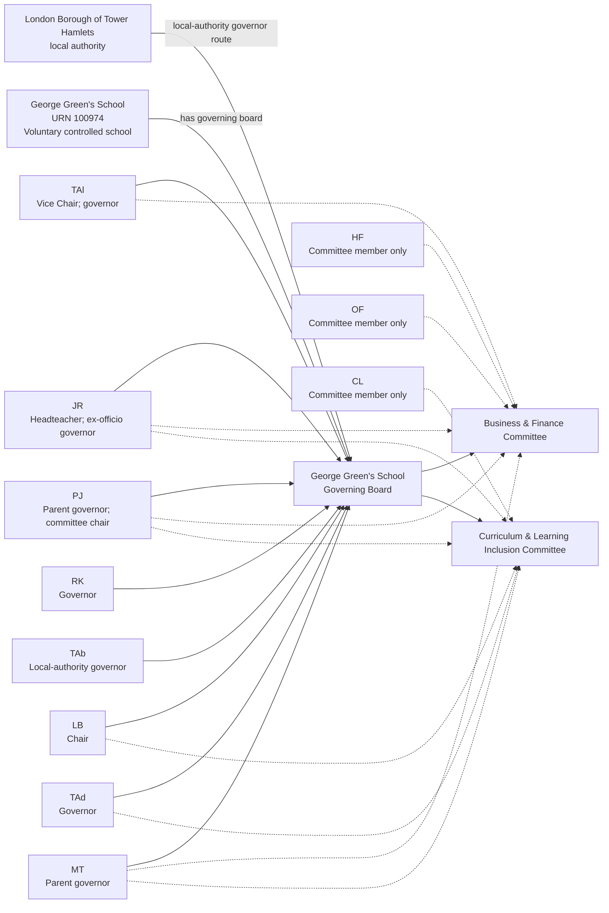
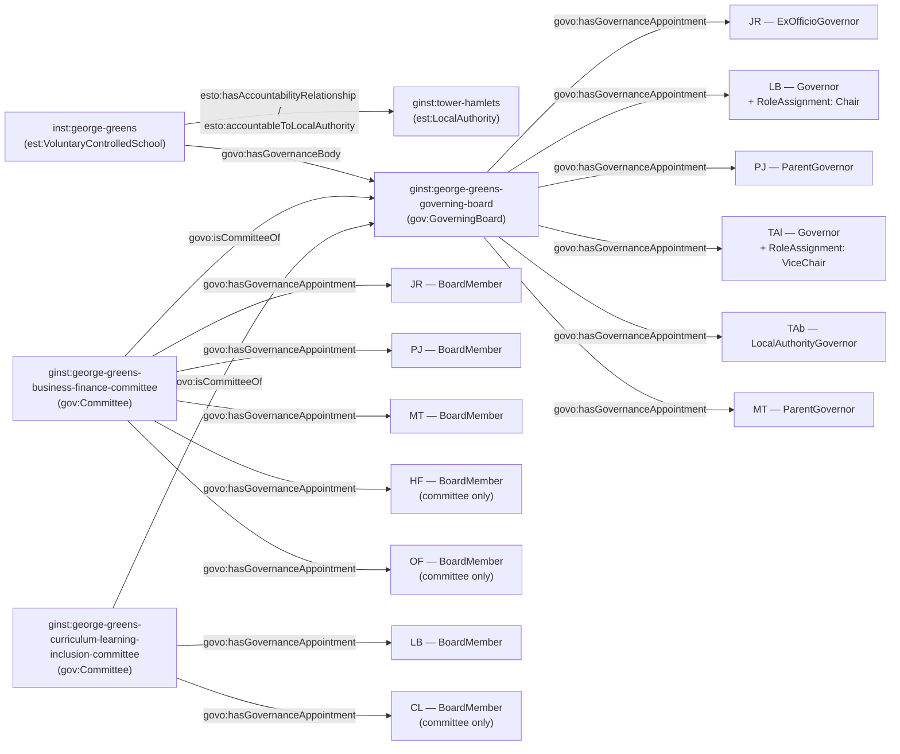

[← Worked examples](../)

# Governance Ontology — George Green's School example

| | |
|---|---|
| **School** | George Green's School — URN 100974 |
| **Local Authority** | London Borough of Tower Hamlets |
| **Establishment type** | Voluntary controlled school |
| **Governance ontology namespace** | `https://dfe-digital.github.io/education-provider-registry-docs/models/governance/ontology/` |
| **Governance vocabulary namespace** | `https://dfe-digital.github.io/education-provider-registry-docs/models/governance/vocabulary/` |
| **Preferred prefixes** | `govo:` (properties) · `gov:` (classes and named individuals) · `est:`/`esto:` (reused from the main EPR ontology) |
| **OWL documentation** | [Governance ontology reference (WIDOCO)](../../ontology/) |
| **Source** | [governance-ontology.ttl](https://github.com/DFE-Digital/education-provider-registry-docs/blob/main/models/governance/governance-ontology.ttl) |
| **Repository** | [DFE-Digital/education-provider-registry-docs](https://github.com/DFE-Digital/education-provider-registry-docs) |
| **Licence** | [Open Government Licence v3.0](https://www.nationalarchives.gov.uk/doc/open-government-licence/version/3/) |

---

**Evidence and anonymisation.** This page is in two parts. **Section 1** is the real-world governance structure as documented in a bounded, sourced internal investigation ("George Green's School: governance model worked example") - what the school itself publishes, independent of any ontology. **Section 2** maps that same structure onto `governance-ontology.ttl`. Neither section is itself GIAS data, and the source investigation is not published in this repository.

Person names throughout are shown as initials, exactly as the source investigation anonymised them. All 8 published board members and 3 committee-only participants are shown in both sections; nothing is trimmed for this example.

---

## Section 1 — The real-world governance structure

This section is the structure as evidenced, before any ontology is applied.

### Sources

| Source | Publisher | What it evidences | Observed |
|---|---|---|---|
| [George Green's School — Governing Board Membership](https://www.georgegreens.com/about-us/governance/governing-board-membership?pid=187) | George Green's School | Published board membership, chair/vice-chair labels and committee membership lists | 27 July 2026 |
| [GIAS — George Green's School, URN 100974, Governance tab](https://www.get-information-schools.service.gov.uk/Establishments/Establishment/Details/100974#school-governance) | GIAS | Voluntary controlled school classification, current people, GIDs, appointment routes and effective dates | 27 July 2026 |

GIAS is substantially representative of the published population, but the two populations aren't identical: `WR` appears only in GIAS, and `TAd` only on the school's own page. GIAS's current rows identify no Chair or Vice-Chair at all, though the school page names `LB` as Chair, `TAl` as Vice Chair, and `PJ` as a committee chair. Committee membership is absent from GIAS entirely.

### Structure

Adapted from the source investigation's own instance-level mapping.



The diagram represents the real-world governing board, not registry records. URN `100974` is an identifier and evidence, not a model entity in its own right. `HF`, `OF` and `CL` are published in committee lists but not in the top-level board list - the page does not state whether they are full governors, so no board membership is inferred for them, the same treatment as Vauxhall Primary's `LBu`/`VP`. The page says `PJ` is "a committee chair" without stating which of the two committees, even though `PJ` sits on both.

---

## Section 2 — Modelled in the governance ontology

The same people, bodies and appointments from Section 1, expressed in Turtle using `governance-ontology.ttl` (`gov:`/`govo:`).

### Structure



### Namespace prefixes

All examples in this section use the following prefixes.

```
@prefix gov:   <https://dfe-digital.github.io/education-provider-registry-docs/models/governance/vocabulary/> .
@prefix govo:  <https://dfe-digital.github.io/education-provider-registry-docs/models/governance/ontology/> .
@prefix est:   <https://dfe-digital.github.io/education-provider-registry-docs/models/establishment/vocabulary/> .
@prefix esto:  <https://dfe-digital.github.io/education-provider-registry-docs/models/establishment/ontology/> .
@prefix rdf:   <http://www.w3.org/1999/02/22-rdf-syntax-ns#> .
@prefix rdfs:  <http://www.w3.org/2000/01/rdf-schema#> .
@prefix owl:   <http://www.w3.org/2002/07/owl#> .
@prefix xsd:   <http://www.w3.org/2001/XMLSchema#> .
@prefix inst:  <https://dfe-digital.github.io/education-provider-registry-docs/establishment/> .
@prefix ginst: <https://dfe-digital.github.io/education-provider-registry-docs/models/governance/instance/> .
```

### Example 1 — Establishment, Local Authority accountability and Governing Board identity

The same LA-accountability pattern as Gilded Hollins, Millfield and Aldgate. This school calls its governing body a "Governing Board" - `gov:GoverningBoard` exists precisely for this ("Alternative term for GoverningBody, used in some GIAS and product surfaces"), and had never been used by any worked example on this site until now.

```
ginst:tower-hamlets
    a est:LocalAuthority ;
    rdfs:label "London Borough of Tower Hamlets"@en .

inst:george-greens
    a est:VoluntaryControlledSchool ;
    rdfs:label "George Green's School"@en ;

    esto:hasEstablishmentIdentity [
        a est:EstablishmentIdentity ;
        esto:identifiedByUrn [
            a est:UniqueReferenceNumber ;
            rdf:value "100974"^^xsd:positiveInteger
        ]
    ] ;

    esto:hasAccountabilityRelationship [
        a est:EstablishmentAccountability ;
        esto:accountableToLocalAuthority ginst:tower-hamlets
    ] .

ginst:george-greens-governing-board
    a gov:GoverningBoard ;
    rdfs:label "George Green's School — Governing Board"@en .

inst:george-greens
    govo:hasGovernanceBody ginst:george-greens-governing-board .
```

### Example 2 — Headteacher, Chair and Vice-Chair, with no stated category

`LB` (Chair) and `TAl` (Vice-Chair) are both published with no more specific governor category - the same evidence gap as Manor High's `JJ` and Aldgate's absent categories, handled the same way: the generic `gov:Governor` value, appointing body omitted.

```
ginst:person-jr
    a gov:GovernancePerson ;
    rdfs:label "JR"@en .

ginst:appointment-jr-governor
    a gov:GovernanceAppointment ;
    govo:appointmentOf ginst:person-jr ;
    govo:hasRoleType gov:ExOfficioGovernor ;
    govo:hasAppointingBody gov:ExOfficioAppointment ;
    govo:hasAppointmentBasis gov:StatutoryGovernanceAppointment ;
    rdfs:comment "Headteacher - ex-officio governor by virtue of that post."@en .

ginst:george-greens-governing-board
    govo:hasGovernanceAppointment ginst:appointment-jr-governor .

ginst:person-lb
    a gov:GovernancePerson ;
    rdfs:label "LB"@en .

ginst:appointment-lb-governor
    a gov:GovernanceAppointment ;
    govo:appointmentOf ginst:person-lb ;
    govo:hasRoleType gov:Governor ;
    govo:hasAppointmentBasis gov:StatutoryGovernanceAppointment ;
    rdfs:comment "Published only as 'Governor' - no more specific category given."@en .

ginst:george-greens-governing-board
    govo:hasGovernanceAppointment ginst:appointment-lb-governor .

ginst:roleassignment-lb-chair
    a gov:RoleAssignment ;
    govo:layeredOn ginst:appointment-lb-governor ;
    govo:assignsRole gov:Chair ;
    rdfs:comment "GIAS identifies no Chair at all in its current rows - the Chair responsibility is taken from the school's own page, not inferred absent from GIAS."@en .

ginst:person-tal
    a gov:GovernancePerson ;
    rdfs:label "TAl"@en .

ginst:appointment-tal-governor
    a gov:GovernanceAppointment ;
    govo:appointmentOf ginst:person-tal ;
    govo:hasRoleType gov:Governor ;
    govo:hasAppointmentBasis gov:StatutoryGovernanceAppointment ;
    rdfs:comment "Published only as 'Governor' - no more specific category given."@en .

ginst:george-greens-governing-board
    govo:hasGovernanceAppointment ginst:appointment-tal-governor .

ginst:roleassignment-tal-vicechair
    a gov:RoleAssignment ;
    govo:layeredOn ginst:appointment-tal-governor ;
    govo:assignsRole gov:ViceChair .
```

### Example 3 — Parent, Local Authority governors and an unresolved committee chair

`PJ` is described as "a committee chair" without the page stating which of the two committees `PJ` sits on - `PJ` is a member of both. Rather than guessing, no `gov:CommitteeChair` `RoleAssignment` is asserted for `PJ` at all; `PJ`'s committee memberships are modelled in Example 5 with the ambiguity noted directly.

```
ginst:person-pj
    a gov:GovernancePerson ;
    rdfs:label "PJ"@en .

ginst:appointment-pj-governor
    a gov:GovernanceAppointment ;
    govo:appointmentOf ginst:person-pj ;
    govo:hasRoleType gov:ParentGovernor ;
    govo:hasAppointingBody gov:ElectedByParents ;
    govo:hasAppointmentBasis gov:StatutoryGovernanceAppointment .

ginst:george-greens-governing-board
    govo:hasGovernanceAppointment ginst:appointment-pj-governor .

ginst:person-tab
    a gov:GovernancePerson ;
    rdfs:label "TAb"@en .

ginst:appointment-tab-governor
    a gov:GovernanceAppointment ;
    govo:appointmentOf ginst:person-tab ;
    govo:hasRoleType gov:LocalAuthorityGovernor ;
    govo:hasAppointingBody gov:AppointedByLocalAuthority ;
    govo:hasAppointmentBasis gov:StatutoryGovernanceAppointment .

ginst:george-greens-governing-board
    govo:hasGovernanceAppointment ginst:appointment-tab-governor .

ginst:person-mt
    a gov:GovernancePerson ;
    rdfs:label "MT"@en .

ginst:appointment-mt-governor
    a gov:GovernanceAppointment ;
    govo:appointmentOf ginst:person-mt ;
    govo:hasRoleType gov:ParentGovernor ;
    govo:hasAppointingBody gov:ElectedByParents ;
    govo:hasAppointmentBasis gov:StatutoryGovernanceAppointment .

ginst:george-greens-governing-board
    govo:hasGovernanceAppointment ginst:appointment-mt-governor .
```

### Example 4 — A generic governor not shown on the shared subset

`RK` and `TAd` are published governors with no more specific category and no committee membership shown, holding no other responsibilities - simple base appointments.

```
ginst:person-rk
    a gov:GovernancePerson ;
    rdfs:label "RK"@en .

ginst:appointment-rk-governor
    a gov:GovernanceAppointment ;
    govo:appointmentOf ginst:person-rk ;
    govo:hasRoleType gov:Governor ;
    govo:hasAppointmentBasis gov:StatutoryGovernanceAppointment ;
    rdfs:comment "Published only as 'Governor' - no more specific category given."@en .

ginst:george-greens-governing-board
    govo:hasGovernanceAppointment ginst:appointment-rk-governor .

ginst:person-tad
    a gov:GovernancePerson ;
    rdfs:label "TAd"@en .

ginst:appointment-tad-governor
    a gov:GovernanceAppointment ;
    govo:appointmentOf ginst:person-tad ;
    govo:hasRoleType gov:Governor ;
    govo:hasAppointmentBasis gov:StatutoryGovernanceAppointment ;
    rdfs:comment "Published only as 'Governor' - no more specific category given. Evidenced only on the school's own page, not in GIAS."@en .

ginst:george-greens-governing-board
    govo:hasGovernanceAppointment ginst:appointment-tad-governor .
```

### Example 5 — Committees, dual memberships and committee-only members

`JR`, `PJ` and `MT` each hold a second, committee-level appointment in addition to their base board appointment - the established dual-appointment pattern. `HF`, `OF` and `CL` hold **only** a committee-level appointment, with no base Governing Board appointment at all - the same pattern first seen at Vauxhall Primary's `LBu`/`VP`, confirmed here a second time.

```
ginst:george-greens-business-finance-committee
    a gov:Committee ;
    rdfs:label "George Green's School — Business & Finance Committee"@en ;
    govo:isCommitteeOf ginst:george-greens-governing-board .

ginst:george-greens-curriculum-learning-inclusion-committee
    a gov:Committee ;
    rdfs:label "George Green's School — Curriculum & Learning Inclusion Committee"@en ;
    govo:isCommitteeOf ginst:george-greens-governing-board .

ginst:appointment-jr-committee
    a gov:GovernanceAppointment ;
    govo:appointmentOf ginst:person-jr ;
    govo:hasRoleType gov:BoardMember ;
    govo:hasAppointmentBasis gov:StatutoryGovernanceAppointment ;
    rdfs:comment "JR's committee-level appointment to Business & Finance, distinct from JR's Governing Board appointment (Example 2). JR also sits on Curriculum & Learning Inclusion - not modelled separately here for brevity, but evidenced in the source."@en .

ginst:george-greens-business-finance-committee
    govo:hasGovernanceAppointment ginst:appointment-jr-committee .

ginst:appointment-pj-committee
    a gov:GovernanceAppointment ;
    govo:appointmentOf ginst:person-pj ;
    govo:hasRoleType gov:BoardMember ;
    govo:hasAppointmentBasis gov:StatutoryGovernanceAppointment ;
    rdfs:comment "PJ's committee-level appointment to Business & Finance - PJ also sits on Curriculum & Learning Inclusion. The page describes PJ as 'a committee chair' without stating which; no gov:CommitteeChair RoleAssignment is asserted on either appointment rather than guessing."@en .

ginst:george-greens-business-finance-committee
    govo:hasGovernanceAppointment ginst:appointment-pj-committee .

ginst:appointment-mt-committee
    a gov:GovernanceAppointment ;
    govo:appointmentOf ginst:person-mt ;
    govo:hasRoleType gov:BoardMember ;
    govo:hasAppointmentBasis gov:StatutoryGovernanceAppointment ;
    rdfs:comment "MT's committee-level appointment to Business & Finance - MT also sits on Curriculum & Learning Inclusion, not modelled separately here for brevity."@en .

ginst:george-greens-business-finance-committee
    govo:hasGovernanceAppointment ginst:appointment-mt-committee .

ginst:appointment-lb-committee
    a gov:GovernanceAppointment ;
    govo:appointmentOf ginst:person-lb ;
    govo:hasRoleType gov:BoardMember ;
    govo:hasAppointmentBasis gov:StatutoryGovernanceAppointment ;
    rdfs:comment "LB's committee-level appointment to Curriculum & Learning Inclusion, distinct from LB's Governing Board appointment (Example 2)."@en .

ginst:george-greens-curriculum-learning-inclusion-committee
    govo:hasGovernanceAppointment ginst:appointment-lb-committee .

ginst:person-hf
    a gov:GovernancePerson ;
    rdfs:label "HF"@en .

ginst:appointment-hf-committee
    a gov:GovernanceAppointment ;
    govo:appointmentOf ginst:person-hf ;
    govo:hasRoleType gov:BoardMember ;
    govo:hasAppointmentBasis gov:StatutoryGovernanceAppointment ;
    rdfs:comment "Committee member only - HF holds no base appointment on the Governing Board itself."@en .

ginst:george-greens-business-finance-committee
    govo:hasGovernanceAppointment ginst:appointment-hf-committee .

ginst:person-of
    a gov:GovernancePerson ;
    rdfs:label "OF"@en .

ginst:appointment-of-committee
    a gov:GovernanceAppointment ;
    govo:appointmentOf ginst:person-of ;
    govo:hasRoleType gov:BoardMember ;
    govo:hasAppointmentBasis gov:StatutoryGovernanceAppointment ;
    rdfs:comment "Committee member only, the same pattern as HF."@en .

ginst:george-greens-business-finance-committee
    govo:hasGovernanceAppointment ginst:appointment-of-committee .

ginst:person-cl
    a gov:GovernancePerson ;
    rdfs:label "CL"@en .

ginst:appointment-cl-committee
    a gov:GovernanceAppointment ;
    govo:appointmentOf ginst:person-cl ;
    govo:hasRoleType gov:BoardMember ;
    govo:hasAppointmentBasis gov:StatutoryGovernanceAppointment ;
    rdfs:comment "Committee member only, on Curriculum & Learning Inclusion."@en .

ginst:george-greens-curriculum-learning-inclusion-committee
    govo:hasGovernanceAppointment ginst:appointment-cl-committee .
```

---

## Concept coverage

| Real-world concept | George Green's evidence | Ontology mapping | Fit |
|---|---|---|---|
| Voluntary controlled school | George Green's School, URN 100974 | `est:VoluntaryControlledSchool` | Direct |
| Maintaining Local Authority | London Borough of Tower Hamlets | `est:LocalAuthority` + `esto:hasAccountabilityRelationship` + `esto:accountableToLocalAuthority` | Direct |
| Governing Board | The statutory governing body, published under this name | `gov:GoverningBoard` + `govo:hasGovernanceBody` | Direct - first use of this synonym class on this site |
| Governor categories | Ex-officio headteacher, Parent, Local Authority | `govo:hasRoleType` (`gov:ExOfficioGovernor`, `gov:ParentGovernor`, `gov:LocalAuthorityGovernor`) | Direct |
| Governors with no stated category | LB, TAl, RK, TAd | `govo:hasRoleType gov:Governor` (generic) | Candidate |
| Chair / Vice-Chair | LB (Chair), TAl (Vice-Chair) | `gov:RoleAssignment` + `govo:assignsRole` (`gov:Chair`, `gov:ViceChair`) | Direct |
| Committees | Business & Finance, Curriculum & Learning Inclusion | `gov:Committee` + `govo:isCommitteeOf` | Direct |
| Committee membership, including committee-only participants | JR, PJ, MT, LB (dual); HF, OF, CL (committee only) | `gov:GovernanceAppointment` (`govo:hasRoleType gov:BoardMember`) | Candidate |
| Ambiguous committee chair | PJ, "a committee chair", committee unspecified | Not modelled - no `gov:CommitteeChair` `RoleAssignment` asserted | Not evidenced - which committee is unclear |
| Governance professional | Not clearly identified in this investigation | Not modelled | Not evidenced |

---

**See also:** [Governance vocabulary](../../vocabulary/) · [Governance taxonomy](../../taxonomy/) · [Governance ontology](../../ontology/) · [Governance ontology graph viewer](../../ontology/webvowl/)
