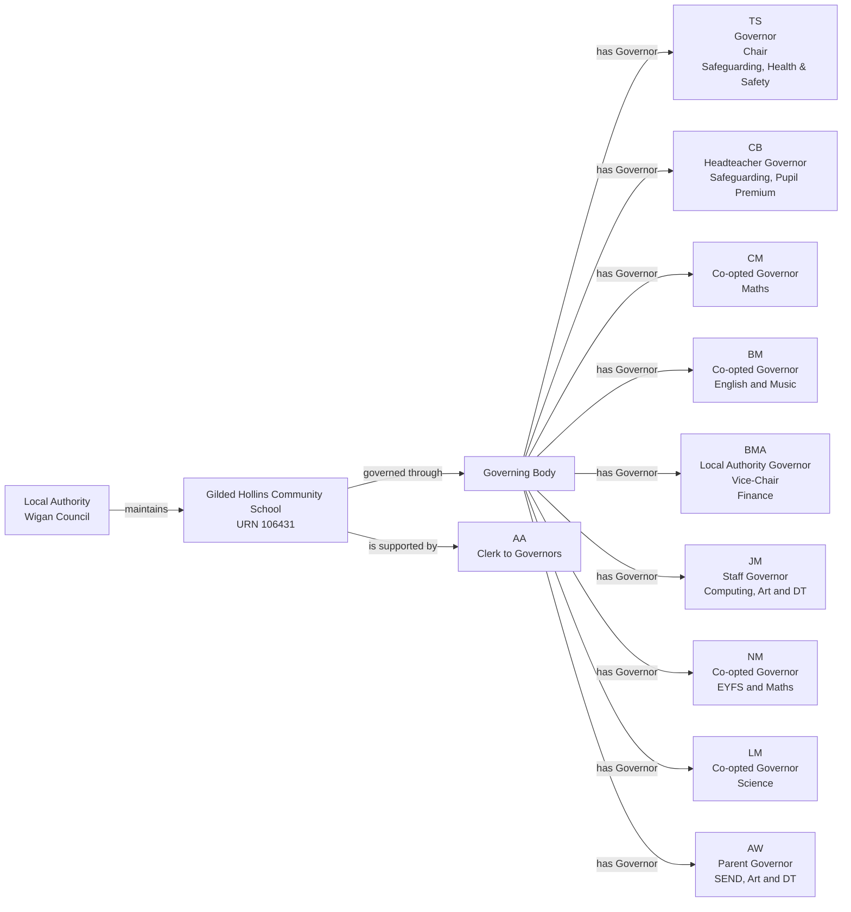
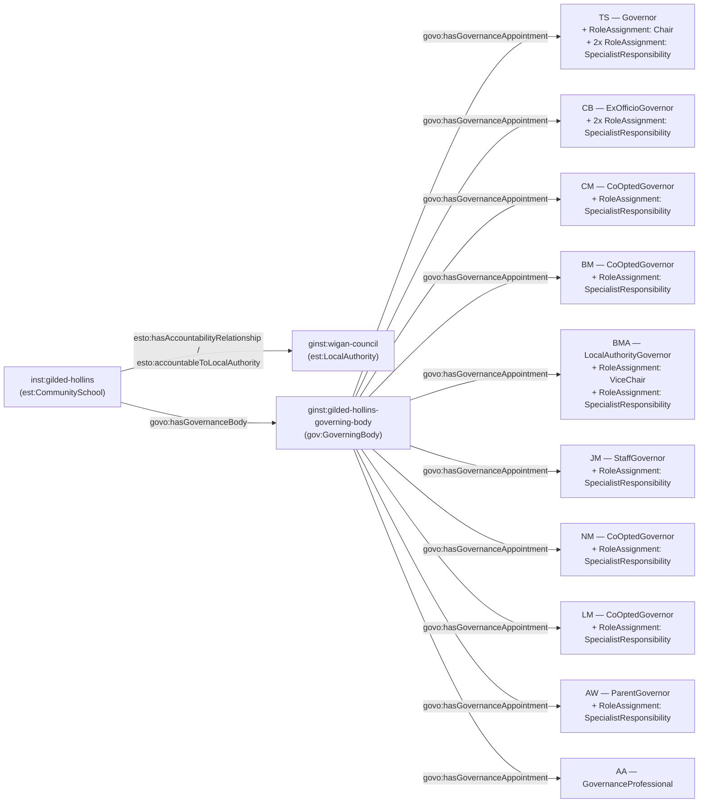

[← Worked examples](../)

# Governance Ontology — Gilded Hollins Community School example

| | |
|---|---|
| **School** | Gilded Hollins Community School — URN 106431 |
| **Local Authority** | Wigan Council |
| **Establishment type** | Community school (LA maintained) |
| **Governance ontology namespace** | `https://dfe-digital.github.io/education-provider-registry-docs/models/governance/ontology/` |
| **Governance vocabulary namespace** | `https://dfe-digital.github.io/education-provider-registry-docs/models/governance/vocabulary/` |
| **Preferred prefixes** | `govo:` (properties) · `gov:` (classes and named individuals) · `est:`/`esto:` (reused from the main EPR ontology) |
| **OWL documentation** | [Governance ontology reference (WIDOCO)](../../ontology/) |
| **Source** | [governance-ontology.ttl](https://github.com/DFE-Digital/education-provider-registry-docs/blob/main/models/governance/governance-ontology.ttl) |
| **Repository** | [DFE-Digital/education-provider-registry-docs](https://github.com/DFE-Digital/education-provider-registry-docs) |
| **Licence** | [Open Government Licence v3.0](https://www.nationalarchives.gov.uk/doc/open-government-licence/version/3/) |

---

**Evidence and anonymisation.** This page is in two parts. **Section 1** is the real-world governance structure as documented in a bounded, sourced internal investigation ("Governance Model With Worked LA-Maintained Community School Example: Gilded Hollins Community School") - what the school itself publishes, independent of any ontology. **Section 2** maps that same structure onto `governance-ontology.ttl`. Neither section is itself GIAS data, and the source investigation is not published in this repository.

Person names throughout are shown as initials, exactly as the source investigation anonymised them (e.g. `TS`, `CB`) - this example does not use, and has not gone back to, the school's full published names. All 9 governors on the school's published roster and its Clerk are shown in both sections; nothing is trimmed for this example.

The school's published roster is explicitly labelled `Governors 2024-2025` - a dated, time-qualified account, not asserted as the current July 2026 position. GIAS's own current records differ: it shows two current Parent Governors not on the dated school roster, and records `AW` (on the school roster) as historic. Both sources are kept as separately time-qualified assertions in this example, neither replacing the other.

---

## Section 1 — The real-world governance structure

This section is the structure as evidenced, before any ontology is applied.

### Sources

| Source | Publisher | What it evidences | Observed |
|---|---|---|---|
| [Meet the Governors](https://www.gildedhollins.wigan.sch.uk/meet-the-governors/) | Gilded Hollins Community School | `Governors 2024-2025` roster, governor categories, Chair and Vice-Chair roles, stated responsibilities, Clerk attendance | 27 July 2026 |
| [GIAS Governance: Gilded Hollins Community School, URN 106431](https://www.get-information-schools.service.gov.uk/Establishments/Establishment/Details/106431#school-governance) | GIAS | Open community-school status, Wigan Local Authority, current Chair and Governor records, appointment routes, dates and historic records | 27 July 2026 |

### Structure

Adapted from the source investigation's own instance-level mapping.



The diagram represents the real-world governing body, not registry records. URN `106431` is an identifier and evidence, not a model entity in its own right. `TS` is published only as "Governor" with no more specific category given, beyond holding the Chair responsibility.

---

## Section 2 — Modelled in the governance ontology

The same governors, bodies and appointments from Section 1, expressed in Turtle using `governance-ontology.ttl` (`gov:`/`govo:`).

### Structure



### Namespace prefixes

All examples in this section use the following prefixes.

```
@prefix gov:   <https://dfe-digital.github.io/education-provider-registry-docs/models/governance/vocabulary/> .
@prefix govo:  <https://dfe-digital.github.io/education-provider-registry-docs/models/governance/ontology/> .
@prefix est:   <https://dfe-digital.github.io/education-provider-registry-docs/models/establishment/vocabulary/> .
@prefix esto:  <https://dfe-digital.github.io/education-provider-registry-docs/models/establishment/ontology/> .
@prefix rdf:   <http://www.w3.org/1999/02/22-rdf-syntax-ns#> .
@prefix rdfs:  <http://www.w3.org/2000/01/rdf-schema#> .
@prefix owl:   <http://www.w3.org/2002/07/owl#> .
@prefix xsd:   <http://www.w3.org/2001/XMLSchema#> .
@prefix inst:  <https://dfe-digital.github.io/education-provider-registry-docs/establishment/> .
@prefix ginst: <https://dfe-digital.github.io/education-provider-registry-docs/models/governance/instance/> .
```

### Example 1 — Establishment, Local Authority accountability and Governing Body identity

`est:CommunitySchool` is the specific leaf type. The Local Authority relationship is modelled with `esto:hasAccountabilityRelationship` and `esto:accountableToLocalAuthority` - properties reused unmodified from `establishment-ontology.ttl`, explicitly documented there as "present for LA-maintained schools." None of the six previous worked examples needed this pattern (Medlock, Manor High and St Paul's are academies accountable to their Trust; Frank Barnes, Eileen Wade/Milton Ernest, Long Ditton and Vauxhall Primary all left the maintaining authority out of scope) - this is the first to exercise it.

```
ginst:wigan-council
    a est:LocalAuthority ;
    rdfs:label "Wigan Council"@en .

inst:gilded-hollins
    a est:CommunitySchool ;
    rdfs:label "Gilded Hollins Community School"@en ;

    esto:hasEstablishmentIdentity [
        a est:EstablishmentIdentity ;
        esto:identifiedByUrn [
            a est:UniqueReferenceNumber ;
            rdf:value "106431"^^xsd:positiveInteger
        ]
    ] ;

    esto:hasAccountabilityRelationship [
        a est:EstablishmentAccountability ;
        esto:accountableToLocalAuthority ginst:wigan-council
    ] .

ginst:gilded-hollins-governing-body
    a gov:GoverningBody ;
    rdfs:label "Gilded Hollins Community School — Governing Body"@en .

inst:gilded-hollins
    govo:hasGovernanceBody ginst:gilded-hollins-governing-body .
```

### Example 2 — Chair with no stated category, and two responsibilities on one person

`TS` is published only as "Governor" and "Chair of Governors" - the same evidence gap as Manor High's `JJ` and Vauxhall's `KD`, handled the same way. `TS` also holds two named responsibilities, Safeguarding and Health & Safety - modelled as two separate `SpecialistResponsibility` `RoleAssignment`s on the same base appointment, since `govo:assignsRole` is exactly-1 per `RoleAssignment` and a person may hold more than one `RoleAssignment`.

```
ginst:person-ts
    a gov:GovernancePerson ;
    rdfs:label "TS"@en .

ginst:appointment-ts-governor
    a gov:GovernanceAppointment ;
    govo:appointmentOf ginst:person-ts ;
    govo:hasRoleType gov:Governor ;
    govo:hasAppointmentBasis gov:StatutoryGovernanceAppointment ;
    rdfs:comment "Published only as 'Governor' - no more specific category given, so the generic gov:Governor value is used and govo:hasAppointingBody is omitted rather than invented."@en .

ginst:gilded-hollins-governing-body
    govo:hasGovernanceAppointment ginst:appointment-ts-governor .

ginst:roleassignment-ts-chair
    a gov:RoleAssignment ;
    govo:layeredOn ginst:appointment-ts-governor ;
    govo:assignsRole gov:Chair .

ginst:roleassignment-ts-safeguarding
    a gov:RoleAssignment ;
    govo:layeredOn ginst:appointment-ts-governor ;
    govo:assignsRole gov:SpecialistResponsibility ;
    rdfs:comment "Safeguarding."@en .

ginst:roleassignment-ts-healthandsafety
    a gov:RoleAssignment ;
    govo:layeredOn ginst:appointment-ts-governor ;
    govo:assignsRole gov:SpecialistResponsibility ;
    rdfs:comment "Health & Safety."@en .
```

### Example 3 — Headteacher governor with two responsibilities

```
ginst:person-cb
    a gov:GovernancePerson ;
    rdfs:label "CB"@en .

ginst:appointment-cb-governor
    a gov:GovernanceAppointment ;
    govo:appointmentOf ginst:person-cb ;
    govo:hasRoleType gov:ExOfficioGovernor ;
    govo:hasAppointingBody gov:ExOfficioAppointment ;
    govo:hasAppointmentBasis gov:StatutoryGovernanceAppointment ;
    rdfs:comment "Headteacher Governor - ex-officio by virtue of that post."@en .

ginst:gilded-hollins-governing-body
    govo:hasGovernanceAppointment ginst:appointment-cb-governor .

ginst:roleassignment-cb-safeguarding
    a gov:RoleAssignment ;
    govo:layeredOn ginst:appointment-cb-governor ;
    govo:assignsRole gov:SpecialistResponsibility ;
    rdfs:comment "Safeguarding."@en .

ginst:roleassignment-cb-pupilpremium
    a gov:RoleAssignment ;
    govo:layeredOn ginst:appointment-cb-governor ;
    govo:assignsRole gov:SpecialistResponsibility ;
    rdfs:comment "Pupil Premium."@en .
```

### Example 4 — Remaining governor categories, Vice-Chair and their responsibilities

`BMA` is Vice-Chair, and each remaining governor holds their own named responsibility - carried verbatim in `rdfs:comment` rather than split into separate records where the school published a combined phrase (e.g. "English and Music", "Computing, Art and DT").

```
ginst:person-cm
    a gov:GovernancePerson ;
    rdfs:label "CM"@en .

ginst:appointment-cm-governor
    a gov:GovernanceAppointment ;
    govo:appointmentOf ginst:person-cm ;
    govo:hasRoleType gov:CoOptedGovernor ;
    govo:hasAppointingBody gov:AppointedByGoverningBody ;
    govo:hasAppointmentBasis gov:StatutoryGovernanceAppointment .

ginst:gilded-hollins-governing-body
    govo:hasGovernanceAppointment ginst:appointment-cm-governor .

ginst:roleassignment-cm-maths
    a gov:RoleAssignment ;
    govo:layeredOn ginst:appointment-cm-governor ;
    govo:assignsRole gov:SpecialistResponsibility ;
    rdfs:comment "Maths."@en .

ginst:person-bm
    a gov:GovernancePerson ;
    rdfs:label "BM"@en .

ginst:appointment-bm-governor
    a gov:GovernanceAppointment ;
    govo:appointmentOf ginst:person-bm ;
    govo:hasRoleType gov:CoOptedGovernor ;
    govo:hasAppointingBody gov:AppointedByGoverningBody ;
    govo:hasAppointmentBasis gov:StatutoryGovernanceAppointment .

ginst:gilded-hollins-governing-body
    govo:hasGovernanceAppointment ginst:appointment-bm-governor .

ginst:roleassignment-bm-englishandmusic
    a gov:RoleAssignment ;
    govo:layeredOn ginst:appointment-bm-governor ;
    govo:assignsRole gov:SpecialistResponsibility ;
    rdfs:comment "English and Music."@en .

ginst:person-bma
    a gov:GovernancePerson ;
    rdfs:label "BMA"@en .

ginst:appointment-bma-governor
    a gov:GovernanceAppointment ;
    govo:appointmentOf ginst:person-bma ;
    govo:hasRoleType gov:LocalAuthorityGovernor ;
    govo:hasAppointingBody gov:AppointedByLocalAuthority ;
    govo:hasAppointmentBasis gov:StatutoryGovernanceAppointment .

ginst:gilded-hollins-governing-body
    govo:hasGovernanceAppointment ginst:appointment-bma-governor .

ginst:roleassignment-bma-vicechair
    a gov:RoleAssignment ;
    govo:layeredOn ginst:appointment-bma-governor ;
    govo:assignsRole gov:ViceChair .

ginst:roleassignment-bma-finance
    a gov:RoleAssignment ;
    govo:layeredOn ginst:appointment-bma-governor ;
    govo:assignsRole gov:SpecialistResponsibility ;
    rdfs:comment "Finance."@en .

ginst:person-jm
    a gov:GovernancePerson ;
    rdfs:label "JM"@en .

ginst:appointment-jm-governor
    a gov:GovernanceAppointment ;
    govo:appointmentOf ginst:person-jm ;
    govo:hasRoleType gov:StaffGovernor ;
    govo:hasAppointingBody gov:ElectedByStaff ;
    govo:hasAppointmentBasis gov:StatutoryGovernanceAppointment .

ginst:gilded-hollins-governing-body
    govo:hasGovernanceAppointment ginst:appointment-jm-governor .

ginst:roleassignment-jm-computingartdt
    a gov:RoleAssignment ;
    govo:layeredOn ginst:appointment-jm-governor ;
    govo:assignsRole gov:SpecialistResponsibility ;
    rdfs:comment "Computing, Art and DT."@en .

ginst:person-nm
    a gov:GovernancePerson ;
    rdfs:label "NM"@en .

ginst:appointment-nm-governor
    a gov:GovernanceAppointment ;
    govo:appointmentOf ginst:person-nm ;
    govo:hasRoleType gov:CoOptedGovernor ;
    govo:hasAppointingBody gov:AppointedByGoverningBody ;
    govo:hasAppointmentBasis gov:StatutoryGovernanceAppointment .

ginst:gilded-hollins-governing-body
    govo:hasGovernanceAppointment ginst:appointment-nm-governor .

ginst:roleassignment-nm-eyfsandmaths
    a gov:RoleAssignment ;
    govo:layeredOn ginst:appointment-nm-governor ;
    govo:assignsRole gov:SpecialistResponsibility ;
    rdfs:comment "EYFS and Maths."@en .

ginst:person-lm
    a gov:GovernancePerson ;
    rdfs:label "LM"@en .

ginst:appointment-lm-governor
    a gov:GovernanceAppointment ;
    govo:appointmentOf ginst:person-lm ;
    govo:hasRoleType gov:CoOptedGovernor ;
    govo:hasAppointingBody gov:AppointedByGoverningBody ;
    govo:hasAppointmentBasis gov:StatutoryGovernanceAppointment .

ginst:gilded-hollins-governing-body
    govo:hasGovernanceAppointment ginst:appointment-lm-governor .

ginst:roleassignment-lm-science
    a gov:RoleAssignment ;
    govo:layeredOn ginst:appointment-lm-governor ;
    govo:assignsRole gov:SpecialistResponsibility ;
    rdfs:comment "Science."@en .

ginst:person-aw
    a gov:GovernancePerson ;
    rdfs:label "AW"@en .

ginst:appointment-aw-governor
    a gov:GovernanceAppointment ;
    govo:appointmentOf ginst:person-aw ;
    govo:hasRoleType gov:ParentGovernor ;
    govo:hasAppointingBody gov:ElectedByParents ;
    govo:hasAppointmentBasis gov:StatutoryGovernanceAppointment .

ginst:gilded-hollins-governing-body
    govo:hasGovernanceAppointment ginst:appointment-aw-governor .

ginst:roleassignment-aw-sendartdt
    a gov:RoleAssignment ;
    govo:layeredOn ginst:appointment-aw-governor ;
    govo:assignsRole gov:SpecialistResponsibility ;
    rdfs:comment "SEND, Art and DT."@en .
```

### Example 5 — Clerk

```
ginst:person-aa
    a gov:GovernancePerson ;
    rdfs:label "AA"@en .

ginst:appointment-aa-governanceprofessional
    a gov:GovernanceAppointment ;
    govo:appointmentOf ginst:person-aa ;
    govo:hasRoleType gov:GovernanceProfessional ;
    govo:hasAppointmentBasis gov:ProfessionalSupportRole ;
    rdfs:comment "Clerk to Governors, attending meetings in support of the Governing Body."@en .

ginst:gilded-hollins-governing-body
    govo:hasGovernanceAppointment ginst:appointment-aa-governanceprofessional .
```

---

## Concept coverage

| Real-world concept | Gilded Hollins evidence | Ontology mapping | Fit |
|---|---|---|---|
| Community school | Gilded Hollins Community School, URN 106431 | `est:CommunitySchool` | Direct - reused leaf type |
| Maintaining Local Authority | Wigan Council | `est:LocalAuthority` + `esto:hasAccountabilityRelationship` + `esto:accountableToLocalAuthority` | Direct - the first worked example to exercise this pattern |
| Governing Body | The statutory governing body | `gov:GoverningBody` + `govo:hasGovernanceBody` | Direct |
| Chair with no stated category | TS | `govo:hasRoleType gov:Governor` (generic) + `gov:RoleAssignment` assigning `gov:Chair` | Candidate for the base category; Direct for the Chair responsibility |
| Governor categories | Headteacher, Co-opted, Local Authority, Staff, Parent | `govo:hasRoleType` (`gov:ExOfficioGovernor`, `gov:CoOptedGovernor`, `gov:LocalAuthorityGovernor`, `gov:StaffGovernor`, `gov:ParentGovernor`) | Direct - a true SI 2012/1034 maintained-school governing body |
| Vice-Chair | BMA | `gov:RoleAssignment` + `govo:assignsRole gov:ViceChair` | Direct |
| Named subject/portfolio responsibilities | Safeguarding, Health & Safety, Pupil Premium, Maths, English and Music, Finance, Computing/Art/DT, EYFS and Maths, Science, SEND/Art/DT | `gov:RoleAssignment` + `govo:assignsRole gov:SpecialistResponsibility`, topic recorded in `rdfs:comment`, one `RoleAssignment` per person even where several are held | Direct - the richest test yet of this value, added from the Manor High and Vauxhall Primary examples |
| Governance Professional / Clerk | AA | `govo:hasRoleType gov:GovernanceProfessional`, `govo:hasAppointmentBasis gov:ProfessionalSupportRole` | Direct |
| Constitution, vacancies, committee membership | Not published on the school's own page | Not modelled | Not evidenced |

---

**See also:** [Governance vocabulary](../../vocabulary/) · [Governance taxonomy](../../taxonomy/) · [Governance ontology](../../ontology/) · [Governance ontology graph viewer](../../ontology/webvowl/)
