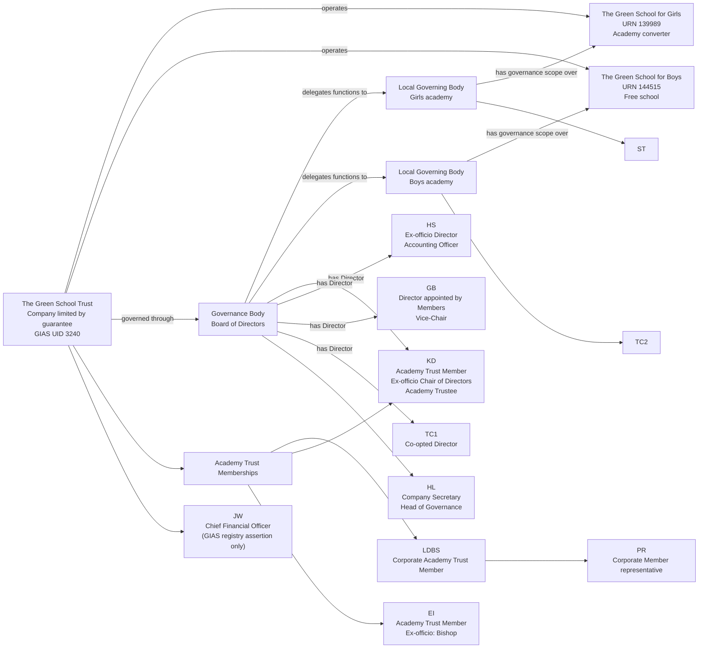
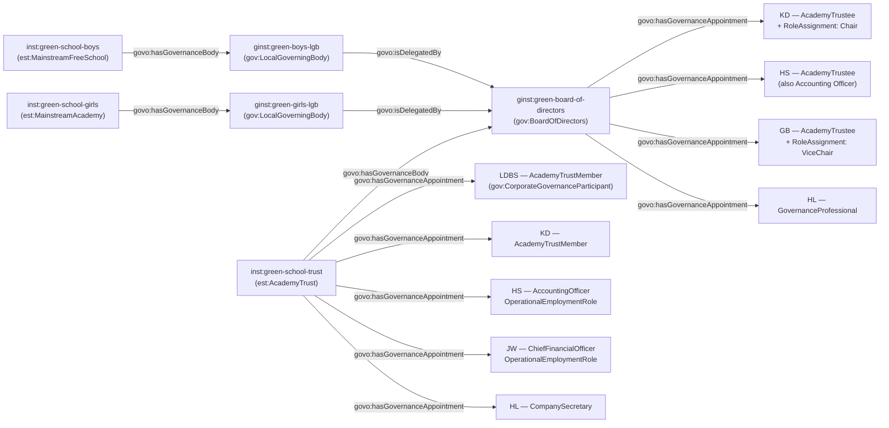

[← Worked examples](../)

# Governance Ontology — The Green School Trust example

| | |
|---|---|
| **Academy Trust** | The Green School Trust — GIAS UID 3240, Companies House 08608665 |
| **Academies** | The Green School for Girls (URN 139989, Academy converter) and The Green School for Boys (URN 144515, Free school) |
| **Establishment type** | Two-academy MAT, board known as "Board of Directors" rather than "Trust Board"/"Board of Trustees" |
| **Governance ontology namespace** | `https://dfe-digital.github.io/education-provider-registry-docs/models/governance/ontology/` |
| **Governance vocabulary namespace** | `https://dfe-digital.github.io/education-provider-registry-docs/models/governance/vocabulary/` |
| **Preferred prefixes** | `govo:` (properties) · `gov:` (classes and named individuals) · `est:`/`esto:` (reused from the main EPR ontology) |
| **OWL documentation** | [Governance ontology reference (WIDOCO)](../../ontology/) |
| **Source** | [governance-ontology.ttl](https://github.com/DFE-Digital/education-provider-registry-docs/blob/main/models/governance/governance-ontology.ttl) |
| **Repository** | [DFE-Digital/education-provider-registry-docs](https://github.com/DFE-Digital/education-provider-registry-docs) |
| **Licence** | [Open Government Licence v3.0](https://www.nationalarchives.gov.uk/doc/open-government-licence/version/3/) |

---

**Evidence and anonymisation.** This page is in two parts. **Section 1** is the real-world governance structure as documented in a bounded, sourced internal investigation ("Governance Model With Worked MAT Example: The Green School Trust") - what the Trust itself publishes, independent of any ontology. **Section 2** maps that same structure onto `governance-ontology.ttl`. Neither section is itself GIAS or Companies House data, and the source investigation is not published in this repository.

Person names throughout are shown as initials, exactly as the source investigation anonymised them. Two different people are both labelled `TC` in the source - a Director and a Boys-academy local governor - disambiguated here as `TC1` and `TC2`, since that collision is within this single page rather than coincidental overlap with another page.

---

## Section 1 — The real-world governance structure

This section is the structure as evidenced, before any ontology is applied.

### Sources

| Source | Publisher | What it evidences | Observed |
|---|---|---|---|
| [Trust governance page](https://www.tgstrust.com/AboutUs/Governance/) | The Green School Trust | Company-limited-by-guarantee legal form; Members, Board of Directors and Local Governing Bodies; Directors' dual charity-trustee and company-director capacities | 27 July 2026 |
| [Trust Members and Directors page](https://www.tgstrust.com/AboutUs/Members-and-Trustees/) | The Green School Trust | Published Member list and 2026-27 Director composition, appointment routes, terms and Company Secretary/Head of Governance role | 27 July 2026 |
| [GIAS trust record, UID 3240](https://www.get-information-schools.service.gov.uk/Groups/Group/Details/3240) | GIAS | MAT identity, Companies House number 08608665, two academies and governance assertions | 27 July 2026 |
| [GIAS Girls academy governance tab, URN 139989](https://www.get-information-schools.service.gov.uk/Establishments/Establishment/Details/139989#school-governance) | GIAS | Six current local-governor records for the Girls academy | 27 July 2026 |
| [GIAS Boys academy governance tab, URN 144515](https://www.get-information-schools.service.gov.uk/Establishments/Establishment/Details/144515#school-governance) | GIAS | Six current local-governor records for the Boys academy | 27 July 2026 |

The Trust's own pages are the authority for the real-world model; GIAS supplies separate registry assertions that are not used to redefine it. The CFO (`JW`) appears in this example only as a GIAS registry assertion - the Trust's own governance page used here does not itself publish a CFO.

### Structure

Adapted from the source investigation's own instance-level mapping.



The diagram represents the real-world Academy Trust, not registry records. `KD` demonstrates three distinct relationships for one person - Academy Trust Member, Academy Trustee/Director, and ex-officio Chair of Directors - not one interchangeable role, the same pattern Medlock's `RG` demonstrated. Left out: 2 further Academy Trust Members (`SS`, `MCA`), 9 further Directors (including `AGC`) and 10 further local governors (including `AD`, `EW`) - all evidenced in the source and not shown here.

---

## Section 2 — Modelled in the governance ontology

The same people, bodies and appointments from Section 1, expressed in Turtle using `governance-ontology.ttl` (`gov:`/`govo:`).

### Structure



### Namespace prefixes

All examples in this section use the following prefixes.

```
@prefix gov:   <https://dfe-digital.github.io/education-provider-registry-docs/models/governance/vocabulary/> .
@prefix govo:  <https://dfe-digital.github.io/education-provider-registry-docs/models/governance/ontology/> .
@prefix est:   <https://dfe-digital.github.io/education-provider-registry-docs/models/establishment/vocabulary/> .
@prefix esto:  <https://dfe-digital.github.io/education-provider-registry-docs/models/establishment/ontology/> .
@prefix rdf:   <http://www.w3.org/1999/02/22-rdf-syntax-ns#> .
@prefix rdfs:  <http://www.w3.org/2000/01/rdf-schema#> .
@prefix owl:   <http://www.w3.org/2002/07/owl#> .
@prefix xsd:   <http://www.w3.org/2001/XMLSchema#> .
@prefix inst:  <https://dfe-digital.github.io/education-provider-registry-docs/establishment/> .
@prefix ginst: <https://dfe-digital.github.io/education-provider-registry-docs/models/governance/instance/> .
```

### Example 1 — Academy Trust, two academies and a Board of Directors

This Trust calls its board a "Board of Directors" rather than a "Trust Board" - `gov:BoardOfDirectors` exists precisely for this naming convention (its own comment: "the company-law framing of the trust board... coextensive with TrustBoard"). The two academies have different route/type evidence: Girls is `est:MainstreamAcademy` with `esto:hasAcademyRoute est:ConverterRoute`; Boys is `est:MainstreamFreeSchool`, since free schools are a distinct establishment leaf type from converter/sponsor-led academies.

```
inst:green-school-trust
    a est:AcademyTrust ;
    rdfs:label "The Green School Trust"@en ;
    esto:hasGroupCompaniesHouseNumber [
        a est:CompaniesHouseNumber ;
        rdf:value "08608665"
    ] .

inst:green-school-girls
    a est:MainstreamAcademy ;
    rdfs:label "The Green School for Girls"@en ;
    esto:hasAcademyRoute est:ConverterRoute ;
    esto:hasEstablishmentIdentity [
        a est:EstablishmentIdentity ;
        esto:identifiedByUrn [
            a est:UniqueReferenceNumber ;
            rdf:value "139989"^^xsd:positiveInteger
        ]
    ] .

inst:green-school-boys
    a est:MainstreamFreeSchool ;
    rdfs:label "The Green School for Boys"@en ;
    esto:hasEstablishmentIdentity [
        a est:EstablishmentIdentity ;
        esto:identifiedByUrn [
            a est:UniqueReferenceNumber ;
            rdf:value "144515"^^xsd:positiveInteger
        ]
    ] .

ginst:green-board-of-directors
    a gov:BoardOfDirectors ;
    rdfs:label "The Green School Trust — Board of Directors"@en .

inst:green-school-trust
    govo:hasGovernanceBody ginst:green-board-of-directors .
```

### Example 2 — Academy Trust Members, including a corporate Member

`LDBS` is a corporate Academy Trust Member represented by `PR` - the second use of `gov:CorporateGovernanceParticipant` across these worked examples, after Medlock's Co-op Group. `EI` is a Member ex officio, by virtue of holding the office of Bishop - `gov:ExOfficioAppointment` used here at Member level, not just for governors.

```
ginst:ldbs
    a gov:CorporateGovernanceParticipant ;
    rdfs:label "LDBS"@en .

ginst:appointment-ldbs-member
    a gov:GovernanceAppointment ;
    govo:appointmentOf ginst:ldbs ;
    govo:hasRoleType gov:AcademyTrustMember ;
    govo:hasAppointmentBasis gov:DelegatedGovernanceAppointment ;
    rdfs:comment "Corporate Academy Trust Member, represented by PR at meetings - the representative relationship itself is not modelled, the same open point Medlock's Co-op Group/DKW left unresolved."@en .

inst:green-school-trust
    govo:hasGovernanceAppointment ginst:appointment-ldbs-member .

ginst:person-ei
    a gov:GovernancePerson ;
    rdfs:label "EI"@en .

ginst:appointment-ei-member
    a gov:GovernanceAppointment ;
    govo:appointmentOf ginst:person-ei ;
    govo:hasRoleType gov:AcademyTrustMember ;
    govo:hasAppointingBody gov:ExOfficioAppointment ;
    govo:hasAppointmentBasis gov:DelegatedGovernanceAppointment ;
    rdfs:comment "Member ex officio, by virtue of holding the office of Bishop."@en .

inst:green-school-trust
    govo:hasGovernanceAppointment ginst:appointment-ei-member .
```

### Example 3 — One person, three relationships: Member, Director and Chair

`KD` holds an Academy Trust Membership (Example 2 pattern) and, separately, an Academy Trustee/Director appointment with the Chair responsibility layered on top - three distinct relationships for one person, echoing Medlock's `RG` (Member, Trustee, Chair).

```
ginst:person-kd
    a gov:GovernancePerson ;
    rdfs:label "KD"@en .

ginst:appointment-kd-member
    a gov:GovernanceAppointment ;
    govo:appointmentOf ginst:person-kd ;
    govo:hasRoleType gov:AcademyTrustMember ;
    govo:hasAppointmentBasis gov:DelegatedGovernanceAppointment .

inst:green-school-trust
    govo:hasGovernanceAppointment ginst:appointment-kd-member .

ginst:appointment-kd-director
    a gov:GovernanceAppointment ;
    govo:appointmentOf ginst:person-kd ;
    govo:hasRoleType gov:AcademyTrustee ;
    govo:hasAppointingBody gov:ExOfficioAppointment ;
    govo:hasAppointmentBasis gov:DelegatedGovernanceAppointment ;
    govo:hasLegalCapacity gov:CompanyDirector, gov:CharityTrustee ;
    rdfs:comment "The source describes KD as 'Ex-officio: Chair of Directors' - preserved here as an ex-officio appointing basis for the Director seat itself, since the source does not separately explain what qualifying office the ex-officio status derives from."@en .

ginst:green-board-of-directors
    govo:hasGovernanceAppointment ginst:appointment-kd-director .

ginst:roleassignment-kd-chair
    a gov:RoleAssignment ;
    govo:layeredOn ginst:appointment-kd-director ;
    govo:assignsRole gov:Chair .
```

### Example 4 — Further Directors: ex-officio Accounting Officer, Vice-Chair, Co-opted

`HS` holds two distinct relationships to the Trust: an ex-officio Director seat on the Board, and separately the Accounting Officer operational appointment - not one appointment doing double duty.

```
ginst:person-hs
    a gov:GovernancePerson ;
    rdfs:label "HS"@en .

ginst:appointment-hs-director
    a gov:GovernanceAppointment ;
    govo:appointmentOf ginst:person-hs ;
    govo:hasRoleType gov:AcademyTrustee ;
    govo:hasAppointingBody gov:ExOfficioAppointment ;
    govo:hasAppointmentBasis gov:DelegatedGovernanceAppointment ;
    govo:hasLegalCapacity gov:CompanyDirector, gov:CharityTrustee ;
    rdfs:comment "Ex-officio Director - likely by virtue of being Accounting Officer/CEO, though the source does not state the qualifying office explicitly."@en .

ginst:green-board-of-directors
    govo:hasGovernanceAppointment ginst:appointment-hs-director .

ginst:appointment-hs-ao
    a gov:GovernanceAppointment ;
    govo:appointmentOf ginst:person-hs ;
    govo:hasRoleType gov:AccountingOfficer ;
    govo:hasAppointmentBasis gov:OperationalEmploymentRole ;
    rdfs:comment "Accounting Officer - a separate operational appointment from HS's Director seat above."@en .

inst:green-school-trust
    govo:hasGovernanceAppointment ginst:appointment-hs-ao .

ginst:person-gb
    a gov:GovernancePerson ;
    rdfs:label "GB"@en .

ginst:appointment-gb-director
    a gov:GovernanceAppointment ;
    govo:appointmentOf ginst:person-gb ;
    govo:hasRoleType gov:AcademyTrustee ;
    govo:hasAppointingBody gov:AppointedByAcademyMembers ;
    govo:hasAppointmentBasis gov:DelegatedGovernanceAppointment ;
    govo:hasLegalCapacity gov:CompanyDirector, gov:CharityTrustee .

ginst:green-board-of-directors
    govo:hasGovernanceAppointment ginst:appointment-gb-director .

ginst:roleassignment-gb-vicechair
    a gov:RoleAssignment ;
    govo:layeredOn ginst:appointment-gb-director ;
    govo:assignsRole gov:ViceChair .

ginst:person-tc1
    a gov:GovernancePerson ;
    rdfs:label "TC1"@en .

ginst:appointment-tc1-director
    a gov:GovernanceAppointment ;
    govo:appointmentOf ginst:person-tc1 ;
    govo:hasRoleType gov:AcademyTrustee ;
    govo:hasAppointingBody gov:AppointedByGoverningBody ;
    govo:hasAppointmentBasis gov:DelegatedGovernanceAppointment ;
    govo:hasLegalCapacity gov:CompanyDirector, gov:CharityTrustee ;
    rdfs:comment "Co-opted Director. Labelled TC1 on this page to distinguish from TC2, a different person on Boys academy's Local Governing Body (Example 5) - the source uses 'TC' for both."@en .

ginst:green-board-of-directors
    govo:hasGovernanceAppointment ginst:appointment-tc1-director .
```

*(8 further Directors are evidenced in the source and not shown here.)*

### Example 5 — Two Local Governing Bodies delegated by the same Board

Unlike the Federation worked examples, where one Governing Body is shared across several establishments, here it's the reverse: one Board of Directors delegates to **two separate** Local Governing Bodies, one per academy. Neither academy's local governors are given a category in this source - the same evidence gap as Manor High's `JJ`, handled the same way.

```
ginst:green-girls-lgb
    a gov:LocalGoverningBody ;
    rdfs:label "The Green School for Girls — Local Governing Body"@en ;
    govo:isDelegatedBy ginst:green-board-of-directors .

inst:green-school-girls
    govo:hasGovernanceBody ginst:green-girls-lgb .

ginst:green-boys-lgb
    a gov:LocalGoverningBody ;
    rdfs:label "The Green School for Boys — Local Governing Body"@en ;
    govo:isDelegatedBy ginst:green-board-of-directors .

inst:green-school-boys
    govo:hasGovernanceBody ginst:green-boys-lgb .

ginst:person-st
    a gov:GovernancePerson ;
    rdfs:label "ST"@en .

ginst:appointment-st-governor
    a gov:GovernanceAppointment ;
    govo:appointmentOf ginst:person-st ;
    govo:hasRoleType gov:Governor ;
    govo:hasAppointmentBasis gov:DelegatedGovernanceAppointment ;
    rdfs:comment "No category published for this Girls academy local governor - the generic gov:Governor value is used and govo:hasAppointingBody is omitted rather than invented."@en .

ginst:green-girls-lgb
    govo:hasGovernanceAppointment ginst:appointment-st-governor .

ginst:person-tc2
    a gov:GovernancePerson ;
    rdfs:label "TC2"@en .

ginst:appointment-tc2-governor
    a gov:GovernanceAppointment ;
    govo:appointmentOf ginst:person-tc2 ;
    govo:hasRoleType gov:Governor ;
    govo:hasAppointmentBasis gov:DelegatedGovernanceAppointment ;
    rdfs:comment "No category published for this Boys academy local governor. Labelled TC2 to distinguish from TC1, a Co-opted Director (Example 4) - the source uses 'TC' for both."@en .

ginst:green-boys-lgb
    govo:hasGovernanceAppointment ginst:appointment-tc2-governor .
```

*(4 further Girls local governors and 5 further Boys local governors are evidenced in the source and not shown here, all similarly published with no stated category.)*

### Example 6 — Chief Financial Officer and Company Secretary / Head of Governance

`JW` (CFO) is evidenced only in GIAS - the Trust's own governance page used in this investigation does not itself publish a CFO, so this appointment rests on secondary registry evidence alone, unlike every other appointment on this page. `HL` holds Company Secretary and Head of Governance as one combined published title; modelled as two separate appointments, the same distinction Medlock drew for `SL`.

```
ginst:person-jw
    a gov:GovernancePerson ;
    rdfs:label "JW"@en .

ginst:appointment-jw-cfo
    a gov:GovernanceAppointment ;
    govo:appointmentOf ginst:person-jw ;
    govo:hasRoleType gov:ChiefFinancialOfficer ;
    govo:hasAppointmentBasis gov:OperationalEmploymentRole ;
    rdfs:comment "Evidenced only as a GIAS registry assertion - the Trust's own governance page used in this investigation does not publish a CFO."@en .

inst:green-school-trust
    govo:hasGovernanceAppointment ginst:appointment-jw-cfo .

ginst:person-hl
    a gov:GovernancePerson ;
    rdfs:label "HL"@en .

ginst:appointment-hl-governanceprofessional
    a gov:GovernanceAppointment ;
    govo:appointmentOf ginst:person-hl ;
    govo:hasRoleType gov:GovernanceProfessional ;
    govo:hasAppointmentBasis gov:ProfessionalSupportRole ;
    rdfs:comment "Head of Governance, supporting the Board of Directors. Published as one combined title with Company Secretary below; modelled as two appointments, as Medlock did for SL."@en .

ginst:green-board-of-directors
    govo:hasGovernanceAppointment ginst:appointment-hl-governanceprofessional .

ginst:appointment-hl-companysecretary
    a gov:GovernanceAppointment ;
    govo:appointmentOf ginst:person-hl ;
    govo:hasRoleType gov:CompanySecretary ;
    govo:hasAppointmentBasis gov:ProfessionalSupportRole .

inst:green-school-trust
    govo:hasGovernanceAppointment ginst:appointment-hl-companysecretary .
```

---

## Concept coverage

| Real-world concept | Green School Trust evidence | Ontology mapping | Fit |
|---|---|---|---|
| Academy Trust | The Green School Trust, GIAS UID 3240, Companies House 08608665 | `est:AcademyTrust` | Direct |
| Academies of different types | Girls (Academy converter), Boys (Free school) | `est:MainstreamAcademy` + `esto:hasAcademyRoute est:ConverterRoute`; `est:MainstreamFreeSchool` | Direct |
| Board known as "Board of Directors" | The Trust's own term for its Trust Board | `gov:BoardOfDirectors` | Direct - the class exists precisely for this naming convention |
| Academy Trust Membership, including a corporate Member | LDBS (corporate, represented by PR), SS, KD, EI (ex officio), MCA | `gov:AcademyTrustMember`; `gov:CorporateGovernanceParticipant` for LDBS | Direct |
| One person, three relationships | KD: Member, Director, Chair | Three separate `GovernanceAppointment`/`RoleAssignment` records | Direct |
| Director/Trustee appointment routes | Member-appointed, Co-opted, Ex-officio | `govo:hasAppointingBody` (`gov:AppointedByAcademyMembers`, `gov:AppointedByGoverningBody`, `gov:ExOfficioAppointment`) | Direct |
| Legal capacity | Every Director is also a Company Director and Charity Trustee | `govo:hasLegalCapacity` (`gov:CompanyDirector`, `gov:CharityTrustee`) | Direct |
| Chair / Vice-Chair of Directors | KD (Chair), GB (Vice-Chair) | `gov:RoleAssignment` + `govo:assignsRole` (`gov:Chair`, `gov:ViceChair`) | Direct |
| Two Local Governing Bodies, one Board | Girls LGB, Boys LGB, both delegated by the same Board of Directors | `gov:LocalGoverningBody` + `govo:isDelegatedBy` (both to the same instance) + `govo:hasGovernanceBody` | Direct |
| Local governors with no stated category | ST, AD, TC2 and 9 further | `govo:hasRoleType gov:Governor` (generic) | Candidate |
| Accounting Officer, held alongside a Director seat | HS | Two separate appointments: `gov:AcademyTrustee` (Director) and `gov:AccountingOfficer` (operational) | Direct |
| Chief Financial Officer, GIAS-only evidence | JW | `govo:hasRoleType gov:ChiefFinancialOfficer` | Direct as a role; the evidence itself is secondary-only, noted in `rdfs:comment` |
| Company Secretary / Head of Governance | HL, one combined published title | Two separate appointments: `gov:GovernanceProfessional` and `gov:CompanySecretary` | Direct, following the Medlock precedent |
| Scheme of Delegation, committee membership, appointment history | Not published in this investigation | Not modelled | Not evidenced |

---

**See also:** [Governance vocabulary](../../vocabulary/) · [Governance taxonomy](../../taxonomy/) · [Governance ontology](../../ontology/) · [Governance ontology graph viewer](../../ontology/webvowl/)
