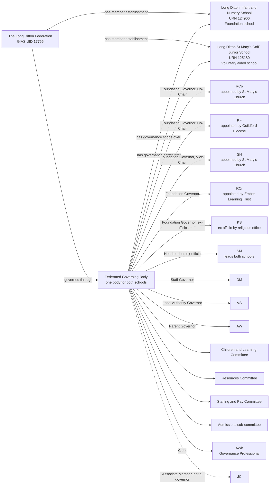
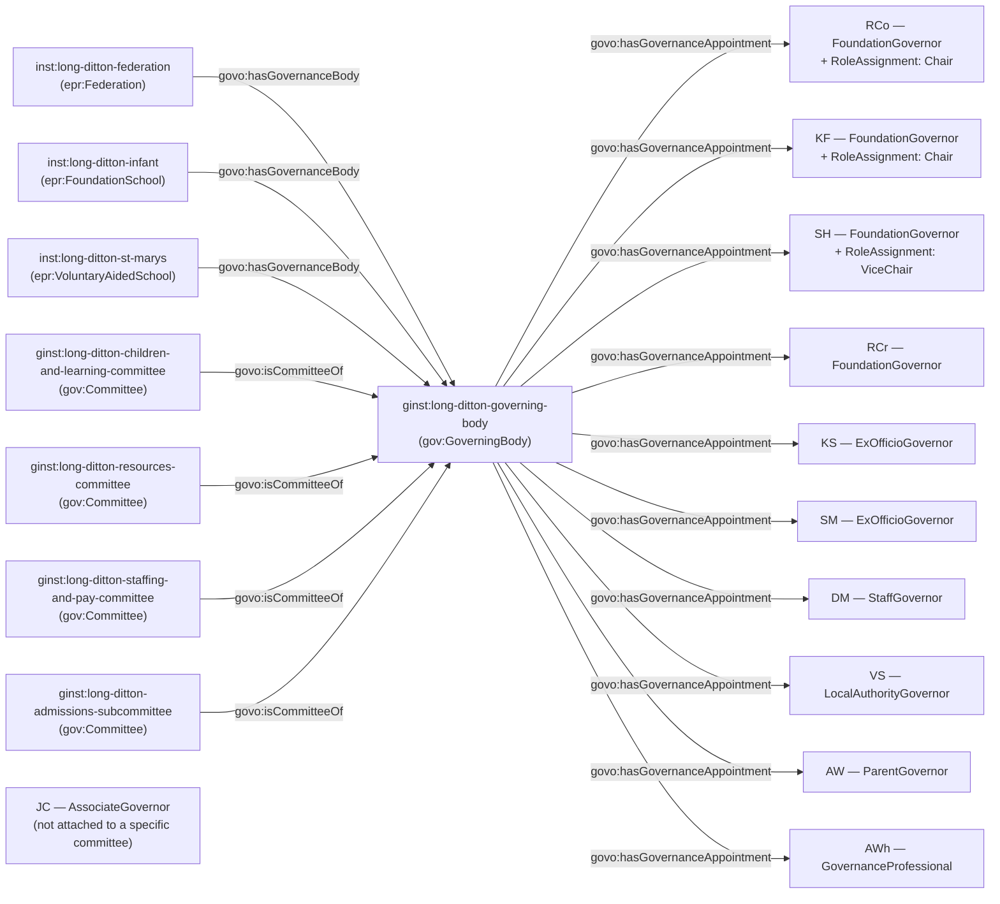

[← Worked examples](../)

# Governance Ontology — Long Ditton Federation example

| | |
|---|---|
| **Federation** | The Long Ditton Federation — GIAS UID 17766 |
| **Member schools** | Long Ditton Infant and Nursery School (URN 124966, Foundation school) and Long Ditton St Mary's CofE Junior School (URN 125180, Voluntary aided school) |
| **Establishment type** | Maintained-school federation, two open schools, one shared federated governing body |
| **Governance ontology namespace** | `https://dfe-digital.github.io/education-provider-registry-docs/models/governance/ontology/` |
| **Governance vocabulary namespace** | `https://dfe-digital.github.io/education-provider-registry-docs/models/governance/vocabulary/` |
| **Preferred prefixes** | `govo:` (properties) · `gov:` (classes and named individuals) · `epr:`/`epro:` (reused from the main EPR ontology) |
| **OWL documentation** | [Governance ontology reference (WIDOCO)](../../ontology/) |
| **Source** | [governance-ontology.ttl](https://github.com/DFE-Digital/education-provider-registry-docs/blob/main/models/governance/governance-ontology.ttl) |
| **Repository** | [DFE-Digital/education-provider-registry-docs](https://github.com/DFE-Digital/education-provider-registry-docs) |
| **Licence** | [Open Government Licence v3.0](https://www.nationalarchives.gov.uk/doc/open-government-licence/version/3/) |

---

**Evidence and anonymisation.** This page is in two parts. **Section 1** is the real-world governance structure as documented in a bounded, sourced internal investigation ("Governance Model With Worked Federation Example: Long Ditton") - what the federation itself publishes, independent of any ontology. **Section 2** maps that same structure onto `governance-ontology.ttl`. Neither section is itself GIAS data, and the source investigation is not published in this repository.

Person names throughout are shown as initials - this example does not use, and has not gone back to, the federation's full published names, even for the Clerk and Associate Members the source investigation's own person-reconciliation table happened to name in full. Both sections show the same representative **subset** of the federation's 16 published governors, its Clerk and its Associate Members - not the full roster - so that Section 1 and Section 2 stay directly comparable. The source's own diagram gives two different people the same initials, "RC" (Rachel Cook and Richard Crossingham); this page disambiguates them as `RCo` and `RCr`, mirroring the distinct node identifiers the source itself already used to tell them apart.

---

## Section 1 — The real-world governance structure

This section is the structure as evidenced, before any ontology is applied.

### Sources

| Source | Publisher | What it evidences | Observed |
|---|---|---|---|
| [GIAS federation record, UID 17766](https://www.get-information-schools.service.gov.uk/Groups/Group/Details/17766) | GIAS | Federation identity, type, open date and two member schools | 27 July 2026 |
| [GIAS establishment governance tab, URN 124966](https://www.get-information-schools.service.gov.uk/Establishments/Establishment/Details/124966#school-governance) | GIAS | Current chair and governor records, GIDs, appointment routes and dates | 27 July 2026 |
| [Long Ditton Federation governing-body page](https://www.longditton.surrey.sch.uk/long-ditton-federation-ldf-governing-body/) | The Long Ditton Federation | One federated governing body, governor categories, co-chairs, vice-chair, headteacher, named foundation appointing bodies, associate members, clerk and committees | 27 July 2026 |
| [Long Ditton Federation page](https://www.longditton.surrey.sch.uk/federation/) | The Long Ditton Federation | Formation date, two-school arrangement and shared headteacher | 27 July 2026 |

GIAS holds 15 current governance records for URN 124966; the federation's own page publishes 16 current governors, more specific named foundation appointing bodies, co-chair/vice-chair responsibilities, associate members, a clerk and committee names. The two sources agree at the name level for 15 of the 16 published governors - one, `DB`, appears only on the federation page, not yet in GIAS. GIAS also holds three historical governor records, ended before this observation, not treated as current membership here.

### Structure

Adapted from the source investigation's own instance-level mapping, trimmed to a representative subset for readability - the same subset modelled in Section 2 below.



The diagram represents the real-world governance structure, not registry records. GIAS UID `17766` and the two URNs are identifiers and evidence, not model entities in their own right. `JC` is one of four published Associate Members; the federation page states plainly that Associate Members "are not governors and cannot vote at full governing-body meetings", though they may contribute to committees under the board's own arrangements - the page does not say which committee(s) each Associate Member sits on.

---

## Section 2 — Modelled in the governance ontology

The same people, bodies and appointments from Section 1, expressed in Turtle using `governance-ontology.ttl` (`gov:`/`govo:`).

### Structure



### Namespace prefixes

All examples in this section use the following prefixes.

```
@prefix gov:   <https://dfe-digital.github.io/education-provider-registry-docs/models/governance/vocabulary/> .
@prefix govo:  <https://dfe-digital.github.io/education-provider-registry-docs/models/governance/ontology/> .
@prefix epr:   <https://dfe-digital.github.io/education-provider-registry-docs/models/establishment/vocabulary/> .
@prefix epro:  <https://dfe-digital.github.io/education-provider-registry-docs/models/establishment/ontology/> .
@prefix rdf:   <http://www.w3.org/1999/02/22-rdf-syntax-ns#> .
@prefix rdfs:  <http://www.w3.org/2000/01/rdf-schema#> .
@prefix owl:   <http://www.w3.org/2002/07/owl#> .
@prefix xsd:   <http://www.w3.org/2001/XMLSchema#> .
@prefix inst:  <https://dfe-digital.github.io/education-provider-registry-docs/establishment/> .
@prefix ginst: <https://dfe-digital.github.io/education-provider-registry-docs/models/governance/instance/> .
```

### Example 1 — Federation, member schools and a single shared Governing Body

Both schools are maintained (a Foundation school and a Voluntary aided school), so - as at Eileen Wade/Milton Ernest - the Federated Governing Body is genuinely constituted under statute. `govo:hasGovernanceBody` is again asserted three times, from the Federation and from each school, all to the same Governing Body instance.

```
inst:long-ditton-infant
    a epr:FoundationSchool ;
    rdfs:label "Long Ditton Infant and Nursery School"@en ;
    epro:hasEstablishmentIdentity [
        a epr:EstablishmentIdentity ;
        epro:identifiedByUrn [
            a epr:UniqueReferenceNumber ;
            rdfs:label "124966"
        ]
    ] .

inst:long-ditton-st-marys
    a epr:VoluntaryAidedSchool ;
    rdfs:label "Long Ditton St Mary's CofE Junior School"@en ;
    epro:hasEstablishmentIdentity [
        a epr:EstablishmentIdentity ;
        epro:identifiedByUrn [
            a epr:UniqueReferenceNumber ;
            rdfs:label "125180"
        ]
    ] .

inst:long-ditton-federation
    a epr:Federation ;
    rdfs:label "The Long Ditton Federation"@en .

ginst:long-ditton-governing-body
    a gov:GoverningBody ;
    rdfs:label "The Long Ditton Federation — Governing Body"@en .

inst:long-ditton-federation
    govo:hasGovernanceBody ginst:long-ditton-governing-body .

inst:long-ditton-infant
    govo:hasGovernanceBody ginst:long-ditton-governing-body .

inst:long-ditton-st-marys
    govo:hasGovernanceBody ginst:long-ditton-governing-body .
```

### Example 2 — Governor categories and multiple named foundation appointing bodies

This federated Governing Body is a true SI 2012/1034 maintained-school body, so its categories map **Direct**ly, the same fit as Eileen Wade/Milton Ernest. What's new here is the level of published detail: the federation page names three distinct foundation appointing organisations - St Mary's Church, the Guildford Diocese, and the Ember Learning Trust - all of which map onto the same single `gov:AppointedByFoundationOrTrust` individual. The specific organisation is preserved per appointment in `rdfs:comment`, since the ontology has one appointing-body value covering all foundation/trust appointments, not one per named body.

```
ginst:person-rcr
    a gov:GovernancePerson ;
    rdfs:label "RCr"@en .

ginst:appointment-rcr-governor
    a gov:GovernanceAppointment ;
    govo:appointmentOf ginst:person-rcr ;
    govo:hasRoleType gov:FoundationGovernor ;
    govo:hasAppointingBody gov:AppointedByFoundationOrTrust ;
    govo:hasAppointmentBasis gov:StatutoryGovernanceAppointment ;
    rdfs:comment "Foundation governor appointed by the Ember Learning Trust, per the federation's own published page. The source itself notes that using the word 'Trust' here does not establish that Ember Learning Trust owns, operates or is the legal entity for either federation school."@en .

ginst:long-ditton-governing-body
    govo:hasGovernanceAppointment ginst:appointment-rcr-governor .

ginst:person-dm
    a gov:GovernancePerson ;
    rdfs:label "DM"@en .

ginst:appointment-dm-governor
    a gov:GovernanceAppointment ;
    govo:appointmentOf ginst:person-dm ;
    govo:hasRoleType gov:StaffGovernor ;
    govo:hasAppointingBody gov:ElectedByStaff ;
    govo:hasAppointmentBasis gov:StatutoryGovernanceAppointment .

ginst:long-ditton-governing-body
    govo:hasGovernanceAppointment ginst:appointment-dm-governor .

ginst:person-vs
    a gov:GovernancePerson ;
    rdfs:label "VS"@en .

ginst:appointment-vs-governor
    a gov:GovernanceAppointment ;
    govo:appointmentOf ginst:person-vs ;
    govo:hasRoleType gov:LocalAuthorityGovernor ;
    govo:hasAppointingBody gov:AppointedByLocalAuthority ;
    govo:hasAppointmentBasis gov:StatutoryGovernanceAppointment .

ginst:long-ditton-governing-body
    govo:hasGovernanceAppointment ginst:appointment-vs-governor .

ginst:person-aw
    a gov:GovernancePerson ;
    rdfs:label "AW"@en .

ginst:appointment-aw-governor
    a gov:GovernanceAppointment ;
    govo:appointmentOf ginst:person-aw ;
    govo:hasRoleType gov:ParentGovernor ;
    govo:hasAppointingBody gov:ElectedByParents ;
    govo:hasAppointmentBasis gov:StatutoryGovernanceAppointment .

ginst:long-ditton-governing-body
    govo:hasGovernanceAppointment ginst:appointment-aw-governor .
```

### Example 3 — Two different routes to the same ex-officio role type

`KS` and `SM` are both `gov:ExOfficioGovernor`, but on two distinct real-world bases: `KS` holds the seat by virtue of a religious office, matching SI 2012/1034 reg 9's own definition of an "ex officio foundation governor"; `SM` holds it by virtue of being headteacher, the same basis as every other headteacher governor across these worked examples. The ontology has one value for both.

```
ginst:person-ks
    a gov:GovernancePerson ;
    rdfs:label "KS"@en .

ginst:appointment-ks-governor
    a gov:GovernanceAppointment ;
    govo:appointmentOf ginst:person-ks ;
    govo:hasRoleType gov:ExOfficioGovernor ;
    govo:hasAppointmentBasis gov:StatutoryGovernanceAppointment ;
    rdfs:comment "Ex-officio foundation governor by virtue of holding a religious office (Reverend), matching SI 2012/1034 reg 9's definition of an ex officio foundation governor - a different basis from a headteacher's ex-officio seat, though the ontology has one GovernanceRoleType value for both."@en .

ginst:long-ditton-governing-body
    govo:hasGovernanceAppointment ginst:appointment-ks-governor .

ginst:person-sm
    a gov:GovernancePerson ;
    rdfs:label "SM"@en .

ginst:appointment-sm-governor
    a gov:GovernanceAppointment ;
    govo:appointmentOf ginst:person-sm ;
    govo:hasRoleType gov:ExOfficioGovernor ;
    govo:hasAppointingBody gov:ExOfficioAppointment ;
    govo:hasAppointmentBasis gov:StatutoryGovernanceAppointment ;
    rdfs:comment "SM is headteacher at both federated schools, and holds one ex-officio governor seat on the shared Governing Body by virtue of that post - not one seat per school, the same pattern as LV at Eileen Wade/Milton Ernest."@en .

ginst:long-ditton-governing-body
    govo:hasGovernanceAppointment ginst:appointment-sm-governor .
```

### Example 4 — Co-Chair and Vice-Chair

`RCo` and `KF` are both published as "Co-Chair" - two people sharing the chairing responsibility concurrently. This is modelled as two separate `RoleAssignment`s, each layered onto its own governor appointment and each assigning the same `gov:Chair` value - the ontology has no distinct "co-chair" value, and none is needed: nothing prevents two people each holding a `gov:Chair` `RoleAssignment` on the same Governing Body at once. `SH` separately holds `gov:ViceChair`.

```
ginst:person-rco
    a gov:GovernancePerson ;
    rdfs:label "RCo"@en .

ginst:appointment-rco-governor
    a gov:GovernanceAppointment ;
    govo:appointmentOf ginst:person-rco ;
    govo:hasRoleType gov:FoundationGovernor ;
    govo:hasAppointingBody gov:AppointedByFoundationOrTrust ;
    govo:hasAppointmentBasis gov:StatutoryGovernanceAppointment ;
    rdfs:comment "Foundation governor appointed by St Mary's Church, Long Ditton."@en .

ginst:long-ditton-governing-body
    govo:hasGovernanceAppointment ginst:appointment-rco-governor .

ginst:roleassignment-rco-chair
    a gov:RoleAssignment ;
    govo:layeredOn ginst:appointment-rco-governor ;
    govo:assignsRole gov:Chair ;
    rdfs:comment "One of two Co-Chairs, alongside KF - modelled as two separate Chair RoleAssignments rather than a distinct 'co-chair' value."@en .

ginst:person-kf
    a gov:GovernancePerson ;
    rdfs:label "KF"@en .

ginst:appointment-kf-governor
    a gov:GovernanceAppointment ;
    govo:appointmentOf ginst:person-kf ;
    govo:hasRoleType gov:FoundationGovernor ;
    govo:hasAppointingBody gov:AppointedByFoundationOrTrust ;
    govo:hasAppointmentBasis gov:StatutoryGovernanceAppointment ;
    rdfs:comment "Foundation governor appointed by the Guildford Diocese."@en .

ginst:long-ditton-governing-body
    govo:hasGovernanceAppointment ginst:appointment-kf-governor .

ginst:roleassignment-kf-chair
    a gov:RoleAssignment ;
    govo:layeredOn ginst:appointment-kf-governor ;
    govo:assignsRole gov:Chair ;
    rdfs:comment "The other of the two Co-Chairs, alongside RCo."@en .

ginst:person-sh
    a gov:GovernancePerson ;
    rdfs:label "SH"@en .

ginst:appointment-sh-governor
    a gov:GovernanceAppointment ;
    govo:appointmentOf ginst:person-sh ;
    govo:hasRoleType gov:FoundationGovernor ;
    govo:hasAppointingBody gov:AppointedByFoundationOrTrust ;
    govo:hasAppointmentBasis gov:StatutoryGovernanceAppointment ;
    rdfs:comment "Foundation governor appointed by St Mary's Church, Long Ditton."@en .

ginst:long-ditton-governing-body
    govo:hasGovernanceAppointment ginst:appointment-sh-governor .

ginst:roleassignment-sh-vicechair
    a gov:RoleAssignment ;
    govo:layeredOn ginst:appointment-sh-governor ;
    govo:assignsRole gov:ViceChair .
```

### Example 5 — Committees and an Associate Member

Four named committees are published, each a committee of the Governing Body. No source evidence identifies which governors sit on which committee, so no committee membership is asserted for any of the nine governors modelled above. `JC` is one of four published Associate Members - a `gov:AssociateGovernor` appointment, per SI 2012/1034 reg 12 and SI 2013/1624 reg 24 (see the Frank Barnes worked example). The federation page states Associate Members contribute to committees under the board's arrangements, but does not say which committee(s) - so `JC`'s appointment is deliberately left without a `govo:hasGovernanceAppointment` link from any specific committee, rather than guessing one.

```
ginst:long-ditton-children-and-learning-committee
    a gov:Committee ;
    rdfs:label "Long Ditton Federation — Children and Learning Committee"@en ;
    govo:isCommitteeOf ginst:long-ditton-governing-body .

ginst:long-ditton-resources-committee
    a gov:Committee ;
    rdfs:label "Long Ditton Federation — Resources Committee"@en ;
    govo:isCommitteeOf ginst:long-ditton-governing-body .

ginst:long-ditton-staffing-and-pay-committee
    a gov:Committee ;
    rdfs:label "Long Ditton Federation — Staffing and Pay Committee"@en ;
    govo:isCommitteeOf ginst:long-ditton-governing-body .

ginst:long-ditton-admissions-subcommittee
    a gov:Committee ;
    rdfs:label "Long Ditton Federation — Admissions sub-committee"@en ;
    govo:isCommitteeOf ginst:long-ditton-governing-body .

ginst:person-jc
    a gov:GovernancePerson ;
    rdfs:label "JC"@en .

ginst:appointment-jc-associate
    a gov:GovernanceAppointment ;
    govo:appointmentOf ginst:person-jc ;
    govo:hasRoleType gov:AssociateGovernor ;
    govo:hasAppointmentBasis gov:StatutoryGovernanceAppointment ;
    rdfs:comment "Associate Member. The federation page states Associate Members are not governors and may contribute to committees under the board's arrangements, but does not identify which committee(s) - no govo:hasGovernanceAppointment triple attaches this appointment to a specific committee, rather than guessing one. Three further Associate Members are evidenced in the source and not shown here."@en .
```

*(3 further Associate Members, 7 further Foundation governors and David Brook (Parent governor) are evidenced in the source and not shown here.)*

### Example 6 — Governance Professional / Clerk

`AWh` clerks the Governing Body, supporting it rather than sitting as a governor or committee member - the same distinction drawn at Frank Barnes, Manor High and St Paul's Academy.

```
ginst:person-awh
    a gov:GovernancePerson ;
    rdfs:label "AWh"@en .

ginst:appointment-awh-governanceprofessional
    a gov:GovernanceAppointment ;
    govo:appointmentOf ginst:person-awh ;
    govo:hasRoleType gov:GovernanceProfessional ;
    govo:hasAppointmentBasis gov:ProfessionalSupportRole ;
    rdfs:comment "Clerk to Governors, supporting the Federated Governing Body."@en .

ginst:long-ditton-governing-body
    govo:hasGovernanceAppointment ginst:appointment-awh-governanceprofessional .
```

---

## Concept coverage

| Real-world concept | Long Ditton evidence | Ontology mapping | Fit |
|---|---|---|---|
| Federation | The Long Ditton Federation, GIAS UID 17766 | `epr:Federation` | Direct |
| Member establishments | Long Ditton Infant and Nursery School (Foundation school), Long Ditton St Mary's CofE Junior School (Voluntary aided school) | `epr:FoundationSchool`, `epr:VoluntaryAidedSchool` | Direct - reused leaf types |
| Shared federated Governing Body | One Governing Body with scope over both schools | `gov:GoverningBody`, `govo:hasGovernanceBody` from the Federation and each school | Direct |
| Governor categories | Foundation, Staff, Local Authority, Parent | `govo:hasRoleType` (`gov:FoundationGovernor`, `gov:StaffGovernor`, `gov:LocalAuthorityGovernor`, `gov:ParentGovernor`) | Direct - a true SI 2012/1034 maintained-school federation |
| Named foundation appointing bodies | St Mary's Church, Guildford Diocese, Ember Learning Trust | `govo:hasAppointingBody gov:AppointedByFoundationOrTrust`, specific body preserved in `rdfs:comment` | Direct at the category level; the specific named body is not separately modelled |
| Ex-officio governors, two bases | KS (religious office), SM (headteacher) | Both `govo:hasRoleType gov:ExOfficioGovernor` | Direct - one value covers both real-world routes |
| Co-Chair | RCo, KF | Two separate `gov:RoleAssignment`s, each `govo:assignsRole gov:Chair` | Direct - no distinct co-chair value needed |
| Vice-Chair | SH | `gov:RoleAssignment` + `govo:assignsRole gov:ViceChair` | Direct |
| Committees | Children and Learning, Resources, Staffing and Pay, Admissions sub-committee | `gov:Committee` + `govo:isCommitteeOf` | Direct as bodies; no governor-to-committee membership evidenced |
| Associate Member | JC (and 3 further, not shown) | `gov:GovernanceAppointment` (`govo:hasRoleType gov:AssociateGovernor`), not attached to a specific committee | Direct as a role type; which committee is not evidenced |
| Governance Professional / Clerk | AWh | `govo:hasRoleType gov:GovernanceProfessional`, `govo:hasAppointmentBasis gov:ProfessionalSupportRole` | Direct |
| Individual governor terms, interests, attendance | Not evidenced in this investigation's excerpt | Not modelled | Not evidenced |

---

**See also:** [Governance vocabulary](../../vocabulary/) · [Governance taxonomy](../../taxonomy/) · [Governance ontology](../../ontology/) · [Governance ontology graph viewer](../../ontology/webvowl/)
