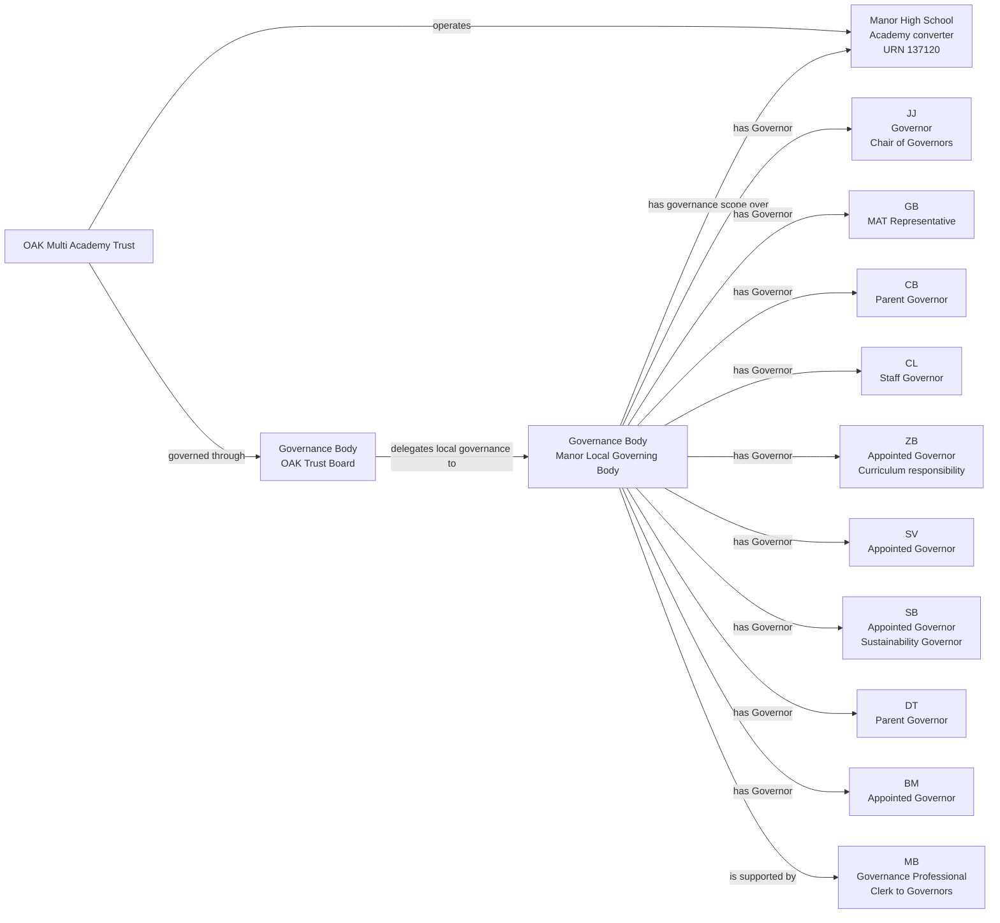
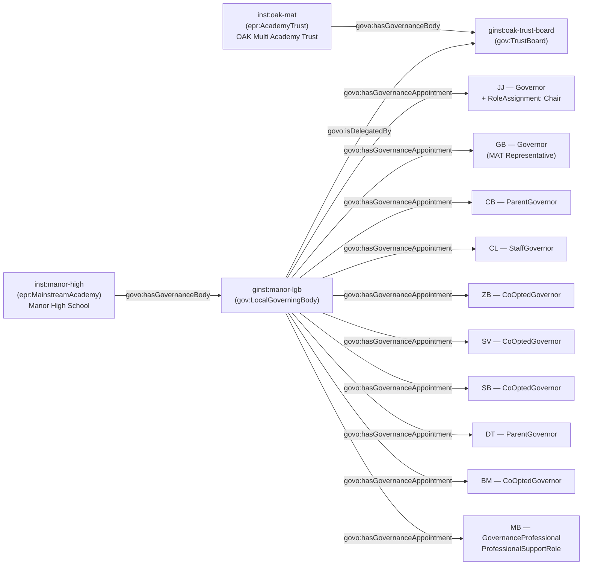

[← Worked examples](../)

# Governance Ontology — Manor High School example

| | |
|---|---|
| **School** | Manor High School — URN 137120 |
| **Academy Trust** | OAK Multi Academy Trust — GIAS UID 16991 |
| **Establishment type** | Academy converter |
| **Governance ontology namespace** | `https://dfe-digital.github.io/education-provider-registry-docs/models/governance/ontology/` |
| **Governance vocabulary namespace** | `https://dfe-digital.github.io/education-provider-registry-docs/models/governance/vocabulary/` |
| **Preferred prefixes** | `govo:` (properties) · `gov:` (classes and named individuals) · `epr:`/`epro:` (reused from the main EPR ontology) |
| **OWL documentation** | [Governance ontology reference (WIDOCO)](../../ontology/) |
| **Source** | [governance-ontology.ttl](https://github.com/DFE-Digital/education-provider-registry-docs/blob/main/models/governance/governance-ontology.ttl) |
| **Repository** | [DFE-Digital/education-provider-registry-docs](https://github.com/DFE-Digital/education-provider-registry-docs) |
| **Licence** | [Open Government Licence v3.0](https://www.nationalarchives.gov.uk/doc/open-government-licence/version/3/) |

---

**Evidence and anonymisation.** This page is in two parts. **Section 1** is the real-world governance structure as documented in a bounded, sourced internal investigation ("Governance Model With Worked Academy Converter Example: Manor High School") - what the school and Trust themselves publish, independent of any ontology. **Section 2** maps that same structure onto `governance-ontology.ttl`. Neither section is itself GIAS data, and the source investigation is not published in this repository.

Person names throughout are shown as initials, exactly as the source investigation anonymised them (e.g. `JJ`, `GB`) - this example does not use, and has not gone back to, the school's full published names. All 9 published local-governance people and the Governance Professional are shown in both sections; nothing is trimmed for this example.

---

## Section 1 — The real-world governance structure

This section is the structure as evidenced, before any ontology is applied.

### Sources

| Source | Publisher | What it evidences | Observed |
|---|---|---|---|
| [Manor Governors](https://www.manorhigh.leics.sch.uk/about-us/governance/governors/) | Manor High School | Nine published local-governance people, categories, Chair, responsibilities, dates and Clerk to Governors | 27 July 2026 |
| [Manor Governance](https://www.manorhigh.leics.sch.uk/about-us/governance/) | Manor High School | The Local Governing Body and OAK Trustees work together to support and challenge the school | 27 July 2026 |
| [OAK governance structure](https://www.oaktrust.org/governance/mat-structure/) | OAK Multi Academy Trust | OAK is led by Members and a Board of Trustees; each school has a Local Governing Body with delegated functions | 27 July 2026 |
| [GIAS — Manor High School, URN 137120, Governance tab](https://www.get-information-schools.service.gov.uk/Establishments/Establishment/Details/137120#school-governance) | GIAS | Academy converter status, OAK Multi Academy Trust, current local-governance records, appointment routes and dates | 27 July 2026 |

GIAS's current population is close to the school's published page but not identical - GIAS records `GB` as historical (ending July 2026) and shows current headteacher `SG` instead, who does not appear on the observed school page. Both sources are shown as separately time-qualified assertions, not merged into one roster.

### Structure

Adapted from the source investigation's own instance-level mapping.



The diagram represents the real-world governance structure, not registry records. URN `137120` and GIAS UID `16991` are identifiers and evidence, not model entities in their own right. The Trust Board and the Local Governing Body are two distinct Governance Bodies with different scopes; neither is the academy itself, and neither is the Academy Trust legal entity.

---

## Section 2 — Modelled in the governance ontology

The same people, bodies and appointments from Section 1, expressed in Turtle using `governance-ontology.ttl` (`gov:`/`govo:`).

### Structure



### Namespace prefixes

All examples in this section use the following prefixes.

```
@prefix gov:   <https://dfe-digital.github.io/education-provider-registry-docs/models/governance/vocabulary/> .
@prefix govo:  <https://dfe-digital.github.io/education-provider-registry-docs/models/governance/ontology/> .
@prefix epr:   <https://dfe-digital.github.io/education-provider-registry-docs/vocabulary/> .
@prefix epro:  <https://dfe-digital.github.io/education-provider-registry-docs/ontology/> .
@prefix rdf:   <http://www.w3.org/1999/02/22-rdf-syntax-ns#> .
@prefix rdfs:  <http://www.w3.org/2000/01/rdf-schema#> .
@prefix owl:   <http://www.w3.org/2002/07/owl#> .
@prefix xsd:   <http://www.w3.org/2001/XMLSchema#> .
@prefix inst:  <https://dfe-digital.github.io/education-provider-registry-docs/establishment/> .
@prefix ginst: <https://dfe-digital.github.io/education-provider-registry-docs/models/governance/instance/> .
```

### Example 1 — Academy, Academy Trust and Trust Board identity

Manor High School is a secondary academy converter, operated by OAK Multi Academy Trust. `epr:MainstreamAcademy` is the specific leaf type (not the generic `epr:Establishment` or `epr:Academy` stub); `epro:hasAcademyRoute` records that it converted from an existing school rather than being sponsored into being.

```
inst:manor-high
    a epr:MainstreamAcademy ;
    rdfs:label "Manor High School"@en ;
    epro:hasAcademyRoute epr:ConverterRoute ;

    epro:hasEstablishmentIdentity [
        a epr:EstablishmentIdentity ;
        epro:identifiedByUrn [
            a epr:UniqueReferenceNumber ;
            rdfs:label "137120"
        ]
    ] .

inst:oak-mat
    a epr:AcademyTrust ;
    rdfs:label "OAK Multi Academy Trust"@en .

ginst:oak-trust-board
    a gov:TrustBoard ;
    rdfs:label "OAK Multi Academy Trust — Trust Board"@en .

inst:oak-mat
    govo:hasGovernanceBody ginst:oak-trust-board .
```

### Example 2 — Local Governing Body: delegation and governance scope

A Local Governing Body's functions derive entirely from the Trust Board's scheme of delegation - it is not a statutory body in its own right, unlike a maintained school's governing body. This needs two distinct relationships, kept separate exactly as they were for Medlock's Academy Community Council: the LGB's delegation *from* the Trust Board (`govo:isDelegatedBy`), and its governance scope *over* the academy (`govo:hasGovernanceBody`).

```
ginst:manor-lgb
    a gov:LocalGoverningBody ;
    rdfs:label "Manor High School — Local Governing Body"@en ;
    govo:isDelegatedBy ginst:oak-trust-board .

inst:manor-high
    govo:hasGovernanceBody ginst:manor-lgb .
```

### Example 3 — Governor categories and appointing body

Manor's Local Governing Body is not bound by the School Governance (Constitution) (England) Regulations 2012 (SI 2012/1034) - that instrument governs maintained schools' governing bodies specifically, not an academy trust's internal delegated bodies. So although the Trust's own category labels ("Parent Governor", "Staff Governor", "Appointed Governor", "MAT Representative") resemble the statutory categories, reusing the matching `GovernanceRoleType` and `AppointingBody` individuals here is a **Candidate** mapping - the same label, but without the statutory grounding Frank Barnes' true maintained-school governor categories have.

`GB`'s category, "MAT Representative", has no closely-matching `GovernanceRoleType` individual at all - the generic `gov:Governor` is used as the closest candidate value, with `gov:AppointedByFoundationOrTrust` as the closest candidate appointing body.

```
ginst:person-cb
    a gov:GovernancePerson ;
    rdfs:label "CB"@en .

ginst:appointment-cb-governor
    a gov:GovernanceAppointment ;
    govo:appointmentOf ginst:person-cb ;
    govo:hasRoleType gov:ParentGovernor ;
    govo:hasAppointingBody gov:ElectedByParents ;
    govo:hasAppointmentBasis gov:StatutoryGovernanceAppointment ;
    rdfs:comment "Parent Governor (Trust's own category label). Candidate mapping - Manor's Local Governing Body is not constituted under SI 2012/1034, unlike a maintained school's governing body."@en .

ginst:manor-lgb
    govo:hasGovernanceAppointment ginst:appointment-cb-governor .

ginst:person-cl
    a gov:GovernancePerson ;
    rdfs:label "CL"@en .

ginst:appointment-cl-governor
    a gov:GovernanceAppointment ;
    govo:appointmentOf ginst:person-cl ;
    govo:hasRoleType gov:StaffGovernor ;
    govo:hasAppointingBody gov:ElectedByStaff ;
    govo:hasAppointmentBasis gov:StatutoryGovernanceAppointment ;
    rdfs:comment "Staff Governor (Trust's own category label). Candidate mapping, as for CB above."@en .

ginst:manor-lgb
    govo:hasGovernanceAppointment ginst:appointment-cl-governor .

ginst:person-gb
    a gov:GovernancePerson ;
    rdfs:label "GB"@en .

ginst:appointment-gb-governor
    a gov:GovernanceAppointment ;
    govo:appointmentOf ginst:person-gb ;
    govo:hasRoleType gov:Governor ;
    govo:hasAppointingBody gov:AppointedByFoundationOrTrust ;
    govo:hasAppointmentBasis gov:StatutoryGovernanceAppointment ;
    rdfs:comment "MAT Representative. No GovernanceRoleType individual matches this category directly - the generic gov:Governor is the closest candidate value, and gov:AppointedByFoundationOrTrust the closest candidate appointing body. GIAS records GB as historical (ending July 2026) and shows a different current headteacher, SG, not on the observed school page - both source assertions are preserved separately rather than merged."@en .

ginst:manor-lgb
    govo:hasGovernanceAppointment ginst:appointment-gb-governor .

ginst:person-zb
    a gov:GovernancePerson ;
    rdfs:label "ZB"@en .

ginst:appointment-zb-governor
    a gov:GovernanceAppointment ;
    govo:appointmentOf ginst:person-zb ;
    govo:hasRoleType gov:CoOptedGovernor ;
    govo:hasAppointingBody gov:AppointedByGoverningBody ;
    govo:hasAppointmentBasis gov:StatutoryGovernanceAppointment ;
    rdfs:comment "Appointed Governor (Trust's own category label), with a published Curriculum responsibility. gov:CoOptedGovernor is the closest candidate value for 'Appointed'. No RoleAndOfficeResponsibility individual matches 'Curriculum' - not modelled."@en .

ginst:manor-lgb
    govo:hasGovernanceAppointment ginst:appointment-zb-governor .

ginst:person-sv
    a gov:GovernancePerson ;
    rdfs:label "SV"@en .

ginst:appointment-sv-governor
    a gov:GovernanceAppointment ;
    govo:appointmentOf ginst:person-sv ;
    govo:hasRoleType gov:CoOptedGovernor ;
    govo:hasAppointingBody gov:AppointedByGoverningBody ;
    govo:hasAppointmentBasis gov:StatutoryGovernanceAppointment ;
    rdfs:comment "Appointed Governor (Trust's own category label). Candidate mapping, as for ZB above."@en .

ginst:manor-lgb
    govo:hasGovernanceAppointment ginst:appointment-sv-governor .

ginst:person-sb
    a gov:GovernancePerson ;
    rdfs:label "SB"@en .

ginst:appointment-sb-governor
    a gov:GovernanceAppointment ;
    govo:appointmentOf ginst:person-sb ;
    govo:hasRoleType gov:CoOptedGovernor ;
    govo:hasAppointingBody gov:AppointedByGoverningBody ;
    govo:hasAppointmentBasis gov:StatutoryGovernanceAppointment ;
    rdfs:comment "Appointed Governor (Trust's own category label), with a published Sustainability Governor responsibility. No RoleAndOfficeResponsibility individual matches this - not modelled."@en .

ginst:manor-lgb
    govo:hasGovernanceAppointment ginst:appointment-sb-governor .

ginst:person-dt
    a gov:GovernancePerson ;
    rdfs:label "DT"@en .

ginst:appointment-dt-governor
    a gov:GovernanceAppointment ;
    govo:appointmentOf ginst:person-dt ;
    govo:hasRoleType gov:ParentGovernor ;
    govo:hasAppointingBody gov:ElectedByParents ;
    govo:hasAppointmentBasis gov:StatutoryGovernanceAppointment ;
    rdfs:comment "Parent Governor (Trust's own category label). Candidate mapping, as for CB above."@en .

ginst:manor-lgb
    govo:hasGovernanceAppointment ginst:appointment-dt-governor .

ginst:person-bm
    a gov:GovernancePerson ;
    rdfs:label "BM"@en .

ginst:appointment-bm-governor
    a gov:GovernanceAppointment ;
    govo:appointmentOf ginst:person-bm ;
    govo:hasRoleType gov:CoOptedGovernor ;
    govo:hasAppointingBody gov:AppointedByGoverningBody ;
    govo:hasAppointmentBasis gov:StatutoryGovernanceAppointment ;
    rdfs:comment "Appointed Governor (Trust's own category label). Candidate mapping, as for ZB above."@en .

ginst:manor-lgb
    govo:hasGovernanceAppointment ginst:appointment-bm-governor .
```

### Example 4 — Chair of Governors

`JJ` is published only as "Governor" and "Chair of Governors", without one of the Trust's more specific category labels used for the other governors. Chair is a responsibility layered onto the base appointment, exactly as for a Trust Board Chair (Medlock) or a Committee Chair (Frank Barnes) - `gov:Chair` is used here rather than `gov:CommitteeChair`, since a Local Governing Body is not a Committee.

```
ginst:person-jj
    a gov:GovernancePerson ;
    rdfs:label "JJ"@en .

ginst:appointment-jj-governor
    a gov:GovernanceAppointment ;
    govo:appointmentOf ginst:person-jj ;
    govo:hasRoleType gov:Governor ;
    govo:hasAppointmentBasis gov:StatutoryGovernanceAppointment ;
    rdfs:comment "Published only as 'Governor' and 'Chair of Governors' - no more specific category given, and no appointing body stated for JJ specifically, so govo:hasAppointingBody is omitted here rather than invented."@en .

ginst:manor-lgb
    govo:hasGovernanceAppointment ginst:appointment-jj-governor .

ginst:roleassignment-jj-chair
    a gov:RoleAssignment ;
    govo:layeredOn ginst:appointment-jj-governor ;
    govo:assignsRole gov:Chair .
```

### Example 5 — Governance Professional

`MB` supports the Local Governing Body as Clerk to Governors, and is not modelled as a Governor - the same distinction Medlock and Frank Barnes both draw between a support appointment and a governor/trustee appointment.

```
ginst:person-mb
    a gov:GovernancePerson ;
    rdfs:label "MB"@en .

ginst:appointment-mb-governanceprofessional
    a gov:GovernanceAppointment ;
    govo:appointmentOf ginst:person-mb ;
    govo:hasRoleType gov:GovernanceProfessional ;
    govo:hasAppointmentBasis gov:ProfessionalSupportRole ;
    rdfs:comment "Clerk to Governors, supporting the Local Governing Body."@en .

ginst:manor-lgb
    govo:hasGovernanceAppointment ginst:appointment-mb-governanceprofessional .
```

---

## Concept coverage

| Real-world concept | Manor High evidence | Ontology mapping | Fit |
|---|---|---|---|
| Academy (converter) | Manor High School, URN 137120 | `epr:MainstreamAcademy` + `epro:hasAcademyRoute epr:ConverterRoute` | Direct - reused leaf type and route property from the main EPR ontology |
| Academy Trust | OAK Multi Academy Trust, GIAS UID 16991 | `epr:AcademyTrust` | Direct |
| Trust Board | The board accountable for OAK Multi Academy Trust | `gov:TrustBoard` + `govo:hasGovernanceBody` | Direct |
| Local Governing Body | Manor's local governing body, delegated by the Trust Board | `gov:LocalGoverningBody` + `govo:isDelegatedBy` (delegation) + `govo:hasGovernanceBody` (scope over the academy) | Direct |
| Governor categories | Parent, Staff, Appointed, MAT Representative | `govo:hasRoleType` (`gov:ParentGovernor`, `gov:StaffGovernor`, `gov:CoOptedGovernor`, `gov:Governor`) | Candidate - Manor's Local Governing Body is not constituted under SI 2012/1034, unlike a maintained school's governing body |
| Appointing body / route | Parent election, staff election, Trust appointment, co-option | `govo:hasAppointingBody` (`gov:ElectedByParents`, `gov:ElectedByStaff`, `gov:AppointedByFoundationOrTrust`, `gov:AppointedByGoverningBody`) | Candidate, for the same reason |
| Chair of Governors | JJ | `gov:RoleAssignment` + `govo:layeredOn` (Local Governing Body appointment) + `govo:assignsRole gov:Chair` | Direct |
| Governor responsibilities | Curriculum (ZB), Sustainability Governor (SB) | Not modelled | Not evidenced - no `RoleAndOfficeResponsibility` individual matches either |
| Governance Professional | MB, Clerk to Governors | `govo:hasRoleType gov:GovernanceProfessional`, `govo:hasAppointmentBasis gov:ProfessionalSupportRole` | Direct |
| Academy Trust Members, Trustees, central operational appointments | Not evidenced in this investigation | Not modelled | Out of scope - covered separately by the OAK MAT worked example |

---

**See also:** [Governance vocabulary](../../vocabulary/) · [Governance taxonomy](../../taxonomy/) · [Governance ontology](../../ontology/) · [Governance ontology graph viewer](../../ontology/webvowl/)
