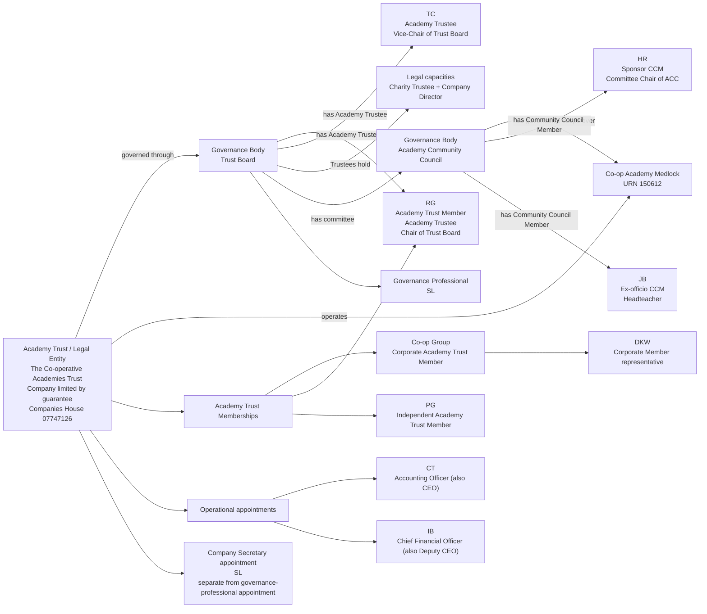
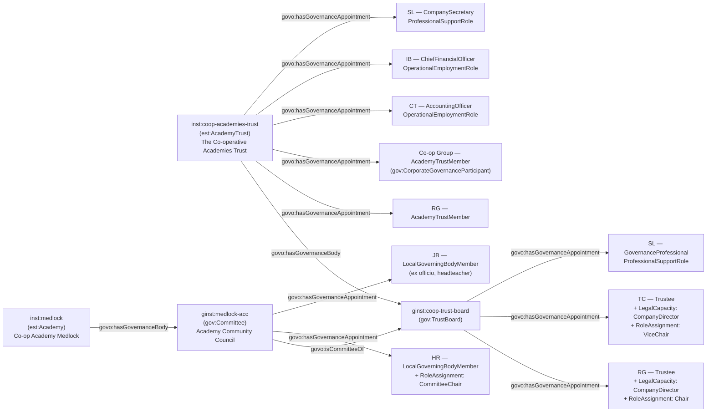

[← Worked examples](../)

# Governance Ontology — Co-operative Academies Trust / Co-op Academy Medlock example

| | |
|---|---|
| **Trust** | The Co-operative Academies Trust — GIAS UID 2777, Companies House 07747126 |
| **Academy** | Co-op Academy Medlock, URN 150612 |
| **Trust type** | Multi-academy trust (MAT) |
| **Governance ontology namespace** | `https://dfe-digital.github.io/education-provider-registry-docs/models/governance/ontology/` |
| **Governance vocabulary namespace** | `https://dfe-digital.github.io/education-provider-registry-docs/models/governance/vocabulary/` |
| **Preferred prefixes** | `govo:` (properties) · `gov:` (classes and named individuals) · `est:`/`esto:` (reused from the main EPR ontology) |
| **OWL documentation** | [Governance ontology reference (WIDOCO)](../../ontology/) |
| **Source** | [governance-ontology.ttl](https://github.com/DFE-Digital/education-provider-registry-docs/blob/main/models/governance/governance-ontology.ttl) |
| **Repository** | [DFE-Digital/education-provider-registry-docs](https://github.com/DFE-Digital/education-provider-registry-docs) |
| **Licence** | [Open Government Licence v3.0](https://www.nationalarchives.gov.uk/doc/open-government-licence/version/3/) |

---

**Evidence and anonymisation.** This page is in two parts. **Section 1** is the real-world governance structure as documented in a bounded, sourced internal investigation ("Governance Model With Worked MAT Example: Co-op Academy Medlock") - what the Trust itself publishes, independent of any ontology. **Section 2** maps that same structure onto `governance-ontology.ttl`. Neither section is itself GIAS or Companies House data, and the source investigation is not published in this repository.

Person names throughout are shown as initials, exactly as the source investigation anonymised them (e.g. `RG`, `TC`) - this example does not use, and has not gone back to, the Trust's full published names. Both sections show the same representative **subset** of people, not the full roster - 6 Academy Trust Members, 10 Trust Board people and 11 Academy Community Council Members are evidenced in the source - so that Section 1 and Section 2 stay directly comparable. Left out: 3 further Academy Trust Members (`GGM`, `KN`, `HT`), 8 further Trustees (`APM`, `MA`, `RW`, `GG-T`, `SB`, `CC`, `SFC`, `MW`) and 9 further Community Council Members.

---

## Section 1 — The real-world governance structure

This section is the structure as evidenced, before any ontology is applied.

### Sources

| Source | Publisher | What it evidences | Observed |
|---|---|---|---|
| [Our Members](https://www.coopacademies.co.uk/our-members) | Co-op Academies Trust | Six published Academy Trust Members, including the Co-op Group as a corporate Member and its representative | 27 July 2026 |
| [Trust Board](https://www.coopacademies.co.uk/trust-board) | Co-op Academies Trust | Ten published Trust Board people, their appointment route, and Chair/Vice-Chair roles | 27 July 2026 |
| [Co-op Academy Medlock: Academy Community Council](https://www.medlock.coopacademies.co.uk/governance) | Co-op Academy Medlock | Eleven published current Community Council Members, their categories, appointment routes and Chair role | 27 July 2026 |
| [Trust governance](https://www.coopacademies.co.uk/governance/) | Co-op Academies Trust | Academy Community Councils are committees of the Trust Board; Community Council Members take the place of governors in this Trust's structure | 27 July 2026 |
| [Companies House: company 07747126](https://find-and-update.company-information.service.gov.uk/company/07747126) | Companies House | Confirms The Co-operative Academies Trust is an active private company limited by guarantee - the same legal entity as GIAS UID 2777, not a second organisation | 24 July 2026 |
| [Companies House: filed accounts, "Annual Report and Financial Statements for year ended 31 August 2025"](https://find-and-update.company-information.service.gov.uk/company/07747126/filing-history) | The Co-operative Academies Trust (filed with Companies House) | Names the Trust's Accounting Officer and Chief Finance Officer, under "Trust Senior Leadership Team" | Filed 12 February 2026; observed 30 July 2026 |

The Governance Professional and Company Secretary shown below are not named in any of these sources - they come from separate secondary evidence (a historical GIAS reconciliation, and the [Academy Trust Handbook 2025](https://www.gov.uk/government/publications/academy-trust-handbook/academy-trust-handbook-2025-effective-from-1-september-2025)), included here because they are real appointments against the same Academy Trust, not because the Trust's own governance pages name them. The Accounting Officer and Chief Financial Officer, by contrast, are named in the Trust's own filed annual accounts (see Example 6).

### Structure

Adapted from the source investigation's own instance-level mapping, trimmed to a representative subset of people for readability - the same subset modelled in Section 2 below.



The diagram represents the real-world Academy Trust, not registry records. GIAS UID `2777`, Companies House number `07747126` and URN `150612` are identifiers and evidence, not model entities in their own right. RG demonstrates two distinct relationships for one person - Academy Trust Member and Academy Trustee (Chair) - not one interchangeable role. `SL` demonstrates the same pattern for Governance Professional and Company Secretary.

---

## Section 2 — Modelled in the governance ontology

The same people, bodies and appointments from Section 1, expressed in Turtle using `governance-ontology.ttl` (`gov:`/`govo:`).

### Structure



### Namespace prefixes

All examples in this section use the following prefixes.

```
@prefix gov:   <https://dfe-digital.github.io/education-provider-registry-docs/models/governance/vocabulary/> .
@prefix govo:  <https://dfe-digital.github.io/education-provider-registry-docs/models/governance/ontology/> .
@prefix est:   <https://dfe-digital.github.io/education-provider-registry-docs/models/establishment/vocabulary/> .
@prefix esto:  <https://dfe-digital.github.io/education-provider-registry-docs/models/establishment/ontology/> .
@prefix rdf:   <http://www.w3.org/1999/02/22-rdf-syntax-ns#> .
@prefix rdfs:  <http://www.w3.org/2000/01/rdf-schema#> .
@prefix owl:   <http://www.w3.org/2002/07/owl#> .
@prefix xsd:   <http://www.w3.org/2001/XMLSchema#> .
@prefix inst:  <https://dfe-digital.github.io/education-provider-registry-docs/establishment/> .
@prefix ginst: <https://dfe-digital.github.io/education-provider-registry-docs/models/governance/instance/> .
```

### Example 1 — Legal entity, academy and trust board identity

The Academy Trust is one legal entity carrying two registry identifiers (GIAS UID and Companies House number) - not two organisations. `est:AcademyTrust` and `est:Academy` are reused directly from the main EPR ontology (they are type stubs in `governance-ontology.ttl` - see the [ontology graph viewer](../../ontology/webvowl/)); `esto:hasGroupUniqueIdentifier` and `esto:hasGroupCompaniesHouseNumber` are reused, unmodified, from `establishment-ontology.ttl`.

```
inst:coop-academies-trust
    a est:AcademyTrust ;
    rdfs:label "The Co-operative Academies Trust"@en ;

    esto:hasGroupUniqueIdentifier [
        a est:GroupUniqueIdentifier ;
        rdfs:label "2777"
    ] ;

    esto:hasGroupCompaniesHouseNumber [
        a est:CompaniesHouseNumber ;
        rdfs:label "07747126"
    ] .

inst:medlock
    a est:Academy ;
    rdfs:label "Co-op Academy Medlock"@en ;

    esto:hasEstablishmentIdentity [
        a est:EstablishmentIdentity ;
        esto:identifiedByUrn [
            a est:UniqueReferenceNumber ;
            rdfs:label "150612"
        ]
    ] .

ginst:coop-trust-board
    a gov:TrustBoard ;
    rdfs:label "Co-operative Academies Trust — Trust Board"@en .

inst:coop-academies-trust
    govo:hasGovernanceBody ginst:coop-trust-board .
```

### Example 2 — Academy Community Council as a committee of the Trust Board

The Trust's own published pages call Medlock's delegated local governance body an **Academy Community Council**, a committee of the Trust Board - not a separate legal entity, and not the same as the historic GIAS "Local Governing Body" label for the same academy. This needs two distinct relationships: the committee's delegation *from* the Trust Board (`govo:isCommitteeOf`), and its governance scope *over* the academy (`govo:hasGovernanceBody`).

```
ginst:medlock-acc
    a gov:Committee ;
    rdfs:label "Co-op Academy Medlock — Academy Community Council"@en ;
    rdfs:comment "The Trust's own term for Medlock's delegated local governance body, distinct from the historic GIAS 'Local Governing Body' label the Trust's current published pages no longer use."@en ;
    govo:isCommitteeOf ginst:coop-trust-board .

inst:medlock
    govo:hasGovernanceBody ginst:medlock-acc .
```

### Example 3 — Academy Trust Membership

Members relate to the Academy Trust legal entity directly - they are not automatically Trustees or Trust Board members. `RG` (below) separately holds a Trustee appointment (Example 4): two distinct relationships for one person, not one interchangeable role. `govo:hasGovernanceAppointment` has no asserted `rdfs:domain`, precisely so that it can attach to the Academy Trust legal entity directly (as here) as well as to a `gov:GovernanceBody` (as with Trustee and Community Council Member appointments below) without wrongly implying board membership for a Member appointment.

A Member of a company limited by guarantee - which is what an Academy Trust legally is - need not be a natural person: the Co-op Group is itself a corporate Academy Trust Member, represented at meetings by `DKW`. `govo:appointmentOf`'s range is `gov:GovernanceParticipant`, a superclass of both `gov:GovernancePerson` and `gov:CorporateGovernanceParticipant` (for corporate bodies). This isn't open to every role: a Trustee, Governor or other office-holder must still be a natural person, a rule enforced by `gov:GovernanceAppointmentParticipantShape` in `governance-shacl.ttl`, since OWL/RDFS alone cannot express a constraint conditional on the appointment's role type.

```
ginst:person-rg
    a gov:GovernancePerson ;
    rdfs:label "RG"@en .

ginst:appointment-rg-member
    a gov:GovernanceAppointment ;
    govo:appointmentOf ginst:person-rg ;
    govo:hasRoleType gov:AcademyTrustMember ;
    govo:hasAppointmentBasis gov:DelegatedGovernanceAppointment .

inst:coop-academies-trust
    govo:hasGovernanceAppointment ginst:appointment-rg-member .

ginst:person-pg
    a gov:GovernancePerson ;
    rdfs:label "PG"@en .

ginst:appointment-pg-member
    a gov:GovernanceAppointment ;
    govo:appointmentOf ginst:person-pg ;
    govo:hasRoleType gov:AcademyTrustMember ;
    govo:hasAppointmentBasis gov:DelegatedGovernanceAppointment ;
    rdfs:comment "Independent Academy Trust Member (the Trust's own published term)."@en .

inst:coop-academies-trust
    govo:hasGovernanceAppointment ginst:appointment-pg-member .

ginst:coop-group
    a gov:CorporateGovernanceParticipant ;
    rdfs:label "Co-op Group"@en ;
    rdfs:comment "Corporate Academy Trust Member. Represented at meetings by DKW - that representative relationship is not itself modelled (a further gap; see 'What this example found' below)."@en .

ginst:appointment-coopgroup-member
    a gov:GovernanceAppointment ;
    govo:appointmentOf ginst:coop-group ;
    govo:hasRoleType gov:AcademyTrustMember ;
    govo:hasAppointmentBasis gov:DelegatedGovernanceAppointment ;
    rdfs:comment "Corporate Academy Trust Member: the Co-op Group, represented by DKW. govo:appointmentOf resolves to a gov:CorporateGovernanceParticipant, not a gov:GovernancePerson - only permitted for Academy Trust Member / Trust Member role types (see gov:GovernanceAppointmentParticipantShape in governance-shacl.ttl)."@en .

inst:coop-academies-trust
    govo:hasGovernanceAppointment ginst:appointment-coopgroup-member .
```

*(3 further Academy Trust Members - `GGM`, `KN`, `HT` - are evidenced in the source and not shown here.)*

### Example 4 — Trustee appointments, legal capacity and Chair role assignment

Academy Trustees are simultaneously charity trustees and, as a matter of company law, company directors - `govo:hasLegalCapacity` exists specifically to express this without inventing a second appointment. Chair and Vice-Chair are responsibilities layered onto a Trustee appointment, not separate appointment types - `gov:RoleAssignment` with `govo:layeredOn` expresses that layering.

```
ginst:person-tc
    a gov:GovernancePerson ;
    rdfs:label "TC"@en .

ginst:appointment-rg-trustee
    a gov:GovernanceAppointment ;
    govo:appointmentOf ginst:person-rg ;
    govo:hasRoleType gov:Trustee ;
    govo:hasAppointingBody gov:AppointedByAcademyMembers ;
    govo:hasAppointmentBasis gov:DelegatedGovernanceAppointment ;
    govo:hasLegalCapacity gov:CompanyDirector, gov:CharityTrustee ;
    rdfs:comment "Legal capacity shown as a candidate person-level correlation with a Companies House Director record, not a confirmed match - see the source investigation's reconciliation evidence."@en .

ginst:coop-trust-board
    govo:hasGovernanceAppointment ginst:appointment-rg-trustee .

ginst:roleassignment-rg-chair
    a gov:RoleAssignment ;
    govo:layeredOn ginst:appointment-rg-trustee ;
    govo:assignsRole gov:Chair ;
    rdfs:comment "RG is Chair of Trustees, and separately holds Academy Trust Membership (Example 3) - two distinct relationships for one person."@en .

ginst:appointment-tc-trustee
    a gov:GovernanceAppointment ;
    govo:appointmentOf ginst:person-tc ;
    govo:hasRoleType gov:Trustee ;
    govo:hasAppointingBody gov:AppointedByAcademyMembers ;
    govo:hasAppointmentBasis gov:DelegatedGovernanceAppointment ;
    govo:hasLegalCapacity gov:CompanyDirector, gov:CharityTrustee .

ginst:coop-trust-board
    govo:hasGovernanceAppointment ginst:appointment-tc-trustee .

ginst:roleassignment-tc-vicechair
    a gov:RoleAssignment ;
    govo:layeredOn ginst:appointment-tc-trustee ;
    govo:assignsRole gov:ViceChair .
```

*(8 further Trustees - `APM`, `MA`, `RW`, `GG-T`, `SB`, `CC`, `SFC`, `MW` - are evidenced in the source and not shown here.)*

### Example 5 — Academy Community Council membership

Eleven Community Council Members are evidenced, across five appointing categories the Trust publishes (community, staff, sponsor, parent, ex-officio). No role type in the taxonomy is named specifically for a Community Council Member, so this example reuses `gov:LocalGoverningBodyMember` - the closest existing value - and maps the Trust's category labels onto the closest `AppointingBody` individuals. Both mappings are candidates, not direct evidence: the source gives category labels, not the underlying appointing mechanism.

```
ginst:person-hr
    a gov:GovernancePerson ;
    rdfs:label "HR"@en .

ginst:appointment-hr-ccm
    a gov:GovernanceAppointment ;
    govo:appointmentOf ginst:person-hr ;
    govo:hasRoleType gov:LocalGoverningBodyMember ;
    govo:hasAppointingBody gov:AppointedByFoundationOrTrust ;
    govo:hasAppointmentBasis gov:DelegatedGovernanceAppointment ;
    rdfs:comment "Sponsor Community Council Member (Trust's own category). AppointingBody mapped to gov:AppointedByFoundationOrTrust as the closest candidate interpretation of 'sponsor' - not asserted by the source itself."@en .

ginst:medlock-acc
    govo:hasGovernanceAppointment ginst:appointment-hr-ccm .

ginst:roleassignment-hr-chairacc
    a gov:RoleAssignment ;
    govo:layeredOn ginst:appointment-hr-ccm ;
    govo:assignsRole gov:CommitteeChair ;
    rdfs:comment "HR chairs the Academy Community Council - gov:CommitteeChair, not gov:Chair, since this is a committee chairing responsibility layered onto a committee-membership appointment, not chairing the Trust Board itself (see RG's Chair of Trustees, Example 4, for that case)."@en .

ginst:person-jb
    a gov:GovernancePerson ;
    rdfs:label "JB"@en .

ginst:appointment-jb-ccm
    a gov:GovernanceAppointment ;
    govo:appointmentOf ginst:person-jb ;
    govo:hasRoleType gov:LocalGoverningBodyMember ;
    govo:hasAppointingBody gov:ExOfficioAppointment ;
    govo:hasAppointmentBasis gov:DelegatedGovernanceAppointment ;
    rdfs:comment "Ex-officio Community Council Member and headteacher - the same real-world capacity gov:ExOfficioGovernor describes at maintained schools, applied here to the Trust's own committee."@en .

ginst:medlock-acc
    govo:hasGovernanceAppointment ginst:appointment-jb-ccm .
```

*(9 further Community Council Members - community, staff and parent categories - are evidenced in the source and not shown here.)*

### Example 6 — Operational and professional support appointments

Accounting Officer and Chief Financial Officer are paid operational roles held directly against the Academy Trust, not Trust Board appointments - `govo:hasAppointmentBasis gov:OperationalEmploymentRole` marks this. The original source investigation didn't name these two post-holders, but the Trust's own filed Companies House accounts do, under "Trust Senior Leadership Team" - `CT` (also CEO) as Accounting Officer, and `IB` (also Deputy CEO) as Chief Finance Officer. Governance Professional and Company Secretary are two **separate** appointments that happen to be held by the same person (`SL`) - a real data-quality point the source investigation makes explicitly, and exactly what having two `GovernanceAppointment` records for one `GovernancePerson` is for.

```
ginst:person-ct
    a gov:GovernancePerson ;
    rdfs:label "CT"@en .

ginst:appointment-ao
    a gov:GovernanceAppointment ;
    govo:appointmentOf ginst:person-ct ;
    govo:hasRoleType gov:AccountingOfficer ;
    govo:hasAppointmentBasis gov:OperationalEmploymentRole ;
    rdfs:comment "Accounting Officer. Not named in the original source investigation, but named in the Trust's own filed Companies House accounts (Annual Report and Financial Statements, year ended 31 August 2025, filed 12 February 2026) as CT, who is also the Trust's Chief Executive Officer - the same dual CEO/Accounting Officer pattern the Academy Trust Handbook expects."@en .

inst:coop-academies-trust
    govo:hasGovernanceAppointment ginst:appointment-ao .

ginst:person-ib
    a gov:GovernancePerson ;
    rdfs:label "IB"@en .

ginst:appointment-cfo
    a gov:GovernanceAppointment ;
    govo:appointmentOf ginst:person-ib ;
    govo:hasRoleType gov:ChiefFinancialOfficer ;
    govo:hasAppointmentBasis gov:OperationalEmploymentRole ;
    rdfs:comment "Chief Financial Officer. Named in the Trust's own filed Companies House accounts as IB, who is also the Trust's Deputy Chief Executive Officer - a dual title the accounts state directly, not itself modelled as a separate appointment here."@en .

inst:coop-academies-trust
    govo:hasGovernanceAppointment ginst:appointment-cfo .

ginst:person-sl
    a gov:GovernancePerson ;
    rdfs:label "SL"@en .

ginst:appointment-sl-governanceprofessional
    a gov:GovernanceAppointment ;
    govo:appointmentOf ginst:person-sl ;
    govo:hasRoleType gov:GovernanceProfessional ;
    govo:hasAppointmentBasis gov:ProfessionalSupportRole ;
    rdfs:comment "Governance Professional supporting the Trust Board."@en .

ginst:coop-trust-board
    govo:hasGovernanceAppointment ginst:appointment-sl-governanceprofessional .

ginst:appointment-sl-companysecretary
    a gov:GovernanceAppointment ;
    govo:appointmentOf ginst:person-sl ;
    govo:hasRoleType gov:CompanySecretary ;
    govo:hasAppointmentBasis gov:ProfessionalSupportRole ;
    rdfs:comment "Company Secretary - the Companies House legal-company office. A separate appointment from Governance Professional above, held by the same person; the two must not be merged into one appointment record."@en .

inst:coop-academies-trust
    govo:hasGovernanceAppointment ginst:appointment-sl-companysecretary .
```

---

## Concept coverage

| Real-world concept | Medlock evidence | Ontology mapping | Fit |
|---|---|---|---|
| Academy Trust (legal entity) | The Co-operative Academies Trust, UID 2777, Companies House 07747126 | `est:AcademyTrust` | Direct - reused type stub, not redefined |
| Academy | Co-op Academy Medlock, URN 150612 | `est:Academy` | Direct - reused type stub |
| Trust Board | The board accountable for the Trust | `gov:TrustBoard` | Direct |
| Academy Community Council | Committee of the Trust Board, governance scope over Medlock | `gov:Committee` + `govo:isCommitteeOf` + `govo:hasGovernanceBody` | Direct |
| Academy Trust Membership | 6 Members, including a corporate member | `gov:GovernanceAppointment` (`govo:hasRoleType gov:AcademyTrustMember`) attached directly to `est:AcademyTrust` | Direct |
| Trustee Appointment | 9 Trustees, 1 Chair of Trustees | `govo:hasRoleType gov:Trustee`, `govo:hasAppointingBody gov:AppointedByAcademyMembers` | Direct |
| Legal Capacity (Director) | Trustees are also company directors and charity trustees | `govo:hasLegalCapacity` (`gov:CompanyDirector`, `gov:CharityTrustee`) | Direct |
| Role Assignment (Chair / Vice-Chair / Committee Chair) | Chair of Trustees, Vice-Chair of Trust Board, Chair of ACC | `gov:RoleAssignment` + `govo:layeredOn` + `govo:assignsRole` (`gov:Chair`, `gov:ViceChair` at Trust Board level; `gov:CommitteeChair` for the ACC, a committee) | Direct |
| Community Council Member | 11 CCMs across 5 appointing categories | `govo:hasRoleType gov:LocalGoverningBodyMember` | Candidate - no CCM-specific role type exists; reused the closest generic value |
| CCM appointing category | community / staff / sponsor / parent / ex-officio | `govo:hasAppointingBody` (`gov:ElectedByStaff`, `gov:ExOfficioAppointment`, `gov:AppointedByFoundationOrTrust`, `gov:ElectedByParents`, `gov:AppointedByGoverningBody`) | Candidate - source gives category labels, not the appointing mechanism |
| Accounting Officer / Chief Financial Officer | 1 + 1, paid employees | `govo:hasRoleType` + `govo:hasAppointmentBasis gov:OperationalEmploymentRole` | Direct |
| Governance Professional / Company Secretary | SL holds both, as distinct appointments | Two `gov:GovernanceAppointment` records, `govo:hasAppointmentBasis gov:ProfessionalSupportRole` | Direct |
| Corporate Academy Trust Member | Co-op Group, represented by DKW | `gov:GovernanceAppointment` with `govo:appointmentOf` resolving to a `gov:CorporateGovernanceParticipant`, constrained by role type in `governance-shacl.ttl` | Direct. The Co-op Group's own representative relationship to `DKW` remains not modelled |
| Constitution / Constitution Position / Vacancy | No evidence in the source | Not modelled | Not evidenced |
| Declaration of Interest / Confirmation / Training Record / Meeting / Attendance | No evidence in the source | Not modelled | Not evidenced |

---

**See also:** [Governance vocabulary](../../vocabulary/) · [Governance taxonomy](../../taxonomy/) · [Governance ontology](../../ontology/) · [Governance ontology graph viewer](../../ontology/webvowl/)
