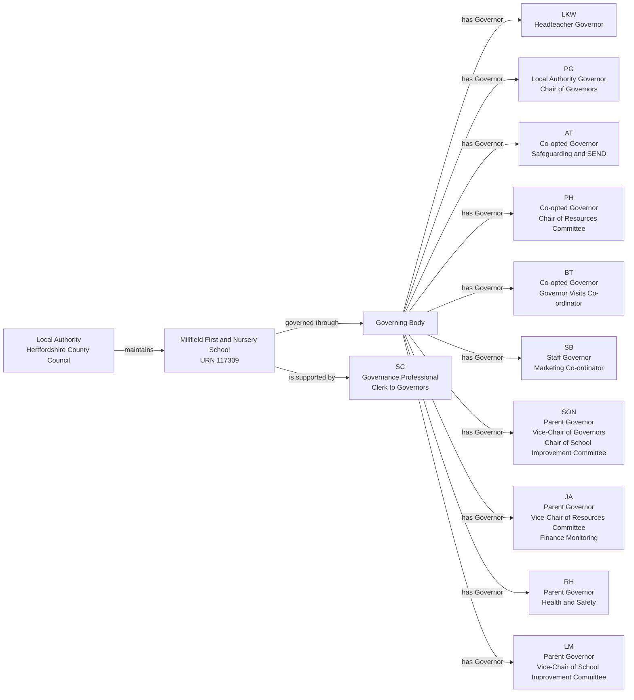
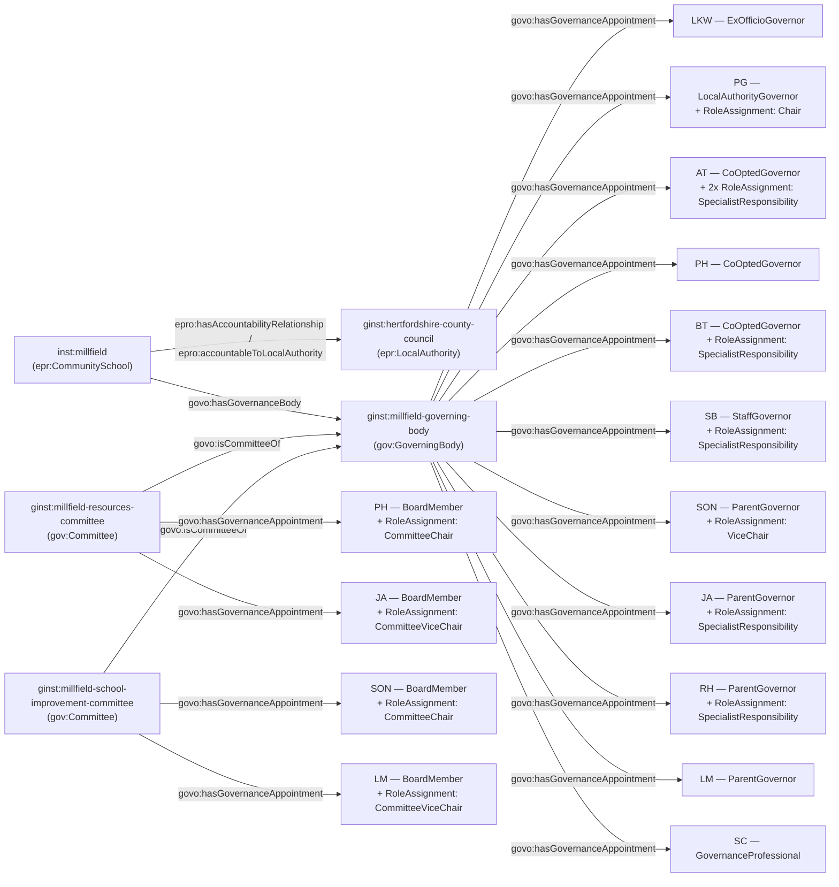

[← Worked examples](../)

# Governance Ontology — Millfield First and Nursery School example

| | |
|---|---|
| **School** | Millfield First and Nursery School — URN 117309 |
| **Local Authority** | Hertfordshire County Council |
| **Establishment type** | Community school (LA maintained) |
| **Governance ontology namespace** | `https://dfe-digital.github.io/education-provider-registry-docs/models/governance/ontology/` |
| **Governance vocabulary namespace** | `https://dfe-digital.github.io/education-provider-registry-docs/models/governance/vocabulary/` |
| **Preferred prefixes** | `govo:` (properties) · `gov:` (classes and named individuals) · `epr:`/`epro:` (reused from the main EPR ontology) |
| **OWL documentation** | [Governance ontology reference (WIDOCO)](../../ontology/) |
| **Source** | [governance-ontology.ttl](https://github.com/DFE-Digital/education-provider-registry-docs/blob/main/models/governance/governance-ontology.ttl) |
| **Repository** | [DFE-Digital/education-provider-registry-docs](https://github.com/DFE-Digital/education-provider-registry-docs) |
| **Licence** | [Open Government Licence v3.0](https://www.nationalarchives.gov.uk/doc/open-government-licence/version/3/) |

---

**Evidence and anonymisation.** This page is in two parts. **Section 1** is the real-world governance structure as documented in a bounded, sourced internal investigation ("Governance Model With Worked LA-Maintained Community School Example: Millfield First and Nursery School") - what the school itself publishes, independent of any ontology. **Section 2** maps that same structure onto `governance-ontology.ttl`. Neither section is itself GIAS data, and the source investigation is not published in this repository.

Person names throughout are shown as initials, exactly as the source investigation anonymised them (e.g. `LKW`, `PG`) - this example does not use, and has not gone back to, the school's full published names. All 10 governors and the Governance Professional are shown in both sections; nothing is trimmed for this example.

---

## Section 1 — The real-world governance structure

This section is the structure as evidenced, before any ontology is applied.

### Sources

| Source | Publisher | What it evidences | Observed |
|---|---|---|---|
| [Our Governors](https://www.millfield.herts.sch.uk/our-governors/) | Millfield First and Nursery School | Ten published Governor profiles, categories, terms, Chair and Vice-Chair responsibilities, committee roles, link roles and Governance Professional Clerk | 27 July 2026 |
| [GIAS Governance: Millfield First and Nursery School, URN 117309](https://www.get-information-schools.service.gov.uk/Establishments/Establishment/Details/117309#school-governance) | GIAS | Open community-school status, Hertfordshire Local Authority, current Chair, Governor and Governance Professional records, appointment routes and dates | 27 July 2026 |

All ten published governors correspond to GIAS at the name-assertion level - a closer match than several of the earlier worked examples. GIAS does not, however, represent any of the school's published committee roles or link responsibilities. `PG`'s published Chair term ends December 2025; GIAS separately records a new Chair term for the same person from December 2025 to December 2029 - this may be a reappointment, but neither source explicitly links the two records, so both are preserved separately here rather than inferring the connection.

### Structure

Adapted from the source investigation's own instance-level mapping.



The diagram represents the real-world governing body, not registry records. URN `117309` is an identifier and evidence, not a model entity in its own right. `JA` and `LM` are Vice-Chair of a specific committee, not of the Governing Body itself - a distinct concept from `SON`'s Vice-Chair of the Governing Body - see Example 6.

---

## Section 2 — Modelled in the governance ontology

The same governors, bodies and appointments from Section 1, expressed in Turtle using `governance-ontology.ttl` (`gov:`/`govo:`).

### Structure



### Namespace prefixes

All examples in this section use the following prefixes.

```
@prefix gov:   <https://dfe-digital.github.io/education-provider-registry-docs/models/governance/vocabulary/> .
@prefix govo:  <https://dfe-digital.github.io/education-provider-registry-docs/models/governance/ontology/> .
@prefix epr:   <https://dfe-digital.github.io/education-provider-registry-docs/vocabulary/> .
@prefix epro:  <https://dfe-digital.github.io/education-provider-registry-docs/ontology/> .
@prefix rdf:   <http://www.w3.org/1999/02/22-rdf-syntax-ns#> .
@prefix rdfs:  <http://www.w3.org/2000/01/rdf-schema#> .
@prefix owl:   <http://www.w3.org/2002/07/owl#> .
@prefix xsd:   <http://www.w3.org/2001/XMLSchema#> .
@prefix inst:  <https://dfe-digital.github.io/education-provider-registry-docs/establishment/> .
@prefix ginst: <https://dfe-digital.github.io/education-provider-registry-docs/models/governance/instance/> .
```

### Example 1 — Establishment, Local Authority accountability and Governing Body identity

The same pattern as Gilded Hollins Community School: `epr:CommunitySchool`, `epro:hasAccountabilityRelationship` + `epro:accountableToLocalAuthority`, and a single `gov:GoverningBody`.

```
ginst:hertfordshire-county-council
    a epr:LocalAuthority ;
    rdfs:label "Hertfordshire County Council"@en .

inst:millfield
    a epr:CommunitySchool ;
    rdfs:label "Millfield First and Nursery School"@en ;

    epro:hasEstablishmentIdentity [
        a epr:EstablishmentIdentity ;
        epro:identifiedByUrn [
            a epr:UniqueReferenceNumber ;
            rdfs:label "117309"
        ]
    ] ;

    epro:hasAccountabilityRelationship [
        a epr:EstablishmentAccountability ;
        epro:accountableToLocalAuthority ginst:hertfordshire-county-council
    ] .

ginst:millfield-governing-body
    a gov:GoverningBody ;
    rdfs:label "Millfield First and Nursery School — Governing Body"@en .

inst:millfield
    govo:hasGovernanceBody ginst:millfield-governing-body .
```

### Example 2 — Headteacher and Local Authority Governor

```
ginst:person-lkw
    a gov:GovernancePerson ;
    rdfs:label "LKW"@en .

ginst:appointment-lkw-governor
    a gov:GovernanceAppointment ;
    govo:appointmentOf ginst:person-lkw ;
    govo:hasRoleType gov:ExOfficioGovernor ;
    govo:hasAppointingBody gov:ExOfficioAppointment ;
    govo:hasAppointmentBasis gov:StatutoryGovernanceAppointment ;
    rdfs:comment "Headteacher Governor - ex-officio by virtue of that post."@en .

ginst:millfield-governing-body
    govo:hasGovernanceAppointment ginst:appointment-lkw-governor .

ginst:person-pg
    a gov:GovernancePerson ;
    rdfs:label "PG"@en .

ginst:appointment-pg-governor
    a gov:GovernanceAppointment ;
    govo:appointmentOf ginst:person-pg ;
    govo:hasRoleType gov:LocalAuthorityGovernor ;
    govo:hasAppointingBody gov:AppointedByLocalAuthority ;
    govo:hasAppointmentBasis gov:StatutoryGovernanceAppointment ;
    rdfs:comment "GIAS separately records PG's Chair term as nominated by the Local Authority and appointed by the Governing Body - consistent with, but more specific than, the school's own 'Local Authority Governor' category."@en .

ginst:millfield-governing-body
    govo:hasGovernanceAppointment ginst:appointment-pg-governor .

ginst:roleassignment-pg-chair
    a gov:RoleAssignment ;
    govo:layeredOn ginst:appointment-pg-governor ;
    govo:assignsRole gov:Chair .
```

### Example 3 — Co-opted governors with named responsibilities

```
ginst:person-at
    a gov:GovernancePerson ;
    rdfs:label "AT"@en .

ginst:appointment-at-governor
    a gov:GovernanceAppointment ;
    govo:appointmentOf ginst:person-at ;
    govo:hasRoleType gov:CoOptedGovernor ;
    govo:hasAppointingBody gov:AppointedByGoverningBody ;
    govo:hasAppointmentBasis gov:StatutoryGovernanceAppointment .

ginst:millfield-governing-body
    govo:hasGovernanceAppointment ginst:appointment-at-governor .

ginst:roleassignment-at-safeguarding
    a gov:RoleAssignment ;
    govo:layeredOn ginst:appointment-at-governor ;
    govo:assignsRole gov:SpecialistResponsibility ;
    rdfs:comment "Safeguarding."@en .

ginst:roleassignment-at-send
    a gov:RoleAssignment ;
    govo:layeredOn ginst:appointment-at-governor ;
    govo:assignsRole gov:SpecialistResponsibility ;
    rdfs:comment "SEND."@en .

ginst:person-bt
    a gov:GovernancePerson ;
    rdfs:label "BT"@en .

ginst:appointment-bt-governor
    a gov:GovernanceAppointment ;
    govo:appointmentOf ginst:person-bt ;
    govo:hasRoleType gov:CoOptedGovernor ;
    govo:hasAppointingBody gov:AppointedByGoverningBody ;
    govo:hasAppointmentBasis gov:StatutoryGovernanceAppointment .

ginst:millfield-governing-body
    govo:hasGovernanceAppointment ginst:appointment-bt-governor .

ginst:roleassignment-bt-governorvisits
    a gov:RoleAssignment ;
    govo:layeredOn ginst:appointment-bt-governor ;
    govo:assignsRole gov:SpecialistResponsibility ;
    rdfs:comment "Governor Visits Co-ordinator."@en .
```

### Example 4 — Staff and Parent governors with named responsibilities

```
ginst:person-sb
    a gov:GovernancePerson ;
    rdfs:label "SB"@en .

ginst:appointment-sb-governor
    a gov:GovernanceAppointment ;
    govo:appointmentOf ginst:person-sb ;
    govo:hasRoleType gov:StaffGovernor ;
    govo:hasAppointingBody gov:ElectedByStaff ;
    govo:hasAppointmentBasis gov:StatutoryGovernanceAppointment .

ginst:millfield-governing-body
    govo:hasGovernanceAppointment ginst:appointment-sb-governor .

ginst:roleassignment-sb-marketing
    a gov:RoleAssignment ;
    govo:layeredOn ginst:appointment-sb-governor ;
    govo:assignsRole gov:SpecialistResponsibility ;
    rdfs:comment "Marketing Co-ordinator."@en .

ginst:person-rh
    a gov:GovernancePerson ;
    rdfs:label "RH"@en .

ginst:appointment-rh-governor
    a gov:GovernanceAppointment ;
    govo:appointmentOf ginst:person-rh ;
    govo:hasRoleType gov:ParentGovernor ;
    govo:hasAppointingBody gov:ElectedByParents ;
    govo:hasAppointmentBasis gov:StatutoryGovernanceAppointment .

ginst:millfield-governing-body
    govo:hasGovernanceAppointment ginst:appointment-rh-governor .

ginst:roleassignment-rh-healthandsafety
    a gov:RoleAssignment ;
    govo:layeredOn ginst:appointment-rh-governor ;
    govo:assignsRole gov:SpecialistResponsibility ;
    rdfs:comment "Health and Safety."@en .
```

### Example 5 — Committees and Committee Chairs

`PH` and `SON` each hold a second, committee-level appointment in addition to their base Governing Body appointment, the same dual-appointment pattern as Frank Barnes and Manor High - `PH` chairs Resources Committee, `SON` chairs School Improvement Committee, each via `gov:CommitteeChair` layered on the committee appointment, not the base one.

```
ginst:millfield-resources-committee
    a gov:Committee ;
    rdfs:label "Millfield First and Nursery School — Resources Committee"@en ;
    govo:isCommitteeOf ginst:millfield-governing-body .

ginst:millfield-school-improvement-committee
    a gov:Committee ;
    rdfs:label "Millfield First and Nursery School — School Improvement Committee"@en ;
    govo:isCommitteeOf ginst:millfield-governing-body .

ginst:person-ph
    a gov:GovernancePerson ;
    rdfs:label "PH"@en .

ginst:appointment-ph-governor
    a gov:GovernanceAppointment ;
    govo:appointmentOf ginst:person-ph ;
    govo:hasRoleType gov:CoOptedGovernor ;
    govo:hasAppointingBody gov:AppointedByGoverningBody ;
    govo:hasAppointmentBasis gov:StatutoryGovernanceAppointment .

ginst:millfield-governing-body
    govo:hasGovernanceAppointment ginst:appointment-ph-governor .

ginst:appointment-ph-committee
    a gov:GovernanceAppointment ;
    govo:appointmentOf ginst:person-ph ;
    govo:hasRoleType gov:BoardMember ;
    govo:hasAppointmentBasis gov:StatutoryGovernanceAppointment ;
    rdfs:comment "PH's committee-level appointment, distinct from PH's Governing Body appointment above."@en .

ginst:millfield-resources-committee
    govo:hasGovernanceAppointment ginst:appointment-ph-committee .

ginst:roleassignment-ph-committeechair
    a gov:RoleAssignment ;
    govo:layeredOn ginst:appointment-ph-committee ;
    govo:assignsRole gov:CommitteeChair .

ginst:person-son
    a gov:GovernancePerson ;
    rdfs:label "SON"@en .

ginst:appointment-son-governor
    a gov:GovernanceAppointment ;
    govo:appointmentOf ginst:person-son ;
    govo:hasRoleType gov:ParentGovernor ;
    govo:hasAppointingBody gov:ElectedByParents ;
    govo:hasAppointmentBasis gov:StatutoryGovernanceAppointment .

ginst:millfield-governing-body
    govo:hasGovernanceAppointment ginst:appointment-son-governor .

ginst:roleassignment-son-vicechair
    a gov:RoleAssignment ;
    govo:layeredOn ginst:appointment-son-governor ;
    govo:assignsRole gov:ViceChair ;
    rdfs:comment "Vice-Chair of the Governing Body itself - a different concept from Committee Vice-Chair, see Example 6."@en .

ginst:appointment-son-committee
    a gov:GovernanceAppointment ;
    govo:appointmentOf ginst:person-son ;
    govo:hasRoleType gov:BoardMember ;
    govo:hasAppointmentBasis gov:StatutoryGovernanceAppointment ;
    rdfs:comment "SON's committee-level appointment, distinct from SON's Governing Body appointment above."@en .

ginst:millfield-school-improvement-committee
    govo:hasGovernanceAppointment ginst:appointment-son-committee .

ginst:roleassignment-son-committeechair
    a gov:RoleAssignment ;
    govo:layeredOn ginst:appointment-son-committee ;
    govo:assignsRole gov:CommitteeChair .
```

### Example 6 — Committee Vice-Chairs

`JA` and `LM` are each Vice-Chair of a specific committee, not of the Governing Body - a different concept from `SON`'s Vice-Chair in Example 5. No `GovernanceRoleType` individual covered this until now: `gov:CommitteeChair` already existed as the committee-specific counterpart to `gov:Chair`, but nothing mirrored it for `gov:ViceChair`. `gov:CommitteeViceChair` was added directly from this finding.

```
ginst:person-ja
    a gov:GovernancePerson ;
    rdfs:label "JA"@en .

ginst:appointment-ja-governor
    a gov:GovernanceAppointment ;
    govo:appointmentOf ginst:person-ja ;
    govo:hasRoleType gov:ParentGovernor ;
    govo:hasAppointingBody gov:ElectedByParents ;
    govo:hasAppointmentBasis gov:StatutoryGovernanceAppointment .

ginst:millfield-governing-body
    govo:hasGovernanceAppointment ginst:appointment-ja-governor .

ginst:roleassignment-ja-financemonitoring
    a gov:RoleAssignment ;
    govo:layeredOn ginst:appointment-ja-governor ;
    govo:assignsRole gov:SpecialistResponsibility ;
    rdfs:comment "Finance Monitoring."@en .

ginst:appointment-ja-committee
    a gov:GovernanceAppointment ;
    govo:appointmentOf ginst:person-ja ;
    govo:hasRoleType gov:BoardMember ;
    govo:hasAppointmentBasis gov:StatutoryGovernanceAppointment ;
    rdfs:comment "JA's committee-level appointment, distinct from JA's Governing Body appointment above."@en .

ginst:millfield-resources-committee
    govo:hasGovernanceAppointment ginst:appointment-ja-committee .

ginst:roleassignment-ja-committeevicechair
    a gov:RoleAssignment ;
    govo:layeredOn ginst:appointment-ja-committee ;
    govo:assignsRole gov:CommitteeViceChair .

ginst:person-lm
    a gov:GovernancePerson ;
    rdfs:label "LM"@en .

ginst:appointment-lm-governor
    a gov:GovernanceAppointment ;
    govo:appointmentOf ginst:person-lm ;
    govo:hasRoleType gov:ParentGovernor ;
    govo:hasAppointingBody gov:ElectedByParents ;
    govo:hasAppointmentBasis gov:StatutoryGovernanceAppointment .

ginst:millfield-governing-body
    govo:hasGovernanceAppointment ginst:appointment-lm-governor .

ginst:appointment-lm-committee
    a gov:GovernanceAppointment ;
    govo:appointmentOf ginst:person-lm ;
    govo:hasRoleType gov:BoardMember ;
    govo:hasAppointmentBasis gov:StatutoryGovernanceAppointment ;
    rdfs:comment "LM's committee-level appointment, distinct from LM's Governing Body appointment above."@en .

ginst:millfield-school-improvement-committee
    govo:hasGovernanceAppointment ginst:appointment-lm-committee .

ginst:roleassignment-lm-committeevicechair
    a gov:RoleAssignment ;
    govo:layeredOn ginst:appointment-lm-committee ;
    govo:assignsRole gov:CommitteeViceChair .
```

### Example 7 — Clerk

```
ginst:person-sc
    a gov:GovernancePerson ;
    rdfs:label "SC"@en .

ginst:appointment-sc-governanceprofessional
    a gov:GovernanceAppointment ;
    govo:appointmentOf ginst:person-sc ;
    govo:hasRoleType gov:GovernanceProfessional ;
    govo:hasAppointmentBasis gov:ProfessionalSupportRole ;
    rdfs:comment "Clerk to Governors, supporting the Governing Body."@en .

ginst:millfield-governing-body
    govo:hasGovernanceAppointment ginst:appointment-sc-governanceprofessional .
```

---

## Concept coverage

| Real-world concept | Millfield evidence | Ontology mapping | Fit |
|---|---|---|---|
| Community school | Millfield First and Nursery School, URN 117309 | `epr:CommunitySchool` | Direct |
| Maintaining Local Authority | Hertfordshire County Council | `epr:LocalAuthority` + `epro:hasAccountabilityRelationship` + `epro:accountableToLocalAuthority` | Direct |
| Governing Body | The statutory governing body | `gov:GoverningBody` + `govo:hasGovernanceBody` | Direct |
| Governor categories | Headteacher, Local Authority, Co-opted, Staff, Parent | `govo:hasRoleType` (`gov:ExOfficioGovernor`, `gov:LocalAuthorityGovernor`, `gov:CoOptedGovernor`, `gov:StaffGovernor`, `gov:ParentGovernor`) | Direct - a true SI 2012/1034 maintained-school governing body |
| Chair / Vice-Chair of the Governing Body | PG (Chair), SON (Vice-Chair) | `gov:RoleAssignment` + `govo:assignsRole` (`gov:Chair`, `gov:ViceChair`) | Direct |
| Committees | Resources Committee, School Improvement Committee | `gov:Committee` + `govo:isCommitteeOf` | Direct |
| Committee membership | PH, JA, SON, LM | `gov:GovernanceAppointment` (`govo:hasRoleType gov:BoardMember`), attached to the committee | Candidate - no committee-member-specific role type exists |
| Committee Chair | PH (Resources), SON (School Improvement) | `gov:RoleAssignment` + `govo:assignsRole gov:CommitteeChair` | Direct |
| Committee Vice-Chair | JA (Resources), LM (School Improvement) | `gov:RoleAssignment` + `govo:assignsRole gov:CommitteeViceChair` | Direct - `gov:CommitteeViceChair` added to the ontology from this finding |
| Named subject/link responsibilities | Safeguarding, SEND, Governor Visits Co-ordinator, Marketing Co-ordinator, Finance Monitoring, Health and Safety | `gov:RoleAssignment` + `govo:assignsRole gov:SpecialistResponsibility`, topic in `rdfs:comment` | Direct |
| Governance Professional / Clerk | SC | `govo:hasRoleType gov:GovernanceProfessional`, `govo:hasAppointmentBasis gov:ProfessionalSupportRole` | Direct |
| Constitution, vacancies, full committee membership, interests, attendance | Not published on the school's own page | Not modelled | Not evidenced |

---

**See also:** [Governance vocabulary](../../vocabulary/) · [Governance taxonomy](../../taxonomy/) · [Governance ontology](../../ontology/) · [Governance ontology graph viewer](../../ontology/webvowl/)
