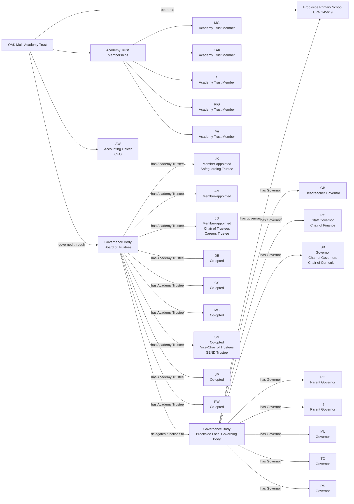
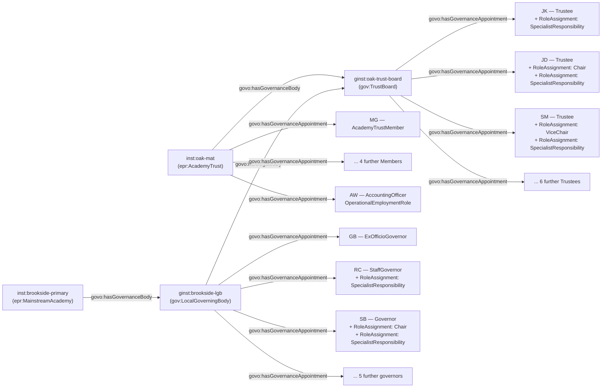

[← Worked examples](../)

# Governance Ontology — OAK Multi Academy Trust / Brookside Primary School example

| | |
|---|---|
| **Academy Trust** | OAK Multi Academy Trust — GIAS UID 16991 |
| **Academy** | Brookside Primary School — URN 145619 |
| **Establishment type** | MAT — Trust-level detail, plus one academy's Local Governing Body |
| **Governance ontology namespace** | `https://dfe-digital.github.io/education-provider-registry-docs/models/governance/ontology/` |
| **Governance vocabulary namespace** | `https://dfe-digital.github.io/education-provider-registry-docs/models/governance/vocabulary/` |
| **Preferred prefixes** | `govo:` (properties) · `gov:` (classes and named individuals) · `epr:`/`epro:` (reused from the main EPR ontology) |
| **OWL documentation** | [Governance ontology reference (WIDOCO)](../../ontology/) |
| **Source** | [governance-ontology.ttl](https://github.com/DFE-Digital/education-provider-registry-docs/blob/main/models/governance/governance-ontology.ttl) |
| **Repository** | [DFE-Digital/education-provider-registry-docs](https://github.com/DFE-Digital/education-provider-registry-docs) |
| **Licence** | [Open Government Licence v3.0](https://www.nationalarchives.gov.uk/doc/open-government-licence/version/3/) |

---

**Evidence and anonymisation.** This page is in two parts. **Section 1** is the real-world governance structure as documented in a bounded, sourced internal investigation ("Governance Model With Worked MAT Example: OAK Multi Academy Trust and Brookside Primary School") - what the Trust and school themselves publish, independent of any ontology. **Section 2** maps that same structure onto `governance-ontology.ttl`. Neither section is itself GIAS data, and the source investigation is not published in this repository.

This page fills in the Trust-level detail the [Manor High School worked example](../manor-high/) deliberately left out of scope - `inst:oak-mat` and `ginst:oak-trust-board` are the **same instances** declared there, so the two pages describe one coherent OAK Multi Academy Trust rather than two unrelated ones.

Person names throughout are shown as initials, exactly as the source investigation anonymised them. Each worked example page is independently scoped - initials are not durable person identifiers, and the same initials appearing on a different page is coincidental, not a claim that they're the same person. Within this page, no two different people share the same initials.

---

## Section 1 — The real-world governance structure

This section is the structure as evidenced, before any ontology is applied.

### Sources

| Source | Publisher | What it evidences | Observed |
|---|---|---|---|
| [How our governance works](https://www.oaktrust.org/governance/mat-structure/) | OAK Multi Academy Trust | OAK is led by Members and a Board of Trustees; each academy has its own Local Governing Body with delegated functions | 27 July 2026 |
| [Membership and Trustees](https://www.oaktrust.org/governance/membership-and-trustees/) | OAK Multi Academy Trust | Five published Members, nine published Trustees, Trustee appointment routes, Chair and Vice-Chair roles, and the Accounting Officer/CEO | 27 July 2026 |
| [Local Governing Bodies](https://www.oaktrust.org/governance/local-governing-bodies/) | OAK Multi Academy Trust | Brookside has a Local Governing Body; its published Chair is identified | 27 July 2026 |
| [Meet the Governors](https://www.brookside.leics.sch.uk/about-us/meet-the-governors-2/) | Brookside Primary School | Brookside's published governor list, available governor categories, Chair and other stated responsibilities | 27 July 2026 |
| [GIAS: OAK Multi Academy Trust, UID 16991](https://www.get-information-schools.service.gov.uk/Groups/Group/Details/16991) | GIAS | Trust governance records, Members, Trustees, Accounting Officer and CFO | 27 July 2026 |
| [GIAS: Brookside Primary School Governance, URN 145619](https://www.get-information-schools.service.gov.uk/Establishments/Establishment/Details/145619#school-governance) | GIAS | Chair of local governing body and local-governor records | 27 July 2026 |

The Members, Trustees and Accounting Officer populations correspond between the Trust's own pages and GIAS at the name-assertion level. Two things GIAS doesn't represent: the Trust page's Chair-of-Trustees responsibility (GIAS has no current "Chair of trustees" record at all, though it does record every Trustee), and Brookside's published Finance/Curriculum chair responsibilities. `RC`'s published term end (September 2024) and GIAS's term (October 2024 to October 2032) may reflect an unexpressed reappointment - neither source explicitly says so, so both are preserved separately.

### Structure

Adapted from the source investigation's own instance-level mapping.



The diagram represents the real-world OAK Multi Academy Trust, not registry records. `ML`, `TC` and `RS` are published with no category or role beyond "Governor" - the source does not invent one for them.

---

## Section 2 — Modelled in the governance ontology

The same people, bodies and appointments from Section 1, expressed in Turtle using `governance-ontology.ttl` (`gov:`/`govo:`).

### Structure



### Namespace prefixes

All examples in this section use the following prefixes.

```
@prefix gov:   <https://dfe-digital.github.io/education-provider-registry-docs/models/governance/vocabulary/> .
@prefix govo:  <https://dfe-digital.github.io/education-provider-registry-docs/models/governance/ontology/> .
@prefix epr:   <https://dfe-digital.github.io/education-provider-registry-docs/vocabulary/> .
@prefix epro:  <https://dfe-digital.github.io/education-provider-registry-docs/ontology/> .
@prefix rdf:   <http://www.w3.org/1999/02/22-rdf-syntax-ns#> .
@prefix rdfs:  <http://www.w3.org/2000/01/rdf-schema#> .
@prefix owl:   <http://www.w3.org/2002/07/owl#> .
@prefix xsd:   <http://www.w3.org/2001/XMLSchema#> .
@prefix inst:  <https://dfe-digital.github.io/education-provider-registry-docs/establishment/> .
@prefix ginst: <https://dfe-digital.github.io/education-provider-registry-docs/models/governance/instance/> .
```

### Example 1 — Academy Trust, Trust Board and Academy Trust Members

`inst:oak-mat` and `ginst:oak-trust-board` are declared identically to the [Manor High School worked example](../manor-high/) - the same Trust, the same Trust Board, not redeclared as new instances. Academy Trust Membership is a company-membership relationship, distinct from Trusteeship - `govo:hasAppointmentBasis gov:DelegatedGovernanceAppointment` throughout this page, since none of OAK's own governance derives from a statute governing maintained schools.

```
inst:oak-mat
    a epr:AcademyTrust ;
    rdfs:label "OAK Multi Academy Trust"@en .

ginst:oak-trust-board
    a gov:TrustBoard ;
    rdfs:label "OAK Multi Academy Trust — Trust Board"@en .

inst:oak-mat
    govo:hasGovernanceBody ginst:oak-trust-board .

ginst:person-mg
    a gov:GovernancePerson ;
    rdfs:label "MG"@en .

ginst:appointment-mg-member
    a gov:GovernanceAppointment ;
    govo:appointmentOf ginst:person-mg ;
    govo:hasRoleType gov:AcademyTrustMember ;
    govo:hasAppointmentBasis gov:DelegatedGovernanceAppointment .

inst:oak-mat
    govo:hasGovernanceAppointment ginst:appointment-mg-member .

ginst:person-kak
    a gov:GovernancePerson ;
    rdfs:label "KAK"@en .

ginst:appointment-kak-member
    a gov:GovernanceAppointment ;
    govo:appointmentOf ginst:person-kak ;
    govo:hasRoleType gov:AcademyTrustMember ;
    govo:hasAppointmentBasis gov:DelegatedGovernanceAppointment .

inst:oak-mat
    govo:hasGovernanceAppointment ginst:appointment-kak-member .
```

*(3 further Academy Trust Members - `DT`, `RIG`, `PH` - are evidenced in the source and not shown here.)*

### Example 2 — Member-appointed Trustees, Chair and specialist Trustee responsibilities

Three Trustees are Member-appointed (`govo:hasAppointingBody gov:AppointedByAcademyMembers`), distinct from the six Co-opted Trustees in Example 3. `JD` chairs the Board of Trustees; `JD` and `JK` each also hold a named specialist Trustee responsibility (Careers, Safeguarding) - `gov:SpecialistResponsibility` again, the same value used for governor link responsibilities at Gilded Hollins and Millfield, now shown at Trustee level too. Every Trustee automatically holds the Company Director legal capacity alongside the Charity Trustee appointment itself.

```
ginst:person-jk
    a gov:GovernancePerson ;
    rdfs:label "JK"@en .

ginst:appointment-jk-trustee
    a gov:GovernanceAppointment ;
    govo:appointmentOf ginst:person-jk ;
    govo:hasRoleType gov:Trustee ;
    govo:hasAppointingBody gov:AppointedByAcademyMembers ;
    govo:hasAppointmentBasis gov:DelegatedGovernanceAppointment ;
    govo:hasLegalCapacity gov:CompanyDirector .

ginst:oak-trust-board
    govo:hasGovernanceAppointment ginst:appointment-jk-trustee .

ginst:roleassignment-jk-safeguarding
    a gov:RoleAssignment ;
    govo:layeredOn ginst:appointment-jk-trustee ;
    govo:assignsRole gov:SpecialistResponsibility ;
    rdfs:comment "Safeguarding Trustee."@en .

ginst:person-jd
    a gov:GovernancePerson ;
    rdfs:label "JD"@en .

ginst:appointment-jd-trustee
    a gov:GovernanceAppointment ;
    govo:appointmentOf ginst:person-jd ;
    govo:hasRoleType gov:Trustee ;
    govo:hasAppointingBody gov:AppointedByAcademyMembers ;
    govo:hasAppointmentBasis gov:DelegatedGovernanceAppointment ;
    govo:hasLegalCapacity gov:CompanyDirector ;
    rdfs:comment "GIAS has no current 'Chair of trustees' record for OAK at all, though it records every Trustee - the Chair responsibility is taken from the Trust's own page, not inferred absent from GIAS."@en .

ginst:oak-trust-board
    govo:hasGovernanceAppointment ginst:appointment-jd-trustee .

ginst:roleassignment-jd-chair
    a gov:RoleAssignment ;
    govo:layeredOn ginst:appointment-jd-trustee ;
    govo:assignsRole gov:Chair .

ginst:roleassignment-jd-careers
    a gov:RoleAssignment ;
    govo:layeredOn ginst:appointment-jd-trustee ;
    govo:assignsRole gov:SpecialistResponsibility ;
    rdfs:comment "Careers Trustee."@en .

ginst:person-am
    a gov:GovernancePerson ;
    rdfs:label "AM"@en .

ginst:appointment-am-trustee
    a gov:GovernanceAppointment ;
    govo:appointmentOf ginst:person-am ;
    govo:hasRoleType gov:Trustee ;
    govo:hasAppointingBody gov:AppointedByAcademyMembers ;
    govo:hasAppointmentBasis gov:DelegatedGovernanceAppointment ;
    govo:hasLegalCapacity gov:CompanyDirector .

ginst:oak-trust-board
    govo:hasGovernanceAppointment ginst:appointment-am-trustee .
```

### Example 3 — Co-opted Trustees, Vice-Chair and a further specialist responsibility

```
ginst:person-db
    a gov:GovernancePerson ;
    rdfs:label "DB"@en .

ginst:appointment-db-trustee
    a gov:GovernanceAppointment ;
    govo:appointmentOf ginst:person-db ;
    govo:hasRoleType gov:Trustee ;
    govo:hasAppointingBody gov:AppointedByGoverningBody ;
    govo:hasAppointmentBasis gov:DelegatedGovernanceAppointment ;
    govo:hasLegalCapacity gov:CompanyDirector ;
    rdfs:comment "Co-opted - gov:AppointedByGoverningBody is the closest candidate value for co-option by the Trust Board itself."@en .

ginst:oak-trust-board
    govo:hasGovernanceAppointment ginst:appointment-db-trustee .

ginst:person-gs
    a gov:GovernancePerson ;
    rdfs:label "GS"@en .

ginst:appointment-gs-trustee
    a gov:GovernanceAppointment ;
    govo:appointmentOf ginst:person-gs ;
    govo:hasRoleType gov:Trustee ;
    govo:hasAppointingBody gov:AppointedByGoverningBody ;
    govo:hasAppointmentBasis gov:DelegatedGovernanceAppointment ;
    govo:hasLegalCapacity gov:CompanyDirector .

ginst:oak-trust-board
    govo:hasGovernanceAppointment ginst:appointment-gs-trustee .

ginst:person-sm
    a gov:GovernancePerson ;
    rdfs:label "SM"@en .

ginst:appointment-sm-trustee
    a gov:GovernanceAppointment ;
    govo:appointmentOf ginst:person-sm ;
    govo:hasRoleType gov:Trustee ;
    govo:hasAppointingBody gov:AppointedByGoverningBody ;
    govo:hasAppointmentBasis gov:DelegatedGovernanceAppointment ;
    govo:hasLegalCapacity gov:CompanyDirector .

ginst:oak-trust-board
    govo:hasGovernanceAppointment ginst:appointment-sm-trustee .

ginst:roleassignment-sm-vicechair
    a gov:RoleAssignment ;
    govo:layeredOn ginst:appointment-sm-trustee ;
    govo:assignsRole gov:ViceChair .

ginst:roleassignment-sm-send
    a gov:RoleAssignment ;
    govo:layeredOn ginst:appointment-sm-trustee ;
    govo:assignsRole gov:SpecialistResponsibility ;
    rdfs:comment "SEND Trustee."@en .
```

*(3 further Co-opted Trustees - `MS`, `JP`, `PW` - are evidenced in the source and not shown here.)*

### Example 4 — Accounting Officer / CEO

```
ginst:person-aw
    a gov:GovernancePerson ;
    rdfs:label "AW"@en .

ginst:appointment-aw-ao
    a gov:GovernanceAppointment ;
    govo:appointmentOf ginst:person-aw ;
    govo:hasRoleType gov:AccountingOfficer ;
    govo:hasAppointmentBasis gov:OperationalEmploymentRole ;
    rdfs:comment "Accounting Officer and Chief Executive Officer. GIAS additionally records a CFO that OAK's own page (as used in this investigation) does not publish - no comparison of that role is possible from this evidence."@en .

inst:oak-mat
    govo:hasGovernanceAppointment ginst:appointment-aw-ao .
```

### Example 5 — Brookside Local Governing Body: delegation and governance scope

`ginst:brookside-lgb` is delegated by the **same** `ginst:oak-trust-board` declared in Example 1 - the same Trust Board Manor High's Local Governing Body is also delegated by, since both academies belong to the same Trust.

```
inst:brookside-primary
    a epr:MainstreamAcademy ;
    rdfs:label "Brookside Primary School"@en ;
    epro:hasEstablishmentIdentity [
        a epr:EstablishmentIdentity ;
        epro:identifiedByUrn [
            a epr:UniqueReferenceNumber ;
            rdfs:label "145619"
        ]
    ] .

ginst:brookside-lgb
    a gov:LocalGoverningBody ;
    rdfs:label "Brookside Primary School — Local Governing Body"@en ;
    govo:isDelegatedBy ginst:oak-trust-board .

inst:brookside-primary
    govo:hasGovernanceBody ginst:brookside-lgb .
```

### Example 6 — Brookside governors, Chair and named responsibilities without an asserted Committee

`RC`'s "Chair of Finance" and `SB`'s "Chair of Curriculum" are modelled as `gov:SpecialistResponsibility`, not `gov:CommitteeChair` - unlike Millfield and Vauxhall, this source names no separate Finance or Curriculum Committee instance for Brookside, so no `gov:Committee` is asserted here for either to chair. `SB` is published only as "Governor" for their base category, the same evidence gap as Manor High's `JJ`.

```
ginst:person-gb
    a gov:GovernancePerson ;
    rdfs:label "GB"@en .

ginst:appointment-gb-governor
    a gov:GovernanceAppointment ;
    govo:appointmentOf ginst:person-gb ;
    govo:hasRoleType gov:ExOfficioGovernor ;
    govo:hasAppointingBody gov:ExOfficioAppointment ;
    govo:hasAppointmentBasis gov:DelegatedGovernanceAppointment ;
    rdfs:comment "Headteacher Governor - ex-officio by virtue of that post."@en .

ginst:brookside-lgb
    govo:hasGovernanceAppointment ginst:appointment-gb-governor .

ginst:person-rc
    a gov:GovernancePerson ;
    rdfs:label "RC"@en .

ginst:appointment-rc-governor
    a gov:GovernanceAppointment ;
    govo:appointmentOf ginst:person-rc ;
    govo:hasRoleType gov:StaffGovernor ;
    govo:hasAppointingBody gov:ElectedByStaff ;
    govo:hasAppointmentBasis gov:DelegatedGovernanceAppointment .

ginst:brookside-lgb
    govo:hasGovernanceAppointment ginst:appointment-rc-governor .

ginst:roleassignment-rc-finance
    a gov:RoleAssignment ;
    govo:layeredOn ginst:appointment-rc-governor ;
    govo:assignsRole gov:SpecialistResponsibility ;
    rdfs:comment "Chair of Finance - no separate Finance Committee instance is evidenced for Brookside, so this is modelled as a named responsibility rather than gov:CommitteeChair."@en .

ginst:person-sb
    a gov:GovernancePerson ;
    rdfs:label "SB"@en .

ginst:appointment-sb-governor
    a gov:GovernanceAppointment ;
    govo:appointmentOf ginst:person-sb ;
    govo:hasRoleType gov:Governor ;
    govo:hasAppointmentBasis gov:DelegatedGovernanceAppointment ;
    rdfs:comment "Published only as 'Governor' - no more specific category given, so the generic gov:Governor value is used and govo:hasAppointingBody is omitted rather than invented."@en .

ginst:brookside-lgb
    govo:hasGovernanceAppointment ginst:appointment-sb-governor .

ginst:roleassignment-sb-chair
    a gov:RoleAssignment ;
    govo:layeredOn ginst:appointment-sb-governor ;
    govo:assignsRole gov:Chair .

ginst:roleassignment-sb-curriculum
    a gov:RoleAssignment ;
    govo:layeredOn ginst:appointment-sb-governor ;
    govo:assignsRole gov:SpecialistResponsibility ;
    rdfs:comment "Chair of Curriculum - the same reasoning as RC's Chair of Finance above."@en .
```

*(5 further Brookside governors - `RO`, `IJ`, `ML`, `TC`, `RS` - are evidenced in the source and not shown here; `ML`, `TC` and `RS` are published with no category or role at all.)*

---

## Concept coverage

| Real-world concept | OAK/Brookside evidence | Ontology mapping | Fit |
|---|---|---|---|
| Academy Trust | OAK Multi Academy Trust, GIAS UID 16991 | `epr:AcademyTrust` (same instance as the Manor High worked example) | Direct |
| Trust Board | OAK's Board of Trustees | `gov:TrustBoard` (same instance as Manor High) | Direct |
| Academy | Brookside Primary School, URN 145619 | `epr:MainstreamAcademy` | Direct - academy route not published in this source, so `epro:hasAcademyRoute` is not asserted |
| Local Governing Body | Brookside's LGB, delegated by the Trust Board | `gov:LocalGoverningBody` + `govo:isDelegatedBy` + `govo:hasGovernanceBody` | Direct |
| Academy Trust Membership | 5 Members | `gov:AcademyTrustMember`, `govo:hasAppointmentBasis gov:DelegatedGovernanceAppointment`, attached directly to the Academy Trust | Direct |
| Trustee appointment routes | 3 Member-appointed, 6 Co-opted | `govo:hasAppointingBody` (`gov:AppointedByAcademyMembers`, `gov:AppointedByGoverningBody`) | Direct for Member-appointed; Candidate for Co-opted, reusing the closest value |
| Legal capacity | Every Trustee is also a Company Director | `govo:hasLegalCapacity gov:CompanyDirector` | Direct |
| Chair / Vice-Chair of Trustees | JD (Chair), SM (Vice-Chair) | `gov:RoleAssignment` + `govo:assignsRole` (`gov:Chair`, `gov:ViceChair`) | Direct |
| Specialist Trustee responsibilities | Safeguarding, Careers, SEND Trustee | `gov:RoleAssignment` + `govo:assignsRole gov:SpecialistResponsibility` | Direct - the same value used for governor link responsibilities, now at Trustee level |
| Accounting Officer / CEO | AW | `govo:hasRoleType gov:AccountingOfficer`, `govo:hasAppointmentBasis gov:OperationalEmploymentRole` | Direct |
| Brookside governor categories | Headteacher, Staff, Parent | `govo:hasRoleType` (`gov:ExOfficioGovernor`, `gov:StaffGovernor`, `gov:ParentGovernor`) | Candidate - Brookside's LGB is not a statutory maintained-school body |
| Chair of Governors (Brookside) | SB | `gov:RoleAssignment` + `govo:assignsRole gov:Chair` | Direct |
| "Chair of Finance" / "Chair of Curriculum" | RC, SB | `gov:RoleAssignment` + `govo:assignsRole gov:SpecialistResponsibility` | Candidate - no Committee instance is evidenced for either, unlike Millfield/Vauxhall |
| Governors with no stated category | ML, TC, RS | `govo:hasRoleType gov:Governor` (generic), not shown in Section 2 | Candidate |
| Terms of office, interests, attendance, committee membership | Not published in this investigation | Not modelled | Not evidenced |

---

**See also:** [Manor High School worked example](../manor-high/) (the same OAK Multi Academy Trust) · [Governance vocabulary](../../vocabulary/) · [Governance taxonomy](../../taxonomy/) · [Governance ontology](../../ontology/) · [Governance ontology graph viewer](../../ontology/webvowl/)
