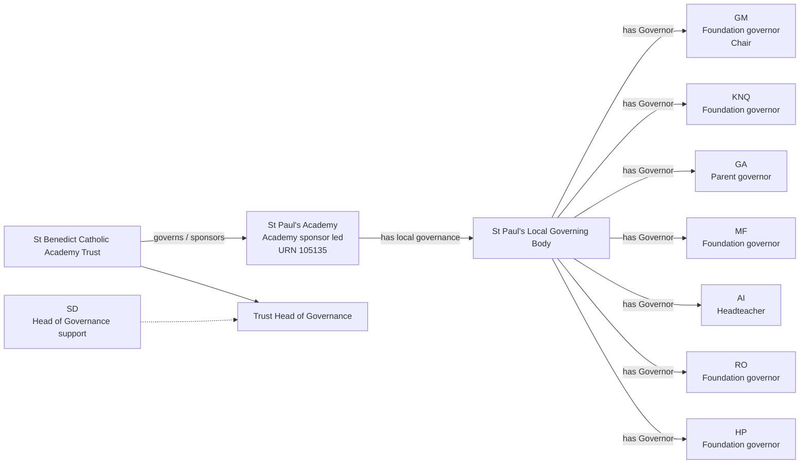
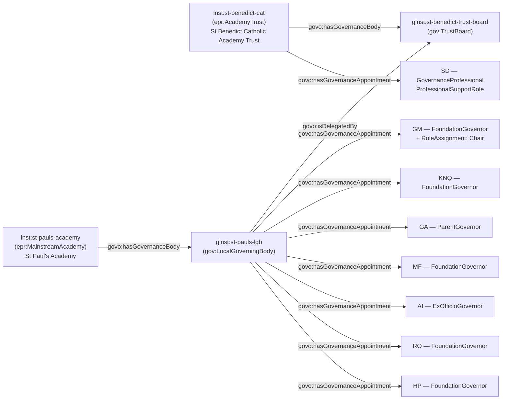

[← Worked examples](../)

# Governance Ontology — St Paul's Academy example

| | |
|---|---|
| **School** | St Paul's Academy — URN 105135 |
| **Academy Trust** | St Benedict Catholic Academy Trust — GIAS group 17729 |
| **Establishment type** | Academy sponsor led |
| **Governance ontology namespace** | `https://dfe-digital.github.io/education-provider-registry-docs/models/governance/ontology/` |
| **Governance vocabulary namespace** | `https://dfe-digital.github.io/education-provider-registry-docs/models/governance/vocabulary/` |
| **Preferred prefixes** | `govo:` (properties) · `gov:` (classes and named individuals) · `epr:`/`epro:` (reused from the main EPR ontology) |
| **OWL documentation** | [Governance ontology reference (WIDOCO)](../../ontology/) |
| **Source** | [governance-ontology.ttl](https://github.com/DFE-Digital/education-provider-registry-docs/blob/main/models/governance/governance-ontology.ttl) |
| **Repository** | [DFE-Digital/education-provider-registry-docs](https://github.com/DFE-Digital/education-provider-registry-docs) |
| **Licence** | [Open Government Licence v3.0](https://www.nationalarchives.gov.uk/doc/open-government-licence/version/3/) |

---

**Evidence and anonymisation.** This page is in two parts. **Section 1** is the real-world governance structure as documented in a bounded, sourced internal investigation ("St Paul's Academy: governance model worked example") - what the academy itself publishes, independent of any ontology. **Section 2** maps that same structure onto `governance-ontology.ttl`. Neither section is itself GIAS data, and the source investigation is not published in this repository.

Person names throughout are shown as initials, exactly as the source investigation anonymised them (e.g. `GM`, `KNQ`) - this example does not use, and has not gone back to, the academy's full published names. All 7 published local governors and the Trust's Head of Governance are shown in both sections; nothing is trimmed for this example.

---

## Section 1 — The real-world governance structure

This section is the structure as evidenced, before any ontology is applied.

### Sources

| Source | Publisher | What it evidences | Observed |
|---|---|---|---|
| [St Paul's Academy — Governing Body](https://www.stpaulsacademy.org.uk/page/?title=Governing+Body&pid=36) | St Paul's Academy | St Benedict Catholic Academy Trust relationship, local governing body membership, roles, terms of office and Head of Governance contact | 27 July 2026 |
| [GIAS — St Paul's Academy, URN 105135, Governance tab](https://www.get-information-schools.service.gov.uk/Establishments/Establishment/Details/105135#school-governance) | GIAS | Academy sponsor led classification, academy trust link, current local-governor rows, GIDs and appointment dates | 27 July 2026 |

GIAS's current population is close to the academy's published page but not identical - GIAS additionally records `SJ` and `GD`, who don't appear on the observed academy page, and doesn't show `GM` as Chair. Both sources are shown as separately time-qualified assertions, not merged into one roster. The academy's own page does not publish the Trust's Members, Trustees or other Trust-wide governance - only its own local governing body and its link to the Trust's Head of Governance.

### Structure

Adapted from the source investigation's own instance-level mapping.



The diagram represents the real-world governance structure, not registry records. URN `105135` and GIAS group `17729` are identifiers and evidence, not model entities in their own right. The academy's page gives terms of office for the named governors (generally four years) and identifies `GM` as Chair.

---

## Section 2 — Modelled in the governance ontology

The same people, bodies and appointments from Section 1, expressed in Turtle using `governance-ontology.ttl` (`gov:`/`govo:`).

### Structure



### Namespace prefixes

All examples in this section use the following prefixes.

```
@prefix gov:   <https://dfe-digital.github.io/education-provider-registry-docs/models/governance/vocabulary/> .
@prefix govo:  <https://dfe-digital.github.io/education-provider-registry-docs/models/governance/ontology/> .
@prefix epr:   <https://dfe-digital.github.io/education-provider-registry-docs/vocabulary/> .
@prefix epro:  <https://dfe-digital.github.io/education-provider-registry-docs/ontology/> .
@prefix rdf:   <http://www.w3.org/1999/02/22-rdf-syntax-ns#> .
@prefix rdfs:  <http://www.w3.org/2000/01/rdf-schema#> .
@prefix owl:   <http://www.w3.org/2002/07/owl#> .
@prefix xsd:   <http://www.w3.org/2001/XMLSchema#> .
@prefix inst:  <https://dfe-digital.github.io/education-provider-registry-docs/establishment/> .
@prefix ginst: <https://dfe-digital.github.io/education-provider-registry-docs/models/governance/instance/> .
```

### Example 1 — Academy, Academy Trust and Trust Board identity

St Paul's Academy is a sponsor-led academy, operated by St Benedict Catholic Academy Trust. `epr:MainstreamAcademy` is the specific leaf type (not the generic `epr:Establishment` or `epr:Academy` stub); `epro:hasAcademyRoute` records the sponsor-led route rather than voluntary conversion.

`ginst:st-benedict-trust-board` is declared here only as the body St Paul's Local Governing Body is delegated by (Example 2) - this investigation is scoped to St Paul's own local governance and doesn't cover the Trust's Members, Trustees or other Trust-wide governance, which the academy's own page doesn't publish either.

```
inst:st-pauls-academy
    a epr:MainstreamAcademy ;
    rdfs:label "St Paul's Academy"@en ;
    epro:hasAcademyRoute epr:SponsorLedRoute ;

    epro:hasEstablishmentIdentity [
        a epr:EstablishmentIdentity ;
        epro:identifiedByUrn [
            a epr:UniqueReferenceNumber ;
            rdfs:label "105135"
        ]
    ] .

inst:st-benedict-cat
    a epr:AcademyTrust ;
    rdfs:label "St Benedict Catholic Academy Trust"@en .

ginst:st-benedict-trust-board
    a gov:TrustBoard ;
    rdfs:label "St Benedict Catholic Academy Trust — Trust Board"@en .

inst:st-benedict-cat
    govo:hasGovernanceBody ginst:st-benedict-trust-board .
```

### Example 2 — Local Governing Body: delegation and governance scope

As with Manor High, St Paul's Local Governing Body derives its functions from the Trust Board's scheme of delegation, not from its own statutory footing - the same two relationships apply, kept separate: delegation *from* the Trust Board (`govo:isDelegatedBy`), and governance scope *over* the academy (`govo:hasGovernanceBody`).

```
ginst:st-pauls-lgb
    a gov:LocalGoverningBody ;
    rdfs:label "St Paul's Academy — Local Governing Body"@en ;
    govo:isDelegatedBy ginst:st-benedict-trust-board .

inst:st-pauls-academy
    govo:hasGovernanceBody ginst:st-pauls-lgb .
```

### Example 3 — Governor categories and appointing body

St Paul's Local Governing Body is not bound by the School Governance (Constitution) (England) Regulations 2012 (SI 2012/1034), for the same reason as Manor High's: that instrument governs maintained schools' governing bodies, not an academy trust's internal delegated bodies. The academy's own "Foundation governor" and "Parent governor" labels are therefore **Candidate** mappings onto the matching `GovernanceRoleType` individuals, not Direct statutory mappings.

```
ginst:person-gm
    a gov:GovernancePerson ;
    rdfs:label "GM"@en .

ginst:appointment-gm-governor
    a gov:GovernanceAppointment ;
    govo:appointmentOf ginst:person-gm ;
    govo:hasRoleType gov:FoundationGovernor ;
    govo:hasAppointingBody gov:AppointedByFoundationOrTrust ;
    govo:hasAppointmentBasis gov:DelegatedGovernanceAppointment ;
    rdfs:comment "Foundation governor (Trust's own category label). Candidate mapping - St Paul's Local Governing Body is not constituted under SI 2012/1034, unlike a maintained school's governing body."@en .

ginst:st-pauls-lgb
    govo:hasGovernanceAppointment ginst:appointment-gm-governor .

ginst:person-knq
    a gov:GovernancePerson ;
    rdfs:label "KNQ"@en .

ginst:appointment-knq-governor
    a gov:GovernanceAppointment ;
    govo:appointmentOf ginst:person-knq ;
    govo:hasRoleType gov:FoundationGovernor ;
    govo:hasAppointingBody gov:AppointedByFoundationOrTrust ;
    govo:hasAppointmentBasis gov:DelegatedGovernanceAppointment ;
    rdfs:comment "Foundation governor (Trust's own category label). Candidate mapping, as for GM above."@en .

ginst:st-pauls-lgb
    govo:hasGovernanceAppointment ginst:appointment-knq-governor .

ginst:person-ga
    a gov:GovernancePerson ;
    rdfs:label "GA"@en .

ginst:appointment-ga-governor
    a gov:GovernanceAppointment ;
    govo:appointmentOf ginst:person-ga ;
    govo:hasRoleType gov:ParentGovernor ;
    govo:hasAppointingBody gov:ElectedByParents ;
    govo:hasAppointmentBasis gov:DelegatedGovernanceAppointment ;
    rdfs:comment "Parent governor (Trust's own category label). Candidate mapping, as for GM above."@en .

ginst:st-pauls-lgb
    govo:hasGovernanceAppointment ginst:appointment-ga-governor .

ginst:person-mf
    a gov:GovernancePerson ;
    rdfs:label "MF"@en .

ginst:appointment-mf-governor
    a gov:GovernanceAppointment ;
    govo:appointmentOf ginst:person-mf ;
    govo:hasRoleType gov:FoundationGovernor ;
    govo:hasAppointingBody gov:AppointedByFoundationOrTrust ;
    govo:hasAppointmentBasis gov:DelegatedGovernanceAppointment ;
    rdfs:comment "Foundation governor (Trust's own category label). Candidate mapping, as for GM above."@en .

ginst:st-pauls-lgb
    govo:hasGovernanceAppointment ginst:appointment-mf-governor .

ginst:person-ai
    a gov:GovernancePerson ;
    rdfs:label "AI"@en .

ginst:appointment-ai-governor
    a gov:GovernanceAppointment ;
    govo:appointmentOf ginst:person-ai ;
    govo:hasRoleType gov:ExOfficioGovernor ;
    govo:hasAppointingBody gov:ExOfficioAppointment ;
    govo:hasAppointmentBasis gov:DelegatedGovernanceAppointment ;
    rdfs:comment "AI is the headteacher, an ex-officio governor by virtue of holding that post."@en .

ginst:st-pauls-lgb
    govo:hasGovernanceAppointment ginst:appointment-ai-governor .

ginst:person-ro
    a gov:GovernancePerson ;
    rdfs:label "RO"@en .

ginst:appointment-ro-governor
    a gov:GovernanceAppointment ;
    govo:appointmentOf ginst:person-ro ;
    govo:hasRoleType gov:FoundationGovernor ;
    govo:hasAppointingBody gov:AppointedByFoundationOrTrust ;
    govo:hasAppointmentBasis gov:DelegatedGovernanceAppointment ;
    rdfs:comment "Foundation governor (Trust's own category label). Candidate mapping, as for GM above."@en .

ginst:st-pauls-lgb
    govo:hasGovernanceAppointment ginst:appointment-ro-governor .

ginst:person-hp
    a gov:GovernancePerson ;
    rdfs:label "HP"@en .

ginst:appointment-hp-governor
    a gov:GovernanceAppointment ;
    govo:appointmentOf ginst:person-hp ;
    govo:hasRoleType gov:FoundationGovernor ;
    govo:hasAppointingBody gov:AppointedByFoundationOrTrust ;
    govo:hasAppointmentBasis gov:DelegatedGovernanceAppointment ;
    rdfs:comment "Foundation governor (Trust's own category label). Candidate mapping, as for GM above."@en .

ginst:st-pauls-lgb
    govo:hasGovernanceAppointment ginst:appointment-hp-governor .
```

### Example 4 — Chair, layered on the Local Governing Body appointment

`GM` chairs the Local Governing Body itself, not a committee - `gov:Chair` is layered onto `GM`'s base governor appointment, the same pattern as Manor High's `JJ`.

```
ginst:roleassignment-gm-chair
    a gov:RoleAssignment ;
    govo:layeredOn ginst:appointment-gm-governor ;
    govo:assignsRole gov:Chair .
```

### Example 5 — Trust-level Governance Professional

`SD` is the Trust's Head of Governance, supporting St Benedict Catholic Academy Trust centrally rather than St Paul's Local Governing Body specifically - the academy's own page shows this as a Trust-wide contact, not a local-board appointment. The appointment is attached directly to the Academy Trust, the same pattern Medlock used for its Accounting Officer and Chief Financial Officer.

```
ginst:person-sd
    a gov:GovernancePerson ;
    rdfs:label "SD"@en .

ginst:appointment-sd-governanceprofessional
    a gov:GovernanceAppointment ;
    govo:appointmentOf ginst:person-sd ;
    govo:hasRoleType gov:GovernanceProfessional ;
    govo:hasAppointmentBasis gov:ProfessionalSupportRole ;
    rdfs:comment "Trust Head of Governance, supporting the Trust centrally rather than a single academy's local governing body."@en .

inst:st-benedict-cat
    govo:hasGovernanceAppointment ginst:appointment-sd-governanceprofessional .
```

---

## Concept coverage

| Real-world concept | St Paul's evidence | Ontology mapping | Fit |
|---|---|---|---|
| Academy (sponsor led) | St Paul's Academy, URN 105135 | `epr:MainstreamAcademy` + `epro:hasAcademyRoute epr:SponsorLedRoute` | Direct - reused leaf type and route property from the main EPR ontology |
| Academy Trust | St Benedict Catholic Academy Trust, GIAS group 17729 | `epr:AcademyTrust` | Direct |
| Trust Board | Not detailed in this investigation, but a body St Paul's Local Governing Body is delegated by | `gov:TrustBoard` + `govo:hasGovernanceBody` | Direct as a body; the Trust's own Members/Trustees are out of scope of this investigation |
| Local Governing Body | St Paul's local governing body, delegated by the Trust Board | `gov:LocalGoverningBody` + `govo:isDelegatedBy` (delegation) + `govo:hasGovernanceBody` (scope over the academy) | Direct |
| Governor categories | Foundation, Parent, Headteacher (ex officio) | `govo:hasRoleType` (`gov:FoundationGovernor`, `gov:ParentGovernor`, `gov:ExOfficioGovernor`) | Candidate - St Paul's Local Governing Body is not constituted under SI 2012/1034, unlike a maintained school's governing body |
| Appointing body / route | Trust/foundation appointment, parent election, ex officio | `govo:hasAppointingBody` (`gov:AppointedByFoundationOrTrust`, `gov:ElectedByParents`, `gov:ExOfficioAppointment`) | Candidate, for the same reason |
| Chair | GM | `gov:RoleAssignment` + `govo:layeredOn` (Local Governing Body appointment) + `govo:assignsRole gov:Chair` | Direct |
| Governance Professional (Trust-level) | SD, Head of Governance | `govo:hasRoleType gov:GovernanceProfessional`, `govo:hasAppointmentBasis gov:ProfessionalSupportRole`, attached directly to the Academy Trust | Direct |
| Academy Trust Members, Trustees, company officers | Not published on the academy's own page | Not modelled | Not evidenced - a Trust-wide evidence gap, not a modelling gap |
| Committee membership, legal capacities | Not evidenced in this investigation | Not modelled | Not evidenced |

---

**See also:** [Governance vocabulary](../../vocabulary/) · [Governance taxonomy](../../taxonomy/) · [Governance ontology](../../ontology/) · [Governance ontology graph viewer](../../ontology/webvowl/)
