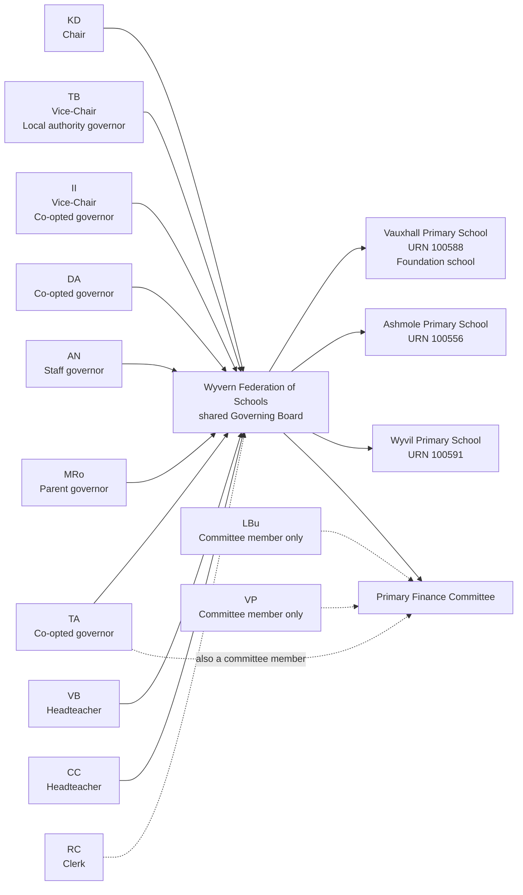
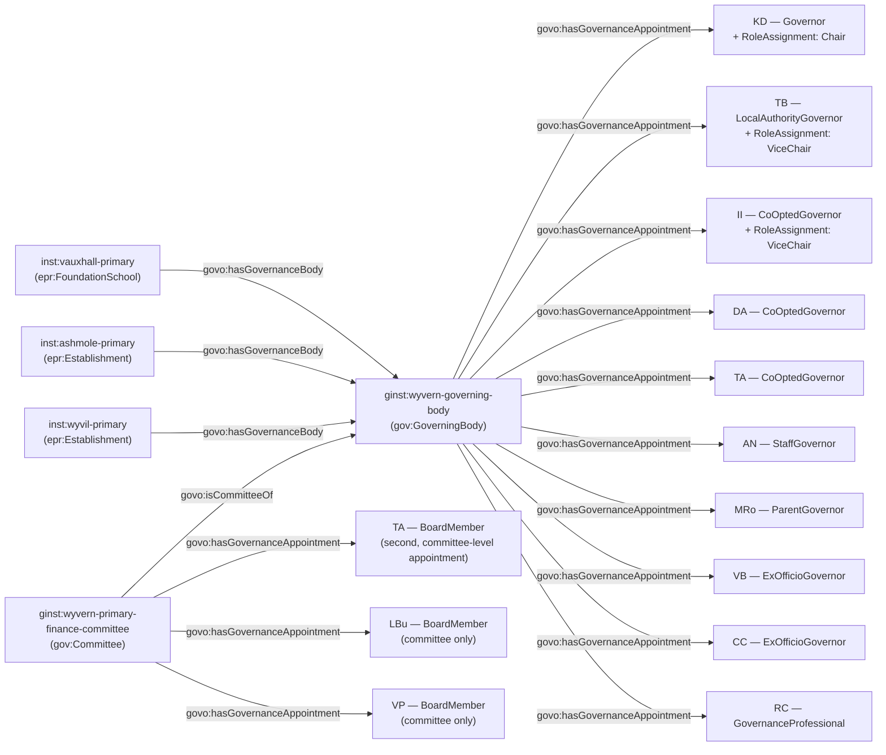

[← Worked examples](../)

# Governance Ontology — Vauxhall Primary School example

| | |
|---|---|
| **School** | Vauxhall Primary School — URN 100588 |
| **Establishment type** | Foundation school, governed through a shared federation board |
| **Shared board** | "Wyvern Federation of Schools" - a shared Governing Board over six schools, published by name; no GIAS federation group record is cited as evidence for it |
| **Governance ontology namespace** | `https://dfe-digital.github.io/education-provider-registry-docs/models/governance/ontology/` |
| **Governance vocabulary namespace** | `https://dfe-digital.github.io/education-provider-registry-docs/models/governance/vocabulary/` |
| **Preferred prefixes** | `govo:` (properties) · `gov:` (classes and named individuals) · `epr:`/`epro:` (reused from the main EPR ontology) |
| **OWL documentation** | [Governance ontology reference (WIDOCO)](../../ontology/) |
| **Source** | [governance-ontology.ttl](https://github.com/DFE-Digital/education-provider-registry-docs/blob/main/models/governance/governance-ontology.ttl) |
| **Repository** | [DFE-Digital/education-provider-registry-docs](https://github.com/DFE-Digital/education-provider-registry-docs) |
| **Licence** | [Open Government Licence v3.0](https://www.nationalarchives.gov.uk/doc/open-government-licence/version/3/) |

---

**Evidence and anonymisation.** This page is in two parts. **Section 1** is the real-world governance structure as documented in a bounded, sourced internal investigation ("Vauxhall Primary School: governance model worked example") - what the school itself publishes, independent of any ontology. **Section 2** maps that same structure onto `governance-ontology.ttl`. Neither section is itself GIAS data, and the source investigation is not published in this repository.

Person names throughout are shown as initials, exactly as the source investigation anonymised them (e.g. `KD`, `TB`) - this example does not use, and has not gone back to, the school's full published names. Both sections show the same representative **subset** of the published board - 16 named governors, 6 headteachers, a clerk and 2 committee-only members are evidenced in the source - so that Section 1 and Section 2 stay directly comparable. Left out: 9 further co-opted governors, 4 further headteachers, and 3 further federation member schools (see Example 1).

Unlike the two Federation worked examples (Eileen Wade/Milton Ernest, Long Ditton), no GIAS federation group record is cited anywhere in this source as evidence for "Wyvern Federation of Schools" - only Vauxhall's own GIAS Establishment record and Governance tab are cited, plus the Governance tabs of the five other named schools as a coverage check. This page therefore does not assert an `epr:Federation` instance; it models only the shared `gov:GoverningBody` and the schools whose type is confirmed.

---

## Section 1 — The real-world governance structure

This section is the structure as evidenced, before any ontology is applied.

### Sources

| Source | Publisher | What it evidences | Observed |
|---|---|---|---|
| [Vauxhall Primary School — Governance](https://www.vauxhallprimary.org.uk/Governors) | Vauxhall Primary School | Federation membership, board composition, office holders, committees, headteachers and clerk | 27 July 2026 |
| [GIAS — Vauxhall Primary School, URN 100588](https://www.get-information-schools.service.gov.uk/Establishments/Establishment/Details/100588#school-governance) | GIAS | Foundation school classification and person-level governance rows | 27 July 2026 |
| GIAS Governance tabs for the five other named schools (Ashmole URN 100556, Wyvil URN 100591, Herbert Morrison URN 100604, Lilian Baylis Technology School URN 100625, Henry Fawcett URN 131874) | GIAS | Person-level governance rows for each school; GIAS is establishment-scoped and does not expose the shared board as one governance entity | 27 July 2026 |

GIAS's Governance tabs are all establishment-scoped - none of them expresses the shared-board relationship the school's own page describes explicitly. Committees and the clerk relationship are likewise absent from GIAS.

### Structure

Adapted from the source investigation's own instance-level mapping, trimmed to a representative subset for readability - the same subset modelled in Section 2 below. The page states the federation's constitution provides for sixteen co-opted governors, one staff governor, two parent governors and one local-authority governor in total; only the named people actually published are shown here, not every constitution place.



The diagram represents the real-world governance structure, not registry records. The URNs shown are identifiers and evidence, not model entities in their own right. `LBu` and `VP` sit on the Primary Finance Committee only - unlike `TA`, neither holds a base appointment on the shared Governing Board itself.

---

## Section 2 — Modelled in the governance ontology

The same people, bodies and appointments from Section 1, expressed in Turtle using `governance-ontology.ttl` (`gov:`/`govo:`).

### Structure



### Namespace prefixes

All examples in this section use the following prefixes.

```
@prefix gov:   <https://dfe-digital.github.io/education-provider-registry-docs/models/governance/vocabulary/> .
@prefix govo:  <https://dfe-digital.github.io/education-provider-registry-docs/models/governance/ontology/> .
@prefix epr:   <https://dfe-digital.github.io/education-provider-registry-docs/models/establishment/vocabulary/> .
@prefix epro:  <https://dfe-digital.github.io/education-provider-registry-docs/models/establishment/ontology/> .
@prefix rdf:   <http://www.w3.org/1999/02/22-rdf-syntax-ns#> .
@prefix rdfs:  <http://www.w3.org/2000/01/rdf-schema#> .
@prefix owl:   <http://www.w3.org/2002/07/owl#> .
@prefix xsd:   <http://www.w3.org/2001/XMLSchema#> .
@prefix inst:  <https://dfe-digital.github.io/education-provider-registry-docs/establishment/> .
@prefix ginst: <https://dfe-digital.github.io/education-provider-registry-docs/models/governance/instance/> .
```

### Example 1 — Schools and a single shared Governing Body, without an asserted Federation

`epr:FoundationSchool` is Vauxhall's confirmed leaf type. Ashmole and Wyvil are shown as generic `epr:Establishment` - their specific leaf types are not stated in this source, so none is invented. Three further schools (Herbert Morrison, Lilian Baylis Technology School, Henry Fawcett) are evidenced and not shown here.

No `epr:Federation` instance is declared: unlike Eileen Wade/Milton Ernest and Long Ditton, this source cites no GIAS federation group record for "Wyvern Federation of Schools" - only each school's own Establishment record. `govo:hasGovernanceBody` is asserted directly from each school to the same shared `gov:GoverningBody`, without a Federation node connecting them.

```
inst:vauxhall-primary
    a epr:FoundationSchool ;
    rdfs:label "Vauxhall Primary School"@en ;
    epro:hasEstablishmentIdentity [
        a epr:EstablishmentIdentity ;
        epro:identifiedByUrn [
            a epr:UniqueReferenceNumber ;
            rdfs:label "100588"
        ]
    ] .

inst:ashmole-primary
    a epr:Establishment ;
    rdfs:label "Ashmole Primary School"@en ;
    epro:hasEstablishmentIdentity [
        a epr:EstablishmentIdentity ;
        epro:identifiedByUrn [
            a epr:UniqueReferenceNumber ;
            rdfs:label "100556"
        ]
    ] .

inst:wyvil-primary
    a epr:Establishment ;
    rdfs:label "Wyvil Primary School"@en ;
    epro:hasEstablishmentIdentity [
        a epr:EstablishmentIdentity ;
        epro:identifiedByUrn [
            a epr:UniqueReferenceNumber ;
            rdfs:label "100591"
        ]
    ] .

ginst:wyvern-governing-body
    a gov:GoverningBody ;
    rdfs:label "Wyvern Federation of Schools — Governing Board"@en .

inst:vauxhall-primary
    govo:hasGovernanceBody ginst:wyvern-governing-body .

inst:ashmole-primary
    govo:hasGovernanceBody ginst:wyvern-governing-body .

inst:wyvil-primary
    govo:hasGovernanceBody ginst:wyvern-governing-body .
```

### Example 2 — Chair with no stated category, and a second Vice-Chair

`KD` is published only as "Chair", with no governor category given - the same evidence gap as Manor High's `JJ`, handled the same way: the generic `gov:Governor` value, with the appointing body omitted rather than invented. `TB` and `II` are both Vice-Chair - a second, independent use of the two-people-one-role-value pattern established for Long Ditton's Co-Chairs, this time for Vice-Chair.

```
ginst:person-kd
    a gov:GovernancePerson ;
    rdfs:label "KD"@en .

ginst:appointment-kd-governor
    a gov:GovernanceAppointment ;
    govo:appointmentOf ginst:person-kd ;
    govo:hasRoleType gov:Governor ;
    govo:hasAppointmentBasis gov:StatutoryGovernanceAppointment ;
    rdfs:comment "Published only as 'Chair' - no more specific governor category given, so gov:Governor (the generic value) is used and govo:hasAppointingBody is omitted rather than invented."@en .

ginst:wyvern-governing-body
    govo:hasGovernanceAppointment ginst:appointment-kd-governor .

ginst:roleassignment-kd-chair
    a gov:RoleAssignment ;
    govo:layeredOn ginst:appointment-kd-governor ;
    govo:assignsRole gov:Chair .

ginst:person-tb
    a gov:GovernancePerson ;
    rdfs:label "TB"@en .

ginst:appointment-tb-governor
    a gov:GovernanceAppointment ;
    govo:appointmentOf ginst:person-tb ;
    govo:hasRoleType gov:LocalAuthorityGovernor ;
    govo:hasAppointingBody gov:AppointedByLocalAuthority ;
    govo:hasAppointmentBasis gov:StatutoryGovernanceAppointment .

ginst:wyvern-governing-body
    govo:hasGovernanceAppointment ginst:appointment-tb-governor .

ginst:roleassignment-tb-vicechair
    a gov:RoleAssignment ;
    govo:layeredOn ginst:appointment-tb-governor ;
    govo:assignsRole gov:ViceChair ;
    rdfs:comment "One of two Vice-Chairs, alongside II - two separate ViceChair RoleAssignments, the same pattern as Long Ditton's Co-Chairs."@en .

ginst:person-ii
    a gov:GovernancePerson ;
    rdfs:label "II"@en .

ginst:appointment-ii-governor
    a gov:GovernanceAppointment ;
    govo:appointmentOf ginst:person-ii ;
    govo:hasRoleType gov:CoOptedGovernor ;
    govo:hasAppointingBody gov:AppointedByGoverningBody ;
    govo:hasAppointmentBasis gov:StatutoryGovernanceAppointment .

ginst:wyvern-governing-body
    govo:hasGovernanceAppointment ginst:appointment-ii-governor .

ginst:roleassignment-ii-vicechair
    a gov:RoleAssignment ;
    govo:layeredOn ginst:appointment-ii-governor ;
    govo:assignsRole gov:ViceChair ;
    rdfs:comment "The other of the two Vice-Chairs, alongside TB."@en .
```

### Example 3 — Remaining governor categories

```
ginst:person-da
    a gov:GovernancePerson ;
    rdfs:label "DA"@en .

ginst:appointment-da-governor
    a gov:GovernanceAppointment ;
    govo:appointmentOf ginst:person-da ;
    govo:hasRoleType gov:CoOptedGovernor ;
    govo:hasAppointingBody gov:AppointedByGoverningBody ;
    govo:hasAppointmentBasis gov:StatutoryGovernanceAppointment .

ginst:wyvern-governing-body
    govo:hasGovernanceAppointment ginst:appointment-da-governor .

ginst:person-an
    a gov:GovernancePerson ;
    rdfs:label "AN"@en .

ginst:appointment-an-governor
    a gov:GovernanceAppointment ;
    govo:appointmentOf ginst:person-an ;
    govo:hasRoleType gov:StaffGovernor ;
    govo:hasAppointingBody gov:ElectedByStaff ;
    govo:hasAppointmentBasis gov:StatutoryGovernanceAppointment .

ginst:wyvern-governing-body
    govo:hasGovernanceAppointment ginst:appointment-an-governor .

ginst:person-mro
    a gov:GovernancePerson ;
    rdfs:label "MRo"@en .

ginst:appointment-mro-governor
    a gov:GovernanceAppointment ;
    govo:appointmentOf ginst:person-mro ;
    govo:hasRoleType gov:ParentGovernor ;
    govo:hasAppointingBody gov:ElectedByParents ;
    govo:hasAppointmentBasis gov:StatutoryGovernanceAppointment .

ginst:wyvern-governing-body
    govo:hasGovernanceAppointment ginst:appointment-mro-governor .
```

*(9 further co-opted governors are evidenced in the source and not shown here.)*

### Example 4 — Six headteachers, one shared board

Unlike Eileen Wade/Milton Ernest and Long Ditton, where one headteacher led both federated schools, this shared board has six separate ex-officio headteacher appointments - one per federation school - published without stating which named headteacher leads which school, so no such link is asserted here.

```
ginst:person-vb
    a gov:GovernancePerson ;
    rdfs:label "VB"@en .

ginst:appointment-vb-governor
    a gov:GovernanceAppointment ;
    govo:appointmentOf ginst:person-vb ;
    govo:hasRoleType gov:ExOfficioGovernor ;
    govo:hasAppointingBody gov:ExOfficioAppointment ;
    govo:hasAppointmentBasis gov:StatutoryGovernanceAppointment ;
    rdfs:comment "One of six ex-officio headteacher governors on the shared board, one per federation school. The source does not state which school VB is headteacher of."@en .

ginst:wyvern-governing-body
    govo:hasGovernanceAppointment ginst:appointment-vb-governor .

ginst:person-cc
    a gov:GovernancePerson ;
    rdfs:label "CC"@en .

ginst:appointment-cc-governor
    a gov:GovernanceAppointment ;
    govo:appointmentOf ginst:person-cc ;
    govo:hasRoleType gov:ExOfficioGovernor ;
    govo:hasAppointingBody gov:ExOfficioAppointment ;
    govo:hasAppointmentBasis gov:StatutoryGovernanceAppointment ;
    rdfs:comment "One of six ex-officio headteacher governors on the shared board. 4 further headteachers are evidenced in the source and not shown here."@en .

ginst:wyvern-governing-body
    govo:hasGovernanceAppointment ginst:appointment-cc-governor .
```

### Example 5 — Committee membership: dual and committee-only

`TA` holds a second, committee-level appointment on the Primary Finance Committee, in addition to the base Governing Board appointment shown in Example 3 - the same dual-appointment pattern used at Frank Barnes and Manor High. `LBu` and `VP` are different: they hold **only** a committee-level appointment, with no base Governing Board appointment at all - a pattern not seen in the earlier worked examples, where every committee member also held a base board appointment.

```
ginst:wyvern-primary-finance-committee
    a gov:Committee ;
    rdfs:label "Wyvern Federation — Primary Finance Committee"@en ;
    govo:isCommitteeOf ginst:wyvern-governing-body .

ginst:appointment-ta-committee
    a gov:GovernanceAppointment ;
    govo:appointmentOf ginst:person-ta ;
    govo:hasRoleType gov:BoardMember ;
    govo:hasAppointmentBasis gov:StatutoryGovernanceAppointment ;
    rdfs:comment "TA's committee-level appointment, distinct from TA's Governing Board appointment (Example 3)."@en .

ginst:person-ta
    a gov:GovernancePerson ;
    rdfs:label "TA"@en .

ginst:appointment-ta-governor
    a gov:GovernanceAppointment ;
    govo:appointmentOf ginst:person-ta ;
    govo:hasRoleType gov:CoOptedGovernor ;
    govo:hasAppointingBody gov:AppointedByGoverningBody ;
    govo:hasAppointmentBasis gov:StatutoryGovernanceAppointment .

ginst:wyvern-governing-body
    govo:hasGovernanceAppointment ginst:appointment-ta-governor .

ginst:wyvern-primary-finance-committee
    govo:hasGovernanceAppointment ginst:appointment-ta-committee .

ginst:person-lbu
    a gov:GovernancePerson ;
    rdfs:label "LBu"@en .

ginst:appointment-lbu-committee
    a gov:GovernanceAppointment ;
    govo:appointmentOf ginst:person-lbu ;
    govo:hasRoleType gov:BoardMember ;
    govo:hasAppointmentBasis gov:StatutoryGovernanceAppointment ;
    rdfs:comment "Committee member only - LBu holds no base appointment on the shared Governing Board itself, unlike TA above."@en .

ginst:wyvern-primary-finance-committee
    govo:hasGovernanceAppointment ginst:appointment-lbu-committee .

ginst:person-vp
    a gov:GovernancePerson ;
    rdfs:label "VP"@en .

ginst:appointment-vp-committee
    a gov:GovernanceAppointment ;
    govo:appointmentOf ginst:person-vp ;
    govo:hasRoleType gov:BoardMember ;
    govo:hasAppointmentBasis gov:StatutoryGovernanceAppointment ;
    rdfs:comment "Committee member only, the same pattern as LBu."@en .

ginst:wyvern-primary-finance-committee
    govo:hasGovernanceAppointment ginst:appointment-vp-committee .
```

### Example 6 — Clerk

```
ginst:person-rc
    a gov:GovernancePerson ;
    rdfs:label "RC"@en .

ginst:appointment-rc-governanceprofessional
    a gov:GovernanceAppointment ;
    govo:appointmentOf ginst:person-rc ;
    govo:hasRoleType gov:GovernanceProfessional ;
    govo:hasAppointmentBasis gov:ProfessionalSupportRole ;
    rdfs:comment "Clerk to the shared Governing Board."@en .

ginst:wyvern-governing-body
    govo:hasGovernanceAppointment ginst:appointment-rc-governanceprofessional .
```

---

## Concept coverage

| Real-world concept | Vauxhall evidence | Ontology mapping | Fit |
|---|---|---|---|
| Foundation school | Vauxhall Primary School, URN 100588 | `epr:FoundationSchool` | Direct - reused leaf type |
| Federation member schools of unconfirmed type | Ashmole, Wyvil (and 3 further, not shown) | `epr:Establishment` | Direct as a generic type; specific leaf types not evidenced in this source |
| "Wyvern Federation of Schools" as an organisation | Named on the school's own page | Not modelled as `epr:Federation` | Not evidenced - no GIAS federation group record is cited, unlike the two Federation worked examples |
| Shared Governing Body | One board over six schools | `gov:GoverningBody`, `govo:hasGovernanceBody` from each school | Direct |
| Chair with no stated category | KD | `govo:hasRoleType gov:Governor` (generic) | Candidate - the source gives no more specific category |
| Two Vice-Chairs | TB, II | Two separate `gov:RoleAssignment`s, each `govo:assignsRole gov:ViceChair` | Direct - the same two-holders-one-value pattern as Long Ditton's Co-Chairs |
| Governor categories | Local authority, Co-opted, Staff, Parent | `govo:hasRoleType` (`gov:LocalAuthorityGovernor`, `gov:CoOptedGovernor`, `gov:StaffGovernor`, `gov:ParentGovernor`) | Direct - a true SI 2012/1034 maintained-school board |
| Six ex-officio headteachers, one per school | VB, CC (and 4 further, not shown) | `govo:hasRoleType gov:ExOfficioGovernor`, one appointment each | Direct; which headteacher leads which school is not evidenced |
| Committee membership, dual appointment | TA (Governing Board + committee) | Two separate `GovernanceAppointment`s, `govo:hasRoleType gov:BoardMember` for the committee one | Candidate, as at Frank Barnes and Manor High |
| Committee-only membership | LBu, VP | `gov:GovernanceAppointment` (`gov:BoardMember`) attached only to the Committee, no Governing Board appointment | Candidate - a pattern not seen in the earlier worked examples |
| Governance Professional / Clerk | RC | `govo:hasRoleType gov:GovernanceProfessional`, `govo:hasAppointmentBasis gov:ProfessionalSupportRole` | Direct |
| Constitution places not named on the page | 16 co-opted, 1 staff, 2 parent, 1 LA places stated in total | Not modelled beyond the named people shown | Not evidenced - unnamed constitution places are not invented |

---

**See also:** [Governance vocabulary](../../vocabulary/) · [Governance taxonomy](../../taxonomy/) · [Governance ontology](../../ontology/) · [Governance ontology graph viewer](../../ontology/webvowl/)
