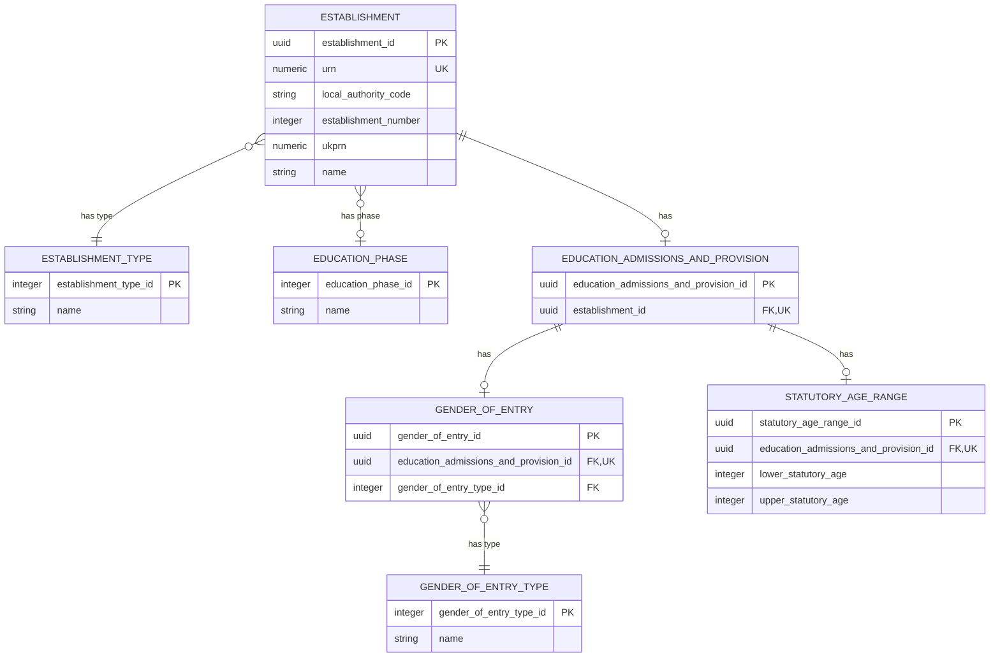

# Basic Establishment Data Logical Model

## Purpose

This is the first logical-model slice for the Establishment Registry. It defines the minimum data needed to identify and describe an establishment for the anonymous Find and Share journeys.

## Scope

In scope:

- URN.
- Local authority code and establishment number (displayed together as the DfE number / LAESTAB).
- UKPRN.
- Establishment name.
- Establishment type.
- Age range.
- Phase of education.
- Gender of entry.

Out of scope for this slice:

- Establishment lifecycle and closure history.
- Addresses, locations and contact details.
- Groups, memberships and governance.
- Alternative and historic names.
- Source provenance, stewardship workflow, change history and audit structures.
- Physical database choices.

## Methodology

We have treated the current GIAS identifiers and public Establishment Details terminology as evidence, not as a target schema. The model follows the logical-model development process and keeps identifiers separate from classifications. It is a first, reviewable slice; it does not yet settle migration rules, identifier minting or physical storage.

## Logical Model



## Entities And Attributes

| Entity | Attribute | Required | Meaning and rule |
| --- | --- | --- | --- |
| Establishment | `establishment_id` | Yes | Generated, opaque technical key used for internal database relationships. It is not a public identifier. |
| Establishment | `urn` | Yes | Immutable, globally unique canonical business identifier. It is used for public routes, search and migration reconciliation. |
| Establishment | `local_authority_code` | Conditional | Local authority code component of the DfE number / LAESTAB. Stored separately so the owning authority and component can be validated independently. |
| Establishment | `establishment_number` | Conditional | Local-authority-scoped establishment number, between 1 and 9999 where present. The frontend composes it with `local_authority_code` for DfE number / LAESTAB display. |
| Establishment | `ukprn` | Conditional | Current UK Provider Reference Number supplied by UKRLP where applicable. |
| Establishment | `name` | Yes | Current published establishment name. Historic and alternative names are deferred. |
| Establishment type | `establishment_type_id` | Yes | Explicitly seeded integer reference-data identifier. An establishment has one current type in this slice. |
| Establishment type | `name` | Yes | Human-readable type label. |
| Education phase | `education_phase_id` | Yes | Explicitly seeded integer reference-data identifier. |
| Education phase | `name` | Yes | Human-readable phase label. |
| Education admissions and provision | `education_admissions_and_provision_id` | Conditional | One owned substructure for education, admissions and provision facts where they apply to the establishment. This slice uses it to own gender of entry and statutory age range child facts. |
| Gender of entry | `gender_of_entry_id` | Yes | Generated, opaque technical key for the establishment's current gender-of-entry fact. |
| Gender of entry | `education_admissions_and_provision_id` | Yes | Parent education, admissions and provision record. Unique in this slice, because an establishment has at most one current gender-of-entry fact. |
| Gender of entry | `gender_of_entry_type_id` | Yes | Controlled gender-of-entry value selected for this establishment. |
| Gender of entry type | `gender_of_entry_type_id` | Yes | Explicitly seeded integer reference-data identifier. |
| Gender of entry type | `name` | Yes | Human-readable gender-of-entry label. |
| Statutory age range | `lower_statutory_age` | Yes, when a range exists | Lowest age for which the establishment is registered. Must be a non-negative integer no greater than `19`. |
| Statutory age range | `upper_statutory_age` | Yes, when a range exists | Highest age for which the establishment is registered. Must be a non-negative integer no greater than `25` and not lower than `lower_statutory_age`. |

## Statutory Age Range Placement

The published EPR establishment model represents age range as `StatutoryAgeRange`, reached through `EducationAdmissionsAndProvision`. This is defined in `education-provider-registry-docs/models/establishment/establishment-ontology.ttl`; its constraints are in `education-provider-registry-docs/models/establishment/establishment-data-quality-shacl.ttl`.

```text
Establishment
  -> EducationAdmissionsAndProvision
    -> StatutoryAgeRange
       - AgeLow
       - AgeHigh
```

We should follow that logical boundary. Age range is a distinct, regulated pair of values, not two unrelated Establishment attributes. It also sits alongside admissions and provision facts which are outside this first slice but will be modelled later.

A physical model may ultimately store the two values as columns on an `Establishment` table for simplicity or performance. That is a physical-design decision. It must not erase the logical `StatutoryAgeRange` boundary or the type-specific applicability and validation rules.

The EPR data-quality SHACL model sets the following limits:

- `AgeLow`: `0` to `19`.
- `AgeHigh`: `0` to `25`.
- `AgeHigh` must not be lower than `AgeLow`.

The last rule is stated in the current SHACL shape's comment but is not yet expressed as an executable cross-field constraint. The target implementation must enforce it.

## Education, Admissions And Provision Placement

`EducationAdmissionsAndProvision` is the owned substructure for education, admissions and provision facts that describe how the establishment operates as a school or provider.

In this slice it carries:

- `GenderOfEntry`, which records the current gender-of-entry fact and links to controlled `GenderOfEntryType` reference data.
- `StatutoryAgeRange`, which records the lower and upper statutory ages.

This means gender of entry is associated with an establishment through the provision substructure:

```text
Establishment
  -> EducationAdmissionsAndProvision
    -> GenderOfEntry
      -> GenderOfEntryType
```

It is deliberately not an attribute on `Establishment` itself. The establishment record holds identity and headline classification facts; provision-specific facts sit below `EducationAdmissionsAndProvision`.

## Identifier Rules

| Identifier | Cardinality | Constraint | Note |
| --- | --- | --- | --- |
| URN | Exactly one | Globally unique and immutable | The canonical public establishment identifier for this slice. |
| DfE number / LAESTAB | Derived | Uniqueness requires local-authority context | Derived from `local_authority_code` and `establishment_number`, commonly rendered as `LA/ESTAB` with the establishment number zero-padded to four digits. |
| UKPRN | Zero or one | Eight-digit value; global uniqueness is not yet a target rule | Optional because it does not apply to every establishment. It is externally owned by UKRLP. |

The model must enforce the stated uniqueness constraints for the direct identifier attributes. The uniqueness scope for each identifier type must be defined by its owning authority.

## Classification Rules

- Establishment type and phase of education are reference-data classifications, not free text.
- An establishment has one current establishment type.
- An establishment may have one phase of education in this first slice. Any need for multiple phases must be evidenced before extending the model.
- An establishment has at most one current education, admissions and provision substructure and at most one statutory age range within it.
- Gender of entry is a child fact held within the education, admissions and provision substructure. Its value is selected from gender-of-entry reference data.
- Classification identifiers must be stable and labels may change without changing the establishment record.

## Deferred Decisions

| Decision | Why It Is Deferred |
| --- | --- |
| Identifier effective dates, supersession and reuse. | Requires lifecycle and migration evidence. |
| Type and phase history. | Requires a change-history and lifecycle model. |
| Complete age-range applicability by establishment type. | The EPR SHACL model contains many type-specific rules; this first slice does not yet reproduce them all. |
| Provenance, stewardship and audit metadata. | These are cross-cutting structures to be designed consistently across later slices. |

## Future-Requirements Assessment

| Requirement | Applies? | Score | Rationale | Required Action |
| --- | --- | --- | --- | --- |
| RBAC and ABAC | No | N/A | This anonymous public-data slice does not model protected operations. | Assess when create and edit journeys are modelled. |
| Data stewardship workflows | No | N/A | Workflow state is outside this read-focused slice. | Add to the authorised-change slice. |
| Change history | No | N/A | The slice holds current values only. | Add history structures with lifecycle and stewardship modelling. |
| Policy-change flexibility | Yes | 3 - Strong | Identifiers and classifications are separated; type and phase values are reference data. | Retain controlled reference-data governance. |

## Open Questions

- Which establishment types legitimately have no age range or phase of education?
- Is UKPRN uniqueness global across all provider and organisation records, not just establishments?
- Does the anonymous public beta require identifiers to be searchable, display-only, or both?
