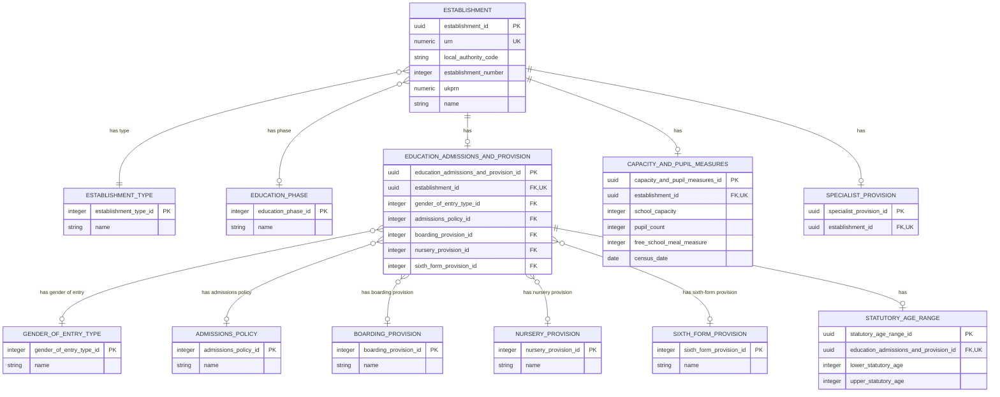
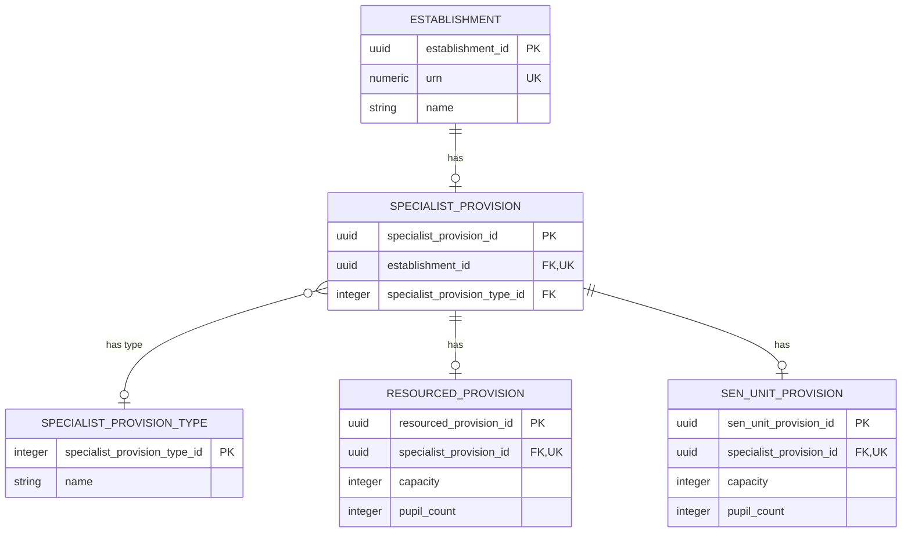

# Basic Establishment Data Logical Model

## Purpose

This is the first logical-model slice for the Establishment Registry. It defines the minimum data needed to identify and describe an establishment for the anonymous Find and Share journeys.

## Scope

In scope:

- URN.
- Local authority code and establishment number (displayed together as the DfE number / LAESTAB).
- UKPRN.
- Establishment name.
- Establishment type.
- Age range.
- Phase of education.
- Gender of entry.
- Admissions policy.
- Boarding provision.
- Nursery provision.
- Sixth-form provision.
- School capacity.
- Pupil count.
- Free school meal measure.
- Census date for the pupil measures.
- Specialist provision measures, including SEN unit and resourced provision where applicable.

Out of scope for this slice:

- Establishment lifecycle and closure history.
- Addresses, locations and contact details.
- Groups, memberships and governance.
- Alternative and historic names.
- Source provenance, stewardship workflow, change history and audit structures.
- Physical database choices.

## Methodology

We have treated the current GIAS identifiers and public Establishment Details terminology as evidence, not as a target schema. The model follows the logical-model development process and keeps identifiers separate from classifications. It is a first, reviewable slice; it does not yet settle migration rules, identifier minting or physical storage.

## Logical Model



## Specialist Provision ERD

The specialist-provision branch is shown separately because it has its own internal structure and would make the main establishment ERD too dense.



## Entities And Attributes

| Entity | Attribute | Required | Meaning and rule |
| --- | --- | --- | --- |
| Establishment | `establishment_id` | Yes | Generated, opaque technical key used for internal database relationships. It is not a public identifier. |
| Establishment | `urn` | Yes | Immutable, globally unique canonical business identifier. It is used for public routes, search and migration reconciliation. |
| Establishment | `local_authority_code` | Conditional | Local authority code component of the DfE number / LAESTAB. Stored separately so the owning authority and component can be validated independently. |
| Establishment | `establishment_number` | Conditional | Local-authority-scoped establishment number, between 1 and 9999 where present. The frontend composes it with `local_authority_code` for DfE number / LAESTAB display. |
| Establishment | `ukprn` | Conditional | Current UK Provider Reference Number supplied by UKRLP where applicable. |
| Establishment | `name` | Yes | Current published establishment name. Historic and alternative names are deferred. |
| Establishment type | `establishment_type_id` | Yes | Explicitly seeded integer reference-data identifier. An establishment has one current type in this slice. |
| Establishment type | `name` | Yes | Human-readable type label. |
| Education phase | `education_phase_id` | Yes | Explicitly seeded integer reference-data identifier. |
| Education phase | `name` | Yes | Human-readable phase label. |
| Education admissions and provision | `education_admissions_and_provision_id` | Conditional | One owned substructure for education, admissions and provision facts where they apply to the establishment. This slice uses it to hold gender of entry, admissions policy, boarding provision, nursery provision, sixth-form provision and the statutory age range child fact. |
| Education admissions and provision | `gender_of_entry_type_id` | Conditional | Controlled gender-of-entry value selected for this establishment, where applicable. |
| Education admissions and provision | `admissions_policy_id` | Conditional | Controlled admissions-policy value selected for this establishment, where applicable. |
| Education admissions and provision | `boarding_provision_id` | Conditional | Controlled boarding-provision value selected for this establishment, where applicable. |
| Education admissions and provision | `nursery_provision_id` | Conditional | Controlled nursery-provision value selected for this establishment, where applicable. |
| Education admissions and provision | `sixth_form_provision_id` | Conditional | Controlled sixth-form-provision value selected for this establishment, where applicable. |
| Gender of entry type | `gender_of_entry_type_id` | Yes | Explicitly seeded integer reference-data identifier. |
| Gender of entry type | `name` | Yes | Human-readable gender-of-entry label. |
| Admissions policy | `admissions_policy_id` | Yes | Explicitly seeded integer reference-data identifier. |
| Admissions policy | `name` | Yes | Human-readable admissions-policy label. |
| Boarding provision | `boarding_provision_id` | Yes | Explicitly seeded integer reference-data identifier. |
| Boarding provision | `name` | Yes | Human-readable boarding-provision label. |
| Nursery provision | `nursery_provision_id` | Yes | Explicitly seeded integer reference-data identifier. |
| Nursery provision | `name` | Yes | Human-readable nursery-provision label. |
| Sixth-form provision | `sixth_form_provision_id` | Yes | Explicitly seeded integer reference-data identifier. |
| Sixth-form provision | `name` | Yes | Human-readable sixth-form-provision label. |
| Capacity and pupil measures | `capacity_and_pupil_measures_id` | Conditional | One owned substructure for capacity and pupil-measure facts where they apply to the establishment. This slice uses it to hold school capacity, pupil count, the free school meal measure and the shared census date. |
| Capacity and pupil measures | `school_capacity` | Conditional | Registered number of pupil places for which the establishment is organised. Must be a non-negative integer where present. |
| Capacity and pupil measures | `pupil_count` | Conditional | Total number of pupils on roll at the establishment as recorded in the source establishment record. Must be a non-negative integer where present. |
| Capacity and pupil measures | `free_school_meal_measure` | Conditional | Number of pupils recorded as eligible for free school meals at the census date. Must be a non-negative integer where present. This is an eligibility count, not the number of meals served. |
| Capacity and pupil measures | `census_date` | Conditional | Statutory DfE school census date to which `pupil_count` and `free_school_meal_measure` relate. Stored once on the capacity-and-pupil-measures substructure, not repeated on each measure. |
| Specialist provision | `specialist_provision_id` | Conditional | One owned substructure for specialist-provision facts, including SEN unit and resourced-provision facts where they apply to the establishment. |
| Specialist provision | `specialist_provision_type_id` | Conditional | Controlled value indicating whether the establishment has resourced provision, a SEN unit, or both. |
| Specialist provision type | `specialist_provision_type_id` | Yes | Explicitly seeded integer reference-data identifier. |
| Specialist provision type | `name` | Yes | Human-readable specialist-provision-type label. |
| Resourced provision | `capacity` | Conditional | Number of designated places in the resourced provision unit. Must be a non-negative integer where present. |
| Resourced provision | `pupil_count` | Conditional | Number of pupils on roll in the resourced provision unit. Must be a non-negative integer where present and must not exceed capacity when both are present. |
| SEN unit provision | `capacity` | Conditional | Number of designated places in the SEN unit. Must be a non-negative integer where present. |
| SEN unit provision | `pupil_count` | Conditional | Number of pupils on roll in the SEN unit. Must be a non-negative integer where present. |
| Statutory age range | `lower_statutory_age` | Yes, when a range exists | Lowest age for which the establishment is registered. Must be a non-negative integer no greater than `19`. |
| Statutory age range | `upper_statutory_age` | Yes, when a range exists | Highest age for which the establishment is registered. Must be a non-negative integer no greater than `25` and not lower than `lower_statutory_age`. |

## Statutory Age Range Placement

The published EPR establishment model represents age range as `StatutoryAgeRange`, reached through `EducationAdmissionsAndProvision`. This is defined in `education-provider-registry-docs/models/establishment/establishment-ontology.ttl`; its constraints are in `education-provider-registry-docs/models/establishment/establishment-data-quality-shacl.ttl`.

```text
Establishment
  -> EducationAdmissionsAndProvision
    -> StatutoryAgeRange
       - AgeLow
       - AgeHigh
```

We should follow that logical boundary. Age range is a distinct, regulated pair of values, not two unrelated Establishment attributes. It also sits alongside admissions and provision facts which are outside this first slice but will be modelled later.

A physical model may ultimately store the two values as columns on an `Establishment` table for simplicity or performance. That is a physical-design decision. It must not erase the logical `StatutoryAgeRange` boundary or the type-specific applicability and validation rules.

The EPR data-quality SHACL model sets the following limits:

- `AgeLow`: `0` to `19`.
- `AgeHigh`: `0` to `25`.
- `AgeHigh` must not be lower than `AgeLow`.

The last rule is stated in the current SHACL shape's comment but is not yet expressed as an executable cross-field constraint. The target implementation must enforce it.

## Education, Admissions And Provision Placement

`EducationAdmissionsAndProvision` is the owned substructure for education, admissions and provision facts that describe how the establishment operates as a school or provider.

In this slice it carries:

- `gender_of_entry_type_id`, a direct reference to controlled `GenderOfEntryType` reference data, the same pattern used for `establishment_type_id` and `education_phase_id` on `Establishment`.
- `admissions_policy_id`, a direct reference to controlled `AdmissionsPolicy` reference data.
- `boarding_provision_id`, a direct reference to controlled `BoardingProvision` reference data.
- `nursery_provision_id`, a direct reference to controlled `NurseryProvision` reference data.
- `sixth_form_provision_id`, a direct reference to controlled `SixthFormProvision` reference data.
- `StatutoryAgeRange`, which records the lower and upper statutory ages.

This means gender of entry, admissions policy, boarding provision, nursery provision and sixth-form provision are associated with an establishment through the provision substructure:

```text
Establishment
  -> EducationAdmissionsAndProvision
    -> GenderOfEntryType
    -> AdmissionsPolicy
    -> BoardingProvision
    -> NurseryProvision
    -> SixthFormProvision
```

These are deliberately not attributes on `Establishment` itself. The establishment record holds identity and headline classification facts; provision-specific facts sit below `EducationAdmissionsAndProvision`. Both are direct reference-data columns, not wrapper entities, because neither carries attributes of its own beyond the type it selects.

## Capacity And Specialist Provision Placement

The field semantics in this section are aligned to the existing EPR establishment vocabulary and ontology: `est:PupilsEligibleForFreeSchoolMeals`, `est:CensusDate`, `esto:hasFreeSchoolMealMeasure` and `esto:hasCensusDate`. The ontology defines one shared census date for the capacity-and-pupil-measures block, while the SHACL shapes determine whether the free-school-meal measure is required or not applicable for each establishment type.

School capacity, pupil count and the free school meal measure sit on `CapacityAndPupilMeasures`, not directly on `Establishment`. This follows the published EPR ontology's measurement boundary. The `census_date` is held once on the same block because it provides the temporal context for both the pupil count and free school meal measure.

```text
Establishment
  -> CapacityAndPupilMeasures
     - SchoolCapacity
     - PupilCount
     - FreeSchoolMealMeasure
     - CensusDate
```

`SchoolCapacity` is the registered number of pupil places for which the establishment is organised. `PupilCount` is the current number of pupils on roll recorded in the source establishment record. They are separate business measures, but they are simple scalar values with the same owner and current lifecycle in this slice, so the physical model stores them as columns on `capacity_and_pupil_measures`.

`FreeSchoolMealMeasure` is the number of pupils recorded as eligible for free school meals. It is an eligibility measure, not a count of meals served. It is a separate scalar measure on the same substructure because it describes the establishment's pupil population and shares the census-date context with `PupilCount`.

`CensusDate` is the statutory DfE school census date to which `PupilCount` and `FreeSchoolMealMeasure` relate, typically a January census date. It is stored once for the block rather than repeated on each measure. The model therefore keeps the observation date explicit without turning each measure into a separate time-series entity; historical and multiple-period observations remain deferred to the lifecycle and history model.

SEN unit and resourced provision facts sit below `SpecialistProvision`, not below `EducationAdmissionsAndProvision`. These are specialist facility facts about the establishment, not admissions-policy facts.

`SpecialistProvision` is the establishment-level container for this branch of the model. It exists when the establishment has a recorded specialist SEN facility. The `SpecialistProvisionType` classifier records which kind of specialist provision is present:

- `Resourced provision`.
- `SEN unit`.
- `Resourced provision and SEN unit`.

`ResourcedProvision` and `SenUnitProvision` are modelled separately because they are not the same operational concept.

`ResourcedProvision` means the establishment has designated specialist resources for pupils with particular needs, usually within a mainstream setting. Pupils may access mainstream classes while receiving targeted specialist support. The model records the designated capacity and pupil count for that resourced provision.

`SenUnitProvision` means the establishment has a more distinct SEN unit provision, usually with dedicated places, staff or accommodation for pupils who need a more specialist setting. The model records the designated capacity and pupil count for that SEN unit provision.

An establishment can have one, the other, or both. The numeric measures are therefore separate child records because each provision type has its own capacity and pupil-count values.

```text
Establishment
  -> SpecialistProvision
    -> SpecialistProvisionType
    -> ResourcedProvision
       - Capacity
       - PupilCount
    -> SenUnitProvision
       - Capacity
       - PupilCount
```

## Identifier Rules

| Identifier | Cardinality | Constraint | Note |
| --- | --- | --- | --- |
| URN | Exactly one | Globally unique and immutable | The canonical public establishment identifier for this slice. |
| DfE number / LAESTAB | Derived | Uniqueness requires local-authority context | Derived from `local_authority_code` and `establishment_number`, commonly rendered as `LA/ESTAB` with the establishment number zero-padded to four digits. |
| UKPRN | Zero or one | Eight-digit value; global uniqueness is not yet a target rule | Optional because it does not apply to every establishment. It is externally owned by UKRLP. |

The model must enforce the stated uniqueness constraints for the direct identifier attributes. The uniqueness scope for each identifier type must be defined by its owning authority.

## Classification Rules

- Establishment type and phase of education are reference-data classifications, not free text.
- An establishment has one current establishment type.
- An establishment may have one phase of education in this first slice. Any need for multiple phases must be evidenced before extending the model.
- An establishment has at most one current education, admissions and provision substructure and at most one statutory age range within it.
- An establishment has at most one current capacity and pupil measures substructure, carrying at most one school capacity, pupil-count, free-school-meal-measure and census-date value.
- `census_date` is shared by `pupil_count` and `free_school_meal_measure`; it is not a separate date for each measure.
- `free_school_meal_measure` is a count of pupils eligible for free school meals, not a count of meals served.
- An establishment has at most one current specialist-provision substructure, at most one resourced-provision measure and at most one SEN-unit-provision measure within it.
- Gender of entry is a reference-data classification held on the education, admissions and provision substructure, not its own owned entity.
- Admissions policy is a reference-data classification held on the education, admissions and provision substructure, not its own owned entity.
- Boarding provision is a reference-data classification held on the education, admissions and provision substructure, not its own owned entity.
- Nursery provision is a reference-data classification held on the education, admissions and provision substructure, not its own owned entity.
- Sixth-form provision is a reference-data classification held on the education, admissions and provision substructure, not its own owned entity.
- Classification identifiers must be stable and labels may change without changing the establishment record.

## Deferred Decisions

| Decision | Why It Is Deferred |
| --- | --- |
| Identifier effective dates, supersession and reuse. | Requires lifecycle and migration evidence. |
| Type and phase history. | Requires a change-history and lifecycle model. |
| Complete age-range applicability by establishment type. | The EPR SHACL model contains many type-specific rules; this first slice does not yet reproduce them all. |
| Percentage eligible for free school meals. | The published vocabulary and ontology expose a percentage sub-measure alongside the eligibility count; this slice first adds the requested count and shared census-date context. The percentage's logical placement and derivation rule should be confirmed in the next capacity-measures increment. |
| Provenance, stewardship and audit metadata. | These are cross-cutting structures to be designed consistently across later slices. |

## Future-Requirements Assessment

| Requirement | Applies? | Score | Rationale | Required Action |
| --- | --- | --- | --- | --- |
| RBAC and ABAC | No | N/A | This anonymous public-data slice does not model protected operations. | Assess when create and edit journeys are modelled. |
| Data stewardship workflows | No | N/A | Workflow state is outside this read-focused slice. | Add to the authorised-change slice. |
| Change history | No | N/A | The slice holds current values only. | Add history structures with lifecycle and stewardship modelling. |
| Policy-change flexibility | Yes | 3 - Strong | Identifiers and classifications are separated; type and phase values are reference data. | Retain controlled reference-data governance. |

## Open Questions

- Which establishment types legitimately have no age range or phase of education?
- Is UKPRN uniqueness global across all provider and organisation records, not just establishments?
- Does the anonymous public beta require identifiers to be searchable, display-only, or both?
- Is `percentage eligible for free school meals` in scope for the next increment as a separate derived measure alongside `free_school_meal_measure`, and should it be stored or calculated from the count and pupil count?

### Local BAU migration mapping

The controlled local migration reads `dbo.Establishment` from `gias_bau_test_local`. `NumberOfPupils` maps to `pupil_count`, `freeSchoolMeals` maps to `free_school_meal_measure`, and `SchoolCapacity` maps to `school_capacity`. The source copy has no census-date field, so the migration leaves `census_date` null and records that absence rather than asserting a date that was not supplied by the source. The reusable BAU transform is maintained with the published model; the local target loader and orchestration runner are maintained privately in the local transformation workspace.
