# Core Establishment Data Logical Model

## Purpose

This is the first logical-model slice for the Establishment Registry. It defines the minimum data needed to identify and describe an establishment for the anonymous Find and Share journeys.

## Logical Model

```mermaid
erDiagram
    ESTABLISHMENT }o--|| ESTABLISHMENT_TYPE : "has type"
    ESTABLISHMENT }o--o| EDUCATION_PHASE : "has phase"
    ESTABLISHMENT ||--o| EDUCATION_ADMISSIONS_AND_PROVISION : "has"
    ESTABLISHMENT ||--o| CAPACITY_AND_PUPIL_MEASURES : "has"
    ESTABLISHMENT ||--o| SPECIALIST_PROVISION : "has"
    ESTABLISHMENT ||--o| ESTABLISHMENT_CONTACT : "has contact"
    ESTABLISHMENT ||--o| ESTABLISHMENT_LIFECYCLE : "has lifecycle"
    ESTABLISHMENT ||--o| ESTABLISHMENT_GEOGRAPHY : "has geography"
    ESTABLISHMENT_GEOGRAPHY }o--o| GOVERNMENT_OFFICE_REGION : "uses region"
    ESTABLISHMENT_LIFECYCLE }o--|| ESTABLISHMENT_STATUS : "has status"
    ESTABLISHMENT_LIFECYCLE }o--o| REASON_ESTABLISHMENT_OPENED : "has opening reason"
    ESTABLISHMENT_LIFECYCLE }o--o| REASON_ESTABLISHMENT_CLOSED : "has closing reason"
    EDUCATION_ADMISSIONS_AND_PROVISION }o--o| GENDER_OF_ENTRY_TYPE : "has gender of entry"
    EDUCATION_ADMISSIONS_AND_PROVISION }o--o| ADMISSIONS_POLICY : "has admissions policy"
    EDUCATION_ADMISSIONS_AND_PROVISION }o--o| BOARDING_PROVISION : "has boarding provision"
    EDUCATION_ADMISSIONS_AND_PROVISION }o--o| NURSERY_PROVISION : "has nursery provision"
    EDUCATION_ADMISSIONS_AND_PROVISION }o--o| SIXTH_FORM_PROVISION : "has sixth-form provision"
    EDUCATION_ADMISSIONS_AND_PROVISION ||--o| STATUTORY_AGE_RANGE : "has"

    ESTABLISHMENT {
        uuid establishment_id PK
        numeric urn UK
        integer establishment_number
        numeric ukprn
        string name
    }

    ESTABLISHMENT_GEOGRAPHY {
        uuid establishment_geography_id PK
        uuid establishment_id FK, UK
        uuid local_authority_id FK
        uuid government_office_region_id FK
    }

    GOVERNMENT_OFFICE_REGION {
        uuid government_office_region_id PK
        string code UK
        string name
    }

    ESTABLISHMENT_TYPE {
        integer establishment_type_id PK
        string name
    }

    EDUCATION_PHASE {
        integer education_phase_id PK
        string name
    }

    ESTABLISHMENT_CONTACT {
        uuid establishment_contact_id PK
        uuid establishment_id FK, UK
        string website
        string telephone_number
    }

    ESTABLISHMENT_LIFECYCLE {
        uuid establishment_lifecycle_id PK
        uuid establishment_id FK, UK
        integer establishment_status_id FK
        date open_date
        date close_date
        integer reason_establishment_opened_id FK
        integer reason_establishment_closed_id FK
        date last_changed_date
    }

    ESTABLISHMENT_STATUS {
        integer establishment_status_id PK
        integer code UK
        string name
    }

    REASON_ESTABLISHMENT_OPENED {
        integer reason_establishment_opened_id PK
        string name
    }

    REASON_ESTABLISHMENT_CLOSED {
        integer reason_establishment_closed_id PK
        string name
    }

    GENDER_OF_ENTRY_TYPE {
        integer gender_of_entry_type_id PK
        string name
    }

    ADMISSIONS_POLICY {
        integer admissions_policy_id PK
        string name
    }

    BOARDING_PROVISION {
        integer boarding_provision_id PK
        string name
    }

    NURSERY_PROVISION {
        integer nursery_provision_id PK
        string name
    }

    SIXTH_FORM_PROVISION {
        integer sixth_form_provision_id PK
        string name
    }

    EDUCATION_ADMISSIONS_AND_PROVISION {
        uuid education_admissions_and_provision_id PK
        uuid establishment_id FK, UK
        integer gender_of_entry_type_id FK
        integer admissions_policy_id FK
        integer boarding_provision_id FK
        integer nursery_provision_id FK
        integer sixth_form_provision_id FK
    }

    CAPACITY_AND_PUPIL_MEASURES {
        uuid capacity_and_pupil_measures_id PK
        uuid establishment_id FK, UK
        integer school_capacity
        integer pupil_count
        integer free_school_meal_measure
        date census_date
    }

    SPECIALIST_PROVISION {
        uuid specialist_provision_id PK
        uuid establishment_id FK, UK
    }

    STATUTORY_AGE_RANGE {
        uuid statutory_age_range_id PK
        uuid education_admissions_and_provision_id FK, UK
        integer lower_statutory_age
        integer upper_statutory_age
    }
```

## Model detail

The detailed entity definitions are split into focused documents:

- [Identity and classification](identity-and-classification.md)
- [Establishment geography](geography.md)
- [Education provision and measures](education-provision-and-measures.md)
- [Location, contact and sites](location-contact-and-sites.md)
- [Specialist provision](specialist-provision.md)

The Mermaid ERD above remains the overview of the complete logical model. Read the linked document for the detailed entities, rules and BAU mappings in that branch.
