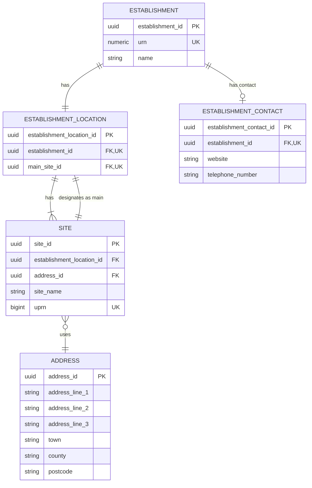
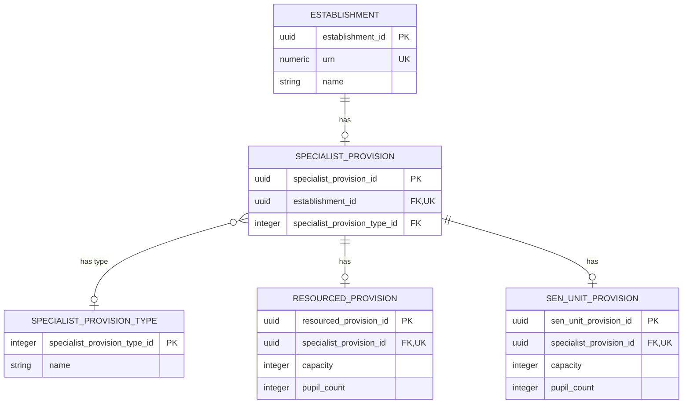

# Core Establishment Data Logical Model

## Purpose

This is the first logical-model slice for the Establishment Registry. It defines the minimum data needed to identify and describe an establishment for the anonymous Find and Share journeys.


## Logical Model

```mermaid
erDiagram
    ESTABLISHMENT }o--|| ESTABLISHMENT_TYPE : "has type"
    ESTABLISHMENT }o--o| EDUCATION_PHASE : "has phase"
    ESTABLISHMENT ||--o| EDUCATION_ADMISSIONS_AND_PROVISION : "has"
    ESTABLISHMENT ||--o| CAPACITY_AND_PUPIL_MEASURES : "has"
    ESTABLISHMENT ||--o| SPECIALIST_PROVISION : "has"
    ESTABLISHMENT ||--o| ESTABLISHMENT_CONTACT : "has contact"
    ESTABLISHMENT ||--o| ESTABLISHMENT_LIFECYCLE : "has lifecycle"
    ESTABLISHMENT_LIFECYCLE }o--|| ESTABLISHMENT_STATUS : "has status"
    ESTABLISHMENT_LIFECYCLE }o--o| REASON_ESTABLISHMENT_OPENED : "has opening reason"
    ESTABLISHMENT_LIFECYCLE }o--o| REASON_ESTABLISHMENT_CLOSED : "has closing reason"
    EDUCATION_ADMISSIONS_AND_PROVISION }o--o| GENDER_OF_ENTRY_TYPE : "has gender of entry"
    EDUCATION_ADMISSIONS_AND_PROVISION }o--o| ADMISSIONS_POLICY : "has admissions policy"
    EDUCATION_ADMISSIONS_AND_PROVISION }o--o| BOARDING_PROVISION : "has boarding provision"
    EDUCATION_ADMISSIONS_AND_PROVISION }o--o| NURSERY_PROVISION : "has nursery provision"
    EDUCATION_ADMISSIONS_AND_PROVISION }o--o| SIXTH_FORM_PROVISION : "has sixth-form provision"
    EDUCATION_ADMISSIONS_AND_PROVISION ||--o| STATUTORY_AGE_RANGE : "has"

    ESTABLISHMENT {
        uuid establishment_id PK
        numeric urn UK
        string local_authority_code
        integer establishment_number
        numeric ukprn
        string name
    }

    ESTABLISHMENT_TYPE {
        integer establishment_type_id PK
        string name
    }

    EDUCATION_PHASE {
        integer education_phase_id PK
        string name
    }

    ESTABLISHMENT_CONTACT {
        uuid establishment_contact_id PK
        uuid establishment_id FK, UK
        string website
        string telephone_number
    }

    ESTABLISHMENT_LIFECYCLE {
        uuid establishment_lifecycle_id PK
        uuid establishment_id FK, UK
        integer establishment_status_id FK
        date open_date
        date close_date
        integer reason_establishment_opened_id FK
        integer reason_establishment_closed_id FK
        date last_changed_date
    }

    ESTABLISHMENT_STATUS {
        integer establishment_status_id PK
        integer code UK
        string name
    }

    REASON_ESTABLISHMENT_OPENED {
        integer reason_establishment_opened_id PK
        string name
    }

    REASON_ESTABLISHMENT_CLOSED {
        integer reason_establishment_closed_id PK
        string name
    }

    GENDER_OF_ENTRY_TYPE {
        integer gender_of_entry_type_id PK
        string name
    }

    ADMISSIONS_POLICY {
        integer admissions_policy_id PK
        string name
    }

    BOARDING_PROVISION {
        integer boarding_provision_id PK
        string name
    }

    NURSERY_PROVISION {
        integer nursery_provision_id PK
        string name
    }

    SIXTH_FORM_PROVISION {
        integer sixth_form_provision_id PK
        string name
    }

    EDUCATION_ADMISSIONS_AND_PROVISION {
        uuid education_admissions_and_provision_id PK
        uuid establishment_id FK, UK
        integer gender_of_entry_type_id FK
        integer admissions_policy_id FK
        integer boarding_provision_id FK
        integer nursery_provision_id FK
        integer sixth_form_provision_id FK
    }

    CAPACITY_AND_PUPIL_MEASURES {
        uuid capacity_and_pupil_measures_id PK
        uuid establishment_id FK, UK
        integer school_capacity
        integer pupil_count
        integer free_school_meal_measure
        date census_date
    }

    SPECIALIST_PROVISION {
        uuid specialist_provision_id PK
        uuid establishment_id FK, UK
    }

    STATUTORY_AGE_RANGE {
        uuid statutory_age_range_id PK
        uuid education_admissions_and_provision_id FK, UK
        integer lower_statutory_age
        integer upper_statutory_age
    }
```



## Entities And Attributes

The logical model is described one table at a time below. Each section explains what the table means in the real-world model before listing its columns. Sections are placed beneath the ERD that introduces their concepts.

## Establishment

`establishment` is the central business table for a current establishment
record. It holds the canonical identity, name and headline classification
context; operational provision, measures and locations are represented by owned
substructures.

Business-friendly pattern:

```text
For this establishment record,
what is its identity, name and headline classification?
```

- `urn` is the canonical public and reconciliation identifier.
- The DfE number is composed from the local authority code and establishment number.
- UKPRN is an optional externally-issued provider identifier.
- This table deliberately does not absorb measures, governance, groups or site details.

| Column | Required | Meaning and rule |
| --- | --- | --- |
| `establishment_id` | Yes | Generated opaque technical key for internal relationships; not a public identifier. |
| `urn` | Yes | Immutable, globally unique canonical business identifier used for public routes, search and migration reconciliation. |
| `local_authority_code` | Conditional | Local-authority component of the DfE number / LAESTAB. |
| `establishment_number` | Conditional | Local-authority-scoped establishment number, between 1 and 9999 where present. |
| `ukprn` | Conditional | Current UK Provider Reference Number supplied by UKRLP where applicable. |
| `name` | Yes | Current published establishment name; historic and alternative names are deferred. |

### Identifier rules

| Identifier | Cardinality | Constraint | Note |
| --- | --- | --- | --- |
| URN | Exactly one | Globally unique and immutable | The canonical public establishment identifier for this slice. |
| DfE number / LAESTAB | Derived | Uniqueness requires local-authority context | Derived from `local_authority_code` and `establishment_number`, commonly rendered as `LA/ESTAB` with the establishment number zero-padded to four digits. |
| UKPRN | Zero or one | Eight-digit value; global uniqueness is not yet a target rule | Optional because it does not apply to every establishment. It is externally owned by UKRLP. |

The model must enforce the stated uniqueness constraints for the direct identifier attributes. The uniqueness scope for each identifier type must be defined by its owning authority.

## Establishment lifecycle

`establishment_lifecycle` records the current status of an establishment and
the key dates and reasons that explain its opening or closure. It is the
logical representation of the ontology's `EstablishmentLifecycle` concept.

Business-friendly pattern:

```text
Is the establishment open, when did its current lifecycle begin or end,
and what reason explains that change?
```

- An establishment has zero or one lifecycle record in this slice.
- `establishment_status_id` is a controlled value, not free text.
- Open and close dates, and their reasons, are conditional source facts. They
  must not be inferred when the source does not provide them.
- When both dates are present, `close_date` must not precede `open_date`.
- `last_changed_date` describes source currency; it is not the date of a
  lifecycle event.

| Column | Required | Meaning and rule |
| --- | --- | --- |
| `establishment_lifecycle_id` | Yes | Generated opaque technical key for the lifecycle record. |
| `establishment_id` | Yes | One-to-one owner relationship to `establishment`; unique in this table. |
| `establishment_status_id` | Yes | Controlled establishment-status reference value. |
| `open_date` | Conditional | Date the establishment opened, where supplied by the source. |
| `close_date` | Conditional | Date the establishment closed, where supplied by the source. |
| `reason_establishment_opened_id` | Conditional | Controlled reason for opening, where supplied by the source. |
| `reason_establishment_closed_id` | Conditional | Controlled reason for closure, where supplied by the source. |
| `last_changed_date` | Conditional | Source-system date on which the lifecycle data last changed. |

### BAU source mapping

The first migration maps lifecycle facts from `dbo.Establishment` and its
controlled reference tables. The target model keeps these facts together as
one owned lifecycle boundary rather than adding status and dates to the core
identity table.

| Logical concept | BAU source | Notes |
| --- | --- | --- |
| Establishment status | `dbo.Establishment.status_code` -> `dbo.EstablishmentStatus.code` | Preserve the controlled code and its label. |
| Open date | `dbo.Establishment.OpenDate` | Nullable source date. |
| Close date | `dbo.Establishment.CloseDate` | Nullable source date. |
| Reason opened | `dbo.Establishment.reasonEstablishmentOpened_code` -> `dbo.ReasonEstablishmentOpened.code` | Nullable source reason. |
| Reason closed | `dbo.Establishment.reasonEstablishmentClosed_code` -> `dbo.ReasonEstablishmentClosed.code` | Nullable source reason. |
| Last changed date | `dbo.Establishment.lastChangedDate` | Source currency marker. |

### Lifecycle reference data

`establishment_status`, `reason_establishment_opened` and
`reason_establishment_closed` are controlled reference-data entities. Names
provide the human-readable labels. The lifecycle record points to these
values rather than storing labels or source codes as unbounded text.

| Entity | Key attributes | Meaning |
| --- | --- | --- |
| `establishment_status` | `establishment_status_id`, numeric `code`, `name` | Current lifecycle status, such as open or closed. |
| `reason_establishment_opened` | `reason_establishment_opened_id`, `name` | Controlled reason explaining an opening event. |
| `reason_establishment_closed` | `reason_establishment_closed_id`, `name` | Controlled reason explaining a closure event. |

## Establishment status

`establishment_status` is a closed, controlled list. A lifecycle record must
use one of these values; applications must not create new status labels as
free text. The identifiers below are the canonical vocabulary values.

| Value | Canonical identifier | Meaning |
| --- | --- | --- |
| Open | `est:OpenStatus` | The establishment is currently open and operating. |
| Closed | `est:ClosedStatus` | The establishment has closed and is retained for historical reference. |
| Open, but proposed to close | `est:OpenProposedToCloseStatus` | The establishment is open, but a formal closure proposal is in progress. |
| Proposed to open | `est:ProposedToOpenStatus` | The establishment is approved or planned but has not yet opened. |

These four values are the complete list for this model slice. The BAU
`status_code` is mapped to the corresponding canonical value through
`dbo.EstablishmentStatus`; the BAU code itself is an integration detail and
is not used as an unbounded label in the logical model.

## Reason establishment opened

`reason_establishment_opened` is a closed, controlled list. The value is
optional because absence means that the source supplied no opening reason; it
must not be replaced with a made-up "not recorded" value.

| Value | Canonical identifier |
| --- | --- |
| Academy Converter | `est:AcademyConverterOpenReason` |
| New Provision | `est:NewProvisionOpenReason` |
| Result of Amalgamation | `est:ResultOfAmalgamationOpenReason` |
| Fresh Start | `est:FreshStartOpenReason` |
| Academy Free School | `est:AcademyFreeSchoolOpenReason` |
| Result of Closure | `est:ResultOfClosureOpenReason` |
| Change Religious Character | `est:ChangeReligiousCharacterOpenReason` |
| Change in status | `est:ChangeInStatusOpenReason` |
| Former Independent | `est:FormerIndependentOpenReason` |
| Split school | `est:SplitSchoolOpenReason` |
| New Nursery School | `est:NewNurserySchoolOpenReason` |
| Meets accreditation standards | `est:MeetsAccreditationStandardsOpenReason` |
| Free Special School | `est:FreeSpecialSchoolOpenReason` |

## Reason establishment closed

`reason_establishment_closed` is a closed, controlled list. The value is
optional and is only populated when the source records a closure reason.

| Value | Canonical identifier |
| --- | --- |
| Academy Converter | `est:AcademyConverterCloseReason` |
| Result of Amalgamation/Merger | `est:ResultOfAmalgamationMergerCloseReason` |
| Closure | `est:ClosureCloseReason` |
| For Academy | `est:ForAcademyCloseReason` |
| Fresh Start | `est:FreshStartCloseReason` |
| Close Nursery School | `est:CloseNurserySchoolCloseReason` |
| Change Religious Character | `est:ChangeReligiousCharacterCloseReason` |
| Does not meet criteria for registration | `est:DoesNotMeetCriteriaForRegistrationCloseReason` |
| De-registered | `est:DeRegisteredCloseReason` |
| Academy Free School | `est:AcademyFreeSchoolCloseReason` |
| Change in status | `est:ChangeInStatusCloseReason` |
| Transferred to new sponsor | `est:TransferredToNewSponsorCloseReason` |
| Created in Error - application rejected | `est:CreatedInErrorCloseReason` |

## Establishment type

`establishment_type` is controlled reference data describing what kind of
establishment this is.

Business-friendly pattern:

```text
Which recognised establishment type describes this establishment?
```

- It is reference data, not free text on `establishment`.
- The establishment has one current type in this slice.
- Integer identifiers are seeded and stable; labels may change independently.

| Column | Required | Meaning and rule |
| --- | --- | --- |
| `establishment_type_id` | Yes | Seeded integer reference-data identifier. |
| `name` | Yes | Human-readable establishment-type label. |

## Education phase

`education_phase` classifies the broad phase of education provided by the
establishment.

Business-friendly pattern:

```text
Which education phase does this establishment provide?
```

- An establishment has at most one current phase in this slice.
- Multiple phases require further evidence before extending the model.

| Column | Required | Meaning and rule |
| --- | --- | --- |
| `education_phase_id` | Yes | Seeded integer reference-data identifier. |
| `name` | Yes | Human-readable phase label. |

## Education admissions and provision

`education_admissions_and_provision` groups facts about how the establishment
operates as an education provider, including entry, admissions, boarding,
nursery and sixth-form provision.

Business-friendly pattern:

```text
How does this establishment admit and provide education to its pupils?
```

- It is an optional, at-most-one owned substructure for an establishment.
- Its values are direct references to controlled classifications.
- The statutory age range is a child concept reached through this boundary.

| Column | Required | Meaning and rule |
| --- | --- | --- |
| `education_admissions_and_provision_id` | Conditional | Technical key for the owned provision substructure. |
| `establishment_id` | Conditional | One-to-one owner relationship to `establishment`. |
| `gender_of_entry_type_id` | Conditional | Controlled gender-of-entry value where applicable. |
| `admissions_policy_id` | Conditional | Controlled admissions-policy value where applicable. |
| `boarding_provision_id` | Conditional | Controlled boarding-provision value where applicable. |
| `nursery_provision_id` | Conditional | Controlled nursery-provision value where applicable. |
| `sixth_form_provision_id` | Conditional | Controlled sixth-form-provision value where applicable. |

### Modelling placement and relationships

`EducationAdmissionsAndProvision` is the owned substructure for education, admissions and provision facts that describe how the establishment operates as a school or provider.

In this slice it carries:

- `gender_of_entry_type_id`, a direct reference to controlled `GenderOfEntryType` reference data, the same pattern used for `establishment_type_id` and `education_phase_id` on `Establishment`.
- `admissions_policy_id`, a direct reference to controlled `AdmissionsPolicy` reference data.
- `boarding_provision_id`, a direct reference to controlled `BoardingProvision` reference data.
- `nursery_provision_id`, a direct reference to controlled `NurseryProvision` reference data.
- `sixth_form_provision_id`, a direct reference to controlled `SixthFormProvision` reference data.
- `StatutoryAgeRange`, which records the lower and upper statutory ages.

This means gender of entry, admissions policy, boarding provision, nursery provision and sixth-form provision are associated with an establishment through the provision substructure:

```text
Establishment
  -> EducationAdmissionsAndProvision
    -> GenderOfEntryType
    -> AdmissionsPolicy
    -> BoardingProvision
    -> NurseryProvision
    -> SixthFormProvision
```

These are deliberately not attributes on `Establishment` itself. The establishment record holds identity and headline classification facts; provision-specific facts sit below `EducationAdmissionsAndProvision`. Both are direct reference-data columns, not wrapper entities, because neither carries attributes of its own beyond the type it selects.

## Gender of entry type

`gender_of_entry_type` provides the controlled classification selected by an
establishment's provision record.

Business-friendly pattern:

```text
What gender-of-entry classification applies to this establishment?
```

- This is a classification, not an owned person or membership entity.
- Applicability is determined by the establishment context and reference data.

| Column | Required | Meaning and rule |
| --- | --- | --- |
| `gender_of_entry_type_id` | Yes | Seeded integer reference-data identifier. |
| `name` | Yes | Human-readable gender-of-entry label. |

## Admissions policy

`admissions_policy` provides the controlled classification of the
establishment's admissions policy.

Business-friendly pattern:

```text
What admissions policy applies to this establishment?
```

- It remains separate from establishment type and gender of entry.
- It is held through `education_admissions_and_provision`.

| Column | Required | Meaning and rule |
| --- | --- | --- |
| `admissions_policy_id` | Yes | Seeded integer reference-data identifier. |
| `name` | Yes | Human-readable admissions-policy label. |

## Boarding provision

`boarding_provision` describes the controlled boarding arrangement associated
with the establishment.

Business-friendly pattern:

```text
Does this establishment provide boarding, and what kind?
```

- It is a controlled provision classification, not a pupil or accommodation record.
- It is held through `education_admissions_and_provision`.

| Column | Required | Meaning and rule |
| --- | --- | --- |
| `boarding_provision_id` | Yes | Seeded integer reference-data identifier. |
| `name` | Yes | Human-readable boarding-provision label. |

## Nursery provision

`nursery_provision` records the controlled nursery-provision classification.

Business-friendly pattern:

```text
Does this establishment provide nursery classes?
```

- It is separate from the education phase and age range.
- It is held through `education_admissions_and_provision`.

| Column | Required | Meaning and rule |
| --- | --- | --- |
| `nursery_provision_id` | Yes | Seeded integer reference-data identifier. |
| `name` | Yes | Human-readable nursery-provision label. |

## Sixth-form provision

`sixth_form_provision` records the controlled sixth-form classification.

Business-friendly pattern:

```text
Does this establishment provide a sixth form?
```

- It is a provision classification, not an education-phase replacement.
- It is held through `education_admissions_and_provision`.

| Column | Required | Meaning and rule |
| --- | --- | --- |
| `sixth_form_provision_id` | Yes | Seeded integer reference-data identifier. |
| `name` | Yes | Human-readable sixth-form-provision label. |

## Statutory age range

`statutory_age_range` represents the regulated lower and upper ages for which
an establishment is registered.

Business-friendly pattern:

```text
What is the youngest and oldest age for which this establishment is registered?
```

- It is a distinct pair of related values, not two unrelated establishment attributes.
- It is reached through `education_admissions_and_provision`.
- The lower age is 0-19; the upper age is 0-25 and cannot be below the lower age.

| Column | Required | Meaning and rule |
| --- | --- | --- |
| `statutory_age_range_id` | Yes | Technical key for the age-range child record. |
| `education_admissions_and_provision_id` | Yes | One-to-one owner relationship to the provision substructure. |
| `lower_statutory_age` | Yes when a range exists | Lowest registered age; integer from 0 to 19. |
| `upper_statutory_age` | Yes when a range exists | Highest registered age; integer from 0 to 25 and no lower than the lower age. |

### Modelling placement and validation

Age range is represented as `StatutoryAgeRange`, reached through `EducationAdmissionsAndProvision`, rather than as two bare attributes on `Establishment`. Its validation limits are defined in `education-provider-registry-docs/models/establishment/establishment-data-quality-shacl.ttl`.

```text
Establishment
  -> EducationAdmissionsAndProvision
    -> StatutoryAgeRange
       - AgeLow
       - AgeHigh
```

We should follow that logical boundary. Age range is a distinct, regulated pair of values, not two unrelated Establishment attributes. It also sits alongside admissions and provision facts which are outside this first slice but will be modelled later.

A physical model may ultimately store the two values as columns on an `Establishment` table for simplicity or performance. That is a physical-design decision. It must not erase the logical `StatutoryAgeRange` boundary or the type-specific applicability and validation rules.

The data-quality SHACL model sets the following limits:

- `AgeLow`: `0` to `19`.
- `AgeHigh`: `0` to `25`.
- `AgeHigh` must not be lower than `AgeLow`.

The last rule is stated in the current SHACL shape's comment but is not yet expressed as an executable cross-field constraint. The target implementation must enforce it.


## Capacity and pupil measures

`capacity_and_pupil_measures` groups current operational measures about places
and pupils at the establishment.

Business-friendly pattern:

```text
How many places and pupils does this establishment have,
and how many pupils are eligible for free school meals at the observation date?
```

- At most one current measure block is held for an establishment in this slice.
- `census_date` supplies the shared temporal context for pupil count and FSM measure.
- The FSM value counts eligible pupils, not meals served.
- Historical and multi-period measures are deferred to a future lifecycle/history model.

| Column | Required | Meaning and rule |
| --- | --- | --- |
| `capacity_and_pupil_measures_id` | Yes | Technical key for the owned measure block. |
| `establishment_id` | Yes | One-to-one owner relationship to `establishment`. |
| `school_capacity` | Conditional | Registered number of pupil places; non-negative integer. |
| `pupil_count` | Conditional | Number of pupils on roll in the source establishment record; non-negative integer. |
| `free_school_meal_measure` | Conditional | Number of pupils recorded as eligible for free school meals at the census date; non-negative integer. |
| `census_date` | Conditional | Statutory DfE school census date shared by the pupil measures. |


### Measurement placement and lifecycle

One shared census date applies to the whole capacity-and-pupil-measures block, not a separate date per measure. Whether the free-school-meal measure is required or not applicable is determined per establishment type by the data-quality SHACL shapes.

School capacity, pupil count and the free school meal measure sit on `CapacityAndPupilMeasures`, not directly on `Establishment`, because they are business measurement facts about the establishment's operation, not identity or classification attributes. The `census_date` is held once on the same block because it provides the temporal context for both the pupil count and free school meal measure.

```text
Establishment
  -> CapacityAndPupilMeasures
     - SchoolCapacity
     - PupilCount
     - FreeSchoolMealMeasure
     - CensusDate
```

`SchoolCapacity` is the registered number of pupil places for which the establishment is organised. `PupilCount` is the current number of pupils on roll recorded in the source establishment record. They are separate business measures, but they are simple scalar values with the same owner and current lifecycle in this slice, so the physical model stores them as columns on `capacity_and_pupil_measures`.

`FreeSchoolMealMeasure` is the number of pupils recorded as eligible for free school meals. It is an eligibility measure, not a count of meals served. It is a separate scalar measure on the same substructure because it describes the establishment's pupil population and shares the census-date context with `PupilCount`.

`CensusDate` is the statutory DfE school census date to which `PupilCount` and `FreeSchoolMealMeasure` relate, typically a January census date. It is stored once for the block rather than repeated on each measure. The model therefore keeps the observation date explicit without turning each measure into a separate time-series entity; historical and multiple-period observations remain deferred to the lifecycle and history model.

## Location And Contact ERD

The location-and-contact branch is shown separately so the main establishment ERD remains readable. The location boundary contains every physical site at which the establishment operates - exactly one designated as the main site, plus zero or more additional sites - and each site's postal address. Public contact values are held in the separate `establishment_contact` table. Address history and other contact channels are deferred.



## Establishment location

`establishment_location` is the physical-location part of the vocabulary and
ontology concept `EstablishmentLocationAndContact`. It is the owning boundary
for the establishment's physical sites and designates exactly one current site
as the main site.

Business-friendly pattern:

```text
Where does this establishment operate,
and which site is its principal site?
```

- Every establishment has one location boundary in this slice.
- It can contain one main site and zero or more additional sites.
- `main_site_id` is a relationship to a site, not a Boolean attribute on a site.

| Column | Required | Meaning and rule |
| --- | --- | --- |
| `establishment_location_id` | Yes | Technical key for the location boundary. |
| `establishment_id` | Yes | One-to-one owner relationship to `establishment`. |
| `main_site_id` | Yes | Identifies the principal site owned by the same location boundary. |

## Establishment contact

`establishment_contact` is the relational implementation of the contact part
of the ontology concept `EstablishmentLocationAndContact`. It holds the
establishment's optional public contact values independently from its physical
sites and addresses.

Business-friendly pattern:

```text
How can this establishment be contacted publicly?
```

- An establishment has zero or one contact record in this slice.
- `website` represents the optional public website URL (`est:Website`).
- `telephone_number` represents the optional main contact telephone number (`est:TelephoneNumber`).
- Each establishment has at most one website and at most one telephone number.
- This slice does not include email addresses, named contacts, headteachers or contact history.

| Column | Required | Meaning and rule |
| --- | --- | --- |
| `establishment_contact_id` | Yes | Technical key for the contact record. |
| `establishment_id` | Yes | One-to-one owner relationship to `establishment`; unique so there is at most one contact record. |
| `website` | Conditional | Public website URL where supplied; maps to `est:Website` and `esto:hasWebsite`. |
| `telephone_number` | Conditional | Main public contact telephone number where supplied; maps to `est:TelephoneNumber` and `esto:hasTelephoneNumber`. |

The vocabulary still groups these values under Location and Contact, and the
ontology still attaches them to `EstablishmentLocationAndContact`. Splitting
the values into a developer-friendly relational table is a physical/logical
mapping choice; it does not introduce a new business concept or alter the
ontology.

## Site

`site` represents a physical place at which the establishment operates.

Business-friendly pattern:

```text
What physical site does this establishment operate from,
and what address identifies that site?
```

- A site belongs to exactly one establishment location boundary.
- A site uses one current postal address.
- UPRN belongs on the stable physical site, not on the mutable address text.

| Column | Required | Meaning and rule |
| --- | --- | --- |
| `site_id` | Yes | Technical key for a physical site. |
| `establishment_location_id` | Yes | Owning establishment location boundary. |
| `address_id` | Yes | Reusable key for the site's postal address. |
| `site_name` | Conditional | Optional site name where supplied; not an establishment identifier. |
| `uprn` | Conditional | Ordnance Survey Unique Property Reference Number for the physical location, where supplied. |

### UPRN placement

`Site.uprn` is the Ordnance Survey [Unique Property Reference Number](https://www.ordnancesurvey.co.uk/public/unique-property-reference-numbers) - a numeric identifier for the addressable location itself, not for the establishment.

**Justification.** The OS page defines a UPRN as "a unique numeric identifier for every spatial address in Great Britain" that persists "throughout a property's life cycle - from planning permission through to demolition." Read literally, the first clause ties a UPRN to an address; but the second clause only makes sense if the UPRN survives changes to that address's postal text over the property's lifetime - otherwise "persists throughout the life cycle" would say nothing beyond "exists while the property exists." This is not just a hypothetical reading: street names can change independently of the property itself - a local authority can rename or renumber a street, updating every postal address on it - while the property occupying any given plot, and its UPRN, remains the same. OS's own definition therefore implies the UPRN tracks the underlying property, not any one rendering of its postal text.

That distinction decides the placement in this model. `Address` is a set of current-value text fields (`address_line_1`, `town`, `postcode`) with no versioning or history - this slice explicitly defers address history (see Scope). An identifier that must outlive changes to that text cannot correctly live on a record with no guarantee of surviving such changes. `Site` represents the stable physical location; `Address` is the mutable current-value rendering of it. `uprn` therefore belongs on `Site`.
## Address

`address` is the reusable current postal rendering of a physical location.
Address history is outside this slice.

Business-friendly pattern:

```text
What is the current postal address for this site?
```

- The address does not point back to a site; the using relationship holds `address_id`.
- The address text is mutable current-value data.
- UPRN is deliberately modelled on `site` because it identifies the property, not one rendering of its address.

| Column | Required | Meaning and rule |
| --- | --- | --- |
| `address_id` | Yes | Reusable technical key for a postal address. |
| `address_line_1` | Conditional | First address line, mapped from BAU `Street`. |
| `address_line_2` | Conditional | Second address line where supplied. |
| `address_line_3` | Conditional | Third address line, mapped from BAU `Address3`. |
| `town` | Conditional | Town or locality town, mapped from BAU `Town`. |
| `county` | Conditional | County where supplied. |
| `postcode` | Conditional | Postal code, mapped from BAU `Postcode`. |


### Site placement and lifecycle

The BAU model does not have a first-class `Site` concept for the principal location. The primary site is implicit: its postal address is held as columns on `dbo.Establishment` (`Street`, `Locality`, `Address3`, `Town`, `Postcode`, `UPRN`, `Easting` and `Northing`). BAU stores additional physical locations separately in `dbo.EstablishmentAdditionalAddresses`, linked by URN and `record_number`.

The target model makes every physical location explicit as a `Site`, because it is a business concept, not just a group of address strings, and because an establishment can operate at more than one location:

```text
Establishment
  -> EstablishmentLocationAndContact
     (relational table: establishment_location)
    -> Site (main)
      -> Address
    -> Site (additional, zero or more)
      -> Address
```

`EstablishmentLocation` is the owning boundary for location facts. It holds every `Site` at which the establishment operates and designates exactly one of them as the main site via `main_site_id`. "Main" is a fact about which site the establishment currently points to, not an attribute of the site record, and a per-row flag would allow invalid states a single designating foreign key cannot (zero sites flagged main, or more than one).

Which establishment types, if any, should be permitted to have additional sites is not yet defined in this slice, and the logical model does not currently restrict it. This should be confirmed against evidence (for example, actual usage patterns in BAU's `EstablishmentAdditionalAddresses`) before an executable constraint is added.

`Address` is a reusable postal-address concept. It does not contain a `site_id`, because an address may be referenced by a site, a registered legal entity or another future subject. The foreign key is held by the using relationship (`Site.address_id`). The logical model therefore does not add address columns directly to `Establishment`. `main_site_id` must reference a `Site` owned by the same `establishment_location_id`; this cross-field constraint is a physical-implementation decision, not yet expressed as an executable rule in this slice.

## Specialist Provision ERD

The specialist-provision branch is shown separately because it has its own internal structure and would make the main establishment ERD too dense.



## Specialist provision

`specialist_provision` is the establishment-level container for specialist SEN
facilities and their measures.

Business-friendly pattern:

```text
Does this establishment have specialist provision,
and if so which specialist facilities and measures apply?
```

- It is optional and at most one per establishment in this slice.
- The type classifier identifies resourced provision, SEN unit, or both.
- The detailed resourced and SEN-unit measures remain separate child concepts.

| Column | Required | Meaning and rule |
| --- | --- | --- |
| `specialist_provision_id` | Conditional | Technical key for the specialist-provision substructure. |
| `establishment_id` | Yes | One-to-one owner relationship to `establishment`. |
| `specialist_provision_type_id` | Conditional | Controlled value indicating resourced provision, SEN unit or both. |

## Specialist provision type

`specialist_provision_type` is controlled reference data for the kind of
specialist provision recorded.

Business-friendly pattern:

```text
Which specialist provision types are present at this establishment?
```

- It classifies the specialist branch; it is not a substitute for the detailed measures.
- The value may indicate one provision type or both.

| Column | Required | Meaning and rule |
| --- | --- | --- |
| `specialist_provision_type_id` | Yes | Seeded integer reference-data identifier. |
| `name` | Yes | Human-readable specialist-provision-type label. |

## Resourced provision

`resourced_provision` records the designated capacity and pupil count for a
resourced provision facility.

Business-friendly pattern:

```text
How many designated places and pupils are in the resourced provision?
```

- It is separate from an SEN unit because the two are different operational concepts.
- A specialist provision branch may contain one resourced provision record.

| Column | Required | Meaning and rule |
| --- | --- | --- |
| `resourced_provision_id` | Yes | Technical key for the resourced-provision record. |
| `specialist_provision_id` | Yes | One-to-one owner relationship to `specialist_provision`. |
| `capacity` | Conditional | Designated places; non-negative integer. |
| `pupil_count` | Conditional | Pupils on roll; non-negative integer and no greater than capacity when both are present. |

## SEN unit provision

`sen_unit_provision` records the designated capacity and pupil count for a
separate SEN unit facility.

Business-friendly pattern:

```text
How many designated places and pupils are in the SEN unit?
```

- It is separate from resourced provision because it represents a distinct facility.
- A specialist provision branch may contain one SEN unit record.

| Column | Required | Meaning and rule |
| --- | --- | --- |
| `sen_unit_provision_id` | Yes | Technical key for the SEN-unit record. |
| `specialist_provision_id` | Yes | One-to-one owner relationship to `specialist_provision`. |
| `capacity` | Conditional | Designated places; non-negative integer. |
| `pupil_count` | Conditional | Pupils on roll; non-negative integer. |


### Specialist provision placement and measures

SEN unit and resourced provision facts sit below `SpecialistProvision`, not below `EducationAdmissionsAndProvision`. These are specialist facility facts about the establishment, not admissions-policy facts.

`SpecialistProvision` is the establishment-level container for this branch of the model. It exists when the establishment has a recorded specialist SEN facility. The `SpecialistProvisionType` classifier records which kind of specialist provision is present:

- `Resourced provision`.
- `SEN unit`.
- `Resourced provision and SEN unit`.

`ResourcedProvision` and `SenUnitProvision` are modelled separately because they are not the same operational concept.

`ResourcedProvision` means the establishment has designated specialist resources for pupils with particular needs, usually within a mainstream setting. Pupils may access mainstream classes while receiving targeted specialist support. The model records the designated capacity and pupil count for that resourced provision.

`SenUnitProvision` means the establishment has a more distinct SEN unit provision, usually with dedicated places, staff or accommodation for pupils who need a more specialist setting. The model records the designated capacity and pupil count for that SEN unit provision.

An establishment can have one, the other, or both. The numeric measures are therefore separate child records because each provision type has its own capacity and pupil-count values.

```text
Establishment
    -> SpecialistProvision
    -> SpecialistProvisionType
    -> ResourcedProvision
       - Capacity
       - PupilCount
    -> SenUnitProvision
       - Capacity
       - PupilCount
```

