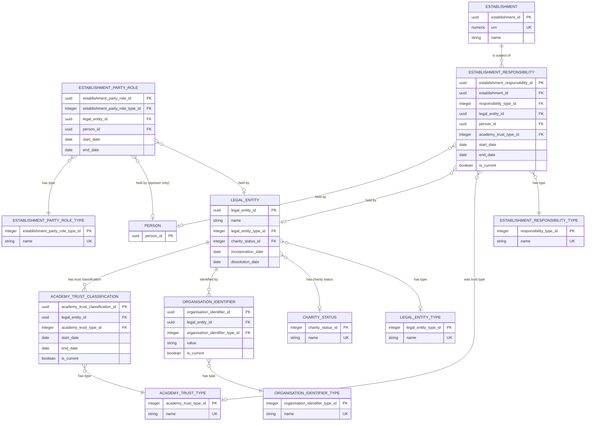
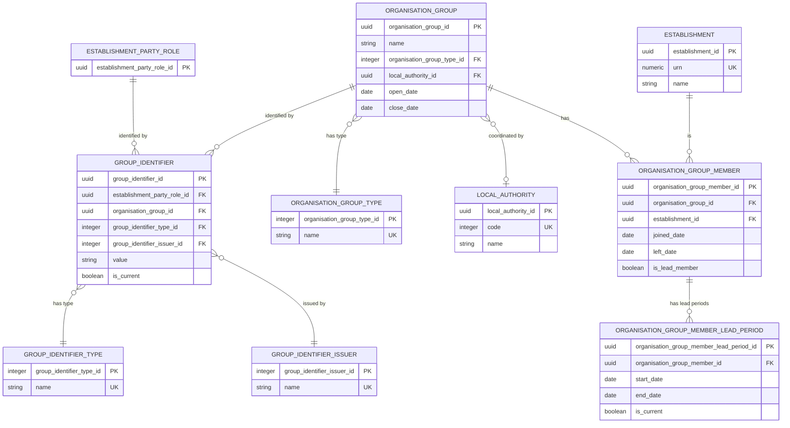

# Establishment groups

This document defines the logical model for legal entities, responsibilities and organisation groups associated with establishments in the Establishment Registry. Source records and migration lineage are outside the target domain model.

## Establishment groups ERD

The groups branch is shown separately so that the main establishment ERD remains readable. The model is split into two diagrams: one for parties, roles and responsibilities, and one for organisation groups and group identifiers. A legal entity can hold dated establishment-party roles and can have dated responsibilities for establishments. A person can hold a school-sponsor role and permitted responsibilities. A federation or children's-centre grouping is instead a named group of establishments; it is not a legal entity.

The model contains:

- legal entities, their legal form, charity status and external identifiers;
- dated establishment-party roles held by a legal entity or, for a school sponsor, a person;
- dated academy-trust classifications for legal entities;
- dated responsibilities held by a legal entity or person for an establishment;
- dated membership of federations and children's-centre organisation groups;
- Dated children's-centre lead periods, separate from membership; and
- the group UIDs and Group IDs that identify roles and organisation groups.

### Parties, roles and responsibilities

This diagram contains the legal party, its recognised roles, its trust classifications and its responsibilities for individual establishments.



#### Why roles and responsibilities are separate

A role records the capacity in which a party is recognised across the education system. A responsibility records what that party does for one particular establishment. They are separate business facts with independent dates and different cardinality:

- One party can hold more than one role at the same time.
- One role can support responsibilities for many establishments.
- Responsibilities can start and end without changing the party's role.
- Ending one responsibility does not mean that the party has stopped holding the role.

##### Can a role be inferred from a responsibility?

Only partially. A responsibility can imply that a compatible party role must exist, but it cannot reliably determine the role's complete lifecycle. The responsibility is therefore useful validation evidence, not a replacement for the role record.

| Responsibility type | Implied role |
| --- | --- |
| `run_by_academy_trust` | Academy trust |
| `sponsored_by` | School sponsor |
| `supported_by_foundation_trust` | Foundation trust |
| `proprietor` | No corresponding party role in this model |

The role remains separately represented because it can start before the party becomes responsible for its first establishment, continue after its last responsibility ends, or exist while the party has no current establishment responsibilities. Group identifiers belong to the role. An umbrella-trust role has no establishment responsibility from which it could be inferred.

Taking the earliest and latest responsibility dates would only estimate the role period and could conceal gaps or missing data. For example, Northbridge Learning Limited can remain a school sponsor while it has no sponsor responsibility between Birch Academy and Dene Free School. The school-sponsor role remains one continuous record; the two establishment responsibilities remain separate records.

The following hypothetical scenario illustrates the distinction across all three tables. Northbridge Learning Limited becomes an academy trust in 2011 and remains one until 2030. The legal entity is classified as a SAT until 2016 and then as a MAT until 2030. The MAT classification begins while only Alder Academy is represented in the responsibility data; Cedar Academy joins in 2018. Northbridge is also recognised as a school sponsor between 2014 and 2026. During those role periods it runs two academies and sponsors two establishments, each for its own period.

The shared event sequence is:

| Date | Event | Table consequence |
| --- | --- | --- |
| 2011-01-01 | Northbridge becomes an academy trust and is classified as a SAT. | One academy-trust `establishment_party_role` row and one legal-entity `academy_trust_classification` row start. |
| 2012-09-01 | Northbridge starts running Alder Academy. | One `establishment_responsibility` row starts. |
| 2014-09-01 | Northbridge becomes a recognised school sponsor. | A second `establishment_party_role` row starts. |
| 2015-09-01 | Northbridge starts sponsoring Birch Academy. | A second responsibility row starts. |
| 2016-09-01 | Northbridge changes from SAT to MAT. | The SAT classification row ends and a MAT classification row starts. The source relationship for Alder is now recorded as MAT, so its SAT responsibility row ends and a MAT responsibility row starts. |
| 2018-09-01 | Northbridge starts running Cedar Academy. | A third responsibility row starts while the MAT classification is in effect. |
| 2021-09-01 | Northbridge stops sponsoring Birch Academy. | The Birch responsibility row ends; the school-sponsor role continues. |
| 2022-01-01 | Northbridge stops running Alder Academy. | The Alder responsibility row ends; the academy-trust role and MAT classification continue. |
| 2022-09-01 | Northbridge starts sponsoring Dene Free School. | A fourth responsibility row starts. |
| 2026-09-01 | Northbridge stops being a school sponsor and stops sponsoring Dene Free School. | The school-sponsor role and Dene responsibility row end. |
| 2028-09-01 | Northbridge stops running Cedar Academy. | The Cedar responsibility row ends; the academy-trust role and MAT classification continue. |
| 2030-01-01 | Northbridge stops being an academy trust. | The academy-trust role and MAT classification row end. |

The three timelines can therefore be read together as follows:

```text
2011       2012       2014       2015       2016       2018       2021       2022       2026       2028       2030
|----------|----------|----------|----------|----------|----------|----------|----------|----------|----------|

Academy-trust role
|=============================================================================================================|

SAT classification
|==============================|
MAT classification
                              |================================================================================|

School-sponsor role
                       |====================================================================|

Runs Alder Academy
       |===============================================================|
Runs Cedar Academy
                                  |==========================================================================|
Sponsors Birch Academy
                                  |==========================================|
Sponsors Dene Free School
                                                                     |====================================|
```

The rows represented by this consolidated example are two role rows, two academy-trust classification rows and five establishment-responsibility rows. The timelines share the same party, but they describe different facts: the role tables describe Northbridge's recognised capacities, the classification table describes the legal entity's SAT or MAT status, and the responsibility table describes its dated relationships with named establishments.

##### Establishment party role timeline

This timeline answers: "In what capacity was Northbridge Learning Limited recognised, and when?"

```text
2011-01-01          2014-09-01                         2026-09-01      2030-01-01
|-------------------|----------------------------------|---------------|

Academy-trust role
|======================================================================|
2011-01-01                                                          2030-01-01

School-sponsor role
                    |==================================|
                    2014-09-01                    2026-09-01
```

Each continuous role period becomes one row in `establishment_party_role`:

| Row | Party | Role type | Start date | End date |
| --- | --- | --- | --- | --- |
| R1 | Northbridge Learning Limited | Academy trust | 2011-01-01 | 2030-01-01 |
| R2 | Northbridge Learning Limited | School sponsor | 2014-09-01 | 2026-09-01 |

There are two rows because Northbridge holds two different recognised roles. Neither row names an establishment. If Northbridge's academy-trust role ended and later restarted, the restarted period would require another row.

##### Academy trust classification timeline

This timeline answers: "How was Northbridge Learning Limited classified as an academy trust over time?" Northbridge is classified as a SAT when it first becomes an academy trust. On 1 September 2016 it becomes a MAT, even though it has only one academy at that point. Cedar Academy joins its responsibilities later, in 2018. The classification records the legal entity's SAT or MAT status; it is not calculated from the number of responsibility rows.

```text
2011-01-01          2016-09-01                                      2030-01-01
|-------------------|--------------------------------------------------|

Academy-trust role
|==================================================================|

SAT classification
|===================|
2011-01-01          2016-09-01

MAT classification
                    |=============================================|
                    2016-09-01                              2030-01-01
```

The classification timeline becomes two rows in `academy_trust_classification`, both linked to Northbridge Learning Limited:

| Row | Legal entity | Academy-trust type | Start date | End date | `is_current` at 2025-01-01 |
| --- | --- | --- | --- | --- | --- |
| C1 | Northbridge Learning Limited | SAT | 2011-01-01 | 2016-09-01 | False |
| C2 | Northbridge Learning Limited | MAT | 2016-09-01 | 2030-01-01 | True |

The SAT row ends on the first day the MAT row applies. The legal entity and its academy-trust role remain the same, so the classification change does not create a second `legal_entity` row or a second `establishment_party_role` row. It is also valid for the MAT period to begin while only Alder Academy is represented in the responsibility data; the MAT classification is a recorded business classification, not an academy count calculation.

##### Establishment responsibility timeline

This timeline answers: "Which establishment was Northbridge Learning Limited responsible for, in what way, and when?"

```text
2011-01-01          2015-09-01      2018-09-01      2022-09-01      2030-01-01
|-------------------|---------------|---------------|---------------|

Runs Alder Academy
     |====================================|
     2012-09-01                      2022-01-01

Sponsors Birch Academy
                    |=======================|
                    2015-09-01         2021-09-01

Runs Cedar Academy
                               |===================================|
                               2018-09-01                     2028-09-01

Sponsors Dene Free School
                                                   |===============|
                                                   2022-09-01 2026-09-01
```

Each establishment-specific period becomes one row in `establishment_responsibility`. A run-by relationship is split when its recorded trust type changes.

For the same legal entity, a SAT responsibility and a MAT responsibility are separate establishment-specific records. The entity's SAT and MAT classifications are two further records. Each of these four periods has independent start and end dates. Responsibility dates describe the relationship with an establishment; classification dates describe the legal entity's status. Dates may coincide when independently evidenced, as in this example, but are not automatically copied between the two timelines. An unknown boundary remains null. Independently evidenced overlapping periods must agree on the trust type; a contradiction is reported for resolution.

| Row | Party | Establishment | Responsibility type | Academy-trust type | Start date | End date | `is_current` at 2025-01-01 |
| --- | --- | --- | --- | --- | --- | --- | --- |
| E1 | Northbridge Learning Limited | Alder Academy | `run_by_academy_trust` | SAT | 2012-09-01 | 2016-09-01 | False |
| E2 | Northbridge Learning Limited | Alder Academy | `run_by_academy_trust` | MAT | 2016-09-01 | 2022-01-01 | False |
| E3 | Northbridge Learning Limited | Birch Academy | `sponsored_by` | Null | 2015-09-01 | 2021-09-01 | False |
| E4 | Northbridge Learning Limited | Cedar Academy | `run_by_academy_trust` | MAT | 2018-09-01 | 2028-09-01 | True |
| E5 | Northbridge Learning Limited | Dene Free School | `sponsored_by` | Null | 2022-09-01 | 2026-09-01 | True |

The five responsibility rows overlap in different combinations, but they do not create extra role rows. Alder and Cedar are covered by the academy-trust role; Birch and Dene are covered by the school-sponsor role. The responsibility boundaries remain independent: Northbridge stops running Alder in 2022 but continues to hold its academy-trust role and continues running Cedar. It also stops sponsoring Birch before it starts sponsoring Dene, without ending and recreating its school-sponsor role.

This separation prevents the model from confusing "Northbridge is an academy trust" with "Northbridge runs Alder Academy". The first statement is a party-level role; the second is a dated relationship with a particular establishment.

#### Establishment

`establishment` is the registered education provider that is run, sponsored, supported or owned by another party, or that belongs to an organisation group. It remains a distinct business object with its own URN and name.

This diagram shows the establishment only as the subject of a responsibility. Its full definition belongs to the core establishment model. For example, Manchester Creative and Media Academy is the establishment with URN `135905`; it is separate from MARCH 2016 LIMITED, the legal entity that operated it.

#### Legal entity

`legal_entity` identifies an organisation that is not an establishment. It represents academy trusts, sponsoring bodies, foundation trusts, umbrella trusts and proprietor bodies.

- One row represents one real-world legal entity. A SAT record, a MAT record and a sponsor record can resolve to the same row.
- An establishment remains an `establishment`; the wider organisation concept is a union view, not a shared target table.
- Academy-trust type is not a legal-entity type.
- The current name is held here. Name history is not represented.

| Attribute | Required | Rule |
| --- | --- | --- |
| `legal_entity_id` | Yes | Generated opaque target identifier. |
| `name` | Yes | Current name; for a company, its registered name. |
| `legal_entity_type_id` | No | Controlled type where known. |
| `charity_status_id` | No | Registered, exempt, excepted or not a charity; null when unknown. |
| `incorporation_date` | No | Date of incorporation where incorporated. |
| `dissolution_date` | No | Date of dissolution where known from an authoritative register. |

The `legal_entity_type` vocabulary is: charitable company limited by guarantee; company limited by guarantee; private limited company; public limited company; limited liability partnership; charitable incorporated organisation; body incorporated by Royal Charter; unincorporated charitable trust; public body; overseas entity; sole trader; and traditional partnership.

For example, MARCH 2016 LIMITED is represented once as a legal entity, regardless of the roles it has held or the establishments for which it has been responsible.

#### Legal entity type

`legal_entity_type` describes the legal form under which a legal entity exists. It answers the business question "what kind of organisation is this in law?", rather than "what does it do in education?"

For example, an academy trust may be a charitable company limited by guarantee. "Academy trust" is its education role, while "charitable company limited by guarantee" is its legal-entity type. Keeping these concepts separate allows the same legal form to be used by organisations with different education roles.

| Attribute | Required | Rule |
| --- | --- | --- |
| `legal_entity_type_id` | Yes | Stable reference to the controlled legal-form value. |
| `name` | Yes | Unique business-friendly name of the legal form. |

#### Charity status

`charity_status` records whether and how a legal entity is recognised as charitable. This is separate from legal form because organisations with the same legal form can have different charity statuses.

Examples include registered charity, exempt charity, excepted charity and not a charity. A null value on `legal_entity` means that the status is not known; it does not mean that the organisation is not charitable.

| Attribute | Required | Rule |
| --- | --- | --- |
| `charity_status_id` | Yes | Stable reference to the controlled charity-status value. |
| `name` | Yes | Unique business-friendly name of the charity status. |

#### Organisation identifier

`organisation_identifier` holds an identifier issued by an external authority for a legal entity.

- Identifier types are Companies House number, UKPRN and Charity Commission number.
- A legal entity can have several values of one type over time, but only one current value of a type.
- A current value is unique within its identifier type. A replaced value cannot be current for another legal entity.
- Each type/value pair has one retained ownership record, whether current or replaced. Its owner, type and value are not reassigned or overwritten. Replacement retires the old row using `is_current = false` and creates a new row for the new value; it does not delete the old ownership record. Corrections to recorded identity require a controlled administrative process rather than ordinary reassignment.
- Values are stored as text so leading zeroes are retained.

| Attribute | Required | Rule |
| --- | --- | --- |
| `organisation_identifier_id` | Yes | Generated opaque target identifier. |
| `legal_entity_id` | Yes | The owning legal entity. |
| `organisation_identifier_type_id` | Yes | Controlled identifier type. |
| `value` | Yes | Identifier as issued. |
| `is_current` | Yes | False when a value has been replaced. |

For example, MARCH 2016 LIMITED has Companies House number `06888873`. The identifier belongs to the legal entity, not to Manchester Creative and Media Academy and not to the entity's academy-trust role.

#### Organisation identifier type

`organisation_identifier_type` defines the external identifier schemes that can identify a legal entity. The current types are Companies House number, UKPRN and Charity Commission number.

The type gives meaning to the stored value. For example, `06888873` is meaningful as a Companies House number, while a UKPRN belongs to a different numbering scheme and issuing authority.

| Attribute | Required | Rule |
| --- | --- | --- |
| `organisation_identifier_type_id` | Yes | Stable reference to the identifier scheme. |
| `name` | Yes | Unique name of the identifier scheme. |

#### Establishment party role

`establishment_party_role` records that a legal entity or person held a recognised role in relation to establishments for one continuous period.

- The role types are academy trust, foundation trust, umbrella trust and school sponsor.
- Every role has exactly one holder. Exactly one of `legal_entity_id` and `person_id` is set.
- A person can hold only a school-sponsor role.
- A party can hold the same role type more than once, but each row represents one continuous period. If a role ends and later starts again, the later period is a new row.
- Periods for the same party and role type cannot overlap. A gap between periods is allowed.
- Role assignability and role-retirement dates are not represented.

| Attribute | Required | Rule |
| --- | --- | --- |
| `establishment_party_role_id` | Yes | Generated opaque target identifier. |
| `establishment_party_role_type_id` | Yes | Academy trust, foundation trust, umbrella trust or school sponsor. |
| `legal_entity_id` | Conditional | The legal entity holding the role. |
| `person_id` | Conditional | The person holding the role; permitted only for school sponsor. |
| `start_date` | No | First date on which the role applies; null means unknown. |
| `end_date` | No | First date on which the role no longer applies. |

The school-sponsor role means that DfE recognised the party as a school sponsor. It does not, by itself, assert formal approval, sponsorship of a particular establishment or governance rights over an academy trust. Sponsorship of a particular establishment is recorded separately as an `establishment_responsibility`. Formal approval and trust-level governance rights are outside this model unless a reliable source is identified.

For example, MARCH 2016 LIMITED held an academy-trust role. That role describes its recognised function in the education system; the separate responsibility record says that it ran Manchester Creative and Media Academy.

#### Establishment party role type

`establishment_party_role_type` defines the recognised roles a legal entity or, where permitted, a person can hold in relation to establishments. The controlled values are academy trust, foundation trust, umbrella trust and school sponsor.

The type describes a party's general capacity. It does not identify a particular establishment. For example, being recognised as a school sponsor is a role; sponsoring a named academy is a separate responsibility.

| Attribute | Required | Rule |
| --- | --- | --- |
| `establishment_party_role_type_id` | Yes | Stable reference to the role type. |
| `name` | Yes | Unique business-friendly name of the role type. |

#### Academy trust classification

`academy_trust_classification` records the SAT, MAT or secure-SAT status held by a legal entity for a period.

- The types are single-academy trust, multi-academy trust and secure single-academy trust.
- Classifications exist only for legal entities acting as academy trusts. Every such legal entity has at least one classification.
- Classification periods for one legal entity cannot overlap.
- A SAT-to-MAT change creates two classification periods for one legal entity. It does not create a second legal-entity record.
- The classification is recorded, not derived from the number of academies.

| Attribute | Required | Rule |
| --- | --- | --- |
| `academy_trust_classification_id` | Yes | Generated opaque target identifier. |
| `legal_entity_id` | Yes | The legal entity whose academy-trust status is being classified. |
| `academy_trust_type_id` | Yes | Single-academy trust, multi-academy trust or secure single-academy trust. |
| `start_date` | No | First date on which the classification applies; null means unknown. |
| `end_date` | No | First date on which the classification no longer applies. |
| `is_current` | Yes | Whether the classification is currently asserted. This is not derived from dates. |

##### Date semantics

The two records represent separate lifecycle facts:

| Record | Meaning | What causes a new period? |
| --- | --- | --- |
| `establishment_party_role` | When did this party hold a recognised academy-trust role? | The academy-trust role ends, or it ends and later restarts. |
| `academy_trust_classification` | When was this legal entity a SAT, MAT or secure SAT? | The recorded academy-trust type changes. |

The classification is a legal-entity status, rather than a second legal entity or a party role. Neither classification period says when the trust ran a particular academy; that period belongs to `establishment_responsibility`.

The dates follow these rules:

- A classification cannot exist without its legal entity.
- Classification periods for the same legal entity do not overlap.
- Successive classifications can meet on the same date because periods are half open: the earlier classification ends on the first day the later classification applies.
- Ending a classification does not end the legal entity or its academy-trust role when another classification starts immediately.
- Null dates mean that the classification boundary is unknown.
- At most one classification for a legal entity is current. Current academy responsibilities held by the same legal entity must agree on their recorded SAT, MAT or secure-SAT type. That shared value identifies the matching classification as current, even where the classification dates are unknown.

#### Academy trust type

`academy_trust_type` defines the classifications that can apply to an academy-trust legal entity. The values are single-academy trust, multi-academy trust and secure single-academy trust.

This reference data supports changes over time without changing the identity of the legal entity. For example, a trust can move from a single-academy-trust classification to a multi-academy-trust classification while retaining one continuous academy-trust role.

| Attribute | Required | Rule |
| --- | --- | --- |
| `academy_trust_type_id` | Yes | Stable reference to the academy-trust classification. |
| `name` | Yes | Unique business-friendly name of the classification. |

#### Establishment responsibility

`establishment_responsibility` records that a legal entity or person runs, sponsors or supports an establishment, or is its proprietor, for a period.

There is one row per party, establishment, responsibility type and period. Exactly one of `legal_entity_id` and `person_id` is set. A person can be the party only for `sponsored_by` and `proprietor`.

For a `run_by_academy_trust` responsibility, `academy_trust_type_id` records whether the source relationship is SAT, MAT or secure SAT. It is null for every other responsibility type. This is an establishment-specific fact: it says how the legal entity was recorded while responsible for that establishment. It does not replace the separately dated legal-entity status in `academy_trust_classification`.

A change in the recorded trust type creates a separate responsibility period even when the legal entity and its academy-trust role remain the same. The SAT and MAT responsibility periods and the SAT and MAT classification periods are four independently dated records. A classification transition does not, by itself, establish the end date of an establishment responsibility. An archived responsibility can have an unknown end date and `is_current = false`; null does not mean that it continues indefinitely.

`is_current` records whether the source currently identifies the relationship as current. It is populated from the source link's current or archived state, not calculated from the responsibility dates. This allows application queries to select the current relationship without interpreting incomplete historical dates.

| Attribute | Required | Rule |
| --- | --- | --- |
| `establishment_responsibility_id` | Yes | Generated opaque target identifier. |
| `establishment_id` | Yes | The existing establishment. |
| `responsibility_type_id` | Yes | Controlled responsibility type. |
| `legal_entity_id` | Conditional | Responsible legal entity. |
| `person_id` | Conditional | Responsible person, where permitted. |
| `academy_trust_type_id` | Conditional | SAT, MAT or secure SAT for `run_by_academy_trust`; null for every other responsibility type. |
| `start_date` | No | First date on which the responsibility applies; null means unknown. |
| `end_date` | No | First date on which it no longer applies. |
| `is_current` | Yes | Whether the source currently identifies this relationship as current. This is not derived from dates. |

| Responsibility type | Meaning |
| --- | --- |
| `run_by_academy_trust` | The academy trust runs the academy or free school and is accountable for it. |
| `sponsored_by` | The legal entity or person recorded as the establishment's sponsor. |
| `supported_by_foundation_trust` | The foundation trust that supports a foundation school. |
| `proprietor` | The legal entity or person responsible for managing an independent school, non-maintained special school or city technology college. This does not model ownership of premises or a proprietor company. |

`maintained_by_local_authority` belongs to the accountability slice.

For example, the `run_by_academy_trust` responsibility links MARCH 2016 LIMITED to Manchester Creative and Media Academy for the period in which that company operated the academy. The row also records SAT or MAT where the source group type supplies it, and whether that relationship is current.

#### Establishment responsibility type

`establishment_responsibility_type` defines the kinds of responsibility that a party can have for a specific establishment. The controlled values in this slice are `run_by_academy_trust`, `sponsored_by`, `supported_by_foundation_trust` and `proprietor`.

The type makes the relationship explicit. The same legal entity can have different responsibilities for different establishments, or even several distinct responsibilities across its wider portfolio. For example, Outwood Grange Academies Trust can run academies, sponsor establishments and act as the proprietor of an independent school.

| Attribute | Required | Rule |
| --- | --- | --- |
| `responsibility_type_id` | Yes | Stable reference to the responsibility type. |
| `name` | Yes | Unique business-friendly name of the responsibility type. |

#### Person

`person` represents an individual who can hold a permitted role or responsibility. The full person record belongs to the people model; this diagram includes only its identifier so that relationships can refer to it without duplicating personal data.

A person can hold a school-sponsor role and can be recorded as a sponsor or proprietor where the business evidence supports it. A person cannot hold an academy-trust, foundation-trust or umbrella-trust role in this model.

### Organisation groups and group identifiers

This diagram contains federations and children's-centre groups, their establishment memberships, children's-centre lead periods and identifiers issued for role or organisation-group records. `ESTABLISHMENT_PARTY_ROLE` is shown as the endpoint for role identifiers; its attributes are defined in the first diagram.



#### Establishment party role

`establishment_party_role` is described beneath the first ERD. In this diagram it is an identifier owner: a GIAS group UID or Group ID can identify a particular role held by a party.

For example, Outwood Grange Academies Trust has separate academy-trust and school-sponsor roles. Each role has its own GIAS group identifiers even though both roles are held by the same legal entity.

#### Organisation group

`organisation_group` is a named group of establishments with its own lifecycle but no legal identity.

- It is used only for federations, children's-centre groups and children's-centre collaborations.
- It is not a legal entity and has neither a legal-entity type nor organisation identifiers. Its group UID, and any Group ID, are held in `group_identifier`.
- Children's-centre groups and collaborations are coordinated by a local authority; federations are not.
- Status is derived from dates.

| Attribute | Required | Rule |
| --- | --- | --- |
| `organisation_group_id` | Yes | Generated opaque target identifier. |
| `name` | Yes | Current name. |
| `organisation_group_type_id` | Yes | Federation, children's-centre group or children's-centre collaboration. |
| `local_authority_id` | Conditional | Required for children's-centre types and absent for federations. |
| `open_date` | No | First date on which the group existed, where known. |
| `close_date` | No | First date on which the group no longer existed, where known. |

For example, a federation is represented as an organisation group because it groups schools for governance purposes but is not itself a company, charity or other legal entity.

#### Organisation group type

`organisation_group_type` defines the kinds of non-legal grouping represented by `organisation_group`. The controlled values are federation, children's-centre group and children's-centre collaboration.

The type determines which business rules apply. For example, a federation must have maintained-school members, while a children's-centre group is coordinated by a local authority and can identify a lead centre.

| Attribute | Required | Rule |
| --- | --- | --- |
| `organisation_group_type_id` | Yes | Stable reference to the organisation-group type. |
| `name` | Yes | Unique business-friendly name of the group type. |

#### Organisation group member

`organisation_group_member` records that an establishment belongs to an organisation group for a period.

Only establishments can be group members in this slice.

| Attribute | Required | Rule |
| --- | --- | --- |
| `organisation_group_member_id` | Yes | Generated opaque target identifier. |
| `organisation_group_id` | Yes | The organisation group. |
| `establishment_id` | Yes | The member establishment. |
| `joined_date` | No | First date on which membership applies; null means unknown. |
| `left_date` | No | First date on which membership no longer applies. |
| `is_lead_member` | Conditional | Current-state compatibility summary for children's-centre groups, maintained from current lead periods. True identifies the current lead; false is an explicit non-lead state; null means the source does not say. This flag is not the history. It is null for other group types. |

For example, two maintained schools in a federation each have their own establishment record and URN. Their membership rows link both establishments to the same federation and retain the dates on which each membership applied.

#### Organisation group member lead period

`organisation_group_member_lead_period` records one continuous spell during which a member is designated as its group's lead. It belongs to the membership, not directly to the establishment, and does not create a legal entity or establishment responsibility. In this slice, lead designation applies only to children's-centre groups.

| Attribute | Required | Rule |
| --- | --- | --- |
| `organisation_group_member_lead_period_id` | Yes | Generated opaque identifier for this spell as lead. |
| `organisation_group_member_id` | Yes | The membership to which this designation applies. The group is determined by that membership. |
| `start_date` | No | First day the member was lead; null means unknown. This is independent of the membership joined date. |
| `end_date` | No | First day the member was no longer lead; null means unknown, not proof of an indefinite designation. |
| `is_current` | Yes | Explicit current-state assertion. A source snapshot may identify the current lead without supplying either business boundary. |

One membership can have several lead periods. Becoming lead again creates a new period rather than overwriting the earlier one. A handover ends one member's period and starts the next member's period on the same date, without ending either membership. Where both dates are known, the end must be later than the start, periods must not overlap within a group, and designation must fall within the known membership boundaries.

Source observation dates remain separate migration evidence linked through the membership. A BAU `ccLinkType = LEAD` snapshot creates a current lead assertion with unknown start and end dates unless separate evidence supplies those dates. Neither the membership joined date nor the snapshot date becomes a lead start date. A later `STANDARD` observation can retire that assertion but does not establish its business end date. Incomplete periods require review before claiming a historical lead on a particular date.

#### Group identifier

`group_identifier` holds the group UIDs and Group IDs that identify an establishment-party role or an organisation group.

- **Owner:** exactly one of `establishment_party_role_id` and `organisation_group_id` is set. A group identifier never belongs to a legal entity or person directly: Outwood Grange Academies Trust is one legal entity whose academy-trust role holds UID `4119` and Group ID `TR01585`, and whose school-sponsor role holds UID `4118` and Group ID `SP00396`.
- **Types:** group UID and Group ID.
- **One scheme, two issuers:** there is one group UID scheme. Values migrated from GIAS have issuer GIAS; values allocated after cutover have issuer Establishment Registry.
- **Several values per owner:** a SAT-to-MAT consolidation gives one academy-trust role two UIDs, for example `2224` (the SAT record) and `17488` (the MAT record), and one Group ID, `TR00125`, stored once. The current value is the one the owner is known by now; the others are kept so that old references still resolve.
- **Uniqueness:** a group UID is unique across all owners and both issuers. A Group ID is unique across owners.
- **Values** are stored as text, as issued. A Group ID keeps its prefix, such as `TR`, `SP` or `UT`.
- Proprietors have no GIAS group record, so they have no group identifier.

| Attribute | Required | Rule |
| --- | --- | --- |
| `group_identifier_id` | Yes | Generated opaque target identifier. |
| `establishment_party_role_id` | Conditional | The owning role. |
| `organisation_group_id` | Conditional | The owning organisation group. |
| `group_identifier_type_id` | Yes | Group UID or Group ID. |
| `group_identifier_issuer_id` | Yes | GIAS or Establishment Registry. |
| `value` | Yes | The identifier as issued. |
| `is_current` | Yes | True for the value the owner is known by now. False for a value kept so that old references still resolve. |

#### Group identifier type

`group_identifier_type` defines which GIAS or Establishment Registry group-identifier scheme a value belongs to. The current types are Group UID and Group ID.

A Group UID is the numeric identifier historically used for a GIAS group record. A Group ID is the prefixed business identifier, such as `TR01385` for an academy-trust role or `SP00396` for a school-sponsor role. The type prevents values from different schemes being treated as interchangeable.

| Attribute | Required | Rule |
| --- | --- | --- |
| `group_identifier_type_id` | Yes | Stable reference to the group-identifier scheme. |
| `name` | Yes | Unique name of the scheme. |

#### Group identifier issuer

`group_identifier_issuer` records which service allocated a group identifier. The current issuers are GIAS for migrated values and Establishment Registry for values allocated after cutover.

Separating issuer from identifier type allows the same Group UID scheme to continue across migration. For example, the T16 academy-trust role retains Group UID `3839` and Group ID `TR01385`, both with GIAS as their issuer.

| Attribute | Required | Rule |
| --- | --- | --- |
| `group_identifier_issuer_id` | Yes | Stable reference to the issuing service. |
| `name` | Yes | Unique business-friendly name of the issuer. |

#### Establishment

`establishment` is described beneath the first ERD. In this diagram it is a member of an organisation group, such as a maintained school belonging to a federation or a children's centre belonging to a children's-centre group.

The establishment keeps its own identity throughout changes in group membership. Joining or leaving a federation changes the membership record, not the establishment's URN or identity.

#### Local authority

`local_authority` is the recognised local government organisation that coordinates a children's-centre group or collaboration. Its full definition belongs to the establishment and accountability model; this diagram references it without duplicating that data.

For example, a children's-centre collaboration can be linked to the local authority responsible for coordinating it. Federations do not use this relationship, because the model does not treat a local authority as the owner of a federation.

## Model scope

### Included concepts

- Legal entities that run, sponsor or support establishments, or are their proprietors.
- Legal entity type, charity status and external identifiers.
- Dated academy-trust, foundation-trust, umbrella-trust and school-sponsor roles.
- Dated single-academy trust, multi-academy trust and secure single-academy trust classifications.
- Responsibilities held by academy trusts, sponsors, foundation trusts and proprietors.
- Federations, children's-centre groups and children's-centre collaborations, with their establishment members.
- Group UIDs and Group IDs for roles and organisation groups.

### Excluded attributes and relationships

- Legal-entity addresses, contacts, head-of-group details and proprietor contact details.
- Name history.
- Local-authority maintenance, which belongs to the accountability slice.
- Succession between legal entities beyond a change from SAT to MAT.
- Umbrella-trust relationships and user-permission scopes.
- Group-ID issuance rules for new academy trusts.
- Role assignability and role-retirement dates.

### Source representation

GIAS group UIDs and Group IDs are target data. They are business identifiers: GIAS group pages, search, extracts and links use them, and they stay in use after migration. They are held in [`group_identifier`](#group-identifier) against the role or organisation group they identify.

Source names, source type codes, source links and identity-resolution evidence are migration lineage and are outside the target model.

A GIAS group identifier identifies a role or an organisation group, never a legal entity directly. Several GIAS records can resolve to one legal entity, and each keeps its own identifiers on its own role.

## Derived views

The following are views of responsibilities and memberships. Current operational views use `is_current`; they do not have to infer present status from incomplete dates. Historical on-date views continue to use the responsibility dates.

| View | Definition |
| --- | --- |
| Current academy trust's academies | Current `run_by_academy_trust` responsibilities, grouped by legal entity. |
| Current sponsor's academies | Current `sponsored_by` responsibilities, grouped by party. |
| Current foundation trust's schools | Current `supported_by_foundation_trust` responsibilities. |
| Current proprietor's schools | Current `proprietor` responsibilities, grouped by party. |
| Academy count check | Number of academies per academy trust; a data-quality check, not a way to set trust type. |
| Group lookup | The role or organisation group identified by a group UID or Group ID, whether current or not, and for a role its holder. |

An on-date view has three states:

- **Known in effect:** the start is known and on or before the date.
- **Possibly in effect:** the start is unknown; this distinction is retained as migration evidence rather than as live-service data.
- **Not in effect:** otherwise, including after a known end date.

## Cardinality and integrity rules

1. Every establishment-party role has exactly one party. A person may hold only a school-sponsor role.
2. Each `establishment_party_role` row represents one continuous period. A party holds at most one role of each type in effect on a date. If the role ends and later starts again, create a second role row. Periods for the same party and role type cannot overlap, but a gap is allowed.
3. A role's start date cannot be after its end date. A null start date means unknown, not "since the beginning".
4. Academy-trust classifications exist only for legal entities acting as academy trusts. Every such legal entity has at least one classification. One legal entity may have successive classifications, but its classification periods cannot overlap. At most one classification is current.
5. A classification's start date cannot be after its end date. A source conflict is reported; it does not invent a date to make records agree.
6. Every establishment responsibility has exactly one party. A person may be the party only for `sponsored_by` and `proprietor`.
7. Responsibility start dates cannot be after end dates. A null start date means unknown, not "since the beginning".
8. For `run_by_academy_trust`, the party is a legal entity holding an academy-trust role and `academy_trust_type_id` is required. The value records SAT, MAT or secure SAT for that establishment relationship. Where independently evidenced classification dates overlap the responsibility period, the values must agree. An establishment has at most one current run-by relationship. An open academy or free school must have one.
9. For every responsibility other than `run_by_academy_trust`, `academy_trust_type_id` is null.
10. `is_current` on a responsibility is supplied by the current or archived state of the source relationship. It is not inferred from `start_date` or `end_date`. Only one current `run_by_academy_trust` responsibility can exist for an establishment. Current academy responsibilities held by one legal entity must agree on their trust type; that value identifies one current SAT, MAT or secure-SAT classification for the legal entity. A conflict is reported for resolution.
11. For `sponsored_by`, an establishment has at most one current responsibility, and only academy and free-school establishment types may have one. A sponsor holds a school-sponsor role covering the responsibility; a conflict or missing role is reported as a warning.
12. For `supported_by_foundation_trust`, the party is a legal entity holding a foundation-trust role. An establishment has at most one current responsibility, and only foundation and foundation-special establishment types may have one. A responsibility outside the role period is reported as a warning. The legal-form and charity-status check is also a warning where the necessary evidence is unavailable.
13. An establishment may have more than one current proprietor. Only independent school types, non-maintained special schools and city technology colleges may have a proprietor. Open other independent schools and other independent special schools must have at least one.
14. An establishment is in at most one organisation group of each type on a date. Federation members are maintained schools; children's-centre group and collaboration members are children's centres.
15. An open federation has at least two members.
16. A children's-centre group has at most one current lead period, across all its members. Its fully known lead periods cannot overlap. Each lead period belongs to one membership and lies within that membership's known boundaries. Repeated designations use separate periods. `is_lead_member` summarises the current designation; it is null for all other group types. Unknown lead boundaries do not establish historical coverage and require review, not invented dates.
17. `local_authority_id` is required for children's-centre group types and absent for federations. Every member of a children's-centre group or collaboration is in the group's local authority; a member in another local authority is reported as a warning, because local-government reorganisation can move a centre.
18. No stored collection restates a responsibility: an academy trust's academies are not organisation-group memberships.
19. A relationship falls within the lifetime of its party or group where those dates are known. A conflict is reported; it does not invent a date to satisfy the rule.
20. A possible overlap involving an unknown start date is reported as a warning. Known-date overlaps block loading.
21. Every group identifier has exactly one owner: an establishment-party role or an organisation group.
22. A group UID is unique across all owners, whatever its issuer. A Group ID is unique across owners.
23. An owner has at most one current value of each group-identifier type.
24. Every migrated role or organisation group whose source record has a GIAS group UID keeps that UID, with issuer GIAS. A group UID with issuer Establishment Registry is allocated from the range for its owner's kind.

## Date convention

All dated relationships use a half-open period. The start date is the first day that the relationship applies; the end or left date is the first day it no longer applies. Successive periods can therefore meet on the same day without a gap or overlap.

- A placeholder source date becomes null, not a factual business date.
- Source-derived date basis, first-observed dates and inference rules are retained in the separate `migration` schema. They are migration evidence for administrators, not attributes of new live-service records.
- An end or left date is `evidenced` when a source records it, and `inferred` when it is derived from the closure of an establishment, party or group. An inferred end is an upper bound: the relationship may have ended earlier.
- Audit timestamps record when a target row was entered separately from these business dates.

## Source correspondence

Source tables and fields correspond to target concepts as follows; they do not define target entities or identifiers.

| Source data | Target concept | Mapping outcome |
| --- | --- | --- |
| Academy-trust records | `legal_entity`, `establishment_party_role`, `academy_trust_classification`, `organisation_identifier` | Resolve to the real legal entity. Create an academy-trust role and a SAT, MAT or secure-SAT classification row where the source identifies the type. Classification boundaries remain null unless independently evidenced. Mark the classification matching a current academy responsibility as current. Authoritative Companies House, UKPRN and Charity Commission identifiers become organisation identifiers. |
| Academy-trust links | `establishment_responsibility` | Create `run_by_academy_trust` relationships after identity resolution. Populate `academy_trust_type_id` from the source group type and `is_current` from the source link's current or archived state. |
| Sponsor records and links | `legal_entity` or `person`, `establishment_party_role`, then `establishment_responsibility` | Resolve the sponsor party and create a school-sponsor role for each continuous role period. Create `sponsored_by` responsibilities only for evidenced establishment links. The role does not assert formal approval or governance rights. |
| Foundation-trust records and links | `legal_entity`, `establishment_party_role`, then `establishment_responsibility` | Create a foundation-trust role for each continuous role period and `supported_by_foundation_trust` responsibilities for evidenced links. |
| Umbrella-trust records | `legal_entity`, `establishment_party_role` | Create a legal entity and an umbrella-trust role. No establishment responsibility follows without relationship evidence. |
| Proprietor names and proprietor records | `legal_entity` or `person`, then `establishment_responsibility` | Create `proprietor` periods after resolving a body or person. |
| Federation and children's-centre records | `organisation_group` | Create the appropriate group type and lifecycle. |
| Federation and children's-centre links | `organisation_group_member`, `organisation_group_member_lead_period` | Create dated memberships. An explicit children's-centre lead code also creates a current lead period with unknown business boundaries unless separately evidenced; retain observation dates in migration evidence. |
| Group UIDs and Group IDs | `group_identifier` | Keep each value exactly as issued, with issuer GIAS, against the role or organisation group that the source record resolves to. SAT and MAT records of one company put both UIDs on one role, with the MAT's current; a shared Group ID is stored once. Non-standard Group IDs are corrected in GIAS before the production migration. |
| Source group relationships | Migration lineage only | May support identity resolution but do not create a target group-to-group relationship. |

## Physical-model boundary

The target physical schema for this slice will contain the target tables represented in the ERD: `legal_entity`, `legal_entity_type`, `charity_status`, `organisation_identifier_type`, `organisation_identifier`, `establishment_party_role_type`, `establishment_party_role`, `academy_trust_type`, `academy_trust_classification`, `establishment_responsibility_type`, `establishment_responsibility`, `organisation_group_type`, `organisation_group`, `organisation_group_member`, `organisation_group_member_lead_period`, `group_identifier_type`, `group_identifier_issuer` and `group_identifier`. Physical types, sequences and allocation mechanisms are specified by the physical schema.

The physical lead-period table also stores `organisation_group_id` so PostgreSQL can enforce group-wide non-overlap and one-current-lead constraints. A composite foreign key ensures that this value matches the owning membership. Triggers check membership boundaries and update the compatibility flag when periods change. Current status must be changed explicitly; passing a business date does not automatically update it. Fully known ranges use inclusive starts and exclusive ends; incomplete ranges are retained for review, not treated as unbounded dates.

It references the existing establishment, local-authority and person tables by their opaque identifiers. Migration lineage is deliberately outside this schema.
