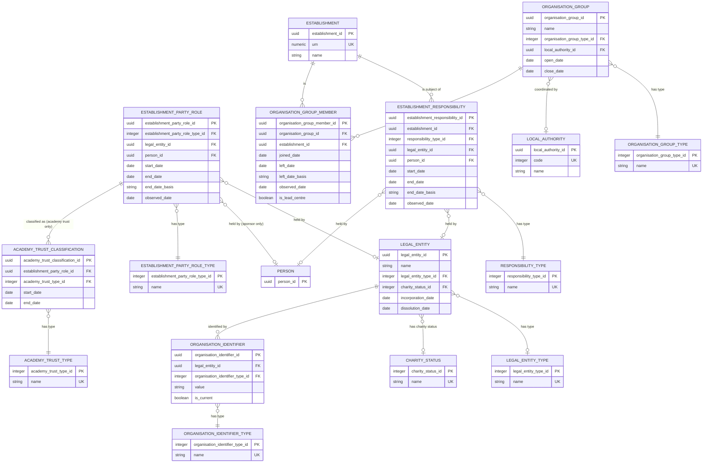

# Establishment groups

This document defines the legal entities, responsibilities and organisation groups associated with establishments in the Establishment Registry. It describes the target domain model. BAU source records and the decisions used to map them are migration lineage, not target-domain data.

## Establishment groups ERD

The groups branch is shown separately so that the main establishment ERD remains readable. A legal entity can hold dated establishment-party roles and can have dated responsibilities for establishments. A person can hold a school-sponsor role and permitted responsibilities. A federation or children's-centre grouping is instead a named group of establishments; it is not a legal entity.

The model contains:

- legal entities, their legal form, charity status and external identifiers;
- dated establishment-party roles held by a legal entity or, for a school sponsor, a person;
- dated academy-trust classifications for academy-trust roles;
- dated responsibilities held by a legal entity or person for an establishment; and
- dated membership of federations and children's-centre organisation groups.



`ESTABLISHMENT` and `LOCAL_AUTHORITY` are defined in the establishment slice. `PERSON` belongs to the people slice. They are shown here only as relationship endpoints.

## Scope

### In scope

- Legal entities that run, sponsor or support establishments, or are their proprietors.
- Legal entity type, charity status and external identifiers.
- Dated academy-trust, foundation-trust, umbrella-trust and school-sponsor roles.
- Dated single-academy trust, multi-academy trust and secure single-academy trust classifications.
- Responsibilities held by academy trusts, sponsors, foundation trusts and proprietors.
- Federations, children's-centre groups and children's-centre collaborations, with their establishment members.

### Deferred

- Legal-entity addresses, contacts, head-of-group details, and proprietor contact details.
- Name history.
- Local-authority maintenance, which belongs to the accountability slice.
- Succession between legal entities beyond a change from SAT to MAT.
- Umbrella-trust relationships and user permission scopes.
- Whether foundation-trust, umbrella-trust and school-sponsor roles may be assigned to new target records. This will be enforced by the application once decided; assignability and retirement dates are not stored in this logical model.

### Migration boundary

BAU group UIDs, Group IDs, source names, source type codes, source links and the evidence used to resolve identity are not attributes of the target model. Mapping them to target records, retaining identity decisions, and redirects from legacy group pages belong in a separate migration-lineage schema if they are required.

In particular, a BAU group identifier does not identify a target legal entity: a source record may resolve to a legal entity, a person or an organisation group. The target has no BAU group-reference mapping table.

## Entities

### Legal entity

`legal_entity` identifies an organisation that is not an establishment. It represents academy trusts, sponsoring bodies, foundation trusts, umbrella trusts and proprietor bodies.

```text
Which legal entity is this, what type is it, and is it a charity?
```

- One row represents one real-world legal entity. A SAT record, a MAT record and a sponsor record can resolve to the same row.
- An establishment remains an `establishment`; the wider organisation concept is a union view, not a shared target table.
- Academy-trust type is not a legal-entity type.
- The current name is held here. Name history is deferred.

| Attribute | Required | Rule |
| --- | --- | --- |
| `legal_entity_id` | Yes | Generated opaque target identifier. |
| `name` | Yes | Current name; for a company, its registered name. |
| `legal_entity_type_id` | No | Controlled type where known. |
| `charity_status_id` | No | Registered, exempt, excepted or not a charity; null when unknown. |
| `incorporation_date` | No | Date of incorporation where incorporated. |
| `dissolution_date` | No | Date of dissolution where known from an authoritative register. |

The provisional `legal_entity_type` vocabulary is: charitable company limited by guarantee; company limited by guarantee; private limited company; public limited company; limited liability partnership; charitable incorporated organisation; body incorporated by Royal Charter; unincorporated charitable trust; public body; overseas entity; sole trader; and traditional partnership.

### Organisation identifier

`organisation_identifier` holds an identifier issued by an external authority for a legal entity.

```text
Which external identifiers refer to this legal entity?
```

- Identifier types are Companies House number, UKPRN and Charity Commission number.
- A legal entity can have several values of one type over time, but only one current value of a type.
- A current value is unique within its identifier type. A replaced value cannot be current for another legal entity.
- Values are stored as text so leading zeroes are retained.

| Attribute | Required | Rule |
| --- | --- | --- |
| `organisation_identifier_id` | Yes | Generated opaque target identifier. |
| `legal_entity_id` | Yes | The owning legal entity. |
| `organisation_identifier_type_id` | Yes | Controlled identifier type. |
| `value` | Yes | Identifier as issued. |
| `is_current` | Yes | False when a value has been replaced. |

### Establishment party role

`establishment_party_role` records that a legal entity or person held a recognised role in relation to establishments for one continuous period.

```text
Which recognised role did this party hold, and for what continuous period?
```

- The role types are academy trust, foundation trust, umbrella trust and school sponsor.
- Every role has exactly one holder. Exactly one of `legal_entity_id` and `person_id` is set.
- A person can hold only a school-sponsor role.
- A party can hold the same role type more than once, but each row represents one continuous period. If a role ends and later starts again, the later period is a new row.
- Periods for the same party and role type cannot overlap. A gap between periods is allowed.
- Whether foundation-trust, umbrella-trust and school-sponsor roles may be assigned to new target records is deferred. Once decided, the application will enforce that policy. The logical model stores neither assignability nor retirement dates.

| Attribute | Required | Rule |
| --- | --- | --- |
| `establishment_party_role_id` | Yes | Generated opaque target identifier. |
| `establishment_party_role_type_id` | Yes | Academy trust, foundation trust, umbrella trust or school sponsor. |
| `legal_entity_id` | Conditional | The legal entity holding the role. |
| `person_id` | Conditional | The person holding the role; permitted only for school sponsor. |
| `start_date` | No | First date on which the role applies; null means unknown. |
| `end_date` | No | First date on which the role no longer applies. |
| `end_date_basis` | Conditional | `evidenced` or `inferred`; null where there is no end date. |
| `observed_date` | Conditional | Source-snapshot date on which a role with an unknown start was seen in effect. |

The school-sponsor role means that DfE recognised the party as a school sponsor. It does not, by itself, assert formal approval, sponsorship of a particular establishment or governance rights over an academy trust. Sponsorship of a particular establishment is recorded separately as an `establishment_responsibility`. Formal approval and trust-level governance rights are outside this model unless a reliable source is identified.

### Academy trust classification

`academy_trust_classification` records the classification held by an academy-trust role for a period.

```text
How was this academy-trust role classified, and when?
```

- The types are single-academy trust, multi-academy trust and secure single-academy trust.
- Classifications exist only for academy-trust roles. Every academy-trust role has at least one classification.
- Classification periods for one role cannot overlap and should fall within the role's period.
- A SAT-to-MAT change creates two classification periods for one continuous academy-trust role and one legal entity. It does not create a second legal entity or a second role.
- The classification is recorded, not derived from the number of academies.

| Attribute | Required | Rule |
| --- | --- | --- |
| `academy_trust_classification_id` | Yes | Generated opaque target identifier. |
| `establishment_party_role_id` | Yes | The academy-trust role being classified. |
| `academy_trust_type_id` | Yes | Single-academy trust, multi-academy trust or secure single-academy trust. |
| `start_date` | No | First date on which the classification applies; null means unknown. |
| `end_date` | No | First date on which the classification no longer applies. |

#### Why the role and classification both have dates

The two periods answer different questions:

| Period | Question answered | What causes a new period? |
| --- | --- | --- |
| `establishment_party_role` | When did this party act as an academy trust? | The academy-trust role ends, or it ends and later restarts. |
| `academy_trust_classification` | During that academy-trust role, when was it a SAT, MAT or secure SAT? | The recorded academy-trust type changes. |

The role is the longer-lived concept. A classification describes the academy-trust role; it is not a second role and it is not the legal entity's lifecycle. Neither period says when the trust ran a particular academy; that period belongs to `establishment_responsibility`. One continuous role can therefore contain several successive classification periods.

The dates follow these rules:

- A classification cannot exist without its academy-trust role.
- Every known part of a classification period falls within the role period.
- Classification periods for the same role do not overlap.
- Successive classifications can meet on the same date because periods are half open: the earlier classification ends on the first day the later classification applies.
- Ending a classification does not end the academy-trust role when another classification starts immediately.
- Ending the academy-trust role ends every classification under it. If the party later becomes an academy trust again, that is a new role with its own classification history.
- Null dates mean that the boundary is unknown. They do not mean that the role and classification are necessarily coterminous.

**Example 1: continuous SAT-to-MAT change (illustrative).** This is one legal entity and one uninterrupted academy-trust role. Only its classification changes.

| Record | Start date | End date |
| --- | --- | --- |
| Academy-trust role | 2011-01-17 | null |
| SAT classification | 2011-01-17 | 2018-04-27 |
| MAT classification | 2018-04-27 | null |

On 27 April 2018 the trust is classified as a MAT. There is no gap or overlap and no second role is created.

**Example 2: role and classification end together.** T20, `MARCH 2016 LIMITED`, has one academy-trust role and one MAT classification. The source does not establish either start boundary, so both starts are null. Both periods end on 29 February 2016 when the recorded academy-trust role ends.

| Record | Start date | End date |
| --- | --- | --- |
| Academy-trust role | unknown | 2016-02-29 |
| MAT classification | unknown | 2016-02-29 |

The matching end dates are a fact about T20; they are not a general rule that the two periods must always be identical.

**Example 3: a role ends and later restarts (illustrative).** A gap in the academy-trust role creates two role records, even if the classification before and after the gap is MAT.

| Record | Start date | End date |
| --- | --- | --- |
| Academy-trust role 1 | 2010-09-01 | 2015-09-01 |
| MAT classification under role 1 | 2010-09-01 | 2015-09-01 |
| Academy-trust role 2 | 2017-09-01 | null |
| MAT classification under role 2 | 2017-09-01 | null |

The two MAT classifications cannot be combined because they classify different continuous role periods.

### Establishment responsibility

`establishment_responsibility` records that a legal entity or person runs, sponsors or supports an establishment, or is its proprietor, for a period.

```text
Which legal entity or person has which responsibility for this establishment, and for what period?
```

There is one row per party, establishment, responsibility type and period. Exactly one of `legal_entity_id` and `person_id` is set. A person can be the party only for `sponsored_by` and `proprietor`.

| Attribute | Required | Rule |
| --- | --- | --- |
| `establishment_responsibility_id` | Yes | Generated opaque target identifier. |
| `establishment_id` | Yes | The existing establishment. |
| `responsibility_type_id` | Yes | Controlled responsibility type. |
| `legal_entity_id` | Conditional | Responsible legal entity. |
| `person_id` | Conditional | Responsible person, where permitted. |
| `start_date` | No | First date on which the responsibility applies; null means unknown. |
| `end_date` | No | First date on which it no longer applies. |
| `end_date_basis` | Conditional | `evidenced` or `inferred`; null where there is no end date. |
| `observed_date` | Conditional | Source-snapshot date on which a relationship with an unknown start was seen in effect. |

| Responsibility type | Meaning |
| --- | --- |
| `run_by_academy_trust` | The academy trust runs the academy or free school and is accountable for it. |
| `sponsored_by` | The legal entity or person recorded as the establishment's sponsor. |
| `supported_by_foundation_trust` | The foundation trust that supports a foundation school. |
| `proprietor` | The legal entity or person responsible for managing an independent school, non-maintained special school or city technology college. This does not model ownership of premises or a proprietor company. |

The accountability slice is expected to add `maintained_by_local_authority`.

### Organisation group

`organisation_group` is a named group of establishments with its own lifecycle but no legal identity.

```text
Which named group of establishments is this, and when did it exist?
```

- It is used only for federations, children's-centre groups and children's-centre collaborations.
- It is not a legal entity and has neither a legal-entity type nor organisation identifiers.
- Children's-centre groups and collaborations are coordinated by a local authority; federations are not.
- Status is derived from dates.

| Attribute | Required | Rule |
| --- | --- | --- |
| `organisation_group_id` | Yes | Generated opaque target identifier. |
| `name` | Yes | Current name. |
| `organisation_group_type_id` | Yes | Federation, children's-centre group or children's-centre collaboration. |
| `local_authority_id` | Conditional | Required for children's-centre types and absent for federations. |
| `open_date` | No | First date on which the group existed, where known. |
| `close_date` | No | First date on which the group no longer existed, where known. |

### Organisation group member

`organisation_group_member` records that an establishment belongs to an organisation group for a period.

```text
Which establishments belong to this group, since when, and which one is the lead centre?
```

Only establishments can be group members in this slice.

| Attribute | Required | Rule |
| --- | --- | --- |
| `organisation_group_member_id` | Yes | Generated opaque target identifier. |
| `organisation_group_id` | Yes | The organisation group. |
| `establishment_id` | Yes | The member establishment. |
| `joined_date` | No | First date on which membership applies; null means unknown. |
| `left_date` | No | First date on which membership no longer applies. |
| `left_date_basis` | Conditional | `evidenced` or `inferred`; null where there is no left date. |
| `observed_date` | Conditional | Source-snapshot date on which membership with an unknown start was seen in effect. |
| `is_lead_centre` | Conditional | Used only for children's-centre groups. True identifies the lead centre; null means the source does not say. Lead-centre history is deferred. |

## Derived views

The following are views of responsibilities and memberships. They are not separately stored collections.

| View | Definition |
| --- | --- |
| Academy trust's academies | `run_by_academy_trust` responsibilities in effect on a date, grouped by the legal entity holding the academy-trust role. |
| Sponsor's academies | `sponsored_by` responsibilities in effect on a date, grouped by party. |
| Foundation trust's schools | `supported_by_foundation_trust` responsibilities in effect on a date. |
| Proprietor's schools | `proprietor` responsibilities in effect on a date, grouped by party. |
| Academy count check | Number of academies per academy trust; a data-quality check, not a way to set trust type. |

An on-date view has three states:

- **Known in effect:** the start is known and on or before the date, or the date is its `observed_date`.
- **Possibly in effect:** the start is unknown and the date is before `observed_date`.
- **Not in effect:** otherwise, including after a known end date.

## Cardinality and integrity rules

1. Every establishment-party role has exactly one party. A person may hold only a school-sponsor role.
2. Each `establishment_party_role` row represents one continuous period. A party holds at most one role of each type in effect on a date. If the role ends and later starts again, create a second role row. Periods for the same party and role type cannot overlap, but a gap is allowed.
3. A role's start date cannot be after its end date. A null start date means unknown, not "since the beginning".
4. Academy-trust classifications exist only for academy-trust roles. Every academy-trust role has at least one classification. One role may have successive classifications, but its classification periods cannot overlap.
5. A classification period should fall within its academy-trust role period. A source conflict is reported for review; it does not extend the role or classification to make the dates agree.
6. Every establishment responsibility has exactly one party. A person may be the party only for `sponsored_by` and `proprietor`.
7. Responsibility start dates cannot be after end dates. A null start date means unknown, not "since the beginning".
8. For `run_by_academy_trust`, the party is a legal entity holding an academy-trust role. An establishment has at most one in effect on a date. An open academy or free school must have one. A responsibility outside the role period is reported as a warning.
9. For `sponsored_by`, an establishment has at most one in effect on a date, and only academy and free-school establishment types may have one. A sponsor should hold a school-sponsor role covering the responsibility; a conflict or missing role is reported as a warning.
10. For `supported_by_foundation_trust`, the party is a legal entity holding a foundation-trust role. An establishment has at most one in effect on a date, and only foundation and foundation-special establishment types may have one. A responsibility outside the role period is reported as a warning. The legal-form and charity-status check is also a warning where the necessary evidence is unavailable.
11. An establishment may have more than one proprietor in effect. Only independent school types, non-maintained special schools and city technology colleges may have a proprietor. Open other independent schools and other independent special schools must have at least one.
12. An establishment is in at most one organisation group of each type on a date. Federation members are maintained schools; children's-centre group and collaboration members are children's centres.
13. An open federation has at least two members.
14. A children's-centre group has at most one member with `is_lead_centre = true`. `is_lead_centre` is null for all other group types.
15. `local_authority_id` is required for children's-centre group types and absent for federations.
16. No stored collection restates a responsibility: an academy trust's academies are not organisation-group memberships.
17. A relationship should fall within the lifetime of its party or group where those dates are known. A conflict is reported for review; it does not invent a date to satisfy the rule.
18. A possible overlap involving an unknown start date is reported as a warning. Known-date overlaps block loading.

## Date convention

All dated relationships use a half-open period. The start date is the first day that the relationship applies; the end or left date is the first day it no longer applies. Successive periods can therefore meet on the same day without a gap or overlap.

- A placeholder source date becomes null, not a factual business date.
- An `observed_date` records that a relationship was seen in effect in a source snapshot when its actual start is not known.
- An end or left date is `evidenced` when a source records it, and `inferred` when it is derived from the closure of an establishment, party or group. An inferred end is an upper bound: the relationship may have ended earlier.
- Audit timestamps record when a target row was entered separately from these business dates.

## Source mapping

The following mapping is a migration aid only. Source tables and fields do not define target entities or identifiers.

| Source data | Target concept | Mapping outcome |
| --- | --- | --- |
| Academy-trust records | `legal_entity`, `establishment_party_role`, `academy_trust_classification`, `organisation_identifier` | Resolve to the real legal entity. Create an academy-trust role and its dated SAT, MAT or SSAT classifications. SAT and MAT records for the same company become one continuous role with successive classifications. Authoritative Companies House, UKPRN and Charity Commission identifiers become organisation identifiers. |
| Academy-trust links | `establishment_responsibility` | Create `run_by_academy_trust` periods after identity resolution. |
| Sponsor records and links | `legal_entity` or `person`, `establishment_party_role`, then `establishment_responsibility` | Resolve the sponsor party and create a school-sponsor role for each continuous role period. Create `sponsored_by` responsibilities only for evidenced establishment links. The role does not assert formal approval or governance rights. |
| Foundation-trust records and links | `legal_entity`, `establishment_party_role`, then `establishment_responsibility` | Create a foundation-trust role for each continuous role period and `supported_by_foundation_trust` responsibilities for evidenced links. |
| Umbrella-trust records | `legal_entity`, `establishment_party_role` | Create a legal entity and an umbrella-trust role. No establishment responsibility follows without relationship evidence. |
| Proprietor names and proprietor records | `legal_entity` or `person`, then `establishment_responsibility` | Create `proprietor` periods after resolving a body or person. |
| Federation and children's-centre records | `organisation_group` | Create the appropriate group type and lifecycle. |
| Federation and children's-centre links | `organisation_group_member` | Create dated memberships and the current lead-centre indication where evidenced. |
| Source group relationships | Migration lineage only | May support identity resolution but do not create a target group-to-group relationship. |

## Physical-model boundary

The target physical schema for this slice will contain the target tables represented in the ERD: `legal_entity`, `legal_entity_type`, `charity_status`, `organisation_identifier_type`, `organisation_identifier`, `establishment_party_role_type`, `establishment_party_role`, `academy_trust_type`, `academy_trust_classification`, `responsibility_type`, `establishment_responsibility`, `organisation_group_type`, `organisation_group` and `organisation_group_member`.

It references the existing establishment, local-authority and person tables by their opaque identifiers. Migration lineage is deliberately outside this schema.
