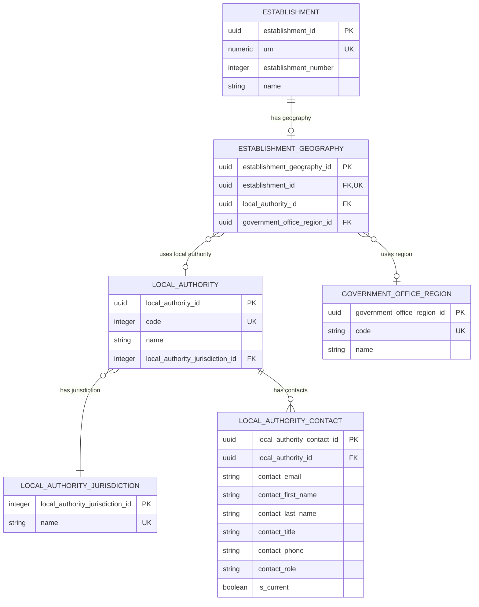

# Establishment geography

This is the first geography slice for the Establishment Registry. It models
the establishment's current local-authority relationship without attempting to
model the complete administrative geography hierarchy.

## Scope

This slice answers:

```text
Which local authority is associated with this establishment?
```

It covers:

- The current local authority associated with an establishment.
- The Government Office Region classification associated with an establishment.
- The controlled local-authority code and name.
- Normalised local-authority contact records.
- The distinction between local-authority accountability and the physical
  address of the establishment.

It does not yet cover GSS local-authority codes, districts, wards, parliamentary
constituencies, LSOAs, MSOAs, urban/rural classifications or postcode-derived
geography. Those should be added as separate geography slices after the local
authority relationship is reviewed.

## Design decision

Local-authority geography is modelled in a dedicated `establishment_geography`
entity rather than as a column on `establishment`. This keeps the core identity
record focused on the establishment itself and gives geography a clear place
for future attributes, such as additional administrative areas or effective
dates. The first version is an optional one-to-one record containing a
`local_authority_id` foreign key to the stable local-authority reference and an
optional `government_office_region_id` foreign key to the region reference.

## Geography ERD



## Local authority

`local_authority` is controlled reference data for the local authority
associated with an establishment. The relationship is optional because not
all establishment types have the same local-authority context, and some
providers operate outside a conventional English local-authority structure.

| Column | Required | Meaning and rule |
| --- | --- | --- |
| `local_authority_id` | Yes | Stable target identifier for the reference record. |
| `code` | Yes | Numeric DfE local-authority code used for LAESTAB/DfE-number reconciliation. |
| `name` | Yes | Current published local-authority name. |
| `local_authority_jurisdiction_id` | Yes | Controlled jurisdiction classification for the local authority. |

The code is the integration and reconciliation value. The name is a label and
may change without changing the identity of the local authority record.

## Local authority jurisdiction

`local_authority_jurisdiction` classifies the jurisdiction represented by a
local-authority reference. It replaces the legacy `LocalAuthorityGroup` name,
which describes these values inaccurately as a group.

This is a closed controlled list:

| Value | Meaning |
| --- | --- |
| English | Local authority for an English jurisdiction. |
| Welsh | Local authority for a Welsh jurisdiction. |

“Not applicable” is represented by a missing geography relationship, not by a
sentinel jurisdiction or local-authority record.

## Establishment geography

`establishment_geography` is an optional, one-to-one owned substructure for
the establishment's current geography. It keeps geography attributes out of
the core establishment identity table while preserving the DfE number/LAESTAB
relationship through the referenced `local_authority` record.

| Attribute | Required | Meaning and rule |
| --- | --- | --- |
| `establishment_geography_id` | Yes | Technical key for the geography substructure. |
| `establishment_id` | Yes | One-to-one owner relationship to `establishment`. |
| `local_authority_id` | Conditional | Current local-authority relationship, where the source provides one. Foreign key to `local_authority.local_authority_id`. |
| `government_office_region_id` | Conditional | Current Government Office Region classification, where the source provides one. Foreign key to `government_office_region.government_office_region_id`. |

An establishment has at most one current geography record and at most one
current local authority in this slice. This
does not imply that the local authority is the establishment's owner or
accountable body. Ownership, accountability and governance relationships are
separate concepts and will be modelled in the establishment-group and
governance slices.

## Government Office Region

`government_office_region` is controlled reference data for the region
classification recorded directly against an establishment. It is linked from
`establishment_geography`, rather than from `local_authority`, because the
legacy source stores `GOR_code` on `dbo.Establishment`.

| Attribute | Required | Meaning and rule |
| --- | --- | --- |
| `government_office_region_id` | Yes | Stable target identifier for the reference record. |
| `code` | Yes | Legacy GOR integration code; unique in the target reference data. |
| `name` | Yes | Published region name. |

The region relationship is optional. A missing value means that no GOR
classification is available; it does not require a sentinel region record.

## Local authority contact

`local_authority_contact` stores contact details separately from the local
authority identity. A local authority may have multiple contacts, and contact
records can be retained when responsibilities or contact details change.

| Column | Required | Meaning and rule |
| --- | --- | --- |
| `local_authority_contact_id` | Yes | Technical key for the contact record. |
| `local_authority_id` | Yes | Foreign key to the owning local authority. |
| `contact_email` | Conditional | Contact email address, where supplied. |
| `contact_first_name` | Conditional | Contact person's given name, where supplied. |
| `contact_last_name` | Conditional | Contact person's family name, where supplied. |
| `contact_title` | Conditional | Contact person's title or job title, where supplied. |
| `contact_phone` | Conditional | Contact telephone number, where supplied. |
| `contact_role` | Conditional | Role or purpose of the contact; controlled values require further evidence. |
| `is_current` | Yes | Indicates whether the contact is current. Multiple current contacts are permitted until role rules are agreed. |

## BAU source mapping

The legacy schema already treats `dbo.Establishment.LA_code` as a foreign key
to `dbo.LocalAuthority.code`:

| Logical concept | BAU source | Notes |
| --- | --- | --- |
| Establishment local-authority code | `dbo.Establishment.LA_code` | Nullable current relationship, loaded into `establishment_geography`. |
| Local-authority code | `dbo.LocalAuthority.code` | Controlled integration value. |
| Local-authority name | `dbo.LocalAuthority.name` | Current display label. |
| Local-authority jurisdiction | `dbo.LocalAuthority.group_code` -> `dbo.LocalAuthorityGroup.name` | Legacy source relationship; target name is `LocalAuthorityJurisdiction`. |
| Government Office Region | `dbo.Establishment.GOR_code` -> `dbo.GovernmentOfficeRegion.code` | Nullable establishment geography classification. |

The existing DfE number remains derived from local-authority code and
establishment number. This geography slice does not change the identifier
rules; it normalises the local-authority reference so the relationship has an
explicit target entity.

## Rules and open decisions

- `local_authority.code` must be unique in the target reference data.
- An establishment may have no local-authority relationship when the source
  does not provide one or the establishment is outside the conventional local
  authority model.
- Local-authority names must not be copied into `establishment` as free text.
- Local-government reorganisation and historical local-authority changes are
  deferred. A future history model will be needed if the service must explain
  which authority applied at a past date.
- The complete set of local-authority values should be extracted from the BAU
  source before physical-schema and seed work begins.

## Physical implementation boundary

The physical model uses these tables:

| Logical concept | Physical table | Current status |
| --- | --- | --- |
| Establishment geography | `establishment.establishment_geography` | Physical table defined with nullable `local_authority_id`; source migration populates it only when a real local authority applies. |
| Local-authority jurisdiction | `establishment.local_authority_jurisdiction` | Schema and English/Welsh controlled values defined. |
| Local authority | `establishment.local_authority` | Schema defined; BAU reference data still to be loaded. |
| Government Office Region | `establishment.government_office_region` | Controlled reference table defined and wired to the migration; load from the local BAU `dbo.GovernmentOfficeRegion` copy before establishment rows. |
| Local-authority contact | `establishment.local_authority_contact` | Schema defined as a one-to-many relationship; BAU contact data still to be loaded. |

The target relationship will use `establishment_geography.local_authority_id`
as the foreign key to `local_authority.local_authority_id`. The local
authority's numeric `code` remains reference data used for DfE-number/LAESTAB
reconciliation, but is not used as the relationship key.
