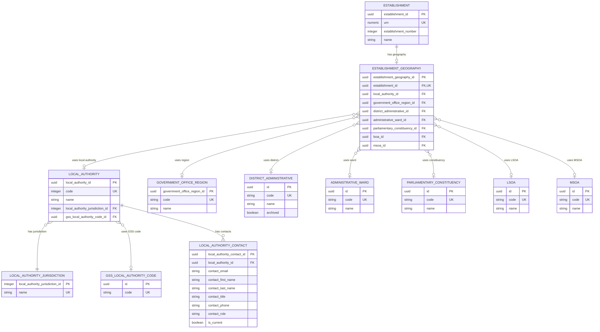

# Establishment geography

## Purpose

This model describes the local authority, Government Office Region, administrative
district, administrative ward, parliamentary constituency, LSOA and MSOA associated with an establishment. It also defines
local-authority jurisdiction, statistical identifiers and contact details.

Geographic associations describe location and classification. Ownership and
governance are separate relationships. Postal addresses and sites are described
in [Location, contact and sites](location-contact-and-sites.md).

## Relationships

An establishment has zero or one geography record. Each record belongs to exactly
one establishment and can reference one local authority, one region, one district,
one ward, one parliamentary constituency, one LSOA and one MSOA. Each reference value can be associated
with many establishments.

A local authority has one jurisdiction, zero or one GSS code and any number of
contacts. Region, district, ward, parliamentary constituency, LSOA and MSOA classifications are recorded independently;
this model does not define a hierarchy between them.

The establishment entity is shown for context; its full definition is in
[Identity and classification](identity-and-classification.md).

## Tables and columns

Required columns must have a value. Optional relationships may be absent when a
classification is not recorded or does not apply. Primary keys identify records;
reference codes identify distinct values within their respective code lists.

### Establishment geography

`establishment_geography`

Groups the geographic classifications associated with an establishment.

| Column | Type | Required | Meaning and constraint |
| --- | --- | --- | --- |
| `establishment_geography_id` | UUID | Yes | Primary key. |
| `establishment_id` | UUID | Yes | Unique foreign key to establishment.establishment_id. |
| `local_authority_id` | UUID | No | Foreign key to local_authority.local_authority_id. |
| `government_office_region_id` | UUID | No | Foreign key to government_office_region.government_office_region_id. |
| `district_administrative_id` | UUID | No | Foreign key to district_administrative.id. |
| `administrative_ward_id` | UUID | No | Foreign key to administrative_ward.id. |
| `parliamentary_constituency_id` | UUID | No | Foreign key to parliamentary_constituency.id. |
| `lsoa_id` | UUID | No | Foreign key to lsoa.id. |
| `msoa_id` | UUID | No | Foreign key to msoa.id. |

### Local authority

`local_authority`

Identifies the local authority associated with an establishment.

| Column | Type | Required | Meaning and constraint |
| --- | --- | --- | --- |
| `local_authority_id` | UUID | Yes | Primary key. |
| `code` | Integer | Yes | Unique DfE local-authority code. |
| `name` | Text | Yes | Local-authority name. |
| `local_authority_jurisdiction_id` | Integer | Yes | Foreign key to local_authority_jurisdiction.local_authority_jurisdiction_id. |
| `gss_local_authority_code_id` | UUID | No | Foreign key to gss_local_authority_code.id. |

### Local-authority jurisdiction

`local_authority_jurisdiction`

Classifies a local authority's jurisdiction. The controlled values are English and Welsh.

| Column | Type | Required | Meaning and constraint |
| --- | --- | --- | --- |
| `local_authority_jurisdiction_id` | Integer | Yes | Primary key. |
| `name` | Text | Yes | Unique jurisdiction name. |

### GSS local-authority code

`gss_local_authority_code`

GSS means Government Statistical Service. A GSS local-authority code is an ONS geographic identifier used to link local authorities to statistical datasets. It is distinct from the numeric DfE local-authority code.

| Column | Type | Required | Meaning and constraint |
| --- | --- | --- | --- |
| `id` | UUID | Yes | Primary key. |
| `code` | Text | Yes | Unique GSS local-authority code; contains letters and digits. |

### Government Office Region

`government_office_region`

Identifies the region classification associated with an establishment.

| Column | Type | Required | Meaning and constraint |
| --- | --- | --- | --- |
| `government_office_region_id` | UUID | Yes | Primary key. |
| `code` | Text | Yes | Unique region code. |
| `name` | Text | Yes | Region name. |

### Administrative district

`district_administrative`

Identifies the administrative district associated with an establishment's location. District and local-authority classifications can describe the same area while remaining distinct concepts.

| Column | Type | Required | Meaning and constraint |
| --- | --- | --- | --- |
| `id` | UUID | Yes | Primary key. |
| `code` | Text | Yes | Unique district code. |
| `name` | Text | Yes | District name. |
| `archived` | Boolean | Yes | Whether the district reference value is archived. Existing relationships can reference archived districts. |

### Administrative ward

`administrative_ward`

Identifies the ward associated with an establishment's location.

| Column | Type | Required | Meaning and constraint |
| --- | --- | --- | --- |
| `id` | UUID | Yes | Primary key. |
| `code` | Text | Yes | Unique ward code. |
| `name` | Text | Yes | Ward name. |

### Parliamentary constituency

`parliamentary_constituency`

Identifies the parliamentary constituency associated with an establishment's
location.

| Column | Type | Required | Meaning and constraint |
| --- | --- | --- | --- |
| `id` | UUID | Yes | Primary key. |
| `code` | Text | Yes | Unique constituency code. |
| `name` | Text | Yes | Constituency name. |

### LSOA

`lsoa`

Identifies the Lower Layer Super Output Area associated with an establishment's
location. LSOAs are small-area statistical geographies designed for consistent
reporting of statistics below local-authority level. They are built from groups
of Output Areas and are modelled separately from MSOAs.

The Office for National Statistics (ONS) defines and publishes the codes,
names and boundary products for LSOAs in England and Wales. A representative
example is:

The ONS description of these statistical geographies is available in its
[Census 2021 geographies guidance](https://www.ons.gov.uk/methodology/geography/ukgeographies/censusgeographies/census2021geographies).

| Code | Name | Interpretation |
| --- | --- | --- |
| `E01000001` | City of London 001A | An England and Wales LSOA code beginning with `E01`. |

| Column | Type | Required | Meaning and constraint |
| --- | --- | --- | --- |
| `id` | UUID | Yes | Primary key. |
| `code` | Text | Yes | Unique LSOA code. |
| `name` | Text | Yes | LSOA name. |

The code and name identify the statistical geography; they do not identify a
school, local authority or electoral ward.

### MSOA

`msoa`

Identifies the Middle Layer Super Output Area associated with an establishment's
location. MSOAs are statistical geographies made up of groups of LSOAs and
usually fit within a local authority. They are modelled separately from LSOAs.

The ONS defines and publishes the codes, names and boundary products for MSOAs
in England and Wales. A representative example is:

| Code | Name | Interpretation |
| --- | --- | --- |
| `E02000001` | City of London 001 | An England and Wales MSOA code beginning with `E02`. |

| Column | Type | Required | Meaning and constraint |
| --- | --- | --- | --- |
| `id` | UUID | Yes | Primary key. |
| `code` | Text | Yes | Unique MSOA code. |
| `name` | Text | Yes | MSOA name. |

An MSOA normally contains several LSOAs. The relationship between the two
statistical geographies is maintained by ONS lookup and boundary products; this
model records the Establishment's current LSOA and MSOA classifications without
duplicating that hierarchy.

### Local-authority contact

`local_authority_contact`

Describes a contact for a local authority. Multiple contacts may be current at the same time.

| Column | Type | Required | Meaning and constraint |
| --- | --- | --- | --- |
| `local_authority_contact_id` | UUID | Yes | Primary key. |
| `local_authority_id` | UUID | Yes | Foreign key to local_authority.local_authority_id. |
| `contact_email` | Text | No | Contact email address. |
| `contact_first_name` | Text | No | Contact person's given name. |
| `contact_last_name` | Text | No | Contact person's family name. |
| `contact_title` | Text | No | Contact person's title or job title. |
| `contact_phone` | Text | No | Contact telephone number. |
| `contact_role` | Text | No | Role or purpose of the contact. |
| `is_current` | Boolean | Yes | Whether the contact record is current. |

## Integrity rules

- Each establishment has at most one geography record.
- Every populated foreign key references an existing record.
- Reference codes are unique within their reference table. Names are labels and
  may change without changing a record's identity.
- Each local authority has exactly one jurisdiction and at most one GSS code.
- The DfE local-authority code combines with the establishment number to form
  the DfE number (LAESTAB).
- Archived district values remain valid references for existing relationships.
- Parliamentary constituency codes are unique within the constituency reference.
- LSOA codes are unique within the LSOA reference.
- MSOA codes are unique within the MSOA reference.
- A local-authority contact contains at least one of an email address, telephone
  number, given name, family name or title.

## Model boundary

The model records current geographic associations without effective dates or
boundary-change history. Urban/rural classifications and postcode lookup data
are outside its scope.
