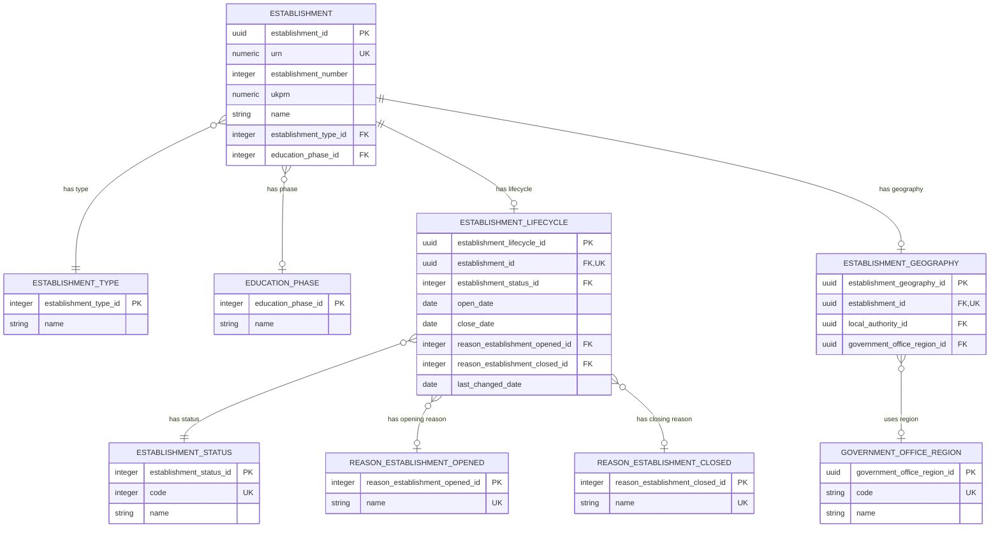

# Establishment identity and classification

This document defines the establishment identity, lifecycle and controlled classification data.

## Identity and classification ERD



## Establishment

`establishment` is the central business table for a current establishment
record. It holds the canonical identity, name and headline classification
context; operational provision, measures and locations are represented by owned
substructures.

Business-friendly pattern:

```text
For this establishment record,
what is its identity, name and headline classification?
```

- `urn` is the canonical public and reconciliation identifier.
- The DfE number is composed from the local-authority code in `establishment_geography` and the establishment number.
- UKPRN is an optional externally-issued provider identifier.
- This table deliberately does not absorb measures, governance, groups or site details.

| Column | Required | Meaning and rule |
| --- | --- | --- |
| `establishment_id` | Yes | Generated opaque technical key for internal relationships; not a public identifier. |
| `urn` | Yes | Immutable, globally unique canonical business identifier used for public routes, search and migration reconciliation. |
| `establishment_number` | Conditional | Local-authority-scoped establishment number, between 1 and 9999 where present. |
| `ukprn` | Conditional | Current UK Provider Reference Number supplied by UKRLP where applicable. |
| `name` | Yes | Current published establishment name; historic and alternative names are deferred. |

### Identifier rules

| Identifier | Cardinality | Constraint | Note |
| --- | --- | --- | --- |
| URN | Exactly one | Globally unique and immutable | The canonical public establishment identifier for this slice. |
| DfE number / LAESTAB | Derived | Uniqueness requires local-authority context | Derived from the referenced local authority's `code` and `establishment_number`, commonly rendered as `LA/ESTAB` with the establishment number zero-padded to four digits. |
| UKPRN | Zero or one | Eight-digit value; global uniqueness is not yet a target rule | Optional because it does not apply to every establishment. It is externally owned by UKRLP. |

The model must enforce the stated uniqueness constraints for the direct identifier attributes. The uniqueness scope for each identifier type must be defined by its owning authority.

## Establishment lifecycle

`establishment_lifecycle` records the current status of an establishment and
the key dates and reasons that explain its opening or closure. It is the
logical representation of the ontology's `EstablishmentLifecycle` concept.

Business-friendly pattern:

```text
Is the establishment open, when did its current lifecycle begin or end,
and what reason explains that change?
```

- An establishment has zero or one lifecycle record in this slice.
- `establishment_status_id` is a controlled value, not free text.
- Open and close dates, and their reasons, are conditional source facts. They
  must not be inferred when the source does not provide them.
- When both dates are present, `close_date` must not precede `open_date`.
- `last_changed_date` describes source currency; it is not the date of a
  lifecycle event.

| Column | Required | Meaning and rule |
| --- | --- | --- |
| `establishment_lifecycle_id` | Yes | Generated opaque technical key for the lifecycle record. |
| `establishment_id` | Yes | One-to-one owner relationship to `establishment`; unique in this table. |
| `establishment_status_id` | Yes | Controlled establishment-status reference value. |
| `open_date` | Conditional | Date the establishment opened, where supplied by the source. |
| `close_date` | Conditional | Date the establishment closed, where supplied by the source. |
| `reason_establishment_opened_id` | Conditional | Controlled reason for opening, where supplied by the source. |
| `reason_establishment_closed_id` | Conditional | Controlled reason for closure, where supplied by the source. |
| `last_changed_date` | Conditional | Source-system date on which the lifecycle data last changed. |

### BAU source mapping

The first migration maps lifecycle facts from `dbo.Establishment` and its
controlled reference tables. The target model keeps these facts together as
one owned lifecycle boundary rather than adding status and dates to the core
identity table.

| Logical concept | BAU source | Notes |
| --- | --- | --- |
| Establishment status | `dbo.Establishment.status_code` -> `dbo.EstablishmentStatus.code` | Preserve the controlled code and its label. |
| Open date | `dbo.Establishment.OpenDate` | Nullable source date. |
| Close date | `dbo.Establishment.CloseDate` | Nullable source date. |
| Reason opened | `dbo.Establishment.reasonEstablishmentOpened_code` -> `dbo.ReasonEstablishmentOpened.code` | Nullable source reason. |
| Reason closed | `dbo.Establishment.reasonEstablishmentClosed_code` -> `dbo.ReasonEstablishmentClosed.code` | Nullable source reason. |
| Last changed date | `dbo.Establishment.lastChangedDate` | Source currency marker. |

### Lifecycle reference data

`establishment_status`, `reason_establishment_opened` and
`reason_establishment_closed` are controlled reference-data entities. Names
provide the human-readable labels. The lifecycle record points to these
values rather than storing labels or source codes as unbounded text.

| Entity | Key attributes | Meaning |
| --- | --- | --- |
| `establishment_status` | `establishment_status_id`, numeric `code`, `name` | Current lifecycle status, such as open or closed. |
| `reason_establishment_opened` | `reason_establishment_opened_id`, `name` | Controlled reason explaining an opening event. |
| `reason_establishment_closed` | `reason_establishment_closed_id`, `name` | Controlled reason explaining a closure event. |

## Establishment status

`establishment_status` is a closed, controlled list. A lifecycle record must
use one of these values; applications must not create new status labels as
free text. The identifiers below are the canonical vocabulary values.

| Value | Canonical identifier | Meaning |
| --- | --- | --- |
| Open | `est:OpenStatus` | The establishment is currently open and operating. |
| Closed | `est:ClosedStatus` | The establishment has closed and is retained for historical reference. |
| Open, but proposed to close | `est:OpenProposedToCloseStatus` | The establishment is open, but a formal closure proposal is in progress. |
| Proposed to open | `est:ProposedToOpenStatus` | The establishment is approved or planned but has not yet opened. |

These four values are the complete list for this model slice. The BAU
`status_code` is mapped to the corresponding canonical value through
`dbo.EstablishmentStatus`; the BAU code itself is an integration detail and
is not used as an unbounded label in the logical model.

## Reason establishment opened

`reason_establishment_opened` is a closed, controlled list. The value is
optional because absence means that the source supplied no opening reason; it
must not be replaced with a made-up "not recorded" value.

| Value | Canonical identifier |
| --- | --- |
| Academy Converter | `est:AcademyConverterOpenReason` |
| New Provision | `est:NewProvisionOpenReason` |
| Result of Amalgamation | `est:ResultOfAmalgamationOpenReason` |
| Fresh Start | `est:FreshStartOpenReason` |
| Academy Free School | `est:AcademyFreeSchoolOpenReason` |
| Result of Closure | `est:ResultOfClosureOpenReason` |
| Change Religious Character | `est:ChangeReligiousCharacterOpenReason` |
| Change in status | `est:ChangeInStatusOpenReason` |
| Former Independent | `est:FormerIndependentOpenReason` |
| Split school | `est:SplitSchoolOpenReason` |
| New Nursery School | `est:NewNurserySchoolOpenReason` |
| Meets accreditation standards | `est:MeetsAccreditationStandardsOpenReason` |
| Free Special School | `est:FreeSpecialSchoolOpenReason` |

## Reason establishment closed

`reason_establishment_closed` is a closed, controlled list. The value is
optional and is only populated when the source records a closure reason.

| Value | Canonical identifier |
| --- | --- |
| Academy Converter | `est:AcademyConverterCloseReason` |
| Result of Amalgamation/Merger | `est:ResultOfAmalgamationMergerCloseReason` |
| Closure | `est:ClosureCloseReason` |
| For Academy | `est:ForAcademyCloseReason` |
| Fresh Start | `est:FreshStartCloseReason` |
| Close Nursery School | `est:CloseNurserySchoolCloseReason` |
| Change Religious Character | `est:ChangeReligiousCharacterCloseReason` |
| Does not meet criteria for registration | `est:DoesNotMeetCriteriaForRegistrationCloseReason` |
| De-registered | `est:DeRegisteredCloseReason` |
| Academy Free School | `est:AcademyFreeSchoolCloseReason` |
| Change in status | `est:ChangeInStatusCloseReason` |
| Transferred to new sponsor | `est:TransferredToNewSponsorCloseReason` |
| Created in Error - application rejected | `est:CreatedInErrorCloseReason` |

## Establishment type

`establishment_type` is controlled reference data describing what kind of
establishment this is.

Business-friendly pattern:

```text
Which recognised establishment type describes this establishment?
```

- It is reference data, not free text on `establishment`.
- The establishment has one current type in this slice.
- Integer identifiers are seeded and stable; labels may change independently.

| Column | Required | Meaning and rule |
| --- | --- | --- |
| `establishment_type_id` | Yes | Seeded integer reference-data identifier. |
| `name` | Yes | Human-readable establishment-type label. |

## Education phase

`education_phase` classifies the broad phase of education provided by the
establishment.

Business-friendly pattern:

```text
Which education phase does this establishment provide?
```

- An establishment has at most one current phase in this slice.
- Multiple phases require further evidence before extending the model.

| Column | Required | Meaning and rule |
| --- | --- | --- |
| `education_phase_id` | Yes | Seeded integer reference-data identifier. |
| `name` | Yes | Human-readable phase label. |
