# Location, contact and sites

This document defines public contact, physical sites, establishment-to-site associations and postal addresses.

## Location And Contact ERD

The location-and-contact branch is shown separately so the main establishment ERD remains readable. An establishment is associated with every physical site at which it operates - exactly one may be designated as the main site, plus zero or more additional sites - and each site's postal address. Public contact values are held in the separate `establishment_contact` table. Address history and other contact channels are deferred.

```mermaid
erDiagram
    ESTABLISHMENT ||--o| ESTABLISHMENT_CONTACT : "has contact"
    ESTABLISHMENT ||--o{ ESTABLISHMENT_TO_SITE : "uses"
    ESTABLISHMENT_TO_SITE }o--|| SITE : "associates"
    SITE }o--|| ADDRESS : "uses"

    ESTABLISHMENT {
        uuid establishment_id PK
        numeric urn UK
        string name
    }

    ESTABLISHMENT_CONTACT {
        uuid establishment_contact_id PK
        uuid establishment_id FK, UK
        string website
        string telephone_number
    }

    ESTABLISHMENT_TO_SITE {
        uuid establishment_id PK, FK
        uuid site_id PK, FK
        boolean is_main_site
    }

    SITE {
        uuid site_id PK
        uuid address_id FK
        string site_name
        bigint uprn
    }

    ADDRESS {
        uuid address_id PK
        string address_line_1
        string address_line_2
        string address_line_3
        string town
        string county
        string postcode
    }
```



## Establishment contact

`establishment_contact` is the relational implementation of the contact part
of the ontology concept `EstablishmentLocationAndContact`. It holds the
establishment's optional public contact values independently from its physical
sites and addresses.

Business-friendly pattern:

```text
How can this establishment be contacted publicly?
```

- An establishment has zero or one contact record in this slice.
- `website` represents the optional public website URL (`est:Website`).
- `telephone_number` represents the optional main contact telephone number (`est:TelephoneNumber`).
- Each establishment has at most one website and at most one telephone number.
- This slice does not include email addresses, named contacts, headteachers or contact history.

| Column | Required | Meaning and rule |
| --- | --- | --- |
| `establishment_contact_id` | Yes | Technical key for the contact record. |
| `establishment_id` | Yes | One-to-one owner relationship to `establishment`; unique so there is at most one contact record. |
| `website` | Conditional | Public website URL where supplied; maps to `est:Website` and `esto:hasWebsite`. |
| `telephone_number` | Conditional | Main public contact telephone number where supplied; maps to `est:TelephoneNumber` and `esto:hasTelephoneNumber`. |

The vocabulary still groups these values under Location and Contact, and the
ontology still attaches them to `EstablishmentLocationAndContact`. Splitting
the values into a developer-friendly relational table is a physical/logical
mapping choice; it does not introduce a new business concept or alter the
ontology.

## Establishment to site

`establishment_to_site` records an establishment's use of a physical site.
It is an association because more than one establishment may operate from the
same physical site, including establishments in a federation.

| Column | Required | Meaning and rule |
| --- | --- | --- |
| `establishment_id` | Yes | Establishment participating in the association. |
| `site_id` | Yes | Physical site participating in the association. |
| `is_main_site` | Yes | Identifies the main site for this establishment; at most one association per establishment may be true. |

## Site

`site` represents a physical place at which the establishment operates.

Business-friendly pattern:

```text
What physical site does this establishment operate from,
and what address identifies that site?
```

- A site can be associated with one or more establishments.
- A site uses one current postal address.
- Main-site designation belongs on the establishment-to-site association, not on the physical site.
- UPRN belongs on the stable physical site, not on the mutable address text.

| Column | Required | Meaning and rule |
| --- | --- | --- |
| `site_id` | Yes | Technical key for a physical site. |
| `address_id` | Yes | Reusable key for the site's postal address. |
| `site_name` | Conditional | Optional site name where supplied; not an establishment identifier. |
| `uprn` | Conditional | Ordnance Survey Unique Property Reference Number for the physical location, where supplied; it may be shared by multiple establishment associations. |

### UPRN placement

`Site.uprn` is the Ordnance Survey [Unique Property Reference Number](https://www.ordnancesurvey.co.uk/public/unique-property-reference-numbers) - a numeric identifier for the addressable location itself, not for the establishment.

**Justification.** The OS page defines a UPRN as "a unique numeric identifier for every spatial address in Great Britain" that persists "throughout a property's life cycle - from planning permission through to demolition." Read literally, the first clause ties a UPRN to an address; but the second clause only makes sense if the UPRN survives changes to that address's postal text over the property's lifetime - otherwise "persists throughout the life cycle" would say nothing beyond "exists while the property exists." This is not just a hypothetical reading: street names can change independently of the property itself - a local authority can rename or renumber a street, updating every postal address on it - while the property occupying any given plot, and its UPRN, remains the same. OS's own definition therefore implies the UPRN tracks the underlying property, not any one rendering of its postal text.

That distinction decides the placement in this model. `Address` is a set of current-value text fields (`address_line_1`, `town`, `postcode`) with no versioning or history - this slice explicitly defers address history (see Scope). An identifier that must outlive changes to that text cannot correctly live on a record with no guarantee of surviving such changes. `Site` represents the stable physical location; `Address` is the mutable current-value rendering of it. `uprn` therefore belongs on `Site`.
## Address

`address` is the reusable current postal rendering of a physical location.
Address history is outside this slice.

Business-friendly pattern:

```text
What is the current postal address for this site?
```

- The address does not point back to a site; the using relationship holds `address_id`.
- The address text is mutable current-value data.
- UPRN is deliberately modelled on `site` because it identifies the property, not one rendering of its address.

| Column | Required | Meaning and rule |
| --- | --- | --- |
| `address_id` | Yes | Reusable technical key for a postal address. |
| `address_line_1` | Conditional | First address line, mapped from BAU `Street`. |
| `address_line_2` | Conditional | Second address line where supplied. |
| `address_line_3` | Conditional | Third address line, mapped from BAU `Address3`. |
| `town` | Conditional | Town or locality town, mapped from BAU `Town`. |
| `county` | Conditional | County where supplied. |
| `postcode` | Conditional | Postal code, mapped from BAU `Postcode`. |


### Site placement and lifecycle

The BAU model does not have a first-class `Site` concept for the principal location. The primary site is implicit: its postal address is held as columns on `dbo.Establishment` (`Street`, `Locality`, `Address3`, `Town`, `Postcode`, `UPRN`, `Easting` and `Northing`). BAU stores additional physical locations separately in `dbo.EstablishmentAdditionalAddresses`, linked by URN and `record_number`.

The target model makes every physical location explicit as a `Site`, because it is a business concept, not just a group of address strings, and because an establishment can operate at more than one location:

```text
Establishment
  -> EstablishmentToSite (main, is_main_site = true)
      -> Site
          -> Address
  -> EstablishmentToSite (additional, zero or more)
      -> Site
```

The target model links an establishment to a site through `establishment_to_site`. The `is_main_site` flag identifies the current principal site for that establishment, and a unique partial constraint prevents more than one main site association per establishment. An establishment may temporarily have no main site while its location data is incomplete.

Which establishment types, if any, should be permitted to have additional sites is not yet defined in this slice, and the logical model does not currently restrict it. This should be confirmed against evidence (for example, actual usage patterns in BAU's `EstablishmentAdditionalAddresses`) before an executable constraint is added.

`Address` is a reusable postal-address concept. It does not contain a `site_id`, because an address may be referenced by a site, a registered legal entity or another future subject. The foreign key is held by the using relationship (`Site.address_id`). The logical model therefore does not add address columns directly to `Establishment`.

