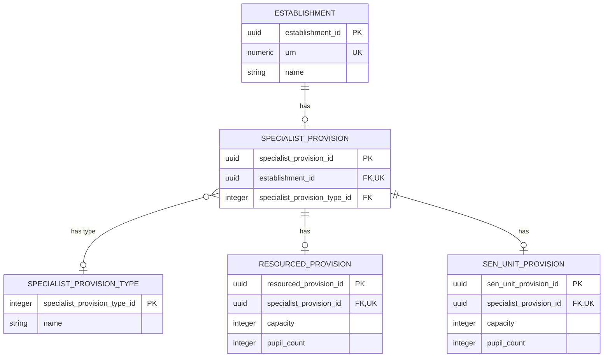

# Specialist provision

This document defines specialist provision, resourced provision and SEN unit measures.

## Specialist Provision ERD

The specialist-provision branch is shown separately because it has its own internal structure and would make the main establishment ERD too dense.



## Specialist provision

`specialist_provision` is the establishment-level container for specialist SEN
facilities and their measures.

Business-friendly pattern:

```text
Does this establishment have specialist provision,
and if so which specialist facilities and measures apply?
```

- It is optional and at most one per establishment in this slice.
- The type classifier identifies resourced provision, SEN unit, or both.
- The detailed resourced and SEN-unit measures remain separate child concepts.

| Column | Required | Meaning and rule |
| --- | --- | --- |
| `specialist_provision_id` | Conditional | Technical key for the specialist-provision substructure. |
| `establishment_id` | Yes | One-to-one owner relationship to `establishment`. |
| `specialist_provision_type_id` | Conditional | Controlled value indicating resourced provision, SEN unit or both. |

## Specialist provision type

`specialist_provision_type` is controlled reference data for the kind of
specialist provision recorded.

Business-friendly pattern:

```text
Which specialist provision types are present at this establishment?
```

- It classifies the specialist branch; it is not a substitute for the detailed measures.
- The value may indicate one provision type or both.

| Column | Required | Meaning and rule |
| --- | --- | --- |
| `specialist_provision_type_id` | Yes | Seeded integer reference-data identifier. |
| `name` | Yes | Human-readable specialist-provision-type label. |

## Resourced provision

`resourced_provision` records the designated capacity and pupil count for a
resourced provision facility.

Business-friendly pattern:

```text
How many designated places and pupils are in the resourced provision?
```

- It is separate from an SEN unit because the two are different operational concepts.
- A specialist provision branch may contain one resourced provision record.

| Column | Required | Meaning and rule |
| --- | --- | --- |
| `resourced_provision_id` | Yes | Technical key for the resourced-provision record. |
| `specialist_provision_id` | Yes | One-to-one owner relationship to `specialist_provision`. |
| `capacity` | Conditional | Designated places; non-negative integer. |
| `pupil_count` | Conditional | Pupils on roll; non-negative integer and no greater than capacity when both are present. |

## SEN unit provision

`sen_unit_provision` records the designated capacity and pupil count for a
separate SEN unit facility.

Business-friendly pattern:

```text
How many designated places and pupils are in the SEN unit?
```

- It is separate from resourced provision because it represents a distinct facility.
- A specialist provision branch may contain one SEN unit record.

| Column | Required | Meaning and rule |
| --- | --- | --- |
| `sen_unit_provision_id` | Yes | Technical key for the SEN-unit record. |
| `specialist_provision_id` | Yes | One-to-one owner relationship to `specialist_provision`. |
| `capacity` | Conditional | Designated places; non-negative integer. |
| `pupil_count` | Conditional | Pupils on roll; non-negative integer. |


### Specialist provision placement and measures

SEN unit and resourced provision facts sit below `SpecialistProvision`, not below `EducationAdmissionsAndProvision`. These are specialist facility facts about the establishment, not admissions-policy facts.

`SpecialistProvision` is the establishment-level container for this branch of the model. It exists when the establishment has a recorded specialist SEN facility. The `SpecialistProvisionType` classifier records which kind of specialist provision is present:

- `Resourced provision`.
- `SEN unit`.
- `Resourced provision and SEN unit`.

`ResourcedProvision` and `SenUnitProvision` are modelled separately because they are not the same operational concept.

`ResourcedProvision` means the establishment has designated specialist resources for pupils with particular needs, usually within a mainstream setting. Pupils may access mainstream classes while receiving targeted specialist support. The model records the designated capacity and pupil count for that resourced provision.

`SenUnitProvision` means the establishment has a more distinct SEN unit provision, usually with dedicated places, staff or accommodation for pupils who need a more specialist setting. The model records the designated capacity and pupil count for that SEN unit provision.

An establishment can have one, the other, or both. The numeric measures are therefore separate child records because each provision type has its own capacity and pupil-count values.

```text
Establishment
    -> SpecialistProvision
    -> SpecialistProvisionType
    -> ResourcedProvision
       - Capacity
       - PupilCount
    -> SenUnitProvision
       - Capacity
       - PupilCount
```

