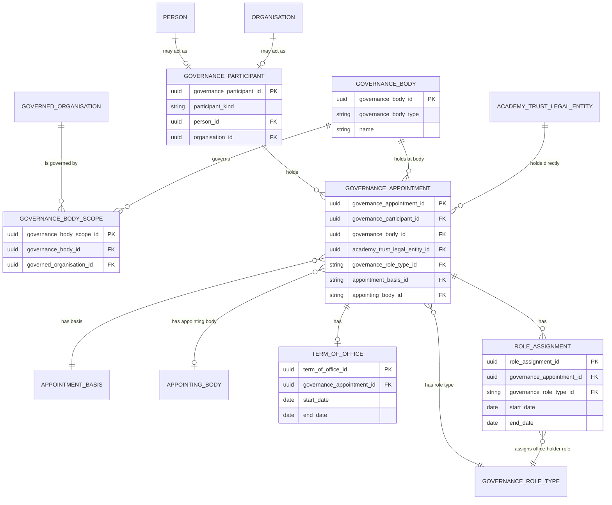

# Current Governance Appointments Logical Model

## Purpose

This is the first, deliberately small logical-model slice for governance. It records who or what holds a governance appointment, where that appointment applies, the role and basis of the appointment, and its term of office.

It does not introduce a physical database schema. It is a business-level design that can be reviewed before table, API, ontology or migration decisions are made.

Business-friendly pattern:

```text
For this person or organisation,
which governance appointment do they hold,
at which governance body or academy trust,
in what role and on what basis,
and for what term?
```

## Scope

This slice includes:

- A natural person or organisation acting as a governance participant.
- A governance body and the establishment, federation or academy trust it governs.
- A governance appointment held either at a governance body or directly at an academy trust legal entity.
- Role type, appointment basis and an optional appointing body.
- A term of office.
- A separate office-holder role assignment, such as Chair or Vice Chair.

This slice intentionally excludes constitution positions and vacancies, committee membership, meetings, declarations, training, compliance, access permissions, user accounts, company-director registrations, detailed identity data and change-event history. Those are separate concerns and must not be implied by this model.

## Methodology And Sources

The model is a logical projection of the current governance vocabulary and ontology, checked against the GovernorHub investigation. It represents the real-world governance concepts required by the stated scope, rather than reproducing GovernorHub's internal product structure.

| Source | Contribution |
|---|---|
| [Governance ontology](../../governance/governance-ontology.ttl) | Defines the structural distinction between governance participant, governance body, appointment, term, appointment basis, appointing body and role assignment. |
| [Governance vocabulary](../../governance/governance-vocabulary.ttl) | Defines the preferred business terms. |
| [Governance taxonomy](../../governance/governance-taxonomy.ttl) | Defines controlled values for appointment basis, role type and related classifications. |
| [GovernorHub conceptual model](../../../../docs/transformation/data/modelling/people/governor-hub/conceptual-model.md) | Confirms that person, appointment, term and role must remain separate, and that an academy trust is distinct from its trust board. |

## Logical Relationship Diagram



`Person`, `Organisation`, `GovernedOrganisation` and `AcademyTrustLegalEntity` are references to concepts owned by adjacent people and organisation model slices. They are included in the diagram to make the appointment boundaries clear, not to define their attributes here.

## Model-Wide Rules

- A governance participant is exactly one of a person or organisation. An organisation is needed because a corporate body can be an academy trust member.
- A governance appointment has exactly one participant.
- A governance appointment applies in exactly one place: either at one governance body or directly at one academy trust legal entity. It cannot be both and cannot be neither.
- A governance body can govern one or more establishments, federations or academy trusts. A governed organisation can have more than one governance body where its real-world arrangements require it.
- A direct appointment at an academy trust legal entity is not evidence of membership of the trust board. This supports, for example, academy trust members and appointments such as Accounting Officer or Chief Financial Officer.
- An appointment has one governance role type and one appointment basis. These must remain separate from each other and from its appointing body.
- An appointing body is optional. It is normally relevant to statutory or otherwise formally appointed roles, not every operational appointment.
- A term of office belongs to one appointment. A later reappointment is represented as a new appointment and term, preserving the prior appointment rather than overwriting it.
- A role assignment is layered on an appointment. Chair and Vice Chair are role assignments, not appointment bases and not appointment types.
- Current, future and ended appointments are derived from term dates where a term is held. This slice does not add a duplicate lifecycle-status field.

## Governance Participant

`GovernanceParticipant` is the governance-facing reference to the person or organisation that holds an appointment. It does not store a second copy of a person's profile or an organisation's legal identity.

Business-friendly pattern:

```text
Which person or organisation is the holder of this governance appointment?
```

Modelling decisions:

- Exactly one of `person_id` and `organisation_id` is populated.
- A person or organisation may hold many appointments across one or more governance scopes.
- The participant does not itself say whether somebody is a trustee, governor, member, chair or vice chair. Those are expressed through the appointment and role assignment.

| Column | Meaning |
|---|---|
| `governance_participant_id` | Stable identifier for the governance-facing participant reference. |
| `participant_kind` | Whether the participant is a person or organisation. |
| `person_id` | Reference to the person where `participant_kind` is person. |
| `organisation_id` | Reference to the organisation where `participant_kind` is organisation. |

## Governance Body

`GovernanceBody` represents the collective body in which governance appointments may be held, for example a governing body, trust board or local governing body. It is not the academy trust legal entity itself.

Business-friendly pattern:

```text
What governance body is responsible for governing this establishment,
federation or academy trust?
```

Modelling decisions:

- Governance-body type is a controlled classification, rather than a free-text label.
- A body can govern multiple organisations, as in a federation or a multi-academy trust arrangement.
- This model does not yet include committees or delegated governance structures.

| Column | Meaning |
|---|---|
| `governance_body_id` | Stable identifier for the governance body. |
| `governance_body_type` | Controlled type, for example governing body, trust board or local governing body. |
| `name` | The published or locally used name of the governance body, where one is needed. |

## Governance Body Scope

`GovernanceBodyScope` records what a governance body governs. It separates the body from the establishment, federation or academy trust in its scope.

Business-friendly pattern:

```text
Which establishment, federation or academy trust does this governance body govern?
```

Modelling decisions:

- `governed_organisation_id` references an establishment, federation or academy trust in the organisation model.
- The relationship does not turn the governance body into the governed organisation, and does not turn an academy trust into its trust board.

| Column | Meaning |
|---|---|
| `governance_body_scope_id` | Stable identifier for the governance-body scope relationship. |
| `governance_body_id` | The governance body. |
| `governed_organisation_id` | The establishment, federation or academy trust governed by that body. |

## Governance Appointment

`GovernanceAppointment` is the central fact in this slice. It says that one participant holds a particular role, on a particular basis, in one defined governance scope.

Business-friendly pattern:

```text
For this participant, what governance role do they hold,
where does it apply, and on what basis do they hold it?
```

Modelling decisions:

- The appointment holder is either `governance_body_id` or `academy_trust_legal_entity_id`, with exactly one populated.
- `governance_body_id` is used for a role held at a governing body, trust board or local governing body.
- `academy_trust_legal_entity_id` is used where the role is held directly at the academy trust company. It must not be represented as a trust-board appointment merely because the same trust has a trust board.
- `governance_role_type_id`, `appointment_basis_id` and `appointing_body_id` answer different questions and cannot be collapsed into one field.
- This table does not record company-director status. A trustee may have a legal director capacity, but that is a separate legal-registration concern.

| Column | Meaning |
|---|---|
| `governance_appointment_id` | Stable identifier for the governance appointment. |
| `governance_participant_id` | The person or organisation holding the appointment. |
| `governance_body_id` | Governance body at which the appointment is held. Mutually exclusive with `academy_trust_legal_entity_id`. |
| `academy_trust_legal_entity_id` | Academy trust company at which the appointment is held directly. Mutually exclusive with `governance_body_id`. |
| `governance_role_type_id` | Controlled role type for the appointment, such as academy trustee, academy trust member or local governor. |
| `appointment_basis_id` | Controlled basis for the appointment, such as statutory governance, delegated governance or operational employment. |
| `appointing_body_id` | Optional controlled reference to the person or body that appointed the holder. |

## Term Of Office

`TermOfOffice` gives the time boundary for an appointment when the appointment has a defined term.

Business-friendly pattern:

```text
When does this governance appointment begin and, where known, end?
```

Modelling decisions:

- A term is attached to one appointment, rather than directly to a person or governance body.
- The end date may be absent for an open-ended or ongoing appointment.
- A reappointment is a new appointment and term. The former term stays available as a historical fact.

| Column | Meaning |
|---|---|
| `term_of_office_id` | Stable identifier for the term. |
| `governance_appointment_id` | The appointment to which the term belongs. |
| `start_date` | Date the term begins. |
| `end_date` | Date the term ends, where known. |

## Role Assignment

`RoleAssignment` records an additional office-holder responsibility within an existing governance appointment. Its immediate purpose is to represent Chair and Vice Chair without treating them as appointment bases or replacing the underlying appointment role.

Business-friendly pattern:

```text
What additional office-holder responsibility does this appointment carry?
```

Modelling decisions:

- A role assignment belongs to one governance appointment.
- The assigned role must be an office-holder role type, initially Chair or Vice Chair.
- An appointment may have no office-holder responsibility, or more than one over time.
- Start and end dates allow chairing responsibilities to change without ending the underlying governance appointment.

| Column | Meaning |
|---|---|
| `role_assignment_id` | Stable identifier for the office-holder assignment. |
| `governance_appointment_id` | The appointment on which the responsibility is held. |
| `governance_role_type_id` | Controlled office-holder role type, initially Chair or Vice Chair. |
| `start_date` | Date the office-holder responsibility begins. |
| `end_date` | Date the office-holder responsibility ends, where known. |

## Controlled Reference Values

The following are controlled concepts, defined in the governance vocabulary and taxonomy rather than copied as free text into an appointment record.

| Reference concept | Used by | Purpose |
|---|---|---|
| `GovernanceRoleType` | Governance appointment and role assignment | Identifies the substantive appointment role and, for role assignments, the office-holder responsibility. |
| `AppointmentBasis` | Governance appointment | Explains the basis on which the appointment is held. |
| `AppointingBody` | Governance appointment | Identifies the optional appointing person or body. |
| `GovernanceBodyType` | Governance body | Classifies the kind of governance body. |

## Deferred Decisions

- The shared people and organisation model must decide how `GovernanceParticipant` is implemented: through a common party identifier, a constrained reference layer, or an equivalent pattern. This governance slice only requires the person-or-organisation exclusivity rule.
- The authoritative source, evidence and approval route for each appointment are not included here. They should be designed with the wider stewardship and provenance model.
- Legal company records, including Companies House director appointments, should be linked only in a later legal-entity slice. They should not be used as a substitute for academy trust member or governance-body appointment records.
