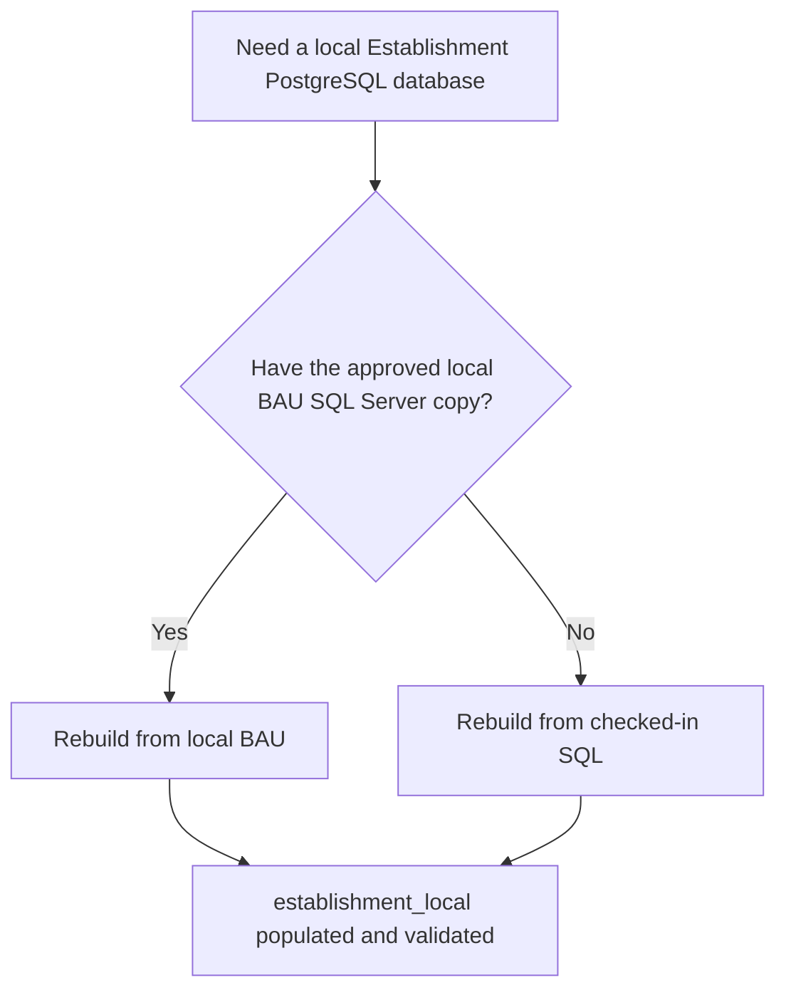

# Local Schema Automation

This directory contains the PostgreSQL physical schemas, SQL seeds and local
automation used to build the Education Provider Registry model.

## What is here

| Directory | Purpose |
| --- | --- |
| `establishment/` | Establishment PostgreSQL schema, loading SQL and validation SQL. |
| `governance/` | Governance PostgreSQL schema and migration SQL. |
| `seed/` | Checked-in reference data, sample Establishment data and the BAU selection manifest. |
| `automation/` | PowerShell commands for rebuilding local databases, extracting BAU data and validating the result. |

## Establishment rebuild paths

Choose the path that matches the data available on your machine:



| Path | Use when | Command | Detailed runbook |
| --- | --- | --- | --- |
| BAU-source rebuild | You have `gias_bau_test_local` and the local SQL Server `reader` credential. | `rebuild-establishment-from-local-bau.ps1` | [Rebuild Establishment From Local BAU](automation/rebuild-establishment-from-local-bau.md) |
| Checked-in-fixture rebuild | You do not have the BAU SQL Server copy. | `rebuild-establishment-from-checked-in-sql.ps1` | [Rebuild Establishment From Checked-in SQL](automation/rebuild-establishment-from-checked-in-sql.md) |

The BAU-source rebuild is the authoritative local refresh path. It can export
reviewed SQL fixtures for developers who use the checked-in-fixture rebuild.

## From zero to a populated local PostgreSQL database

1. Install PostgreSQL locally and create an empty database named
   `establishment_local`.

   ```powershell
   createdb.exe -h 127.0.0.1 -p 5432 -U postgres establishment_local
   ```

2. Configure the local PostgreSQL password in
   `%APPDATA%\postgresql\pgpass.conf`:

   ```text
   127.0.0.1:5432:establishment_local:postgres:<local-password>
   ```

3. From the repository root, choose one rebuild path.

   With checked-in SQL only **(Recommended)**:

   ```powershell
   powershell.exe -NoProfile -ExecutionPolicy Bypass -File ".\models\schema\automation\rebuild-establishment-from-checked-in-sql.ps1"
   ```

   With the approved local BAU copy:

   ```powershell
   powershell.exe -NoProfile -ExecutionPolicy Bypass -File ".\models\schema\automation\rebuild-establishment-from-local-bau.ps1"
   ```


4. The chosen command recreates the disposable `establishment` schema, loads
   reference and Establishment data, then validates the completed schema.

The scripts are intentionally restricted to the local
`establishment_local` database. They do not target shared environments.

## Establishment approval tests

The local Establishment schema has approval tests covering the complete data
slice for URNs `100018`, `106431` and `136102`, plus an approval test covering
the expected row count of every physical Establishment table.

The Establishment snapshots compare business data and stable reference keys;
generated surrogate UUIDs are intentionally excluded because they are expected
to change when the local schema is rebuilt.

The rebuild scripts run these tests automatically at the end of each migration.
To run them directly from the repository root:

```powershell
.\models\schema\tests\assert-establishment-approval.ps1 -Urn 100018
.\models\schema\tests\assert-establishment-approval.ps1 -Urn 106431
.\models\schema\tests\assert-establishment-approval.ps1 -Urn 136102
.\models\schema\tests\assert-establishment-row-counts.ps1
```

Approved snapshots are updated only when a data or model change is deliberate
and has been reviewed. Use the `-UpdateApproval` switch on the relevant script:

```powershell
.\models\schema\tests\assert-establishment-approval.ps1 -UpdateApproval
.\models\schema\tests\assert-establishment-approval.ps1 -Urn 136102 -UpdateApproval
.\models\schema\tests\assert-establishment-row-counts.ps1 -UpdateApproval
```

The first command updates the default approval file for URN `136102`. To
update the other approved URNs, run the same command with `-Urn 100018` and
`-Urn 106431`.

After updating an approval file, rerun the normal rebuild and review the
snapshot diff before committing it.
