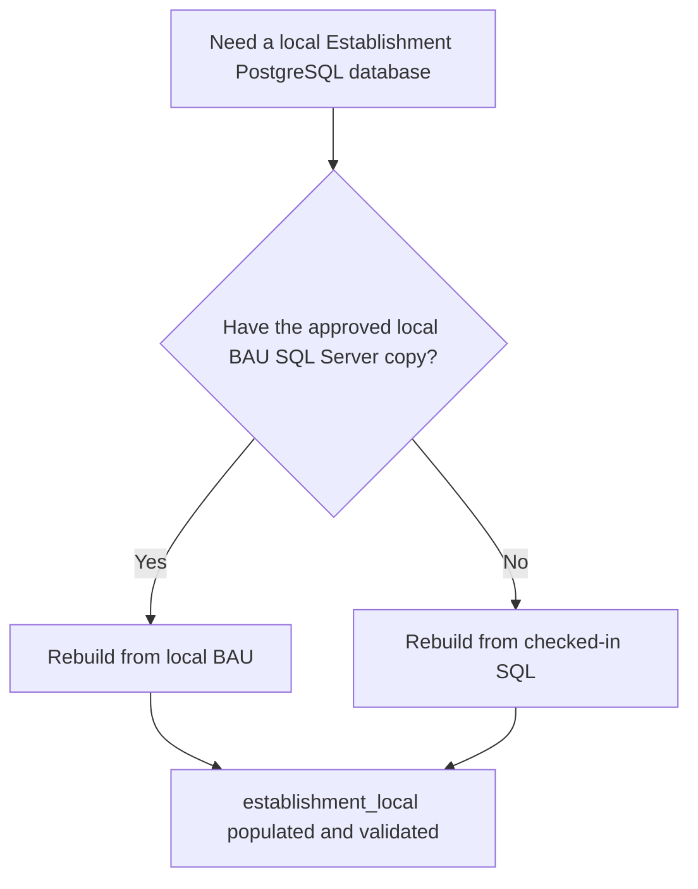

# Local Schema Automation

This directory contains the PostgreSQL physical schemas, SQL seeds and local automation used to build the Education Provider Registry model.

## What is here

| Directory | Purpose |
| --- | --- |
| `establishment/` | Establishment PostgreSQL schema, loading SQL and validation SQL. |
| `governance/` | Governance PostgreSQL schema and migration SQL. |
| `migration/` | PostgreSQL schema for migration runs, source evidence and identity-resolution records. |
| `seed/` | Checked-in reference data, sample Establishment data and the BAU selection manifest. |
| `automation/` | PowerShell commands for rebuilding local databases, extracting BAU data and validating the result. |

## Establishment rebuild paths

Choose the path that matches the data available on your machine:


```mermaid
flowchart TD
    start[Need a local Establishment PostgreSQL database] --> source{Have the approved local BAU SQL Server copy?}
    source -->|Yes| bau[Rebuild from local BAU]
    source -->|No| fixture[Rebuild from checked-in SQL]
    bau --> database[establishment_local populated and validated]
    fixture --> database
```

| Path | Use when | Command | Detailed runbook |
| --- | --- | --- | --- |
| BAU-source rebuild | You have a local BAU SQL Server copy and read-only credentials. | `rebuild-establishment-from-local-bau.ps1` | [Rebuild Establishment From Local BAU](automation/rebuild-establishment-from-local-bau.md) |
| Checked-in-fixture rebuild | You do not have the BAU SQL Server copy. | `rebuild-establishment-from-checked-in-sql.ps1` | [Rebuild Establishment From Checked-in SQL](automation/rebuild-establishment-from-checked-in-sql.md) |

## Establishment data flow and execution engines

By default, the BAU-source rebuild reads MSSQL BAU, loads PostgreSQL, runs the tests, then exports the validated PostgreSQL data as static SQL INSERT files. Custom selections and skipped-test runs do not automatically refresh the checked-in fixture. INSERT exports come from PostgreSQL, not directly from the MSSQL query results.

PowerShell coordinates the steps. MSSQL executes the source T-SQL; PostgreSQL executes the target SQL. `psql` and `pg_dump` are PostgreSQL client programs launched by PowerShell, not separate database engines.

### Rebuild from local BAU

Entry point: [rebuild-establishment-from-local-bau.ps1](automation/rebuild-establishment-from-local-bau.ps1).

```text
[PowerShell]
Read -Urn, -SelectionFile, or the default fixture manifest
Configure connections and create a temporary working directory
    |
    v
[MSSQL + PowerShell: URN-only selections]
Discover and validate supported groups before rebuilding the target
Keep organisation memberships within the supplied URNs
(Explicit group-selection manifests bypass discovery)
    |
    v
[PostgreSQL, through psql launched by PowerShell]
Recreate the local establishment and migration schemas
Load reference seeds and record the migration run
    |
    v
+-----------------------------------------------------------------+
| Repeat for geography, selected URNs and selected relationships: |
|                                                                 |
| [MSSQL]                                                         |
| Run T-SQL in establishment/transforms/                          |
| Extract and map the BAU data                                    |
|     |                                                           |
|     v                                                           |
| [PowerShell]                                                    |
| Write temporary pipe-delimited CSV files                        |
|     |                                                           |
|     v                                                           |
| [PostgreSQL client: psql -> PostgreSQL]                         |
| Run \copy to load CSV into temporary PostgreSQL tables          |
|     |                                                           |
|     v                                                           |
| [PostgreSQL]                                                    |
| Run INSERT ... SELECT, updates and load-time checks             |
| Populate Establishment tables and migration evidence            |
| Apply reviewed mappings where configured                        |
+-----------------------------------------------------------------+
    |
    v
[PostgreSQL + PowerShell]
Print the summary; run SQL tests and approval/count comparisons
With -SkipTests: omit the test suite, not load checks or constraints
    |
    v
[PostgreSQL client: pg_dump, launched by PowerShell]
Export the populated PostgreSQL data as static SQL INSERT statements
Default tested fixture: export and refresh seed/
Custom/untested run: export only with an explicit -ExportDirectory
    |
    v
[PowerShell]
Save exports to seed/ or the requested review directory
With -IncludeGovernance: rebuild/load governance_local (PostgreSQL)
Clean up working files unless -KeepFixture is supplied
```

The exported files are:

- `seed/seed-reference-data.sql` — reference data.
- `seed/seed-establishment-fixture.sql` — selected Establishment records and relationships.
- `seed/seed-migration-evidence.sql` — migration evidence for those records.

These are snapshots of the populated PostgreSQL target, retained so the local test database can be rebuilt without MSSQL.

### Rebuild from checked-in SQL

Entry point: [rebuild-establishment-from-checked-in-sql.ps1](automation/rebuild-establishment-from-checked-in-sql.ps1).

| Step | Execution engine / client | What runs and what it produces |
| --- | --- | --- |
| 1. Start the rebuild | PowerShell | Reads the selection manifest and coordinates the target rebuild. No MSSQL connection is needed. |
| 2. Recreate and load | PostgreSQL, through `psql` launched by PowerShell | Recreates the local schemas, loads reference seeds, then executes the checked-in Establishment INSERT statements and migration-evidence SQL. |
| 3. Run tests | PostgreSQL and PowerShell | Executes target SQL checks and compares approval snapshots and row counts. This path does not extract BAU data or regenerate the SQL exports. |

Both paths rebuild disposable local schemas. They are modelling and repeatable test workflows, not the incremental daily production ETL.


## From zero to a populated local PostgreSQL database

1. Install PostgreSQL locally and create an empty database named `establishment_local`.

   ```powershell
   createdb.exe -h 127.0.0.1 -p 5432 -U postgres establishment_local
   ```

2. Configure the local PostgreSQL password in `%APPDATA%\postgresql\pgpass.conf`:

   ```text
   127.0.0.1:5432:establishment_local:postgres:<local-password>
   ```

3. From the `education-provider-registry-docs` repository root, choose one rebuild path.

   With checked-in SQL only **(Recommended)**:

   ```powershell
   powershell.exe -NoProfile -ExecutionPolicy Bypass -File ".\models\schema\automation\rebuild-establishment-from-checked-in-sql.ps1"
   ```

   With the approved local BAU copy:

   ```powershell
   $bauSqlServer = 'localhost' # Your local SQL Server name or named instance.
   powershell.exe -NoProfile -ExecutionPolicy Bypass -File ".\models\schema\automation\rebuild-establishment-from-local-bau.ps1" -SqlServer $bauSqlServer
   ```

   `-SqlServer` accepts `localhost`, the developer's own machine name, or a local named instance such as `localhost\SQLEXPRESS`. Remote/shared servers remain blocked. `-SourceDatabase` defaults to `gias_bau_test_local`; another local BAU copy must use a database name ending `_local`, containing only letters, digits and underscores.

   The BAU command prompts for the local SQL Server `reader` password. Use `-UseWindowsAuthentication` when the local SQL Server is configured for Windows authentication, or `-KeepFixture` to retain extracted CSVs for troubleshooting. `-IncludeGovernance` additionally rebuilds and loads the Governance schema. Use `-ExportDirectory` to write refreshed fixtures to a review directory instead of changing `seed/`.


4. The chosen command recreates the disposable `establishment` and `migration` schemas, loads reference and Establishment data, then validates the completed schema unless the BAU rebuild is explicitly run with `-SkipTests`.

The scripts are intentionally restricted to the local `establishment_local` database. They do not target shared environments.

The scripts are thin entry points to the `EprLocalAutomation` PowerShell module. Any single step, such as one test or one establishment reload, can be run on its own by importing the module. See the [automation README](automation/README.md).

## Using a different BAU dataset and your own URNs

The checked-in tests and approval snapshots describe this repository's curated cases. They are not a generic acceptance suite for arbitrary BAU data. Changing the URNs alone does not change those expected relationships, identities or counts.

1. Query your local MSSQL copy to choose establishments that exist there:

   ```sql
   SELECT TOP (50) URN, EstablishmentName, OpenDate, CloseDate
   FROM dbo.Establishment
   ORDER BY URN;
   ```

2. Run the existing rebuild script with just your URNs and the case-specific tests disabled. Use unique integer URNs between `1` and `999999`:

   ```powershell
   $bauSqlServer = 'localhost' # Change for your local instance.
   $bauDatabase = 'gias_bau_test_local' # Or your own BAU copy named *_local.
   powershell.exe -NoProfile -ExecutionPolicy Bypass -File ".\models\schema\automation\rebuild-establishment-from-local-bau.ps1" -SqlServer $bauSqlServer -SourceDatabase $bauDatabase -Urn "109443,20338" -SkipTests
   ```

   Add `-UseWindowsAuthentication` if appropriate, or `-SqlUser` for a different read-only SQL login. This rebuilds the same disposable `establishment_local` database: existing local target data is replaced. It does not overwrite the checked-in seeds or approval snapshots.

   `-SkipTests` skips the whole Establishment test suite, including SQL fixture tests, approval snapshots and row-count comparisons. It does not bypass selection validation, source extraction checks, SQL load checks or database constraints. The migration-run notes explicitly record that tests were skipped; a completed import is not a tested/approved fixture.

3. Inspect the loaded target data. If you need SQL exports, add `-ExportDirectory "$env:TEMP\epr-my-fixture-export"` to the same command. Keep custom or untested exports separate from `seed/`. Add your own reviewed expectations before treating that dataset as validated.

Replace the example URNs with values in your source. The source must have the BAU table/column structure expected by the transforms, including geographic reference tables.

The automation discovers current academy-trust, foundation-trust and sponsor responsibilities, plus federation and children's-centre group memberships. It imports memberships **only for the supplied URNs**, never every other establishment in those groups. A group's local membership may therefore be incomplete; migration evidence records that scope. A children's-centre group's lead member is not imported unless its URN is supplied, and no replacement lead is invented.

Current links are the default. Add `-IncludeArchivedLinks` to discover archived trust/foundation/sponsor links as well. Historical federation and children's-centre memberships are not included. Unsupported group types, duplicate links, missing groups and identity conflicts require review rather than being silently accepted.

If you prefer a file, save this as `my-fixture-selection.json`, substituting your URNs, and replace `-Urn "109443,20338"` with `-SelectionFile ".\my-fixture-selection.json"`:

```json
{
  "organisationType": "establishment-fixture-set",
  "urns": [109443, 20338]
}
```

URN-only files, including older files with empty group arrays, use discovery. The checked-in manifest retains explicit relationships for the repeatable reviewed fixture; discovery does not change that default path.

Discovery finds **group links**, not independent-school proprietor identities. Reviewed proprietor overlays still need their supporting evidence. Existing reviewed person/company and SAT/MAT identity rules remain in place; discovery does not guess new identity mappings or bypass load checks.

## Establishment approval tests

The repository's selected URNs and group fixtures are defined in `seed/fixture-selection.json`. Each selected URN requires an approval snapshot; case-specific SQL tests and the row-count approval also describe that curated dataset. The scope test rejects establishments outside the selection. Use `-SelectionFile` and `-SkipTests` for a different dataset, as described above.

The Establishment snapshots compare business data and stable reference keys; generated surrogate UUIDs are intentionally excluded because they are expected to change when the local schema is rebuilt.

The rebuild scripts run these tests automatically unless the BAU rebuild uses `-SkipTests`. The examples below refer to the checked-in cases. To run them directly from the repository root:

```powershell
.\models\schema\tests\assert-establishment-approval.ps1 -Urn 136102
.\models\schema\tests\assert-establishment-approval.ps1 -Urn 134314
.\models\schema\tests\assert-establishment-approval.ps1 -Urn 135905
.\models\schema\tests\assert-establishment-row-counts.ps1
```

The T1 approval snapshot is updated only when a data or model change is deliberate and has been reviewed. Use the `-UpdateApproval` switch on the approval script:

```powershell
.\models\schema\tests\assert-establishment-approval.ps1 -UpdateApproval
.\models\schema\tests\assert-establishment-approval.ps1 -Urn 136102 -UpdateApproval
.\models\schema\tests\assert-establishment-approval.ps1 -Urn 134314 -UpdateApproval
.\models\schema\tests\assert-establishment-approval.ps1 -Urn 135905 -UpdateApproval
```

The commands update the approval file for the specified URN. Only update a snapshot after a deliberate, reviewed data or model change; then rerun the normal rebuild and review the snapshot diff before committing it.

## Establishment cases

Each extract selected by the clean test-case matrix must have a corresponding case file under `establishment/cases/`. The case is establishment-centric: it records the T reference, URN, establishment name, establishment type and the group links that make the establishment useful for the scenario. Add the case file as part of reviewing an extract, before committing the refreshed seed.

Use the T reference and URN in the filename, for example:

`establishment/cases/t1-urn-136102-co-operative-academy-stoke-on-trent.md`

For example, T20 is recorded in `establishment/cases/t20-urn-135905-manchester-creative-and-media-academy.md`.

If one T covers more than one establishment, document each URN in its own section or companion case file and keep the shared T reference explicit.
